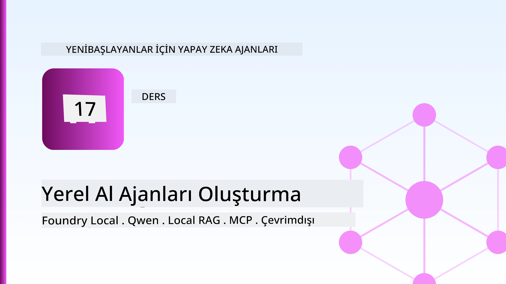
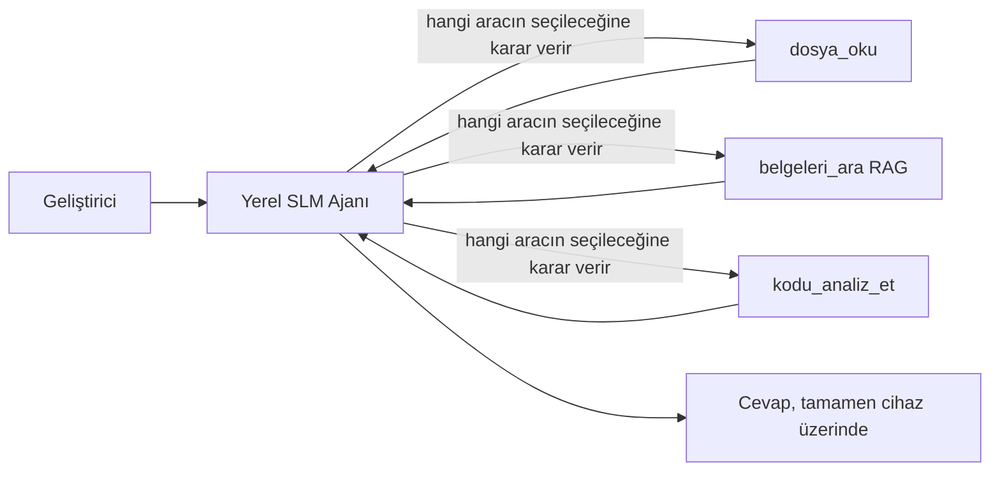
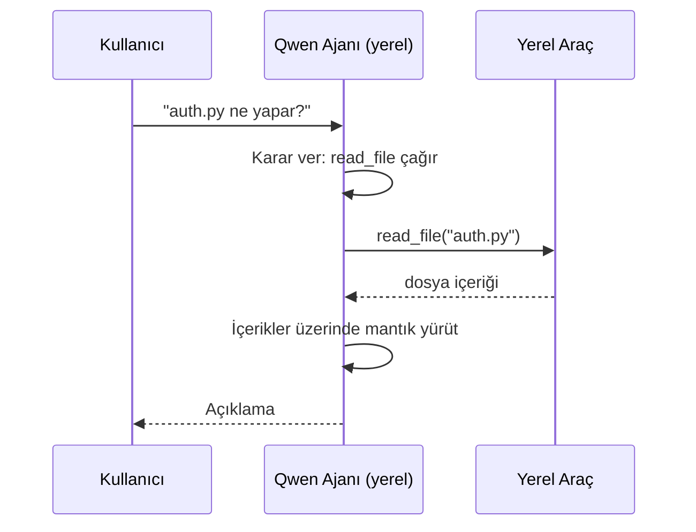
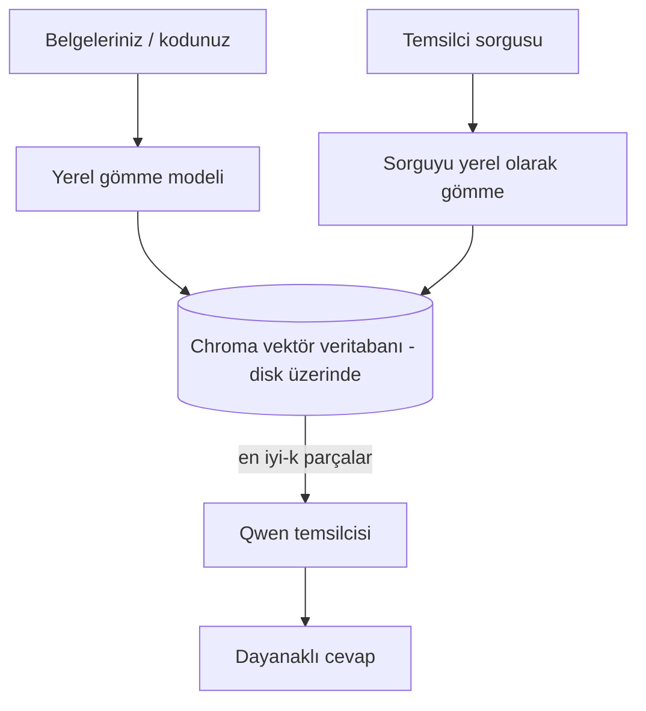

# Microsoft Foundry Local ve Qwen Kullanarak Yerel AI Ajanları Oluşturma



Önceki derste ajanlar bulutta *yükseltildi*. Bu derste ise onları tek bir makineye *indiriyoruz*. Dersin sonunda neden sonuç çıkaran, araçları çağıran, dosyalarınızı okuyan ve belgelerinizi arayan çalışan bir mühendislik asistanınız olacak — **tek bir bulut çıkarım çağrısı olmadan.**

Bunu neden istersiniz? Gerçek mühendislik işlerinde sürekli ortaya çıkan üç neden:

- **Gizlilik.** Kod ve belgeler asla makineden çıkmaz. Hiçbir istem, snippet veya müşteri verisi ağ sınırını geçmez.
- **Maliyet.** Yerel çıkarım için token başına ücret yoktur. Elektrik maliyeti karşılığında tüm gün iterasyon yapabilirsiniz.
- **Çevrimdışı.** Uçakta, güvenli bir tesiste veya bir kesinti sırasında ajan hâlâ çalışır.

Buradaki ödün, ileri teknoloji bulut modelini CPU, GPU veya NPU üzerinde çalışan **Küçük Dil Modeli (SLM)** ile değiştirmektir. Bu ders, kısıtlama yokmuş gibi davranmak yerine, o kısıtlamanın içinde *iyi* olan ajanlar inşa etmeye odaklanır.

## Giriş

Bu derste şunlar ele alınacaktır:

- **Küçük Dil Modelleri (SLM)** — ne oldukları, nerede başarılı oldukları ve nerede olmadıkları.
- **Microsoft Foundry Local** — modelleri cihazda indirip sunan ve **OpenAI uyumlu bir API** sağlayan çalışma zamanı.
- **Qwen fonksiyon çağırma modelleri** — yerel *ajanların* (sadece yerel sohbet değil) mümkün kılan güvenilir araç çağrıları üreten SLM’ler.
- **Yerel araçlar, yerel RAG ve yerel MCP** — ajana bulut olmadan yetenek kazandırmak.
- **Hibrit desenler** — ne zaman işlerin yerelde kalacağı ve ne zaman buluta erişileceği.

## Öğrenme Hedefleri

Bu dersi bitirdiğinizde bileceksiniz ki:

- SLM’lerin ödünleşmelerini açıklamak ve uygun yerel ajan kullanım senaryolarını seçmek.
- Foundry Local ile yerelde bir Qwen modelini sunmak ve OpenAI uyumlu uç noktaya bağlanmak.
- Tamamen kendi iş istasyonunuzda çalışan bir araç çağıran ajan inşa etmek.
- Yerel vektör veritabanı (Chroma) kullanarak kendi belgeleriniz üzerinde yerel RAG eklemek.
- Ajana yerel MCP sunucusuna bağlanmak ve hibrit yerel/bulut tasarımları hakkında akıl yürütmek.

## Önkoşullar

Bu derste önceki dersleri tamamlamış ve aşağıdaki konularda rahat olduğunuzu varsayıyoruz:

- [Araç Kullanımı](../04-tool-use/README.md) (Ders 4) ve [Agentic RAG](../05-agentic-rag/README.md) (Ders 5).
- [Agentic Protokoller / MCP](../11-agentic-protocols/README.md) (Ders 11).
- [Microsoft Agent Framework](../14-microsoft-agent-framework/README.md) (Ders 14).

Ayrıca şunlara ihtiyacınız olacak:

- Bir geliştirici iş istasyonu. **8 GB RAM gerçekçi minimumdur**; 16 GB+ rahattır. GPU veya NPU yardımcı olur ama zorunlu değildir.
- **Microsoft Foundry Local** yüklü (kurulum bölümü aşağıda).
- Python 3.12+ ve depo içindeki [`requirements.txt`](../../../requirements.txt) paketleri, ayrıca bu ders için `foundry-local-sdk`, `openai` ve `chromadb`.

## Küçük Dil Modelleri: Yerel Çalışma İçin Doğru Araç

İleri teknoloji bulut modeli yüzlerce milyar parametreye ve arkasında bir veri merkezine sahiptir. Bir SLM ise birkaç milyar parametreye sahiptir ve dizüstünüzün RAM’ine sığmak zorundadır. Bu fark beklentileri netleştirir.

**SLM’ler şu konularda iyidir:**

- Yapılandırılmış, sınırlı görevler — sınıflandırma, bilinen bir belgenin çıkartılması, özetlenmesi.
- **Araç çağrısı** — hangi işlevin hangi argümanlarla çağrılacağına karar verme.
- Kendi veriniz üzerinde hızlı, ucuz, gizli iterasyon.

**SLM’ler şu konularda daha zayıftır:**

- Açık uçlu, büyük bağlamda çok adımlı akıl yürütme.
- Geniş dünya bilgisi (daha az görmüş, daha çok unutmuşlar).

Yerel ajanlar için kazanan strateji şöyle: **SLM orkestrasyon yapsın, ağır işleri araçlar üstlensin.** Model kod tabanınızı *bilmek* zorunda değil — sadece `read_file` ve `search_docs` çağırması gerektiğini bilmesi gerekir. Bu, doğrudan SLM’nin güçlü yanlarına oynar.



## Microsoft Foundry Local

**Microsoft Foundry Local**, modelleri tamamen makinenizde indirip yöneten, hafif bir çalışma zamanıdır. Bizim için en önemli özelliği, bir **OpenAI uyumlu HTTP uç noktası** sunmasıdır — bu, OpenAI SDK ve Microsoft Agent Framework’ün OpenAI istemcisinin sadece `base_url` değiştirerek onunla çalışabileceği anlamına gelir. Ajan oluşturmayı öğrendiğiniz her şey doğrudan geçer; sadece uç nokta buluttan `localhost`’a geçer.

Foundry Local ayrıca donanımınıza en uygun model derlemesini otomatik seçer — CPU derlemesi, CUDA/GPU derlemesi veya NPU derlemesi — böylece her makine için el ile optimizasyon yapmanıza gerek kalmaz.

### Kurulum

Foundry Local’ı kurun (işletim sisteminize göre [belgelere](https://learn.microsoft.com/azure/ai-foundry/foundry-local/) bakın) ve çalıştığını doğrulayın:

```bash
# Kurulum (örnek; platformunuz için belgelere bakın)
winget install Microsoft.FoundryLocal      # Windows
# brew install microsoft/foundrylocal/foundrylocal   # macOS

# Bir Qwen modeli indirin ve çalıştırın, ardından yerel servisi başlatın
foundry model run qwen2.5-7b-instruct
foundry service status
```

Hizmet çalışmaya başladıktan sonra yerel ve OpenAI uyumlu bir uç noktanız olur (genellikle `http://localhost:PORT/v1`). Not defteri, `foundry-local-sdk` kullanarak uç noktayı otomatik keşfeder, böylece portu sabit kodlamak zorunda kalmazsınız.

## Qwen Fonksiyon Çağrısı: Neden Önemlidir?

Bir ajan ancak araç çağırabiliyorsa ajandır. Pek çok SLM sohbet yapabilir ama güvenilir, doğru biçimde araç çağrısı üretemez. **Qwen** modelleri fonksiyon çağrısı için eğitilmiş olup iyi biçimlendirilmiş araç çağrısı yapıları tutarlı biçimde üretir — bu, yerel sohbet modelini yerel *ajan* yapan şeydir.

Akış, bildiğiniz standart araç çağırma döngüsüdür, sadece cihazda çalışır:



## Yerel RAG

Belge arama, yerel ajanların değerini gösterdiği alandır. SLM’nin çerçevenizin belgelerini ezberlemesini ummak yerine, bu belgeleri **yerel bir vektör veritabanına** gömüyorsunuz ve ajan ilgili parçaları isteğe bağlı olarak getiriyor.

Bir yönetici sunucusu olmayan, işlem içinde çalışan gömülü bir vektör deposu olan **Chroma** kullanıyoruz. Boru hattı tamamen yerel: yerel yerleştirme modeli → yerel vektörler → yerel getirme → yerel SLM.



Bu, Ders 5’teki aynı Agentic RAG desenidir — tek fark, her bileşenin makinenizde çalışmasıdır.

## Yerel MCP Sunucuları

[MCP](../11-agentic-protocols/README.md) bir bulut servisi değil, bir taşıma protokolüdür. Bir MCP sunucusu `stdio` üzerinde yerel bir işlem olarak çalışabilir ve standart protokol aracılığıyla araçları ajana sunar. Bu, dosya sistemi erişimi, git işlemleri, veritabanı sorguları gibi giderek büyüyen MCP sunucu ekosistemini tamamen çevrimdışı şekilde yeniden kullanmanıza izin verir.

Güvenlik durumu buluttan farklıdır ama yok değildir: yerel MCP sunucusu hâlâ kullanıcı izinleri ile çalışır, bu yüzden erişimi sınırlandırın (örneğin bir proje dizini, tüm ev klasörünüz değil) ve çıktıları girdiler olarak değerlendirip doğrulayın.

## Hibrit Bulut ve Yerel Desenler

Yerel öncelikli olmak yerel ile sınırlı olmak anlamına gelmez. Olgun sistemler duyarlılık ve zorluk düzeyine göre yönlendirme yapar:

| Durum | Nerede çalışır |
| --- | --- |
| Hassas kod / veri veya çevrimdışı | **Yerel SLM** |
| Basit, sınırlandırılmış görev | **Yerel SLM** (ucuz, hızlı) |
| Zor çok adımlı akıl yürütme, hassas olmayan veride | **Bulut modeli** |
| Bir kesinti sırasında her şey | **Yerel SLM** (kısmi işlevsellik) |

Bu, Ders 16’daki **model yönlendirme** fikrini yansıtır — ancak modellerden biri artık sizin kendi makinenizdir. Robus bir tasarım, bulut erişilemiyorsa yerel modele geri döner, böylece ajan tamamen başarısız olmak yerine kalite düşüşü yaşar.


## Uygulamalı Laboratuvar: Yerel Bir Mühendislik Asistanı

[`code_samples/17-local-agent-foundry-local.ipynb`](./code_samples/17-local-agent-foundry-local.ipynb) dosyasını açın ve takip edin. Tamamen kendi iş istasyonunuzda çalışan bir **yerel mühendislik asistanı** inşa edeceksiniz; yapabilecekleri:

1. **Araçları çağırmak** — Qwen fonksiyon çağrısı kullanarak Foundry Local üzerinden.
2. **Yerel dosya işlemleri yapmak** — bir proje dizinindeki dosyaları listelemek ve okumak.
3. **Kodu analiz etmek** — kaynak bir dosya hakkında temel metrikler raporlamak.
4. **Belge araması yapmak** — Chroma ile bir doküman klasörü üzerinde yerel RAG.
5. **MCP kullanmak** — yerel bir MCP sunucusuna bağlanmak (yoksa zarifçe geçmek).

Herhangi bir noktada bulut çıkarımı kullanılmaz.

### İzlenim

Asistan, OpenAI uyumlu uç nokta aracılığıyla Foundry Local’a bağlanır, bu yüzden ajan kodu bulut derslerine neredeyse tamamen benzerdir — sadece istemci değişir:

```python
from foundry_local import FoundryLocalManager
from openai import OpenAI

# Foundry Local modeli keşfeder/indirir ve bize yerel bir uç nokta sağlar.
manager = FoundryLocalManager(\"qwen2.5-7b-instruct\")
client = OpenAI(base_url=manager.endpoint, api_key=manager.api_key)  # api_key yerel bir yer tutucudur
```

Araçlar normal Python fonksiyonlarıdır ve bir proje dizinine sınırlandırılmıştır:

```python
def read_file(path: str) -> str:
    \"\"\"Read a file, but only inside the sandboxed project directory.\"\"\"
    full = (PROJECT_ROOT / path).resolve()
    if PROJECT_ROOT not in full.parents and full != PROJECT_ROOT:
        return \"Access denied: path is outside the project directory.\"
    return full.read_text(encoding=\"utf-8\")
```

Sandbox kontrolüne dikkat edin — yerelde bile, rastgele yolları okuyan bir araç bir risk oluşturur. Not defteri tüm araçları tek bir proje köküne sınırlar.

## Bilgi Kontrolü

Atanmaya geçmeden önce anlayışınızı test edin.

**1. Bir ajanı bulutta değil de yerelde çalıştırmak için iki somut neden verin.**

<details>
<summary>Cevap</summary>

Herhangi iki neden: **gizlilik** (kod ve veriler makineden hiç çıkmaz), **maliyet** (token başına çıkarım ücreti yok), ve **çevrimdışı çalışma** (ağ olmadan - uçakta, güvenli tesiste veya kesinti sırasında çalışır). Veri cihaz dışına gönderimini yasaklayan düzenleyici/uyumluluk kısıtlamaları gizlilik sebebinin yaygın bir kaynağıdır.
</details>

**2. Yerel bir ajanda SLM ile araçlar arasındaki önerilen görev dağılımı nedir ve neden?**

<details>
<summary>Cevap</summary>

SLM **orkestrasyon yapmalıdır** (hangi aracın çağrılacağını ve hangi argümanlarla yapılacağını kararlaştırır) ve **araçlar ağır işleri yapmalıdır** (dosyaları okumak, belgeleri çekmek, sonuçları hesaplamak). SLM’ler araç seçimi gibi sınırlandırılmış kararlarda güçlü ama geniş bilgi ve çok adımlı akıl yürütmede zayıftır; araçlara dayanmak güçlü yanlarını kullanır.
</details>

**3. Foundry Local ile bulut ajan kodlarının yeniden kullanılmasına ne olanak sağlar?**

<details>
<summary>Cevap</summary>

Foundry Local bir **OpenAI uyumlu HTTP uç noktası** sunar. OpenAI SDK ve Agent Framework’ün OpenAI istemcisi sadece `base_url` değiştirerek (ve yerel geçici API anahtarı kullanarak) onunla çalışır. Ajan kodunun geri kalanı aynı kalır.
</details>

**4. Neden herhangi bir SLM değil de özellikle Qwen fonksiyon çağırma modeli kullanıyoruz?**

<details>
<summary>Cevap</summary>

Çünkü bir ajanın güvenilir, iyi biçimlendirilmiş **araç çağrıları** üretmesi gerekir. Birçok SLM sohbet edebilir ama hatalı veya tutarsız araç çağrısı yapıları üretir. Qwen modelleri fonksiyon çağrısı için eğitilmiş ve tutarlı araç çağrıları üretir; bu da yerel sohbet modelini çalışan bir yerel ajana dönüştürür.
</details>

**5. Yerel RAG boru hattında hangi bileşenler makinede çalışır?**

<details>
<summary>Cevap</summary>

Hepsi: yerleştirme modeli, vektör veritabanı (Chroma, disk üzerinde), getirme adımı ve SLM. Belgeler yerelde gömülür, yerelde depolanır, yerelde getirilir ve yerel model tarafından mantıksal olarak işlenir — hiçbir bileşen buluta dokunmaz.
</details>

**6. Yerel bir MCP sunucusu makinenizde çalışıyor. Bu onu otomatik olarak güvenli yapar mı? Hangi önlemi almalısınız?**

<details>
<summary>Cevap</summary>

Hayır. Yerel MCP sunucusu kullanıcı izinlerinizle çalışır, dolayısıyla sizin erişebildiğiniz her şeye erişebilir. Gerekli alanla sınırlandırın (örneğin bütün ev klasörünüz yerine tek bir proje dizini) ve çıktıları girdiler olarak değerlendirip doğrulayın.
</details>

**7. Yerel modeli içeren mantıklı bir hibrit yönlendirme kuralı tanımlayın.**

<details>
<summary>Cevap</summary>

Hassas veya çevrimdışı istekleri yerel SLM’ye, basit sınırlandırılmış görevleri hız ve maliyet için yerel SLM’ye, zor çok adımlı düşünmeyi hassas olmayan veride bulut modeline, bulut kullanılabilir değilse yedek olarak yerel SLM’ye yönlendirin— böylece ajan kibarca kaliteden ödün verir, tamamen başarısız olmaz. Bu, modellerden biri yerel makine olan model yönlendirmedir (Ders 16).
</details>

**8. Bu derste yerel ajanı çalıştırmak için gerçekçi minimum RAM miktarı nedir ve daha fazla RAM size ne sağlar?**

<details>
<summary>Cevap</summary>

Yaklaşık **8 GB** gerçekçi minimumdur; 16 GB+ rahattır. Daha fazla RAM daha büyük, daha yetenekli modellerin çalışmasına ve daha fazla bağlamın bellekte tutulmasına izin verir. GPU veya NPU çıkarımı hızlandırır ama zorunlu değildir — Foundry Local hızlandırıcı yoksa CPU sürümü seçer.
</details>

## Ödev

Yerel mühendislik asistanını seçtiğiniz küçük bir proje için **yerel belge inceleyicisine** genişletin (isterseniz bu deponun ders klasörlerinden birini kullanabilirsiniz).

Teslimatınız şunları içermelidir:

1. Bir gerçek docs/kod klasörünü Chroma’ya dizinleyin (en az beş dosya).
2. Projeyi `TODO`/`FIXME` yorumları için tarayan ve dosya ile satır numarasıyla dönen bir `find_todos` aracı ekleyin — `read_file` ile aynı sandbox kontrolünü koruyarak.

3. Aracın araçları birleştirmesini gerektiren üç soru **sorun**: bir saf RAG sorusu, belirli bir dosyayı okumayı gerektiren bir soru ve TODO'ları bulmayı gerektiren bir soru.
4. **Ölçüm yapın**: üç yanıtın her birini zamanlayın ve bunları bir markdown hücresinde not edin. Gecikmenin amaçlanan iş akışınız için kabul edilebilir olup olmadığına dair yorum yapın.

Ardından, bu inceleyici için **buluta neyi taşıyacağınızı ve neyi yerel tutacağınızı** ve nedenini açıklayan kısa bir paragraf yazın. Yerel bileşenlerin doğru şekilde birbirine bağlanıp bağlanmadığı ve hibrit akıl yürütmenizin sağlamlığı üzerinden değerlendirilirsiniz — model kalitesi üzerinden değil.

## Özet

Bu derste tamamen kendi makinenizde çalışan bir ajan oluşturdunuz:

- **SLM'ler**, kapsamı gizlilik, maliyet ve çevrimdışı çalışma için değiş tokuş eder — ve tüm bilgiyi kendileri taşımaktansa **araçları düzenlediklerinde** parlak performans gösterirler.
- **Foundry Local**, modelleri cihazda **OpenAI uyumlu bir uç noktanın** arkasında sunar, böylece bulut ajan kodunuz tek satırlık bir değişiklikle transfer olur.
- **Qwen fonksiyon çağırma modelleri**, güvenilir yerel araç çağrımını — ve dolayısıyla yerel *ajanları* — mümkün kılar.
- **Yerel RAG** (Chroma) ve **yerel MCP**, ajanı makineden ayrılmadan yeteneklerle donatır.
- **Hibrit desenler**, hassasiyet ve zorluk bazında yönlendirme yapmanızı sağlar, yerel ise zarif bir yedek seçenektir.

Bu, dağıtım döngüsünü tamamlar: 16. Ders ajanları Microsoft Foundry'ye ölçeklendirdi, bu ders ise onları tek bir iş istasyonuna ölçeklendirdi. Bir sonraki ders ise dağıtılan ajanların güvenli tutulmasına odaklanır.

## Ek Kaynaklar

- <a href="https://learn.microsoft.com/azure/ai-foundry/foundry-local/" target="_blank">Microsoft Foundry Local belgeleri</a>
- <a href="https://learn.microsoft.com/azure/ai-foundry/what-is-azure-ai-foundry" target="_blank">Microsoft Foundry belgeleri</a>
- <a href="https://learn.microsoft.com/en-us/agent-framework/overview/?wt.mc_id=youtube_26688_organicsocial_reactor&pivots=programming-language-python" target="_blank">Microsoft Agent Framework</a>
- <a href="https://qwen.readthedocs.io/en/latest/framework/function_call.html" target="_blank">Qwen fonksiyon çağırma belgeleri</a>
- <a href="https://modelcontextprotocol.io/" target="_blank">Model Context Protocol (MCP)</a>
- <a href="https://docs.trychroma.com/" target="_blank">Chroma vektör veritabanı</a>

## Önceki Ders

[Ölçeklenebilir Ajanların Dağıtımı](../16-deploying-scalable-agents/README.md)

## Sonraki Ders

[Yapay Zeka Ajanlarının Güvenliği](../18-securing-ai-agents/README.md)

---

<!-- CO-OP TRANSLATOR DISCLAIMER START -->
**Feragatname**:
Bu belge, AI çeviri hizmeti [Co-op Translator](https://github.com/Azure/co-op-translator) kullanılarak çevrilmiştir. Doğruluk için çaba sarf etsek de, otomatik çevirilerin hata veya yanlışlık içerebileceğini lütfen unutmayınız. Orijinal belge, kendi dilinde yetkili kaynak olarak kabul edilmelidir. Kritik bilgiler için profesyonel insan çevirisi önerilir. Bu çevirinin kullanımı sonucu ortaya çıkabilecek yanlış anlamalardan veya yanlış yorumlamalardan sorumlu değiliz.
<!-- CO-OP TRANSLATOR DISCLAIMER END -->