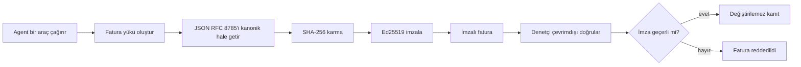
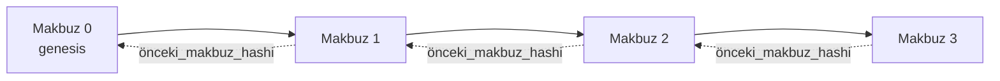

[Ders videosunu izleyin: Kriptografik Makbuzlarla AI Ajanlarının Güvenliği](https://youtu.be/PLACEHOLDER_VIDEO_ID)

> _(Ders videosu ve küçük resmi Microsoft içerik ekibi tarafından birleştirme sonrası eklenecektir, ders 14 / 15 örüntüsüne uygun olarak.)_

# Kriptografik Makbuzlarla AI Ajanlarının Güvenliği

## Giriş

Bu ders aşağıdakileri kapsayacaktır:

- AI ajanlar için denetim izlerinin uyumluluk, hata ayıklama ve güven açısından neden önemli olduğu.
- Bir kriptografik makbuzun ne olduğu ve imzasız bir günlük satırından nasıl farklı olduğu.
- Bir ajanın araç çağrısı için imzalı bir makbuzun sade Python ile nasıl üretileceği.
- Makbuzun çevrimdışı nasıl doğrulanacağı ve tahrifatın nasıl tespit edileceği.
- Makbuzların zincirlenmesi; birini kaldırmanın veya sırasını değiştirmenin nasıl zinciri bozduğu.
- Makbuzların neyi kanıtladığı ve açıkça neyi kanıtlamadığı.

## Öğrenme Hedefleri

Bu dersi tamamladıktan sonra şunları bileceksiniz:

- Ajan eylemleri için kriptografik kökenin motivasyonunu sağlayan başarısızlık modlarını belirlemek.
- Kanonik JSON yükü üzerinde Ed25519 imzalı makbuz üretmek.
- Yalnızca imzalayanın genel anahtarını kullanarak makbuzu bağımsız şekilde doğrulamak.
- Değiştirilmiş bir makbuzda doğrulamayı yeniden çalıştırarak tahrifatı tespit etmek.
- Makbuzlardan oluşan bir karma zincir dizisi oluşturmak ve zincirin neden önemli olduğunu açıklamak.
- Makbuzların kanıtladığı (atama, bütünlük, sıralama) ile kanıtlamadığı (eylemin doğruluğu, politikanın sağlamlığı) arasındaki sınırı fark etmek.

## Sorun: Ajanınızın Denetim İzleri

Diyelim ki Contoso Travel için bir AI ajanı dağıttınız. Ajan müşteri taleplerini okuyor, uçuş API’sini çağırıyor ve müşterinin adına koltuk rezervasyonu yapıyor. Geçen çeyrekte ajanın işlettiği rezervasyon sayısı 50.000.

Bugün bir denetçi geliyor. Basit bir soru soruyor: "Ajanınızın yaptığı işleri gösterin."

Siz de günlük dosyalarınızı veriyorsunuz. Denetçi dosyaları inceliyor ve zor bir soru soruyor: "Bu günlüklerin değiştirilmediğini nasıl bilebilirim?"

Bu denetim izi (audit trail) sorunudur. Bugün birçok ajan dağıtımı şuna dayanır:

- **Uygulama günlükleri**: Ajan tarafından yazılır, dosya sistemi erişimi olan herkes tarafından değiştirilebilir.
- **Bulut günlükleme servisleri**: Platform düzeyinde tahrifata karşı koruma sağlar ama sadece denetçi platform operatörüne güveniyorsa.
- **Veritabanı işlem günlükleri**: Veritabanı değişiklikleri için uygundur ama rastgele araç çağrıları için uygun değildir.

Hiçbiri denetçinin sorusunu, denetçinin birine (size, bulut sağlayıcınıza, veritabanı satıcınıza) güvenmesini gerektirmeden yanıtlayamaz. İç kullanım için bu güven genellikle kabul edilebilir. Düzenlemeye tabi iş yükleri (finans, sağlık, EU AI Yasasına tabi her şey) için kabul edilmez.

Kriptografik makbuzlar bunu her ajan eylemini bağımsızca doğrulanabilir kılarak çözer. Denetçinin size güvenmesi gerekmez. Yalnızca genel anahtarınıza ve makbuza ihtiyacı vardır.

## Kriptografik Makbuz Nedir?

Bir makbuz, ajanın ne yaptığını kayıt eden, dijital imza ile imzalanmış bir JSON nesnesidir.



Minimal bir makbuz şöyle görünür:

```json
{
  "type": "agent.tool_call.v1",
  "agent_id": "contoso-travel-bot",
  "tool_name": "lookup_flights",
  "tool_args_hash": "sha256:a3f9c1...",
  "result_hash": "sha256:7b2e1d...",
  "policy_id": "contoso-travel-policy-v3",
  "timestamp": "2026-04-25T14:30:00Z",
  "sequence": 47,
  "previous_receipt_hash": "sha256:9d4e6a...",
  "signature": {
    "alg": "EdDSA",
    "sig": "c5af83...",
    "public_key": "8f3b2c..."
  }
}
```

Üç özellik işi yapar:

1. **İmza**. Makbuz, ajanın geçidi tarafından Ed25519 özel anahtarıyla imzalanır. Karşılık gelen genel anahtara sahip herkes imzayı çevrimdışı doğrulayabilir. Herhangi bir alanı değiştirmek imzayı geçersiz kılar.

2. **Kanonik kodlama**. İmzalamadan önce makbuz JSON Kanonizasyon Şeması (JCS, RFC 8785) ile serileştirilir. Bu, aynı mantıksal makbuzu üreten iki farklı uygulamanın bayt bazında aynı çıktıyı üretmesini sağlar. Kanonizasyon olmazsa, farklı JSON serileştiricileri aynı içerik için farklı imzalar üretirdi.

3. **Karma zincirleme**. `previous_receipt_hash` alanı her makbuzu öncekine bağlar. Bir makbuzun silinmesi veya sırasının değiştirilmesi ardından gelen tüm makbuzları bozar. Bireysel imzalar atlatılsa bile tahrifat zincir seviyesinde görünür olur.

Bu özellikler birlikte üç garanti sağlar:

- **Atama**: Bu anahtar bu içeriği imzaladı.
- **Bütünlük**: İçerik imzalandığı zamandan beri değişmedi.
- **Sıralama**: Bu makbuz zincirde o makbuzdan sonra geldi.

## Python ile Makbuz Üretme

Makbuz üretmek için özel bir kütüphane gerekmez. Kriptografik primitifler yaygın olarak mevcuttur; mantık birkaç düzine satır Python kodudur.

`code_samples/18-signed-receipts.ipynb` dosyasındaki uygulamalı egzersizler tüm akışı adım adım anlatır. Özet hali:

```python
import json
import hashlib
import base64
from nacl import signing
from jcs import canonicalize  # RFC 8785 kanonik JSON

def b64url_nopad(data: bytes) -> str:
    return base64.urlsafe_b64encode(data).decode("ascii").rstrip("=")

def sha256_canonical(obj) -> str:
    """SHA-256 of a Python object's JCS-canonical JSON form."""
    return f"sha256:{hashlib.sha256(canonicalize(obj)).hexdigest()}"

# Bir imzalama anahtarı oluşturun veya yükleyin (üretimde, bir anahtar kasasında saklayın)
signing_key = signing.SigningKey.generate()
verify_key = signing_key.verify_key

# Makbuz yükünü oluştur (henüz imza yok)
tool_args = {"origin": "SYD", "destination": "LAX"}
tool_result = [{"flight": "QF11", "price": 1850, "stops": 0}]

payload = {
    "type": "agent.tool_call.v1",
    "agent_id": "contoso-travel-bot",
    "tool_name": "lookup_flights",
    "tool_args_hash": sha256_canonical(tool_args),
    "result_hash": sha256_canonical(tool_result),
    "policy_id": "contoso-travel-policy-v3",
    "timestamp": "2026-04-25T14:30:00Z",
    "sequence": 0,
    "previous_receipt_hash": None,
}

# Kanonikleştir, hashle, imzala.
canonical_bytes = canonicalize(payload)
message_hash = hashlib.sha256(canonical_bytes).digest()
signature_bytes = signing_key.sign(message_hash).signature

# Yapılandırılmış bir imza nesnesi ekle.
receipt = {
    **payload,
    "signature": {
        "alg": "EdDSA",
        "sig": b64url_nopad(signature_bytes),
        "public_key": b64url_nopad(bytes(verify_key)),
    },
}
```

İmzalama hattı tamamen bu kadar. Defterdeki egzersizler her adımı kapsamlıca gösterir.

## Makbuzu Doğrulama ve Tahrifat Tespiti

Doğrulama işlemi tersidir:

```python
import base64
import hashlib
from nacl import signing
from nacl.exceptions import BadSignatureError
from jcs import canonicalize

def b64url_decode(s: str) -> bytes:
    padding = "=" * ((4 - len(s) % 4) % 4)
    return base64.urlsafe_b64decode(s + padding)

def verify_receipt(receipt: dict) -> bool:
    # İmza yapılandırılmış bir nesnedir: {"alg", "sig", "public_key"}.
    sig_obj = receipt.get("signature")
    if not sig_obj or sig_obj.get("alg") != "EdDSA":
        return False

    # Aslında imzalanan yükü yeniden oluşturun (imza hariç her şey).
    payload = {k: v for k, v in receipt.items() if k != "signature"}

    canonical_bytes = canonicalize(payload)
    message_hash = hashlib.sha256(canonical_bytes).digest()

    try:
        verify_key = signing.VerifyKey(b64url_decode(sig_obj["public_key"]))
        verify_key.verify(message_hash, b64url_decode(sig_obj["sig"]))
        return True
    except BadSignatureError:
        return False
```

Bu fonksiyon bir makbuz alır ve imza geçerliyse `True`, değilse `False` döner. Ağ çağrısı, servis bağımlılığı veya üçüncü bir tarafa güven gerekmez.

Tahrifat tespitini görmek için defter şunları uygular:

1. Geçerli bir makbuz üretir ve doğrulamanın başarılı olduğunu teyit eder.
2. `tool_args_hash` alanındaki bir baytı değiştirir.
3. Doğrulamayı yeniden çalıştırır ve başarısız olduğunu görür.

Bu, makbuzların tahrifata karşı korumalı olduğunun pratik kanıtıdır: En ufak değişiklik bile imzayı bozar.

## Çok Adımlı Ajanlar için Makbuz Zincirleme

Tek bir imzalı makbuz bir eylemi korur. Makbuz zinciri ise bir diziyi korur.



Her makbuz kendisinden önceki makbuzun karma değerini kaydeder. Bir saldırgan, zincirin ortasındaki 2 numaralı makbuzu sessizce kaldırmak isterse:

- Makbuz 3'ün `previous_receipt_hash` alanını değiştirmesi gerekir (bu makbuz 3'ün imzasını bozar), VEYA
- Değiştirilmiş bir makbuz 3 için yeni bir imza sahtecilik yapması gerekir (ajanın özel anahtarını gerektirir).

Özel anahtar donanımsal anahtar kasasında ise ve siz her makbuzla genel anahtarı yayımlıyorsanız, bu saldırıların hiçbiri fark edilmeden yapılamaz.

Defterde şunlar gösterilir:

1. Üç makbuzdan oluşan bir zincir oluşturmak.
2. Her makbuzun `previous_receipt_hash` değerinin önceki makbuzun gerçek karmasıyla eşleştiğini doğrulamak.
3. Zincirin tam da o noktada bozulduğunu görmek için ortadaki bir makbuzu tahrif etmek.

Bu, dış denetçinin size güvenmeden doğrulayabileceği bir denetim izi üretme yöntemidir.

## Makbuzların Kanıtladıkları (ve Kanıtlamadıkları)

Bu, dersin en önemli bölümüdür. Makbuzlar güçlüdür ama güçleri sınırlıdır.

**Makbuzlar üç şeyi kanıtlar:**

1. **Atama**: Belirli bir anahtar belirli yükü imzaladı.
2. **Bütünlük**: Yük, imzalandığı zamandan beri değişmedi.
3. **Sıralama**: Bu makbuz o makbuzdan sonra geldi karma zincirinde.

**Makbuzlar KANITLAMAZ:**

1. **Doğruluk**: Ajanın eyleminin doğru eylem olduğunu. Makbuz yanlış bir yanıt için de tıpkı doğru olan gibi temiz imzalanabilir.
2. **Politika uyumu**: `policy_id` ile belirtilen politikanın gerçekten değerlendirildiğini veya kontrol edilseydi bu eyleme izin verileceğini. Makbuz kaydeder ne iddia edildiğini, ne uygulandığını değil.
3. **Anahtardan öte kimlik**: Makbuz "bu anahtar bu içeriği imzaladı" der. "Bu insan yetkilendirdi" demez. Bir anahtarı kişiye veya kuruluşa bağlamak ayrı kimlik altyapısı gerektirir (dizin, genel anahtar kaydı vb.).
4. **Girdilerin doğruluğu**: Ajan manipüle edilmiş bir istem alır ve buna göre hareket ederse, makbuz eylemi doğru şekilde kaydeder. Makbuzlar girdiyi doğrulamanın alternatifi değil, sonrasındadır.

Bu sınır iki nedenle önemlidir:

- Makbuzların ne işe yaradığını söyler: ajan davranışını denetlenebilir ve tahrifata karşı korumalı yapmak, hatta organizasyon sınırları ötesinde.
- Hangi ek katmanlara hala ihtiyacınız olduğunu belirtir: giriş doğrulama (Ders 6), politika uygulama (aşağıda kısaca değinildi), kimlik altyapısı (bu ders dışında).

Yaygın hata, "makbuzlarımız var" demenin "yönetiliyoruz/kontrol altındayız" anlamına geldiğini varsaymaktır. Böyle değildir. Makbuzlar temel oluşturur. Yönetim ise üzerine inşa ettiğiniz sistemdir.

## Üretim Referansları

Bu derste Python kodu bilinçli olarak minimaldir böylece her satırı okuyup tam olarak ne olduğunu anlayabilirsiniz. Üretimde iki seçeneğiniz vardır:

1. **Kriptografik primitifler üzerine doğrudan inşa edin.** Yukarıda gördüğünüz yaklaşık 50 satır birçok kullanım durumu için yeterlidir. PyNaCl (Ed25519) ve `jcs` paketi (kanonik JSON) iyi bakımı yapılan ve denetlenen kütüphanelerdir.

2. **Üretim makbuz kütüphanesi kullanın.** Birkaç açık kaynak proje aynı deseni ek özelliklerle uygular (anahtar dönüşümü, toplu doğrulama, JWK Set dağıtımı, politika motorları ile entegrasyon):
   - Bu derste kullanılan makbuz formatı IETF İnternet Taslağıdır (`draft-farley-acta-signed-receipts`), şu anda standart sürecindedir.
   - Microsoft Agent Governance Toolkit, makbuzları Cedar tabanlı politika kararlarıyla birleştirir; bu depo içindeki Eğitim 33’te uçtan uca örnek bulunur.
   - `protect-mcp` (npm) ve `@veritasacta/verify` (npm) paketleri, her MCP sunucusunu tahrifat geçirmez denetim iziyle sarmak için Node tabanlı makbuz imzalama ve çevrimdışı doğrulama sağlar.

Kendi JWT kütüphanenizi yazmakla test edilmiş birini kullanmak arasındaki seçim gibi, kendi makbuz kütüphanenizi yapmak veya hazır kullanmak arasında da tercihtir: Her ikisi de makuldür; kütüphane zaman kazandırır ve denetim yüzeyini küçültür; baştan yazmak her primitifin anlaşılmasını zorunlu kılar. Bu ders baştan yazma yolunu öğretir böylece her iki seçeneğin temeline sahip olabilirsiniz.

## Bilgi Kontrolü

Uygulama egzersizine geçmeden önce anlayışınızı test edin.

**1. Bir makbuz ajanın özel Ed25519 anahtarıyla imzalanır. Denetçinin yalnızca genel anahtarı vardır. Denetçi makbuzu çevrimdışı doğrulayabilir mi?**

<details>
<summary>Cevap</summary>

Evet. Ed25519 doğrulaması yalnızca genel anahtarı ve imzalanan baytları gerektirir. Ağ çağrısı, servis bağımlılığı yoktur. Bu, makbuzları izole ortamlar, çoklu organizasyonlar veya düşük güvene dayalı denetim ayarlarında faydalı yapan özelliktir.
</details>

**2. Bir saldırgan makbuzun `policy_id` alanını daha izin verici bir politika olduğunu iddia edecek şekilde değiştirir. İmza ise orijinal yük üzerinden hesaplanmıştır. Doğrulamada ne olur?**

<details>
<summary>Cevap</summary>

Doğrulama başarısız olur. İmza orijinal yükün kanonik baytları üzerinde hesaplanmıştı; herhangi bir alan değişikliği kanonik baytları, dolayısıyla SHA-256 karmasını değiştirir ve imzayı geçersiz kılar. Saldırgan geçerli yeni bir imzayı özel anahtar olmadan üretemez.
</details>

**3. Makbuzda neden ham argümanlar ve sonuçlar yerine `tool_args_hash` ve `result_hash` bulunur?**

<details>
<summary>Cevap</summary>

İki neden vardır. Birincisi, makbuz arşivlenebilir veya iletilebilir ve ham içeriğin (KİB, iş verisi) sızması sorun olabilir. Hashleme makbuzu küçük tutar ve içeriği gizli kılar; denetçi hashin ayrı bir yerde saklanan gerçek içerikle eşleştiğini doğrular. İkincisi, hashler sabit boyuttadır; hashli makbuz büyük giriş ve çıkışlara rağmen boyut sınırı getirir.
</details>

**4. `previous_receipt_hash` alanı her makbuzu öncekine bağlar. Bir saldırgan zincirin ortasından tek bir makbuzu sessizce silerse ne geçersiz olur?**

<details>
<summary>Cevap</summary>

Silinen makbuzdan sonra gelen her makbuz. Bunların `previous_receipt_hash` alanları artık gerçek zincirle eşleşmez (çünkü referans verilen makbuz artık yok veya zincir farklı bir öncekini işaret eder). Silinmeyi gizlemek için saldırgan sonraki her makbuzu yeniden imzalamak zorundadır, bu da özel anahtar gerektirir.
</details>

**5. Bir makbuz temiz bir şekilde doğrulanıyor. Bu, ajanın eyleminin doğru, mantıklı veya politika uyumlu olduğunu kanıtlar mı?**

<details>
<summary>Cevap</summary>

Hayır. Geçerli bir makbuz üç şeyi kanıtlar: atama (bu anahtar bu içeriği imzaladı), bütünlük (içerik değişmedi) ve sıralama (bu makbuz o makbuzdan sonra geldi). Doğruluğu, `policy_id`’de belirtilen politikanın değerlendirildiğini veya ajanın kurallara uyduğunu kanıtlamaz. Makbuzlar ajan davranışını denetlenebilir kılar, mutlaka doğru kılmaz. Bu dersin en önemli sınırıdır.
</details>

## Uygulama Egzersizi

`code_samples/18-signed-receipts.ipynb` dosyasını açın ve dört bölümü tamamlayın:

1. **Bölüm 1**: İlk makbuzunuzu imzalayın ve doğrulayın.
2. **Bölüm 2**: Makbuzu tahrif edin ve doğrulama başarısızlığını gözlemleyin.
3. **Bölüm 3**: Üç makbuzdan oluşan bir zincir oluşturun ve zincirin bütünlüğünü doğrulayın.
4. **Bölüm 4**: Deseni Microsoft Agent Framework ile oluşturulmuş bir ajan üzerinde uygulayın: bir araç çağrısını makbuz imzalama ile sarın, sonra makbuzu bağımsız olarak doğrulayın.

**Ek zorluk 1:** Makbuz şemasına kendi seçtiğiniz ek bir alan (örneğin, izleme için bir istek kimliği) ekleyin, kanonik imzalama mantığını buna göre güncelleyin ve makbuzun doğrulamadan hala geçtiğini teyit edin. Ardından imzadan sonra alanı değiştirip doğrulamanın başarısız olduğunu doğrulayın. Bu, kanonik kodlamanın her baytının imzaya nasıl katkıda bulunduğunu anlamanızı sağlar.
**Zorlayıcı görev 2:** İki makbuzunuzu birlikte SHA-256 ile hashleyin (kanonik baytlarını belirli bir sıralamada birleştirin) ve ortaya çıkan özet bilgisini üçüncü bir makbuzda yeni bir alan olarak gömün, ardından imzalayın. Üç makbuzun da hala dönüp geri doğrulanabildiğini teyit edin. Böylece tek adımlı bir dahil etme kanıtı oluşturmuş oldunuz: üçüncü makbuzu elinde bulunduran kişi, birinci iki makbuzun imzalanma anında var olduğunu içeriğini açığa çıkarmadan kanıtlayabilir. Bu, seçmeli açıklama makbuzlarının ölçekli olarak kullandığı modeldir (Merkle taahhütleri, RFC 6962).

## Sonuç

Kriptografik makbuzlar, Yapay Zeka ajanlarına şu özelliklere sahip bir denetim izi sunar:

- **Bağımsız doğrulanabilir:** herkeste bulunan açık anahtar ile doğrulanabilir, servis bağımlılığı yoktur.
- **Tahrifata karşı korumalı:** herhangi bir değişiklik imzayı geçersiz kılar.
- **Taşınabilir:** bir makbuz küçük bir JSON dosyasıdır; arşivlenebilir, iletilebilir ve her yerde doğrulanabilir.
- **Standartlara uyumlu:** Ed25519 (RFC 8032), JCS (RFC 8785) ve SHA-256 üzerine kurulmuş, yaygın kullanılan ilkelere sahiptir.

Girdi doğrulama, politika uygulama veya kimlik altyapısının yerine geçmezler. Bunlar bu katmanların temelidir. Ajanları düzenlenen işler, çoklu kuruluş iş akışları veya gelecekteki denetçilerin size güvenmeyeceği ortamlara dağıtırken, makbuzlar denetim izini dürüst kılmanın yoludur.

En önemli çıkarım: makbuzlar kimin ne dediğini ve ne zaman söylediğini kanıtlar. Söylenenin doğru veya yerinde olduğunu kanıtlamazlar. Bu farkı dikkatle tutun. Bu, dürüst bir köken sistemi ile yanıltıcı bir sistem arasındaki farktır.

## Üretim Kontrol Listesi

Bu dersten gerçek bir ortamda makbuz-imzalı ajanlar dağıtmaya geçmeye hazır olduğunuzda:

- [ ] **İmza anahtarını geliştirici dizüstü bilgisayarından çıkarın.** Azure Key Vault, AWS KMS veya donanım güvenlik modülü kullanın. Makbuzlarınızı imzalayan özel anahtar kaynak kontrolünde veya uygulama makinelerinde düz metin olarak asla bulunmamalıdır.
- [ ] **Doğrulama açık anahtarını yayınlayın.** Denetçiler çevrimdışı doğrulama için buna ihtiyaç duyar. Standart model, iyi bilinen bir URL'de bir JWK Setidir (RFC 7517), örn. `https://your-org.example.com/.well-known/agent-keys.json`.
- [ ] **Zinciri dışarıdan demirleyin.** Belirli aralıklarla en son zincir başı hash bilgisini bir şeffaflık günlüğüne (Sigstore Rekor, RFC 3161 zaman damgası otoritesi veya ikinci bir dahili sistem) yazın ki dış bir taraf "bu zincir bu zamanda vardı." diyebilsin.
- [ ] **Makbuzları değişmez olarak saklayın.** Sadece ekleme yapılabilen blob depolama (Azure Storage değişmezlik politikalarıyla, AWS S3 Nesne Kilidi) içerideki birinin depolama katmanında geçmişi yeniden yazmasını engeller.
- [ ] **Saklama süresine karar verin.** Birçok uyumluluk yönetmeliği çok yıllı saklama gerektirir. Makbuz büyümesini planlayın (her makbuz ~500 bayt; bir ajan günde 10 bin çağrı yaparsa yılda ~1.8 GB üretir).
- [ ] **Makbuzların neleri kapsamadığını belgeleyin.** Makbuzlar atıfı, bütünlüğü ve sıralamayı kanıtlar. Çalışma kitabınız, ilave olarak hangi kontrollerin (girdi doğrulama, politika uygulama, hız sınırlama, kimlik altyapısı) yönetim duruşunuzda makbuzlarla birlikte yer aldığını açıkça listelemelidir.

### Yapay Zeka Ajanlarının Güvenliği Hakkında Daha Fazla Sorunuz mu Var?

Diğer öğrencilerle tanışmak, danışma saatlerine katılmak ve Yapay Zeka Ajanları sorularınızı yanıtlamak için [Microsoft Foundry Discord](https://aka.ms/ai-agents/discord)'a katılın.

## Bu Dersin Ötesinde

Bu ders, tek makbuz imzalama ve hash zincirli dizileri kapsar. Aynı ilkelerm, yönetişim duruşunuz geliştikçe karşılaşabileceğiniz birkaç daha gelişmiş deseni oluşturur:

- **Seçmeli açıklama.** Bir makbuzun alanları bağımsız olarak taahhüt edildiğinde (RFC 6962 tarzı Merkle ağacı), belirli alanları belirli denetçilere açabilir ve geri kalanların değişmediğini açığa çıkarmadan kanıtlayabilirsiniz. Aynı makbuzun hem kapsamlı bir denetimi (tamlık isteyen) hem de GDPR gibi veri-minimizasyon düzenlemelerini (denetçinin mümkün olduğunca az görmesini isteyen) karşılaması gerektiğinde faydalıdır.
- **Makbuz iptali.** Bir imza anahtarı ele geçirilirse, o anahtarla imzalanan tüm makbuzları bir noktadan itibaren güvensiz olarak işaretlemeniz gerekir. Standart modeller: kısa ömürlü imza anahtarları artı yayınlanmış iptal listesi veya iptal girdili bir şeffaflık günlüğü.
- **İkili / bölünmüş imzalı makbuzlar.** Bazı uygulamalarda imzalanan yük (payload), ayrı imzalarla ön-uygulama (`authorization_*`) ve son-uygulama (`result_*`) yarılara bölünür, yetkilendirme kararı ile elde edilen sonuç farklı aktörler veya zamanlarda üretildiğinde faydalıdır. Bu, bu derste öğretilen makbuz formatının üzerine eklenerek oluşturulur.
- **Yük kompozisyonu.** Bir makbuz `result_hash` alanına koyduğunuz baytları mühürler. Gerçek dünya yükleri genellikle tek bir araç çağrısı sonucundan daha zengindir: ön karar akıl yürütmesi (model tahmini, dikkate alınan seçenekler, kanıt ve bütünlüğü, risk durumu, sorumluluk zinciri, kapı sonucu) yük içerisinde tek bir makbuzla mühürlenmiş halde bulunabilir. Bu, makbuz formatını minimal tutarken alan şemalarının alan-alan evrimleşmesini sağlar.
- **Çapraz uygulama uyumluluğu.** Aynı makbuz formatının bağımsız uygulamaları (Python, TypeScript, Rust, Go) ortak test vektörlerine karşı karşılıklı doğrulama yapar. Kendi uygulamanızı oluşturursanız, yayımlanan vektörlere karşı doğrulamak hatasız uyumluluğu onaylar.
- **Kuantum sonrası geçiş.** Ed25519 bugün yaygın olarak kullanılsa da kuantuma dirençli değildir. Makbuz formatı algoritma esnekliktedir: `signature.alg` alanı ihtiyacınız olduğunda `ML-DSA-65` (NIST kuantum sonrası imza standardı) taşıyabilir. Çift imzalı makbuzların olduğu bir geçiş dönemi planlayın.

## Ek Kaynaklar

- <a href="https://datatracker.ietf.org/doc/draft-farley-acta-signed-receipts/" target="_blank">IETF İnternet Taslağı: Makineden Makineye Erişim Kontrolü için İmzalı Karar Makbuzları</a>
- <a href="https://learn.microsoft.com/azure/ai-studio/responsible-use-of-ai-overview" target="_blank">Sorumlu Yapay Zeka genel bakışı (Azure AI)</a>
- <a href="https://datatracker.ietf.org/doc/html/rfc8032" target="_blank">RFC 8032: Edwards Eğrili Dijital İmza Algoritması (EdDSA)</a>
- <a href="https://datatracker.ietf.org/doc/html/rfc8785" target="_blank">RFC 8785: JSON Kanonikleşme Şeması (JCS)</a>
- <a href="https://datatracker.ietf.org/doc/html/rfc6962" target="_blank">RFC 6962: Sertifika Şeffaflığı</a> (Seçmeli açıklama makbuzlarında kullanılan Merkle ağacı yapısı)
- <a href="https://github.com/microsoft/agent-governance-toolkit/blob/main/docs/tutorials/33-offline-verifiable-receipts.md" target="_blank">Microsoft Agent Governance Toolkit, Eğitim 33: Çevrimdışı Doğrulanabilir Karar Makbuzları</a>
- <a href="https://github.com/ScopeBlind/agent-governance-testvectors" target="_blank">Bu derste kullanılan makbuz formatı için çapraz uygulama uyumluluk test vektörleri</a> (Apache-2.0)
- <a href="https://pynacl.readthedocs.io/" target="_blank">PyNaCl dokümantasyonu</a> (Python’da Ed25519)

## Önceki Ders

[Bilgisayar Kullanım Ajanları Oluşturmak (CUA)](../15-browser-use/README.md)

## Sonraki Ders

_(Müfredat koruyucuları tarafından belirlenecek)_

---

<!-- CO-OP TRANSLATOR DISCLAIMER START -->
**Feragatname**:
Bu belge, AI çeviri hizmeti [Co-op Translator](https://github.com/Azure/co-op-translator) kullanılarak çevrilmiştir. Doğruluk için çaba sarf etsek de, otomatik çevirilerin hata veya yanlışlık içerebileceğini lütfen unutmayınız. Orijinal belge, kendi dilinde yetkili kaynak olarak kabul edilmelidir. Kritik bilgiler için profesyonel insan çevirisi önerilir. Bu çevirinin kullanımı sonucu ortaya çıkabilecek yanlış anlamalardan veya yanlış yorumlamalardan sorumlu değiliz.
<!-- CO-OP TRANSLATOR DISCLAIMER END -->