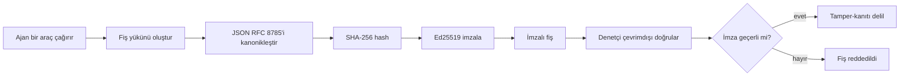
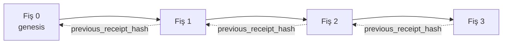

[Ders videosunu izle: Kriptografik Makbuzlarla AI Ajanlarını Güvenceye Alma](https://youtu.be/PLACEHOLDER_VIDEO_ID)

> _(Ders videosu ve küçük resim, Microsoft içerik ekibi tarafından birleştirme sonrası, ders 14 / 15 düzenine uygun şekilde eklenecektir.)_

# Kriptografik Makbuzlarla AI Ajanlarını Güvenceye Alma

## Giriş

Bu derste şunları inceleyeceğiz:

- AI ajanları için denetim izlerinin uyumluluk, hata ayıklama ve güven için neden önemli olduğu.
- Kriptografik makbuzun ne olduğu ve imzasız bir günlük satırından nasıl farklılaştığı.
- Bir ajanın araç çağrısı için düz Python’da imzalı makbuz nasıl üretilir.
- Makbuzun çevrimdışı nasıl doğrulanacağı ve tahribatın nasıl tespit edileceği.
- Makbuzların nasıl zincirlenebileceği ve birini kaldırmanın veya yeniden sıralamanın zinciri nasıl bozduğu.
- Makbuzların neyi kanıtladığı ve özellikle neyi kanıtlamadığı.

## Öğrenme Hedefleri

Bu dersi tamamladıktan sonra şunları bileceksiniz:

- Ajan eylemleri için kriptografik köken motivasyonu yaratan hata modlarını tanımlamak.
- Kanonik JSON yükü üzerinde Ed25519 imzalı bir makbuz üretmek.
- Yalnızca imzalayanın açık anahtarını kullanarak makbuzu bağımsız şekilde doğrulamak.
- Değişiklik olup olmadığını doğrulamayı değiştirilmiş bir makbuz üzerinde yeniden çalıştırarak tespit etmek.
- Makbuzların hash zincirli bir dizisini oluşturmak ve zincirin neden önemli olduğunu açıklamak.
- Makbuzların neyi kanıtladığı (atanabilirlik, bütünlük, sıralama) ve neyi kanıtlamadığı (eylemin doğruluğu, politikanın sağlamlığı) arasındaki sınırı tanımak.

## Sorun: Ajanınızın Denetim İzleri

Contoso Travel için bir AI ajanı dağıttığınızı hayal edin. Ajan müşteri isteklerini okur, uçuşlar API’sini çağırarak seçeneklere bakar ve müşterinin adına koltukları ayırır. Geçen çeyrekte ajan 50.000 rezervasyon işledi.

Bugün bir denetçi gelir. Basit bir soru sorar: "Ajanınızın ne yaptığını gösterin."

Günlük dosyalarınızı veririrsiniz. Denetçi bunlara bakar ve daha zor bir soru sorar: "Bu günlüklerin düzenlenmediğini nasıl bilebilirim?"

İşte denetim izi problemi budur. Bugün çoğu ajan dağıtımı şunlara dayanır:

- **Uygulama günlükleri**: ajan tarafından yazılır, dosya sistemine erişimi olan herkes tarafından düzenlenebilir.
- **Bulut günlükleme servisleri**: platform düzeyinde tahrifat belirtili ancak denetçi platform operatörüne güveniyorsa geçerlidir.
- **Veritabanı işlem günlükleri**: veritabanı değişiklikleri için uygundur ancak rastgele araç çağrıları için değildir.

Bunların hiçbiri, denetçinin birine (sizin, bulut sağlayıcınızın veya veritabanı satıcınızın) güvenmesini gerektirmeden soruyu yanıtlayamaz. İç kullanımda bu güven kabul edilebilir. Düzenlenen iş yükleri (finans, sağlık, AB AI Yasasına tabi işler) için kabul edilmez.

Kriptografik makbuzlar, her ajan eylemini bağımsız olarak doğrulanabilir hale getirerek bunu çözer. Denetçinin size güvenmesine gerek yoktur. Sadece sizin açık anahtarınıza ve makbuza ihtiyacı vardır.

## Kriptografik Makbuz Nedir?

Bir makbuz, bir ajanın ne yaptığını kaydeden, dijital imzayla imzalanmış bir JSON nesnesidir.



Minimal bir makbuz şöyle görünür:

```json
{
  "type": "agent.tool_call.v1",
  "agent_id": "contoso-travel-bot",
  "tool_name": "lookup_flights",
  "tool_args_hash": "sha256:a3f9c1...",
  "result_hash": "sha256:7b2e1d...",
  "policy_id": "contoso-travel-policy-v3",
  "timestamp": "2026-04-25T14:30:00Z",
  "sequence": 47,
  "previous_receipt_hash": "sha256:9d4e6a...",
  "signature": {
    "alg": "EdDSA",
    "sig": "c5af83...",
    "public_key": "8f3b2c..."
  }
}
```

İş yapan üç özellik vardır:

1. **İmza**. Makbuz, ajanın ağ geçidi tarafından Ed25519 özel anahtarı ile imzalanır. Karşılık gelen açık anahtara sahip herkes imzayı çevrimdışı doğrulayabilir. Herhangi bir alanın değiştirilmesi imzayı geçersiz kılar.

2. **Kanonik kodlama**. İmzalamadan önce makbuz JSON Kanonizasyon Şeması (JCS, RFC 8785) kullanılarak serileştirilir. Bu, aynı mantıksal makbuzu üreten iki uygulamanın bayt olarak özdeş çıktılar üretmesini sağlar. Kanonizasyon olmadan farklı JSON serileştiriciler aynı içerik için farklı imzalar üretirdi.

3. **Hash zincirleme**. `previous_receipt_hash` alanı her makbuzu ondan önceki makbuza bağlar. Bir makbuzu kaldırmak veya yeniden sıralamak, ardından gelen her makbuzu bozar. Bireysel imzalar atlatılsa bile tahrifat zincir seviyesinde görünür olur.

Bu özellikler birlikte üç garanti verir:

- **Atanabilirlik**: bu anahtar bu içeriği imzalamıştır.
- **Bütünlük**: içerik imzalandığından beri değişmemiştir.
- **Sıralama**: bu makbuz zincirde o makbuzdan sonra gelmiştir.

## Python’da Makbuz Üretmek

Makbuz üretmek için özel bir kütüphane gerekmez. Kriptografik primitifler yaygın olarak bulunmaktadır ve mantık birkaç düzine Python satırıdır.

`code_samples/18-signed-receipts.ipynb` içindeki uygulamalı egzersizler tüm akışı adım adım gösterir. Özet:

```python
import json
import hashlib
import base64
from nacl import signing
from jcs import canonicalize  # RFC 8785 kanonik JSON

def b64url_nopad(data: bytes) -> str:
    return base64.urlsafe_b64encode(data).decode("ascii").rstrip("=")

def sha256_canonical(obj) -> str:
    """SHA-256 of a Python object's JCS-canonical JSON form."""
    return f"sha256:{hashlib.sha256(canonicalize(obj)).hexdigest()}"

# Bir imzalama anahtarı oluşturun veya yükleyin (prodüksiyonda, bir anahtar kasasında saklayın)
signing_key = signing.SigningKey.generate()
verify_key = signing_key.verify_key

# Makbuz yükünü oluşturun (henüz imza yok)
tool_args = {"origin": "SYD", "destination": "LAX"}
tool_result = [{"flight": "QF11", "price": 1850, "stops": 0}]

payload = {
    "type": "agent.tool_call.v1",
    "agent_id": "contoso-travel-bot",
    "tool_name": "lookup_flights",
    "tool_args_hash": sha256_canonical(tool_args),
    "result_hash": sha256_canonical(tool_result),
    "policy_id": "contoso-travel-policy-v3",
    "timestamp": "2026-04-25T14:30:00Z",
    "sequence": 0,
    "previous_receipt_hash": None,
}

# Kanonikleştir, hashle, imzala.
canonical_bytes = canonicalize(payload)
message_hash = hashlib.sha256(canonical_bytes).digest()
signature_bytes = signing_key.sign(message_hash).signature

# Yapılandırılmış bir imza nesnesi ekle.
receipt = {
    **payload,
    "signature": {
        "alg": "EdDSA",
        "sig": b64url_nopad(signature_bytes),
        "public_key": b64url_nopad(bytes(verify_key)),
    },
}
```

Bu tüm imzalama hattıdır. Defterdeki egzersizler her adımı açıklar.

## Makbuz Doğrulama ve Tahribat Tespiti

Doğrulama tam tersidir:

```python
import base64
import hashlib
from nacl import signing
from nacl.exceptions import BadSignatureError
from jcs import canonicalize

def b64url_decode(s: str) -> bytes:
    padding = "=" * ((4 - len(s) % 4) % 4)
    return base64.urlsafe_b64decode(s + padding)

def verify_receipt(receipt: dict) -> bool:
    # İmza, yapılandırılmış bir nesnedir: {"alg", "sig", "public_key"}.
    sig_obj = receipt.get("signature")
    if not sig_obj or sig_obj.get("alg") != "EdDSA":
        return False

    # Aslında imzalanan yükü yeniden oluşturun (imza hariç her şey).
    payload = {k: v for k, v in receipt.items() if k != "signature"}

    canonical_bytes = canonicalize(payload)
    message_hash = hashlib.sha256(canonical_bytes).digest()

    try:
        verify_key = signing.VerifyKey(b64url_decode(sig_obj["public_key"]))
        verify_key.verify(message_hash, b64url_decode(sig_obj["sig"]))
        return True
    except BadSignatureError:
        return False
```

Bu fonksiyon bir makbuz alır ve imza geçerliyse `True`, değilse `False` döner. Ağ çağrısı yok, servis bağımlılığı yok, üçüncü tarafa güvenmek gerekmez.

Tahrifat tespitini görmek için defterde:

1. Geçerli bir makbuz üretilir ve doğrulandığı onaylanır.
2. `tool_args_hash` alanında bir bayt değiştirilir.
3. Doğrulama yeniden çalıştırılır ve başarısızlık görülür.

Bu, makbuzların tahrifat belirtili olduğunun pratik göstergesidir: en küçük değişiklik bile imzayı bozar.

## Çok Adımlı Ajanlar için Makbuz Zincirleme

Tek bir imzalı makbuz bir eylemi korur. Makbuz zinciri bir diziyi korur.



Her makbuz, ondan önceki makbuzun hash’ini kaydeder. Zincirin ortasından 2 numaralı makbuzu sessizce kaldırmak için:

- Makbuz 3’ün `previous_receipt_hash` alanını değiştirmek gerekir (bu makbuz 3’ün imzasını bozar), YA DA
- Değiştirilmiş makbuz 3’te yeni bir imza sahtelemek gerekir (ajanın özel anahtarı gerekir).

Özel anahtar bir donanım anahtar kasasında ve her makbuzla açık anahtar yayımlanıyorsa, bu saldırılardan hiçbiri tespitsiz mümkün değildir.

Defterde:

1. Üç makbuzluk bir zincir oluşturulur.
2. Her makbuzun `previous_receipt_hash` alanının bir önceki makbuzun gerçek hash’i ile uyumlu olduğu doğrulanır.
3. Ortadaki bir makbuzda tahrifat yapılır ve zincirin tam o noktada nasıl kırıldığı görülür.

Bu, dış denetçinin size güvenmeden doğrulayabileceği bir denetim izi üretmenin yoludur.

## Makbuzlar Ne Kanıtlar (Ne Kanıtlamaz)

Dersin en önemli bölümü budur. Makbuzlar güçlüdür ancak güçleri sınırlıdır.

**Makbuzlar üç şeyi kanıtlar:**

1. **Atanabilirlik**: belirli bir anahtar belirli bir yükü imzalamıştır.
2. **Bütünlük**: yük imzalandığından beri değişmemiştir.
3. **Sıralama**: bu makbuz zincirde o makbuzdan sonra gelmiştir.

**Makbuzlar KANITLAMAZ:**

1. **Doğruluk**: ajanın eyleminin doğru eylem olduğu. Yanlış cevap için de temiz bir şekilde imzalanabilir.
2. **Politika uyumu**: `policy_id` ile belirtilen politikanın gerçekten değerlendirildiği ya da kontrol edilseydi bu eyleme izin vereceği. Makbuz kaydeder ne iddia edildiğini, ne uygulandı.
3. **Anahtarın ötesinde kimlik**: makbuz “bu anahtar bu içeriği imzaladı” der. “Bu insan yetkilendirdi” demek değildir. Anahtarı kişi veya kuruluşa bağlamak ayrı kimlik altyapısı gerektirir (dizin, açık anahtar kaydı vb.).
4. **Girdi doğruluğu**: ajan manipüle edilmiş bir istem alıp buna göre hareket ederse makbuz eylemi doğru şekilde kaydeder. Makbuzlar giriş doğrulamanın sonrası, yerine geçmez.

Bu sınır önemlidir çünkü:

- Makbuzların ne için kullanışlı olduğunu gösterir: ajan davranışını denetlenebilir ve tahrifat belirtili kılmak, organizasyonlar arasında bile.
- Hala hangi ek katmanlara ihtiyacınız olduğunu gösterir: giriş doğrulama (Ders 6), politika uygulama (aşağıda kısaca), kimlik altyapısı (bu ders kapsamı dışı).

Yaygın hata “makbuzlarımız var”ın “yönetiliyoruz” anlamına geldiğini varsaymaktır. Değil. Makbuzlar bir temeldir. Yönetim onun üstünde kurulan sistemdir.

## Üretim Referansları

Bu dersteki Python kodu kasıtlı olarak minimaldir ki her satırı okuyup tam olarak ne olduğunu anlayabilesiniz. Üretimde iki seçeneğiniz var:

1. **Kriptografik primitifler üzerinde doğrudan inşa edin.** Yukarıdaki 50 satır birçok kullanım için yeterlidir. PyNaCl (Ed25519) ve `jcs` paketi (kanonik JSON) iyi bakımlı ve denetlenmiş kütüphanelerdir.

2. **Üretim seviyesi bir makbuz kütüphanesi kullanın.** Birkaç açık kaynak proje aynı deseni ek özelliklerle (anahtar döndürme, toplu doğrulama, JWK Set dağıtımı, politika motorları entegrasyonu) uygular:
   - Bu derste kullanılan makbuz formatı şu anda standartlaşma sürecinde olan IETF Internet-Draft (`draft-farley-acta-signed-receipts`) izlemektedir.
   - Microsoft Agent Governance Toolkit, makbuzları Cedar tabanlı politika kararları ile birleştirir; uçtan uca örnek için o depodaki Ders 33’e bakınız.
   - `protect-mcp` (npm) ve `@veritasacta/verify` (npm) paketleri, herhangi bir MCP sunucusunu tahrifat belirtile denetim izi ile sarmak için Node tabanlı imzalama ve çevrimdışı doğrulama sağlar.
   - **[nobulex](https://github.com/arian-gogani/nobulex)** Python SDK (`pip install nobulex`), Python’da LangChain ve CrewAI entegrasyonlarıyla aynı Ed25519 + JCS imzalama modelini sağlar; yayımlanmış çapraz doğrulama test vektörleri ve [OWASP PR #2210](https://github.com/OWASP/CheatSheetSeries/pull/2210) ile katkı sağlanmış uyumluluk haritası dahil.

Kendi imzalama kütüphanenizi yazmak ile denenmiş bir JWT kütüphanesi kullanmak kararı gibidir: her ikisi de makuldür; kütüphane zaman kazandırır ve denetim yüzeyini azaltır; en baştan yazmak her primitifin anlaşılmasını zorunlu kılar. Bu ders en baştan yazma yolunu öğreterek her iki seçim için de temel sağlar.

## Bilgi Kontrolü

Uygulama egzersizine geçmeden önce anlayışınızı test edin.

**1. Bir makbuz ajanının özel Ed25519 anahtarı ile imzalanır. Denetçinin yalnızca açık anahtarı vardır. Denetçi makbuzu çevrimdışı doğrulayabilir mi?**

<details>
<summary>Cevap</summary>

Evet. Ed25519 doğrulaması sadece açık anahtar ve imzalı baytlara ihtiyaç duyar. Ağ çağrısı yok, servis bağımlılığı yok. Makbuzları hava boşluklu, çok kuruluşlu veya düşük güven ortamlarında faydalı kılan özelliktir.
</details>

**2. Bir saldırgan makbuzun `policy_id` alanını daha izin verici bir politika iddiasıyla değiştirir. İmza orijinal yük üzerinde yapılmıştır. Doğrulama sırasında ne olur?**

<details>
<summary>Cevap</summary>

Doğrulama başarısız olur. İmza orijinal yükün kanonik baytları üzerinde hesaplanmıştır; herhangi bir alanın değiştirilmesi kanonik baytları değiştirir, bu da SHA-256 hash’i değiştirir, imzayı geçersiz kılar. Saldırganın yeni geçerli imza üretmek için özel anahtarı yoktur.
</details>

**3. Makbuz neden ham argümanlar ve sonuç yerine `tool_args_hash` ve `result_hash` içerir?**

<details>
<summary>Cevap</summary>

İki sebepten. Birincisi, makbuz arşivlenebilir veya ham içerik sızıntısının problem yaratacağı ortamlarda iletilebilir (KİB, iş verisi). Hash, makbuzu küçük ve içeriği gizli tutar; denetçi hash’in ayrı saklanan gerçek içerikle eşleştiğini doğrular. İkincisi, hash’ler sabit boyuttadır; hash tabanlı makbuz, girdiler ve çıktılar ne kadar büyük olursa olsun boyut olarak sınırlandırılmıştır.
</details>

**4. `previous_receipt_hash` alanı her makbuzu öncekiyle bağlar. Zincirin ortasından bir makbuz sessizce silinirse ne geçersiz olur?**

<details>
<summary>Cevap</summary>

Silinen makbuzdan sonra gelen her makbuz. Onların `previous_receipt_hash` alanları artık gerçek zincirle eşleşmez (referans verdikleri makbuz artık yok veya zincir farklı bir öncekine işaret eder). Silinmeyi gizlemek için saldırgan her sonraki makbuzu yeniden imzalamak zorundadır, bu da özel anahtar gerektirir.
</details>

**5. Bir makbuz temiz doğrulanırsa bu ajanın eyleminin doğru, sağlam veya politika ile uyumlu olduğunu kanıtlar mı?**

<details>
<summary>Cevap</summary>

Hayır. Geçerli makbuz üç şeyi kanıtlar: atanabilirlik (bu anahtar bu içeriği imzaladı), bütünlük (içerik değişmedi), sıralama (bu makbuz zincirde diğerinden sonra geldi). Doğruluk, `policy_id` politikasının gerçekten değerlendirildiği veya ajanın tüm kurallara uyduğu varsayılmaz. Makbuzlar ajan davranışını denetlenebilir yapar, zorunlu olarak doğru değil. Bu, dersin en önemli sınırıdır.
</details>

## Uygulama Alıştırması

`code_samples/18-signed-receipts.ipynb` dosyasını açın ve dört bölümü tamamlayın:

1. **Bölüm 1**: İlk makbuzunuzu imzalayın ve doğrulayın.
2. **Bölüm 2**: Makbuzu tahrif edin ve doğrulamanın başarısız olduğunu gözlemleyin.
3. **Bölüm 3**: Üç makbuzluk bir zincir oluşturun ve zincir bütünlüğünü doğrulayın.
4. **Bölüm 4**: Microsoft Agent Framework ile inşa edilen ajana deseni uygulayın: bir araç çağrısını makbuz imzalama ile sarın, ardından makbuzu bağımsız doğrulayın.
**Esneme meydan okuması 1:** makbuz şemasını kendi seçiminizden ek bir alanla genişletin (örneğin, izleme için bir istek kimliği), kanonik imzalama mantığını bunu dahil edecek şekilde güncelleyin ve makbuzun hala doğrulama üzerinden iki yönlü olarak geçip geçmediğini onaylayın. Ardından imzalamadan sonra alanı değiştirin ve doğrulamanın başarısız olduğunu onaylayın. Bu, kanonik kodlamanın her baytının imzaya nasıl katkıda bulunduğunu anlamanızı zorunlu kılar.

**Esneme meydan okuması 2:** iki makbuzunuzu SHA-256 ile birlikte hashleyin (kanonik baytlarını deterministik bir sırayla birleştirin) ve oluşan özeti üçüncü bir makbuza yeni bir alan olarak yerleştirin, ardından imzalayın. Üç makbuzun da hala iki yönlü olarak geçtiğini doğrulayın. Böylece tek adımlı bir dahil etme kanıtı oluşturmuş olursunuz: üçüncü makbuza sahip herkes, birinci ikisinin imzalandığı anda var olduğunu, içeriklerini açığa çıkarmadan kanıtlayabilir. Bu, seçmeli açıklama makbuzlarının büyük ölçekte kullandığı desendir (Merkle taahhütleri, RFC 6962).

## Sonuç

Kriptografik makbuzlar, AI ajanlarına şu özelliklere sahip bir denetim izi sağlar:

- **Bağımsız olarak doğrulanabilir:** genel anahtara sahip herhangi bir taraf doğrulayabilir, hizmet bağımlılığı yoktur.
- **Değişikliğe karşı belli eder:** herhangi bir değişiklik imzayı geçersiz kılar.
- **Taşınabilir:** bir makbuz küçük bir JSON dosyasıdır; arşivlenebilir, iletilebilir ve her yerde doğrulanabilir.
- **Standartlara uygun:** Ed25519 (RFC 8032), JCS (RFC 8785) ve SHA-256 üzerine kurulmuştur; tümü yaygın kullanılan temel algoritmalardır.

Bunlar, girdi doğrulama, politika uygulama veya kimlik altyapısının yerine geçmez. O katmanların temeli olarak hizmet ederler. Düzenlemeye tabi iş yüklerine, çoklu kuruluş iş akışlarına veya gelecekteki bir denetçinin size güvenmediği herhangi bir ortama ajanlar dağıtırken, makbuzlar denetim izini dürüst yapmanın yoludur.

En önemli çıkarım: makbuzlar kim ne dedi, ne zaman dediğini kanıtlar. Söylenenin doğru veya gerçek olduğunu kanıtlamazlar. Bu ayrımı sıkı tutun. Bu, dürüst bir kaynak sistemi ile yanıltıcı bir sistem arasındaki farktır.

## Üretim Kontrol Listesi

Bu dersten gerçek bir ortamda makbuzla imzalanan ajanlar dağıtmaya geçmeye hazır olduğunuzda:

- [ ] **İmzalama anahtarını geliştirici dizüstü bilgisayarından çıkarın.** Azure Key Vault, AWS KMS veya donanım güvenlik modülü kullanın. Makbuzlarınızı imzalayan özel anahtar asla kaynak kontrolünde veya uygulama makinelerinde açık olarak yaşamamalıdır.
- [ ] **Doğrulama genel anahtarını yayınlayın.** Denetçiler çevrimdışı doğrulama için buna ihtiyaç duyar. Standart desen, iyi bilinen bir URL'de JWK Set (RFC 7517), örneğin `https://your-org.example.com/.well-known/agent-keys.json` 'dir.
- [ ] **Zinciri dışarıdan sabitleyin.** Periyodik olarak en son zincir başlığı hash'ini bir şeffaflık kaydına (Sigstore Rekor, RFC 3161 zaman damgası yetkilisi veya ikinci bir dahili sistem) yazın, böylece dış bir taraf "bu zincir bu zamanda vardı" diyebilir.
- [ ] **Makbuzları değiştirilemez şekilde saklayın.** Sadece eklenen blob depolama (Azure Storage - değiştirilemezlik politikalarıyla, AWS S3 Nesne Kilidi) içerideki birinin depo katmanında geçmişi yeniden yazmasını engeller.
- [ ] **Saklama süresini belirleyin.** Pek çok uyumluluk rejimi çok yıllı saklama gerektirir. Makbuz büyümesini planlayın (her makbuz ~500 bayttır; günde 10K çağrı yapan bir ajan yılda ~1.8 GB üretir).
- [ ] **Makbuzların kapsamını belgeleyin.** Makbuzlar atfedilebilirliği, bütünlüğü ve sıralamayı kanıtlar. Çalıştırma kılavuzunuzda, ek denetimler (girdi doğrulama, politika uygulama, hız sınırlaması, kimlik altyapısı) ile birlikte makbuzların yönetişim pozisyonunuzda neyi kapsamadığını açıkça listeleyin.

### AI Ajanlarının Güvenliği Hakkında Daha Fazla Sorunuz mu Var?

[Microsoft Foundry Discord](https://aka.ms/ai-agents/discord)'a katılın; diğer öğrenenlerle tanışın, ofis saatlerine katılın ve AI Ajanlarındaki sorularınızı cevaplatın.

## Bu Dersten Sonra

Bu ders tek makbuzlu imzalamayı ve hash zinciri dizilerini kapsar. Aynı temel yapıtaşları, yönetişim pozisyonunuz olgunlaştıkça karşılaşabileceğiniz daha gelişmiş birkaç desene dönüşür:

- **Seçmeli açıklama.** Bir makbuzun alanları bağımsız olarak taahhüt edildiğinde (RFC 6962 tarzı Merkle ağacı), belirli alanları spesifik denetçilere açabilir ve geri kalanların değişmediğini ispatlayabilirsiniz. Aynı makbuz hem kapsamlı bir denetim (tamlık isteyen) hem de GDPR gibi veri-minimizasyon düzenlemelerini (denetçinin mümkün olduğunca az görmesini isteyen) karşılaması gerektiğinde faydalıdır.
- **Makbuz iptali.** Bir imzalama anahtarı ele geçirilirse, bu anahtarla imzalanan tüm makbuzları belli bir zamandan itibaren güvenilmez olarak işaretlemeniz gerekir. Standart desenler: kısa ömürlü imzalama anahtarları artı yayınlanan iptal listesi veya iptal girdilerine sahip bir şeffaflık kaydı.
- **İkili / bölünmüş imzalı makbuzlar.** Bazı uygulamalarda, imzalanan yükü yürütme öncesi (`authorization_*`) ve sonrası (`result_*`) olarak bağımsız imzalara sahip iki yarıya bölerler; yetkilendirme kararı ve gözlemlenen sonuç farklı aktörler tarafından veya farklı zamanlarda üretildiğinde faydalıdır. Bu, bu derste öğretilen makbuz formatının üzerine artımsal olarak eklenir.
- **Yük bileşimi.** Bir makbuz `result_hash` içine yerleştirdiğiniz baytları mühürler. Gerçek dünya verileri genellikle tek bir araç çağrısı sonucundan daha zengindir: karar öncesi muhakeme (model tahmini, düşünülen seçenekler, kanıt ve bütünlüğü, risk durumu, hesap verebilirlik zinciri, kapı sonucu) yük içinde yaşayabilir, tek bir makbuzla mühürlenir. Bu, makbuz formatını minimal tutarken yük şemalarının alan bazında gelişmesine olanak tanır.
- **Çapraz uygulama uyumu.** Aynı makbuz formatının birçok bağımsız uygulaması (Python, TypeScript, Rust, Go) ortak test vektörlerine karşı çapraz doğrulama yapar. Kendi implementasyonunuzu yaparsanız, yayınlanan vektörlere karşı doğrulama kablo uyumluluğunu teyit eder.
- **Kuantum sonrası göç.** Ed25519 bugün yaygın olarak kullanılıyor olsa da kuantum direnci yoktur. Makbuz formatı algoritma esnekliği sunar: `signature.alg` alanı, göç gerektiğinde `ML-DSA-65` (NIST kuantum sonrası imza standardı) taşıyabilir. Makbuzların çift imzalı olduğu bir geçiş dönemi planlayın.

## Ek Kaynaklar

- <a href="https://datatracker.ietf.org/doc/draft-farley-acta-signed-receipts/" target="_blank">IETF Internet Taslağı: Makine-Makine Erişim Kontrolü için İmzalı Karar Makbuzları</a>
- <a href="https://learn.microsoft.com/azure/ai-studio/responsible-use-of-ai-overview" target="_blank">Sorumlu AI genel bakışı (Azure AI)</a>
- <a href="https://datatracker.ietf.org/doc/html/rfc8032" target="_blank">RFC 8032: Edwards-kıvrım Dijital İmza Algoritması (EdDSA)</a>
- <a href="https://datatracker.ietf.org/doc/html/rfc8785" target="_blank">RFC 8785: JSON Kanonikleşme Şeması (JCS)</a>
- <a href="https://datatracker.ietf.org/doc/html/rfc6962" target="_blank">RFC 6962: Sertifika Şeffaflığı</a> (Seçmeli açıklama makbuzlarında kullanılan Merkle ağacı yapısı)
- <a href="https://github.com/microsoft/agent-governance-toolkit/blob/main/docs/tutorials/33-offline-verifiable-receipts.md" target="_blank">Microsoft Agent Governance Toolkit, Eğitim 33: Çevrimdışı Doğrulanabilir Karar Makbuzları</a>
- <a href="https://github.com/ScopeBlind/agent-governance-testvectors" target="_blank">Bu derste kullanılan makbuz formatı için çapraz-uygulama uyum test vektörleri</a> (Apache-2.0)
- <a href="https://pynacl.readthedocs.io/" target="_blank">PyNaCl dokümantasyonu</a> (Python'da Ed25519)

## Önceki Ders

[Bilgisayar Kullanım Ajanları Oluşturma (CUA)](../15-browser-use/README.md)

## Sonraki Ders

_(Müfredat sorumluları tarafından belirlenecek)_

---

<!-- CO-OP TRANSLATOR DISCLAIMER START -->
**Feragatname**:
Bu belge, AI çeviri hizmeti [Co-op Translator](https://github.com/Azure/co-op-translator) kullanılarak çevrilmiştir. Doğruluk için çaba sarf etsek de, otomatik çevirilerin hata veya yanlışlık içerebileceğini lütfen unutmayınız. Orijinal belge, kendi dilinde yetkili kaynak olarak kabul edilmelidir. Kritik bilgiler için profesyonel insan çevirisi önerilir. Bu çevirinin kullanımı sonucu ortaya çıkabilecek yanlış anlamalardan veya yanlış yorumlamalardan sorumlu değiliz.
<!-- CO-OP TRANSLATOR DISCLAIMER END -->