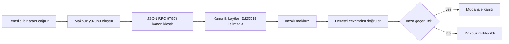
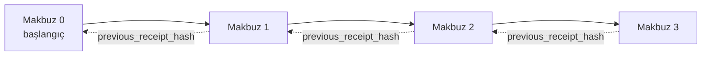

[Ders videosunu izleyin: Kriptografik Makbuzlarla AI Ajanlarını Güvence Altına Alma](https://youtu.be/PLACEHOLDER_VIDEO_ID)

> _(Ders videosu ve küçük resim, birleştirme sonrası Microsoft içerik ekibi tarafından, ders 14 / 15 kalıbına uygun şekilde eklenecektir.)_

# Kriptografik Makbuzlarla AI Ajanlarını Güvence Altına Alma

## Giriş

Bu ders şunları kapsayacak:

- AI ajanlar için denetim izlerinin uyumluluk, hata ayıklama ve güven açısından neden önemli olduğu.
- Kriptografik makbuzun ne olduğu ve imzasız bir günlük satırından nasıl farklı olduğu.
- Basit Python ile bir ajanın araç çağrısı için nasıl imzalı bir makbuz oluşturulacağı.
- Bir makbuzun çevrimdışı nasıl doğrulanacağı ve tahrifin nasıl tespit edileceği.
- Makbuzların zincirlenmesi, böylece birini kaldırmanın veya sırasını değiştirmenin zinciri bozması.
- Makbuzların neyi kanıtladığı ve açıkça neyi kanıtlamadığı.

## Öğrenme Hedefleri

Bu dersi tamamladıktan sonra şunları bileceksiniz:

- Kriptografik kökeni teşvik eden başarısızlık modlarını belirlemek.
- Kanonik JSON yükü üzerinde Ed25519 imzalı bir makbuz üretmek.
- Yalnızca imzalayanın genel anahtarını kullanarak bağımsız bir şekilde makbuzu doğrulamak.
- Değiştirilmiş bir makbuzda doğrulamayı yeniden çalıştırarak tahrifi tespit etmek.
- Makbuzlardan oluşan karma zinciri oluşturmak ve zincirin neden önemli olduğunu açıklamak.
- Makbuzların kanıtladığı (attribution, bütünlük, sıralama) ile kanıtlamadığı (işlem doğruluğu, politikanın tutarlılığı) arasındaki sınırı tanımak.

## Sorun: Ajanınızın Denetim İzleri

Contoso Travel için bir AI ajanı oluşturduğunuzu hayal edin. Ajan müşteri isteklerini okur, uçuşlar API'sini çağırır, seçenekleri araştırır ve müşterinin adına koltuk rezervasyonu yapar. Geçen çeyrekte, ajan 50.000 rezervasyon işledi.

Bugün bir denetçi gelir. Basit bir soru sorar: "Ajanınız ne yaptı, gösteriniz."

Günlük dosyalarınızı teslim edersiniz. Denetçi onları inceler ve daha zor bir soru sorar: "Bu günlüklerin düzenlenmediğini nasıl bilebilirim?"

Bu denetim izi sorunudur. Bugün çoğu ajan dağıtımı şunlara dayanır:

- **Uygulama günlükleri**: Ajanın kendisi tarafından yazılır, dosya sistemi erişimi olan herkes tarafından düzenlenebilir.
- **Bulut günlükleme hizmetleri**: platform düzeyinde tahrif fark edilir ama yalnızca denetçi platform operatörüne güvenirse.
- **Veritabanı işlem günlükleri**: veritabanı değişiklikleri için uygundur ama rastgele araç çağrıları için değil.

Bunların hiçbiri denetçinin sorusuna yanıt veremez, denetçinin birine (size, bulut sağlayıcınıza, veritabanı satıcınıza) güvenmesini gerektirir. Dahili kullanım için bu güven çoğunlukla kabul edilebilir. Düzenlemeye tabi iş yükleri için (finans, sağlık, AB AI Yasası kapsamındaki herhangi bir şey) bu geçerli değildir.

Kriptografik makbuzlar her ajan eyleminin bağımsız olarak doğrulanabilir olmasını sağlar. Denetçinin size güvenmesine gerek yoktur. Sadece genel anahtarınız ve makbuzun kendisi gerekir.

## Kriptografik Makbuz Nedir?

Bir makbuz, bir ajanın ne yaptığını kaydeden, dijital imza ile imzalanmış bir JSON nesnesidir.


```mermaid
flowchart LR
    A[Temsilci bir aracı çağırır] --> B[Makbuz yükünü oluştur]
    B --> C[JSON RFC 8785'i kanonikleştir]
    C --> E[Kanonik baytları Ed25519 ile imzala]
    E --> F[İmzalı makbuz]
    F --> G[Denetçi çevrimdışı doğrular]
    G --> H{İmza geçerli mi?}
    H -- yes --> I[Müdahale kanıtı]
    H -- no --> J[Makbuz reddedildi]
```

Minimal bir makbuz şu şekildedir:

```json
{
  "type": "agent.tool_call.v1",
  "agent_id": "contoso-travel-bot",
  "tool_name": "lookup_flights",
  "tool_args_hash": "sha256:a3f9c1...",
  "result_hash": "sha256:7b2e1d...",
  "policy_id": "contoso-travel-policy-v3",
  "timestamp": "2026-04-25T14:30:00Z",
  "sequence": 47,
  "previous_receipt_hash": "sha256:9d4e6a...",
  "signature": {
    "alg": "EdDSA",
    "sig": "c5af83...",
    "public_key": "8f3b2c..."
  }
}
```

Üç özellik çalışmayı yapıyor:

1. **İmza**. Makbuz, ajanın ağ geçidi tarafından Ed25519 özel anahtarı kullanılarak imzalanır. Karşılık gelen genel anahtara sahip herkes imzayı çevrimdışı doğrulayabilir. Herhangi bir alanın tahrif edilmesi imzayı geçersiz kılar.

2. **Kanonik kodlama**. İmzalamadan önce, makbuz JSON Kanonizasyon Şeması (JCS, RFC 8785) kullanılarak serileştirilir. Bu, aynı mantıksal makbuzu üreten iki uygulamanın bayt olarak tamamen aynı çıktıyı üretmesini sağlar. Kanonizasyon olmasaydı, farklı JSON serileştiricileri aynı içerik için farklı imzalar üretirdi.

3. **Hash zincirleme**. `previous_receipt_hash` alanı her makbuzu öncekine bağlar. Bir makbuzu kaldırmak veya sırasını değiştirmek, ondan sonraki tüm makbuzları bozar. Tahrif, bireysel imzalar atlatılsa bile zincir seviyesinde görünür hale gelir.

Bu özellikler birlikte üç garantiyi sağlar:

- **Atıf**: bu anahtar bu içeriği imzaladı.
- **Bütünlük**: içerik imzalandığından beri değişmedi.
- **Sıralama**: bu makbuz, zincirde o makbuzdan sonra geldi.

## Python'da Makbuz Üretmek

Makbuz üretmek için özel bir kitaplığa ihtiyacınız yok. Kriptografik ilkel fonksiyonlar yaygın olarak mevcuttur ve mantık birkaç düzine Python satırıdır.

`code_samples/18-signed-receipts.ipynb` içindeki uygulamalı egzersizler tam akışı gösterir. Özet versiyon:

```python
import json
import hashlib
import base64
from nacl import signing
from jcs import canonicalize  # RFC 8785 kanonik JSON

def b64url_nopad(data: bytes) -> str:
    return base64.urlsafe_b64encode(data).decode("ascii").rstrip("=")

def sha256_canonical(obj) -> str:
    """SHA-256 of a Python object's JCS-canonical JSON form."""
    return f"sha256:{hashlib.sha256(canonicalize(obj)).hexdigest()}"

# İmzalama anahtarı oluşturun veya yükleyin (üretimde, anahtar kasasında saklayın)
signing_key = signing.SigningKey.generate()
verify_key = signing_key.verify_key

# Makbuz yükünü oluşturun (henüz imza yok)
tool_args = {"origin": "SYD", "destination": "LAX"}
tool_result = [{"flight": "QF11", "price": 1850, "stops": 0}]

payload = {
    "type": "agent.tool_call.v1",
    "agent_id": "contoso-travel-bot",
    "tool_name": "lookup_flights",
    "tool_args_hash": sha256_canonical(tool_args),
    "result_hash": sha256_canonical(tool_result),
    "policy_id": "contoso-travel-policy-v3",
    "timestamp": "2026-04-25T14:30:00Z",
    "sequence": 0,
    "previous_receipt_hash": None,
}

# JCS baytlarını doğrudan kanonikleştirip imzalayın. PureEdDSA dahili olarak karmalar.
canonical_bytes = canonicalize(payload)
signature_bytes = signing_key.sign(canonical_bytes).signature

# Yapılandırılmış bir imza nesnesi ekleyin.
receipt = {
    **payload,
    "signature": {
        "alg": "EdDSA",
        "sig": b64url_nopad(signature_bytes),
        "public_key": b64url_nopad(bytes(verify_key)),
    },
}
```

Bu, tüm imzalama hattıdır. Defterdeki egzersizlerde her adım adım gösterilir.

## Bir Makbuzu Doğrulamak ve Tahrifi Tespit Etmek

Doğrulama ters işlemdir:

```python
import base64
import hashlib
from nacl import signing
from nacl.exceptions import BadSignatureError
from jcs import canonicalize

def b64url_decode(s: str) -> bytes:
    padding = "=" * ((4 - len(s) % 4) % 4)
    return base64.urlsafe_b64decode(s + padding)

def verify_receipt(receipt: dict) -> bool:
    # İmza yapılandırılmış bir nesnedir: {"alg", "sig", "public_key"}.
    sig_obj = receipt.get("signature")
    if not sig_obj or sig_obj.get("alg") != "EdDSA":
        return False

    # Aslında imzalanan yükü yeniden oluşturun (imza hariç her şey).
    payload = {k: v for k, v in receipt.items() if k != "signature"}

    canonical_bytes = canonicalize(payload)

    try:
        verify_key = signing.VerifyKey(b64url_decode(sig_obj["public_key"]))
        verify_key.verify(canonical_bytes, b64url_decode(sig_obj["sig"]))
        return True
    except BadSignatureError:
        return False
```

Bu fonksiyon bir makbuz alır ve imza geçerliyse `True`, değilse `False` döner. Ağ çağrısı yok, servis bağımlılığı yok, üçüncü tarafa güvenme gereği yoktur.

Tahrif tespitini göstermek için defter şunları yapar:

1. Geçerli bir makbuz üretmek ve doğrulandığını onaylamak.
2. `tool_args_hash` alanının bir baytını değiştirmek.
3. Doğrulamayı yeniden çalıştırmak ve başarısız olduğunu görmek.

Bu, makbuzların tahrif fark edilir olduğunu pratik olarak gösterir: her türlü değişiklik, ne kadar küçük olursa olsun imzayı bozar.

## Çok Aşamalı Ajanlar İçin Makbuz Zinciri Oluşturma

Tek bir imzalı makbuz bir eylemi korur. Makbuz zinciri ise bir diziyi korur.


```mermaid
flowchart LR
    R0[Makbuz 0<br/>başlangıç] --> R1[Makbuz 1]
    R1 --> R2[Makbuz 2]
    R2 --> R3[Makbuz 3]
    R1 -. previous_receipt_hash .-> R0
    R2 -. previous_receipt_hash .-> R1
    R3 -. previous_receipt_hash .-> R2
```

Her makbuz öncekine ait makbuzun hash'ini kaydeder. Makbuz 2'yi sessizce kaldırmak için bir saldırgan şunu yapmalıdır:

- Makbuz 3'ün `previous_receipt_hash` alanını değiştirmek (makbuz 3'ün imzasını bozar), YA DA
- Değiştirilmiş makbuz 3 için yeni bir imza sahtelemek (ajanın özel anahtarına ihtiyaç duyar).

Özel anahtar bir donanım anahtar kasasında ise ve her makbuzla genel anahtarı yayınlıyorsanız, bu saldırıların hiçbiri tespit edilmeden mümkün değildir.

Defterde şunlar gösterilir:

1. Üç makbuzdan bir zincir oluşturmak.
2. Her makbuzun `previous_receipt_hash` alanının önceki makbuzun gerçek hash'iyle eşleştiğini doğrulamak.
3. Ortadaki bir makbuzu tahrif etmek ve zincirin tam o noktada kırıldığını görmek.

Bu şekilde, dış denetçinin size güvenmeden doğrulayabileceği bir denetim izi oluşturmuş olursunuz.

## Makbuzların Kanıtladığı (ve Kanıtlamadığı) Şeyler

Bu dersin en önemli bölümüdür. Makbuzlar güçlüdür ama gücü sınırlıdır.

**Makbuzlar üç şeyi kanıtlar:**

1. **Atıf**: belirli bir anahtar belirli bir yükü imzaladı.
2. **Bütünlük**: yük imzalandığından beri değişmedi.
3. **Sıralama**: bu makbuz hash zincirinde o makbuzdan sonra geldi.

**Makbuzlar kanıtlamaz:**

1. **Doğruluk**: ajanın eyleminin doğru eylem olduğunu. Bir makbuz yanlış cevap için de doğru cevap kadar kolay imzalanabilir.
2. **Politika uyumu**: `policy_id` içinde belirtilen politikanın gerçekten değerlendirilip değerlendirilmediği ya da kontrol edilse bu eyleme izin verilip verilmeyeceği. Makbuz, iddia edilenleri değil, uygulananı kaydeder.
3. **Anahtar dışındaki kimlik bilgisi**: makbuz "bu anahtar bu içeriği imzaladı" der. "Bu insan yetkilendirdi" demez. Bir anahtarı kişiye veya kuruluşa bağlamak ayrı kimlik altyapısı gerektirir (dizin, genel anahtar kaydı vs.).
4. **Girdi doğruluğu**: eğer ajan manipüle edilmiş bir istem alır ve buna göre hareket ederse, makbuz eylemi sadık biçimde kaydeder. Makbuzlar girdi doğrulamanın ardından gelir, onun yerine geçmez.

Bu sınır iki nedenle önemlidir:

- Makbuzların ne işe yaradığını gösterir: ajan davranışını denetlenebilir ve tahrif fark edilir yapmak, hatta organizasyon sınırları ötesinde bile.
- Hangi ek katmanlara ihtiyacınız olduğunu gösterir: girdi doğrulama (Ders 6), politika uygulama (aşağıda kısaca ele alındı), ve kimlik altyapısı (bu dersin kapsamı dışında).

Yaygın bir hata, "makbuzlar var" demenin "yönetiliyoruz" anlamına geldiğini varsaymaktır. Böyle değildir. Makbuzlar bir temel sağlar. Yönetim ise üzerine inşa edilen sistemdir.

## Bir İnsan Gerçek Eylemi Onayladı Nasıl Kanıtlanır

Yukarıdaki madde 3 kendi bölümüne değer: bir işlem makbuzu "bu anahtar bu içeriği imzaladı" der, asla "bir insan yetkilendirdi" demez. Yüksek riskli işlemler (iade, silme, havale) için yönetim çerçeveleri tam olarak eksik olan bu ifadeyi giderek daha çok ister ve bu dersin öğrettiği aynı ilkelere dayanarak üretilebilir.

Takip defteri `code_samples/human-authorization-receipts.ipynb`, derste yaptığınız makbuzlarla aynı zarf biçiminde ikinci bir makbuz türü olan `human.approval.v1` ekler (adı belirtilen onaylayıcı Ed25519 ile kanonik JCS baytlar üzerinden imzalar, `signature` nesnesi imzalanan baytların dışındadır). Onaylayan, **tam kanonik eylemi ve özünü** çalıştırmadan önce imzalar; ajanın işlem makbuzu **aynı eylem özünü** taşır ve bir `parent_approval_ref` (onay makbuzunun `receipt_hash`i), yukarıdaki zincirdeki `previous_receipt_hash` ile aynı konvansiyon uygulanır. Bir `verify_chain` her iki makbuzu da **ayrı sabitlenmiş anahtar kayıtları** altında doğrular (onaylayıcı anahtarlar vs ajan anahtarları), böylece kod yolu paylaşılsa da yetkililer asla paylaşılmaz.

Bu özelliğin dikkatle ifade edilen anlamı: *insan bu tam eylemi onayladı ve ajan tam olarak onaylanan bu eylemi gerçekleştirdi.* Defterdeki reddetme durumu, bu özelliği savunulan değil gerçek yapan şeydir:

- klasik set: tahrif, kafası karışık vekil, tekrar oynatma, her iki tarafta sahte anahtarlar, bozuk girdi;
- **geçersiz otorite**: hala doğrulanan bir imza, ancak politika versiyonu değiştiği, onaylayıcı anahtar sabit kayıtlarından çıkarıldığı ya da onayın süresi dolduğu için yine de reddedilen;
- **öz değiştirme**: farklı bir kanonik eylemi bağlayan gerçek bir onaya işaret eden geçerli imzalı eylem makbuzu.

Her başarısızlık farklı bir sebeple reddedilir; böylece bir denetçi reddi okurken otoritenin geçersizleşip geçersizleşmediğini veya yürütülen eylemin değişip değişmediğini anlayabilir. Defterin öğrettiği kural: imzalı onay tek başına otorite değildir. Otorite, her iki makbuz da yürütme zamanında aynı kanonik eyleme bağlıysa vardır. İnsan onay makbuzu bu ders tarafından tanımlanmış eğitsel bir bileşendir, `draft-farley-acta-signed-receipts` tarafından tanımlanan bir makbuz türü değildir.

## Üretimde Referanslar

Bu derste verilen Python kodu, her satırı okuyup tam olarak ne olduğunu anlayabilmeniz için kasıtlı olarak minimaldir. Üretimde iki seçeneğiniz vardır:

1. **Doğrudan kriptografik ilkelere dayanarak inşa etmek.** Yukarıda gördüğünüz 50 satır birçok kullanım durumu için yeterlidir. PyNaCl (Ed25519) ve `jcs` paketi (kanonik JSON) iyi bakılan ve denetlenen kütüphanelerdir.

2. **Bir üretim makbuz kütüphanesi kullanmak.** Birkaç açık kaynak proje, aynı modeli ek özelliklerle uygular (anahtar döndürme, toplu doğrulama, JWK Set dağıtımı, politika motorları ile entegrasyon):
   - İmzalama hattı, bağımsız IETF Internet Taslağı'nda ([`draft-farley-acta-signed-receipts`](https://datatracker.ietf.org/doc/draft-farley-acta-signed-receipts/), revizyon 02) JCS ve imza kapsamı konvansiyonlarını kullanır. Bu dersin basit pedagojik makbuzu, taslakta `{payload, signature}` zarfından farklıdır ve uygun bir uygulama olarak sunulmamaktadır. Taslak, protokolüne uygunluk hedefleyen uygulamalar için paylaşılan bir uygunluk paketi yayınlar ([agent-governance-testvectors](https://github.com/ScopeBlind/agent-governance-testvectors)).
   - Microsoft Agent Governance Toolkit, Cedar tabanlı politika kararlarıyla makbuzları birleştirir; bunun uçtan uca örneği için o depoda Eğitim 33'e bakınız.
   - `protect-mcp` (npm) ve `@veritasacta/verify` (npm) paketleri, herhangi bir MCP sunucusunu tahrif fark edilir denetim izi ile sarmak için imzalama ve çevrimdışı doğrulama işlemlerinin Node tabanlı uygulamasını sağlar, durdurulmuş bir eylemin WebAuthn destekli onay makbuzu yayımladığı bir paylaşımlı onay akışı da dahil olmak üzere (masaüstü akışta), yukarıdaki insan onay defterindekiyle aynı onay-makbuz modeli.
   - **[nobulex](https://github.com/arian-gogani/nobulex)** Python SDK'sı (`pip install nobulex`), LangChain ve CrewAI entegrasyonlarıyla birlikte aynı Ed25519 + JCS imzalama modelini Python'da sağlar, yayınlanmış çapraz doğrulama test vektörleri ve [OWASP PR #2210](https://github.com/OWASP/CheatSheetSeries/pull/2210) aracılığıyla sağlanmış uygunluk eşlemesi içerir.

Kendi çözümlerinizi oluşturmak veya bir kütüphane kullanmak kararları, kendi JWT kütüphanenizi yazmakla test edilmiş bir tane kullanmak arasındaki karara benzer: her ikisi de makul; kütüphane zaman kazandırır ve denetim yüzeyini azaltır; sıfırdan yaklaşım her ilkeyi anlamanızı sağlar. Bu ders sıfırdan yolu öğretir, böylece her iki seçeneğin temelini görürsünüz.

## Bilgi Kontrolü

Uygulama egzersizine geçmeden önce anlayışınızı test edin.

**1. Bir makbuz ajan özel Ed25519 anahtarı ile imzalanır. Denetçinin yalnızca genel anahtarı vardır. Denetçi makbuzu çevrimdışı doğrulayabilir mi?**

<details>
<summary>Cevap</summary>

Evet. Ed25519 doğrulaması yalnızca genel anahtar ve imzalanmış baytlar gerektirir. Ağ çağrısı veya servis bağımlılığı yoktur. Bu özellik, makbuzları air-gapped, çoklu organizasyonlu veya düşük güven denetim ortamlarında faydalı kılar.
</details>

**2. Bir saldırgan, bir makbuzun `policy_id` alanını daha izin verici bir politika ile yönetildiğini iddia edecek şekilde değiştirir. İmza orijinal yük üzerinde yapılmıştır. Doğrulama sırasında ne olur?**

<details>
<summary>Cevap</summary>


Doğrulama başarısız oldu. İmza, orijinal yükün kanonik baytları üzerinde hesaplandı; herhangi bir alanın değiştirilmesi bu baytları değiştirir ve bu da imzayı geçersiz kılar. Saldırganın yeni geçerli bir imza üretmek için özel anahtara ihtiyacı olur, ancak böyle bir anahtarı yoktur.
</details>

**3. Makbuzda neden ham argümanlar ve sonuç yerine `tool_args_hash` ve `result_hash` bulunuyor?**

<details>
<summary>Cevap</summary>

İki sebep var. Birincisi, makbuz ham içeriğin (Kişisel Veriler, iş verileri) sızdırılmasının problem teşkil ettiği ortamlarda arşivlenebilir veya iletilebilir. Hashleme hem makbuzu küçük tutar hem de içeriğin gizliliğini sağlar; denetleyici, hash'in ayrı olarak saklanan gerçek içeriğe uygun olduğunu doğrular. İkincisi, hash'lerin sabit bir boyutu vardır; hash içeren bir makbuz, girişlerin ve çıktının boyutuna bakılmaksızın sınırlı büyüklüktedir.
</details>

**4. `previous_receipt_hash` alanı her makbuzu bir önceki makbuza bağlar. Bir saldırgan zincirin ortasından bir makbuzu sessizce silerse, ne geçersiz olur?**

<details>
<summary>Cevap</summary>

Silinen makbuzdan sonraki her makbuz. Onların `previous_receipt_hash` alanları artık gerçek zincire uymayacaktır (çünkü başvurduğu makbuz artık mevcut değil ya da zincir artık farklı bir öncekine işaret ediyor). Silmeyi gizlemek için saldırgan, daha sonraki her makbuzu yeniden imzalamak zorunda kalır, bu da özel anahtar gerektirir.
</details>

**5. Bir makbuz başarıyla doğrulanırsa, bu temsilcinin eyleminin doğru, sağlam veya politika ile uyumlu olduğunu kanıtlar mı?**

<details>
<summary>Cevap</summary>

Hayır. Geçerli bir makbuz üç şeyi kanıtlar: atıf (bu anahtar bu içeriği imzaladı), bütünlük (içerik değişmedi), ve sıralama (bu makbuz bu makbuzdan sonra geldi). Eylemin doğru olduğunu, `policy_id` ile belirtilen politikanın gerçekten değerlendirildiğini veya temsilcinin her kuralı takip ettiğini kanıtlamaz. Makbuzlar temsilci davranışını denetlenebilir kılar, mutlaka doğru değil. Bu dersteki en önemli sınırdır.
</details>

## Uygulamalı Alıştırma

`code_samples/18-signed-receipts.ipynb` dosyasını açın ve dört bölümü tamamlayın:

1. **Bölüm 1**: İlk makbuzunuzu imzalayın ve doğrulayın.
2. **Bölüm 2**: Makbuzu bozun ve doğrulamanın başarısız olduğunu gözlemleyin.
3. **Bölüm 3**: Üç makbuzdan oluşan bir zincir oluşturun ve zincir bütünlüğünü doğrulayın.
4. **Bölüm 4**: Microsoft Agent Framework ile oluşturulan bir temsilcide deseni uygulayın: bir araç çağrısını makbuz-imzalama ile sarın, ardından makbuzu bağımsız olarak doğrulayın.

**Gelişmiş meydan okuma 1:** Makbuz şemasını kendi seçeceğiniz ek bir alanla genişletin (örneğin izleme için bir istek kimliği), kanonik imzalama mantığını bunu da dahil edecek şekilde güncelleyin ve makbuzun doğrulamada hâlâ sorunsuz işlem gördüğünü onaylayın. Daha sonra imzalamadan sonra alanı değiştirin ve doğrulamanın başarısız olduğunu doğrulayın. Bu, kanonik kodlamadaki her baytın imzaya nasıl katkıda bulunduğunu anlamanızı sağlar.

**Gelişmiş meydan okuma 2:** İki makbuzunuzun kanonik baytlarını belirli bir sırayla birleştirip SHA-256 ile hashleyin ve oluşan özet değerini imzalamadan önce üçüncü bir makbuza yeni bir alan olarak gömün. Üç makbuzun da sorunsuz doğrulandığını test edin. Böylece bir adımlı içerme kanıtı oluşturmuş olursunuz: üçüncü makbuzu elinde tutan herkes, ilk iki makbuzun imza anında var olduğunu kanıtlayabilir, içeriklerini açığa çıkarmadan. Bu, seçmeli açıklama makbuzlarının büyük ölçekte kullandığı desen (Merkle taahhütleri, RFC 6962).

## Sonuç

Kriptografik makbuzlar, AI temsilcilerine şu özellikleri sağlayan bir denetim izi verir:

- **Bağımsız olarak doğrulanabilir**: Herhangi bir taraf, genel anahtarla doğrulayabilir, servis bağımlılığı yoktur.
- **Bozulmaya karşı kanıtlayıcı**: Herhangi bir değişiklik imzayı geçersiz kılar.
- **Taşınabilir**: Makbuz küçük bir JSON dosyasıdır; arşivlenebilir, iletilebilir ve her yerde doğrulanabilir.
- **Standartlara uygun**: Ed25519 (RFC 8032), JCS (RFC 8785) ve SHA-256 üzerine kurulmuştur; tümü yaygın olarak kullanılan ilkelerdir.

Girdi doğrulama, politika uygulaması veya kimlik altyapısı yerine geçmezler. Bu katmanlar için bir temel oluştururlar. Temsilcileri düzenlenmiş iş yüklerine, çoklu organizasyon iş akışlarına veya gelecekte bir denetçinin size güvenemeyeceği ortamlara dağıtırken, makbuzlar denetim izini dürüst yapmanın yoludur.

En önemli mesaj: makbuzlar kim, ne zaman ne dediği kanıtlar. Söylenenin doğru veya doğru olduğunu kanıtlamaz. Bu farkı sıkı tutun. Dürüst bir köken sistemi ile yanıltıcı bir sistem arasındaki fark budur.

## Üretim Kontrol Listesi

Bu dersten gerçek bir ortamda makbuz-imzalı temsilciler dağıtmaya geçmeye hazır olduğunuzda:

- [ ] **İmza anahtarını geliştirici dizüstü bilgisayarından çıkarın.** Azure Key Vault, AWS KMS veya bir donanım güvenlik modülü kullanın. Özel anahtar asla kaynak kontrolünde veya uygulama makinelerinde düz metin olarak bulunmamalıdır.
- [ ] **Doğrulama genel anahtarını yayınlayın.** Denetleyicilerin çevrimdışı doğrulama yapabilmesi için gereklidir. Standart desen, iyi bilinen bir URL'de JWK Set yayınlamaktır (RFC 7517), örn. `https://your-org.example.com/.well-known/agent-keys.json`.
- [ ] **Zinciri harici olarak bağlayın.** Belirli aralıklarla en güncel zincirin başı hash'ini bir şeffaflık günlüğüne yazın (Sigstore Rekor, RFC 3161 zaman damgası otoritesi veya ikinci bir dahili sistem) ki dış taraf "bu zincir şu zaman diliminde vardı" diyebilsin.
- [ ] **Makbuzları değiştirilemez şekilde saklayın.** Sadece ekleme yapılan blob depolama (Azure Depolama'nın değiştirilemezlik politikaları, AWS S3 Nesne Kilidi) içerden biri tarafından geçmişin yeniden yazılmasını önler.
- [ ] **Saklama süresine karar verin.** Birçok uyumluluk rejimi çok yıllı saklama ister. Makbuz büyümesini planlayın (her makbuz ~500 bayttır; günde 10K çağrı yapan bir temsilci yılda ~1.8 GB üretir).
- [ ] **Makbuzların kapsamadıklarını belgeleyin.** Makbuzlar atıf, bütünlük ve sıralamayı kanıtlar. İşlem kitabınız, ek kontrollerin (girdi doğrulaması, politika uygulaması, hız limitleme, kimlik altyapısı) yönetim duruşunuzda makbuzların yanında bulunduğunu açıkça listelemelidir.

### AI Temsilcilerini Güvenceye Alma ile İlgili Daha Fazla Sorunuz mu Var?

Diğer öğrenenlerle tanışmak, ofis saatlerine katılmak ve AI Temsilcileri ile ilgili sorularınızı sormak için [Microsoft Foundry Discord](https://aka.ms/ai-agents/discord) sunucusuna katılın.

## Bu Dersten Sonra

Bu ders tek makbuz imzalama ve hash zincirli dizileri kapsar. Aynı temel yapı taşları, yönetim duruşunuz geliştikçe karşılaşabileceğiniz daha gelişmiş desenler oluşturur:

- **Seçmeli açıklama.** Bir makbuzun alanları bağımsız taahhüt (RFC 6962 stil Merkle ağacı) şekline sahipse, belirli denetimcilere belirli alanları açığa çıkarabilir ve geri kalanının değişmediğini kanıtlayabilirsiniz. Aynı makbuz hem kapsamlı bir denetimi (tamlık ister) hem de GDPR gibi veri azaltma düzenlemelerini (denetleyicinin mümkün olduğunca az görmesini ister) karşılamak zorunda olduğunda faydalıdır.
- **Makbuz iptali.** Eğer bir imza anahtarı ele geçirilirse, o anahtarla imzalanan tüm makbuzları belirli bir zamandan itibaren güvensiz olarak işaretlemek gerekir. Standart desenler: kısa ömürlü imza anahtarları ve yayınlanan iptal listesi ya da iptal girdileri içeren şeffaflık günlüğü.
- **İkili / bölünmüş imza makbuzları.** Bazı uygulamalar, imzalanan yükü yürütme öncesi (`authorization_*`) ve yürütme sonrası (`result_*`) yarılara böler ve bağımsız imzalarla imzalar. Yetkilendirme kararı ve gözlemlenen sonuç farklı aktörlerce veya zamanlarda üretiliyorsa faydalıdır. Bu, bu derste öğretilen makbuz formatının üstüne eklenebilir.
- **Yük bileşimi.** Bir makbuz, `result_hash` içine koyduğunuz baytları mühürler. Gerçek dünya yükleri genellikle tek bir araç çağrısı sonucundan daha zengindir: karar öncesi gerekçeler (model tahmini, düşünülen seçenekler, kanıt ve tamamlık durumu, risk duruşu, hesap verebilirlik zinciri, geçiş sonucu) tümü bir makbuzda mühürlenebilir. Bu, makbuz formatını minimal tutarken alan şemalarının alan bazında gelişmesini sağlar.
- **Çapraz uygulama uyumluluğu.** Aynı makbuz formatının birden fazla bağımsız uygulaması (Python, TypeScript, Rust, Go) ortak test vektörlerine göre çapraz doğrulama yapar. Kendi uygulamanızı oluşturursanız, yayınlanan vektörlere göre doğrulamak kablo uyumluluğunu garantiler.
- **Kuantum sonrası göç.** Ed25519 bugün yaygın ama kuantum dirençli değil. Makbuz formatı algoritma çeviktir: `signature.alg` alanı, ihtiyaç duyduğunuzda `ML-DSA-65` (NIST kuantum sonrası imza standardı) taşıyabilir. Geçiş dönemi için makbuzlar çift imzalı olabilir.

## Ek Kaynaklar

- <a href="https://datatracker.ietf.org/doc/draft-farley-acta-signed-receipts/" target="_blank">IETF Internet Taslağı: Makine’den Makineye Erişim Kontrolü için İmzalı Karar Makbuzları</a>
- <a href="https://learn.microsoft.com/azure/ai-studio/responsible-use-of-ai-overview" target="_blank">Sorumlu AI genel bakış (Azure AI)</a>
- <a href="https://datatracker.ietf.org/doc/html/rfc8032" target="_blank">RFC 8032: Edwards-Kavis Dijital İmza Algoritması (EdDSA)</a>
- <a href="https://datatracker.ietf.org/doc/html/rfc8785" target="_blank">RFC 8785: JSON Kanonikleştirme Şeması (JCS)</a>
- <a href="https://datatracker.ietf.org/doc/html/rfc6962" target="_blank">RFC 6962: Sertifika Şeffaflığı</a> (Seçmeli açıklama makbuzları tarafından kullanılan Merkle ağacı yapısı)
- <a href="https://github.com/microsoft/agent-governance-toolkit/blob/main/docs/tutorials/33-offline-verifiable-receipts.md" target="_blank">Microsoft Agent Governance Toolkit, Eğitim 33: Çevrimdışı Doğrulanabilir Karar Makbuzları</a>
- <a href="https://github.com/ScopeBlind/agent-governance-testvectors" target="_blank">Bu derste kullanılan makbuz formatının çapraz uygulama uygunluk test vektörleri</a> (Apache-2.0)
- <a href="https://pynacl.readthedocs.io/" target="_blank">PyNaCl dokümantasyonu</a> (Python’da Ed25519)

## Önceki Ders

[Yerel AI Temsilcileri Oluşturma](../17-creating-local-ai-agents/README.md)

---

<!-- CO-OP TRANSLATOR DISCLAIMER START -->
**Feragatname**:
Bu belge, AI çeviri hizmeti [Co-op Translator](https://github.com/Azure/co-op-translator) kullanılarak çevrilmiştir. Doğruluk için çaba sarf etsek de, otomatik çevirilerin hata veya yanlışlık içerebileceğini lütfen unutmayınız. Orijinal belge, kendi dilinde yetkili kaynak olarak kabul edilmelidir. Kritik bilgiler için profesyonel insan çevirisi önerilir. Bu çevirinin kullanımı sonucu ortaya çıkabilecek yanlış anlamalardan veya yanlış yorumlamalardan sorumlu değiliz.
<!-- CO-OP TRANSLATOR DISCLAIMER END -->