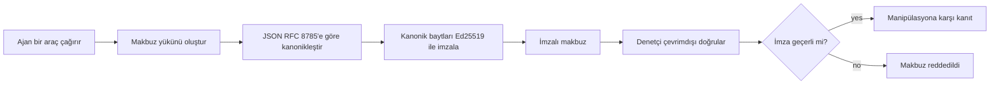
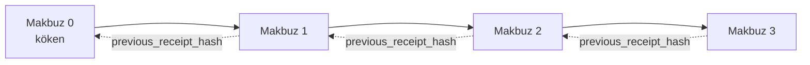

[Ders videosunu izleyin: Kriptografik Makbuzlarla AI Ajanlarını Güvence Altına Alma](https://youtu.be/PLACEHOLDER_VIDEO_ID)

> _(Ders videosu ve küçük resim, Microsoft içerik ekibi tarafından birleştirme sonrası eklenecektir ve ders 14 / 15 modeline uygun olacaktır.)_

# Kriptografik Makbuzlarla AI Ajanlarını Güvence Altına Alma

## Giriş

Bu ders şunları kapsayacaktır:

- AI ajanları için denetim izlerinin uyumluluk, hata ayıklama ve güven için neden önemli olduğu.
- Kriptografik makbuzun ne olduğu ve imzasız bir günlük satırından nasıl farklı olduğu.
- Bir ajanın araç çağrısı için düz Python'da nasıl imzalı makbuz oluşturulacağı.
- Makbuzun çevrimdışı nasıl doğrulanacağı ve manipülasyonun nasıl tespit edileceği.
- Makbuzların zincirleme nasıl bağlanacağı ve birinin çıkarılması veya yeniden sıralanmasının zinciri nasıl bozacağı.
- Makbuzların neyi kanıtladığı ve açıkça neyi kanıtlamadığı.

## Öğrenme Hedefleri

Bu dersi tamamladıktan sonra şunları bileceksiniz:

- Ajan eylemleri için kriptografik kökeni motive eden hata modlarını tanımlamak.
- Kanonik JSON yükü üzerinde Ed25519 imzalı makbuz oluşturmak.
- Sadece imzalayanın genel anahtarı kullanılarak bağımsız bir şekilde makbuz doğrulamak.
- Değiştirilmiş bir makbuzda doğrulamayı yeniden çalıştırarak manipülasyonu tespit etmek.
- Hash zinciri ile birbirine bağlı bir makbuz dizisi oluşturmak ve zincirin neden önemli olduğunu açıklamak.
- Makbuzların neyi kanıtladığını (atıf, bütünlük, sıralama) ve neyi kanıtlamadığını (eylemin doğruluğu, politikanın geçerliliği) tanımak.

## Sorun: Ajanınızın Denetim İzleri

Contoso Travel için bir AI ajanı konuşlandırdığınızı hayal edin. Ajan müşteri isteklerini okur, uçuş API'sini çağırarak seçeneklere bakar ve müşterinin adına koltuk rezervasyonu yapar. Geçen çeyrekte, ajan 50.000 rezervasyon işlemi gerçekleştirdi.

Bugün bir denetçi gelir. Basit bir soru sorar: "Ajanınız ne yaptı, gösterin."

Günlük dosyalarınızı teslim edersiniz. Denetçi onlara bakar ve zor bir soru sorar: "Bu günlüklerin düzenlenmediğini nasıl bilebilirim?"

İşte denetim izi sorunu budur. Bugün çoğu ajan konuşlandırması şunlara dayanır:

- **Uygulama günlükleri**: ajanın kendisi tarafından yazılır, dosya sistemi erişimi olan herkes tarafından düzenlenebilir.
- **Bulut kayıt hizmetleri**: platform düzeyinde müdahaleye karşı dayanıklı ancak yalnızca denetçi platform operatörüne güvenirse.
- **Veritabanı işlem günlükleri**: veritabanı değişiklikleri için uygun ama rastgele araç çağrıları için değil.

Bunların hiçbiri denetçinin sorusunu, denetçinin birine güvenmesini gerektirmeden cevaplayamaz (size, bulut sağlayıcınıza, veritabanı satıcınıza). İç kullanım için bu güven genellikle kabul edilebilir. Düzenlemeye tabi iş yükleri için (finans, sağlık hizmetleri, AB AI Yasası kapsamındaki herhangi bir şey) kabul edilemez.

Kriptografik makbuzlar bunu, her ajan eylemini bağımsız olarak doğrulanabilir hale getirerek çözer. Denetçinin size güvenmesi gerekmez. Sadece genel anahtarınız ve makbuzun kendisi yeterlidir.

## Kriptografik Makbuz Nedir?

Makbuz, bir ajanın ne yaptığını kaydeden ve dijital bir imza ile imzalanan bir JSON nesnesidir.


```mermaid
flowchart LR
    A[Ajan bir araç çağırır] --> B[Makbuz yükünü oluştur]
    B --> C[JSON RFC 8785'e göre kanonikleştir]
    C --> E[Kanonik baytları Ed25519 ile imzala]
    E --> F[İmzalı makbuz]
    F --> G[Denetçi çevrimdışı doğrular]
    G --> H{İmza geçerli mi?}
    H -- yes --> I[Manipülasyona karşı kanıt]
    H -- no --> J[Makbuz reddedildi]
```

Minimal bir makbuz şöyle görünür:

```json
{
  "type": "agent.tool_call.v1",
  "agent_id": "contoso-travel-bot",
  "tool_name": "lookup_flights",
  "tool_args_hash": "sha256:a3f9c1...",
  "result_hash": "sha256:7b2e1d...",
  "policy_id": "contoso-travel-policy-v3",
  "timestamp": "2026-04-25T14:30:00Z",
  "sequence": 47,
  "previous_receipt_hash": "sha256:9d4e6a...",
  "signature": {
    "alg": "EdDSA",
    "sig": "c5af83...",
    "public_key": "8f3b2c..."
  }
}
```

Üç özellik işi yapar:

1. **İmza**. Makbuz, ajanın ağ geçidi tarafından Ed25519 özel anahtarıyla imzalanır. İlgili genel anahtara sahip herkes imzayı çevrimdışı doğrulayabilir. Herhangi bir alanın değiştirilmesi imzayı geçersiz kılar.

2. **Kanonik kodlama**. İmzalamadan önce, makbuz JSON Kanonikleştirme Şeması (JCS, RFC 8785) kullanılarak serileştirilir. Bu, aynı mantıksal makbuzu üreten iki uygulamanın bayt olarak özdeş çıktı üretmesini sağlar. Kanonikleştirme olmazsa, farklı JSON serileştiriciler aynı içerik için farklı imzalar üretirdi.

3. **Hash zincirleme**. `previous_receipt_hash` alanı her makbuzu kendinden önceki makbuzla bağlar. Bir makbuzu kaldırmak veya yeniden sıralamak, ondan sonra gelen her makbuzu bozar. Manipülasyon, bireysel imzalar atlanmış olsa bile zincir düzeyinde görünür olur.

Bu özellikler birlikte üç garanti sağlar:

- **Atıf**: bu anahtar bu içeriği imzaladı.
- **Bütünlük**: içerik imzalandığından beri değişmedi.
- **Sıralama**: bu makbuz zincirde o makbuzdan sonra geldi.

## Python'da Makbuz Üretmek

Makbuz üretmek için özel bir kütüphaneye ihtiyacınız yok. Kriptografik işlemler yaygın olarak bulunur ve mantığı bir kaç düzine satır Python'dur.

`code_samples/18-signed-receipts.ipynb` dosyasındaki uygulamalı egzersizler tam akışı anlatır. Özet versiyonu:

```python
import json
import hashlib
import base64
from nacl import signing
from jcs import canonicalize  # RFC 8785 kanonik JSON

def b64url_nopad(data: bytes) -> str:
    return base64.urlsafe_b64encode(data).decode("ascii").rstrip("=")

def sha256_canonical(obj) -> str:
    """SHA-256 of a Python object's JCS-canonical JSON form."""
    return f"sha256:{hashlib.sha256(canonicalize(obj)).hexdigest()}"

# Bir imzalama anahtarı oluşturun veya yükleyin (üretimde, bir anahtar kasasında saklayın)
signing_key = signing.SigningKey.generate()
verify_key = signing_key.verify_key

# Makbuz verisini oluşturun (henüz imza yok)
tool_args = {"origin": "SYD", "destination": "LAX"}
tool_result = [{"flight": "QF11", "price": 1850, "stops": 0}]

payload = {
    "type": "agent.tool_call.v1",
    "agent_id": "contoso-travel-bot",
    "tool_name": "lookup_flights",
    "tool_args_hash": sha256_canonical(tool_args),
    "result_hash": sha256_canonical(tool_result),
    "policy_id": "contoso-travel-policy-v3",
    "timestamp": "2026-04-25T14:30:00Z",
    "sequence": 0,
    "previous_receipt_hash": None,
}

# JCS baytlarını doğrudan kanonik hale getirin ve imzalayın. PureEdDSA dahili olarak hash'ler.
canonical_bytes = canonicalize(payload)
signature_bytes = signing_key.sign(canonical_bytes).signature

# Yapılandırılmış bir imza nesnesi ekleyin.
receipt = {
    **payload,
    "signature": {
        "alg": "EdDSA",
        "sig": b64url_nopad(signature_bytes),
        "public_key": b64url_nopad(bytes(verify_key)),
    },
}
```

Tüm imzalama hattı budur. Not defterindeki egzersizler her adımı ayrı ayrı açıklar.

## Makbuz Doğrulama ve Manipülasyon Tespiti

Doğrulama, ters işlemdir:

```python
import base64
import hashlib
from nacl import signing
from nacl.exceptions import BadSignatureError
from jcs import canonicalize

def b64url_decode(s: str) -> bytes:
    padding = "=" * ((4 - len(s) % 4) % 4)
    return base64.urlsafe_b64decode(s + padding)

def verify_receipt(receipt: dict) -> bool:
    # İmza yapılandırılmış bir nesnedir: {"alg", "sig", "public_key"}.
    sig_obj = receipt.get("signature")
    if not sig_obj or sig_obj.get("alg") != "EdDSA":
        return False

    # Aslında imzalanan yükü yeniden oluşturun (imza hariç her şey).
    payload = {k: v for k, v in receipt.items() if k != "signature"}

    canonical_bytes = canonicalize(payload)

    try:
        verify_key = signing.VerifyKey(b64url_decode(sig_obj["public_key"]))
        verify_key.verify(canonical_bytes, b64url_decode(sig_obj["sig"]))
        return True
    except BadSignatureError:
        return False
```

Bu fonksiyon bir makbuz alır ve imza geçerliyse `True`, aksi halde `False` döner. Ağ çağrısı yok, servis bağımlılığı yok, üçüncü taraf güven gerekmiyor.

Manipülasyon tespiti nasıl çalışır görmek için not defteri şunları yapar:

1. Geçerli bir makbuz üretme ve doğrulandığını onaylama.
2. `tool_args_hash` alanının bir baytını değiştirme.
3. Doğrulamayı yeniden çalıştırma ve başarısız olduğunu görme.

Bu, makbuzların müdahaleye karşı dayanıklı olduğunun pratik gösterimidir: en küçük değişiklik bile imzayı bozar.

## Çok Adımlı Ajanlar için Makbuz Zincirleme

Tek bir imzalı makbuz bir eylemi korur. Bir dizi makbuz bir sıralamayı korur.


```mermaid
flowchart LR
    R0[Makbuz 0<br/>köken] --> R1[Makbuz 1]
    R1 --> R2[Makbuz 2]
    R2 --> R3[Makbuz 3]
    R1 -. previous_receipt_hash .-> R0
    R2 -. previous_receipt_hash .-> R1
    R3 -. previous_receipt_hash .-> R2
```

Her makbuz kendinden önceki makbuzun hash'ini kaydeder. Makbuz 2'yi sessizce kaldırmak isteyen saldırgan ya:

- Makbuz 3'ün `previous_receipt_hash` alanını değiştirir (makbuz 3'ün imzası bozulur), YA DA
- Değiştirilmiş makbuz 3 üzerinde yeni bir imza sahteler (ajanın özel anahtarı gerekir).

Özel anahtar bir donanım anahtar kasasında ise ve her makbuz ile genel anahtar yayınlanıyorsa, bu saldırıların hiçbiri tespit edilmeden mümkün değildir.

Not defteri şunları yapar:

1. Üç makbuzdan oluşan bir zincir oluşturmaya.
2. Her makbuzun `previous_receipt_hash` değerinin önceki makbuzun gerçek hash'i ile eşleştiğini doğrulamaya.
3. Aradaki bir makbuzu değiştirmeye ve zincirin tam o noktada kırıldığını görmeye.

Bu, harici bir denetçinin size güvenmeden doğrulayabileceği bir denetim izi üretmenin yoludur.

## Makbuzların Kanıtladıkları (ve Kanıtlamadıkları)

Bu dersin en önemli bölümü burasıdır. Makbuzlar güçlüdür ancak gücü sınırlıdır.

**Makbuzlar üç şeyi kanıtlar:**

1. **Atıf**: belirli bir anahtar belirli bir yükü imzaladı.
2. **Bütünlük**: yük imzalandıktan sonra değişmedi.
3. **Sıralama**: bu makbuz hash zincirinde o makbuzdan sonra geldi.

**Makbuzlar şunları KANITLAMAZ:**

1. **Doğruluk**: ajanın eyleminin doğru eylem olduğu. Makbuz yanlış bir cevap için de tıpkı doğru cevap gibi imzalanabilir.
2. **Politika uyumu**: `policy_id` içindeki politikanın gerçekten değerlendirilip değerlendirilmediği ya da kontrol edilse bu eyleme izin verilip verilmediği. Makbuz ne iddia edildiğini kaydeder, ne uygulandığını.
3. **Anahtar dışındaki kimlik**: makbuz "bu anahtar bu içeriği imzaladı" der. "Bu insan bunu yetkilendirdi" demez. Anahtarı kişiye veya kuruluşa bağlamak ayrı kimlik altyapısı gerektirir (dizin, genel anahtar kaydı vb.).
4. **Girdilerin doğruluğu**: ajan manipüle edilmiş bir istem alıp buna göre hareket ederse, makbuz eylemi doğru şekilde kaydeder. Makbuzlar girdi doğrulamanın ardından gelir, yerine geçmez.

Bu sınır önemlidir çünkü:

- Makbuzların ne için faydalı olduğunu söyler: ajan davranışını denetlenebilir ve müdahaleye karşı dayanıklı yapmak, organizasyonlar arası bile.
- Hangi ek katmanlara ihtiyacınız olduğunu belirtir: girdi doğrulama (Ders 6), politika uygulama (aşağıda kısaca), ve kimlik altyapısı (bu dersin kapsamı dışında).

Yaygın hata, "makbuzlarımız var" diyerek "yönetiliyoruz" sanmaktır. Değildir. Makbuzlar temel oluşturur. Yönetim üstüne kurduğunuz sistemdir.

## İnsan Onayının Aynı Eylemi Doğrulaması

Yukarıdaki madde 3 kendi bölümü hak eder: bir eylem makbuzu "bu anahtar bu içeriği imzaladı" der; asla "bir insan bunu yetkilendirdi" demez. Yüksek riskli eylemler (iade, silme, havale) için yönetim çerçeveleri giderek bu eksik bildirimi zorunlu kılar ve bunun için bu derste zaten oluşturduğunuz temel işlemlerle üretilebilir.

Sonraki not defteri `code_samples/human-authorization-receipts.ipynb` ikinci bir makbuz türü ekler, `human.approval.v1`, ders makbuzları ile aynı zarf biçiminde (Ed25519 ile kanonik JCS baytları üzerinden imzalanmış tipli bir yük, `signature` nesnesi imzalanan baytların dışında). İmzacı, **tam kanonik eylemi ve özeti** yürütmeden önce imzalar; ajanın eylem makbuzu aynı eylem özü ve `parent_approval_ref`, onay makbuzunun `receipt_hash`'ini taşır; bu, yukarıda oluşturduğunuz zincirdeki `previous_receipt_hash` ile aynı kuraldır. Bir `verify_chain` her iki yapıtı da **ayrı sabitlenmiş anahtar kayıtları** (onaycı anahtarları vs. ajan anahtarları) altında doğrular, böylece kod yolu paylaşılır ama yetkililer asla.

Bu özellik dikkatle şöyle ifade edilir: *insan bu kesin eylemi onayladı, ajan da tam olarak onaylanan eylemi yerine getirdi.* Not defterindeki reddetme sağlama unsurları bu durumu iddiadan gerçekliğe taşır:

- klasikler: manipülasyon, karışıklık, tekrar, her iki tarafta sahte anahtarlar, bozuk girdi;
- **eski yetki**: imza hala doğrulanıyor olsa da, politika sürümü değiştiği, onaycı anahtar sabitlenmiş kayıttan çıkarıldığı veya onay yürütmeden önce süresi dolduğu için yine de reddedilir;
- **özüt değiştirme**: geçerli imzalı eylem makbuzu, *farklı* kanonik eyleme bağlı *gerçek* bir onaya işaret eder.

Her hata farklı bir reddetme nedeniyle sonuçlanır, böylece denetçi reddi okuyunca yetkinin eskiyip eskimediğini veya yürütülen eylemin değişip değişmediğini anlar. Not defteri öğrettiği kural: imzalı onay kendi başına yetki değildir. Yetki ancak her iki makbuz da yürütme zamanında aynı kanonik eyleme bağlıysa vardır. İnsan-onay makbuzu bu ders tarafından tanımlanan eğitimsel bir bileşimdir, `draft-farley-acta-signed-receipts` tarafından tanımlanan bir makbuz türü değildir.

## Üretim Referansları

Bu derste Python kodu kasıtlı olarak azdır, böylece her satırı okuyup tam olarak ne olduğunu anlayabilirsiniz. Üretimde iki seçeneğiniz var:

1. **Kriptografik işlemler üzerine doğrudan inşa etmek.** Yukarıda gördüğünüz 50 satır birçok kullanım için yeterlidir. PyNaCl (Ed25519) ve `jcs` paketi (kanonik JSON) iyi bakım gören ve denetlenen kütüphanelerdir.

2. **Üretim makbuz kütüphanesi kullanmak.** Birkaç açık kaynak proje aynı kalıba ek özelliklerle uygular (anahtar döndürme, toplu doğrulama, JWK Set dağıtımı, politika motorlarıyla entegrasyon):
   - İmzalama hattı, bağımsız bir IETF İnternet Taslağında ( [`draft-farley-acta-signed-receipts`](https://datatracker.ietf.org/doc/draft-farley-acta-signed-receipts/), sürüm 02) JCS ve imza kapsamı konvansiyonlarını kullanır. Bu dersin düz eğitim makbuzu taslaktaki `{payload, signature}` zarfından farklıdır ve uyumlu bir uygulama olarak sunulmaz. Taslak, uygulamalar için paylaşılan bir uyumluluk paketi yayımlar ([agent-governance-testvectors](https://github.com/ScopeBlind/agent-governance-testvectors)).
   - Microsoft Agent Governance Toolkit, makbuzları Cedar tabanlı politika kararlarıyla birleştirir; depodaki 33. ders tam örneği gösterir.
   - `protect-mcp` (npm) ve `@veritasacta/verify` (npm) paketleri, herhangi bir MCP sunucusunu müdahaleye karşı dayanıklı denetim izine sarmak için çevrimdışı imzalama ve doğrulama sağlar; duraklatılmış eylemin, WebAuthn destekli masaüstü akışında, onay makbuzu yaydığı bir ortak imza akışı içerir; bu, yukarıdaki insan-izin not defteriyle aynı onay-makbuz düzenidir.
   - **[nobulex](https://github.com/arian-gogani/nobulex)** Python SDK'sı (`pip install nobulex`), LangChain ve CrewAI entegrasyonları ile aynı Ed25519 + JCS imzalama modelini sunar; yayımlanmış çapraz doğrulama test vektörleri ve [OWASP PR #2210](https://github.com/OWASP/CheatSheetSeries/pull/2210) aracılığıyla uyumluluk haritası dahil.

Kendi kütüphanenizi yazmakla test edilmiş bir kütüphane kullanmak arasındaki tercih, kendi JWT kütüphanenizi yazmakla test edilmiş birini kullanmak arasındaki kararla benzer: her ikisi de makul; kütüphane zaman kazandırır ve denetim yüzeyini azaltır; sıfırdan yaklaşım her işlemi anlamanızı sağlar. Bu ders sıfırdan yolu öğretir ki her iki seçeneğin temeli olsun.

## Bilgi Kontrolü

Uygulama egzersizine geçmeden önce anladığınızı test edin.

**1. Bir makbuz, ajanın özel Ed25519 anahtarıyla imzalanır. Denetçinin sadece genel anahtarı vardır. Denetçi makbuzu çevrimdışı doğrulayabilir mi?**

<details>
<summary>Cevap</summary>

Evet. Ed25519 doğrulaması yalnızca genel anahtar ve imzalanan baytlar gerektirir. Ağ çağrısı yok, servis bağımlılığı yok. Bu özellik, makbuzları hava boşluklu, çok organizasyonlu veya düşük güven denetleme ortamlarında kullanışlı yapar.
</details>

**2. Bir saldırgan, makbuzun `policy_id` alanını daha izin verici bir politikaya tabi olduğunu iddia edecek şekilde değiştirir. İmza orijinal yük üzerinde yapılmıştır. Doğrulama sırasında ne olur?**

<details>
<summary>Cevap</summary>


Doğrulama başarısız oldu. İmza, orijinal yükün kanonik baytları üzerinde hesaplandı; herhangi bir alanın değiştirilmesi bu baytları değiştirir ve bu da imzayı geçersiz kılar. Saldırganın geçerli yeni bir imza üretebilmesi için özel anahtara ihtiyacı vardır, ancak bu anahtara sahip değildir.
</details>

**3. Fişte, ham argümanlar ve sonuç yerine neden `tool_args_hash` ve `result_hash` bulunuyor?**

<details>
<summary>Cevap</summary>

İki neden var. Birincisi, fişler, ham içeriğin (KİB, iş verisi) sızmasının sorun olduğu ortamlarda arşivlenmesi veya iletilmesi gerekebilir. Hashleme, fişi küçük tutar ve içeriği gizli kılar; denetçi hash'in ayrı olarak saklanan gerçek içerik kopyasıyla eşleştiğini doğrular. İkincisi, hash'lerin sabit bir boyutu vardır; hash içeren bir fiş, girdilerin ve çıktının ne kadar büyük olduğuna bakılmaksızın boyut açısından sınırlıdır.
</details>

**4. `previous_receipt_hash` alanı her fişi öncekine bağlar. Bir saldırgan zincirin ortasından bir fişi sessizce silerse, ne geçersiz olur?**

<details>
<summary>Cevap</summary>

Silinen fişten sonra gelen her fiş. Bu fişlerin `previous_receipt_hash` alanları artık gerçek zincirle uyuşmaz (çünkü başvurdukları fiş artık mevcut değildir veya zincir artık farklı bir öncekine işaret eder). Silmeyi gizlemek için saldırgan, sonraki tüm fişleri yeniden imzalamak zorundadır, bu da özel anahtar gerektirir.
</details>

**5. Bir fiş temiz bir şekilde doğrulanıyorsa, bu temsilcinin eyleminin doğru, sağlam veya politikalara uygun olduğunu kanıtlar mı?**

<details>
<summary>Cevap</summary>

Hayır. Geçerli bir fiş üç şeyi kanıtlar: atıf (bu anahtar bu içeriği imzaladı), bütünlük (içerik değişmedi) ve sıralama (bu fiş o fişten sonra geldi). Eylemin doğru olduğunu, `policy_id` içinde belirtilen politikanın gerçekten değerlendirildiğini veya temsilcinin her kuralı izlediğini kanıtlamaz. Fişler temsilci davranışını denetlenebilir kılar, mutlaka doğru yapmaz. Bu derste en önemli sınır budur.
</details>

## Uygulama Alıştırması

`code_samples/18-signed-receipts.ipynb` dosyasını açın ve dört bölümü tamamlayın:

1. **Bölüm 1**: İlk fişinizi imzalayın ve doğrulayın.
2. **Bölüm 2**: Fişi değiştirin ve doğrulamanın başarısız olduğunu gözlemleyin.
3. **Bölüm 3**: Üç fişlik bir zincir oluşturun ve zincirin bütünlüğünü doğrulayın.
4. **Bölüm 4**: Deseni Microsoft Agent Framework ile oluşturulan bir temsilciye uygulayın: bir araç çağrısını fiş imzalama ile sarın ve ardından fişi bağımsız olarak doğrulayın.

**Genişletme zorluğu 1:** Fiş şemasını kendi seçtiğiniz ek bir alanla genişletin (örneğin, izleme için bir istek kimliği), kanonik imzalama mantığını bunu içerecek şekilde güncelleyin ve fişin doğrulamadan geçmesini doğrulayın. Ardından imzalamadan sonra alanı değiştirin ve doğrulamanın başarısız olduğunu teyit edin. Bu, kanonik kodlamanın her baytının imzaya nasıl katkıda bulunduğunu anlamanızı zorlar.

**Genişletme zorluğu 2:** İki fişinizin SHA-256 hash’ini birlikte (kanonik baytlarını deterministik bir sırayla birleştirerek) alın ve ortaya çıkan sindirimi üçüncü bir fişte yeni bir alan olarak ekleyin, sonra imzalayın. Tüm üç fişin hala doğrulanan şekilde işlediğini doğrulayın. Az önce bir adımlı dahil etme kanıtı oluşturdunuz: üçüncü fişi elinde tutan herhangi biri, ilk iki fişin imzalandığı zamanda var olduğunu kanıtlayabilir, içeriğini göstermeden. Bu, seçmeli açıklama fişlerinin ölçekli olarak kullandığı modeldir (Merkle taahhütler, RFC 6962).

## Sonuç

Kriptografik fişler AI temsilcilerine şu özelliklerde bir denetim izi verir:

- **Bağımsız olarak doğrulanabilir**: herkese açık anahtara sahip herhangi bir taraf doğrulayabilir, hizmet bağımlılığı yok.
- **Değişiklik izlenebilir**: herhangi bir değişiklik imzayı geçersiz kılar.
- **Taşınabilir**: bir fiş küçük bir JSON dosyasıdır; arşivlenebilir, iletilebilir ve her yerde doğrulanabilir.
- **Standartlara uygun**: Ed25519 (RFC 8032), JCS (RFC 8785) ve SHA-256 üzerine kuruludur, hepsi yaygın kullanılan primitiflerdir.

Bunlar, giriş doğrulama, politika uygulama veya kimlik altyapısının yerine geçmez. Onların üzerine inşa edilen temellerdir. Temsilcileri düzenlenen iş yüklerinde, çoklu organizasyon iş akışlarında veya gelecekteki denetçinin size güvenmeyeceği ortamlarda dağıtırken, fişler denetim izini dürüst kılar.

En önemli çıkarım: fişler kimin ne zaman ne dediğini kanıtlar. Söylenenin doğru veya uygun olduğunu kanıtlamazlar. Bu farkı sıkı tutun. Bu, dürüst bir köken sistemi ile yanıltıcı bir sistem arasındaki farktır.

## Üretim Kontrol Listesi

Bu dersten gerçek ortamda fiş imzalı temsilciler dağıtmaya geçmeye hazır olduğunuzda:

- [ ] **İmzalama anahtarını geliştirici dizüstü bilgisayarından çıkarın.** Azure Key Vault, AWS KMS veya donanım güvenlik modülü kullanın. Fişlerinizi imzalayan özel anahtar asla kaynak kontrolde veya uygulama makinelerinde düz metin olarak bulunmamalıdır.
- [ ] **Doğrulama genel anahtarını yayınlayın.** Denetçiler çevrimdışı doğrulama için buna ihtiyaç duyar. Standart desen, bilinen bir URL’de JWK Set olmasıdır (RFC 7517), örneğin, `https://your-org.example.com/.well-known/agent-keys.json`.
- [ ] **Zinciri harici olarak sabitleyin.** Periyodik olarak en son zincir başı hash’ini şeffaflık günlüğüne (Sigstore Rekor, RFC 3161 zaman damgası otoritesi veya başka bir dahili sistem) yazın, böylece dış taraf, "bu zincir bu zamanda vardı" diye onaylayabilir.
- [ ] **Fişleri değiştirilemez şekilde depolayın.** Yalnızca eklenen blob depolama (Azure Storage değiştirilemezlik politikaları, AWS S3 Nesne Kilidi) bir içeriden kişinin depolama katmanında geçmişi yeniden yazmasını engeller.
- [ ] **Saklama süresine karar verin.** Birçok uyumluluk rejimi çok yıllı saklama ister. Fişlerin büyümesini planlayın (her fiş yaklaşık 500 bayttır; günde 10K çağrı yapan bir temsilci yılda yaklaşık 1.8 GB üretir).
- [ ] **Fişlerin kapsamadıklarını belgeleyin.** Fişler atıf, bütünlük ve sıralamayı kanıtlar. Çalışma kitabınız, ilave kontrollerin neler olduğunu (girdi doğrulama, politika uygulama, hız sınırlandırma, kimlik altyapısı) açıkça listelemelidir.

### AI Temsilcilerini Güvenceye Alma ile İlgili Daha Fazla Sorunuz mu Var?

Diğer öğrenenlerle tanışmak, mesai saatlerine katılmak ve AI Temsilcileri sorularınızı yanıtlamak için [Microsoft Foundry Discord](https://aka.ms/ai-agents/discord) katılın.

## Bu Dersten Sonra

Bu ders tek fiş imzalama ve hash zincirli dizileri kapsar. Aynı primitifler, yönetişim pozisyonunuz olgunlaştıkça karşılaşabileceğiniz birkaç daha gelişmiş deseni oluşturur:

- **Seçimli açıklama.** Bir fişin alanları bağımsız olarak taahhüt edildiğinde (RFC 6962 tarzı Merkle ağacı), belirli alanları belirli denetçilere açıklayabilir ve diğerlerinin değişmediğini kanıtlayabilirsiniz, onları ifşa etmeden. Aynı fiş hem kapsamlı bir denetimi (tamlık ister) hem de GDPR gibi veri minimizasyon düzenlemelerini (denetçinin mümkün olduğunca az görmesini ister) karşılamalıysa faydalıdır.
- **Fiş iptali.** İmzalama anahtarı ele geçirilirse, o anahtarla imzalanan tüm fişleri belirli bir zamandan itibaren güvensiz olarak işaretleyecek bir yola ihtiyacınız olur. Standart desenler: kısa ömürlü imzalama anahtarları artı yayınlanmış iptal listesi veya iptal girdileri olan bir şeffaflık günlüğü.
- **İkili / bölünmüş imzalı fişler.** Bazı uygulamalar imzalı yükü, bağımsız imzalarla yürütme öncesi (`authorization_*`) ve sonrası (`result_*`) yarılara böler; bu, yetkilendirme kararı ve gözlemlenen sonucun farklı aktörler veya zamanlarda üretildiğinde faydalıdır. Bu, bu derste öğretilen fiş formatının üzerine katmanlı olarak eklenir.
- **Yük kompozisyonu.** Bir fiş, `result_hash` içine koyduğunuz herhangi bir baytları mühürler. Gerçek dünya yükleri genellikle tek bir araç çağrısı sonucundan daha zengindir: karar öncesi akıl yürütme (model tahmini, düşünülen seçenekler, kanıt ve tamamlığı, risk durumu, hesap verebilirlik zinciri, kapı sonucu) hepsi yük içinde yer alabilir; tek bir fişle mühürlenir. Bu, fiş formatının minimal kalmasını sağlar ve yük şemalarının alan bazında evrimleşmesine izin verir.
- **Çapraz uygulama uyumluluğu.** Aynı fiş formatının birden çok bağımsız uygulaması (Python, TypeScript, Rust, Go) paylaşılan test vektörlerine karşı çapraz doğrulama yapar. Kendi uygulamanızı yaparsanız, yayınlanmış vektörlere karşı doğrulamak tel uyumluluğunu teyit eder.
- **Kuantum sonrası geçiş.** Ed25519 bugün yaygın kullanılmakta ancak kuantum dirençli değildir. Fiş formatı algoritma esnekliğine sahiptir: gerektiğinde `signature.alg` alanı `ML-DSA-65` (NIST kuantum sonrası imza standardı) taşıyabilir. Çift imzalı fişlerin olduğu bir geçiş dönemi planlayın.

## Ek Kaynaklar

- <a href="https://datatracker.ietf.org/doc/draft-farley-acta-signed-receipts/" target="_blank">IETF Internet Taslağı: Makineden-Makineye Erişim Kontrolü için İmzalı Karar Fişleri</a>
- <a href="https://learn.microsoft.com/azure/ai-studio/responsible-use-of-ai-overview" target="_blank">Sorumlu AI genel bakış (Azure AI)</a>
- <a href="https://datatracker.ietf.org/doc/html/rfc8032" target="_blank">RFC 8032: Edwards-Eğrisi Dijital İmza Algoritması (EdDSA)</a>
- <a href="https://datatracker.ietf.org/doc/html/rfc8785" target="_blank">RFC 8785: JSON Kanonikleştirme Şeması (JCS)</a>
- <a href="https://datatracker.ietf.org/doc/html/rfc6962" target="_blank">RFC 6962: Sertifika Şeffaflığı</a> (seçmeli açıklama fişlerinde kullanılan Merkle ağacı yapısı)
- <a href="https://github.com/microsoft/agent-governance-toolkit/blob/main/docs/tutorials/33-offline-verifiable-receipts.md" target="_blank">Microsoft Agent Governance Toolkit, Eğitim 33: Çevrimdışı Doğrulanabilir Karar Fişleri</a>
- <a href="https://github.com/ScopeBlind/agent-governance-testvectors" target="_blank">Bu derste kullanılan fiş formatı için çapraz uygulama uyumluluk test vektörleri</a> (Apache-2.0)
- <a href="https://pynacl.readthedocs.io/" target="_blank">PyNaCl dokümantasyonu</a> (Python’da Ed25519)

## Önceki Ders

[Yerel AI Temsilcileri Oluşturma](../17-creating-local-ai-agents/README.md)

---

<!-- CO-OP TRANSLATOR DISCLAIMER START -->
**Feragatname**:
Bu belge, AI çeviri hizmeti [Co-op Translator](https://github.com/Azure/co-op-translator) kullanılarak çevrilmiştir. Doğruluk için çaba sarf etsek de, otomatik çevirilerin hata veya yanlışlık içerebileceğini lütfen unutmayınız. Orijinal belge, kendi dilinde yetkili kaynak olarak kabul edilmelidir. Kritik bilgiler için profesyonel insan çevirisi önerilir. Bu çevirinin kullanımı sonucu ortaya çıkabilecek yanlış anlamalardan veya yanlış yorumlamalardan sorumlu değiliz.
<!-- CO-OP TRANSLATOR DISCLAIMER END -->