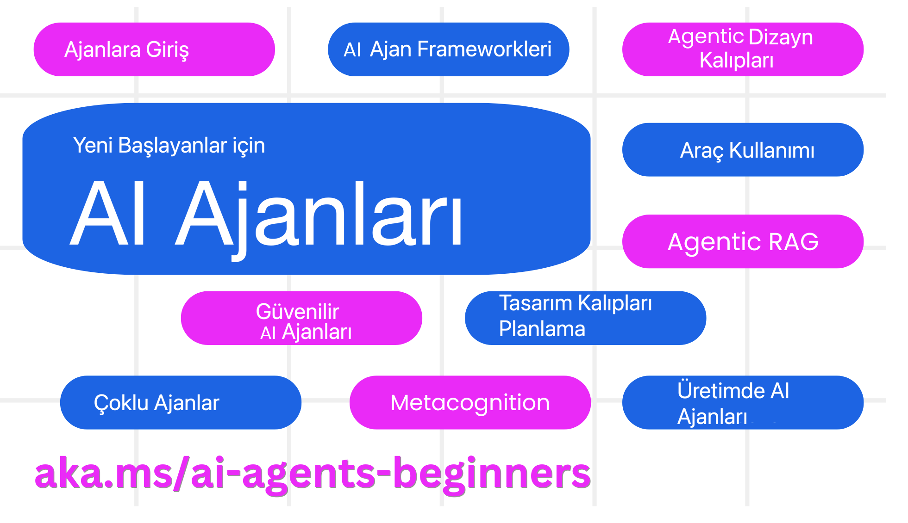

# Başlangıç Seviyesi AI Ajanları - Bir Kurs

## AI Ajanları Oluşturmaya Başlamak İçin Bilmeniz Gereken Her Şeyi Öğreten 10 Ders

  
  
  
  

### Dil Desteği
  
  
  
  
  
  
  
  
  
  
  
  
  

  
  

## 🌱 Başlarken

Bu kurs, AI Ajanları oluşturmanın temellerini kapsayan 10 ders içerir. Her ders kendi konusunu işler; istediğiniz yerden başlayabilirsiniz!

Kursa çoklu dil desteği sağlanmıştır. Mevcut dilleri görmek için [buraya gidin](#-multi-language-support).

Eğer Üretken AI modelleriyle ilk kez çalışıyorsanız, 21 derslik [Generative AI For Beginners](https://aka.ms/genai-beginners) kursumuza göz atın.

Bu repoyu [yıldızlamayı (🌟)](https://docs.github.com/en/get-started/exploring-projects-on-github/saving-repositories-with-stars?WT.mc_id=academic-105485-koreyst) ve kodu çalıştırmak için [forklamayı](https://github.com/microsoft/ai-agents-for-beginners/fork) unutmayın.

### Gereksinimler

Bu kurstaki her ders, kod örnekleri içerir; bunları `code_samples` klasöründe bulabilirsiniz. Kendi kopyanızı oluşturmak için [bu repoyu fork’layın](https://github.com/microsoft/ai-agents-for-beginners/fork).

Örnek kodlar, Language Model’lerle etkileşim için Azure AI Foundry ve GitHub Model Catalog’ları kullanır:

- [GitHub Modelleri](https://aka.ms/ai-agents-beginners/github-models) – Ücretsiz/Sınırlı  
- [Azure AI Foundry](https://aka.ms/ai-agents-beginners/ai-foundry) – Azure hesabı gerekli  

Bu kurs ayrıca Microsoft’un aşağıdaki AI Ajan çerçevelerini ve servislerini kullanır:

- [Azure AI Agent Service](https://aka.ms/ai-agents-beginners/ai-agent-service)  
- [Semantic Kernel](https://aka.ms/ai-agents-beginners/semantic-kernel)  
- [AutoGen](https://aka.ms/ai-agents/autogen)  

Kodu çalıştırma ile ilgili daha fazla bilgi için [Kurs Kurulumu](./00-course-setup/README.md) bölümüne bakın.

## 🙏 Yardımcı Olmak İster Misiniz?

Önerileriniz veya yazım/kod hatası bulduğunuzda [issue açın](https://github.com/microsoft/ai-agents-for-beginners/issues?WT.mc_id=academic-105485-koreyst) veya [pull request oluşturun](https://github.com/microsoft/ai-agents-for-beginners/pulls?WT.mc_id=academic-105485-koreyst).

AI Ajanları oluşturmayla ilgili takıldığınız bir nokta olursa, [Azure AI Community Discord](https://discord.gg/kzRShWzttr) sunucusuna katılın.

## 📂 Her Ders İçin

- README’de yazılı ders ve kısa bir video  
- Azure AI Foundry ve GitHub Modelleri (Ücretsiz) destekli Python kod örnekleri  
- Öğreniminizi sürdürmeniz için ek kaynak bağlantıları  

## 🗃️ Dersler

| **Ders**                                | **Metin & Kod**                                   | **Video**                                                  | **Ek Öğrenme**                                                                          |
|------------------------------------------|---------------------------------------------------|------------------------------------------------------------|-----------------------------------------------------------------------------------------|
| AI Ajanlarına Giriş ve Kullanım Örnekleri | [Link](./01-intro-to-ai-agents/README.md)         | [Video](https://youtu.be/3zgm60bXmQk?si=z8QygFvYQv-9WtO1)  | [Link](https://aka.ms/ai-agents-beginners/collection?WT.mc_id=academic-105485-koreyst)  |
| AI Ajan Çerçevelerini Keşfetme           | [Link](./02-explore-agentic-frameworks/README.md) | [Video](https://youtu.be/ODwF-EZo_O8?si=Vawth4hzVaHv-u0H)  | [Link](https://aka.ms/ai-agents-beginners/collection?WT.mc_id=academic-105485-koreyst)  |
| AI Ajan Tasarım Desenlerini Anlama       | [Link](./03-agentic-design-patterns/README.md)    | [Video](https://youtu.be/m9lM8qqoOEA?si=BIzHwzstTPL8o9GF)  | [Link](https://aka.ms/ai-agents-beginners/collection?WT.mc_id=academic-105485-koreyst)  |
| Araç Kullanım Tasarım Deseni             | [Link](./04-tool-use/README.md)                   | [Video](https://youtu.be/vieRiPRx-gI?si=2z6O2Xu2cu_Jz46N)  | [Link](https://aka.ms/ai-agents-beginners/collection?WT.mc_id=academic-105485-koreyst)  |
| Agentic RAG                              | [Link](./05-agentic-rag/README.md)                | [Video](https://youtu.be/WcjAARvdL7I?si=gKPWsQpKiIlDH9A3)  | [Link](https://aka.ms/ai-agents-beginners/collection?WT.mc_id=academic-105485-koreyst)  |
| Güvenilir AI Ajanları Oluşturma          | [Link](./06-building-trustworthy-agents/README.md)| [Video](https://youtu.be/iZKkMEGBCUQ?si=jZjpiMnGFOE9L8OK) | [Link](https://aka.ms/ai-agents-beginners/collection?WT.mc_id=academic-105485-koreyst)  |
| Planlama Tasarım Deseni                  | [Link](./07-planning-design/README.md)            | [Video](https://youtu.be/kPfJ2BrBCMY?si=6SC_iv_E5-mzucnC)  | [Link](https://aka.ms/ai-agents-beginners/collection?WT.mc_id=academic-105485-koreyst)  |
| Çoklu Ajan Tasarım Deseni                | [Link](./08-multi-agent/README.md)                | [Video](https://youtu.be/V6HpE9hZEx0?si=rMgDhEu7wXo2uo6g)  | [Link](https://aka.ms/ai-agents-beginners/collection?WT.mc_id=academic-105485-koreyst)  |
| Metabiliş Tasarım Deseni                 | [Link](./09-metacognition/README.md)              | [Video](https://youtu.be/His9R6gw6Ec?si=8gck6vvdSNCt6OcF)  | [Link](https://aka.ms/ai-agents-beginners/collection?WT.mc_id=academic-105485-koreyst)  |
| Üretimde AI Ajanları                     | [Link](./10-ai-agents-production/README.md)       | [Video](https://youtu.be/l4TP6IyJxmQ?si=31dnhexRo6yLRJDl) | [Link](https://aka.ms/ai-agents-beginners/collection?WT.mc_id=academic-105485-koreyst)  |

## 🌐 Çoklu Dil Desteği

| Dil                   | Kod  | Çevrilmiş README Bağlantısı                         | Son Güncelleme |
|-----------------------|------|-----------------------------------------------------|----------------|
| Çince (Basitleştirilmiş) | zh   | [Çince Çevirisi](./translations/zh/README.md)        | 2025-03-24     |
| Çince (Geleneksel)     | tw   | [Çince Çevirisi](./translations/tw/README.md)        | 2025-03-28     |
| Çince (Hong Kong)      | hk   | [Çince (Hong Kong) Çevirisi](./translations/hk/README.md) | 2025-03-28     |
| Fransızca             | fr   | [Fransızca Çevirisi](./translations/fr/README.md)     | 2025-03-28     |
| Japonca               | ja   | [Japonca Çevirisi](./translations/ja/README.md)       | 2025-03-28     |
| Korece                | ko   | [Korece Çevirisi](./translations/ko/README.md)       | 2025-03-28     |
| Portekizce            | pt   | [Portekizce Çevirisi](./translations/pt/README.md)   | 2025-03-28     |
| İspanyolca            | es   | [İspanyolca Çevirisi](./translations/es/README.md)   | 2025-03-28     |
| Almanca               | de   | [Almanca Çevirisi](./translations/de/README.md)      | 2025-03-28     |
| Farsça                | fa   | [Farsça Çevirisi](./translations/fa/README.md)       | 2025-03-28     |
| Lehçe                 | pl   | [Lehçe Çevirisi](./translations/pl/README.md)        | 2025-03-28     |
| Hintçe                | hi   | [Hintçe Çevirisi](./translations/hi/README.md)       | 2025-04-05     |
| Türkçe                | tr   | [Türkçe Çevirisi](./translations/tr/README.md)       | 2025-05-09     |

## 🎒 Diğer Kurslar

Ekibimiz başka kurslar da üretiyor! Göz atın:

- [**YENİ** .NET ile Başlangıç Düzeyi Üretken AI](https://github.com/microsoft/Generative-AI-for-beginners-dotnet?WT.mc_id=academic-105485-koreyst)  
- [Generative AI for Beginners](https://github.com/microsoft/generative-ai-for-beginners?WT.mc_id=academic-105485-koreyst)  
- [ML for Beginners](https://aka.ms/ml-beginners?WT.mc_id=academic-105485-koreyst)  
- [Data Science for Beginners](https://aka.ms/datascience-beginners?WT.mc_id=academic-105485-koreyst)  
- [AI for Beginners](https://aka.ms/ai-beginners?WT.mc_id=academic-105485-koreyst)  
- [Cybersecurity for Beginners](https://github.com/microsoft/Security-101??WT.mc_id=academic-96948-sayoung)  
- [Web Dev for Beginners](https://aka.ms/webdev-beginners?WT.mc_id=academic-105485-koreyst)  
- [IoT for Beginners](https://aka.ms/iot-beginners?WT.mc_id=academic-105485-koreyst)  
- [XR Development for Beginners](https://github.com/microsoft/xr-development-for-beginners?WT.mc_id=academic-105485-koreyst)  
- [Mastering GitHub Copilot for AI Paired Programming](https://aka.ms/GitHubCopilotAI?WT.mc_id=academic-105485-koreyst)  
- [Mastering GitHub Copilot for C#/.NET Developers](https://github.com/microsoft/mastering-github-copilot-for-dotnet-csharp-developers?WT.mc_id=academic-105485-koreyst)  
- [Choose Your Own Copilot Adventure](https://github.com/microsoft/CopilotAdventures?WT.mc_id=academic-105485-koreyst)  

## 🌟 Topluluk Teşekkürü

Önemli Agentic RAG kod örnekleri katkısı için [Shivam Goyal](https://www.linkedin.com/in/shivam2003/)’a teşekkürler.

## Katkıda Bulunmak

Bu proje katkılara ve önerilere açıktır. Çoğu katkı, katkıda bulunma hakkına sahip olduğunuzu ve gerçekten sahip olduğunuzu beyan eden bir Katkıcı Lisans Anlaşması’na (CLA) katılmanızı gerektirir. Ayrıntılar için <https://cla.opensource.microsoft.com> adresini ziyaret edin.

Pull request gönderdiğinizde, bir CLA botu CLA gerekip gerekmediğinizi otomatik olarak belirler ve PR’ı uygun şekilde işaretler (örneğin durum kontrolü, yorum). Sadece botun talimatlarını izleyin. Tüm CLA kullanan repolar için bu işlemi yalnızca bir kez yapmanız yeterlidir.

Bu proje, [Microsoft Açık Kaynak Davranış Kuralları](https://opensource.microsoft.com/codeofconduct/)nı benimsemiştir. Daha fazla bilgi için [Davranış Kuralları SSS](https://opensource.microsoft.com/codeofconduct/faq/) veya [opencode@microsoft.com](mailto:opencode@microsoft.com) adresiyle iletişime geçin.

## Ticari Markalar

Bu proje, projeler, ürünler veya hizmetler için ticari markalar veya logolar içerebilir. Microsoft ticari markalarının veya logolarının yetkili kullanımı, [Microsoft’un Ticari Marka & Marka Yönergeleri](https://www.microsoft.com/legal/intellectualproperty/trademarks/usage/general)’ne uymalıdır. Bu projenin değiştirilmiş versiyonlarındaki Microsoft ticari markalarının veya logolarının kullanımı, karışıklığa yol açmamalı veya Microsoft sponsorluğunu ima etmemelidir. Üçüncü taraf ticari marka veya logolarının kullanımı, ilgili üçüncü taraf politikalarına tabidir.

