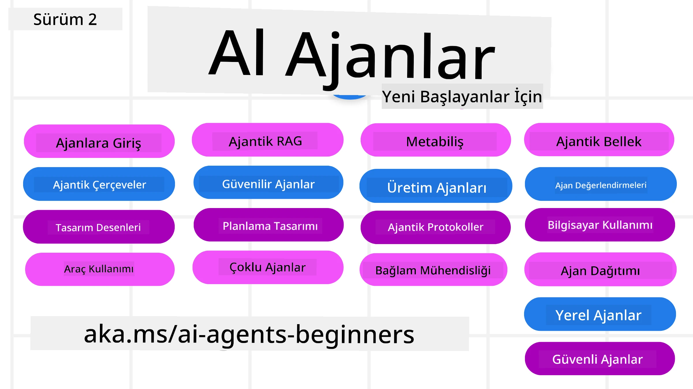

# Yeni Başlayanlar İçin Yapay Zeka Ajanları - Bir Kurs



## Yapay Zeka Ajanları inşa etmeye başlamak için ihtiyacınız olan her şeyi öğreten bir kurs

[](https://github.com/microsoft/ai-agents-for-beginners/blob/master/LICENSE?WT.mc_id=academic-105485-koreyst)
[](https://GitHub.com/microsoft/ai-agents-for-beginners/graphs/contributors/?WT.mc_id=academic-105485-koreyst)
[](https://GitHub.com/microsoft/ai-agents-for-beginners/issues/?WT.mc_id=academic-105485-koreyst)
[](https://GitHub.com/microsoft/ai-agents-for-beginners/pulls/?WT.mc_id=academic-105485-koreyst)
[](http://makeapullrequest.com?WT.mc_id=academic-105485-koreyst)

### 🌐 Çok Dilli Destek

#### GitHub Action ile Desteklenmektedir (Otomatik & Her Zaman Güncel)

<!-- CO-OP TRANSLATOR LANGUAGES TABLE START -->
[Arapça](../ar/README.md) | [Bengalce](../bn/README.md) | [Bulgarca](../bg/README.md) | [Birmanca (Myanmar)](../my/README.md) | [Çince (Basitleştirilmiş)](../zh-CN/README.md) | [Çince (Geleneksel, Hong Kong)](../zh-HK/README.md) | [Çince (Geleneksel, Makao)](../zh-MO/README.md) | [Çince (Geleneksel, Tayvan)](../zh-TW/README.md) | [Hırvatça](../hr/README.md) | [Çekçe](../cs/README.md) | [Danca](../da/README.md) | [Flemenkçe](../nl/README.md) | [Estonca](../et/README.md) | [Fince](../fi/README.md) | [Fransızca](../fr/README.md) | [Almanca](../de/README.md) | [Yunanca](../el/README.md) | [İbranice](../he/README.md) | [Hintçe](../hi/README.md) | [Macarca](../hu/README.md) | [Endonezce](../id/README.md) | [İtalyanca](../it/README.md) | [Japonca](../ja/README.md) | [Kannada](../kn/README.md) | [Kmerce](../km/README.md) | [Korece](../ko/README.md) | [Litvanca](../lt/README.md) | [Malayca](../ms/README.md) | [Malayalamca](../ml/README.md) | [Marathi](../mr/README.md) | [Nepalce](../ne/README.md) | [Nijerya Pidgin](../pcm/README.md) | [Norveççe](../no/README.md) | [Farsça (Persçe)](../fa/README.md) | [Lehçe](../pl/README.md) | [Brezilya Portekizcesi](../pt-BR/README.md) | [Portekizce (Portekiz)](../pt-PT/README.md) | [Pencapça (Gurmukhi)](../pa/README.md) | [Romence](../ro/README.md) | [Rusça](../ru/README.md) | [Sırpça (Kiril)](../sr/README.md) | [Slovakça](../sk/README.md) | [Slovence](../sl/README.md) | [İspanyolca](../es/README.md) | [Svahili](../sw/README.md) | [İsveççe](../sv/README.md) | [Tagalog (Filipince)](../tl/README.md) | [Tamilce](../ta/README.md) | [Telugu](../te/README.md) | [Tayca](../th/README.md) | [Türkçe](./README.md) | [Ukraynaca](../uk/README.md) | [Urduca](../ur/README.md) | [Vietnamca](../vi/README.md)

> **Yerel Olarak Klonlamayı mı Tercih Edersiniz?**
>
> Bu depo 50'den fazla dil çevirisi içerir, bu da indirme boyutunu önemli ölçüde artırır. Çeviri olmadan klonlamak için seyrek kontrol kullanın:
>
> **Bash / macOS / Linux:**
> ```bash
> git clone --filter=blob:none --sparse https://github.com/microsoft/ai-agents-for-beginners.git
> cd ai-agents-for-beginners
> git sparse-checkout set --no-cone '/*' '!translations' '!translated_images'
> ```
>
> **CMD (Windows):**
> ```cmd
> git clone --filter=blob:none --sparse https://github.com/microsoft/ai-agents-for-beginners.git
> cd ai-agents-for-beginners
> git sparse-checkout set --no-cone "/*" "!translations" "!translated_images"
> ```
>
> Bu, kursu tamamlamak için ihtiyacınız olan her şeyi çok daha hızlı bir indirme ile sağlar.
<!-- CO-OP TRANSLATOR LANGUAGES TABLE END -->

**Ek çeviri dillerinin desteklenmesini istiyorsanız, desteklenen diller listesi [burada](https://github.com/Azure/co-op-translator/blob/main/getting_started/supported-languages.md) bulunmaktadır**

[](https://GitHub.com/microsoft/ai-agents-for-beginners/watchers/?WT.mc_id=academic-105485-koreyst)
[](https://GitHub.com/microsoft/ai-agents-for-beginners/network/?WT.mc_id=academic-105485-koreyst)
[](https://GitHub.com/microsoft/ai-agents-for-beginners/stargazers/?WT.mc_id=academic-105485-koreyst)

[](https://discord.gg/nTYy5BXMWG)


## 🌱 Başlarken

Bu kurs, Yapay Zeka Ajanları oluşturmanın temellerini kapsayan dersler içerir. Her ders kendi konusunu ele alır, istediğiniz yerden başlayabilirsiniz!

Bu kurs için çoklu dil desteği vardır. [Mevcut dillerimize buradan](#-çok-dilli-destek) ulaşabilirsiniz.

Eğer Generatif Yapay Zeka modelleri ile ilk kez çalışıyorsanız, 21 ders içeren [Yeni Başlayanlar İçin Generatif Yapay Zeka](https://aka.ms/genai-beginners) kursumuza göz atın.

Bu depoyu [yıldızlamayı (🌟)](https://docs.github.com/en/get-started/exploring-projects-on-github/saving-repositories-with-stars?WT.mc_id=academic-105485-koreyst) ve kodu çalıştırmak için [fork etmeyi](https://github.com/microsoft/ai-agents-for-beginners/fork) unutmayın.

### Diğer Öğrenenlerle Tanışın, Sorularınızı Yanıtlayın

Takılırsanız veya Yapay Zeka Ajanları oluşturma hakkında herhangi bir sorunuz olursa, [Microsoft Foundry Discord](https://aka.ms/ai-agents/discord) içindeki özel Discord Kanalımıza katılın.

### İhtiyacınız Olanlar

Bu kurstaki her ders kod örnekleri içerir, bu örnekler code_samples klasöründe bulunabilir. Kendi kopyanızı oluşturmak için repo'yu [fork edebilirsiniz](https://github.com/microsoft/ai-agents-for-beginners/fork).

Bu alıştırmalardaki kod örnekleri Microsoft Agent Framework ve Azure AI Foundry Agent Service V2 kullanmaktadır:

- [Microsoft Foundry](https://aka.ms/ai-agents-beginners/ai-foundry) - Azure Hesabı Gereklidir

Bu kurs Microsoft'tan aşağıdaki AI Ajan çerçevelerini ve servislerini kullanır:

- [Microsoft Agent Framework (MAF)](https://aka.ms/ai-agents-beginners/agent-framework)
- [Azure AI Foundry Agent Service V2](https://aka.ms/ai-agents-beginners/ai-agent-service)

Bazı kod örnekleri, 204K token'a kadar büyük bağlam modelleri sunan [MiniMax](https://platform.minimaxi.com/) gibi alternatif OpenAI uyumlu sağlayıcıları da desteklemektedir. Yapılandırma ayrıntıları için [Kurs Kurulumu](./00-course-setup/README.md) bölümüne bakın.

Bu kursun kodlarını çalıştırmak hakkında daha fazla bilgi için [Kurs Kurulumu](./00-course-setup/README.md) bölümüne gidin.

## 🙏 Yardımcı olmak ister misiniz?

Önerileriniz veya yazım ya da kod hataları bulduysanız, [bir sorun açın](https://github.com/microsoft/ai-agents-for-beginners/issues?WT.mc_id=academic-105485-koreyst) veya [çekme isteği oluşturun](https://github.com/microsoft/ai-agents-for-beginners/pulls?WT.mc_id=academic-105485-koreyst)


## 📂 Her ders şunları içerir

- README içinde yazılı ders ve kısa bir video
- Microsoft Agent Framework ile Azure AI Foundry kullanarak Python kod örnekleri
- Öğrenmeye devam etmek için ek kaynak bağlantıları


## 🗃️ Dersler

| **Ders**                                   | **Metin & Kod**                                     | **Video**                                                  | **Ekstra Öğrenme**                                                                     |
|----------------------------------------------|----------------------------------------------------|------------------------------------------------------------|----------------------------------------------------------------------------------------|
| Yapay Zeka Ajanlarına Giriş ve Ajan Kullanım Durumları | [Bağlantı](./01-intro-to-ai-agents/README.md)      | [Video](https://youtu.be/3zgm60bXmQk?si=z8QygFvYQv-9WtO1)  | [Bağlantı](https://aka.ms/ai-agents-beginners/collection?WT.mc_id=academic-105485-koreyst) |
| Yapay Zeka Ajan Çerçevelerini Keşfetmek     | [Bağlantı](./02-explore-agentic-frameworks/README.md) | [Video](https://youtu.be/ODwF-EZo_O8?si=Vawth4hzVaHv-u0H)  | [Bağlantı](https://aka.ms/ai-agents-beginners/collection?WT.mc_id=academic-105485-koreyst) |
| Yapay Zeka Ajan Tasarım Kalıplarını Anlamak | [Bağlantı](./03-agentic-design-patterns/README.md) | [Video](https://youtu.be/m9lM8qqoOEA?si=BIzHwzstTPL8o9GF)  | [Bağlantı](https://aka.ms/ai-agents-beginners/collection?WT.mc_id=academic-105485-koreyst) |
| Araç Kullanma Tasarım Kalıbı                | [Bağlantı](./04-tool-use/README.md)                 | [Video](https://youtu.be/vieRiPRx-gI?si=2z6O2Xu2cu_Jz46N)  | [Bağlantı](https://aka.ms/ai-agents-beginners/collection?WT.mc_id=academic-105485-koreyst) |
| Ajan RAG                                   | [Bağlantı](./05-agentic-rag/README.md)              | [Video](https://youtu.be/WcjAARvdL7I?si=gKPWsQpKiIlDH9A3)  | [Bağlantı](https://aka.ms/ai-agents-beginners/collection?WT.mc_id=academic-105485-koreyst) |
| Güvenilir Yapay Zeka Ajanları İnşa Etmek    | [Bağlantı](./06-building-trustworthy-agents/README.md) | [Video](https://youtu.be/iZKkMEGBCUQ?si=jZjpiMnGFOE9L8OK ) | [Bağlantı](https://aka.ms/ai-agents-beginners/collection?WT.mc_id=academic-105485-koreyst) |
| Planlama Tasarım Kalıbı                     | [Bağlantı](./07-planning-design/README.md)          | [Video](https://youtu.be/kPfJ2BrBCMY?si=6SC_iv_E5-mzucnC)  | [Bağlantı](https://aka.ms/ai-agents-beginners/collection?WT.mc_id=academic-105485-koreyst) |
| Çoklu Ajan Tasarım Kalıbı                   | [Bağlantı](./08-multi-agent/README.md)               | [Video](https://youtu.be/V6HpE9hZEx0?si=rMgDhEu7wXo2uo6g)  | [Bağlantı](https://aka.ms/ai-agents-beginners/collection?WT.mc_id=academic-105485-koreyst) |
| Metakognisyon Tasarım Deseni                 | [Bağlantı](./09-metacognition/README.md)               | [Video](https://youtu.be/His9R6gw6Ec?si=8gck6vvdSNCt6OcF)  | [Bağlantı](https://aka.ms/ai-agents-beginners/collection?WT.mc_id=academic-105485-koreyst) |
| Üretimde Yapay Zeka Ajanları                 | [Bağlantı](./10-ai-agents-production/README.md)        | [Video](https://youtu.be/l4TP6IyJxmQ?si=31dnhexRo6yLRJDl)  | [Bağlantı](https://aka.ms/ai-agents-beginners/collection?WT.mc_id=academic-105485-koreyst) |
| Agentik Protokollerin Kullanımı (MCP, A2A ve NLWeb) | [Bağlantı](./11-agentic-protocols/README.md)           | [Video](https://youtu.be/X-Dh9R3Opn8)                                 | [Bağlantı](https://aka.ms/ai-agents-beginners/collection?WT.mc_id=academic-105485-koreyst) |
| Yapay Zeka Ajanları için Bağlam Mühendisliği | [Bağlantı](./12-context-engineering/README.md)         | [Video](https://youtu.be/F5zqRV7gEag)                                 | [Bağlantı](https://aka.ms/ai-agents-beginners/collection?WT.mc_id=academic-105485-koreyst) |
| Agentik Belleğin Yönetimi                     | [Bağlantı](./13-agent-memory/README.md)     |      [Video](https://youtu.be/QrYbHesIxpw?si=vZkVwKrQ4ieCcIPx)                                                      |                                                                                        |
| Microsoft Agent Framework'ü Keşfetme          | [Bağlantı](./14-microsoft-agent-framework/README.md)                            |                                                            |                                                                                        |
| Bilgisayar Kullanım Ajanları Oluşturma (CUA) | [Bağlantı](./15-browser-use/README.md)     |                                                            | [Bağlantı](https://docs.browser-use.com/examples/templates/playwright-integration)         |
| Ölçeklenebilir Ajanları Kurma                 | Yakında Geliyor                            |                                                            |                                                                                        |
| Yerel Yapay Zeka Ajanları Oluşturma            | Yakında Geliyor                               |                                                            |                                                                                        |
| Yapay Zeka Ajanları Güvenliği                 | [Bağlantı](./18-securing-ai-agents/README.md)  |                                                            | [Bağlantı](https://aka.ms/ai-agents-beginners/collection?WT.mc_id=academic-105485-koreyst) |

## 🎒 Diğer Kurslar

Ekibimiz başka kurslar da üretiyor! Göz atın:

<!-- CO-OP TRANSLATOR OTHER COURSES START -->
### LangChain
[](https://aka.ms/langchain4j-for-beginners)
[](https://aka.ms/langchainjs-for-beginners?WT.mc_id=m365-94501-dwahlin)
[](https://github.com/microsoft/langchain-for-beginners?WT.mc_id=m365-94501-dwahlin)
---

### Azure / Edge / MCP / Ajanlar
[](https://github.com/microsoft/AZD-for-beginners?WT.mc_id=academic-105485-koreyst)
[](https://github.com/microsoft/edgeai-for-beginners?WT.mc_id=academic-105485-koreyst)
[](https://github.com/microsoft/mcp-for-beginners?WT.mc_id=academic-105485-koreyst)
[](https://github.com/microsoft/ai-agents-for-beginners?WT.mc_id=academic-105485-koreyst)

---
 
### Üretken Yapay Zeka Serisi
[](https://github.com/microsoft/generative-ai-for-beginners?WT.mc_id=academic-105485-koreyst)
[-9333EA?style=for-the-badge&labelColor=E5E7EB&color=9333EA)](https://github.com/microsoft/Generative-AI-for-beginners-dotnet?WT.mc_id=academic-105485-koreyst)
[-C084FC?style=for-the-badge&labelColor=E5E7EB&color=C084FC)](https://github.com/microsoft/generative-ai-for-beginners-java?WT.mc_id=academic-105485-koreyst)
[-E879F9?style=for-the-badge&labelColor=E5E7EB&color=E879F9)](https://github.com/microsoft/generative-ai-with-javascript?WT.mc_id=academic-105485-koreyst)

---
 
### Temel Öğrenim
[](https://aka.ms/ml-beginners?WT.mc_id=academic-105485-koreyst)
[](https://aka.ms/datascience-beginners?WT.mc_id=academic-105485-koreyst)
[](https://aka.ms/ai-beginners?WT.mc_id=academic-105485-koreyst)
[](https://github.com/microsoft/Security-101?WT.mc_id=academic-96948-sayoung)
[](https://aka.ms/webdev-beginners?WT.mc_id=academic-105485-koreyst)
[](https://aka.ms/iot-beginners?WT.mc_id=academic-105485-koreyst)
[](https://github.com/microsoft/xr-development-for-beginners?WT.mc_id=academic-105485-koreyst)

---
 
### Copilot Serisi
[](https://aka.ms/GitHubCopilotAI?WT.mc_id=academic-105485-koreyst)
[](https://github.com/microsoft/mastering-github-copilot-for-dotnet-csharp-developers?WT.mc_id=academic-105485-koreyst)
[](https://github.com/microsoft/CopilotAdventures?WT.mc_id=academic-105485-koreyst)
<!-- CO-OP TRANSLATOR OTHER COURSES END -->

## 🌟 Topluluk Teşekkürü

Agentik RAG gösteren önemli kod örnekleri için [Shivam Goyal](https://www.linkedin.com/in/shivam2003/) teşekkürler.

## Katkıda Bulunma

Bu proje katkılara ve önerilere açıktır. Çoğu katkı, katkınızı kullanma haklarını bize verdiğinizi ve gerçekten verdiğinizi beyan eden bir Katkı Lisans Anlaşması'na (CLA) katılmanızı gerektirir. Ayrıntılar için <https://cla.opensource.microsoft.com> adresini ziyaret edin.

Bir çekme isteği gönderdiğinizde, bir CLA botu otomatik olarak CLA sağlamanız gerekip gerekmediğini belirler ve PR'yi uygun şekilde işler (örneğin, durum denetimi, yorum). Botun sağladığı talimatları izleyin. Bu işlemi CLA kullanılan tüm depolarda yalnızca bir kez yapmanız gerekir.

Bu proje [Microsoft Açık Kaynak Davranış Kuralları](https://opensource.microsoft.com/codeofconduct/)nu benimsemiştir.
Daha fazla bilgi için [Davranış Kuralları SSS](https://opensource.microsoft.com/codeofconduct/faq/) sayfasına bakabilir veya ek soru ve yorumlar için [opencode@microsoft.com](mailto:opencode@microsoft.com) adresiyle iletişime geçebilirsiniz.

## Ticari Markalar

Bu proje projeler, ürünler veya hizmetler için ticari markalar veya logolar içerebilir. Microsoft ticari markalarının veya logolarının yetkili kullanımı, [Microsoft'un Ticari Marka ve Marka Rehberi](https://www.microsoft.com/legal/intellectualproperty/trademarks/usage/general) kurallarına tabidir ve bu kurallara uymalıdır.
Microsoft ticari markalarının veya logolarının bu projenin değiştirilmiş sürümlerinde kullanımı karışıklığa yol açmamalı veya Microsoft sponsorluğunu ima etmemelidir.
Üçüncü taraf ticari markalarının veya logolarının kullanımı ise ilgili üçüncü tarafların politikalarına tabidir.

## Yardım Alma

Takıldığınız veya yapay zeka uygulamaları geliştirme hakkında sorularınız varsa katılın:

[](https://aka.ms/foundry/discord)

Ürün geri bildirimi veya hata bildirimi için ziyaret edin:

[](https://aka.ms/foundry/forum)

---

<!-- CO-OP TRANSLATOR DISCLAIMER START -->
**Feragatname**:
Bu belge, AI çeviri hizmeti [Co-op Translator](https://github.com/Azure/co-op-translator) kullanılarak çevrilmiştir. Doğruluk için çaba sarf etsek de, otomatik çevirilerin hata veya yanlışlık içerebileceğini lütfen unutmayınız. Orijinal belge, kendi dilinde yetkili kaynak olarak kabul edilmelidir. Kritik bilgiler için profesyonel insan çevirisi önerilir. Bu çevirinin kullanımı sonucu ortaya çıkabilecek yanlış anlamalardan veya yanlış yorumlamalardan sorumlu değiliz.
<!-- CO-OP TRANSLATOR DISCLAIMER END -->