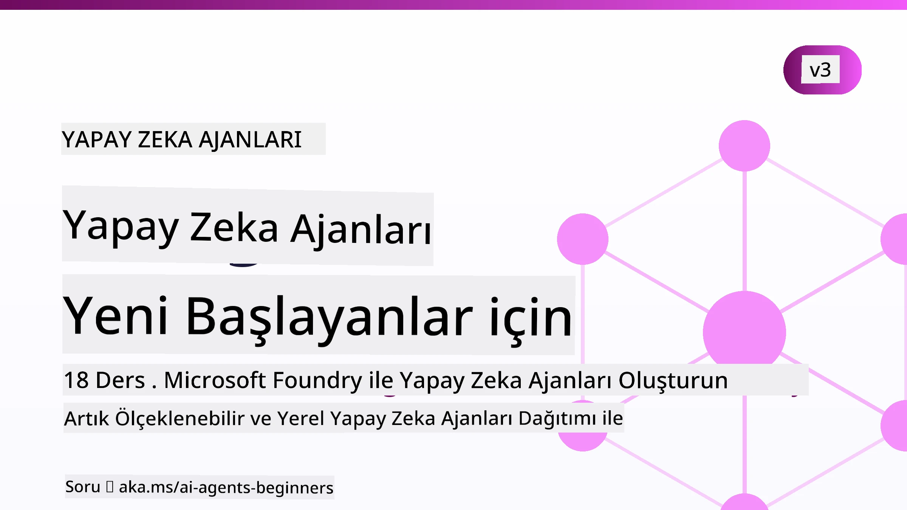

# Yeni Başlayanlar için AI Ajanları - Bir Kurs



## AI Ajanları inşa etmeye başlamak için bilmeniz gereken her şeyi öğreten bir kurs

[](https://github.com/microsoft/ai-agents-for-beginners/blob/master/LICENSE?WT.mc_id=academic-105485-koreyst)
[](https://GitHub.com/microsoft/ai-agents-for-beginners/graphs/contributors/?WT.mc_id=academic-105485-koreyst)
[](https://GitHub.com/microsoft/ai-agents-for-beginners/issues/?WT.mc_id=academic-105485-koreyst)
[](https://GitHub.com/microsoft/ai-agents-for-beginners/pulls/?WT.mc_id=academic-105485-koreyst)
[](http://makeapullrequest.com?WT.mc_id=academic-105485-koreyst)

### 🌐 Çok Dilli Destek

#### GitHub Action ile desteklenmektedir (Otomatik & Her Zaman Güncel)

<!-- CO-OP TRANSLATOR LANGUAGES TABLE START -->
[Arapça](../ar/README.md) | [Bengalce](../bn/README.md) | [Bulgarca](../bg/README.md) | [Burma (Myanmar)](../my/README.md) | [Çince (Basitleştirilmiş)](../zh-CN/README.md) | [Çince (Geleneksel, Hong Kong)](../zh-HK/README.md) | [Çince (Geleneksel, Makao)](../zh-MO/README.md) | [Çince (Geleneksel, Tayvan)](../zh-TW/README.md) | [Hırvatça](../hr/README.md) | [Çekçe](../cs/README.md) | [Danca](../da/README.md) | [Felemenkçe](../nl/README.md) | [Estonca](../et/README.md) | [Fince](../fi/README.md) | [Fransızca](../fr/README.md) | [Almanca](../de/README.md) | [Yunanca](../el/README.md) | [İbranice](../he/README.md) | [Hintçe](../hi/README.md) | [Macarca](../hu/README.md) | [Endonezce](../id/README.md) | [İtalyanca](../it/README.md) | [Japonca](../ja/README.md) | [Kannada](../kn/README.md) | [Khmer](../km/README.md) | [Korece](../ko/README.md) | [Litvanca](../lt/README.md) | [Malayca](../ms/README.md) | [Malayalamca](../ml/README.md) | [Marathi](../mr/README.md) | [Nepalce](../ne/README.md) | [Nijerya Pidgin](../pcm/README.md) | [Norveççe](../no/README.md) | [Farsça (Farsi)](../fa/README.md) | [Lehçe](../pl/README.md) | [Portekizce (Brezilya)](../pt-BR/README.md) | [Portekizce (Portekiz)](../pt-PT/README.md) | [Pencapça (Gurmukhi)](../pa/README.md) | [Rumence](../ro/README.md) | [Rusça](../ru/README.md) | [Sırpça (Kiril)](../sr/README.md) | [Slovakça](../sk/README.md) | [Slovence](../sl/README.md) | [İspanyolca](../es/README.md) | [Svahili](../sw/README.md) | [İsveççe](../sv/README.md) | [Tagalog (Filipince)](../tl/README.md) | [Tamilce](../ta/README.md) | [Telugu](../te/README.md) | [Tayca](../th/README.md) | [Türkçe](./README.md) | [Ukraynaca](../uk/README.md) | [Urduca](../ur/README.md) | [Vietnamca](../vi/README.md)

> **Yerel Olarak Klonlamayı mı Tercih Ediyorsunuz?**
>
> Bu depo 50'den fazla dil çevirisini içerir ve bu da indirme boyutunu önemli ölçüde artırır. Çeviriler olmadan klonlamak için, sparse checkout kullanın:
>
> **Bash / macOS / Linux:**
> ```bash
> git clone --filter=blob:none --sparse https://github.com/microsoft/ai-agents-for-beginners.git
> cd ai-agents-for-beginners
> git sparse-checkout set --no-cone '/*' '!translations' '!translated_images'
> ```
>
> **CMD (Windows):**
> ```cmd
> git clone --filter=blob:none --sparse https://github.com/microsoft/ai-agents-for-beginners.git
> cd ai-agents-for-beginners
> git sparse-checkout set --no-cone "/*" "!translations" "!translated_images"
> ```
>
> Bu, kursu tamamlamak için ihtiyacınız olan her şeyi çok daha hızlı bir indirme ile sağlar.
<!-- CO-OP TRANSLATOR LANGUAGES TABLE END -->

**Ek çeviri dillerinin desteklenmesini istiyorsanız, bunlar [burada](https://github.com/Azure/co-op-translator/blob/main/getting_started/supported-languages.md) listelenmiştir.**

[](https://GitHub.com/microsoft/ai-agents-for-beginners/watchers/?WT.mc_id=academic-105485-koreyst)
[](https://GitHub.com/microsoft/ai-agents-for-beginners/network/?WT.mc_id=academic-105485-koreyst)
[](https://GitHub.com/microsoft/ai-agents-for-beginners/stargazers/?WT.mc_id=academic-105485-koreyst)

[](https://discord.com/invite/ATgtXmAS5D)


## 🌱 Başlarken

Bu kursta AI Ajanları oluşturmanın temel prensiplerini kapsayan dersler vardır. Her ders kendi konusunu kapsar, istediğiniz yerden başlayabilirsiniz!

Bu kurs için çoklu dil desteği bulunmaktadır. Mevcut diller için [buraya bakın](#-çok-dilli-destek).

Eğer Generatif AI modelleri ile ilk kez inşaa yapıyorsanız, 21 ders içeren [Yeni Başlayanlar için Generatif AI](https://aka.ms/genai-beginners) kursumuza göz atın.

[Bu depoya yıldız (🌟) vermeyi](https://docs.github.com/en/get-started/exploring-projects-on-github/saving-repositories-with-stars?WT.mc_id=academic-105485-koreyst) ve [forklamayı](https://github.com/microsoft/ai-agents-for-beginners/fork) unutmayın, böylece kodu çalıştırabilirsiniz.

### Diğer Öğrencilerle Tanışın, Sorularınızı Yanıtlayın

Eğer takılırsanız veya AI Ajanları oluşturma ile ilgili herhangi bir sorunuz olursa, [Microsoft Foundry Discord](https://aka.ms/ai-agents/discord) içindeki özel Discord kanalımıza katılın.

### İhtiyacınız Olanlar

Bu kurstaki her ders kod örnekleri içerir, bunları code_samples klasöründe bulabilirsiniz. Kendi kopyanızı oluşturmak için [bu depoyu forklayabilirsiniz](https://github.com/microsoft/ai-agents-for-beginners/fork).  

Bu egzersizlerdeki kod örnekleri Microsoft Agent Framework ile Microsoft Foundry Agent Service V2 kullanır:

- [Microsoft Foundry](https://aka.ms/ai-agents-beginners/ai-foundry) - Azure Hesabı Gerekli

Bu kurs Microsoft'tan aşağıdaki AI Ajan framework'leri ve servislerini kullanır:

- [Microsoft Agent Framework (MAF)](https://learn.microsoft.com/agent-framework/overview/)
- [Microsoft Foundry Agent Service V2](https://aka.ms/ai-agents-beginners/ai-agent-service)

Bazı kod örnekleri ayrıca [MiniMax](https://platform.minimaxi.com/) gibi büyük bağlam modelleri (204K token'a kadar) sunan OpenAI uyumlu alternatif sağlayıcıları destekler. Yapılandırma ayrıntıları için [Kurs Kurulumu](./00-course-setup/README.md) bölümüne bakınız.

Bu kursun kodunu çalıştırma hakkında daha fazla bilgi için [Kurs Kurulumu](./00-course-setup/README.md) sayfasını ziyaret edin.

## 🙏 Yardım etmek ister misiniz?

Önerileriniz mi var veya yazım ya da kod hatası mı buldunuz? [Bir sorun açın](https://github.com/microsoft/ai-agents-for-beginners/issues?WT.mc_id=academic-105485-koreyst) veya [Bir pull isteği oluşturun](https://github.com/microsoft/ai-agents-for-beginners/pulls?WT.mc_id=academic-105485-koreyst)


## 📂 Her ders aşağıdakileri içerir

- README içinde yer alan yazılı bir ders ve kısa bir video
- Microsoft Agent Framework ve Microsoft Foundry kullanan Python kod örnekleri
- Öğrenmenize devam etmek için ekstra kaynak bağlantıları


## 🗃️ Dersler

| **Ders**                                    | **Metin & Kod**                                   | **Video**                                                  | **Ek Öğrenme**                                                                       |
|----------------------------------------------|--------------------------------------------------|------------------------------------------------------------|--------------------------------------------------------------------------------------|
| AI Ajanlarına Giriş ve Ajan Kullanım Durumları | [Bağlantı](./01-intro-to-ai-agents/README.md)    | [Video](https://youtu.be/3zgm60bXmQk?si=z8QygFvYQv-9WtO1)  | [Bağlantı](https://aka.ms/ai-agents-beginners/collection?WT.mc_id=academic-105485-koreyst) |
| AI Ajan Frameworklerini Keşfetmek             | [Bağlantı](./02-explore-agentic-frameworks/README.md) | [Video](https://youtu.be/ODwF-EZo_O8?si=Vawth4hzVaHv-u0H)  | [Bağlantı](https://aka.ms/ai-agents-beginners/collection?WT.mc_id=academic-105485-koreyst) |
| AI Ajan Tasarım Kalıplarını Anlamak          | [Bağlantı](./03-agentic-design-patterns/README.md) | [Video](https://youtu.be/m9lM8qqoOEA?si=BIzHwzstTPL8o9GF)  | [Bağlantı](https://aka.ms/ai-agents-beginners/collection?WT.mc_id=academic-105485-koreyst) |
| Araç Kullanımı Tasarım Kalıbı                  | [Bağlantı](./04-tool-use/README.md)               | [Video](https://youtu.be/vieRiPRx-gI?si=2z6O2Xu2cu_Jz46N)  | [Bağlantı](https://aka.ms/ai-agents-beginners/collection?WT.mc_id=academic-105485-koreyst) |
| Ajan RAG                                       | [Bağlantı](./05-agentic-rag/README.md)            | [Video](https://youtu.be/WcjAARvdL7I?si=gKPWsQpKiIlDH9A3)  | [Bağlantı](https://aka.ms/ai-agents-beginners/collection?WT.mc_id=academic-105485-koreyst) |
| Güvenilir AI Ajanları İnşa Etmek               | [Bağlantı](./06-building-trustworthy-agents/README.md) | [Video](https://youtu.be/iZKkMEGBCUQ?si=jZjpiMnGFOE9L8OK ) | [Bağlantı](https://aka.ms/ai-agents-beginners/collection?WT.mc_id=academic-105485-koreyst) |
| Planlama Tasarım Kalıbı                        | [Bağlantı](./07-planning-design/README.md)        | [Video](https://youtu.be/kPfJ2BrBCMY?si=6SC_iv_E5-mzucnC)  | [Bağlantı](https://aka.ms/ai-agents-beginners/collection?WT.mc_id=academic-105485-koreyst) |
| Çoklu-Ajan Tasarım Kalıbı                      | [Bağlantı](./08-multi-agent/README.md)            | [Video](https://youtu.be/V6HpE9hZEx0?si=rMgDhEu7wXo2uo6g)  | [Bağlantı](https://aka.ms/ai-agents-beginners/collection?WT.mc_id=academic-105485-koreyst) |

| Metakognisyon Tasarım Deseni                 | [Link](./09-metacognition/README.md)               | [Video](https://youtu.be/His9R6gw6Ec?si=8gck6vvdSNCt6OcF)  | [Link](https://aka.ms/ai-agents-beginners/collection?WT.mc_id=academic-105485-koreyst) |
| Üretimde Yapay Zeka Ajanları                      | [Link](./10-ai-agents-production/README.md)        | [Video](https://youtu.be/l4TP6IyJxmQ?si=31dnhexRo6yLRJDl)  | [Link](https://aka.ms/ai-agents-beginners/collection?WT.mc_id=academic-105485-koreyst) |
| Ajansal Protokollerin Kullanımı (MCP, A2A ve NLWeb) | [Link](./11-agentic-protocols/README.md)           | [Video](https://youtu.be/X-Dh9R3Opn8)                                 | [Link](https://aka.ms/ai-agents-beginners/collection?WT.mc_id=academic-105485-koreyst) |
| Yapay Zeka Ajanları için Bağlam Mühendisliği            | [Link](./12-context-engineering/README.md)         | [Video](https://youtu.be/F5zqRV7gEag)                                 | [Link](https://aka.ms/ai-agents-beginners/collection?WT.mc_id=academic-105485-koreyst) |
| Ajansal Belleği Yönetme                      | [Link](./13-agent-memory/README.md)     |      [Video](https://youtu.be/QrYbHesIxpw?si=vZkVwKrQ4ieCcIPx)                                                      |                                                                                        |
| Microsoft Ajan Çerçevesini Keşfetme                         | [Link](./14-microsoft-agent-framework/README.md)                            |                                                            |                                                                                        |
| Bilgisayar Kullanan Ajanlar İnşa Etme (CUA)           | [Link](./15-browser-use/README.md)     |                                                            | [Link](https://docs.browser-use.com/examples/templates/playwright-integration)         |
| Ölçeklenebilir Ajanları Dağıtma                    | [Link](./16-deploying-scalable-agents/README.md) |                                                    | [Link](https://learn.microsoft.com/azure/ai-foundry/agents/overview)                   |
| Yerel Yapay Zeka Ajanları Oluşturma                     | [Link](./17-creating-local-ai-agents/README.md)  |                                                    | [Link](https://learn.microsoft.com/azure/ai-foundry/foundry-local/)                    |
| Yapay Zeka Ajanlarını Güvence Alma                           | [Link](./18-securing-ai-agents/README.md)  |                                                            | [Link](https://aka.ms/ai-agents-beginners/collection?WT.mc_id=academic-105485-koreyst) |

## 🎒 Diğer Kurslar

Ekibimiz başka kurslar da üretiyor! Göz atın:

<!-- CO-OP TRANSLATOR OTHER COURSES START -->
### LangChain
[](https://aka.ms/langchain4j-for-beginners)
[](https://aka.ms/langchainjs-for-beginners?WT.mc_id=m365-94501-dwahlin)
[](https://github.com/microsoft/langchain-for-beginners?WT.mc_id=m365-94501-dwahlin)
---

### Azure / Edge / MCP / Ajanlar
[](https://github.com/microsoft/AZD-for-beginners?WT.mc_id=academic-105485-koreyst)
[](https://github.com/microsoft/edgeai-for-beginners?WT.mc_id=academic-105485-koreyst)
[](https://github.com/microsoft/mcp-for-beginners?WT.mc_id=academic-105485-koreyst)
[](https://github.com/microsoft/ai-agents-for-beginners?WT.mc_id=academic-105485-koreyst)

---
 
### Üretken Yapay Zeka Serisi
[](https://github.com/microsoft/generative-ai-for-beginners?WT.mc_id=academic-105485-koreyst)
[-9333EA?style=for-the-badge&labelColor=E5E7EB&color=9333EA)](https://github.com/microsoft/Generative-AI-for-beginners-dotnet?WT.mc_id=academic-105485-koreyst)

[-C084FC?style=for-the-badge&labelColor=E5E7EB&color=C084FC)](https://github.com/microsoft/generative-ai-for-beginners-java?WT.mc_id=academic-105485-koreyst)
[-E879F9?style=for-the-badge&labelColor=E5E7EB&color=E879F9)](https://github.com/microsoft/generative-ai-with-javascript?WT.mc_id=academic-105485-koreyst)

---
 
### Temel Öğrenme
[](https://aka.ms/ml-beginners?WT.mc_id=academic-105485-koreyst)
[](https://aka.ms/datascience-beginners?WT.mc_id=academic-105485-koreyst)
[](https://aka.ms/ai-beginners?WT.mc_id=academic-105485-koreyst)
[](https://github.com/microsoft/Security-101?WT.mc_id=academic-96948-sayoung)
[](https://aka.ms/webdev-beginners?WT.mc_id=academic-105485-koreyst)
[](https://aka.ms/iot-beginners?WT.mc_id=academic-105485-koreyst)
[](https://github.com/microsoft/xr-development-for-beginners?WT.mc_id=academic-105485-koreyst)

---
 
### Copilot Serisi
[](https://aka.ms/GitHubCopilotAI?WT.mc_id=academic-105485-koreyst)
[](https://github.com/microsoft/mastering-github-copilot-for-dotnet-csharp-developers?WT.mc_id=academic-105485-koreyst)
[](https://github.com/microsoft/CopilotAdventures?WT.mc_id=academic-105485-koreyst)
<!-- CO-OP TRANSLATOR OTHER COURSES END -->

## 🌟 Topluluk Teşekkürü

Agentik RAG'ı gösteren önemli kod örnekleri için [Shivam Goyal](https://www.linkedin.com/in/shivam2003/)'a teşekkür ederiz.

## Katkıda Bulunma

Bu proje katkı ve önerilere açıktır. Çoğu katkı için, katkınızı kullanma haklarını size ait olduğunu ve bu hakları
gerçekten kullandığınızın beyan edildiği bir Katkıda Bulunan Lisans Anlaşması'na (CLA)  
kabul etmeniz gerekir. Ayrıntılar için <https://cla.opensource.microsoft.com> adresini ziyaret edin.

Bir çekme isteği gönderdiğinizde, bir CLA botu otomatik olarak CLA sağlamanız gerekip gerekmediğini belirler 
ve PR’ye uygun süslemeleri (örneğin, durum kontrolü, yorum) ekler. Botun sağladığı talimatları izleyin. 
Bu, CLA kullanan tüm depolarda yalnızca bir kez yapmanız gereken bir işlemdir.

Bu proje [Microsoft Açık Kaynak Davranış Kurallarını](https://opensource.microsoft.com/codeofconduct/) benimsemiştir.
Daha fazla bilgi için [Davranış Kuralları SSS](https://opensource.microsoft.com/codeofconduct/faq/) sayfasına bakabilir veya
ek soru ya da yorumlarınız için [opencode@microsoft.com](mailto:opencode@microsoft.com) ile iletişime geçebilirsiniz.

## Marka Hakları

Bu proje projeler, ürünler veya hizmetler için marka veya logolar içerebilir. Microsoft markalarının ya da
logolarının yetkili kullanımı, 
[Microsoft'un Marka ve Marka Yönergeleri](https://www.microsoft.com/legal/intellectualproperty/trademarks/usage/general) doğrultusunda olmalıdır.
Microsoft marka veya logolarının bu projenin değiştirilmiş sürümlerinde kullanımı karışıklık yaratmamalı veya Microsoft sponsorluğu izlenimi vermemelidir.
Üçüncü taraf marka veya logolarının kullanımı, ilgili üçüncü tarafın politikalarına tabidir.

## Yardım Alma


Takılırsanız veya yapay zeka uygulamaları geliştirme hakkında sorularınız varsa, katılın:

[](https://aka.ms/foundry/discord)

Ürün geri bildirimi veya geliştirme sırasında hata bildirimi yapmak isterseniz:


[](https://aka.ms/foundry/forum)

---

<!-- CO-OP TRANSLATOR DISCLAIMER START -->
**Feragatname**:
Bu belge, AI çeviri hizmeti [Co-op Translator](https://github.com/Azure/co-op-translator) kullanılarak çevrilmiştir. Doğruluk için çaba sarf etsek de, otomatik çevirilerin hata veya yanlışlık içerebileceğini lütfen unutmayınız. Orijinal belge, kendi dilinde yetkili kaynak olarak kabul edilmelidir. Kritik bilgiler için profesyonel insan çevirisi önerilir. Bu çevirinin kullanımı sonucu ortaya çıkabilecek yanlış anlamalardan veya yanlış yorumlamalardan sorumlu değiliz.
<!-- CO-OP TRANSLATOR DISCLAIMER END -->