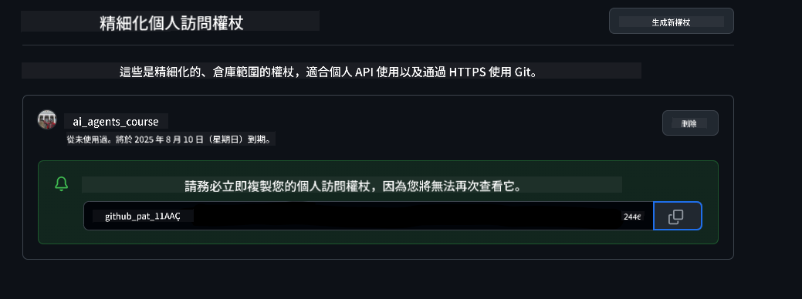

<!--
CO_OP_TRANSLATOR_METADATA:
{
  "original_hash": "96eb7f95375daa3e91778ca0295a55d9",
  "translation_date": "2025-10-15T08:32:08+00:00",
  "source_file": "00-course-setup/README.md",
  "language_code": "tw"
}
-->
# 課程設定

## 簡介

本課程將介紹如何執行課程中的程式碼範例。

## 加入其他學習者並獲得幫助

在開始複製您的倉庫之前，請加入 [AI Agents For Beginners Discord 頻道](https://aka.ms/ai-agents/discord)，以獲得設定幫助、課程相關問題解答，或與其他學習者交流。

## 複製或分叉此倉庫

首先，請複製或分叉 GitHub 倉庫。這將建立您自己的課程材料版本，方便您執行、測試和調整程式碼！

您可以點擊以下連結來 <a href="https://github.com/microsoft/ai-agents-for-beginners/fork" target="_blank">分叉倉庫</a>

現在，您應該擁有課程的分叉版本，連結如下：


### 淺層複製（建議用於工作坊 / Codespaces）

  >完整倉庫可能很大（約 3 GB），如果您只需要部分課程資料夾，淺層複製（或稀疏複製）可以避免下載大部分的歷史記錄和檔案。

#### 快速淺層複製 — 最小歷史記錄，所有檔案

在以下命令中，將 `<your-username>` 替換為您的分叉 URL（或上游 URL，如果您更喜歡）。

僅複製最新提交歷史記錄（小型下載）：

```bash|powershell
git clone --depth 1 https://github.com/<your-username>/ai-agents-for-beginners.git
```

複製特定分支：

```bash|powershell
git clone --depth 1 --branch <branch-name> https://github.com/<your-username>/ai-agents-for-beginners.git
```

#### 部分（稀疏）複製 — 最小檔案 + 僅選定資料夾

此方法使用部分複製和稀疏檢出（需要 Git 2.25+，建議使用支援部分複製的現代 Git）：

```bash|powershell
git clone --depth 1 --filter=blob:none --sparse https://github.com/<your-username>/ai-agents-for-beginners.git
```

進入倉庫資料夾：

對於 bash：

```bash
cd ai-agents-for-beginners
```

對於 Powershell：

```powershell
Set-Location ai-agents-for-beginners
```

然後指定您需要的資料夾（以下範例顯示兩個資料夾）：

```bash|powershell
git sparse-checkout set 00-course-setup 01-intro-to-ai-agents
```

複製並驗證檔案後，如果您只需要檔案並希望釋放空間（無 Git 歷史記錄），請刪除倉庫元數據（💀不可逆 — 您將失去所有 Git 功能：無提交、拉取、推送或歷史記錄訪問）。

對於 Linux/macOS：

```bash
rm -rf .git
```

對於 Windows：

```powershell
Remove-Item -Recurse -Force .git
```

#### 使用 GitHub Codespaces（建議避免本地大型下載）

- 通過 [GitHub UI](https://github.com/codespaces) 為此倉庫創建新的 Codespace。

- 在新創建的 Codespace 的終端中，執行上述淺層/稀疏複製命令，僅將所需的課程資料夾帶入 Codespace 工作區。
- 可選：在 Codespaces 中複製後，移除 .git 以回收額外空間（請參考上述移除命令）。
- 注意：如果您更喜歡直接在 Codespaces 中打開倉庫（不額外複製），請注意 Codespaces 會構建開發容器環境，可能仍會配置超出您需要的內容。在新 Codespace 中複製淺層副本可更好地控制磁碟使用。

#### 提示

- 如果您想編輯/提交，請始終替換為您的分叉 URL。
- 如果您稍後需要更多歷史記錄或檔案，可以提取它們或調整稀疏檢出以包含其他資料夾。

## 執行程式碼

本課程提供一系列 Jupyter Notebook，讓您能夠親身體驗如何構建 AI Agents。

程式碼範例使用以下選項：

**需要 GitHub 帳戶 - 免費**：

1) Semantic Kernel Agent Framework + GitHub Models Marketplace。標記為 (semantic-kernel.ipynb)
2) AutoGen Framework + GitHub Models Marketplace。標記為 (autogen.ipynb)

**需要 Azure 訂閱**：
3) Azure AI Foundry + Azure AI Agent Service。標記為 (azureaiagent.ipynb)

我們鼓勵您嘗試所有三種類型的範例，以了解哪一種最適合您。

無論您選擇哪個選項，都將決定您需要遵循的以下設定步驟：

## 系統需求

- Python 3.12+
  - **注意**：如果您尚未安裝 Python3.12，請確保安裝它。然後使用 python3.12 創建虛擬環境（venv），以確保從 requirements.txt 文件中安裝正確版本。
  
    >範例

    創建 Python 虛擬環境目錄：

    ``` bash
    python3 -m venv venv
    ```

    然後啟用虛擬環境：

    macOS 和 Linux

    ```bash
    source venv/bin/activate
    ```
  
    Windows

    ```bash
    venv\Scripts\activate
    ```

- GitHub 帳戶 - 用於訪問 GitHub Models Marketplace
- Azure 訂閱 - 用於訪問 Azure AI Foundry
- Azure AI Foundry 帳戶 - 用於訪問 Azure AI Agent Service

我們在倉庫的根目錄中包含了一個 `requirements.txt` 文件，其中列出了執行程式碼範例所需的所有 Python 套件。

您可以在倉庫根目錄的終端中執行以下命令來安裝它們：

```bash
pip install -r requirements.txt
```
我們建議創建 Python 虛擬環境以避免任何衝突和問題。

## 設定 VSCode
確保您在 VSCode 中使用正確版本的 Python。


## 使用 GitHub Models 的範例設定 

### 步驟 1：獲取您的 GitHub 個人訪問令牌 (PAT)

本課程利用 GitHub Models Marketplace，提供免費訪問大型語言模型 (LLMs)，您將使用它們來構建 AI Agents。

要使用 GitHub Models，您需要創建 [GitHub 個人訪問令牌](https://docs.github.com/en/authentication/keeping-your-account-and-data-secure/managing-your-personal-access-tokens)。

您可以在 GitHub 帳戶的 <a href="https://github.com/settings/personal-access-tokens" target="_blank">個人訪問令牌設定</a> 中完成此操作。

請遵循 [最小權限原則](https://docs.github.com/en/get-started/learning-to-code/storing-your-secrets-safely) 創建令牌。這意味著您應僅授予令牌執行本課程程式碼範例所需的權限。

1. 在螢幕左側選擇 **開發者設定** 中的 `Fine-grained tokens` 選項。
   

    然後選擇 `Generate new token`。

    

2. 為您的令牌輸入描述性名稱，反映其用途，方便日後識別。

    🔐 令牌有效期建議

    建議有效期：30 天
    為了更安全，您可以選擇更短的期限，例如 7 天 🛡️
    這是一個很好的方式來設定個人目標並在學習動力高漲時完成課程 🚀。

    

3. 將令牌的範圍限制為此倉庫的分叉。

    

4. 限制令牌的權限：在 **Permissions** 下，點擊 **Account** 標籤，然後點擊 "+ Add permissions" 按鈕。下拉選單會出現。請搜尋 **Models** 並勾選它。
    

5. 在生成令牌之前，驗證所需的權限。 

6. 在生成令牌之前，確保您準備好將令牌存儲在安全的地方，例如密碼管理器保險庫，因為生成後將無法再次查看。 

複製您剛剛創建的新令牌。現在，您需要將其添加到本課程包含的 `.env` 文件中。

### 步驟 2：創建您的 `.env` 文件

在終端中執行以下命令以創建 `.env` 文件。

```bash
cp .env.example .env
```

這將複製示例文件並在您的目錄中創建 `.env` 文件，您需要在其中填寫環境變數的值。

複製令牌後，打開您喜歡的文字編輯器，將令牌粘貼到 `.env` 文件中的 `GITHUB_TOKEN` 欄位。


現在，您應該能夠執行本課程的程式碼範例。

## 使用 Azure AI Foundry 和 Azure AI Agent Service 的範例設定

### 步驟 1：獲取您的 Azure 專案端點

請按照以下步驟創建 Azure AI Foundry 中的 hub 和專案：[Hub 資源概述](https://learn.microsoft.com/en-us/azure/ai-foundry/concepts/ai-resources)

創建專案後，您需要獲取專案的連接字串。

您可以在 Azure AI Foundry 入口網站的 **概述** 頁面找到此字串。


### 步驟 2：創建您的 `.env` 文件

在終端中執行以下命令以創建 `.env` 文件。

```bash
cp .env.example .env
```

這將複製示例文件並在您的目錄中創建 `.env` 文件，您需要在其中填寫環境變數的值。

複製令牌後，打開您喜歡的文字編輯器，將令牌粘貼到 `.env` 文件中的 `PROJECT_ENDPOINT` 欄位。

### 步驟 3：登入 Azure

作為安全最佳實踐，我們將使用 [無密鑰身份驗證](https://learn.microsoft.com/azure/developer/ai/keyless-connections?tabs=csharp%2Cazure-cli?WT.mc_id=academic-105485-koreyst) 通過 Microsoft Entra ID 驗證到 Azure OpenAI。

接下來，打開終端並執行 `az login --use-device-code` 登入您的 Azure 帳戶。

登入後，在終端中選擇您的訂閱。

## 額外環境變數 - Azure Search 和 Azure OpenAI 

在 Agentic RAG 課程 - 第 5 課中，有使用 Azure Search 和 Azure OpenAI 的範例。

如果您想執行這些範例，您需要在 `.env` 文件中添加以下環境變數：

### 概述頁面（專案）

- `AZURE_SUBSCRIPTION_ID` - 在專案的 **概述** 頁面中檢查 **專案詳細信息**。

- `AZURE_AI_PROJECT_NAME` - 在專案的 **概述** 頁面頂部查看。

- `AZURE_OPENAI_SERVICE` - 在 **概述** 頁面的 **包含的功能** 標籤中找到 **Azure OpenAI Service**。

### 管理中心

- `AZURE_OPENAI_RESOURCE_GROUP` - 在 **管理中心** 的 **概述** 頁面中查看 **專案屬性**。

- `GLOBAL_LLM_SERVICE` - 在 **連接的資源** 下，找到 **Azure AI Services** 連接名稱。如果未列出，請檢查 **Azure 入口網站** 中資源組下的 AI Services 資源名稱。

### 模型 + 端點頁面

- `AZURE_OPENAI_EMBEDDING_DEPLOYMENT_NAME` - 選擇您的嵌入模型（例如 `text-embedding-ada-002`），並記下模型詳細信息中的 **部署名稱**。

- `AZURE_OPENAI_CHAT_DEPLOYMENT_NAME` - 選擇您的聊天模型（例如 `gpt-4o-mini`），並記下模型詳細信息中的 **部署名稱**。

### Azure 入口網站

- `AZURE_OPENAI_ENDPOINT` - 找到 **Azure AI Services**，點擊它，然後進入 **資源管理**，**密鑰和端點**，向下滾動到 "Azure OpenAI endpoints"，並複製標記為 "Language APIs" 的端點。

- `AZURE_OPENAI_API_KEY` - 在同一頁面中，複製密鑰 1 或密鑰 2。

- `AZURE_SEARCH_SERVICE_ENDPOINT` - 找到您的 **Azure AI Search** 資源，點擊它，然後查看 **概述**。

- `AZURE_SEARCH_API_KEY` - 然後進入 **設定**，再進入 **密鑰**，複製主要或次要管理密鑰。

### 外部網頁

- `AZURE_OPENAI_API_VERSION` - 訪問 [API 版本生命週期](https://learn.microsoft.com/en-us/azure/ai-services/openai/api-version-deprecation#latest-ga-api-release) 頁面，查看 **最新 GA API 發佈**。

### 設定無密鑰身份驗證

為避免硬編碼憑證，我們將使用 Azure OpenAI 的無密鑰連接。為此，我們將導入 `DefaultAzureCredential`，稍後調用 `DefaultAzureCredential` 函數以獲取憑證。

```python
from azure.identity import DefaultAzureCredential, InteractiveBrowserCredential
```

## 遇到困難？
如果您在執行此設置時遇到任何問題，請加入我們的 <a href="https://discord.gg/kzRShWzttr" target="_blank">Azure AI 社群 Discord</a> 或 <a href="https://github.com/microsoft/ai-agents-for-beginners/issues?WT.mc_id=academic-105485-koreyst" target="_blank">建立問題</a>。

## 下一課程

您現在已準備好運行本課程的代碼。祝您在探索 AI Agents 的世界中學習愉快！

[AI Agents 介紹及其使用案例](../01-intro-to-ai-agents/README.md)

---

**免責聲明**：  
本文件已使用 AI 翻譯服務 [Co-op Translator](https://github.com/Azure/co-op-translator) 進行翻譯。儘管我們致力於提供準確的翻譯，請注意自動翻譯可能包含錯誤或不準確之處。原始文件的母語版本應被視為權威來源。對於關鍵信息，建議使用專業人工翻譯。我們對因使用此翻譯而產生的任何誤解或誤釋不承擔責任。