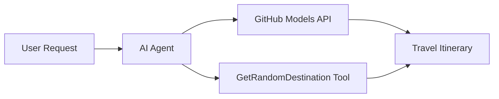

<!--
CO_OP_TRANSLATOR_METADATA:
{
  "original_hash": "23afd9be7b6ba5b69a44c3b6a78e07f6",
  "translation_date": "2025-11-06T10:02:21+00:00",
  "source_file": "01-intro-to-ai-agents/code_samples/01-dotnet-agent-framework.md",
  "language_code": "tw"
}
-->
# 🌍 AI 旅行代理人使用 Microsoft Agent Framework (.NET)

## 📋 情境概述

此筆記本展示如何使用 Microsoft Agent Framework for .NET 建立一個智能旅行規劃代理人。該代理人可以自動生成個性化的全球隨機目的地一日遊行程。

**主要功能：**
- 🎲 **隨機目的地選擇**：使用自定義工具選擇度假地點
- 🗺️ **智能旅行規劃**：創建詳細的每日行程
- 🔄 **即時串流**：支持即時和串流回應
- 🛠️ **自定義工具整合**：展示如何擴展代理人功能

## 🔧 技術架構

### 核心技術
- **Microsoft Agent Framework**：最新的 .NET 實現，用於 AI 代理人開發
- **GitHub Models 整合**：使用 GitHub 的 AI 模型推理服務
- **OpenAI API 相容性**：利用 OpenAI 客戶端庫與自定義端點
- **安全配置**：基於環境的 API 金鑰管理

### 主要組件
1. **AIAgent**：主要的代理人協調器，負責處理對話流程
2. **自定義工具**：代理人可使用的 `GetRandomDestination()` 函數
3. **聊天客戶端**：基於 GitHub Models 的對話介面
4. **串流支持**：即時回應生成功能

### 整合模式


## 🚀 快速入門

**先決條件：**
- .NET 10.0 或更高版本
- GitHub Models API 訪問令牌
- 在 `.env` 文件中配置的環境變數

**所需環境變數：**
```env
GITHUB_TOKEN=your_github_token
GITHUB_ENDPOINT=https://models.inference.ai.azure.com
GITHUB_MODEL_ID=gpt-4o-mini
```

按順序運行以下代碼範例，查看旅行代理人的運作！

---

## .NET 單文件應用：AI 旅行代理人範例

查看 `01-dotnet-agent-framework.cs` 以獲取完整的可運行代碼範例。

```bash
dotnet run 01-dotnet-agent-framework.cs
```

### 範例代碼

```csharp
static string GetRandomDestination()
{
    var destinations = new List<string>
    {
        "Paris, France",
        "Tokyo, Japan",
        "New York City, USA",
        "Sydney, Australia",
        "Rome, Italy",
        "Barcelona, Spain",
        "Cape Town, South Africa",
        "Rio de Janeiro, Brazil",
        "Bangkok, Thailand",
        "Vancouver, Canada"
    };
    var random = new Random();
    int index = random.Next(destinations.Count);
    return destinations[index];
}

// Extract configuration from environment variables
var github_endpoint = Environment.GetEnvironmentVariable("GITHUB_ENDPOINT") ?? throw new InvalidOperationException("GITHUB_ENDPOINT is not set.");
var github_model_id = Environment.GetEnvironmentVariable("GITHUB_MODEL_ID") ?? "gpt-4o-mini";
var github_token = Environment.GetEnvironmentVariable("GITHUB_TOKEN") ?? throw new InvalidOperationException("GITHUB_TOKEN is not set.");

// Configure OpenAI Client Options
var openAIOptions = new OpenAIClientOptions()
{
    Endpoint = new Uri(github_endpoint)
};

// Initialize OpenAI Client with GitHub Models Configuration
var openAIClient = new OpenAIClient(new ApiKeyCredential(github_token), openAIOptions);

// Create AI Agent with Travel Planning Capabilities
AIAgent agent = openAIClient
    .GetChatClient(github_model_id)
    .CreateAIAgent(
        instructions: "You are a helpful AI Agent that can help plan vacations for customers at random destinations",
        tools: [AIFunctionFactory.Create(GetRandomDestination)]
    );

// Execute Agent: Plan a Day Trip (Non-Streaming)
Console.WriteLine(await agent.RunAsync("Plan me a day trip"));

// Execute Agent: Plan a Day Trip (Streaming Response)
await foreach (var update in agent.RunStreamingAsync("Plan me a day trip"))
{
    Console.Write(update);
}
```

---

**免責聲明**：  
本文件使用 AI 翻譯服務 [Co-op Translator](https://github.com/Azure/co-op-translator) 進行翻譯。儘管我們致力於提供準確的翻譯，請注意自動翻譯可能包含錯誤或不準確之處。原始文件的母語版本應被視為權威來源。對於重要信息，建議使用專業人工翻譯。我們對因使用此翻譯而產生的任何誤解或誤釋不承擔責任。