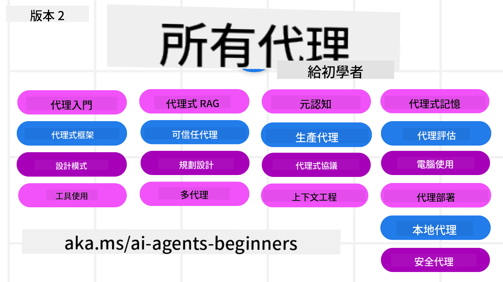

<!--
CO_OP_TRANSLATOR_METADATA:
{
  "original_hash": "f0ebcc244c445360bbb05d23e11630d3",
  "translation_date": "2025-12-17T13:53:38+00:00",
  "source_file": "README.md",
  "language_code": "tw"
}
-->
# AI 代理初學者課程

## 一門教你開始構建 AI 代理所需了解的一切的課程

### 🌐 多語言支援

#### 透過 GitHub Action 支援（自動且隨時更新）

<!-- CO-OP TRANSLATOR LANGUAGES TABLE START -->
[阿拉伯語](../ar/README.md) | [孟加拉語](../bn/README.md) | [保加利亞語](../bg/README.md) | [緬甸語](../my/README.md) | [中文（簡體）](../zh/README.md) | [中文（繁體，香港）](../hk/README.md) | [中文（繁體，澳門）](../mo/README.md) | [中文（繁體，台灣）](./README.md) | [克羅埃西亞語](../hr/README.md) | [捷克語](../cs/README.md) | [丹麥語](../da/README.md) | [荷蘭語](../nl/README.md) | [愛沙尼亞語](../et/README.md) | [芬蘭語](../fi/README.md) | [法語](../fr/README.md) | [德語](../de/README.md) | [希臘語](../el/README.md) | [希伯來語](../he/README.md) | [印地語](../hi/README.md) | [匈牙利語](../hu/README.md) | [印尼語](../id/README.md) | [義大利語](../it/README.md) | [日語](../ja/README.md) | [坎納達語](../kn/README.md) | [韓語](../ko/README.md) | [立陶宛語](../lt/README.md) | [馬來語](../ms/README.md) | [馬拉雅拉姆語](../ml/README.md) | [馬拉地語](../mr/README.md) | [尼泊爾語](../ne/README.md) | [奈及利亞皮欽語](../pcm/README.md) | [挪威語](../no/README.md) | [波斯語（法爾西語）](../fa/README.md) | [波蘭語](../pl/README.md) | [葡萄牙語（巴西）](../br/README.md) | [葡萄牙語（葡萄牙）](../pt/README.md) | [旁遮普語（古魯穆奇文）](../pa/README.md) | [羅馬尼亞語](../ro/README.md) | [俄語](../ru/README.md) | [塞爾維亞語（西里爾字母）](../sr/README.md) | [斯洛伐克語](../sk/README.md) | [斯洛文尼亞語](../sl/README.md) | [西班牙語](../es/README.md) | [斯瓦希里語](../sw/README.md) | [瑞典語](../sv/README.md) | [他加祿語（菲律賓語）](../tl/README.md) | [泰米爾語](../ta/README.md) | [泰盧固語](../te/README.md) | [泰語](../th/README.md) | [土耳其語](../tr/README.md) | [烏克蘭語](../uk/README.md) | [烏爾都語](../ur/README.md) | [越南語](../vi/README.md)
<!-- CO-OP TRANSLATOR LANGUAGES TABLE END -->

**如果您希望支援更多翻譯語言，請參考[此處](https://github.com/Azure/co-op-translator/blob/main/getting_started/supported-languages.md)**

## 🌱 入門指南

本課程涵蓋構建 AI 代理的基礎知識。每個課程涵蓋不同主題，您可以從任何一課開始！

本課程支援多語言。請參閱我們的[可用語言列表](../..)。

如果您是第一次使用生成式 AI 模型，請參考我們的[生成式 AI 初學者課程](https://aka.ms/genai-beginners)，其中包含 21 節關於生成式 AI 構建的課程。

別忘了[為此倉庫點星 (🌟)](https://docs.github.com/en/get-started/exploring-projects-on-github/saving-repositories-with-stars?WT.mc_id=academic-105485-koreyst)並[分叉此倉庫](https://github.com/microsoft/ai-agents-for-beginners/fork)以運行程式碼。

### 與其他學習者交流，獲得問題解答

如果您遇到困難或有任何關於構建 AI 代理的問題，歡迎加入我們在 [Microsoft Foundry Discord](https://aka.ms/ai-agents/discord) 的專屬 Discord 頻道。

### 您需要準備的東西

本課程的每節課都包含程式碼範例，位於 code_samples 資料夾中。您可以[分叉此倉庫](https://github.com/microsoft/ai-agents-for-beginners/fork)來建立自己的副本。

這些練習中的程式碼範例使用 Azure AI Foundry 和 GitHub 模型目錄來與語言模型互動：

- [Github 模型](https://aka.ms/ai-agents-beginners/github-models) - 免費 / 有限
- [Azure AI Foundry](https://aka.ms/ai-agents-beginners/ai-foundry) - 需要 Azure 帳戶

本課程還使用微軟的以下 AI 代理框架和服務：

- [Microsoft Agent Framework (MAF) - 新增！](https://aka.ms/ai-agents-beginners/agent-framewrok)
- [Azure AI Agent Service](https://aka.ms/ai-agents-beginners/ai-agent-service)
- [Semantic Kernel](https://aka.ms/ai-agents-beginners/semantic-kernel)
- [AutoGen](https://aka.ms/ai-agents/autogen)

欲了解更多關於本課程程式碼運行的資訊，請參閱[課程設置](./00-course-setup/README.md)。

## 🙏 想要幫忙嗎？

您有建議或發現拼寫或程式碼錯誤嗎？請[提出問題](https://github.com/microsoft/ai-agents-for-beginners/issues?WT.mc_id=academic-105485-koreyst)或[建立拉取請求](https://github.com/microsoft/ai-agents-for-beginners/pulls?WT.mc_id=academic-105485-koreyst)

## 📂 每節課包含

- 位於 README 的書面課程與短影片
- 支援 Azure AI Foundry 和 Github 模型（免費）的 Python 程式碼範例
- 延伸學習資源連結

## 🗃️ 課程列表

| **課程**                                     | **文字與程式碼**                                    | **影片**                                                  | **延伸學習**                                                                     |
|----------------------------------------------|----------------------------------------------------|------------------------------------------------------------|----------------------------------------------------------------------------------------|
| AI 代理與代理使用案例介紹                     | [連結](./01-intro-to-ai-agents/README.md)          | [影片](https://youtu.be/3zgm60bXmQk?si=z8QygFvYQv-9WtO1)  | [連結](https://aka.ms/ai-agents-beginners/collection?WT.mc_id=academic-105485-koreyst) |
| 探索 AI 代理框架                             | [連結](./02-explore-agentic-frameworks/README.md)  | [影片](https://youtu.be/ODwF-EZo_O8?si=Vawth4hzVaHv-u0H)  | [連結](https://aka.ms/ai-agents-beginners/collection?WT.mc_id=academic-105485-koreyst) |
| 理解 AI 代理設計模式                         | [連結](./03-agentic-design-patterns/README.md)     | [影片](https://youtu.be/m9lM8qqoOEA?si=BIzHwzstTPL8o9GF)  | [連結](https://aka.ms/ai-agents-beginners/collection?WT.mc_id=academic-105485-koreyst) |
| 工具使用設計模式                             | [連結](./04-tool-use/README.md)                    | [影片](https://youtu.be/vieRiPRx-gI?si=2z6O2Xu2cu_Jz46N)  | [連結](https://aka.ms/ai-agents-beginners/collection?WT.mc_id=academic-105485-koreyst) |
| 代理式 RAG                                  | [連結](./05-agentic-rag/README.md)                 | [影片](https://youtu.be/WcjAARvdL7I?si=gKPWsQpKiIlDH9A3)  | [連結](https://aka.ms/ai-agents-beginners/collection?WT.mc_id=academic-105485-koreyst) |
| 建立值得信賴的 AI 代理                       | [連結](./06-building-trustworthy-agents/README.md) | [影片](https://youtu.be/iZKkMEGBCUQ?si=jZjpiMnGFOE9L8OK ) | [連結](https://aka.ms/ai-agents-beginners/collection?WT.mc_id=academic-105485-koreyst) |
| 規劃設計模式                                 | [連結](./07-planning-design/README.md)             | [影片](https://youtu.be/kPfJ2BrBCMY?si=6SC_iv_E5-mzucnC)  | [連結](https://aka.ms/ai-agents-beginners/collection?WT.mc_id=academic-105485-koreyst) |
| 多代理設計模式                               | [連結](./08-multi-agent/README.md)                 | [影片](https://youtu.be/V6HpE9hZEx0?si=rMgDhEu7wXo2uo6g)  | [連結](https://aka.ms/ai-agents-beginners/collection?WT.mc_id=academic-105485-koreyst) |
| 元認知設計模式                               | [連結](./09-metacognition/README.md)               | [影片](https://youtu.be/His9R6gw6Ec?si=8gck6vvdSNCt6OcF)  | [連結](https://aka.ms/ai-agents-beginners/collection?WT.mc_id=academic-105485-koreyst) |
| AI 代理在生產環境                      | [Link](./10-ai-agents-production/README.md)        | [Video](https://youtu.be/l4TP6IyJxmQ?si=31dnhexRo6yLRJDl)  | [Link](https://aka.ms/ai-agents-beginners/collection?WT.mc_id=academic-105485-koreyst) |
| 使用 Agentic 協議 (MCP、A2A 和 NLWeb) | [Link](./11-agentic-protocols/README.md)           | [Video](https://youtu.be/X-Dh9R3Opn8)                                 | [Link](https://aka.ms/ai-agents-beginners/collection?WT.mc_id=academic-105485-koreyst) |
| AI 代理的上下文工程            | [Link](./12-context-engineering/README.md)         | [Video](https://youtu.be/F5zqRV7gEag)                                 | [Link](https://aka.ms/ai-agents-beginners/collection?WT.mc_id=academic-105485-koreyst) |
| 管理 Agentic 記憶                      | [Link](./13-agent-memory/README.md)     |      [Video](https://youtu.be/QrYbHesIxpw?si=vZkVwKrQ4ieCcIPx)                                                      |                                                                                        |
| 探索 Microsoft Agent Framework                         | [Link](./14-microsoft-agent-framework/README.md)                            |                                                            |                                                                                        |
| 建立電腦使用代理 (CUA)           | 即將推出                            |                                                            |                                                                                        |
| 部署可擴展代理                    | 即將推出                            |                                                            |                                                                                        |
| 建立本地 AI 代理                     | 即將推出                               |                                                            |                                                                                        |
| 保護 AI 代理                           | 即將推出                               |                                                            |                                                                                        |

## 🎒 其他課程

我們團隊還製作了其他課程！請查看：

<!-- CO-OP TRANSLATOR OTHER COURSES START -->
### LangChain

---

### Azure / Edge / MCP / Agents

---
 
### 生成式 AI 系列

[-9333EA?style=for-the-badge&labelColor=E5E7EB&color=9333EA)](https://github.com/microsoft/Generative-AI-for-beginners-dotnet?WT.mc_id=academic-105485-koreyst)
[-C084FC?style=for-the-badge&labelColor=E5E7EB&color=C084FC)](https://github.com/microsoft/generative-ai-for-beginners-java?WT.mc_id=academic-105485-koreyst)
[-E879F9?style=for-the-badge&labelColor=E5E7EB&color=E879F9)](https://github.com/microsoft/generative-ai-with-javascript?WT.mc_id=academic-105485-koreyst)

---
 
### 核心學習

---
 
### Copilot 系列

<!-- CO-OP TRANSLATOR OTHER COURSES END -->

## 🌟 社群感謝

感謝 [Shivam Goyal](https://www.linkedin.com/in/shivam2003/) 貢獻了展示 Agentic RAG 的重要程式碼範例。

## 貢獻

本專案歡迎貢獻與建議。大多數貢獻需要您同意一份
貢獻者授權協議 (CLA)，聲明您有權利且確實授權我們
使用您的貢獻。詳情請參閱 <https://cla.opensource.microsoft.com>。

當您提交拉取請求時，CLA 機器人會自動判斷您是否需要提供
CLA，並適當標註 PR（例如狀態檢查、評論）。只需按照機器人
提供的指示操作。您在所有使用我們 CLA 的倉庫中只需執行一次。

本專案已採用 [Microsoft 開源行為準則](https://opensource.microsoft.com/codeofconduct/)。
更多資訊請參閱 [行為準則常見問題](https://opensource.microsoft.com/codeofconduct/faq/) 或
聯絡 [opencode@microsoft.com](mailto:opencode@microsoft.com) 提出任何額外問題或意見。

## 商標

本專案可能包含專案、產品或服務的商標或標誌。授權使用 Microsoft
商標或標誌須遵守並遵循
[Microsoft 商標與品牌指南](https://www.microsoft.com/legal/intellectualproperty/trademarks/usage/general)。
在本專案修改版本中使用 Microsoft 商標或標誌不得造成混淆或暗示 Microsoft 贊助。
任何第三方商標或標誌的使用均須遵守該第三方的政策。

## 尋求協助

如果您遇到困難或對建立 AI 應用有任何疑問，請加入：

如果您在開發過程中有產品反饋或錯誤，請造訪：

---

<!-- CO-OP TRANSLATOR DISCLAIMER START -->
**免責聲明**：  
本文件係使用 AI 翻譯服務 [Co-op Translator](https://github.com/Azure/co-op-translator) 進行翻譯。雖然我們致力於確保翻譯的準確性，但請注意，自動翻譯可能包含錯誤或不準確之處。原始文件的母語版本應視為權威來源。對於重要資訊，建議採用專業人工翻譯。我們不對因使用本翻譯而產生的任何誤解或誤釋負責。
<!-- CO-OP TRANSLATOR DISCLAIMER END -->