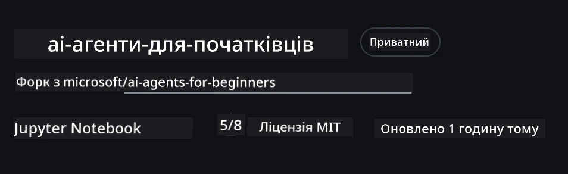
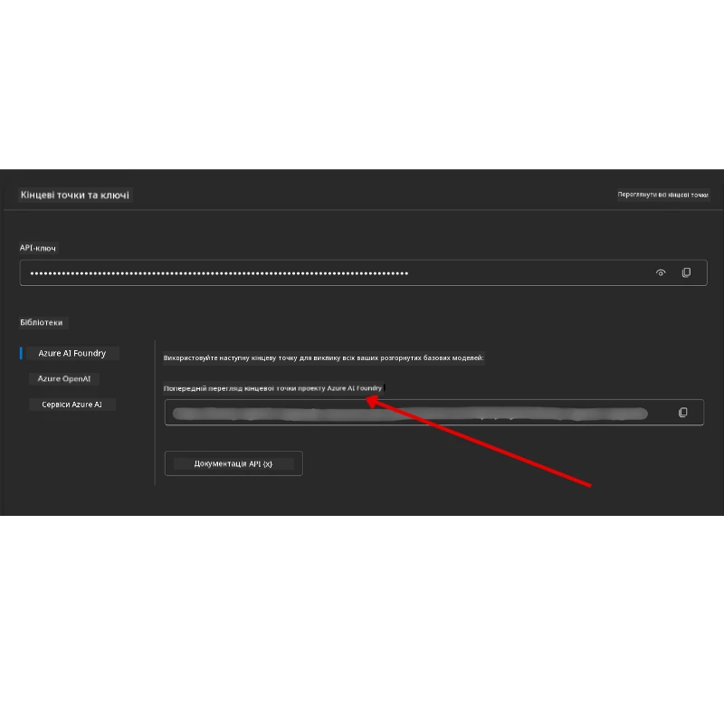

# Налаштування курсу

## Вступ

У цьому уроці буде розглянуто, як запускати приклади коду цього курсу.

## Приєднуйтесь до інших учнів і отримуйте допомогу

Перш ніж почати клонування свого репозиторію, приєднайтесь до [каналу Discord AI Agents For Beginners](https://aka.ms/ai-agents/discord), щоб отримати допомогу з налаштування, задати питання щодо курсу або поспілкуватися з іншими учнями.

## Клонуйте або створіть форк цього репозиторію

Щоб почати, будь ласка, клонувати або створіть форк репозиторію на GitHub. Це створить вашу власну версію матеріалів курсу, щоб ви могли запускати, тестувати та налаштовувати код!

Це можна зробити, натиснувши посилання <a href="https://github.com/microsoft/ai-agents-for-beginners/fork" target="_blank">створити форк репозиторію</a>

Тепер у вас має бути власна форкована версія цього курсу за наступним посиланням:



### Мілкий клон (рекомендується для воркшопу / Codespaces)

  >Повний репозиторій може бути великим (~3 ГБ), якщо завантажити всю історію та всі файли. Якщо ви просто відвідуєте воркшоп або потрібно лише кілька папок уроків, мілкий клон (або частковий клон) уникає більшості завантажень, обрізаючи історію та/або пропускаючи великі об’єкти.

#### Швидкий мілкий клон — мінімальна історія, всі файли

Замініть `<your-username>` у наведених нижче командах на URL вашого форку (або URL upstream, якщо ви віддаєте перевагу).

Щоб клонувати тільки останню історію коммітів (малий обсяг завантаження):

```bash|powershell
git clone --depth 1 https://github.com/<your-username>/ai-agents-for-beginners.git
```

Щоб клонувати конкретну гілку:

```bash|powershell
git clone --depth 1 --branch <branch-name> https://github.com/<your-username>/ai-agents-for-beginners.git
```

#### Частковий (sparse) клон — мінімум великих об’єктів + лише обрані папки

Це використовує частковий клон і sparse-checkout (вимагає Git 2.25+ та рекомендується сучасний Git з підтримкою часткового клонування):

```bash|powershell
git clone --depth 1 --filter=blob:none --sparse https://github.com/<your-username>/ai-agents-for-beginners.git
```

Перейдіть у папку репозиторію:

```bash|powershell
cd ai-agents-for-beginners
```

Потім вкажіть, які папки ви хочете (приклад нижче показує дві папки):

```bash|powershell
git sparse-checkout set 00-course-setup 01-intro-to-ai-agents
```

Після клонування і перевірки файлів, якщо вам потрібні лише файли і ви хочете звільнити місце (без історії git), видаліть метадані репозиторію (💀незворотньо — ви втратите усі функції Git: комміти, пулли, пуші та доступ до історії).

```bash
# zsh/bash
rm -rf .git
```

```powershell
# PowerShell
Remove-Item -Recurse -Force .git
```

#### Використання GitHub Codespaces (рекомендується, щоб уникнути великих локальних завантажень)

- Створіть новий Codespace для цього репозиторію через [GitHub UI](https://github.com/codespaces).  

- У терміналі створеного Codespace виконайте одну з команд мілкого/часткового клонування вище, щоб завантажити лише потрібні папки уроків у робоче середовище Codespace.
- Опційно: після клонування всередині Codespaces видаліть .git, щоб звільнити місце (див. команди видалення вище).
- Примітка: якщо ви хочете відкрити репозиторій безпосередньо в Codespaces (без додаткового клонування), майте на увазі, що Codespaces створює середовище devcontainer і може все одно налаштовувати більше, ніж потрібно. Клонування мілкого копію всередині нового Codespace дає більше контролю над використанням диска.

#### Поради

- Завжди замінюйте URL клонування на ваш форк, якщо хочете редагувати/комітити.
- Якщо пізніше знадобиться більше історії або файлів, можна їх отримати або відкоригувати sparse-checkout для додавання додаткових папок.

## Запуск коду

Цей курс пропонує серію Jupyter Notebook, які ви можете запускати для практичного досвіду створення AI Аґентів.

Приклади коду використовують **Microsoft Agent Framework (MAF)** з `AzureAIProjectAgentProvider`, який підключається до **Azure AI Agent Service V2** (API Відповідей) через **Microsoft Foundry**.

Всі Python-ноутбуки мають маркування `*-python-agent-framework.ipynb`.

## Вимоги

- Python 3.12+
  - **ПРИМІТКА**: Якщо у вас не встановлений Python3.12, переконайтеся, що ви встановили його. Потім створіть віртуальне середовище з python3.12, щоб переконатися, що необхідні версії встановлені згідно з requirements.txt.
  
    >Приклад

    Створіть директорію Python venv:

    ```bash|powershell
    python -m venv venv
    ```

    Потім активуйте середовище venv для:

    ```bash
    # zsh/bash
    source venv/bin/activate
    ```
  
    ```dos
    # Command Prompt for Windows
    venv\Scripts\activate
    ```

- .NET 10+: Для прикладів на .NET, встановіть [.NET 10 SDK](https://dotnet.microsoft.com/download/dotnet/10.0) або новіший. Потім перевірте версію встановленого .NET SDK:

    ```bash|powershell
    dotnet --list-sdks
    ```

- **Azure CLI** — необхідний для автентифікації. Встановіть за посиланням [aka.ms/installazurecli](https://aka.ms/installazurecli).
- **Підписка Azure** — для доступу до Microsoft Foundry та Azure AI Agent Service.
- **Проект Microsoft Foundry** — проект з розгорнутою моделлю (наприклад, `gpt-4o`). Див. [Крок 1](../../../00-course-setup) нижче.

У корені цього репозиторію є файл `requirements.txt`, який містить всі необхідні пакети Python для запуску прикладів коду.

Ви можете встановити їх, виконавши наступну команду у терміналі в корені репозиторію:

```bash|powershell
pip install -r requirements.txt
```

Рекомендуємо створити віртуальне середовище Python, щоб уникнути будь-яких конфліктів або проблем.

## Налаштування VSCode

Переконайтеся, що у VSCode використовується правильна версія Python.


## Налаштування Microsoft Foundry і Azure AI Agent Service

### Крок 1: Створення проекту Microsoft Foundry

Для запуску ноутбуків потрібен Azure AI Foundry **hub** та **проект** з розгорнутою моделлю.

1. Перейдіть на [ai.azure.com](https://ai.azure.com) і увійдіть під своїм обліковим записом Azure.
2. Створіть **hub** (або використайте існуючий). Див.: [Огляд ресурсів Hub](https://learn.microsoft.com/azure/ai-foundry/concepts/ai-resources).
3. Всередині hub створіть **проект**.
4. Розгорніть модель (наприклад, `gpt-4o`) у розділі **Models + Endpoints** → **Deploy model**.

### Крок 2: Отримайте URL кінцевої точки проекту та назву розгортання моделі

У порталі Microsoft Foundry:

- **Project Endpoint** — перейдіть на сторінку **Overview** і скопіюйте URL кінцевої точки.



- **Model Deployment Name** — перейдіть до **Models + Endpoints**, оберіть розгорнуту модель і запишіть її **Deployment name** (наприклад, `gpt-4o`).

### Крок 3: Увійдіть в Azure за допомогою `az login`

Всі ноутбуки використовують **`AzureCliCredential`** для автентифікації — не потрібно керувати API ключами. Це вимагає увійти через Azure CLI.

1. **Встановіть Azure CLI**, якщо ще не зробили це: [aka.ms/installazurecli](https://aka.ms/installazurecli)

2. **Увійдіть**, виконавши:

    ```bash|powershell
    az login
    ```

    Або якщо ви у віддаленому/Codespace середовищі без браузера:

    ```bash|powershell
    az login --use-device-code
    ```

3. **Виберіть підписку**, якщо буде запит — виберіть ту, у якій знаходиться ваш проект Foundry.

4. **Перевірте**, що ви увійшли:

    ```bash|powershell
    az account show
    ```

> **Чому `az login`?** Ноутбуки автентифікуються через `AzureCliCredential` з пакету `azure-identity`. Це означає, що ваша сесія Azure CLI надає облікові дані — без API ключів або секретів у вашому файлі `.env`. Це [краща практика з безпеки](https://learn.microsoft.com/azure/developer/ai/keyless-connections).

### Крок 4: Створіть файл `.env`

Скопіюйте приклад файлу:

```bash
# zsh/bash
cp .env.example .env
```

```powershell
# PowerShell
Copy-Item .env.example .env
```

Відкрийте `.env` і заповніть ці два значення:

```env
AZURE_AI_PROJECT_ENDPOINT=https://<your-project>.services.ai.azure.com/api/projects/<your-project-id>
AZURE_AI_MODEL_DEPLOYMENT_NAME=gpt-4o
```

| Змінна | Де знайти |
|----------|-----------------|
| `AZURE_AI_PROJECT_ENDPOINT` | Портал Foundry → ваш проект → сторінка **Overview** |
| `AZURE_AI_MODEL_DEPLOYMENT_NAME` | Портал Foundry → **Models + Endpoints** → назва вашої розгорнутої моделі |

Ось і все для більшості уроків! Ноутбуки автентифікуються автоматично через вашу сесію `az login`.

### Крок 5: Встановіть залежності Python

```bash|powershell
pip install -r requirements.txt
```

Рекомендуємо запускати це всередині віртуального середовища, яке ви створили раніше.

## Додаткове налаштування для Уроку 5 (Agentic RAG)

Урок 5 використовує **Azure AI Search** для генерації з підтримкою пошуку. Якщо плануєте запускати цей урок, додайте ці змінні у файл `.env`:

| Змінна | Де знайти |
|----------|-----------------|
| `AZURE_SEARCH_SERVICE_ENDPOINT` | Портал Azure → ваш ресурс **Azure AI Search** → **Overview** → URL |
| `AZURE_SEARCH_API_KEY` | Портал Azure → ваш ресурс **Azure AI Search** → **Settings** → **Keys** → основний ключ адміністратора |

## Додаткове налаштування для Уроків 6 і 8 (GitHub Models)

Деякі ноутбуки в уроках 6 і 8 використовують **GitHub Models** замість Azure AI Foundry. Якщо плануєте запускати ці приклади, додайте ці змінні у файл `.env`:

| Змінна | Де знайти |
|----------|-----------------|
| `GITHUB_TOKEN` | GitHub → **Settings** → **Developer settings** → **Personal access tokens** |
| `GITHUB_ENDPOINT` | Використовуйте `https://models.inference.ai.azure.com` (значення за замовчуванням) |
| `GITHUB_MODEL_ID` | Назва моделі для використання (наприклад, `gpt-4o-mini`) |

## Додаткове налаштування для Уроку 8 (Bing Grounding Workflow)

Ноутбук з умовним робочим процесом в уроці 8 використовує **Bing grounding** через Azure AI Foundry. Якщо плануєте запускати цей приклад, додайте цю змінну до файлу `.env`:

| Змінна | Де знайти |
|----------|-----------------|
| `BING_CONNECTION_ID` | Портал Azure AI Foundry → ваш проект → **Management** → **Connected resources** → ваш Bing-зв’язок → скопіюйте ID з’єднання |

## Розв’язання проблем

### Помилки перевірки SSL сертифікатів на macOS

Якщо ви на macOS і з’являється помилка на кшталт:

```plaintext
ssl.SSLCertVerificationError: [SSL: CERTIFICATE_VERIFY_FAILED] certificate verify failed: self-signed certificate in certificate chain
```

Це відома проблема з Python на macOS, коли системні SSL сертифікати не довіряються автоматично. Спробуйте такі рішення у порядку:

**Варіант 1: Запустіть скрипт встановлення сертифікатів Python (рекомендується)**

```bash
# Замініть 3.XX на вашу встановлену версію Python (наприклад, 3.12 або 3.13):
/Applications/Python\ 3.XX/Install\ Certificates.command
```

**Варіант 2: Використовуйте `connection_verify=False` у вашому ноутбуці (тільки для ноутбуків GitHub Models)**

У ноутбуці Уроку 6 (`06-building-trustworthy-agents/code_samples/06-system-message-framework.ipynb`) вже є закоментований обхідний шлях. Розкоментуйте `connection_verify=False` під час створення клієнта:

```python
client = ChatCompletionsClient(
    endpoint=endpoint,
    credential=AzureKeyCredential(token),
    connection_verify=False,  # Вимкніть перевірку SSL, якщо ви стикаєтеся з помилками сертифіката
)
```

> **⚠️ Увага:** Вимкнення перевірки SSL (`connection_verify=False`) знижує безпеку, оскільки пропускає перевірку сертифікатів. Використовуйте це тимчасово у середовищі розробки, ніколи в продакшені.

**Варіант 3: Встановіть та використайте `truststore`**

```bash
pip install truststore
```

Потім додайте наступне на початку ноутбука або скрипта перед виконанням мережевих викликів:

```python
import truststore
truststore.inject_into_ssl()
```

## Якщо застрягли

Якщо у вас виникли проблеми з цим налаштуванням, приєднуйтесь до нашого <a href="https://discord.gg/kzRShWzttr" target="_blank">Azure AI Community Discord</a> або <a href="https://github.com/microsoft/ai-agents-for-beginners/issues?WT.mc_id=academic-105485-koreyst" target="_blank">створіть issue</a>.

## Наступний урок

Ви готові запускати код для цього курсу. Бажаємо приємного навчання у світі AI Аґентів!

[Вступ до AI Аґентів і прикладів їх використання](../01-intro-to-ai-agents/README.md)

---

<!-- CO-OP TRANSLATOR DISCLAIMER START -->
**Відмова від відповідальності**:  
Цей документ було перекладено за допомогою сервісу автоматичного перекладу [Co-op Translator](https://github.com/Azure/co-op-translator). Хоча ми прагнемо до точності, будь ласка, майте на увазі, що автоматичні переклади можуть містити помилки або неточності. Оригінальний документ його рідною мовою слід вважати авторитетним джерелом. Для критично важливої інформації рекомендується звертатися до професійного перекладу, виконаного людиною. Ми не несемо відповідальності за будь-які непорозуміння або неправильні тлумачення, що виникли внаслідок використання цього перекладу.
<!-- CO-OP TRANSLATOR DISCLAIMER END -->