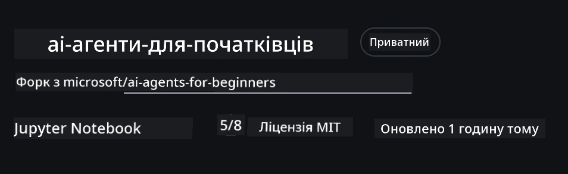
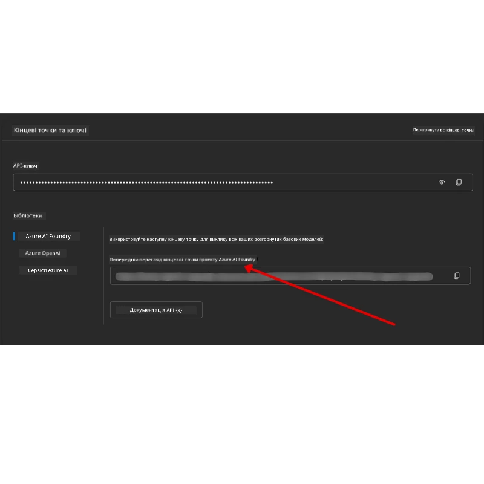

# Налаштування курсу

## Вступ

Цей урок розповість, як запускати приклади коду цього курсу.

## Приєднуйтесь до інших учнів і отримуйте допомогу

Перед тим, як почати клонувати свій репозиторій, приєднайтеся до [AI Agents For Beginners Discord channel](https://aka.ms/ai-agents/discord), щоб отримати допомогу з налаштування, відповіді на питання щодо курсу або поспілкуватися з іншими учнями.

## Клонуйте або форкніть цей репозиторій

Для початку, будь ласка, клонувати або форкнути репозиторій на GitHub. Це створить вашу власну версію матеріалів курсу, щоб ви могли запускати, тестувати і змінювати код!

Це можна зробити, натиснувши посилання на <a href="https://github.com/microsoft/ai-agents-for-beginners/fork" target="_blank">форк репозиторію</a>

Тепер у вас повинна бути власна форкнута версія цього курсу за наступним посиланням:



### Мілкий клон (рекомендується для майстерні / Codespaces)

  >Повний репозиторій може бути великим (~3 ГБ) при завантаженні повної історії та всіх файлів. Якщо ви просто відвідуєте майстерню або вам потрібні лише кілька папок уроків, мілкий клон (або розріджений клон) завантажує значно менше.

#### Швидкий мілкий клон — мінімальна історія, усі файли

Замініть `<your-username>` у наведених нижче командах на URL вашого форку (або upstream URL, якщо бажаєте).

Щоб клонувати лише останню історію комітів (малий обсяг завантаження):

```bash
git clone --depth 1 https://github.com/<your-username>/ai-agents-for-beginners.git
```

Щоб клонувати конкретну гілку:

```bash
git clone --depth 1 --branch <branch-name> https://github.com/<your-username>/ai-agents-for-beginners.git
```

#### Частковий (розріджений) клон — мінімум об'єктів + лише обрані папки

Це використовує частковий клон і sparse-checkout (потрібен Git 2.25+ та рекомендовано сучасний Git з підтримкою часткового клонування):

```bash
git clone --depth 1 --filter=blob:none --sparse https://github.com/<your-username>/ai-agents-for-beginners.git
```

Перейдіть у папку репозиторію:

```bash
cd ai-agents-for-beginners
```

Потім вкажіть, які папки ви хочете (приклад нижче показує дві папки):

```bash
git sparse-checkout set 00-course-setup 01-intro-to-ai-agents
```

Після клонування та перевірки файлів, якщо вам потрібні лише файли і бажаєте звільнити місце (без історії git), видаліть метадані репозиторію (💀неповоротно — ви втратите всю функціональність Git):

```bash
# zsh/bash
rm -rf .git
```

```powershell
# PowerShell
Remove-Item -Recurse -Force .git
```

#### Використання GitHub Codespaces (рекомендується, щоб уникнути великих локальних завантажень)

- Створіть новий Codespace для цього репозиторію через [GitHub UI](https://github.com/codespaces).  

- У терміналі новоствореного codespace виконайте одну з команд shallow/sparse clone вище, щоб завантажити лише потрібні папки уроків у робоче середовище Codespace.
- Опціонально: після клонування у Codespaces видаліть .git, щоб звільнити додаткове місце (див. команди для видалення вище).
- Примітка: Якщо ви віддаєте перевагу відкривати репозиторій безпосередньо у Codespaces (без додаткового клонування), майте на увазі, що Codespaces створить середовище devcontainer і може все ще підготувати більше, ніж вам потрібно.

#### Поради

- Завжди замінюйте URL клонування на ваш форк, якщо плануєте редагувати/комітувати.
- Якщо згодом вам знадобиться більше історії або файлів, ви можете їх отримати або налаштувати sparse-checkout для включення додаткових папок.

## Запуск коду

Цей курс пропонує серію Jupyter Notebook, які ви можете запускати, щоб отримати практичний досвід у створенні AI Агентів.

Приклади коду використовують **Microsoft Agent Framework (MAF)** з `FoundryChatClient`, який підключається до **Microsoft Foundry Agent Service V2** (Responses API) через **Microsoft Foundry**.

Всі Python ноутбуки позначені як `*-python-agent-framework.ipynb`.

## Вимоги

- Python 3.12+
  - **ПРИМІТКА**: Якщо у вас не встановлений Python 3.12, обов’язково встановіть його. Потім створіть своє середовище venv, використовуючи python3.12, щоб гарантувати, що встановлені правильні версії з файлу requirements.txt.
  
    >Приклад

    Створіть директорію Python venv:

    ```bash
    python -m venv venv
    ```

    Потім активуйте середовище venv для:

    ```bash
    # zsh/bash
    source venv/bin/activate
    ```
  
    ```dos
    # Command Prompt for Windows
    venv\Scripts\activate
    ```

- .NET 10+: Для прикладів коду на .NET, встановіть [.NET 10 SDK](https://dotnet.microsoft.com/download/dotnet/10.0) або новішу версію. Потім перевірте встановлену версію SDK:

    ```bash
    dotnet --list-sdks
    ```

- **Azure CLI** — Необхідно для автентифікації. Встановіть з [aka.ms/installazurecli](https://aka.ms/installazurecli).
- **Підписка Azure** — Для доступу до Microsoft Foundry та Microsoft Foundry Agent Service.
- **Проєкт Microsoft Foundry** — Проєкт із розгорнутим модельним рішенням (наприклад, `gpt-5-mini`). Дивіться [Крок 1](#крок-1-створіть-проект-microsoft-foundry) нижче.

У корені цього репозиторію є файл `requirements.txt` із усіма необхідними пакетами Python для запуску прикладів коду.

Ви можете встановити їх, виконавши команду в терміналі в корені репозиторію:

```bash
pip install -r requirements.txt
```

Рекомендуємо створити віртуальне середовище Python, щоб уникнути конфліктів і проблем.

## Налаштування VSCode

Переконайтеся, що ви використовуєте правильну версію Python у VSCode.


## Налаштування Microsoft Foundry і Microsoft Foundry Agent Service

### Крок 1: Створіть проект Microsoft Foundry

Вам потрібні Microsoft Foundry **hub** та **проект** з розгорнутою моделлю, щоб запускати ноутбуки.

1. Перейдіть на [ai.azure.com](https://ai.azure.com) і увійдіть у свій акаунт Azure.
2. Створіть **hub** (або використайте існуючий). Інструкції: [Hub resources overview](https://learn.microsoft.com/azure/ai-foundry/concepts/ai-resources).
3. В межах hub створіть **проект**.
4. Розгорніть модель (наприклад, `gpt-5-mini`) через **Models + Endpoints** → **Deploy model**.

### Крок 2: Отримайте кінцеву точку проєкту і назву розгортання моделі

У вашому проєкті в порталі Microsoft Foundry:

- **Project Endpoint** — Перейдіть на сторінку **Overview** і скопіюйте URL кінцевої точки.



- **Model Deployment Name** — Перейдіть до **Models + Endpoints**, виберіть розгорнуту модель і зафіксуйте назву розгортання (наприклад, `gpt-5-mini`).

### Крок 3: Увійдіть в Azure за допомогою `az login`

Більшість ноутбуків автентифікуються через ваш вхід у **Azure CLI** — з використанням `AzureCliCredential` або `DefaultAzureCredential` (які підхоплюють вашу сесію `az login`) з пакету `azure-identity` — тож не потребують API ключів. Окремі уроки і необов’язкові інтеграції використовують API ключі; перевірте умови кожного уроку для додаткових змінних середовища. Для цього потрібно бути увійшовши через Azure CLI.

1. **Встановіть Azure CLI**, якщо ще не зробили цього: [aka.ms/installazurecli](https://aka.ms/installazurecli)

2. **Увійдіть** командою:

    ```bash
    az login
    ```

    Якщо ви вдалині або в Codespace без браузера:

    ```bash
    az login --use-device-code
    ```

3. **Виберіть вашу підписку**, якщо буде запит — оберіть ту, у якій розгорнуто Foundry проект.

4. **Перевірте** вхід:

    ```bash
    az account show
    ```

> **Чому `az login`?** Ноутбуки автентифікуються з `AzureCliCredential` (або `DefaultAzureCredential`, що також використовує вхід Azure CLI) з пакету `azure-identity`. Це означає, що ваша сесія Azure CLI надає облікові дані — без API ключів або секретів у файлі `.env`. Це [краща практика безпеки](https://learn.microsoft.com/azure/developer/ai/keyless-connections).

### Крок 4: Створіть файл `.env`

Скопіюйте приклад файлу:

```bash
# zsh/bash
cp .env.example .env
```

```powershell
# PowerShell
Copy-Item .env.example .env
```

Відкрийте `.env` і заповніть ці два значення:

```env
AZURE_AI_PROJECT_ENDPOINT=https://<your-project>.services.ai.azure.com/api/projects/<your-project-id>
AZURE_AI_MODEL_DEPLOYMENT_NAME=gpt-5-mini
```

| Змінна | Де знайти |
|----------|-----------------|
| `AZURE_AI_PROJECT_ENDPOINT` | Портал Foundry → ваш проєкт → сторінка **Overview** |
| `AZURE_AI_MODEL_DEPLOYMENT_NAME` | Портал Foundry → **Models + Endpoints** → ім’я розгорнутої моделі |

Це все для більшості уроків! Ноутбуки автентифікуються автоматично через вашу сесію `az login`.

### Крок 5: Встановіть залежності Python

```bash
pip install -r requirements.txt
```

Рекомендуємо запускати це всередині віртуального середовища, яке створили раніше.

## Необов’язкове налаштування: Azure AI Search (уроки 5 і 16)

Урок 5 (Agentic RAG) та урок 16 запускають "з коробки" з **пам’яттю в оперативній пам’яті** — без додаткових ресурсів Azure. Якщо ви хочете використовувати реальний індекс **Azure AI Search**, зверніть увагу, що **ноутбук уроку 16 наразі використовує автентифікацію за ключем**: він переходить від пошуку в пам’яті до Azure AI Search лише, коли встановлені **обидва** параметри — `AZURE_SEARCH_SERVICE_ENDPOINT` **та** `AZURE_SEARCH_API_KEY`, інакше залишається на пошуку в пам’яті — тож для роботи з реальним індексом потрібно також вказати адміністраторський ключ. Безключова автентифікація через Microsoft Entra ID (RBAC) рекомендована для вашого продакшн-коду, узгоджена з потоком `az login`, використовуваним у всьому курсі.

Кроки RBAC нижче застосовуються до зразків у посібнику та вашого коду. Вони не ввімкнуть безключову автентифікацію в ноутбуці уроку 16; урок 16 й досі вимагає обидва: endpoint і адмінський ключ для використання Azure AI Search.

1. **Увімкніть керування доступом на основі ролей (RBAC)** у вашому сервісі пошуку:

    ```bash
    az search service update --name <service-name> --resource-group <resource-group> --auth-options aadOrApiKey
    ```

2. **Призначте собі потрібні ролі** (створення/завантаження індексів і запити):

    ```bash
    az role assignment create --assignee <your-user-or-principal-id> --role "Search Service Contributor" --scope $(az search service show -g <resource-group> -n <service-name> --query id -o tsv)
    az role assignment create --assignee <your-user-or-principal-id> --role "Search Index Data Contributor" --scope $(az search service show -g <resource-group> -n <service-name> --query id -o tsv)
    ```

3. **Додайте endpoint** у ваш файл `.env`:

| Змінна | Де знайти |
|----------|-----------------|
| `AZURE_SEARCH_SERVICE_ENDPOINT` | Портал Azure → ваш ресурс **Azure AI Search** → **Overview** → URL |
| `AZURE_SEARCH_API_KEY` | Необхідний (разом із endpoint) для активації Azure AI Search у ноутбуці уроку 16, який використовує автентифікацію за ключем. Портал Azure → **Settings** → **Keys** → основний адмінський ключ |

> **Чому без ключа?** Адмінські ключі надають повний запис у ваш сервіс пошуку і можуть бути скомпрометовані через файли `.env`. З RBAC використовується ваша особистість з `az login` — та сама безключова схема Entra ID, що застосовується у ноутбуках курсу (через `AzureCliCredential` / `DefaultAzureCredential`). Дивіться [Підключення до Azure AI Search через ролі](https://learn.microsoft.com/azure/search/search-security-rbac).

Дивіться [посібник з налаштування Azure AI Search](./AzureSearch.md) для повних прикладів створення індексів на Python і .NET.

## Додаткове налаштування для уроків, які напряму викликають Azure OpenAI (уроки 6 та 8)

Деякі ноутбуки в уроках 6 і 8 напряму викликають **Azure OpenAI** (використовуючи **Responses API**) замість того, щоб іти через проект Microsoft Foundry. Ці приклади раніше використовували GitHub Models, що застаріло та не підтримує Responses API. Додайте ці змінні у свій `.env` файл:

| Змінна | Де знайти |
|----------|-----------------|
| `AZURE_OPENAI_ENDPOINT` | Портал Azure → ваш ресурс **Azure OpenAI** → **Keys and Endpoint** → Endpoint (наприклад, `https://<your-resource>.openai.azure.com`) |
| `AZURE_OPENAI_DEPLOYMENT` | Назва розгорнутої вами моделі (наприклад, `gpt-5-mini`), що підтримує Responses API |
| `AZURE_OPENAI_API_KEY` | Опційно — якщо ви використовуєте автентифікацію за ключем замість `az login` / Entra ID |

> Responses API використовує стабільний endpoint `/openai/v1/`, тож параметр `api-version` не потрібен. Увійдіть через `az login` для безключової автентифікації Entra ID.

## Альтернативний провайдер: MiniMax (сумісний з OpenAI)

[MiniMax](https://platform.minimaxi.com/) надає моделі з великим контекстом (до 204K токенів) через API, сумісний з OpenAI. Оскільки Microsoft Agent Framework `OpenAIChatClient` працює з будь-яким OpenAI-сумісним endpoint, ви можете використовувати MiniMax як заміну для уроків, у яких використовується `OpenAIChatClient`.

Додайте ці змінні у ваш `.env` файл:

| Змінна | Де знайти |
|----------|-----------------|
| `MINIMAX_API_KEY` | [Платформа MiniMax](https://platform.minimaxi.com/) → API Keys |
| `MINIMAX_BASE_URL` | Використовуйте `https://api.minimax.io/v1` (значення за замовчуванням) |
| `MINIMAX_MODEL_ID` | Назва моделі для використання (наприклад, `MiniMax-M3`) |

**Приклад моделей**: `MiniMax-M3` (рекомендовано), `MiniMax-M2.7`, `MiniMax-M2.7-highspeed` (швидші відповіді). Назви моделей і їх доступність можуть змінюватися з часом, а доступ до певної моделі залежить від вашого облікового запису.

Приклади коду, які використовують `OpenAIChatClient` (наприклад, робочий процес бронювання готелів з уроку 14), автоматично виявлять і використовуватимуть вашу конфігурацію MiniMax за наявності змінної `MINIMAX_API_KEY`.


## Альтернативний провайдер: Foundry Local (Запуск моделей на пристрої)

[Foundry Local](https://foundrylocal.ai) — це легковагове середовище виконання, яке завантажує, керує та обслуговує мовні моделі **повністю на вашому власному комп’ютері** через API, сумісне з OpenAI — без хмари.

Оскільки `OpenAIChatClient` з Microsoft Agent Framework працює з будь-якою кінцевою точкою, сумісною з OpenAI, Foundry Local є локальною заміною Azure OpenAI.

**1. Встановіть Foundry Local**

```bash
# Windows
winget install Microsoft.FoundryLocal

# macOS
brew install foundrylocal
```

**2. Завантажте та запустіть модель** (це також запускає локальну службу):

```bash
foundry model list          # переглянути доступні моделі
foundry model run phi-4-mini
```

**3. Встановіть Python SDK**, який використовується для виявлення локальної кінцевої точки:

```bash
pip install foundry-local-sdk
```

**4. Налаштуйте Microsoft Agent Framework на вашу локальну модель:**

```python
from foundry_local import FoundryLocalManager
from agent_framework.openai import OpenAIChatClient

# Завантажує (якщо потрібно) і локально запускає модель, потім визначає кінцеву точку/порт.
manager = FoundryLocalManager("phi-4-mini")

chat_client = OpenAIChatClient(
    base_url=manager.endpoint,      # наприклад http://localhost:<port>/v1
    api_key=manager.api_key,        # завжди "не потрібно" для Foundry Local
    model_id=manager.get_model_info("phi-4-mini").id,
)

agent = chat_client.as_agent(
    name="LocalAgent",
    instructions="You are a helpful assistant running fully on-device.",
)
```

> **Примітка:** Foundry Local надає сумісну з OpenAI кінцеву точку для **Chat Completions**. Використовуйте її для локальної розробки та офлайн-сценаріїв. Для повного набору функцій **Responses API** (станові розмови тощо) використовуйте Azure OpenAI або проект Microsoft Foundry.

## Додаткове налаштування для Уроку 8 (Bing Grounding Workflow)

Умовний робочий процес у записнику уроку 8 використовує **Bing grounding** через Microsoft Foundry. Якщо ви плануєте запускати цей приклад, додайте цю змінну до вашого файлу `.env`:

| Змінна | Де знайти |
|----------|-----------------|
| `BING_CONNECTION_ID` | Портал Microsoft Foundry → ваш проєкт → **Management** → **Connected resources** → ваше з’єднання Bing → скопіюйте ID з’єднання |

## Вирішення проблем

### Помилки перевірки SSL-сертифіката на macOS

Якщо ви на macOS і зустрічаєте помилку на кшталт:

```plaintext
ssl.SSLCertVerificationError: [SSL: CERTIFICATE_VERIFY_FAILED] certificate verify failed: self-signed certificate in certificate chain
```

Це відома проблема з Python на macOS, коли системні SSL-сертифікати не довіряються автоматично. Спробуйте такі рішення в порядку:

**Варіант 1: Запустіть скрипт встановлення сертифікатів Python (рекомендовано)**

```bash
# Замініть 3.XX на вашу встановлену версію Python (наприклад, 3.12 або 3.13):
/Applications/Python\ 3.XX/Install\ Certificates.command
```

**Варіант 2: Використовуйте `connection_verify=False` у вашому записнику (тільки для записників GitHub Models)**

У записнику для Уроку 6 (`06-building-trustworthy-agents/code_samples/06-system-message-framework.ipynb`) вже включено закоментоване рішення. Розкоментуйте `connection_verify=False`, коли виникають помилки сертифіката:

```python
client = ChatCompletionsClient(
    endpoint=endpoint,
    credential=AzureKeyCredential(token),
    connection_verify=False,  # Вимкніть перевірку SSL, якщо ви стикаєтеся з помилками сертифіката
)
```

> **⚠️ Попередження:** Вимкнення перевірки SSL (`connection_verify=False`) знижує безпеку, пропускаючи валідацію сертифікатів. Використовуйте це лише як тимчасове рішення в середовищах розробки. Ніколи не застосовуйте у виробництві.

**Варіант 3: Встановіть та використовуйте `truststore`**

```bash
pip install truststore
```

Потім додайте наступне зверху вашого записника або скрипта перед будь-якими мережеваими викликами:

```python
import truststore
truststore.inject_into_ssl()
```

## Застрягли?

Якщо у вас виникли проблеми з налаштуванням, приєднуйтесь до нашого <a href="https://discord.gg/kzRShWzttr" target="_blank">Discord спільноти Azure AI</a> або <a href="https://github.com/microsoft/ai-agents-for-beginners/issues?WT.mc_id=academic-105485-koreyst" target="_blank">створіть issue</a>.

## Наступний урок

Тепер ви готові запускати код цього курсу. Бажаємо успішного вивчення світу AI агентів!

[Вступ до AI агентів та випадки використання агентів](../01-intro-to-ai-agents/README.md)

---

<!-- CO-OP TRANSLATOR DISCLAIMER START -->
**Відмова від відповідальності**:
Цей документ було перекладено за допомогою сервісу штучного інтелекту для перекладу [Co-op Translator](https://github.com/Azure/co-op-translator). Хоча ми прагнемо до точності, будь ласка, майте на увазі, що автоматичні переклади можуть містити помилки або неточності. Оригінальний документ рідною мовою слід вважати авторитетним джерелом. Для критично важливої інформації рекомендується професійний людський переклад. Ми не несемо відповідальності за будь-які непорозуміння або неправильні тлумачення, що виникли внаслідок використання цього перекладу.
<!-- CO-OP TRANSLATOR DISCLAIMER END -->