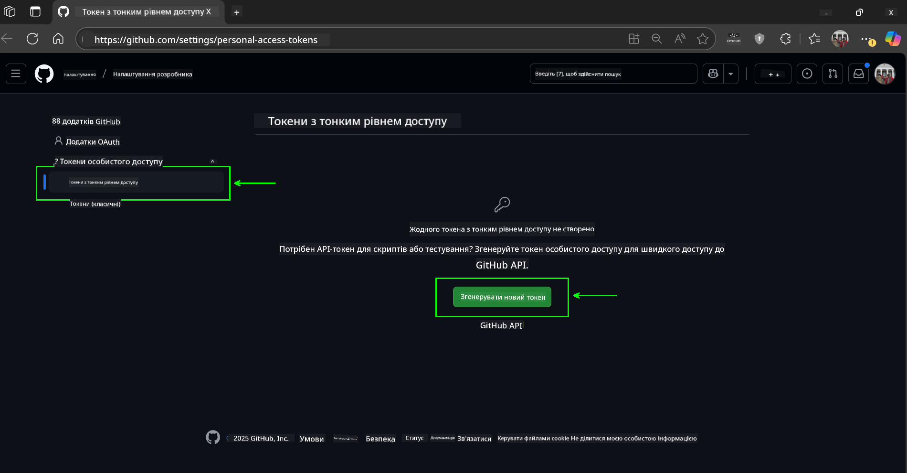

<!--
CO_OP_TRANSLATOR_METADATA:
{
  "original_hash": "76945069b52a49cd0432ae3e0b0ba22e",
  "translation_date": "2025-07-12T07:59:32+00:00",
  "source_file": "00-course-setup/README.md",
  "language_code": "uk"
}
-->
Тепер у вас має бути власна форкнута версія цього курсу за наступним посиланням:


## Запуск коду

Цей курс пропонує серію Jupyter Notebook, які ви можете запускати, щоб отримати практичний досвід створення AI-агентів.

Приклади коду використовують:

**Потрібен обліковий запис GitHub - безкоштовно**:

1) Semantic Kernel Agent Framework + GitHub Models Marketplace. Позначено як (semantic-kernel.ipynb)  
2) AutoGen Framework + GitHub Models Marketplace. Позначено як (autogen.ipynb)

**Потрібна підписка Azure**:  
3) Azure AI Foundry + Azure AI Agent Service. Позначено як (azureaiagent.ipynb)

Радимо спробувати всі три варіанти, щоб визначити, який підходить вам найкраще.

Обраний варіант визначить, які кроки налаштування вам потрібно виконати далі:

## Вимоги

- Python 3.12+  
  - **NOTE**: Якщо у вас не встановлено Python 3.12, обов’язково встановіть його. Потім створіть віртуальне середовище, використовуючи python3.12, щоб переконатися, що встановлені правильні версії пакетів з файлу requirements.txt.  
- Обліковий запис GitHub – для доступу до GitHub Models Marketplace  
- Підписка Azure – для доступу до Azure AI Foundry  
- Обліковий запис Azure AI Foundry – для доступу до Azure AI Agent Service

У корені цього репозиторію є файл `requirements.txt`, який містить усі необхідні пакети Python для запуску прикладів коду.

Ви можете встановити їх, виконавши наступну команду в терміналі в корені репозиторію:

```bash
pip install -r requirements.txt
```  
Рекомендуємо створити віртуальне середовище Python, щоб уникнути конфліктів і проблем.

## Налаштування VSCode  
Переконайтеся, що у VSCode використовується правильна версія Python.


## Налаштування для прикладів з GitHub Models

### Крок 1: Отримання вашого GitHub Personal Access Token (PAT)

Наразі цей курс використовує GitHub Models Marketplace для безкоштовного доступу до великих мовних моделей (LLM), які використовуються для створення AI агентів.

Щоб використовувати GitHub Models, вам потрібно створити [GitHub Personal Access Token](https://docs.github.com/en/authentication/keeping-your-account-and-data-secure/managing-your-personal-access-tokens).

Це можна зробити у вашому обліковому записі GitHub.

Виберіть опцію `Fine-grained tokens` зліва на екрані.

    Потім виберіть `Generate new token`.

    

Вам запропонують ввести назву токена, вибрати дату закінчення терміну дії (рекомендується: 30 днів) та встановити області дії токена (Public Repositories).

Також необхідно відредагувати дозволи цього токена: Permissions -> Models -> Дозволити доступ до GitHub Models.

Скопіюйте новий токен, який ви щойно створили. Тепер додайте його у файл `.env`, що входить до цього курсу.

### Крок 2: Створення вашого `.env` файлу

Щоб створити файл `.env`, виконайте наступну команду в терміналі:

```bash
cp .env.example .env
```

Це скопіює приклад файлу і створить `.env` у вашій директорії, де ви заповните значення для змінних середовища.

Скопіювавши ваш токен, відкрийте `.env` файл у вашому улюбленому текстовому редакторі і вставте ваш токен у поле `GITHUB_TOKEN`.

Тепер ви повинні бути готові до запуску прикладів коду цього курсу.

## Налаштування для прикладів з використанням Azure AI Foundry та Azure AI Agent Service

### Крок 1: Отримання вашого Azure Project Endpoint

Виконайте кроки для створення хабу та проекту в Azure AI Foundry, описані тут: [Hub resources overview](https://learn.microsoft.com/en-us/azure/ai-foundry/concepts/ai-resources)

Після створення проекту вам потрібно буде отримати рядок підключення для вашого проекту.

Це можна зробити, перейшовши на сторінку **Overview** вашого проекту в порталі Azure AI Foundry.


### Крок 2: Створення вашого `.env` файлу

Щоб створити файл `.env`, виконайте наступну команду в терміналі:

```bash
cp .env.example .env
```

Це скопіює приклад файлу і створить `.env` у вашій директорії, де ви заповните значення для змінних середовища.

Скопіювавши ваш токен, відкрийте `.env` файл у вашому улюбленому текстовому редакторі і вставте ваш токен у поле `PROJECT_ENDPOINT`.

### Крок 3: Увійдіть в Azure

Як найкращу практику безпеки, ми будемо використовувати [автентифікацію без ключів](https://learn.microsoft.com/azure/developer/ai/keyless-connections?tabs=csharp%2Cazure-cli?WT.mc_id=academic-105485-koreyst) для автентифікації в Azure OpenAI за допомогою Microsoft Entra ID.

Потім відкрийте термінал і виконайте команду `az login --use-device-code` для входу в обліковий запис Azure.

Після входу виберіть вашу підписку в терміналі.

## Додаткові змінні середовища – Azure Search та Azure OpenAI

Для уроку Agentic RAG - Урок 5 - є приклади, які використовують Azure Search та Azure OpenAI.

Якщо ви хочете запустити ці приклади, вам потрібно буде додати наступні змінні середовища до вашого `.env` файлу:

### Сторінка огляду (Проект)

- `AZURE_SUBSCRIPTION_ID` – Перевірте **Project details** на сторінці **Overview** вашого проекту.  
- `AZURE_AI_PROJECT_NAME` – Зверху сторінки **Overview** вашого проекту.  
- `AZURE_OPENAI_SERVICE` – Знайдіть у вкладці **Included capabilities** для **Azure OpenAI Service** на сторінці **Overview**.

### Центр управління

- `AZURE_OPENAI_RESOURCE_GROUP` – Перейдіть до **Project properties** на сторінці **Overview** в **Management Center**.  
- `GLOBAL_LLM_SERVICE` – У розділі **Connected resources** знайдіть назву підключення **Azure AI Services**. Якщо немає, перевірте в **Azure portal** у вашій групі ресурсів назву ресурсу AI Services.

### Сторінка моделей + кінцевих точок

- `AZURE_OPENAI_EMBEDDING_DEPLOYMENT_NAME` – Виберіть модель embedding (наприклад, `text-embedding-ada-002`) і зверніть увагу на **Deployment name** у деталях моделі.  
- `AZURE_OPENAI_CHAT_DEPLOYMENT_NAME` – Виберіть чат-модель (наприклад, `gpt-4o-mini`) і зверніть увагу на **Deployment name** у деталях моделі.

### Azure Portal

- `AZURE_OPENAI_ENDPOINT` – Знайдіть **Azure AI services**, натисніть на нього, перейдіть до **Resource Management**, **Keys and Endpoint**, прокрутіть до розділу "Azure OpenAI endpoints" і скопіюйте той, що позначений як "Language APIs".  
- `AZURE_OPENAI_API_KEY` – На тій же сторінці скопіюйте KEY 1 або KEY 2.  
- `AZURE_SEARCH_SERVICE_ENDPOINT` – Знайдіть ресурс **Azure AI Search**, натисніть на нього і перегляньте **Overview**.  
- `AZURE_SEARCH_API_KEY` – Перейдіть до **Settings**, потім **Keys** і скопіюйте основний або додатковий ключ адміністратора.

### Зовнішня веб-сторінка

- `AZURE_OPENAI_API_VERSION` - Відвідайте сторінку [API version lifecycle](https://learn.microsoft.com/en-us/azure/ai-services/openai/api-version-deprecation#latest-ga-api-release) у розділі **Latest GA API release**.

### Налаштування автентифікації без ключів

Замість того, щоб жорстко прописувати облікові дані, ми використаємо безключове підключення з Azure OpenAI. Для цього імпортуємо `DefaultAzureCredential` і пізніше викличемо функцію `DefaultAzureCredential` для отримання облікових даних.

```python
from azure.identity import DefaultAzureCredential, InteractiveBrowserCredential
```

## Застрягли?

Якщо у вас виникли проблеми з виконанням цього налаштування, приєднуйтесь до нашого

## Наступний урок

Тепер ви готові запускати код цього курсу. Бажаємо успіхів у вивченні світу AI-агентів!

[Вступ до AI-агентів та їх використання](../01-intro-to-ai-agents/README.md)

**Відмова від відповідальності**:  
Цей документ було перекладено за допомогою сервісу автоматичного перекладу [Co-op Translator](https://github.com/Azure/co-op-translator). Хоча ми прагнемо до точності, будь ласка, майте на увазі, що автоматичні переклади можуть містити помилки або неточності. Оригінальний документ рідною мовою слід вважати авторитетним джерелом. Для критично важливої інформації рекомендується звертатися до професійного людського перекладу. Ми не несемо відповідальності за будь-які непорозуміння або неправильні тлумачення, що виникли внаслідок використання цього перекладу.