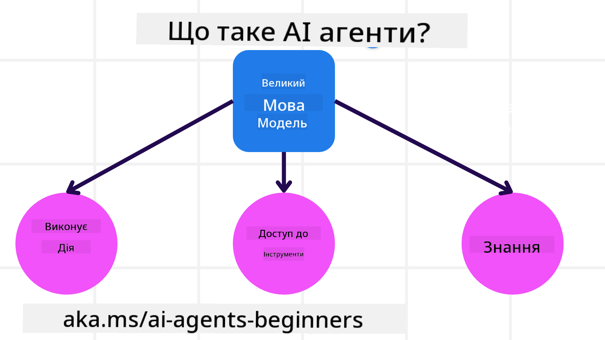
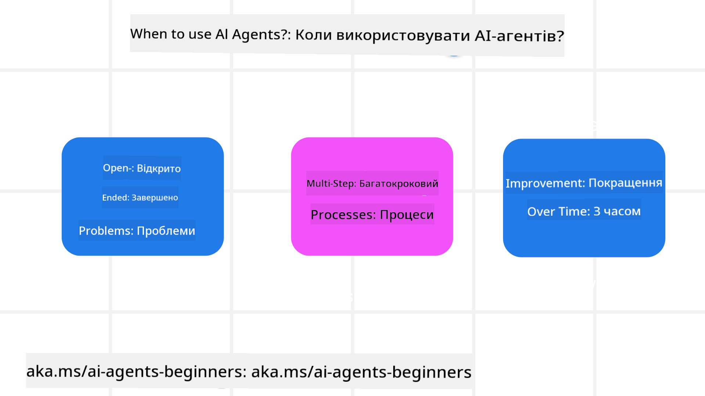

<!--
CO_OP_TRANSLATOR_METADATA:
{
  "original_hash": "1e40fe956ff79462a02a17080b125041",
  "translation_date": "2025-08-30T09:43:43+00:00",
  "source_file": "01-intro-to-ai-agents/README.md",
  "language_code": "uk"
}
-->

> _(Натисніть на зображення вище, щоб переглянути відео цього уроку)_

# Вступ до AI Агентів та їх застосування

Ласкаво просимо до курсу "AI Агенти для початківців"! Цей курс надає базові знання та приклади застосування для створення AI Агентів.

Приєднуйтесь до інших учасників та розробників AI Агентів, щоб ставити запитання щодо цього курсу.

Щоб розпочати курс, ми спершу розглянемо, що таке AI Агенти і як їх можна використовувати в додатках та робочих процесах, які ми створюємо.

## Вступ

Цей урок охоплює:

- Що таке AI Агенти і які існують їх типи?
- Які випадки використання найкраще підходять для AI Агентів і як вони можуть нам допомогти?
- Які основні елементи потрібно враховувати при розробці агентних рішень?

## Цілі навчання
Після завершення цього уроку ви зможете:

- Зрозуміти концепції AI Агентів і чим вони відрізняються від інших AI рішень.
- Ефективно застосовувати AI Агентів.
- Продуктивно проєктувати агентні рішення для користувачів і клієнтів.

## Визначення AI Агентів і їх типи

### Що таке AI Агенти?

AI Агенти — це **системи**, які дозволяють **великим мовним моделям (LLMs)** **виконувати дії**, розширюючи їх можливості за допомогою доступу до **інструментів** і **знань**.

Розглянемо це визначення детальніше:

- **Система** — Важливо розглядати агентів не як окремий компонент, а як систему з багатьох компонентів. На базовому рівні компоненти AI Агента включають:
  - **Середовище** — Визначений простір, у якому працює AI Агент. Наприклад, якщо у нас є агент для бронювання подорожей, середовищем може бути система бронювання, яку агент використовує для виконання завдань.
  - **Сенсори** — Середовище надає інформацію та зворотний зв'язок. AI Агенти використовують сенсори для збору та інтерпретації цієї інформації про поточний стан середовища. У прикладі з агентом для бронювання подорожей система може надавати інформацію, таку як доступність готелів або ціни на авіаквитки.
  - **Актуатори** — Після отримання інформації про поточний стан середовища агент визначає, яку дію виконати, щоб змінити середовище. Наприклад, агент може забронювати доступний номер для користувача.

**Великі мовні моделі** — Концепція агентів існувала ще до створення LLMs. Перевага використання LLMs у AI Агентах полягає в їх здатності інтерпретувати людську мову та дані. Це дозволяє LLMs інтерпретувати інформацію з середовища та визначати план дій для його зміни.

**Виконання дій** — Позаяк LLMs обмежені створенням контенту або інформації на основі запиту користувача, у системах AI Агентів вони можуть виконувати завдання, інтерпретуючи запит користувача та використовуючи доступні інструменти.

**Доступ до інструментів** — Інструменти, до яких має доступ LLM, визначаються 1) середовищем, у якому він працює, і 2) розробником AI Агента. У прикладі з агентом для подорожей інструменти агента обмежені операціями, доступними в системі бронювання, або розробник може обмежити доступ агента до певних функцій, наприклад, лише до авіарейсів.

**Пам'ять+Знання** — Пам'ять може бути короткостроковою в контексті розмови між користувачем і агентом. У довгостроковій перспективі, окрім інформації, наданої середовищем, AI Агенти можуть отримувати знання з інших систем, сервісів, інструментів і навіть інших агентів. У прикладі з агентом для подорожей це можуть бути дані про вподобання користувача, збережені в базі даних клієнтів.

### Різні типи агентів

Тепер, коли ми маємо загальне визначення AI Агентів, розглянемо конкретні типи агентів і як вони можуть бути застосовані до агента для бронювання подорожей.

| **Тип агента**                | **Опис**                                                                                                                       | **Приклад**                                                                                                                                                                                                                   |
| ----------------------------- | -------------------------------------------------------------------------------------------------------------------------------- | ----------------------------------------------------------------------------------------------------------------------------------------------------------------------------------------------------------------------------- |
| **Прості рефлекторні агенти** | Виконують негайні дії на основі заздалегідь визначених правил.                                                                   | Агент для подорожей інтерпретує контекст електронного листа і перенаправляє скарги на подорожі до служби підтримки клієнтів.                                                                                                   |
| **Модельно-орієнтовані агенти** | Виконують дії на основі моделі світу та змін у цій моделі.                                                                       | Агент для подорожей пріоритизує маршрути зі значними змінами цін, використовуючи доступ до історичних даних про ціни.                                                                                                          |
| **Ціль-орієнтовані агенти**   | Створюють плани для досягнення конкретних цілей, інтерпретуючи мету та визначаючи дії для її досягнення.                         | Агент для подорожей бронює подорож, визначаючи необхідні транспортні засоби (автомобіль, громадський транспорт, авіарейси) від поточного місця до пункту призначення.                                                          |
| **Агенти на основі корисності** | Враховують вподобання та зважують компроміси чисельно, щоб визначити, як досягти цілей.                                          | Агент для подорожей максимізує корисність, зважуючи зручність проти вартості при бронюванні подорожі.                                                                                                                          |
| **Навчальні агенти**          | Покращуються з часом, реагуючи на зворотний зв'язок і відповідно коригуючи дії.                                                  | Агент для подорожей покращується, використовуючи відгуки клієнтів з опитувань після подорожі для внесення змін у майбутні бронювання.                                                                                           |
| **Ієрархічні агенти**         | Містять кілька агентів у багаторівневій системі, де агенти вищого рівня розбивають завдання на підзавдання для виконання агентами нижчого рівня. | Агент для подорожей скасовує подорож, розділяючи завдання на підзавдання (наприклад, скасування конкретних бронювань) і доручаючи їх виконання агентам нижчого рівня, які звітують агенту вищого рівня.                          |
| **Системи з багатьма агентами (MAS)** | Агенти виконують завдання незалежно, співпрацюючи або конкуруючи.                                                             | Співпраця: Кілька агентів бронюють конкретні послуги, такі як готелі, авіарейси та розваги. Конкуренція: Кілька агентів керують спільним календарем бронювання готелів, змагаючись за бронювання клієнтів у готелі.               |

## Коли використовувати AI Агентів

У попередньому розділі ми використовували приклад агента для подорожей, щоб пояснити, як різні типи агентів можуть бути застосовані в різних сценаріях бронювання подорожей. Ми продовжимо використовувати цей приклад протягом курсу.

Розглянемо типи випадків використання, для яких AI Агенти підходять найкраще:

- **Відкриті завдання** — дозволяють LLM визначати необхідні кроки для виконання завдання, оскільки їх не завжди можна жорстко закодувати у робочий процес.
- **Багатокрокові процеси** — завдання, які потребують певного рівня складності, коли AI Агенту потрібно використовувати інструменти або інформацію протягом кількох кроків, а не за один раз.  
- **Покращення з часом** — завдання, у яких агент може покращуватися з часом, отримуючи зворотний зв'язок від середовища або користувачів, щоб забезпечити кращу корисність.

Ми розглянемо більше аспектів використання AI Агентів у уроці "Створення надійних AI Агентів".

## Основи агентних рішень

### Розробка агентів

Перший крок у проєктуванні системи AI Агента — це визначення інструментів, дій і поведінки. У цьому курсі ми зосередимося на використанні **Azure AI Agent Service** для визначення наших агентів. Цей сервіс пропонує такі функції, як:

- Вибір відкритих моделей, таких як OpenAI, Mistral і Llama
- Використання ліцензованих даних через провайдерів, таких як Tripadvisor
- Використання стандартизованих інструментів OpenAPI 3.0

### Агентні патерни

Спілкування з LLMs здійснюється через підказки. З огляду на напівавтономний характер AI Агентів, не завжди можливо або необхідно вручну змінювати підказку після змін у середовищі. Ми використовуємо **агентні патерни**, які дозволяють нам створювати підказки для LLM на кількох етапах більш масштабованим способом.

Цей курс поділений на кілька популярних агентних патернів.

### Агентні фреймворки

Агентні фреймворки дозволяють розробникам реалізовувати агентні патерни через код. Ці фреймворки пропонують шаблони, плагіни та інструменти для кращої співпраці AI Агентів. Вони забезпечують можливості для кращої спостережуваності та усунення несправностей у системах AI Агентів.

У цьому курсі ми дослідимо науково-орієнтований фреймворк AutoGen і готовий до виробництва фреймворк Agent від Semantic Kernel.

### Маєте більше запитань про AI Агентів?

Приєднуйтесь до [Azure AI Foundry Discord](https://aka.ms/ai-agents/discord), щоб зустрітися з іншими учасниками, відвідати години консультацій і отримати відповіді на ваші запитання про AI Агентів.

## Попередній урок

[Налаштування курсу](../00-course-setup/README.md)

## Наступний урок

[Дослідження агентних фреймворків](../02-explore-agentic-frameworks/README.md)

---

**Відмова від відповідальності**:  
Цей документ був перекладений за допомогою сервісу автоматичного перекладу [Co-op Translator](https://github.com/Azure/co-op-translator). Хоча ми прагнемо до точності, будь ласка, майте на увазі, що автоматичні переклади можуть містити помилки або неточності. Оригінальний документ на його рідній мові слід вважати авторитетним джерелом. Для критичної інформації рекомендується професійний людський переклад. Ми не несемо відповідальності за будь-які непорозуміння або неправильні тлумачення, що виникають внаслідок використання цього перекладу.