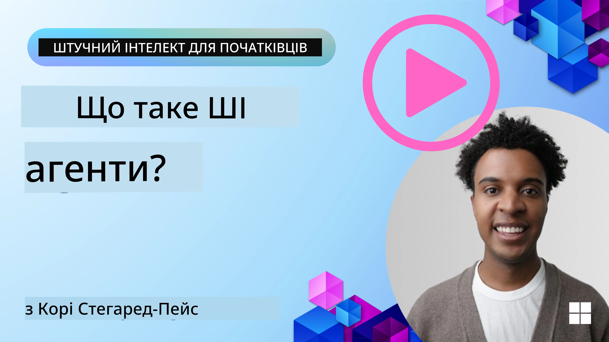
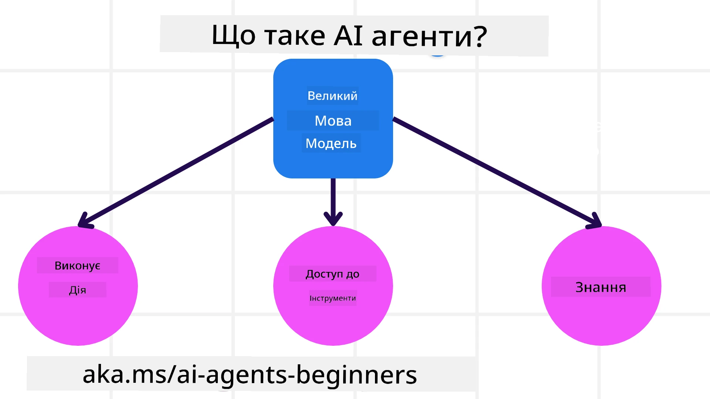
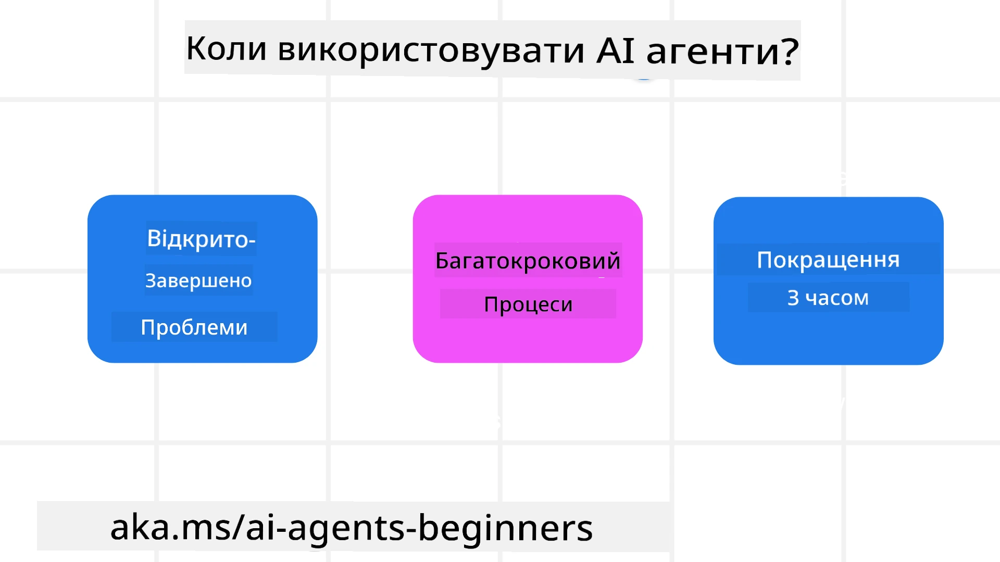

> _(Натисніть на зображення вище, щоб переглянути відео цього уроку)_

# Вступ до AI агентів та випадки їх використання

Ласкаво просимо до курсу "AI агенти для початківців"! Цей курс надає базові знання та приклади застосування для створення AI агентів.

Приєднуйтесь до <a href="https://discord.gg/kzRShWzttr" target="_blank">спільноти Azure AI Discord</a>, щоб зустріти інших учнів та творців AI агентів і поставити будь-які запитання щодо цього курсу.

Щоб розпочати цей курс, спочатку ми краще зрозуміємо, що таке AI агенти і як ми можемо їх використовувати в додатках і робочих процесах, які ми створюємо.

## Вступ

Цей урок охоплює:

- Що таке AI агенти і які існують типи агентів?
- Для яких випадків використання AI агентів вони найкраще підходять і як вони можуть нам допомогти?
- Які основні складові необхідно враховувати при проєктуванні агентних рішень?

## Цілі навчання
Після завершення цього уроку ви зможете:

- Розуміти концепції AI агентів і чим вони відрізняються від інших AI рішень.
- Найефективніше застосовувати AI агентів.
- Продуктивно проєктувати агентні рішення як для користувачів, так і для клієнтів.

## Визначення AI агентів і типи AI агентів

### Що таке AI агенти?

AI агенти — це **системи**, які дозволяють **великим мовним моделям (LLMs)** **виконувати дії**, розширюючи їхні можливості через надання LLM доступу до **інструментів** і **знань**.

Розглянемо це визначення по частинах:

- **Система** - важливо розглядати агентів не як окремий компонент, а як систему багатьох компонентів. На базовому рівні компоненти AI агента це:
  - **Середовище** — визначений простір, у якому працює AI агент. Наприклад, якщо мати AI агента для бронювання подорожей, середовищем може бути система бронювання подорожей, яку агент використовує для виконання завдань.
  - **Датчики** — середовища містять інформацію і надають зворотній зв’язок. AI агенти використовують датчики, щоб збирати та інтерпретувати інформацію про поточний стан середовища. У прикладі агента з бронювання подорожей система бронювання може надавати інформацію про наявність готелів чи ціни на авіаквитки.
  - **Актуатори** — після отримання AI агентом поточного стану середовища, для виконання завдання агент визначає, яку дію треба зробити, щоб змінити середовище. Для агента з бронювання подорожей це може бути бронювання доступного номера для користувача.

**Великі мовні моделі** — концепція агентів існувала ще до появи LLM. Перевага AI агентів, створених з LLM, полягає в їх здатності інтерпретувати людську мову і дані. Ця здатність дозволяє LLM інтерпретувати інформацію з середовища та створювати план зміни цього середовища.

**Виконувати дії** — поза AI агентами, LLM обмежені ситуаціями, де дією є створення контенту або інформації на основі запиту користувача. Всередині AI агентних систем LLM можуть виконувати завдання, інтерпретуючи запит користувача і використовуючи інструменти, доступні в їх середовищі.

**Доступ до інструментів** — доступні LLM інструменти визначаються 1) середовищем, у якому він працює, та 2) розробником AI агента. У прикладі агента подорожей інструменти агента обмежені операціями, доступними в системі бронювання, або розробник може обмежити доступ агента лише до авіаквитків.

**Пам’ять+Знання** — пам’ять може бути короткостроковою в контексті розмови між користувачем і агентом. Довгостроково, окрім інформації зі середовища, AI агенти можуть також отримувати знання з інших систем, сервісів, інструментів і навіть інших агентів. У прикладі з агентом подорожей ці знання можуть бути інформацією про переваги користувача, розміщеною в базі даних клієнтів.

### Різні типи агентів

Тепер, коли ми маємо загальне визначення AI агентів, розглянемо деякі конкретні типи агентів і як їх можна застосувати для агента бронювання подорожей.

| **Тип агента**                | **Опис**                                                                                                                     | **Приклад**                                                                                                                                                                                                                       |
| ----------------------------- | ---------------------------------------------------------------------------------------------------------------------------- | --------------------------------------------------------------------------------------------------------------------------------------------------------------------------------------------------------------------------------- |
| **Агенти простих реакцій**    | Виконують негайні дії на основі заздалегідь визначених правил.                                                              | Агент подорожей інтерпретує контекст електронного листа і пересилає скарги про подорож до служби підтримки клієнтів.                                                                                                              |
| **Модельні агенти реакцій**   | Виконують дії на основі моделі світу та змін у цій моделі.                                                                   | Агент подорожей пріоритезує маршрути з суттєвими змінами цін, використовуючи доступ до історичних даних про ціни.                                                                                                                 |
| **Агенти на основі цілей**    | Створюють плани для досягнення конкретних цілей, інтерпретуючи ціль і визначаючи дії для її досягнення.                       | Агент подорожей бронює поїздку, визначаючи необхідні транспортні засоби (автомобіль, громадський транспорт, літаки) від поточного місця до пункту призначення.                                                                       |
| **Агенти на основі корисності** | Враховують переваги та оцінюють компроміси чисельно, щоб визначити, як досягти цілей.                                           | Агент подорожей максимізує корисність, зважуючи зручність проти витрат при бронюванні подорожі.                                                                                                                                     |
| **Агенти, що вчаться**        | Покращуються з часом, реагуючи на зворотний зв’язок і відповідно коригуючи дії.                                             | Агент подорожей покращується, використовуючи відгуки клієнтів з опитувань після поїздок, щоб удосконалити майбутні бронювання.                                                                                                     |
| **Ієрархічні агенти**         | Містять кілька агентів у багаторівневій системі, де агенти вищого рівня ділять завдання на підзавдання для агентів нижчого рівня. | Агент подорожей скасовує поїздку, розбиваючи завдання на підзавдання (наприклад, скасовування конкретних бронювань), які виконують агенти нижчого рівня, звітуючи вищому рівню.                                                        |
| **Системи з кількома агентами (MAS)** | Агенти виконують завдання незалежно, або у співпраці, або конкурентно.                                                       | Співпраця: кілька агентів бронюють конкретні послуги подорожі, такі як готелі, рейси, розваги. Конкуренція: кілька агентів керують і змагаються за спільний календар бронювання готелю для розміщення клієнтів.                       |

## Коли використовувати AI агентів

У попередньому розділі ми використовували приклад агента з бронювання подорожей, щоб пояснити, як різні типи агентів можуть застосовуватися у різних сценаріях бронювання подорожей. Ми продовжимо використовувати цей додаток протягом курсу.

Розглянемо випадки використання, де AI агенти найкраще ефективні:

- **Відкриті проблеми** — дозволяючи LLM визначати необхідні кроки для виконання завдання, оскільки це не завжди можна жорстко запрограмувати у робочий процес.
- **Багатокрокові процеси** — завдання, що вимагають рівня складності, при якому AI агент потребує використовувати інструменти або інформацію протягом кількох етапів, а не один раз одразу.
- **Покращення з часом** — завдання, в яких агент може покращуватись з часом, отримуючи зворотній зв’язок від середовища або користувачів, щоб надавати кращу корисність.

Ми розглядаємо більше аспектів використання AI агентів у уроці "Створення надійних AI агентів".

## Основи агентних рішень

### Розробка агента

Перший крок у проєктуванні системи AI агента — визначити інструменти, дії та поведінку. У цьому курсі ми зосереджені на використанні **Azure AI Agent Service** для визначення наших агентів. Він пропонує такі можливості:

- Вибір відкритих моделей, таких як OpenAI, Mistral і Llama
- Використання ліцензійних даних через провайдерів, наприклад Tripadvisor
- Використання стандартизованих інструментів OpenAPI 3.0

### Агентні патерни

Комунікація з LLM відбувається через підказки (prompts). Враховуючи напівавтономний характер AI агентів, не завжди можливо або потрібно вручну заново подавати підказки після зміни середовища. Ми використовуємо **агентні патерни**, які дозволяють подавати підказки LLM через кілька кроків більш масштабовано.

Цей курс поділено за деякими з популярних нині агентних патернів.

### Агентні фреймворки

Агентні фреймворки дозволяють розробникам реалізовувати агентні патерни через код. Ці фреймворки пропонують шаблони, плагіни та інструменти для кращої співпраці AI агентів. Ці переваги забезпечують кращу спостережуваність і налагодження систем AI агентів.

У цьому курсі ми дослідимо Microsoft Agent Framework (MAF) для створення AI агентів, готових до виробництва.

## Приклади коду

- Python: [Agent Framework](./code_samples/01-python-agent-framework.ipynb)
- .NET: [Agent Framework](./code_samples/01-dotnet-agent-framework.md)

## Більше запитань про AI агентів?

Приєднуйтесь до [Microsoft Foundry Discord](https://aka.ms/ai-agents/discord), щоб зустріти інших учнів, взяти участь в офісних годинах та отримати відповіді на свої запитання про AI агентів.

## Попередній урок

[Course Setup](../00-course-setup/README.md)

## Наступний урок

[Exploring Agentic Frameworks](../02-explore-agentic-frameworks/README.md)

---

<!-- CO-OP TRANSLATOR DISCLAIMER START -->
**Відмова від відповідальності**:
Цей документ був перекладений за допомогою сервісу автоматичного перекладу [Co-op Translator](https://github.com/Azure/co-op-translator). Хоча ми прагнемо до точності, будь ласка, майте на увазі, що автоматичні переклади можуть містити помилки або неточності. Оригінальний документ рідною мовою слід вважати авторитетним джерелом. Для важливої інформації рекомендується звертатися до професійного людського перекладу. Ми не несемо відповідальності за будь-які непорозуміння чи неправильне тлумачення, що виникли внаслідок використання цього перекладу.
<!-- CO-OP TRANSLATOR DISCLAIMER END -->