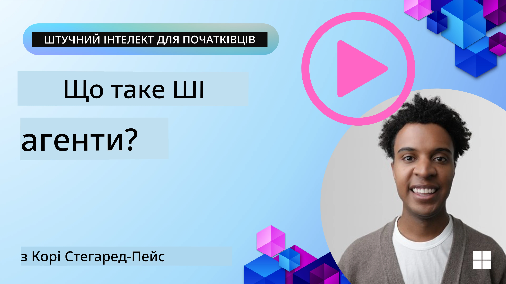
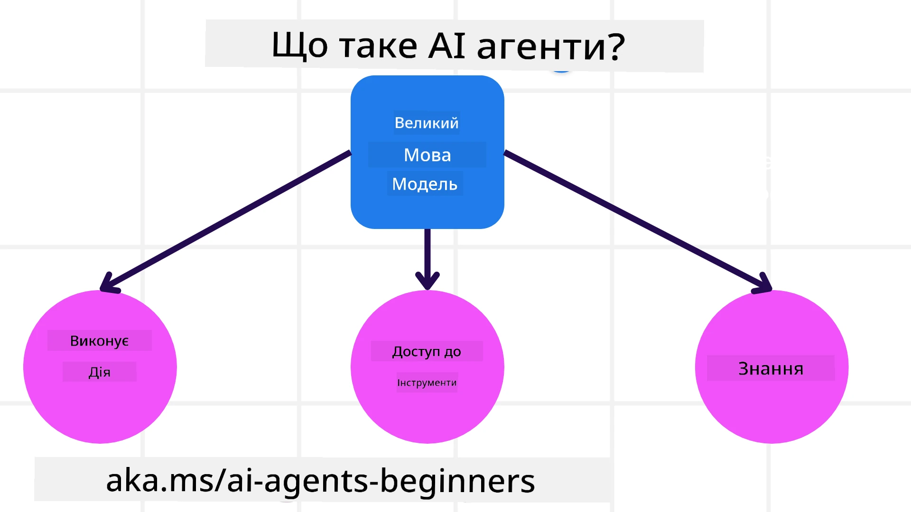
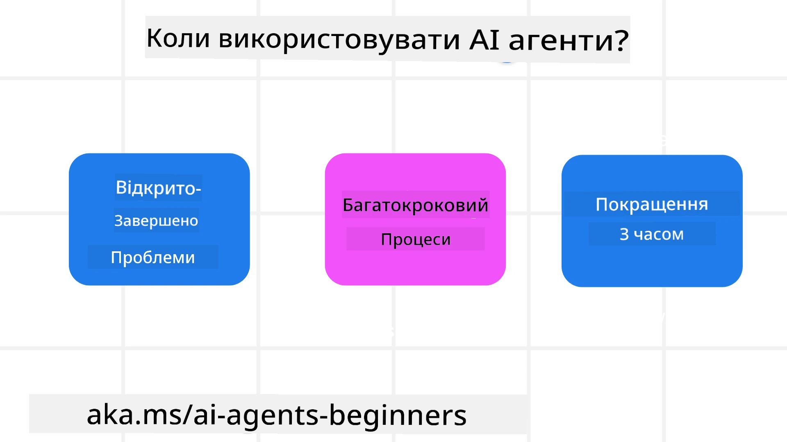

> _(Натисніть на зображення вище, щоб переглянути відео цього уроку)_

# Вступ до AI агентів та їх випадків використання

Ласкаво просимо на курс **AI Agents for Beginners**! Цей курс надає вам базові знання — і реальний робочий код — щоб почати створювати AI агенти з нуля.

Заходьте привітатися в <a href="https://discord.gg/kzRShWzttr" target="_blank">Azure AI Discord спільноту</a> — вона повна учнів і творців AI, які раді відповісти на ваші запитання.

Перед тим, як перейти до створення, впевнимося, що ми дійсно розуміємо, що таке AI агент і коли доцільно його використовувати.

---

## Вступ

У цьому уроці розглядаємо:

- Що таке AI агенти та які існують їх типи
- Для яких задач AI агенти найкраще підходять
- Основні будівельні блоки, які ви використаєте під час проектування агентського рішення

## Цілі навчання

До кінця цього уроку ви зможете:

- Пояснити, що таке AI агент і чим він відрізняється від звичайного AI рішення
- Знати, коли варто використовувати AI агента (і коли ні)
- Накреслити базовий дизайн агентного рішення для реальної проблеми

---

## Визначення AI агентів та типи AI агентів

### Що таке AI агенти?

Ось простий спосіб про це подумати:

> **AI агенти — це системи, які дозволяють великим мовним моделям (LLM) дійсно *робити* речі — даючи їм інструменти та знання для впливу на світ, а не просто відповідати на запити.**

Розберемо це детальніше:

- **Система** — AI агент — це не щось одне. Це збірка частин, які працюють разом. У своєму основі у кожного агента є три складові:
  - **Середовище** — простір, у якому агент працює. Для агента з бронювання подорожей це була б сама платформа бронювання.
  - **Датчики** — як агент зчитує поточний стан свого середовища. Наш туристичний агент може перевіряти наявність готелів або ціни на рейси.
  - **Виконавці** — як агент здійснює дії. Туристичний агент може забронювати кімнату, надіслати підтвердження або скасувати резервування.

- **Великі мовні моделі** — агенти існували до LLM, але саме LLM роблять сучасних агентів такими потужними. Вони розуміють природну мову, розмірковують про контекст та перетворюють нечіткий запит користувача на конкретний план дій.

- **Виконання дій** — без агентної системи LLM просто генерує текст. В агентній системі LLM може насправді *виконувати* кроки — шукати в базі даних, викликати API, надсилати повідомлення.

- **Доступ до інструментів** — які інструменти агент може використовувати, залежить від (1) середовища, у якому він працює, і (2) що розробник вирішив дати йому. Туристичний агент може шукати рейси, але не редагувати дані клієнтів — все залежить від вашого налаштування.

- **Пам'ять та Знання** — агенти можуть мати короткотермінову пам'ять (поточна розмова) та довготермінову пам'ять (база даних клієнтів, минулі взаємодії). Туристичний агент може "пам'ятати", що ви віддаєте перевагу місцям у вікні.

---

### Різні типи AI агентів

Не всі агенти будуються однаково. Ось основні типи з прикладом туристичного агента:

| **Тип Агента** | **Що робить** | **Приклад туристичного агента** |
|---|---|---|
| **Прості рефлексні агенти** | Діють за жорстко закодованими правилами — без пам'яті, без планування. | Бачить скаргу в електронній пошті → пересилає в службу підтримки. Все. |
| **Рефлексні агенти на основі моделі** | Мають внутрішню модель світу і оновлюють її, коли ситуація змінюється. | Відстежує історію цін на рейси та позначає маршрути, які раптово подорожчали. |
| **Агенти на основі цілей** | Мають мету і по кроках визначають, як її досягти. | Бронює повну поїздку (рейси, авто, готель) починаючи з вашого поточного місця розташування до кінцевої точки. |
| **Агенти на основі корисності** | Знаходять не просто *будь-яке* рішення, а *найкраще*, зважуючи компроміси. | Балансує вартість і зручність, щоб знайти поїздку, що найкраще відповідає вашим перевагам. |
| **Навчаючі агенти** | Поліпшуються з часом, навчаючись на відгуках. | Коригує майбутні рекомендації для бронювання на основі результатів опитування після поїздки. |
| **Ієрархічні агенти** | Вищий агент розбиває роботу на підзадачі і делегує нижчим агентам. | Запит на «скасувати поїздку» розбивається на: скасувати рейс, скасувати готель, скасувати оренду авто — кожен виконується під-агентом. |
| **Системи з кількома агентами (MAS)** | Кілька незалежних агентів працюють разом (або конкурують). | Співпраця: окремі агенти займаються готелями, рейсами та розвагами. Конкуренція: кілька агентів змагаються, щоб запропонувати готельні номери за найкращою ціною. |

---

## Коли використовувати AI агентів

Те, що ви *можете* використовувати AI агента, не означає, що ви завжди *повинні*. Ось ситуації, коли агенти дійсно ефективні:

- **Відкриті проблеми** — коли кроки для розв’язання проблеми не можна заздалегідь запрограмувати. Потрібно, щоб LLM динамічно знаходив шлях.
- **Багатокрокові процеси** — завдання, що вимагають використання інструментів протягом кількох ходів, а не одного запиту чи генерації.
- **Покращення з часом** — коли ви хочете, щоб система ставала розумнішою на основі відгуків користувачів або сигналів середовища.

Ми докладніше розглянемо, коли (і коли *не варто*) використовувати AI агентів у уроці **Побудова надійних AI агентів** пізніше у курсі.

---

## Основи агентських рішень

### Розробка агента

Перше, що ви робите при створенні агента — визначаєте *що він може робити* — його інструменти, дії та поведінки.

У цьому курсі ми використовуємо **Microsoft Foundry Agent Service** як нашу основну платформу. Вона підтримує:

- Моделі від провайдерів, таких як OpenAI, Mistral і Meta (Llama)
- Ліцензійні дані від провайдерів, таких як Tripadvisor
- Стандартизовані визначення інструментів OpenAPI 3.0

### Агентські патерни

Ви спілкуєтеся з LLM через підказки. З агентами ви не завжди можете вручну складати кожну підказку — агент має виконувати дії у кілька кроків. Ось тут і допомагають **агентські патерни**. Це повторювані стратегії для підказування та оркестрування LLM у більш масштабованому та надійному режимі.

Цей курс побудований на основі найпоширеніших і корисних агентських патернів.

### Агентські фреймворки

Агентські фреймворки надають розробникам готові шаблони, інструменти та інфраструктуру для створення агентів. Вони спрощують:

- Підключення інструментів і можливостей
- Спостереження за тим, що робить агент (та налагодження помилок, коли щось іде не так)
- Співпрацю між кількома агентами

У цьому курсі ми зосереджуємося на **Microsoft Agent Framework (MAF)** для створення агентів, готових до виробництва.

---

## Приклади коду

Готові побачити це в дії? Ось приклади коду для цього уроку:

- 🐍 Python: [Agent Framework](./code_samples/01-python-agent-framework.ipynb)
- 🔷 .NET: [Agent Framework](./code_samples/01-dotnet-agent-framework.md)

---

## Маєте питання?

Приєднуйтесь до [Microsoft Foundry Discord](https://discord.com/invite/ATgtXmAS5D), щоб спілкуватися з іншими учнями, відвідувати години консультацій та отримати відповіді на ваші питання про AI агентів від спільноти.

---

## Попередній урок

[Course Setup](../00-course-setup/README.md)

## Наступний урок

[Exploring Agentic Frameworks](../02-explore-agentic-frameworks/README.md)

---

<!-- CO-OP TRANSLATOR DISCLAIMER START -->
**Відмова від відповідальності**:
Цей документ було перекладено за допомогою сервісу штучного інтелекту для перекладу [Co-op Translator](https://github.com/Azure/co-op-translator). Хоча ми прагнемо до точності, будь ласка, майте на увазі, що автоматичні переклади можуть містити помилки або неточності. Оригінальний документ рідною мовою слід вважати авторитетним джерелом. Для критично важливої інформації рекомендується професійний людський переклад. Ми не несемо відповідальності за будь-які непорозуміння або неправильні тлумачення, що виникли внаслідок використання цього перекладу.
<!-- CO-OP TRANSLATOR DISCLAIMER END -->