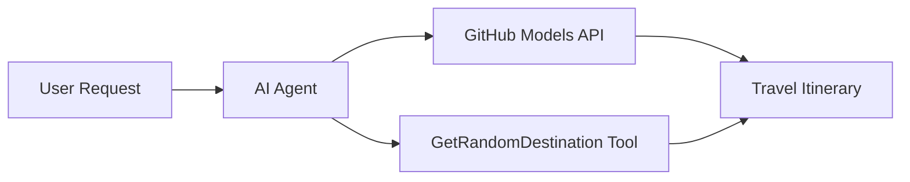

<!--
CO_OP_TRANSLATOR_METADATA:
{
  "original_hash": "23afd9be7b6ba5b69a44c3b6a78e07f6",
  "translation_date": "2025-11-06T10:07:26+00:00",
  "source_file": "01-intro-to-ai-agents/code_samples/01-dotnet-agent-framework.md",
  "language_code": "uk"
}
-->
# 🌍 AI Туристичний Агент з Microsoft Agent Framework (.NET)

## 📋 Огляд сценарію

Цей блокнот демонструє, як створити інтелектуального агента для планування подорожей, використовуючи Microsoft Agent Framework для .NET. Агента можна налаштувати для автоматичного створення персоналізованих маршрутів одноденних подорожей до випадкових місць по всьому світу.

**Основні можливості:**
- 🎲 **Випадковий вибір місця призначення**: Використовує спеціальний інструмент для вибору місць відпочинку
- 🗺️ **Інтелектуальне планування подорожей**: Створює детальні маршрути на кожен день
- 🔄 **Потокова передача в реальному часі**: Підтримує як миттєві, так і потокові відповіді
- 🛠️ **Інтеграція спеціальних інструментів**: Демонструє, як розширити можливості агента

## 🔧 Технічна архітектура

### Основні технології
- **Microsoft Agent Framework**: Остання реалізація .NET для розробки AI-агентів
- **Інтеграція моделей GitHub**: Використовує сервіс інференції моделей GitHub
- **Сумісність з OpenAI API**: Використовує клієнтські бібліотеки OpenAI з налаштованими кінцевими точками
- **Безпечна конфігурація**: Управління ключами API на основі середовища

### Основні компоненти
1. **AIAgent**: Основний оркестратор агента, який керує потоком розмов
2. **Спеціальні інструменти**: Функція `GetRandomDestination()` доступна агенту
3. **Клієнт чату**: Інтерфейс розмов, підтримуваний моделями GitHub
4. **Підтримка потокової передачі**: Можливості генерації відповідей у реальному часі

### Схема інтеграції


## 🚀 Початок роботи

**Передумови:**
- .NET 10.0 або новіший
- Токен доступу до API моделей GitHub
- Змінні середовища, налаштовані у файлі `.env`

**Необхідні змінні середовища:**
```env
GITHUB_TOKEN=your_github_token
GITHUB_ENDPOINT=https://models.inference.ai.azure.com
GITHUB_MODEL_ID=gpt-4o-mini
```

Запустіть наведений нижче приклад коду послідовно, щоб побачити агента для подорожей у дії!

---

## .NET Однофайловий додаток: Приклад AI Туристичного Агента

Дивіться `01-dotnet-agent-framework.cs` для повного прикладу коду, готового до запуску.

```bash
dotnet run 01-dotnet-agent-framework.cs
```

### Приклад коду

```csharp
static string GetRandomDestination()
{
    var destinations = new List<string>
    {
        "Paris, France",
        "Tokyo, Japan",
        "New York City, USA",
        "Sydney, Australia",
        "Rome, Italy",
        "Barcelona, Spain",
        "Cape Town, South Africa",
        "Rio de Janeiro, Brazil",
        "Bangkok, Thailand",
        "Vancouver, Canada"
    };
    var random = new Random();
    int index = random.Next(destinations.Count);
    return destinations[index];
}

// Extract configuration from environment variables
var github_endpoint = Environment.GetEnvironmentVariable("GITHUB_ENDPOINT") ?? throw new InvalidOperationException("GITHUB_ENDPOINT is not set.");
var github_model_id = Environment.GetEnvironmentVariable("GITHUB_MODEL_ID") ?? "gpt-4o-mini";
var github_token = Environment.GetEnvironmentVariable("GITHUB_TOKEN") ?? throw new InvalidOperationException("GITHUB_TOKEN is not set.");

// Configure OpenAI Client Options
var openAIOptions = new OpenAIClientOptions()
{
    Endpoint = new Uri(github_endpoint)
};

// Initialize OpenAI Client with GitHub Models Configuration
var openAIClient = new OpenAIClient(new ApiKeyCredential(github_token), openAIOptions);

// Create AI Agent with Travel Planning Capabilities
AIAgent agent = openAIClient
    .GetChatClient(github_model_id)
    .CreateAIAgent(
        instructions: "You are a helpful AI Agent that can help plan vacations for customers at random destinations",
        tools: [AIFunctionFactory.Create(GetRandomDestination)]
    );

// Execute Agent: Plan a Day Trip (Non-Streaming)
Console.WriteLine(await agent.RunAsync("Plan me a day trip"));

// Execute Agent: Plan a Day Trip (Streaming Response)
await foreach (var update in agent.RunStreamingAsync("Plan me a day trip"))
{
    Console.Write(update);
}
```

---

**Відмова від відповідальності**:  
Цей документ був перекладений за допомогою сервісу автоматичного перекладу [Co-op Translator](https://github.com/Azure/co-op-translator). Хоча ми прагнемо до точності, будь ласка, майте на увазі, що автоматичні переклади можуть містити помилки або неточності. Оригінальний документ на його рідній мові слід вважати авторитетним джерелом. Для критичної інформації рекомендується професійний людський переклад. Ми не несемо відповідальності за будь-які непорозуміння або неправильні тлумачення, що виникають внаслідок використання цього перекладу.