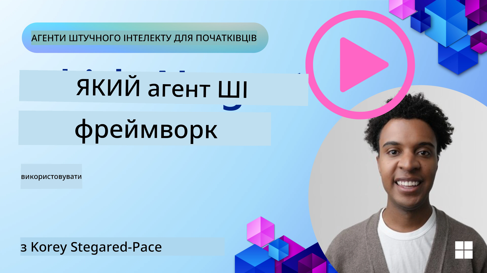

[](https://youtu.be/ODwF-EZo_O8?si=1xoy_B9RNQfrYdF7)

> _(Натисніть на зображення вище, щоб переглянути відео цього уроку)_

# Вивчення фреймворків агентів ШІ

Фреймворки агентів ШІ — це програмні платформи, розроблені для спрощення створення, розгортання та керування агентами ШІ. Ці фреймворки надають розробникам готові компоненти, абстракції та інструменти, які полегшують розробку складних систем ШІ.

Вони допомагають розробникам зосередитися на унікальних аспектах своїх додатків, надаючи стандартизовані підходи до типових проблем у розробці агентів ШІ. Вони підвищують масштабованість, доступність і ефективність створення систем ШІ.

## Вступ

У цьому уроці ми розглянемо:

- Що таке фреймворки агентів ШІ і що вони дають змогу розробникам досягати?
- Як команди можуть використовувати їх для швидкого прототипування, ітерацій та покращення можливостей агентів?
- Які відмінності між фреймворками та інструментами, створеними Microsoft (<a href="https://aka.ms/ai-agents-beginners/ai-agent-service" target="_blank">Azure AI Agent Service</a> та <a href="https://learn.microsoft.com/azure/ai-services/openai/how-to/responses" target="_blank">Microsoft Agent Framework</a>)?
- Чи можна інтегрувати мої існуючі інструменти екосистеми Azure безпосередньо, чи потрібні окремі рішення?
- Що таке служба Azure AI Agents і як вона мені допомагає?

## Мети навчання

Метою цього уроку є допомогти вам зрозуміти:

- Роль фреймворків агентів ШІ у розробці ШІ.
- Як використовувати фреймворки агентів ШІ для створення інтелектуальних агентів.
- Ключові можливості, які забезпечують фреймворки агентів ШІ.
- Відмінності між Microsoft Agent Framework і Azure AI Agent Service.

## Що таке фреймворки агентів ШІ і що вони дозволяють розробникам робити?

Традиційні фреймворки ШІ можуть допомогти інтегрувати ШІ у ваші додатки та покращити ці додатки у таких напрямках:

- **Персоналізація**: ШІ може аналізувати поведінку користувача та вподобання, щоб надавати персоналізовані рекомендації, контент і досвід.
Приклад: Стрімінгові сервіси, як Netflix, використовують ШІ для пропонування фільмів і шоу на основі історії переглядів, підвищуючи залучення та задоволення користувачів.
- **Автоматизація та ефективність**: ШІ може автоматизувати рутинні завдання, оптимізувати робочі процеси та підвищувати операційну ефективність.
Приклад: Додатки обслуговування клієнтів використовують чатботів на базі ШІ для обробки поширених запитів, скорочуючи час відповіді та звільняючи людських агентів для складніших питань.
- **Покращений користувацький досвід**: ШІ може покращити загальний досвід користувача, надаючи інтелектуальні функції, такі як розпізнавання голосу, обробка природної мови та передбачуваний текст.
Приклад: Віртуальні асистенти, такі як Siri та Google Assistant, використовують ШІ для розуміння і реагування на голосові команди, полегшуючи взаємодію з пристроями.

### Виглядає чудово, тож навіщо потрібен фреймворк агентів ШІ?

Фреймворки агентів ШІ — це не просто фреймворки ШІ. Вони створені для розробки інтелектуальних агентів, які можуть взаємодіяти з користувачами, іншими агентами та середовищем для досягнення конкретних цілей. Ці агенти можуть проявляти автономну поведінку, приймати рішення та адаптуватися до змінних умов. Ось ключові можливості, які надають фреймворки агентів ШІ:

- **Співпраця та координація агентів**: Дозволяють створювати кілька агентів ШІ, які можуть працювати спільно, спілкуватися та координуватися для розв’язання складних задач.
- **Автоматизація та управління завданнями**: Забезпечують механізми автоматизації багатокрокових робочих процесів, делегування завдань і динамічного управління завданнями серед агентів.
- **Контекстне розуміння та адаптація**: Оснащують агентів можливістю розуміти контекст, адаптуватися до змін у середовищі та приймати рішення на основі інформації в режимі реального часу.

Отже, підсумовуючи, агенти дозволяють робити більше, підняти автоматизацію на вищий рівень, створювати більш інтелектуальні системи, які можуть адаптуватися і навчатися зі свого середовища.

## Як швидко прототипувати, ітеративно вдосконалювати і покращувати можливості агента?

Це швидко розвивається сфера, але є спільні риси у більшості фреймворків агентів ШІ, які допомагають швидко створювати прототипи і робити ітерації, а саме: модульні компоненти, спільні інструменти та навчання в реальному часі. Розглянемо їх докладніше:

- **Використовуйте модульні компоненти**: SDK ШІ пропонують готові компоненти, такі як AI і Memory конектори, виклик функцій через природну мову або плагіни коду, шаблони запитів та інше.
- **Використовуйте спільні інструменти**: Проєктуйте агентів із визначеними ролями та завданнями, що дає змогу тестувати і вдосконалювати робочі процеси співпраці.
- **Навчання в реальному часі**: Реалізуйте цикли зворотного зв’язку, де агенти вчаться на взаємодіях і динамічно коригують свою поведінку.

### Використовуйте модульні компоненти

SDK, такі як Microsoft Agent Framework, пропонують готові компоненти, наприклад AI конектори, визначення інструментів і управління агентами.

**Як команди можуть їх використовувати**: Команди можуть швидко об’єднувати ці компоненти для створення функціонального прототипу без початку з нуля, що дає змогу швидко експериментувати та ітерувати.

**Як це працює на практиці**: Ви можете використовувати готовий парсер для вилучення інформації з введення користувача, модуль пам’яті для збереження і отримання даних, і генератор запитів для взаємодії з користувачами — все це без необхідності створювати ці компоненти з нуля.

**Приклад коду.** Розгляньмо приклад використання Microsoft Agent Framework із `AzureAIProjectAgentProvider`, щоб модель відповідала на введення користувача з викликом інструментів:

``` python
# Приклад Microsoft Agent Framework на Python

import asyncio
import os
from typing import Annotated

from agent_framework.azure import AzureAIProjectAgentProvider
from azure.identity import AzureCliCredential


# Визначте зразкову функцію інструмента для бронювання подорожей
def book_flight(date: str, location: str) -> str:
    """Book travel given location and date."""
    return f"Travel was booked to {location} on {date}"


async def main():
    provider = AzureAIProjectAgentProvider(credential=AzureCliCredential())
    agent = await provider.create_agent(
        name="travel_agent",
        instructions="Help the user book travel. Use the book_flight tool when ready.",
        tools=[book_flight],
    )

    response = await agent.run("I'd like to go to New York on January 1, 2025")
    print(response)
    # Приклад виводу: Ваш рейс до Нью-Йорка на 1 січня 2025 року успішно заброньовано. Щасливої подорожі! ✈️🗽


if __name__ == "__main__":
    asyncio.run(main())
```

У цьому прикладі видно, як можна використовувати готовий парсер для вилучення ключової інформації з введення користувача, такої як пункт відправлення, пункт призначення та дата запиту бронювання рейсу. Такий модульний підхід дозволяє зосередитись на логіці високого рівня.

### Використовуйте спільні інструменти

Фреймворки, такі як Microsoft Agent Framework, полегшують створення кількох агентів, які можуть працювати разом.

**Як команди можуть їх використовувати**: Команди можуть проєктувати агентів із конкретними ролями і завданнями, що дозволяє тестувати і вдосконалювати робочі процеси співпраці і підвищувати загальну ефективність системи.

**Як це працює на практиці**: Ви можете створити команду агентів, де кожен агент має спеціалізовану функцію, наприклад, отримання даних, аналіз або прийняття рішень. Ці агенти можуть спілкуватися між собою та ділитися інформацією для досягнення спільної мети, наприклад, відповіді на запит користувача або виконання завдання.

**Приклад коду (Microsoft Agent Framework)**:

```python
# Створення кількох агентів, що працюють разом, використовуючи Microsoft Agent Framework

import os
from agent_framework.azure import AzureAIProjectAgentProvider
from azure.identity import AzureCliCredential

provider = AzureAIProjectAgentProvider(credential=AzureCliCredential())

# Агент отримання даних
agent_retrieve = await provider.create_agent(
    name="dataretrieval",
    instructions="Retrieve relevant data using available tools.",
    tools=[retrieve_tool],
)

# Агент аналізу даних
agent_analyze = await provider.create_agent(
    name="dataanalysis",
    instructions="Analyze the retrieved data and provide insights.",
    tools=[analyze_tool],
)

# Запуск агентів послідовно для виконання завдання
retrieval_result = await agent_retrieve.run("Retrieve sales data for Q4")
analysis_result = await agent_analyze.run(f"Analyze this data: {retrieval_result}")
print(analysis_result)
```

В наведеному коді показано, як створити завдання, яке потребує спільної роботи кількох агентів для аналізу даних. Кожен агент виконує конкретну функцію, а завдання виконується за координуванням агентів для досягнення потрібного результату. Створюючи спеціалізованих агентів із визначеними ролями, ви можете підвищити ефективність та продуктивність завдань.

### Навчання в реальному часі

Розвинуті фреймворки надають можливості розуміння контексту в реальному часі та адаптації.

**Як команди можуть їх використовувати**: Команди можуть впроваджувати цикли зворотного зв’язку, де агенти навчаються на взаємодіях і динамічно коригують поведінку, що веде до постійного покращення та вдосконалення функціональності.

**Як це працює на практиці**: Агенти можуть аналізувати відгуки користувачів, дані середовища та результати завдань для оновлення бази знань, коригування алгоритмів прийняття рішень та підвищення продуктивності з часом. Цей ітеративний процес навчання дозволяє агентам адаптуватися до змінних умов та вподобань користувачів, підвищуючи загальну ефективність системи.

## Які відмінності між Microsoft Agent Framework і Azure AI Agent Service?

Існує багато способів порівняти ці підходи, але розглянемо ключові відмінності з точки зору їхнього дизайну, можливостей і цільових сценаріїв використання:

## Microsoft Agent Framework (MAF)

Microsoft Agent Framework надає спрощений SDK для побудови агентів ШІ за допомогою `AzureAIProjectAgentProvider`. Він дає змогу розробникам створювати агентів, які використовують моделі Azure OpenAI з вбудованим викликом інструментів, керуванням розмовами та корпоративною безпекою через Azure identity.

**Сценарії застосування**: Створення готових до виробництва агентів ШІ з використанням інструментів, багатокрокових робочих процесів і сценаріїв інтеграції в корпоративне середовище.

Ось декілька важливих основних понять Microsoft Agent Framework:

- **Агенти**. Агент створюється через `AzureAIProjectAgentProvider` і налаштовується з ім’ям, інструкціями та інструментами. Агент може:
  - **Обробляти повідомлення користувача** та генерувати відповіді за допомогою моделей Azure OpenAI.
  - **Автоматично викликати інструменти** залежно від контексту розмови.
  - **Підтримувати стан розмови** через багато взаємодій.

  Ось фрагмент коду, що показує, як створити агента:

    ```python
    import os
    from agent_framework.azure import AzureAIProjectAgentProvider
    from azure.identity import AzureCliCredential

    provider = AzureAIProjectAgentProvider(credential=AzureCliCredential())
    agent = await provider.create_agent(
        name="my_agent",
        instructions="You are a helpful assistant.",
    )

    response = await agent.run("Hello, World!")
    print(response)
    ```

- **Інструменти**. Фреймворк підтримує визначення інструментів як функцій Python, які агент може викликати автоматично. Інструменти реєструються під час створення агента:

    ```python
    def get_weather(location: str) -> str:
        """Get the current weather for a location."""
        return f"The weather in {location} is sunny, 72\u00b0F."

    agent = await provider.create_agent(
        name="weather_agent",
        instructions="Help users check the weather.",
        tools=[get_weather],
    )
    ```

- **Координація декількох агентів**. Можна створити кілька агентів із різною спеціалізацією та координувати їхню роботу:

    ```python
    planner = await provider.create_agent(
        name="planner",
        instructions="Break down complex tasks into steps.",
    )

    executor = await provider.create_agent(
        name="executor",
        instructions="Execute the planned steps using available tools.",
        tools=[execute_tool],
    )

    plan = await planner.run("Plan a trip to Paris")
    result = await executor.run(f"Execute this plan: {plan}")
    ```

- **Інтеграція з Azure Identity**. Фреймворк використовує `AzureCliCredential` (або `DefaultAzureCredential`) для безпечної аутентифікації без ключів, усуваючи необхідність керувати API-ключами безпосередньо.

## Azure AI Agent Service

Azure AI Agent Service — це нова сервісна платформа, представлена на Microsoft Ignite 2024. Вона дозволяє розробляти і розгортати агентів ШІ з більш гнучкими моделями, такими як прямий виклик відкритих моделей LLM, наприклад Llama 3, Mistral і Cohere.

Azure AI Agent Service має посилені механізми корпоративної безпеки та методи зберігання даних, що робить її придатною для корпоративних застосунків.

Служба працює з коробки разом з Microsoft Agent Framework для побудови і розгортання агентів.

Ця служба наразі доступна у публічному перегляді і підтримує Python та C# для створення агентів.

Використовуючи Python SDK Azure AI Agent Service, ми можемо створити агента з користувацьким інструментом:

```python
import asyncio
from azure.identity import DefaultAzureCredential
from azure.ai.projects import AIProjectClient

# Визначте функції інструментів
def get_specials() -> str:
    """Provides a list of specials from the menu."""
    return """
    Special Soup: Clam Chowder
    Special Salad: Cobb Salad
    Special Drink: Chai Tea
    """

def get_item_price(menu_item: str) -> str:
    """Provides the price of the requested menu item."""
    return "$9.99"


async def main() -> None:
    credential = DefaultAzureCredential()
    project_client = AIProjectClient.from_connection_string(
        credential=credential,
        conn_str="your-connection-string",
    )

    agent = project_client.agents.create_agent(
        model="gpt-4o-mini",
        name="Host",
        instructions="Answer questions about the menu.",
        tools=[get_specials, get_item_price],
    )

    thread = project_client.agents.create_thread()

    user_inputs = [
        "Hello",
        "What is the special soup?",
        "How much does that cost?",
        "Thank you",
    ]

    for user_input in user_inputs:
        print(f"# User: '{user_input}'")
        message = project_client.agents.create_message(
            thread_id=thread.id,
            role="user",
            content=user_input,
        )
        run = project_client.agents.create_and_process_run(
            thread_id=thread.id, agent_id=agent.id
        )
        messages = project_client.agents.list_messages(thread_id=thread.id)
        print(f"# Agent: {messages.data[0].content[0].text.value}")


if __name__ == "__main__":
    asyncio.run(main())
```

### Основні концепції

Azure AI Agent Service має такі основні поняття:

- **Агент**. Azure AI Agent Service інтегрується з Microsoft Foundry. Всередині AI Foundry агент ШІ виступає як "інтелектуальна" мікрослужба, яку можна використовувати для відповіді на питання (RAG), виконання дій або повної автоматизації робочих процесів. Це досягається поєднанням потужності моделей генеративного ШІ з інструментами, які дозволяють отримувати доступ і взаємодіяти з реальними джерелами даних. Ось приклад агента:

    ```python
    agent = project_client.agents.create_agent(
        model="gpt-4o-mini",
        name="my-agent",
        instructions="You are helpful agent",
        tools=code_interpreter.definitions,
        tool_resources=code_interpreter.resources,
    )
    ```

    У цьому прикладі створюється агент з моделлю `gpt-4o-mini`, ім’ям `my-agent` і інструкцією `You are helpful agent`. Агент оснащений інструментами і ресурсами для виконання завдань з інтерпретації коду.

- **Потік і повідомлення**. Потік — це ще одне важливе поняття. Він представляє собою розмову або взаємодію між агентом і користувачем. Потоки можна використовувати для відстеження прогресу розмови, збереження контексту та управління станом взаємодії. Ось приклад потоку:

    ```python
    thread = project_client.agents.create_thread()
    message = project_client.agents.create_message(
        thread_id=thread.id,
        role="user",
        content="Could you please create a bar chart for the operating profit using the following data and provide the file to me? Company A: $1.2 million, Company B: $2.5 million, Company C: $3.0 million, Company D: $1.8 million",
    )
    
    # Ask the agent to perform work on the thread
    run = project_client.agents.create_and_process_run(thread_id=thread.id, agent_id=agent.id)
    
    # Fetch and log all messages to see the agent's response
    messages = project_client.agents.list_messages(thread_id=thread.id)
    print(f"Messages: {messages}")
    ```

    У наведеному коді створюється потік. Потім у цей потік відправляється повідомлення. Викликом `create_and_process_run` агента просять виконати роботу над потоком. Нарешті, повідомлення отримуються і записуються для перегляду відповіді агента. Повідомлення ілюструють прогрес розмови між користувачем і агентом. Важливо також розуміти, що повідомлення можуть мати різні типи, такі як текст, зображення або файл — тобто робота агента може призвести, наприклад, до створення зображення або текстової відповіді. Як розробник, ви можете використовувати цю інформацію для подальшої обробки відповіді або її подання користувачу.

- **Інтеграція з Microsoft Agent Framework**. Azure AI Agent Service працює безшовно з Microsoft Agent Framework, що означає, що ви можете створювати агентів за допомогою `AzureAIProjectAgentProvider` і розгортати їх через Agent Service для виробничих сценаріїв.

**Сценарії використання**: Azure AI Agent Service призначена для корпоративних застосунків, які потребують безпечного, масштабованого та гнучкого розгортання агентів ШІ.

## У чому різниця між цими підходами?

Звучить, наче є певне перекриття, але є ключові відмінності з погляду дизайну, можливостей і цільових сценаріїв:

- **Microsoft Agent Framework (MAF)**: Готовий до виробництва SDK для створення агентів ШІ. Надає спрощений API для створення агентів з викликом інструментів, керуванням розмовами та інтеграцією Azure identity.
- **Azure AI Agent Service**: Платформа та сервіс розгортання в Azure Foundry для агентів. Пропонує вбудоване підключення до служб, таких як Azure OpenAI, Azure AI Search, Bing Search і виконання коду.

Все ще не впевнені, що обрати?

### Сценарії використання

Давайте допоможемо, пройшовшись по деяких поширених випадках:

> Питання: Я будую виробничі додатки з агентами ШІ і хочу швидко почати
> 

> Відповідь: Microsoft Agent Framework — чудовий вибір. Він надає простий, «пітонічний» API через `AzureAIProjectAgentProvider`, що дозволяє визначати агентів з інструментами і інструкціями всього за кілька рядків коду.

> Питання: Мені потрібно розгортання корпоративного рівня з інтеграціями Azure, такими як Search і виконання коду
>
> Відповідь: Azure AI Agent Service найкраще підходить. Це платформа з вбудованими можливостями для кількох моделей, Azure AI Search, Bing Search і Azure Functions. Вона дозволяє легко створювати агентів у Foundry Portal і розгортати їх у масштабі.

> Питання: Я все ще вагаюся, просто дайте одну опцію
>
> Відповідь: Почніть з Microsoft Agent Framework для побудови агентів, а потім використовуйте Azure AI Agent Service, коли потрібно розгорнути і масштабувати їх у виробництві. Такий підхід дає змогу швидко ітерувати логіку агентів, одночасно маючи чіткий шлях до корпоративного розгортання.

Підсумуємо ключові відмінності у таблиці:

| Фреймворк | Фокус | Основні поняття | Сценарії використання |
| --- | --- | --- | --- |
| Microsoft Agent Framework | Спрощений SDK для агентів з викликом інструментів | Агенти, Інструменти, Azure Identity | Створення агентів ШІ, використання інструментів, багатокрокові робочі процеси |
| Azure AI Agent Service | Гнучкі моделі, корпоративна безпека, генерація коду, виклик інструментів | Модульність, Співпраця, Оркестрація процесів | Безпечне, масштабоване та гнучке розгортання агентів ШІ |

## Чи можна інтегрувати мої існуючі інструменти екосистеми Azure безпосередньо, чи потрібні окремі рішення?
Відповідь — так, ви можете безпосередньо інтегрувати ваші наявні інструменти екосистеми Azure з Azure AI Agent Service, особливо враховуючи, що він створений для безперебійної роботи з іншими сервісами Azure. Наприклад, ви можете інтегрувати Bing, Azure AI Search і Azure Functions. Також існує глибока інтеграція з Microsoft Foundry.

Microsoft Agent Framework також інтегрується з сервісами Azure через `AzureAIProjectAgentProvider` та ідентичність Azure, дозволяючи викликати сервіси Azure безпосередньо з ваших інструментів агента.

## Sample Codes

- Python: [Agent Framework](./code_samples/02-python-agent-framework.ipynb)
- .NET: [Agent Framework](./code_samples/02-dotnet-agent-framework.md)

## Got More Questions about AI Agent Frameworks?

Приєднуйтесь до [Microsoft Foundry Discord](https://aka.ms/ai-agents/discord), щоб зустрітися з іншими учнями, відвідати години консультацій і отримати відповіді на свої питання щодо AI Agents.

## References

- <a href="https://techcommunity.microsoft.com/blog/azure-ai-services-blog/introducing-azure-ai-agent-service/4298357" target="_blank">Azure Agent Service</a>
- <a href="https://learn.microsoft.com/azure/ai-services/openai/how-to/responses" target="_blank">Microsoft Agent Framework - Azure OpenAI Responses</a>
- <a href="https://learn.microsoft.com/azure/ai-services/agents/overview" target="_blank">Azure AI Agent service</a>

## Previous Lesson

[Introduction to AI Agents and Agent Use Cases](../01-intro-to-ai-agents/README.md)

## Next Lesson

[Understanding Agentic Design Patterns](../03-agentic-design-patterns/README.md)

---

<!-- CO-OP TRANSLATOR DISCLAIMER START -->
**Відмова від відповідальності**:
Цей документ було перекладено за допомогою сервісу автоматичного перекладу [Co-op Translator](https://github.com/Azure/co-op-translator). Хоча ми прагнемо до точності, зверніть увагу, що автоматичні переклади можуть містити помилки чи неточності. Оригінальний документ рідною мовою слід вважати авторитетним джерелом. Для критично важливої інформації рекомендується професійний людський переклад. Ми не несемо відповідальності за будь-які непорозуміння або неправильні тлумачення, що виникли внаслідок використання цього перекладу.
<!-- CO-OP TRANSLATOR DISCLAIMER END -->