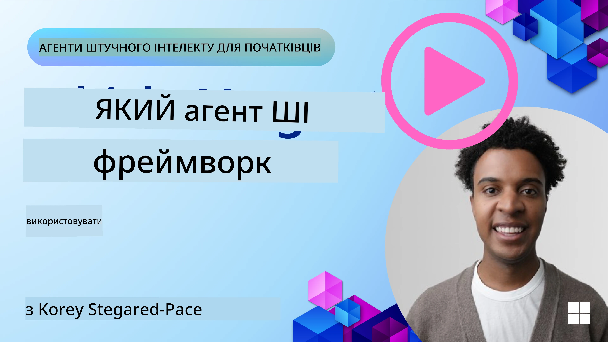

[](https://youtu.be/ODwF-EZo_O8?si=1xoy_B9RNQfrYdF7)

> _(Натисніть на зображення вище, щоб переглянути відео цього уроку)_

# Дослідження фреймворків AI агентів

Фреймворки AI агентів — це програмні платформи, створені для спрощення створення, впровадження та управління AI агентами. Ці фреймворки надають розробникам попередньо створені компоненти, абстракції та інструменти, що оптимізують розробку складних систем ШІ.

Ці фреймворки допомагають розробникам зосередитись на унікальних аспектах їхніх додатків, пропонуючи стандартизовані підходи до типових викликів у розробці AI агентів. Вони підвищують масштабованість, доступність і ефективність створення AI систем.

## Вступ

У цьому уроці розглянемо:

- Що таке фреймворки AI агентів і що вони дають змогу розробникам досягти?
- Як команди можуть використовувати їх для швидкого прототипування, ітерації та покращення можливостей агентів?
- Які відмінності між фреймворками та інструментами, створеними Microsoft (<a href="https://aka.ms/ai-agents-beginners/ai-agent-service" target="_blank">Microsoft Foundry Agent Service</a> та <a href="https://learn.microsoft.com/azure/ai-services/openai/how-to/responses" target="_blank">Microsoft Agent Framework</a>)?
- Чи можу я інтегрувати існуючі інструменти екосистеми Azure безпосередньо, чи потрібні автономні рішення?
- Що таке Microsoft Foundry Agent Service і як це мені допомагає?

## Цілі навчання

Мета цього уроку — допомогти вам зрозуміти:

- Роль фреймворків AI агентів у розробці ШІ.
- Як використовувати фреймворки AI агентів для створення інтелектуальних агентів.
- Ключові можливості, які надають фреймворки AI агентів.
- Відмінності між Microsoft Agent Framework і Microsoft Foundry Agent Service.

## Що таке фреймворки AI агентів і що вони дають розробникам?

Традиційні фреймворки AI можуть допомогти інтегрувати ШІ у ваші додатки та покращити їх наступним чином:

- **Персоналізація**: ШІ аналізує поведінку та вподобання користувача, щоб надавати персоналізовані рекомендації, контент і досвід.
Приклад: потокові сервіси, такі як Netflix, використовують ШІ для пропозиції фільмів і шоу на основі історії переглядів, підвищуючи залучення та задоволення користувачів.
- **Автоматизація та ефективність**: ШІ може автоматизувати повторювані завдання, оптимізувати робочі процеси та покращувати оперативну ефективність.
Приклад: додатки служби підтримки клієнтів використовують чатботів на базі ШІ для обробки типових запитів, скорочуючи час відповіді та звільняючи людських агентів для складніших питань.
- **Покращений користувацький досвід**: ШІ покращує загальний досвід користувачів, надаючи інтелектуальні функції, такі як розпізнавання голосу, обробка природної мови та передбачуваний текст.
Приклад: віртуальні асистенти, такі як Siri та Google Assistant, використовують ШІ для розуміння і відповіді на голосові команди, полегшуючи взаємодію користувачів з пристроями.

### Все це звучить чудово, але навіщо нам потрібен фреймворк AI агентів?

Фреймворки AI агентів — це не просто фреймворки ШІ. Вони призначені для створення інтелектуальних агентів, які можуть взаємодіяти з користувачами, іншими агентами та середовищем для досягнення конкретних цілей. Ці агенти здатні проявляти автономну поведінку, приймати рішення та адаптуватися до змінних умов. Розглянемо ключові можливості, які надають фреймворки AI агентів:

- **Співпраця та координація агентів**: можливість створювати кілька AI агентів, які можуть працювати разом, спілкуватися та координуватися для розв’язання складних задач.
- **Автоматизація та управління завданнями**: надання механізмів автоматизації багатокрокових робочих процесів, делегування завдань і динамічного управління завданнями між агентами.
- **Контекстне розуміння та адаптація**: оснащення агентів здатністю розуміти контекст, адаптуватися до змін середовища і приймати рішення на основі інформації в реальному часі.

Отже, підсумовуючи: агенти дозволяють робити більше, вивести автоматизацію на новий рівень, створювати більш інтелектуальні системи, які можуть адаптуватися і навчатися з середовища.

## Як швидко прототипувати, ітерувати і покращувати можливості агента?

Це швидкозмінне середовище, але є дещо спільне в більшості фреймворків AI агентів, що допомагає швидко прототипувати та ітерувати — це модульні компоненти, інструменти для співпраці та навчання в реальному часі. Розглянемо їх детальніше:

- **Використовуйте модульні компоненти**: SDK ШІ пропонують попередньо створені компоненти, такі як коннектори AI і пам’яті, виклик функцій за допомогою природної мови чи кодових плагінів, шаблони запитів та інше.
- **Використовуйте інструменти для співпраці**: розробляйте агентів з конкретними ролями і завданнями, що дає змогу тестувати та вдосконалювати спільні робочі процеси.
- **Навчайтеся в реальному часі**: впроваджуйте зворотні зв’язки, за якими агенти навчаються з взаємодій і динамічно адаптують свою поведінку.

### Використання модульних компонентів

SDK, такі як Microsoft Agent Framework, пропонують попередньо створені компоненти, до яких належать AI коннектори, визначення інструментів і управління агентами.

**Як це використовують команди**: команди можуть швидко збирати ці компоненти для створення функціонального прототипу без початку з нуля, що дозволяє експериментувати і ітерувати швидко.

**Як це працює на практиці**: ви можете використовувати готовий парсер для вилучення інформації з вхідних даних користувача, модуль пам’яті для зберігання і отримання даних та генератор запитів для взаємодії з користувачами, все це без необхідності розробляти компоненти з нуля.

**Приклад коду**. Розглянемо приклад використання Microsoft Agent Framework із `FoundryChatClient`, щоб модель могла відповідати на вхідні дані користувача з викликом інструментів:

``` python
# Приклад використання Microsoft Agent Framework на Python

import asyncio
import os

from agent_framework import tool
from agent_framework.foundry import FoundryChatClient
from azure.identity import AzureCliCredential


# Визначити приклад функції інструменту для бронювання подорожі
@tool(approval_mode="never_require")
def book_flight(date: str, location: str) -> str:
    """Book travel given location and date."""
    return f"Travel was booked to {location} on {date}"


async def main():
    provider = FoundryChatClient(
        project_endpoint=os.environ["AZURE_AI_PROJECT_ENDPOINT"],
        model=os.environ["AZURE_AI_MODEL_DEPLOYMENT_NAME"],
        credential=AzureCliCredential(),
    )
    agent = provider.as_agent(
        name="travel_agent",
        instructions="Help the user book travel. Use the book_flight tool when ready.",
        tools=[book_flight],
    )

    response = await agent.run("I'd like to go to New York on January 1, 2025")
    print(response)
    # Приклад виводу: Ваш рейс до Нью-Йорка на 1 січня 2025 року успішно заброньовано. Щасливої дороги! ✈️🗽


if __name__ == "__main__":
    asyncio.run(main())
```

З цього прикладу видно, як можна використати попередньо створений парсер для вилучення ключової інформації з вхідних даних користувача, такої як пункт відправлення, пункт призначення та дата запиту на бронювання рейсу. Такий модульний підхід дозволяє зосередитися на логіці високого рівня.

### Використання інструментів для співпраці

Фреймворки, такі як Microsoft Agent Framework, полегшують створення кількох агентів, які можуть працювати спільно.

**Як це використовують команди**: команди можуть проектувати агентів із конкретними ролями та завданнями для тестування та вдосконалення спільних робочих процесів і підвищення загальної ефективності системи.

**Як це працює на практиці**: можна створити команду агентів, де кожен агент виконуватиме спеціалізовану функцію — збір даних, аналіз або прийняття рішень. Ці агенти можуть спілкуватися та обмінюватися інформацією, щоб досягти спільної мети, наприклад, відповісти на запит користувача або виконати завдання.

**Приклад коду (Microsoft Agent Framework)**:

```python
# Створення кількох агентів, які працюють разом за допомогою Microsoft Agent Framework

import os
from agent_framework.foundry import FoundryChatClient
from azure.identity import AzureCliCredential

provider = FoundryChatClient(
    project_endpoint=os.environ["AZURE_AI_PROJECT_ENDPOINT"],
    model=os.environ["AZURE_AI_MODEL_DEPLOYMENT_NAME"],
    credential=AzureCliCredential(),
)

# Агент отримання даних
agent_retrieve = provider.as_agent(
    name="dataretrieval",
    instructions="Retrieve relevant data using available tools.",
    tools=[retrieve_tool],
)

# Агент аналізу даних
agent_analyze = provider.as_agent(
    name="dataanalysis",
    instructions="Analyze the retrieved data and provide insights.",
    tools=[analyze_tool],
)

# Запуск агентів послідовно для виконання завдання
retrieval_result = await agent_retrieve.run("Retrieve sales data for Q4")
analysis_result = await agent_analyze.run(f"Analyze this data: {retrieval_result}")
print(analysis_result)
```

З попереднього коду ви бачите, як створюється завдання, що включає кількох агентів, які працюють разом для аналізу даних. Кожен агент виконує певну функцію, а завдання реалізується шляхом координації дій агентів для досягнення потрібного результату. Створення спеціалізованих агентів підвищує ефективність та продуктивність виконання завдань.

### Навчання в реальному часі

Розвинуті фреймворки надають можливості для розуміння контексту та адаптації в реальному часі.

**Як це використовують команди**: команди можуть впроваджувати цикли зворотного зв’язку, де агенти навчаються з взаємодій і динамічно коригують свою поведінку, що сприяє безперервному покращенню і розвитку можливостей.

**Як це працює на практиці**: агенти можуть аналізувати відгуки користувачів, дані середовища та результати завдань, оновлювати базу знань, коригувати алгоритми прийняття рішень і підвищувати продуктивність з часом. Цей ітеративний процес навчання дозволяє агентам адаптуватися до зміни умов і вподобань користувачів, підвищуючи ефективність системи загалом.

## Які відмінності між Microsoft Agent Framework і Microsoft Foundry Agent Service?

Існує багато способів порівняти ці підходи, але розглянемо основні відмінності за дизайном, можливостями та цільовим використанням:

## Microsoft Agent Framework (MAF)

Microsoft Agent Framework надає спрощений SDK для створення AI агентів із використанням `FoundryChatClient`. Він дозволяє розробникам створювати агентів, які використовують моделі Azure OpenAI з вбудованим викликом інструментів, управлінням діалогом і корпоративним рівнем безпеки через Azure ідентифікацію.

**Випадки використання**: створення готових до виробництва AI агентів із використанням інструментів, багатокрокових робочих процесів і сценаріїв корпоративної інтеграції.

Ось кілька важливих основних концепцій Microsoft Agent Framework:

- **Агенти**. Агент створюється через `FoundryChatClient` та налаштовується за допомогою імені, інструкцій і інструментів. Агент може:
  - **Обробляти повідомлення користувачів** і генерувати відповіді із використанням моделей Azure OpenAI.
  - **Автоматично викликати інструменти** залежно від контексту діалогу.
  - **Підтримувати стан діалогу** під час кількох взаємодій.

  Ось фрагмент коду для створення агента:

    ```python
    import os
    from agent_framework.foundry import FoundryChatClient
    from azure.identity import AzureCliCredential

    provider = FoundryChatClient(
        project_endpoint=os.environ["AZURE_AI_PROJECT_ENDPOINT"],
        model=os.environ["AZURE_AI_MODEL_DEPLOYMENT_NAME"],
        credential=AzureCliCredential(),
    )
    agent = provider.as_agent(
        name="my_agent",
        instructions="You are a helpful assistant.",
    )

    response = await agent.run("Hello, World!")
    print(response)
    ```

- **Інструменти**. Фреймворк підтримує визначення інструментів як Python функції, які агент може викликати автоматично. Інструменти реєструються при створенні агента:

    ```python
    def get_weather(location: str) -> str:
        """Get the current weather for a location."""
        return f"The weather in {location} is sunny, 72\u00b0F."

    agent = provider.as_agent(
        name="weather_agent",
        instructions="Help users check the weather.",
        tools=[get_weather],
    )
    ```

- **Координація багатьох агентів**. Можна створювати кілька агентів із різною спеціалізацією та координувати їхню роботу:

    ```python
    planner = provider.as_agent(
        name="planner",
        instructions="Break down complex tasks into steps.",
    )

    executor = provider.as_agent(
        name="executor",
        instructions="Execute the planned steps using available tools.",
        tools=[execute_tool],
    )

    plan = await planner.run("Plan a trip to Paris")
    result = await executor.run(f"Execute this plan: {plan}")
    ```

- **Інтеграція Azure Identity**. Фреймворк використовує `AzureCliCredential` (або `DefaultAzureCredential`) для безпечної автентифікації без ключів, усуваючи необхідність управляти ключами API безпосередньо.

## Microsoft Foundry Agent Service

Microsoft Foundry Agent Service - це новіша платформа, представлена на Microsoft Ignite 2024. Вона дозволяє розробляти та запускати AI агентів з більш гнучкими моделями, такими як прямий виклик відкритих моделей LLM, наприклад Llama 3, Mistral та Cohere.

Microsoft Foundry Agent Service надає сильніші механізми корпоративної безпеки та методи зберігання даних, що робить його придатним для корпоративних застосунків.

Він працює «з коробки» з Microsoft Agent Framework для створення та запуску агентів.

Цей сервіс наразі знаходиться на публічному прев’ю і підтримує Python та C# для створення агентів.

За допомогою Python SDK Microsoft Foundry Agent Service можна створити агента з користувацьким інструментом:

```python
import asyncio
from azure.identity import DefaultAzureCredential
from azure.ai.projects import AIProjectClient

# Визначте функції інструментів
def get_specials() -> str:
    """Provides a list of specials from the menu."""
    return """
    Special Soup: Clam Chowder
    Special Salad: Cobb Salad
    Special Drink: Chai Tea
    """

def get_item_price(menu_item: str) -> str:
    """Provides the price of the requested menu item."""
    return "$9.99"


async def main() -> None:
    credential = DefaultAzureCredential()
    project_client = AIProjectClient.from_connection_string(
        credential=credential,
        conn_str="your-connection-string",
    )

    agent = project_client.agents.create_agent(
        model="gpt-4o-mini",
        name="Host",
        instructions="Answer questions about the menu.",
        tools=[get_specials, get_item_price],
    )

    thread = project_client.agents.create_thread()

    user_inputs = [
        "Hello",
        "What is the special soup?",
        "How much does that cost?",
        "Thank you",
    ]

    for user_input in user_inputs:
        print(f"# User: '{user_input}'")
        message = project_client.agents.create_message(
            thread_id=thread.id,
            role="user",
            content=user_input,
        )
        run = project_client.agents.create_and_process_run(
            thread_id=thread.id, agent_id=agent.id
        )
        messages = project_client.agents.list_messages(thread_id=thread.id)
        print(f"# Agent: {messages.data[0].content[0].text.value}")


if __name__ == "__main__":
    asyncio.run(main())
```

### Основні поняття

У Microsoft Foundry Agent Service є такі основні поняття:

- **Агент**. Microsoft Foundry Agent Service інтегрується з Microsoft Foundry. В Microsoft Foundry AI агент є "розумним" мікросервісом, який може відповідати на запитання (RAG), виконувати дії або повністю автоматизувати робочі процеси. Це досягається поєднанням потужності генеративних моделей ШІ з інструментами, які дозволяють отримувати та взаємодіяти з реальними джерелами даних. Ось приклад агента:

    ```python
    agent = project_client.agents.create_agent(
        model="gpt-4o-mini",
        name="my-agent",
        instructions="You are helpful agent",
        tools=code_interpreter.definitions,
        tool_resources=code_interpreter.resources,
    )
    ```

    У цьому прикладі агент створено з моделлю `gpt-4o-mini`, ім’ям `my-agent` та інструкцією `You are helpful agent`. Агент оснащений інструментами та ресурсами для виконання завдань з інтерпретації коду.

- **Тред і повідомлення**. Тред — це ще одне важливе поняття. Він репрезентує розмову чи взаємодію між агентом та користувачем. Треди можна використовувати для відстеження ходу розмови, зберігання контекстної інформації та керування станом взаємодії. Ось приклад треду:

    ```python
    thread = project_client.agents.create_thread()
    message = project_client.agents.create_message(
        thread_id=thread.id,
        role="user",
        content="Could you please create a bar chart for the operating profit using the following data and provide the file to me? Company A: $1.2 million, Company B: $2.5 million, Company C: $3.0 million, Company D: $1.8 million",
    )
    
    # Запропонуйте агенту виконати роботу в потоці
    run = project_client.agents.create_and_process_run(thread_id=thread.id, agent_id=agent.id)
    
    # Отримайте та зафіксуйте всі повідомлення, щоб побачити відповідь агента
    messages = project_client.agents.list_messages(thread_id=thread.id)
    print(f"Messages: {messages}")
    ```

    У попередньому коді створюється тред. Потім до треду надсилається повідомлення. Викликом `create_and_process_run` агенту доручається виконати роботу над тредом. Нарешті, повідомлення отримуються та логуються, щоб побачити відповідь агента. Повідомлення показують прогрес розмови між користувачем і агентом. Також важливо розуміти, що повідомлення можуть бути різних типів, таких як текст, зображення або файл — це результат роботи агента, наприклад, зображення чи текстова відповідь. Як розробник, ви можете використовувати цю інформацію для подальшої обробки відповіді або її відображення користувачу.

- **Інтеграція з Microsoft Agent Framework**. Microsoft Foundry Agent Service тісно співпрацює з Microsoft Agent Framework, що означає можливість створювати агентів за допомогою `FoundryChatClient` і розгортати їх через Agent Service для виробничих сценаріїв.

**Випадки використання**: Microsoft Foundry Agent Service розроблений для корпоративних застосунків, які потребують безпечного, масштабованого й гнучкого розгортання AI агентів.

## У чому різниця між цими підходами?
 
Можливо, звучить, що є накладання, але існують ключові відмінності у дизайні, можливостях та цільових сценаріях:
 
- **Microsoft Agent Framework (MAF)**: це готовий до виробництва SDK для створення AI агентів. Він забезпечує простий API для створення агентів з викликом інструментів, управлінням діалогами та інтеграцією Azure Identity.
- **Microsoft Foundry Agent Service**: це платформа і сервіс розгортання в Microsoft Foundry для агентів. Вона забезпечує вбудоване підключення до сервісів, таких як Azure OpenAI, Azure AI Search, Bing Search та виконання коду.
 
Все ще не впевнені, що обрати?

### Випадки використання
 
Спробуємо допомогти, розглянувши типові сценарії:
 
> Питання: Я створюю виробничі AI агентські додатки і хочу швидко розпочати
>

>Відповідь: Microsoft Agent Framework — чудовий вибір. Він надає простий, Python-подібний API через `FoundryChatClient`, що дозволяє визначати агентів з інструментами та інструкціями в кілька рядків коду.

>Питання: Мені потрібно корпоративне розгортання з інтеграціями Azure, як Search і виконання коду
>
> Відповідь: Microsoft Foundry Agent Service — найкраще рішення. Це платформа-сервіс із вбудованими можливостями для кількох моделей, Azure AI Search, Bing Search та Azure Functions. Вона полегшує створення агентів у Foundry Portal і їх масштабне розгортання.
 
> Питання: Я все ще плутаюся, просто дайте одну опцію
>
> Відповідь: Почніть зі створення агентів у Microsoft Agent Framework, а потім використовуйте Microsoft Foundry Agent Service, коли потрібно розгортати й масштабувати їх у виробництві. Цей підхід дає змогу швидко ітерувати логіку агента з чітким шляхом до корпоративного розгортання.
 
Підсумуємо ключові відмінності у таблиці:

| Фреймворк | Фокус | Основні поняття | Випадки використання |
| --- | --- | --- | --- |
| Microsoft Agent Framework | Спрощений SDK агентів з викликом інструментів | Агенти, Інструменти, Azure Identity | Створення AI агентів, використання інструментів, багатокрокові робочі процеси |
| Microsoft Foundry Agent Service | Гнучкі моделі, корпоративна безпека, генерація коду, виклик інструментів | Модульність, Співпраця, Оркестрація процесів | Безпечне, масштабоване і гнучке розгортання AI агентів |

## Чи можу я інтегрувати свої існуючі інструменти екосистеми Azure безпосередньо, чи потрібні автономні рішення?


Відповідь — так, ви можете інтегрувати наявні інструменти екосистеми Azure безпосередньо з Microsoft Foundry Agent Service, особливо оскільки він розроблений для бездоганної роботи з іншими службами Azure. Наприклад, ви можете інтегрувати Bing, Azure AI Search та Azure Functions. Існує також глибока інтеграція з Microsoft Foundry.

Фреймворк Microsoft Agent також інтегрується з сервісами Azure через `FoundryChatClient` та ідентифікацію Azure, що дозволяє викликати служби Azure безпосередньо з ваших агентських інструментів.

## Приклади коду

- Python: [Agent Framework (Microsoft Foundry)](./code_samples/02-python-agent-framework.ipynb)
- Python: [Agent Framework (Azure OpenAI Responses API)](./code_samples/02-python-agent-framework-azure-openai.ipynb)
- .NET: [Agent Framework](./code_samples/02-dotnet-agent-framework.md)

## Більше запитань про AI Agent Frameworks?

Приєднуйтесь до [Microsoft Foundry Discord](https://discord.com/invite/ATgtXmAS5D), щоб зустрітися з іншими навчальними, відвідати години консультацій та отримати відповіді на питання про AI агентів.

## Джерела

- <a href="https://techcommunity.microsoft.com/blog/azure-ai-services-blog/introducing-azure-ai-agent-service/4298357" target="_blank">Azure Agent Service</a>
- <a href="https://learn.microsoft.com/azure/ai-services/openai/how-to/responses" target="_blank">Microsoft Agent Framework - Azure OpenAI Responses</a>
- <a href="https://learn.microsoft.com/azure/ai-services/agents/overview" target="_blank">Microsoft Foundry Agent Service</a>

## Попередній урок

[Вступ до AI агентів та випадків використання агентів](../01-intro-to-ai-agents/README.md)

## Наступний урок

[Розуміння патернів агентського дизайну](../03-agentic-design-patterns/README.md)

---

<!-- CO-OP TRANSLATOR DISCLAIMER START -->
**Відмова від відповідальності**:
Цей документ було перекладено за допомогою сервісу штучного інтелекту для перекладу [Co-op Translator](https://github.com/Azure/co-op-translator). Хоча ми прагнемо до точності, будь ласка, майте на увазі, що автоматичні переклади можуть містити помилки або неточності. Оригінальний документ рідною мовою слід вважати авторитетним джерелом. Для критично важливої інформації рекомендується професійний людський переклад. Ми не несемо відповідальності за будь-які непорозуміння або неправильні тлумачення, що виникли внаслідок використання цього перекладу.
<!-- CO-OP TRANSLATOR DISCLAIMER END -->