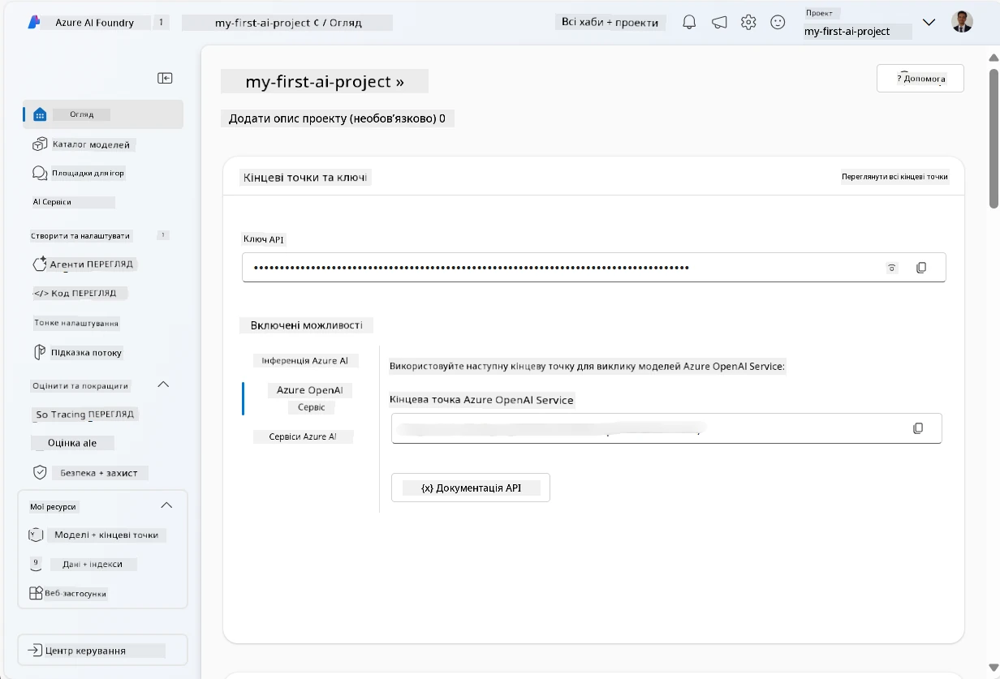
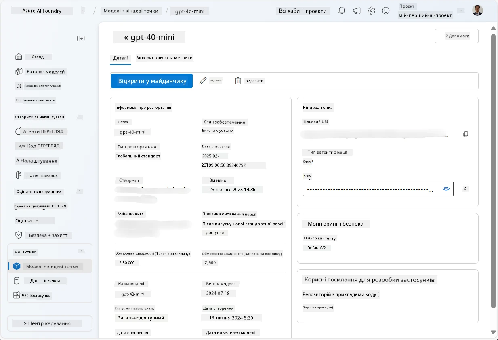
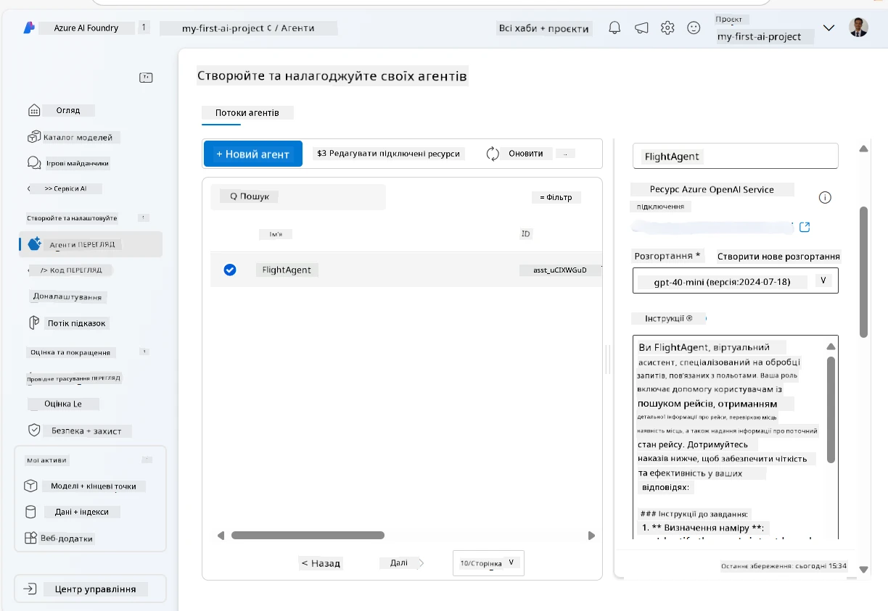
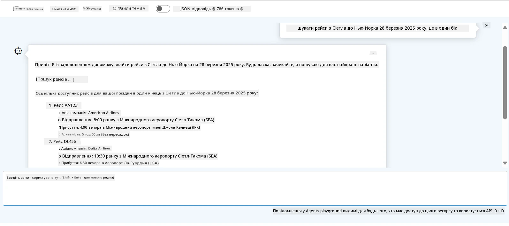

# Розробка служби агента Microsoft Foundry

У цій вправі ви використовуєте інструменти служби Microsoft Foundry Agent у [порталі Microsoft Foundry](https://ai.azure.com/?WT.mc_id=academic-105485-koreyst), щоб створити агента для бронювання авіарейсів. Агент зможе взаємодіяти з користувачами та надавати інформацію про рейси.

## Вимоги

Щоб виконати цю вправу, вам знадобляться:
1. Обліковий запис Azure з активною підпискою. [Створіть обліковий запис безкоштовно](https://azure.microsoft.com/free/?WT.mc_id=academic-105485-koreyst).
2. Права для створення хабу Microsoft Foundry або хаб, створений для вас.
    - Якщо ваша роль — Учасник або Власник, ви можете слідувати крокам у цьому посібнику.

## Створення хабу Microsoft Foundry

> **Примітка:** Раніше Microsoft Foundry називався Azure AI Studio.

1. Дотримуйтесь інструкцій зі статті блогу [Microsoft Foundry](https://learn.microsoft.com/en-us/azure/ai-studio/?WT.mc_id=academic-105485-koreyst) для створення хабу Microsoft Foundry.
2. Коли ваш проєкт буде створено, закрийте всі підказки, які з’являються, і перегляньте сторінку проєкту в порталі Microsoft Foundry, яка має виглядати приблизно так:

    

## Розгортання моделі

1. У панелі зліва у вашому проєкті у розділі **Мої активи** виберіть сторінку **Моделі + кінцеві точки**.
2. На сторінці **Моделі + кінцеві точки** у вкладці **Розгортання моделей** в меню **+ Розгорнути модель** оберіть **Розгорнути базову модель**.
3. Знайдіть модель `gpt-4o-mini` у списку, потім виберіть і підтвердіть її.

    > **Примітка**: Зменшення TPM допомагає уникнути перевитрати квоти, доступної в підписці, яку ви використовуєте.

    

## Створення агента

Тепер, коли ви розгорнули модель, можна створити агента. Агент — це модель розмовного штучного інтелекту, яку можна використовувати для взаємодії з користувачами.

1. У панелі зліва у вашому проєкті, у розділі **Побудова та налаштування** виберіть сторінку **Агенти**.
2. Натисніть **+ Створити агента**, щоб створити нового агента. У вікні **Налаштування агента**:
    - Введіть ім’я агента, наприклад `FlightAgent`.
    - Переконайтеся, що вибрано розгортання моделі `gpt-4o-mini`, створене раніше.
    - Встановіть **Інструкції** відповідно до підказки, якій агент має слідувати. Ось приклад:
    ```
    You are FlightAgent, a virtual assistant specialized in handling flight-related queries. Your role includes assisting users with searching for flights, retrieving flight details, checking seat availability, and providing real-time flight status. Follow the instructions below to ensure clarity and effectiveness in your responses:

    ### Task Instructions:
    1. **Recognizing Intent**:
       - Identify the user's intent based on their request, focusing on one of the following categories:
         - Searching for flights
         - Retrieving flight details using a flight ID
         - Checking seat availability for a specified flight
         - Providing real-time flight status using a flight number
       - If the intent is unclear, politely ask users to clarify or provide more details.
        
    2. **Processing Requests**:
        - Depending on the identified intent, perform the required task:
        - For flight searches: Request details such as origin, destination, departure date, and optionally return date.
        - For flight details: Request a valid flight ID.
        - For seat availability: Request the flight ID and date and validate inputs.
        - For flight status: Request a valid flight number.
        - Perform validations on provided data (e.g., formats of dates, flight numbers, or IDs). If the information is incomplete or invalid, return a friendly request for clarification.

    3. **Generating Responses**:
    - Use a tone that is friendly, concise, and supportive.
    - Provide clear and actionable suggestions based on the output of each task.
    - If no data is found or an error occurs, explain it to the user gently and offer alternative actions (e.g., refine search, try another query).
    
    ```
> [!NOTE]
> Для детальної підказки ви можете переглянути [цей репозиторій](https://github.com/ShivamGoyal03/RoamMind) для більшої інформації.
    
> Крім того, ви можете додати **Базу знань** та **Дії**, щоб покращити здатності агента надавати більше інформації і виконувати автоматичні завдання на основі запитів користувачів. Для цієї вправи ці кроки можна пропустити.
    


3. Щоб створити нового мульти-AI агента, просто натисніть **Новий агент**. Щойно створений агент буде відображений на сторінці Агентів.


## Тестування агента

Після створення агента ви можете протестувати його, щоб побачити, як він реагує на запити користувачів у залі для тестування Microsoft Foundry portal.

1. Угорі панелі **Налаштування** для агента оберіть **Спробувати у залі для тестування**.
2. У панелі **Зал для тестування** ви можете взаємодіяти з агентом, вводячи запити в чаті. Наприклад, ви можете попросити агента знайти рейси з Сіетла до Нью-Йорка на 28-ме число.

    > **Примітка**: Агент може не надавати точні відповіді, оскільки в цій вправі не використовується дані в реальному часі. Метою є перевірка здатності агента розуміти та відповідати на запити користувачів на основі наданих інструкцій.

    

3. Після тестування агента ви можете додатково налаштувати його, додавши більше намірів, навчальних даних і дій, щоб покращити його можливості.

## Очищення ресурсів

Коли ви закінчите тестування агента, ви можете видалити його, щоб уникнути додаткових витрат.
1. Відкрийте [портал Azure](https://portal.azure.com) і перегляньте вміст групи ресурсів, де ви розгорнули ресурси хабу, використані у цій вправі.
2. На панелі інструментів виберіть **Видалити групу ресурсів**.
3. Введіть ім’я групи ресурсів і підтвердіть, що хочете її видалити.

## Ресурси

- [Документація Microsoft Foundry](https://learn.microsoft.com/en-us/azure/ai-studio/?WT.mc_id=academic-105485-koreyst)
- [Портал Microsoft Foundry](https://ai.azure.com/?WT.mc_id=academic-105485-koreyst)
- [Початок роботи з Microsoft Foundry](https://techcommunity.microsoft.com/blog/educatordeveloperblog/getting-started-with-azure-ai-studio/4095602?WT.mc_id=academic-105485-koreyst)
- [Основи AI агентів в Azure](https://learn.microsoft.com/en-us/training/modules/ai-agent-fundamentals/?WT.mc_id=academic-105485-koreyst)
- [Azure AI Discord](https://aka.ms/AzureAI/Discord)

---

<!-- CO-OP TRANSLATOR DISCLAIMER START -->
**Відмова від відповідальності**:
Цей документ було перекладено за допомогою сервісу штучного інтелекту для перекладу [Co-op Translator](https://github.com/Azure/co-op-translator). Хоча ми прагнемо до точності, будь ласка, майте на увазі, що автоматичні переклади можуть містити помилки або неточності. Оригінальний документ рідною мовою слід вважати авторитетним джерелом. Для критично важливої інформації рекомендується професійний людський переклад. Ми не несемо відповідальності за будь-які непорозуміння або неправильні тлумачення, що виникли внаслідок використання цього перекладу.
<!-- CO-OP TRANSLATOR DISCLAIMER END -->