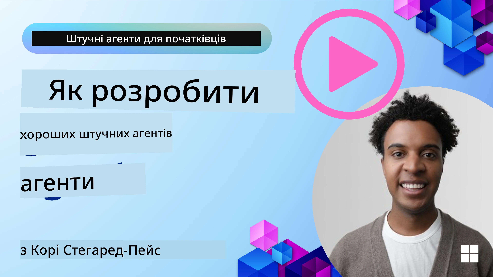
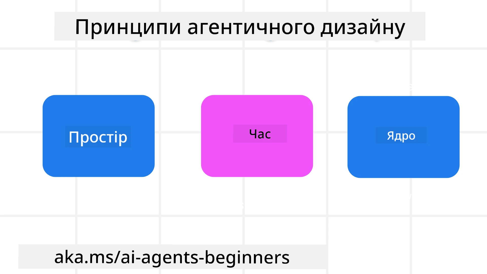

> _(Натисніть на зображення вище, щоб переглянути відео цього уроку)_
# Принципи агентного дизайну ШІ

## Вступ

Існує багато способів підходу до побудови агентних систем ШІ. Оскільки неоднозначність є особливістю, а не недоліком у дизайні генеративного ШІ, інженерам іноді важко зрозуміти, з чого навіть почати. Ми створили набір орієнтованих на людину принципів UX-дизайну, щоб допомогти розробникам будувати клієнтоорієнтовані агентні системи, які вирішують бізнес-завдання. Ці принципи дизайну не є приписаною архітектурою, але служать відправною точкою для команд, які визначають і створюють агентний досвід.

Загалом, агенти повинні:

- Розширювати і масштабувати людські можливості (генерування ідей, вирішення проблем, автоматизація тощо)
- Заповнювати прогалини у знаннях (допомагати швидко опанувати знання в галузях, перекладати тощо)
- Сприяти і підтримувати співпрацю в тих формах, що нам особисто зручні для роботи з іншими
- Робити нас кращими версіями самих себе (наприклад, як особистий коуч або контролер завдань, допомога у навчанні емоційній регуляції та усвідомленості, розвиток стійкості тощо)

## Цей урок охопить

- Що таке принципи агентного дизайну
- Які є настанови для їхнього впровадження
- Приклади використання цих принципів

## Цілі навчання

Після проходження цього уроку ви зможете:

1. Пояснити, що таке принципи агентного дизайну
2. Пояснити настанови для використання принципів агентного дизайну
3. Розуміти, як створити агента, застосовуючи принципи агентного дизайну

## Принципи агентного дизайну

### Агент (Простір)

Це середовище, в якому працює агент. Ці принципи визначають, як ми проектуємо агентів для взаємодії у фізичних і цифрових світах.

- **З’єднувати, а не замикати** – допомагайте людям зв’язуватися з іншими людьми, подіями та корисними знаннями, щоб сприяти співпраці і взаємозв’язкам.
- Агенти допомагають зв’язувати події, знання і людей.
- Агенти зближують людей. Вони не призначені для заміни чи применшення людей.
- **Легко доступний, але часом непомітний** – агент переважно працює у фоновому режимі і підштовхує нас лише коли це доречно.
  - Агент легко знайти і отримати доступ авторизованим користувачам на будь-якому пристрої чи платформі.
  - Агент підтримує мультимодальні вхідні/вихідні дані (звук, голос, текст тощо).
  - Агент може плавно перемикатися між переднім планом і фоном; між проактивним і реактивним режимами залежно від сприйняття потреб користувача.
  - Агент може працювати у непомітній формі, але його фонові процеси і співпраця з іншими агентами прозорі і керовані користувачем.

### Агент (Час)

Це те, як агент працює у часі. Ці принципи визначають, як проектувати агентів для взаємодії у минулому, теперішньому і майбутньому.

- **Минуле**: Рефлексія над історією, що включає як стан, так і контекст.
  - Агент надає більш релевантні результати на основі аналізу більш глибоких історичних даних, ніж просто подія, люди чи стан.
  - Агент встановлює зв’язки між подіями минулого й активно використовує пам’ять для взаємодії з поточними ситуаціями.
- **Тепер**: Підштовхування, а не просто повідомлення.
  - Агент уособлює всебічний підхід до взаємодії з людьми. Коли подія відбувається, агент виходить за межі статичного повідомлення чи формальності. Агент може спрощувати процеси або динамічно генерувати підказки, щоб направити увагу користувача у потрібний момент.
  - Агент надає інформацію, базуючись на контексті, соціальних і культурних змінах, адресовано під наміри користувача.
  - Взаємодія з агентом може бути поступовою, рости і ставати складнішою, щоб на довгостроковій основі розширювати можливості користувачів.
- **Майбутнє**: Адаптація і розвиток.
  - Агент пристосовується до різних пристроїв, платформ та режимів.
  - Агент враховує поведінку користувача, потреби в доступності і є вільно налаштовуваним.
  - Агент формується та розвивається через безперервну взаємодію з користувачем.

### Агент (Ядро)

Це ключові елементи в ядрі дизайну агента.

- **Приймайте невизначеність, але встановлюйте довіру**.
  - Певний рівень невизначеності агента очікується. Невизначеність — ключовий елемент дизайну агента.
  - Довіра і прозорість — базові шари дизайну агента.
  - Люди контролюють, коли агент увімкнено/вимкнено, і статус агента завжди чітко видимий.

## Настанови для впровадження цих принципів

Коли ви використовуєте зазначені принципи дизайну, дотримуйтесь наступних настанов:

1. **Прозорість**: Повідомляйте користувача, що залучений ШІ, як він функціонує (включно з минулими діями) і як надати відгук і змінити систему.
2. **Контроль**: Даєте користувачу можливість налаштовувати, визначати уподобання і персоналізувати, а також контролювати систему і її атрибути (включно з можливістю забування).
3. **Послідовність**: Створюйте послідовний мультимодальний досвід на різних пристроях і кінцевих точках. Використовуйте знайомі UI/UX елементи, де можливо (наприклад, іконку мікрофона для голосової взаємодії) і максимально знижуйте когнітивне навантаження користувача (наприклад, компактні відповіді, візуальні допомоги і контент «Дізнатися більше»).

## Як розробити туристичного агента з цими принципами і настановами

Уявіть, що ви створюєте туристичного агента. Ось як можна подумати про використання принципів дизайну і настанов:

1. **Прозорість** – Повідомте користувача, що туристичний агент є агентом на базі ШІ. Надайте базові інструкції про початок роботи (наприклад, повідомлення «Привіт», приклади команд). Чітко задокументуйте це на сторінці продукту. Показуйте список команд, які користувач вводив раніше. Ясно пояснюйте, як надати відгук (пальці вгору/вниз, кнопка «Надіслати відгук» тощо). Чітко вказуйте, чи є обмеження використання або тем.
2. **Контроль** – Переконайтеся, що користувач розуміє, як змінювати агента після створення (наприклад, через системний запит). Дозвольте вибирати, наскільки докладним буде агент, його стиль письма і які теми заборонені для обговорення. Дайте можливість переглядати і видаляти будь-які файли, дані, запити і минулі розмови.
3. **Послідовність** – Переконайтеся, що іконки для спільного використання запиту, додавання файлу або фото і позначення когось чи чогось є стандартними і впізнаваними. Використовуйте іконку скріпки для завантаження/обміну файлами з агентом, а іконку зображення для завантаження графіки.

## Приклади коду

- Python: [Agent Framework](./code_samples/03-python-agent-framework.ipynb)
- .NET: [Agent Framework](./code_samples/03-dotnet-agent-framework.md)

## Маються ще питання про агентні дизайн-патерни ШІ?

Приєднуйтесь до [Microsoft Foundry Discord](https://discord.com/invite/ATgtXmAS5D), щоб зустрітися з іншими учнями, відвідати години консультацій і отримати відповіді на свої питання щодо агентів ШІ.

## Додаткові ресурси

- <a href="https://openai.com" target="_blank">Практики управління агентними системами ШІ | OpenAI</a>
- <a href="https://microsoft.com" target="_blank">Проєкт HAX Toolkit - Microsoft Research</a>
- <a href="https://responsibleaitoolbox.ai" target="_blank">Інструментарій відповідального ШІ</a>

## Попередній урок

[Вивчення агентних фреймворків](../02-explore-agentic-frameworks/README.md)

## Наступний урок

[Шаблон дизайну використання інструментів](../04-tool-use/README.md)

---

<!-- CO-OP TRANSLATOR DISCLAIMER START -->
**Відмова від відповідальності**:
Цей документ було перекладено за допомогою сервісу штучного інтелекту для перекладу [Co-op Translator](https://github.com/Azure/co-op-translator). Хоча ми прагнемо до точності, будь ласка, майте на увазі, що автоматичні переклади можуть містити помилки або неточності. Оригінальний документ рідною мовою слід вважати авторитетним джерелом. Для критично важливої інформації рекомендується професійний людський переклад. Ми не несемо відповідальності за будь-які непорозуміння або неправильні тлумачення, що виникли внаслідок використання цього перекладу.
<!-- CO-OP TRANSLATOR DISCLAIMER END -->