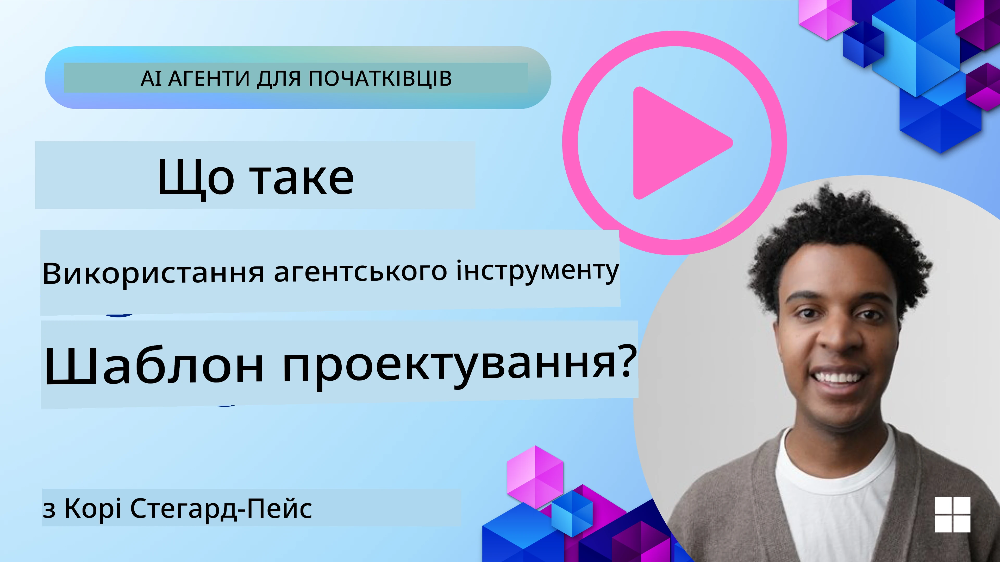
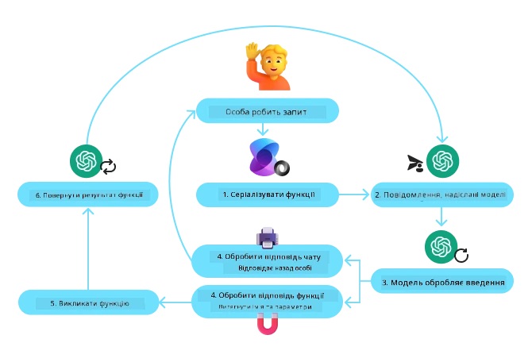
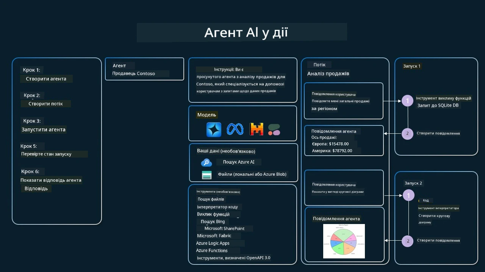

[](https://youtu.be/vieRiPRx-gI?si=cEZ8ApnT6Sus9rhn)

> _(Натисніть на зображення вище, щоб переглянути відео цього уроку)_

# Патерн використання інструментів

Інструменти цікаві тим, що вони дозволяють AI-агентам мати ширший діапазон можливостей. Замість того, щоб агент мав обмежений набір дій, додавання інструменту дає агенту змогу виконувати набагато ширший спектр операцій. У цій главі ми розглянемо Патерн використання інструментів, який описує, як AI-агенти можуть використовувати конкретні інструменти для досягнення своїх цілей.

## Вступ

У цьому уроці ми прагнемо відповісти на такі запитання:

- Що таке патерн використання інструментів?
- Для яких випадків його можна застосувати?
- Які елементи/будівельні блоки потрібні для реалізації цього патерну?
- Які особливі міркування слід враховувати при використанні патерну використання інструментів для створення надійних AI-агентів?

## Цілі навчання

Після завершення цього уроку ви зможете:

- Визначити патерн використання інструментів та його призначення.
- Виявляти випадки використання, де застосовується патерн використання інструментів.
- Розуміти ключові елементи, необхідні для реалізації патерну.
- Визнавати міркування щодо забезпечення довіри в AI-агентах, що використовують цей патерн.

## Що таке патерн використання інструментів?

**Патерн використання інструментів** зосереджений на наданні LLM здатності взаємодіяти з зовнішніми інструментами для досягнення конкретних цілей. Інструменти — це код, який може бути виконаний агентом для виконання дій. Інструментом може бути проста функція, наприклад калькулятор, або виклик API до стороннього сервісу, наприклад отримання ціни акцій чи прогнозу погоди. У контексті AI-агентів інструменти розробляються так, щоб ними могли керувати агенти у відповідь на **функціональні виклики, згенеровані моделлю**.

## Для яких випадків його можна застосувати?

AI-агенти можуть використовувати інструменти для виконання складних завдань, отримання інформації або прийняття рішень. Патерн використання інструментів часто застосовується у сценаріях, які потребують динамічної взаємодії з зовнішніми системами, такими як бази даних, веб-сервіси чи інтерпретатори коду. Ця можливість корисна для низки випадків використання, зокрема:

- **Динамічне отримання інформації:** агенти можуть звертатися до зовнішніх API або баз даних, щоб отримати актуальні дані (наприклад, виконувати запити до SQLite для аналізу даних, отримувати ціни акцій або погодну інформацію).
- **Виконання та інтерпретація коду:** агенти можуть виконувати код або скрипти для вирішення математичних задач, генерування звітів або проведення симуляцій.
- **Автоматизація робочих процесів:** автоматизація повторюваних або багатокрокових робочих процесів шляхом інтеграції інструментів, таких як планувальники завдань, сервіси електронної пошти або конвеєри даних.
- **Підтримка клієнтів:** агенти можуть взаємодіяти з CRM-системами, платформами для обробки звернень або базами знань, щоб вирішувати запити користувачів.
- **Генерація та редагування контенту:** агенти можуть використовувати інструменти, такі як перевірка граматики, підсумовувачі тексту або оцінювачі безпеки контенту, щоб допомагати у створенні контенту.

## Які елементи/будівельні блоки потрібні для реалізації патерну використання інструментів?

Ці будівельні блоки дозволяють AI-агенту виконувати широкий спектр завдань. Розглянемо ключові елементи, необхідні для реалізації патерну використання інструментів:

- **Схеми функцій/інструментів:** детальні визначення доступних інструментів, включно з іменем функції, призначенням, необхідними параметрами та очікуваними результатами. Ці схеми дозволяють LLM зрозуміти, які інструменти доступні і як формувати дійсні запити.

- **Логіка виконання функцій:** визначає, як і коли інструменти викликаються на підставі намірів користувача та контексту розмови. Це може включати модулі планувальника, механізми маршрутизації або умовні потоки, які динамічно визначають використання інструментів.

- **Система обробки повідомлень:** компоненти, які управляють потоками розмов між введеннями користувача, відповідями LLM, викликами інструментів та виходами інструментів.

- **Фреймворк інтеграції інструментів:** інфраструктура, що з'єднує агента з різними інструментами, чи то прості функції, чи складні зовнішні сервіси.

- **Обробка помилок і валідація:** механізми для обробки збоїв у виконанні інструментів, перевірки параметрів та керування несподіваними відповідями.

- **Управління станом:** відстежує контекст розмови, попередні взаємодії з інструментами та постійні дані, щоб забезпечити узгодженість у багатоходових взаємодіях.

Далі розглянемо детальніше виклик функцій/інструментів.
 
### Виклик функцій/інструментів

Виклик функцій — це основний спосіб, яким ми даємо змогу великим мовним моделям (LLM) взаємодіяти з інструментами. Ви часто бачитимете, що «Функція» та «Інструмент» вживаються взаємозамінно, оскільки «функції» (блоки повторно використовуваного коду) — це ті самі «інструменти», які агенти використовують для виконання завдань. Щоб код функції було викликано, LLM має зіставити запит користувача з описом функцій. Для цього схема, що містить описи всіх доступних функцій, надсилається LLM. Потім LLM обирає найбільш підходящу функцію для завдання і повертає її ім’я та аргументи. Обрану функцію виконується, її відповідь надсилається назад до LLM, яке використовує інформацію для відповіді на запит користувача.

Щоб розробники могли реалізувати виклик функцій для агентів, вам знадобиться:

1. Модель LLM, яка підтримує виклик функцій
2. Схема, що містить описи функцій
3. Код для кожної описаної функції

Наведемо приклад отримання поточного часу в місті для ілюстрації:

1. **Ініціалізувати LLM, який підтримує виклик функцій:**

    Не всі моделі підтримують виклик функцій, тому важливо перевірити, чи підтримує це LLM, який ви використовуєте.     <a href="https://learn.microsoft.com/azure/ai-services/openai/how-to/function-calling" target="_blank">Azure OpenAI</a> підтримує виклик функцій. Ми можемо почати з ініціалізації клієнта Azure OpenAI. 

    ```python
    # Ініціалізувати клієнта Azure OpenAI
    client = AzureOpenAI(
        azure_endpoint = os.getenv("AZURE_AI_PROJECT_ENDPOINT"), 
        api_key=os.getenv("AZURE_OPENAI_API_KEY"),  
        api_version="2024-05-01-preview"
    )
    ```

1. **Створити схему функції**:

    Далі ми визначимо JSON-схему, яка містить ім’я функції, опис того, що функція робить, а також імена та описи параметрів функції.
    Потім ми передамо цю схему клієнту, створеному раніше, разом із запитом користувача на пошук часу в Сан-Франциско. Важливо зазначити, що **повертається виклик інструменту**, **а не** остаточна відповідь на запит. Як було згадано раніше, LLM повертає ім’я функції, яку воно обрало для завдання, і аргументи, які будуть передані їй.

    ```python
    # Опис функції для прочитання моделлю
    tools = [
        {
            "type": "function",
            "function": {
                "name": "get_current_time",
                "description": "Get the current time in a given location",
                "parameters": {
                    "type": "object",
                    "properties": {
                        "location": {
                            "type": "string",
                            "description": "The city name, e.g. San Francisco",
                        },
                    },
                    "required": ["location"],
                },
            }
        }
    ]
    ```
   
    ```python
  
    # Початкове повідомлення користувача
    messages = [{"role": "user", "content": "What's the current time in San Francisco"}] 
  
    # Перший виклик API: Попросити модель використати функцію
      response = client.chat.completions.create(
          model=deployment_name,
          messages=messages,
          tools=tools,
          tool_choice="auto",
      )
  
      # Обробити відповідь моделі
      response_message = response.choices[0].message
      messages.append(response_message)
  
      print("Model's response:")  

      print(response_message)
  
    ```

    ```bash
    Model's response:
    ChatCompletionMessage(content=None, role='assistant', function_call=None, tool_calls=[ChatCompletionMessageToolCall(id='call_pOsKdUlqvdyttYB67MOj434b', function=Function(arguments='{"location":"San Francisco"}', name='get_current_time'), type='function')])
    ```
  
1. **Код функції, необхідний для виконання завдання:**

    Тепер, коли LLM вибрало, яку функцію потрібно запустити, необхідно реалізувати та виконати код, що виконує завдання.
    Ми можемо реалізувати код для отримання поточного часу на Python. Також нам потрібно буде написати код для вилучення імені та аргументів із response_message, щоб отримати остаточний результат.

    ```python
      def get_current_time(location):
        """Get the current time for a given location"""
        print(f"get_current_time called with location: {location}")  
        location_lower = location.lower()
        
        for key, timezone in TIMEZONE_DATA.items():
            if key in location_lower:
                print(f"Timezone found for {key}")  
                current_time = datetime.now(ZoneInfo(timezone)).strftime("%I:%M %p")
                return json.dumps({
                    "location": location,
                    "current_time": current_time
                })
      
        print(f"No timezone data found for {location_lower}")  
        return json.dumps({"location": location, "current_time": "unknown"})
    ```

     ```python
     # Обробляти виклики функцій
      if response_message.tool_calls:
          for tool_call in response_message.tool_calls:
              if tool_call.function.name == "get_current_time":
     
                  function_args = json.loads(tool_call.function.arguments)
     
                  time_response = get_current_time(
                      location=function_args.get("location")
                  )
     
                  messages.append({
                      "tool_call_id": tool_call.id,
                      "role": "tool",
                      "name": "get_current_time",
                      "content": time_response,
                  })
      else:
          print("No tool calls were made by the model.")  
  
      # Другий виклик API: Отримати остаточну відповідь від моделі
      final_response = client.chat.completions.create(
          model=deployment_name,
          messages=messages,
      )
  
      return final_response.choices[0].message.content
     ```

     ```bash
      get_current_time called with location: San Francisco
      Timezone found for san francisco
      The current time in San Francisco is 09:24 AM.
     ```

Виклик функцій є в центрі більшості, якщо не всіх, реалізацій патерну використання інструментів для агентів, проте реалізувати його з нуля іноді буває складно.
Як ми вивчали в [Уроці 2](../../../02-explore-agentic-frameworks), агентні фреймворки надають нам попередньо побудовані будівельні блоки для реалізації використання інструментів.
 
## Приклади використання інструментів з агентними фреймворками

Ось кілька прикладів того, як ви можете реалізувати Патерн використання інструментів за допомогою різних агентних фреймворків:

### Microsoft Agent Framework

<a href="https://learn.microsoft.com/azure/ai-services/agents/overview" target="_blank">Microsoft Agent Framework</a> — це фреймворк з відкритим кодом для створення AI-агентів. Він спрощує процес використання виклику функцій, дозволяючи визначати інструменти як Python-функції з декоратором `@tool`. Фреймворк обробляє обмін повідомленнями між моделлю та вашим кодом. Він також надає доступ до попередньо побудованих інструментів, таких як File Search та Code Interpreter, через `AzureAIProjectAgentProvider`.

Наступна діаграма ілюструє процес виклику функцій у Microsoft Agent Framework:



У Microsoft Agent Framework інструменти визначаються як функції з декораторами. Ми можемо перетворити функцію `get_current_time`, яку бачили раніше, на інструмент, використовуючи декоратор `@tool`. Фреймворк автоматично серіалізує функцію та її параметри, створюючи схему для надсилання до LLM.

```python
from agent_framework import tool
from agent_framework.azure import AzureAIProjectAgentProvider
from azure.identity import AzureCliCredential

@tool
def get_current_time(location: str) -> str:
    """Get the current time for a given location"""
    ...

# Створити клієнта
provider = AzureAIProjectAgentProvider(credential=AzureCliCredential())

# Створити агента і запустити його за допомогою інструмента
agent = await provider.create_agent(name="TimeAgent", instructions="Use available tools to answer questions.", tools=get_current_time)
response = await agent.run("What time is it?")
```
  
### Azure AI Agent Service

<a href="https://learn.microsoft.com/azure/ai-services/agents/overview" target="_blank">Azure AI Agent Service</a> — це новіший агентний фреймворк, створений для того, щоб надати розробникам можливість безпечно створювати, розгортати та масштабувати високоякісні та розширювані AI-агенти без необхідності керувати базовими обчислювальними та сховищними ресурсами. Він особливо корисний для корпоративних застосунків, оскільки є повністю керованим сервісом з корпоративним рівнем безпеки.

Порівняно з розробкою безпосередньо через API LLM, Azure AI Agent Service надає деякі переваги, зокрема:

- Автоматичний виклик інструментів — немає потреби розбирати виклик інструменту, викликати інструмент і обробляти відповідь; усе це тепер виконується на серверній стороні
- Безпечно керовані дані — замість управління власним станом розмови ви можете покладатися на threads для збереження всієї необхідної інформації
- Інструменти, готові до використання — інструменти, які можна використовувати для взаємодії з вашими джерелами даних, такі як Bing, Azure AI Search і Azure Functions.

Інструменти, доступні в Azure AI Agent Service, можна поділити на дві категорії:

1. Інструменти знань:
    - <a href="https://learn.microsoft.com/azure/ai-services/agents/how-to/tools/bing-grounding?tabs=python&pivots=overview" target="_blank">Grounding with Bing Search</a>
    - <a href="https://learn.microsoft.com/azure/ai-services/agents/how-to/tools/file-search?tabs=python&pivots=overview" target="_blank">File Search</a>
    - <a href="https://learn.microsoft.com/azure/ai-services/agents/how-to/tools/azure-ai-search?tabs=azurecli%2Cpython&pivots=overview-azure-ai-search" target="_blank">Azure AI Search</a>

2. Інструменти дій:
    - <a href="https://learn.microsoft.com/azure/ai-services/agents/how-to/tools/function-calling?tabs=python&pivots=overview" target="_blank">Function Calling</a>
    - <a href="https://learn.microsoft.com/azure/ai-services/agents/how-to/tools/code-interpreter?tabs=python&pivots=overview" target="_blank">Code Interpreter</a>
    - <a href="https://learn.microsoft.com/azure/ai-services/agents/how-to/tools/openapi-spec?tabs=python&pivots=overview" target="_blank">OpenAPI defined tools</a>
    - <a href="https://learn.microsoft.com/azure/ai-services/agents/how-to/tools/azure-functions?pivots=overview" target="_blank">Azure Functions</a>

Agent Service дозволяє нам використовувати ці інструменти разом як `toolset`. Він також використовує `threads`, які відстежують історію повідомлень певної розмови.

Уявіть, що ви торговий агент у компанії Contoso. Ви хочете розробити розмовного агента, який може відповідати на питання про ваші дані продажів.

Наступне зображення ілюструє, як ви могли б використовувати Azure AI Agent Service для аналізу ваших даних продажів:



Щоб використовувати будь-який з цих інструментів із сервісом, ми можемо створити клієнта та визначити інструмент або набір інструментів. Для практичної реалізації ми можемо використати наступний код на Python. LLM зможе переглянути набір інструментів і вирішити, чи використовувати користувацьку функцію `fetch_sales_data_using_sqlite_query`, чи вбудований Code Interpreter залежно від запиту користувача.

```python 
import os
from azure.ai.projects import AIProjectClient
from azure.identity import DefaultAzureCredential
from fetch_sales_data_functions import fetch_sales_data_using_sqlite_query # функція fetch_sales_data_using_sqlite_query, яку можна знайти у файлі fetch_sales_data_functions.py.
from azure.ai.projects.models import ToolSet, FunctionTool, CodeInterpreterTool

project_client = AIProjectClient.from_connection_string(
    credential=DefaultAzureCredential(),
    conn_str=os.environ["PROJECT_CONNECTION_STRING"],
)

# Ініціалізувати набір інструментів
toolset = ToolSet()

# Ініціалізувати агент, що викликає функції, з функцією fetch_sales_data_using_sqlite_query і додати його до набору інструментів
fetch_data_function = FunctionTool(fetch_sales_data_using_sqlite_query)
toolset.add(fetch_data_function)

# Ініціалізувати інструмент Code Interpreter і додати його до набору інструментів.
code_interpreter = code_interpreter = CodeInterpreterTool()
toolset.add(code_interpreter)

agent = project_client.agents.create_agent(
    model="gpt-4o-mini", name="my-agent", instructions="You are helpful agent", 
    toolset=toolset
)
```

## Які особливі міркування при використанні патерну використання інструментів для створення надійних AI-агентів?

Загальною проблемою з динамічно згенерованими LLM SQL-запитами є безпека, зокрема ризик SQL-ін’єкцій або зловмисних дій, таких як видалення чи порушення роботи бази даних. Хоча ці побоювання є обґрунтованими, їх можна ефективно мінімізувати, належним чином налаштувавши дозволи доступу до бази даних. Для більшості баз даних це включає налаштування бази даних у режимі лише для читання. Для служб баз даних, таких як PostgreSQL або Azure SQL, додатку слід призначити роль лише для читання (SELECT).

Запуск додатку в захищеному середовищі додатково посилює захист. У корпоративних сценаріях дані зазвичай витягуються та трансформуються з операційних систем у базу даних лише для читання або сховище даних із зручною для користувача схемою. Такий підхід забезпечує безпеку даних, оптимізує продуктивність і доступність, а також гарантує, що додаток має обмежений доступ лише для читання.

## Приклади коду

- Python: [Agent Framework](./code_samples/04-python-agent-framework.ipynb)
- .NET: [Agent Framework](./code_samples/04-dotnet-agent-framework.md)

## Маєте ще питання про патерни використання інструментів?

Приєднуйтесь до [Microsoft Foundry Discord](https://aka.ms/ai-agents/discord), щоб познайомитися з іншими учнями, відвідати години консультацій та отримати відповіді на ваші питання щодо AI-агентів.

## Додаткові ресурси

- <a href="https://microsoft.github.io/build-your-first-agent-with-azure-ai-agent-service-workshop/" target="_blank">Azure AI Agents Service Workshop</a>
- <a href="https://github.com/Azure-Samples/contoso-creative-writer/tree/main/docs/workshop" target="_blank">Contoso Creative Writer Multi-Agent Workshop</a>
- <a href="https://learn.microsoft.com/azure/ai-services/agents/overview" target="_blank">Microsoft Agent Framework Overview</a>

## Попередній урок

[Розуміння агентних патернів проектування](../03-agentic-design-patterns/README.md)

## Наступний урок
[Агентний RAG](../05-agentic-rag/README.md)

---

<!-- CO-OP TRANSLATOR DISCLAIMER START -->
**Відмова від відповідальності**:
Цей документ було перекладено за допомогою сервісу перекладу зі штучним інтелектом [Co-op Translator](https://github.com/Azure/co-op-translator). Хоча ми прагнемо до точності, просимо врахувати, що автоматичні переклади можуть містити помилки або неточності. Оригінальний документ його рідною мовою слід вважати авторитетним джерелом. Для критично важливої інформації рекомендується звертатися до професійного людського перекладу. Ми не несемо відповідальності за будь-які непорозуміння чи неправильні тлумачення, що виникли внаслідок використання цього перекладу.
<!-- CO-OP TRANSLATOR DISCLAIMER END -->