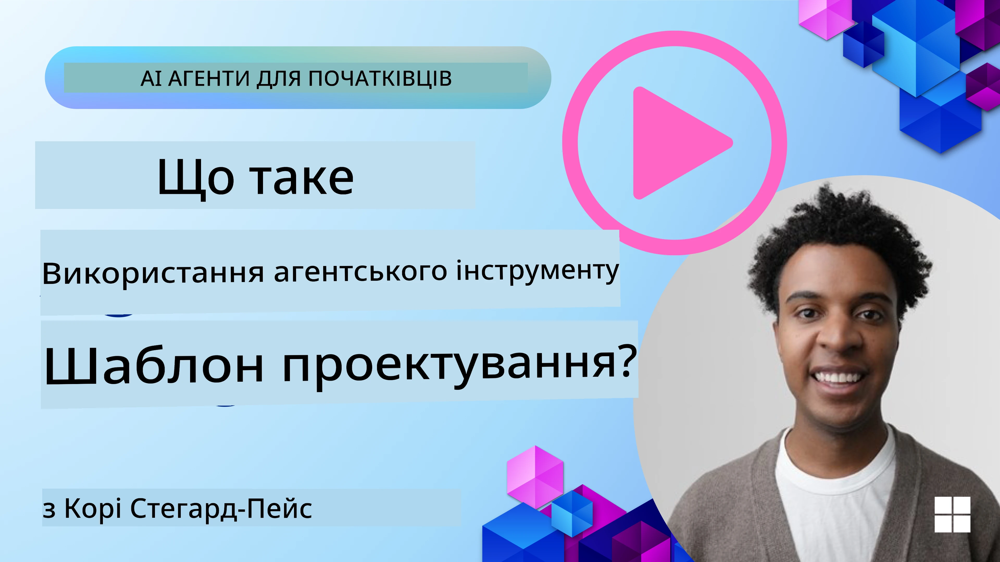
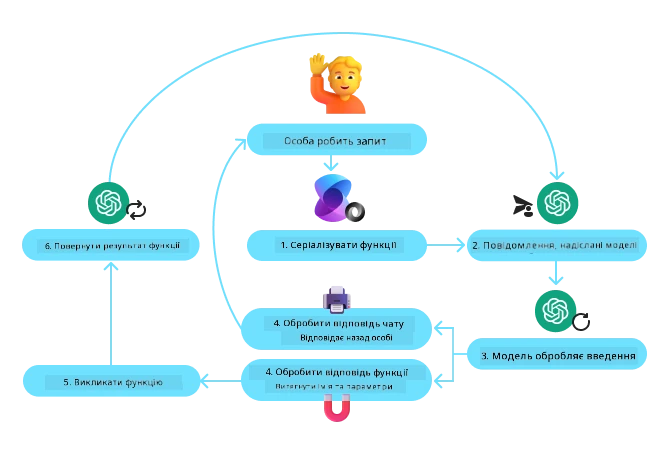
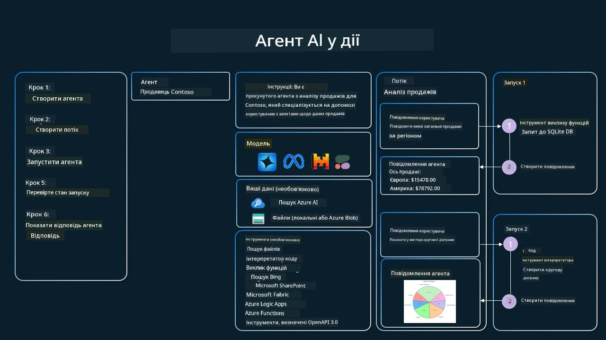

[](https://youtu.be/vieRiPRx-gI?si=cEZ8ApnT6Sus9rhn)

> _(Натисніть на зображення вище, щоб переглянути відео цього уроку)_

# Дизайн-патерн Використання Інструментів

Інструменти цікаві тим, що дозволяють AI агентам мати ширший спектр можливостей. Замість того, щоб агент мав обмежений набір дій, які він може виконати, додавання інструменту дозволяє агенту виконувати широкий спектр дій. У цьому розділі ми розглянемо дизайн-патерн Використання Інструментів, який описує, як AI агенти можуть використовувати конкретні інструменти для досягнення своїх цілей.

## Вступ

У цьому уроці ми шукаємо відповіді на такі запитання:

- Що таке дизайн-патерн використання інструментів?
- Для яких випадків його можна застосовувати?
- Які елементи/блоки потрібні для реалізації цього патерну?
- Які особливі міркування при використанні дизайн-патерну Використання Інструментів для створення надійних AI агентів?

## Цілі навчання

Після завершення цього уроку ви зможете:

- Визначити дизайн-патерн Використання Інструментів та його призначення.
- Визначати випадки використання, де застосовний цей дизайн-патерн.
- Розуміти ключові елементи для реалізації патерну.
- Визначати міркування для забезпечення надійності агентів з цим патерном.

## Що таке дизайн-патерн Використання Інструментів?

**Дизайн-патерн Використання Інструментів** зосереджується на тому, щоб надати LLM можливість взаємодіяти із зовнішніми інструментами для досягнення конкретних цілей. Інструменти — це код, який агент може виконати для виконання дій. Інструментом може бути проста функція, наприклад калькулятор, або виклик API до стороннього сервісу, наприклад отримання курсу акцій чи прогноз погоди. В контексті AI агентів інструменти призначені для виконання агентами у відповідь на **виклики функцій, згенеровані моделлю**.

## Для яких випадків його можна застосовувати?

AI агенти можуть використовувати інструменти для виконання складних завдань, отримання інформації або прийняття рішень. Патерн використання інструментів часто застосовується у сценаріях, де потрібна динамічна взаємодія із зовнішніми системами, такими як бази даних, веб-сервіси чи інтерпретатори коду. Ця можливість корисна для різноманітних випадків, зокрема:

- **Динамічне отримання інформації:** Агенти можуть звертатися до зовнішніх API чи баз даних для отримання актуальних даних (наприклад, запит до бази даних SQLite для аналізу даних, отримання курсу акцій чи інформації про погоду).
- **Виконання та інтерпретація коду:** Агенти можуть виконувати код чи скрипти для розв’язання математичних задач, створення звітів або проведення імітацій.
- **Автоматизація робочих процесів:** Автоматизація рутинних або багатокрокових процесів через інтеграцію інструментів, таких як планувальники завдань, сервіси електронної пошти або канали обробки даних.
- **Підтримка клієнтів:** Агенти можуть взаємодіяти з CRM-системами, платформами для обробки запитів або базами знань для вирішення запитів користувачів.
- **Генерація та редагування контенту:** Агенти можуть використовувати інструменти, такі як перевірка граматики, скорочення текстів чи оцінка безпеки контенту, для допомоги у створенні матеріалів.

## Які елементи/будівельні блоки потрібні для реалізації дизайн-патерну використання інструментів?

Ці будівельні блоки дозволяють AI агенту виконувати широкий спектр завдань. Розглянемо ключові елементи, необхідні для реалізації дизайн-патерну Використання Інструментів:

- **Схеми функцій/інструментів:** Детальні визначення доступних інструментів, включно з іменем функції, її призначенням, необхідними параметрами та очікуваними результатами. Ці схеми дають LLM розуміння, які інструменти доступні і як формувати коректні запити.

- **Логіка виконання функцій:** Визначає, як і коли викликати інструменти на основі намірів користувача та контексту діалогу. Це може включати модулі планування, маршрутизації або умовні потоки, які динамічно визначають використання інструментів.

- **Система обробки повідомлень:** Компоненти, що керують потоком розмови між введеннями користувача, відповідями LLM, викликами інструментів та їх виводами.

- **Фреймворк інтеграції інструментів:** Інфраструктура, що з’єднує агента з різними інструментами, будь то прості функції або складні зовнішні сервіси.

- **Обробка помилок і валідація:** Механізми для обробки збоїв виконання інструментів, перевірки параметрів і управління непередбачуваними відповідями.

- **Управління станом:** Відстежує контекст розмови, попередні взаємодії з інструментами та збережені дані для забезпечення послідовності в багатокрокових діалогах.

Далі розглянемо більш детально, як відбувається виклик функцій/інструментів.
 
### Виклик функцій/інструментів

Виклик функції — це основний спосіб, завдяки якому великі мовні моделі (LLM) можуть взаємодіяти з інструментами. Ви часто побачите, що слова 'Функція' і 'Інструмент' вживаються як синоніми, оскільки «функції» (блоки повторно використовуваного коду) є «інструментами», які агенти використовують для виконання завдань. Щоб код функції можна було викликати, LLM має співставити запит користувача з описом функції. Для цього LLM надсилається схема з описами всіх доступних функцій. Потім LLM вибирає найвідповіднішу функцію для завдання і повертає її ім’я та аргументи. Обрана функція виконується, її відповідь надсилається назад до LLM, який використовує цю інформацію для відповіді на запит користувача.

Розробникам для реалізації виклику функцій для агентів потрібні:

1. Модель LLM, яка підтримує виклик функцій
2. Схема з описами функцій
3. Код для кожної описаної функції

Для ілюстрації використаємо приклад отримання поточного часу у місті:

1. **Ініціалізуйте LLM, що підтримує виклики функцій:**

    Не всі моделі підтримують виклик функцій, тому важливо перевірити, чи підтримує це ваша модель. <a href="https://learn.microsoft.com/azure/ai-services/openai/how-to/function-calling" target="_blank">Azure OpenAI</a> підтримує виклик функцій. Ми можемо почати з ініціалізації клієнта OpenAI з API Azure OpenAI **Responses** (стабільна кінцева точка `/openai/v1/` — без необхідності указувати `api_version`). 

    ```python
    # Ініціалізуйте клієнт OpenAI для Azure OpenAI (API відповідей, кінцева точка v1)
    client = OpenAI(
        base_url=f"{os.environ['AZURE_OPENAI_ENDPOINT'].rstrip('/')}/openai/v1/",
        api_key=os.environ["AZURE_OPENAI_API_KEY"],
    )
    deployment_name = os.environ["AZURE_OPENAI_DEPLOYMENT"]
    ```

1. **Створіть схему функції**:

    Далі ми визначимо JSON-схему, яка містить ім’я функції, опис її призначення, імена та описи параметрів функції.
    Цю схему ми передамо раніше створеному клієнту разом із запитом користувача на визначення часу в Сан-Франциско. Важливо зрозуміти, що **виклик інструменту** — це те, що повертається, **а не** остаточна відповідь на питання. Як вже згадувалося, LLM повертає ім’я вибраної для завдання функції та аргументи, які будуть їй передані.

    ```python
    # Опис функції для читання моделі (плоский формат інструменту Responses API)
    tools = [
        {
            "type": "function",
            "name": "get_current_time",
            "description": "Get the current time in a given location",
            "parameters": {
                "type": "object",
                "properties": {
                    "location": {
                        "type": "string",
                        "description": "The city name, e.g. San Francisco",
                    },
                },
                "required": ["location"],
            },
        }
    ]
    ```
   
    ```python
  
    # Початкове повідомлення користувача
    messages = [{"role": "user", "content": "What's the current time in San Francisco"}]

    # Перший виклик API: Попросіть модель використовувати функцію
    response = client.responses.create(
        model=deployment_name,
        input=messages,
        tools=tools,
        tool_choice="auto",
        store=False,
    )

    # API відповідей повертає виклики інструментів як елементи function_call у response.output.
    # Додайте їх до розмови, щоб модель мала повний контекст у наступному кроці.
    messages += response.output

    print("Model's response:")
    print(response.output)
  
    ```

    ```bash
    Model's response:
    [ResponseFunctionToolCall(arguments='{"location":"San Francisco"}', call_id='call_pOsKdUlqvdyttYB67MOj434b', name='get_current_time', type='function_call')]
    ```
  
1. **Код функції, необхідний для виконання завдання:**

    Тепер, коли LLM вибрав функцію, яку потрібно виконати, потрібно реалізувати та виконати код, який виконає завдання.
    Ми можемо реалізувати код для отримання поточного часу на Python. Також потрібно написати код, щоб з витягнути ім’я та аргументи з response_message для отримання кінцевого результату.

    ```python
      def get_current_time(location):
        """Get the current time for a given location"""
        print(f"get_current_time called with location: {location}")  
        location_lower = location.lower()
        
        for key, timezone in TIMEZONE_DATA.items():
            if key in location_lower:
                print(f"Timezone found for {key}")  
                current_time = datetime.now(ZoneInfo(timezone)).strftime("%I:%M %p")
                return json.dumps({
                    "location": location,
                    "current_time": current_time
                })
      
        print(f"No timezone data found for {location_lower}")  
        return json.dumps({"location": location, "current_time": "unknown"})
    ```

     ```python
    # Обробка викликів функцій
    tool_calls = [item for item in response.output if item.type == "function_call"]
    if tool_calls:
        for tool_call in tool_calls:
            if tool_call.name == "get_current_time":

                function_args = json.loads(tool_call.arguments)

                time_response = get_current_time(
                    location=function_args.get("location")
                )

                # Повернути результат інструменту як елемент function_call_output
                messages.append({
                    "type": "function_call_output",
                    "call_id": tool_call.call_id,
                    "output": time_response,
                })
    else:
        print("No tool calls were made by the model.")

    # Другий виклик API: Отримати остаточну відповідь від моделі
    final_response = client.responses.create(
        model=deployment_name,
        input=messages,
        tools=tools,
        store=False,
    )

    return final_response.output_text
     ```

     ```bash
      get_current_time called with location: San Francisco
      Timezone found for san francisco
      The current time in San Francisco is 09:24 AM.
     ```

Виклик функцій лежить в основі більшості, якщо не усіх, конструкцій дизайну використання інструментів агента, однак реалізувати це з нуля іноді складно.
Як ми дізналися в [Уроці 2](../../../02-explore-agentic-frameworks), агентні фреймворки надають нам готові будівельні блоки для реалізації використання інструментів.
 
## Приклади використання інструментів з агентними фреймворками

Ось декілька прикладів, як можна реалізувати дизайн-патерн Використання Інструментів, застосовуючи різні агентні фреймворки:

### Агентний фреймворк Microsoft

<a href="https://learn.microsoft.com/azure/ai-services/agents/overview" target="_blank">Агентний фреймворк Microsoft</a> — це відкритий AI фреймворк для створення AI агентів. Він спрощує процес виклику функцій, дозволяючи визначати інструменти як Python-функції з декоратором `@tool`. Фреймворк керує двонаправленою комунікацією між моделлю та вашим кодом. Також він надає доступ до готових інструментів, наприклад Пошуком по файлах та Інтерпретатором коду через `FoundryChatClient`.

Наступна діаграма ілюструє процес виклику функцій із агентним фреймворком Microsoft:



В агентному фреймворку Microsoft інструменти визначаються як декоровані функції. Ми можемо перетворити функцію `get_current_time`, яку бачили раніше, на інструмент, використовуючи декоратор `@tool`. Фреймворк автоматично серіалізує функцію та її параметри, створюючи схему для надсилання LLM.

```python
import os
from agent_framework import tool
from agent_framework.foundry import FoundryChatClient
from azure.identity import AzureCliCredential

@tool(approval_mode="never_require")
def get_current_time(location: str) -> str:
    """Get the current time for a given location"""
    ...

# Створіть клієнта
provider = FoundryChatClient(
    project_endpoint=os.environ["AZURE_AI_PROJECT_ENDPOINT"],
    model=os.environ["AZURE_AI_MODEL_DEPLOYMENT_NAME"],
    credential=AzureCliCredential(),
)

# Створіть агента і запустіть з інструментом
agent = provider.as_agent(name="TimeAgent", instructions="Use available tools to answer questions.", tools=get_current_time)
response = await agent.run("What time is it?")
```
  
### Сервіс агентів Microsoft Foundry

<a href="https://learn.microsoft.com/azure/ai-services/agents/overview" target="_blank">Сервіс агентів Microsoft Foundry</a> — це новий агентний фреймворк, розроблений для того, щоб допомогти розробникам безпечно створювати, розгортати та масштабувати високоякісні, розширювані AI агенти без необхідності керувати базовими обчислювальними ресурсами та зберіганням. Особливо корисний для корпоративних застосувань, оскільки це повністю керований сервіс з корпоративним рівнем безпеки.

У порівнянні з розробкою безпосередньо за допомогою API LLM, Microsoft Foundry Agent Service має декілька переваг, зокрема:

- Автоматичний виклик інструментів – немає потреби парсити виклик, викликати інструмент і обробляти відповідь; все це тепер робиться на сервері
- Безпечно керовані дані – замість керування власним станом розмови можна покладатися на треди для зберігання всієї потрібної інформації
- Інструменти з коробки – інструменти для взаємодії з джерелами даних, такі як Bing, Azure AI Search та Azure Functions.

Інструменти, доступні в Microsoft Foundry Agent Service, можна поділити на дві категорії:

1. Інструменти знань:
    - <a href="https://learn.microsoft.com/azure/ai-services/agents/how-to/tools/bing-grounding?tabs=python&pivots=overview" target="_blank">Підтримка за Bing Search</a>
    - <a href="https://learn.microsoft.com/azure/ai-services/agents/how-to/tools/file-search?tabs=python&pivots=overview" target="_blank">Пошук файлів</a>
    - <a href="https://learn.microsoft.com/azure/ai-services/agents/how-to/tools/azure-ai-search?tabs=azurecli%2Cpython&pivots=overview-azure-ai-search" target="_blank">Пошук Azure AI</a>

2. Інструменти дій:
    - <a href="https://learn.microsoft.com/azure/ai-services/agents/how-to/tools/function-calling?tabs=python&pivots=overview" target="_blank">Виклик функцій</a>
    - <a href="https://learn.microsoft.com/azure/ai-services/agents/how-to/tools/code-interpreter?tabs=python&pivots=overview" target="_blank">Інтерпретатор коду</a>
    - <a href="https://learn.microsoft.com/azure/ai-services/agents/how-to/tools/openapi-spec?tabs=python&pivots=overview" target="_blank">Інструменти, визначені OpenAPI</a>
    - <a href="https://learn.microsoft.com/azure/ai-services/agents/how-to/tools/azure-functions?pivots=overview" target="_blank">Azure Functions</a>

Сервіс агента дозволяє використовувати ці інструменти разом як `toolset`. Він також використовує `threads`, які відслідковують історію повідомлень певної розмови.

Уявімо, що ви агент з продажу у компанії Contoso. Ви хочете розробити розмовного агента, який зможе відповісти на питання про ваші продажі.

Наступне зображення ілюструє, як можна застосувати Microsoft Foundry Agent Service для аналізу ваших даних продажів:



Щоб використовувати будь-який із цих інструментів із сервісом, ми можемо створити клієнта і визначити інструмент або набір інструментів. Для практичної реалізації використовуємо наступний код Python. LLM зможе переглянути набір інструментів і вирішити, чи варто використовувати функцію, створену користувачем, `fetch_sales_data_using_sqlite_query`, чи вбудований Інтерпретатор коду залежно від запиту користувача.

```python 
import os
from azure.ai.projects import AIProjectClient
from azure.identity import DefaultAzureCredential
from fetch_sales_data_functions import fetch_sales_data_using_sqlite_query # функція fetch_sales_data_using_sqlite_query, яка знаходиться у файлі fetch_sales_data_functions.py.
from azure.ai.projects.models import ToolSet, FunctionTool, CodeInterpreterTool

project_client = AIProjectClient.from_connection_string(
    credential=DefaultAzureCredential(),
    conn_str=os.environ["PROJECT_CONNECTION_STRING"],
)

# Ініціалізувати набір інструментів
toolset = ToolSet()

# Ініціалізувати агента виклику функції з функцією fetch_sales_data_using_sqlite_query та додати його до набору інструментів
fetch_data_function = FunctionTool(fetch_sales_data_using_sqlite_query)
toolset.add(fetch_data_function)

# Ініціалізувати інструмент Code Interpreter та додати його до набору інструментів.
code_interpreter = CodeInterpreterTool()toolset.add(code_interpreter)

agent = project_client.agents.create_agent(
    model="gpt-4o-mini", name="my-agent", instructions="You are helpful agent", 
    toolset=toolset
)
```

## Які особливі міркування при використанні дизайн-патерну Використання Інструментів для створення надійних AI агентів?

Загальна проблема з динамічно згенерованим SQL від LLM — це безпека, особливо ризик SQL-ін’єкцій або зловмисних дій, таких як видалення чи пошкодження бази даних. Хоча ці занепокоєння справедливі, вони можуть бути ефективно пом’якшені налаштуваннями дозволів доступу до бази даних. Для більшості баз даних це означає налаштування бази в режимі лише для читання. Для служб БД, таких як PostgreSQL або Azure SQL, додатку слід призначати роль лише для читання (SELECT).

Запуск додатку в безпечному середовищі додатково підвищує захист. У корпоративних сценаріях дані зазвичай витягуються та трансформуються з операційних систем у базу даних або сховище даних лише для читання з дружньою схемою. Такий підхід забезпечує безпеку даних, оптимізацію продуктивності та доступність, а також обмежений, лише для читання, доступ додатку.

## Приклади коду

- Python: [Agent Framework](./code_samples/04-python-agent-framework.ipynb)
- .NET: [Agent Framework](./code_samples/04-dotnet-agent-framework.md)

## Маєте більше запитань про дизайн-патерн Використання Інструментів?

Приєднуйтесь до [Microsoft Foundry Discord](https://discord.com/invite/ATgtXmAS5D), щоб зустрітися з іншими учнями, відвідати години консультацій і отримати відповіді на ваші питання з AI агентів.

## Додаткові ресурси

- <a href="https://microsoft.github.io/build-your-first-agent-with-azure-ai-agent-service-workshop/" target="_blank">Воркшоп Azure AI Agents Service</a>
- <a href="https://github.com/Azure-Samples/contoso-creative-writer/tree/main/docs/workshop" target="_blank">Воркшоп Contoso Creative Writer Multi-Agent</a>
- <a href="https://learn.microsoft.com/azure/ai-services/agents/overview" target="_blank">Огляд агентного фреймворку Microsoft</a>


## Попередній урок

[Розуміння агентських патернів дизайну](../03-agentic-design-patterns/README.md)

## Наступний урок

[Agentic RAG](../05-agentic-rag/README.md)

---

<!-- CO-OP TRANSLATOR DISCLAIMER START -->
**Відмова від відповідальності**:
Цей документ було перекладено за допомогою сервісу штучного інтелекту для перекладу [Co-op Translator](https://github.com/Azure/co-op-translator). Хоча ми прагнемо до точності, будь ласка, майте на увазі, що автоматичні переклади можуть містити помилки або неточності. Оригінальний документ рідною мовою слід вважати авторитетним джерелом. Для критично важливої інформації рекомендується професійний людський переклад. Ми не несемо відповідальності за будь-які непорозуміння або неправильні тлумачення, що виникли внаслідок використання цього перекладу.
<!-- CO-OP TRANSLATOR DISCLAIMER END -->