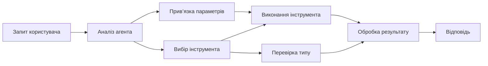

# 🛠️ Розширене використання інструментів з Azure OpenAI (Responses API) (.NET)

## 📋 Цілі навчання

Ця записна книжка демонструє шаблони інтеграції інструментів корпоративного рівня за допомогою Microsoft Agent Framework у .NET з Azure OpenAI (Responses API). Ви навчитеся створювати складні агенти з кількома спеціалізованими інструментами, використовуючи строгі типи C# та можливості корпоративного рівня .NET.

### Розширені можливості інструментів, якими ви опануєте

- 🔧 **Архітектура з кількома інструментами**: створення агентів з кількома спеціалізованими можливостями
- 🎯 **Безпечне виконання інструментів за типом**: використання перевірки під час компіляції C#
- 📊 **Корпоративні шаблони інструментів**: дизайн інструментів, готових до виробництва, та обробка помилок
- 🔗 **Композиція інструментів**: поєднання інструментів для складних бізнес-процесів

## 🎯 Переваги архітектури інструментів .NET

### Можливості інструментів корпоративного рівня

- **Перевірка під час компіляції**: строгі типи забезпечують правильність параметрів інструментів
- **Впровадження залежностей**: інтеграція контейнера IoC для керування інструментами
- **Патерни Async/Await**: неблокуюче виконання інструментів із належним керуванням ресурсами
- **Структуроване логування**: вбудована інтеграція журналювання для моніторингу виконання інструментів

### Шаблони, готові до виробництва

- **Обробка винятків**: комплексне управління помилками з типовими винятками
- **Управління ресурсами**: правильні патерни звільнення та керування пам’яттю
- **Моніторинг продуктивності**: вбудовані метрики та лічильники продуктивності
- **Управління конфігурацією**: конфігурація з перевіркою типів

## 🔧 Технічна архітектура

### Основні компоненти інструментів .NET

- **Microsoft.Extensions.AI**: уніфікований абстракційний шар інструментів
- **Microsoft.Agents.AI**: оркестрація інструментів корпоративного рівня
- **Azure OpenAI (Responses API)**: високопродуктивний клієнт API з пулом з’єднань

### Конвеєр виконання інструментів



## 🛠️ Категорії інструментів і шаблони

### 1. **Інструменти обробки даних**

- **Перевірка вхідних даних**: строгі типи з анотаціями даних
- **Операції трансформації**: типобезпечне перетворення та форматування даних
- **Бізнес-логіка**: інструменти доменно-специфічних розрахунків та аналізу
- **Форматування виводу**: структуроване генерування відповідей

### 2. **Інструменти інтеграції**

- **API-коннектори**: інтеграція RESTful сервісів з HttpClient
- **Бази даних**: інтеграція Entity Framework для доступу до даних
- **Файлові операції**: безпечні операції з файловою системою з перевіркою
- **Зовнішні служби**: шаблони інтеграції з сторонніми сервісами

### 3. **Утиліти**

- **Обробка тексту**: утиліти для маніпуляції рядками та форматування
- **Операції з датами/часом**: розрахунки дати/часу з урахуванням культури
- **Математичні інструменти**: точні розрахунки та статистичні операції
- **Інструменти перевірки**: валідація бізнес-правил та перевірка даних

Готові створювати агентів корпоративного рівня з потужними, типобезпечними можливостями інструментів у .NET? Давайте проархітектуємо професійні рішення! 🏢⚡

## 🚀 Початок роботи

### Необхідні умови

- [.NET 10 SDK](https://dotnet.microsoft.com/download/dotnet/10.0) або новіша версія
- Обліковий запис [Azure subscription](https://azure.microsoft.com/free/) з ресурсом Azure OpenAI та розгортанням моделі
- [Azure CLI](https://learn.microsoft.com/cli/azure/install-azure-cli) — ввійдіть за допомогою `az login`

### Необхідні змінні середовища

```bash
# zsh/bash
export AZURE_OPENAI_ENDPOINT=https://<your-resource>.openai.azure.com
export AZURE_OPENAI_DEPLOYMENT=gpt-4o-mini
# Потім увійдіть, щоб AzureCliCredential міг отримати токен
az login
```

```powershell
# PowerShell
$env:AZURE_OPENAI_ENDPOINT = "https://<your-resource>.openai.azure.com"
$env:AZURE_OPENAI_DEPLOYMENT = "gpt-4o-mini"
# Потім увійдіть у систему, щоб AzureCliCredential міг отримати токен
az login
```

### Приклад коду

Щоб запустити приклад коду,

```bash
# zsh/bash
chmod +x ./04-dotnet-agent-framework.cs
./04-dotnet-agent-framework.cs
```

Або використовуючи dotnet CLI:

```bash
dotnet run ./04-dotnet-agent-framework.cs
```

Дивіться [`04-dotnet-agent-framework.cs`](../../../../04-tool-use/code_samples/04-dotnet-agent-framework.cs) для повного коду.

```csharp
#!/usr/bin/dotnet run

#:package Microsoft.Extensions.AI@10.*
#:package Microsoft.Agents.AI.OpenAI@1.*-*
#:package Azure.AI.OpenAI@2.1.0
#:package Azure.Identity@1.13.1

using System.ComponentModel;

using Microsoft.Agents.AI;
using Microsoft.Extensions.AI;

using Azure.AI.OpenAI;
using Azure.Identity;

// Tool Function: Random Destination Generator
// This static method will be available to the agent as a callable tool
// The [Description] attribute helps the AI understand when to use this function
// This demonstrates how to create custom tools for AI agents
[Description("Provides a random vacation destination.")]
static string GetRandomDestination()
{
    // List of popular vacation destinations around the world
    // The agent will randomly select from these options
    var destinations = new List<string>
    {
        "Paris, France",
        "Tokyo, Japan",
        "New York City, USA",
        "Sydney, Australia",
        "Rome, Italy",
        "Barcelona, Spain",
        "Cape Town, South Africa",
        "Rio de Janeiro, Brazil",
        "Bangkok, Thailand",
        "Vancouver, Canada"
    };

    // Generate random index and return selected destination
    // Uses System.Random for simple random selection
    var random = new Random();
    int index = random.Next(destinations.Count);
    return destinations[index];
}

// Azure OpenAI with the Responses API (stable v1 endpoint). Sign in with `az login`.
var azureEndpoint = Environment.GetEnvironmentVariable("AZURE_OPENAI_ENDPOINT")
    ?? throw new InvalidOperationException("AZURE_OPENAI_ENDPOINT is not set.");
var deployment = Environment.GetEnvironmentVariable("AZURE_OPENAI_DEPLOYMENT") ?? "gpt-4o-mini";

var azureClient = new AzureOpenAIClient(new Uri(azureEndpoint), new AzureCliCredential());

// Define Agent Identity and Comprehensive Instructions
// Agent name for identification and logging purposes
var AGENT_NAME = "TravelAgent";

// Detailed instructions that define the agent's personality, capabilities, and behavior
// This system prompt shapes how the agent responds and interacts with users
var AGENT_INSTRUCTIONS = """
You are a helpful AI Agent that can help plan vacations for customers.

Important: When users specify a destination, always plan for that location. Only suggest random destinations when the user hasn't specified a preference.

When the conversation begins, introduce yourself with this message:
"Hello! I'm your TravelAgent assistant. I can help plan vacations and suggest interesting destinations for you. Here are some things you can ask me:
1. Plan a day trip to a specific location
2. Suggest a random vacation destination
3. Find destinations with specific features (beaches, mountains, historical sites, etc.)
4. Plan an alternative trip if you don't like my first suggestion

What kind of trip would you like me to help you plan today?"

Always prioritize user preferences. If they mention a specific destination like "Bali" or "Paris," focus your planning on that location rather than suggesting alternatives.
""";

// Create AI Agent with Advanced Travel Planning Capabilities
// Get the Responses client for the deployment and create the AI agent
// Configure agent with name, detailed instructions, and available tools
// This demonstrates the .NET agent creation pattern with full configuration
AIAgent agent = azureClient
    .GetOpenAIResponseClient(deployment)
    .CreateAIAgent(
        name: AGENT_NAME,
        instructions: AGENT_INSTRUCTIONS,
        tools: [AIFunctionFactory.Create(GetRandomDestination)]
    );

// Create New Conversation Thread for Context Management
// Initialize a new conversation thread to maintain context across multiple interactions
// Threads enable the agent to remember previous exchanges and maintain conversational state
// This is essential for multi-turn conversations and contextual understanding
AgentThread thread = agent.GetNewThread();

// Execute Agent: First Travel Planning Request
// Run the agent with an initial request that will likely trigger the random destination tool
// The agent will analyze the request, use the GetRandomDestination tool, and create an itinerary
// Using the thread parameter maintains conversation context for subsequent interactions
await foreach (var update in agent.RunStreamingAsync("Plan me a day trip", thread))
{
    await Task.Delay(10);
    Console.Write(update);
}

Console.WriteLine();

// Execute Agent: Follow-up Request with Context Awareness
// Demonstrate contextual conversation by referencing the previous response
// The agent remembers the previous destination suggestion and will provide an alternative
// This showcases the power of conversation threads and contextual understanding in .NET agents
await foreach (var update in agent.RunStreamingAsync("I don't like that destination. Plan me another vacation.", thread))
{
    await Task.Delay(10);
    Console.Write(update);
}
```

---

<!-- CO-OP TRANSLATOR DISCLAIMER START -->
**Відмова від відповідальності**:
Цей документ було перекладено за допомогою сервісу штучного інтелекту для перекладу [Co-op Translator](https://github.com/Azure/co-op-translator). Хоча ми прагнемо до точності, будь ласка, майте на увазі, що автоматичні переклади можуть містити помилки або неточності. Оригінальний документ рідною мовою слід вважати авторитетним джерелом. Для критично важливої інформації рекомендується професійний людський переклад. Ми не несемо відповідальності за будь-які непорозуміння або неправильні тлумачення, що виникли внаслідок використання цього перекладу.
<!-- CO-OP TRANSLATOR DISCLAIMER END -->