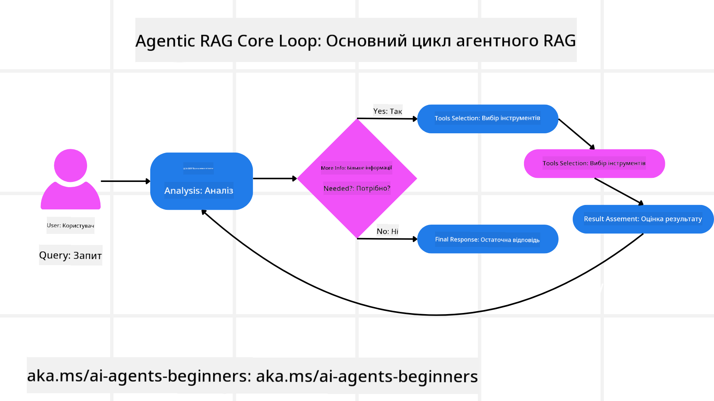
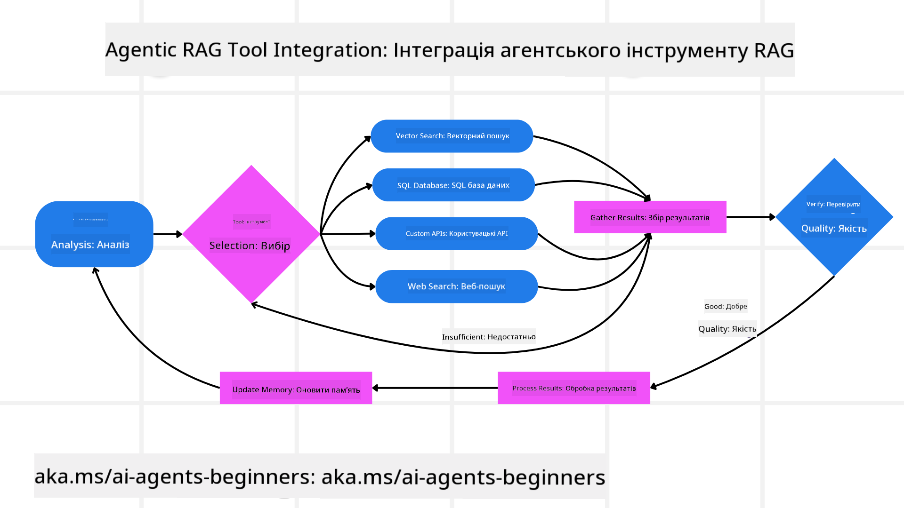
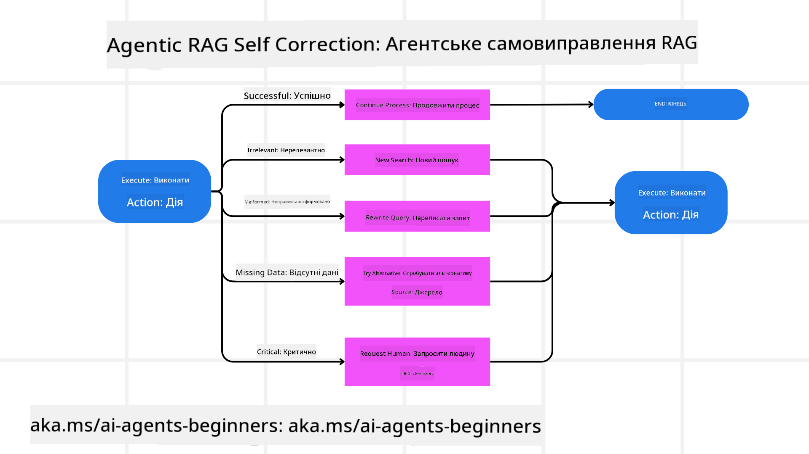

<!--
CO_OP_TRANSLATOR_METADATA:
{
  "original_hash": "d2f04b783b9e1253100329afd698f8ff",
  "translation_date": "2025-08-30T09:51:28+00:00",
  "source_file": "05-agentic-rag/README.md",
  "language_code": "uk"
}
-->

> _(Натисніть на зображення вище, щоб переглянути відео цього уроку)_

# Agentic RAG

Цей урок надає всебічний огляд Agentic Retrieval-Augmented Generation (Agentic RAG) — нової парадигми штучного інтелекту, де великі мовні моделі (LLMs) автономно планують свої наступні кроки, отримуючи інформацію з зовнішніх джерел. На відміну від статичних шаблонів "отримати-і-прочитати", Agentic RAG включає ітеративні виклики до LLM, чергуючи їх із викликами інструментів або функцій та структурованими результатами. Система оцінює результати, уточнює запити, викликає додаткові інструменти за потреби та продовжує цей цикл, доки не буде досягнуто задовільного рішення.

## Вступ

Цей урок охоплює:

- **Розуміння Agentic RAG:** Дізнайтеся про нову парадигму в штучному інтелекті, де великі мовні моделі (LLMs) автономно планують свої наступні кроки, отримуючи інформацію з зовнішніх джерел даних.
- **Опанування ітеративного підходу Maker-Checker:** Зрозумійте цикл ітеративних викликів до LLM, чергуючи їх із викликами інструментів або функцій та структурованими результатами, спрямованими на підвищення точності та обробку некоректних запитів.
- **Дослідження практичних застосувань:** Визначте сценарії, де Agentic RAG є найбільш ефективним, наприклад, у середовищах, орієнтованих на точність, складних взаємодіях з базами даних та розширених робочих процесах.

## Цілі навчання

Після завершення цього уроку ви знатимете/зрозумієте:

- **Розуміння Agentic RAG:** Дізнайтеся про нову парадигму в штучному інтелекті, де великі мовні моделі (LLMs) автономно планують свої наступні кроки, отримуючи інформацію з зовнішніх джерел даних.
- **Ітеративний підхід Maker-Checker:** Зрозумійте концепцію циклу ітеративних викликів до LLM, чергуючи їх із викликами інструментів або функцій та структурованими результатами, спрямованими на підвищення точності та обробку некоректних запитів.
- **Володіння процесом міркування:** Зрозумійте здатність системи самостійно приймати рішення щодо підходу до вирішення проблем без залежності від заздалегідь визначених шляхів.
- **Робочий процес:** Дізнайтеся, як агентна модель самостійно вирішує отримувати звіти про ринкові тенденції, ідентифікувати дані конкурентів, корелювати внутрішні метрики продажів, синтезувати висновки та оцінювати стратегію.
- **Ітеративні цикли, інтеграція інструментів та пам’ять:** Дізнайтеся про залежність системи від циклічної взаємодії, підтримуючи стан і пам’ять між кроками, щоб уникнути повторюваних циклів і приймати обґрунтовані рішення.
- **Обробка помилок і самокорекція:** Досліджуйте надійні механізми самокорекції системи, включаючи ітерацію та повторний запит, використання діагностичних інструментів і звернення до людського нагляду.
- **Межі автономії:** Зрозумійте обмеження Agentic RAG, зосереджуючись на автономії в межах певної галузі, залежності від інфраструктури та дотриманні обмежень.
- **Практичні випадки використання та цінність:** Визначте сценарії, де Agentic RAG є найбільш ефективним, наприклад, у середовищах, орієнтованих на точність, складних взаємодіях з базами даних та розширених робочих процесах.
- **Управління, прозорість і довіра:** Дізнайтеся про важливість управління та прозорості, включаючи пояснюваність міркувань, контроль упередженості та людський нагляд.

## Що таке Agentic RAG?

Agentic Retrieval-Augmented Generation (Agentic RAG) — це нова парадигма штучного інтелекту, де великі мовні моделі (LLMs) автономно планують свої наступні кроки, отримуючи інформацію з зовнішніх джерел. На відміну від статичних шаблонів "отримати-і-прочитати", Agentic RAG включає ітеративні виклики до LLM, чергуючи їх із викликами інструментів або функцій та структурованими результатами. Система оцінює результати, уточнює запити, викликає додаткові інструменти за потреби та продовжує цей цикл, доки не буде досягнуто задовільного рішення.

Система активно володіє своїм процесом міркування, переписуючи невдалі запити, обираючи різні методи отримання даних і інтегруючи кілька інструментів — таких як векторний пошук в Azure AI Search, SQL-бази даних або користувацькі API — перед тим, як фіналізувати свою відповідь. Відмінною рисою агентної системи є її здатність володіти своїм процесом міркування. Традиційні реалізації RAG покладаються на заздалегідь визначені шляхи, але агентна система автономно визначає послідовність кроків на основі якості знайденої інформації.

## Визначення Agentic Retrieval-Augmented Generation (Agentic RAG)

Agentic Retrieval-Augmented Generation (Agentic RAG) — це нова парадигма в розробці штучного інтелекту, де LLM не лише отримують інформацію з зовнішніх джерел даних, але й автономно планують свої наступні кроки. На відміну від статичних шаблонів "отримати-і-прочитати" або ретельно прописаних послідовностей підказок, Agentic RAG включає цикл ітеративних викликів до LLM, чергуючи їх із викликами інструментів або функцій та структурованими результатами. На кожному етапі система оцінює отримані результати, вирішує, чи потрібно уточнити запити, викликає додаткові інструменти за потреби та продовжує цей цикл, доки не досягне задовільного рішення.

Цей ітеративний підхід "maker-checker" спрямований на підвищення точності, обробку некоректних запитів до структурованих баз даних (наприклад, NL2SQL) та забезпечення збалансованих, високоякісних результатів. Замість того, щоб покладатися виключно на ретельно спроектовані ланцюжки підказок, система активно володіє своїм процесом міркування. Вона може переписувати невдалі запити, обирати різні методи отримання даних і інтегрувати кілька інструментів — таких як векторний пошук в Azure AI Search, SQL-бази даних або користувацькі API — перед тим, як фіналізувати свою відповідь. Це усуває потребу в надмірно складних оркестраційних фреймворках. Натомість відносно простий цикл "виклик LLM → використання інструменту → виклик LLM → …" може забезпечити складні та обґрунтовані результати.

## Володіння процесом міркування

Відмінною рисою, яка робить систему "агентною", є її здатність володіти своїм процесом міркування. Традиційні реалізації RAG часто залежать від того, що люди заздалегідь визначають шлях для моделі: ланцюжок міркувань, який вказує, що отримувати і коли.  
Але коли система є справді агентною, вона внутрішньо вирішує, як підходити до проблеми. Вона не просто виконує сценарій; вона автономно визначає послідовність кроків на основі якості знайденої інформації.  
Наприклад, якщо її просять створити стратегію запуску продукту, вона не покладається виключно на підказку, яка детально описує весь процес дослідження та прийняття рішень. Натомість агентна модель самостійно вирішує:

1. Отримати звіти про поточні ринкові тенденції за допомогою Bing Web Grounding.
2. Ідентифікувати відповідні дані конкурентів за допомогою Azure AI Search.
3. Корелювати історичні внутрішні метрики продажів за допомогою Azure SQL Database.
4. Синтезувати висновки в узгоджену стратегію, оркестровану через Azure OpenAI Service.
5. Оцінити стратегію на наявність прогалин або невідповідностей, ініціюючи ще один раунд отримання даних за потреби.  

Усі ці кроки — уточнення запитів, вибір джерел, ітерація до "задоволення" відповіддю — вирішуються моделлю, а не заздалегідь прописуються людиною.

## Ітеративні цикли, інтеграція інструментів та пам’ять

Агентна система покладається на циклічний шаблон взаємодії:

- **Початковий виклик:** Мета користувача (тобто підказка користувача) подається до LLM.
- **Виклик інструменту:** Якщо модель виявляє відсутню інформацію або неоднозначні інструкції, вона обирає інструмент або метод отримання даних — наприклад, запит до векторної бази даних (наприклад, Azure AI Search Hybrid search по приватних даних) або структурований SQL-запит — для отримання більшого контексту.
- **Оцінка та уточнення:** Після перегляду отриманих даних модель вирішує, чи достатньо інформації. Якщо ні, вона уточнює запит, пробує інший інструмент або коригує свій підхід.
- **Повторення до задоволення:** Цей цикл триває, доки модель не вирішить, що має достатньо ясності та доказів для надання остаточної, добре обґрунтованої відповіді.
- **Пам’ять і стан:** Оскільки система підтримує стан і пам’ять між кроками, вона може згадувати попередні спроби та їх результати, уникаючи повторюваних циклів і приймаючи більш обґрунтовані рішення в процесі.

З часом це створює відчуття еволюційного розуміння, дозволяючи моделі виконувати складні, багатокрокові завдання без необхідності постійного втручання людини або переформулювання підказки.

## Обробка помилок і самокорекція

Автономність Agentic RAG також включає надійні механізми самокорекції. Коли система стикається з тупиковими ситуаціями — наприклад, отриманням нерелевантних документів або некоректними запитами — вона може:

- **Ітерувати та повторно запитувати:** Замість того, щоб повертати малозначущі відповіді, модель пробує нові стратегії пошуку, переписує запити до баз даних або звертається до альтернативних наборів даних.
- **Використовувати діагностичні інструменти:** Система може викликати додаткові функції, призначені для допомоги в налагодженні її кроків міркування або підтвердження правильності отриманих даних. Інструменти, такі як Azure AI Tracing, будуть важливими для забезпечення надійної спостережуваності та моніторингу.
- **Звертатися до людського нагляду:** У сценаріях з високими ризиками або при повторних невдачах модель може позначати невизначеність і запитувати керівництво людини. Після того, як людина надає коригуючий зворотний зв’язок, модель може врахувати цей урок у майбутньому.

Цей ітеративний і динамічний підхід дозволяє моделі постійно вдосконалюватися, забезпечуючи, що вона не є одноразовою системою, а такою, що вчиться на своїх помилках під час даної сесії.

## Межі автономії

Незважаючи на автономність у межах завдання, Agentic RAG не є аналогом штучного загального інтелекту. Її "агентні" можливості обмежуються інструментами, джерелами даних і політиками, наданими розробниками. Вона не може створювати власні інструменти або виходити за межі встановлених доменів. Натомість вона відзначається динамічною оркестрацією доступних ресурсів.  
Ключові відмінності від більш розвинених форм ШІ включають:

1. **Автономія в межах домену:** Системи Agentic RAG зосереджені на досягненні цілей, визначених користувачем, у відомій галузі, використовуючи такі стратегії, як переписування запитів або вибір інструментів для покращення результатів.
2. **Залежність від інфраструктури:** Можливості системи залежать від інструментів і даних, інтегрованих розробниками. Вона не може перевищити ці межі без втручання людини.
3. **Дотримання обмежень:** Етичні принципи, правила відповідності та бізнес-політики залишаються дуже важливими. Свобода агента завжди обмежується заходами безпеки та механізмами нагляду (сподіваємось?).

## Практичні випадки використання та цінність

Agentic RAG відзначається у сценаріях, що вимагають ітеративного уточнення та точності:

1. **Середовища, орієнтовані на точність:** У перевірках відповідності, регуляторному аналізі або юридичних дослідженнях агентна модель може повторно перевіряти факти, консультуватися з кількома джерелами та переписувати запити, доки не надасть ретельно перевірену відповідь.
2. **Складні взаємодії з базами даних:** Працюючи зі структурованими даними, де запити часто можуть зазнавати невдач або потребувати коригування, система може автономно уточнювати свої запити, використовуючи Azure SQL або Microsoft Fabric OneLake, забезпечуючи, що кінцевий результат відповідає намірам користувача.
3. **Розширені робочі процеси:** Довготривалі сесії можуть еволюціонувати, коли з’являється нова інформація. Agentic RAG може постійно інтегрувати нові дані, змінюючи стратегії, коли вона дізнається більше про простір проблеми.

## Управління, прозорість і довіра

Оскільки ці системи стають більш автономними у своїх міркуваннях, управління та прозорість є вирішальними:

- **Пояснюваність міркувань:** Модель може надати журнал дій, які вона виконала, джерел, які вона консультувала, та кроків міркувань, які вона зробила для досягнення свого висновку. Інструменти, такі як Azure AI Content Safety та Azure AI Tracing / GenAIOps, можуть допомогти підтримувати прозорість і зменшувати ризики.
- **Контроль упередженості та збалансоване отримання:** Розробники можуть налаштовувати стратегії отримання, щоб забезпечити врахування збалансованих, репрезентативних джерел даних, і регулярно перевіряти результати, щоб виявляти упередження або викривлені шаблони, використовуючи користувацькі моделі для передових організацій з аналізу даних за допомогою Azure Machine Learning.
- **Людський нагляд
<a href="https://learn.microsoft.com/training/modules/use-own-data-azure-openai" target="_blank">
Реалізація Retrieval Augmented Generation (RAG) з Azure OpenAI Service: Дізнайтеся, як використовувати власні дані з Azure OpenAI Service. Цей модуль Microsoft Learn надає детальний посібник з реалізації RAG  
- <a href="https://learn.microsoft.com/azure/ai-studio/concepts/evaluation-approach-gen-ai" target="_blank">Оцінка застосунків генеративного штучного інтелекту з Azure AI Foundry: У цій статті розглядається оцінка та порівняння моделей на загальнодоступних наборах даних, включаючи застосунки Agentic AI та архітектури RAG</a>  
- <a href="https://weaviate.io/blog/what-is-agentic-rag" target="_blank">Що таке Agentic RAG | Weaviate</a>  
- <a href="https://ragaboutit.com/agentic-rag-a-complete-guide-to-agent-based-retrieval-augmented-generation/" target="_blank">Agentic RAG: Повний посібник з агентно-орієнтованого Retrieval Augmented Generation – Новини про покоління RAG</a>  
- <a href="https://huggingface.co/learn/cookbook/agent_rag" target="_blank">Agentic RAG: прискорте ваш RAG за допомогою реформулювання запитів та самостійного запиту! Hugging Face Open-Source AI Cookbook</a>  
- <a href="https://youtu.be/aQ4yQXeB1Ss?si=2HUqBzHoeB5tR04U" target="_blank">Додавання агентних шарів до RAG</a>  
- <a href="https://www.youtube.com/watch?v=zeAyuLc_f3Q&t=244s" target="_blank">Майбутнє асистентів знань: Джеррі Лю</a>  
- <a href="https://www.youtube.com/watch?v=AOSjiXP1jmQ" target="_blank">Як створити системи Agentic RAG</a>  
- <a href="https://ignite.microsoft.com/sessions/BRK102?source=sessions" target="_blank">Використання Azure AI Foundry Agent Service для масштабування ваших AI-агентів</a>  

### Академічні статті  

- <a href="https://arxiv.org/abs/2303.17651" target="_blank">2303.17651 Self-Refine: Ітеративне вдосконалення з самостійним зворотним зв’язком</a>  
- <a href="https://arxiv.org/abs/2303.11366" target="_blank">2303.11366 Reflexion: Мовні агенти з вербальним навчанням підкріплення</a>  
- <a href="https://arxiv.org/abs/2305.11738" target="_blank">2305.11738 CRITIC: Великі мовні моделі можуть самостійно виправлятися за допомогою інструментального критичного аналізу</a>  
- <a href="https://arxiv.org/abs/2501.09136" target="_blank">2501.09136 Agentic Retrieval-Augmented Generation: Огляд Agentic RAG</a>  

## Попередній урок  

[Шаблон дизайну використання інструментів](../04-tool-use/README.md)  

## Наступний урок  

[Створення надійних AI-агентів](../06-building-trustworthy-agents/README.md)  

---

**Відмова від відповідальності**:  
Цей документ був перекладений за допомогою сервісу автоматичного перекладу [Co-op Translator](https://github.com/Azure/co-op-translator). Хоча ми прагнемо до точності, будь ласка, майте на увазі, що автоматичні переклади можуть містити помилки або неточності. Оригінальний документ на його рідній мові слід вважати авторитетним джерелом. Для критичної інформації рекомендується професійний людський переклад. Ми не несемо відповідальності за будь-які непорозуміння або неправильні тлумачення, що виникають внаслідок використання цього перекладу.