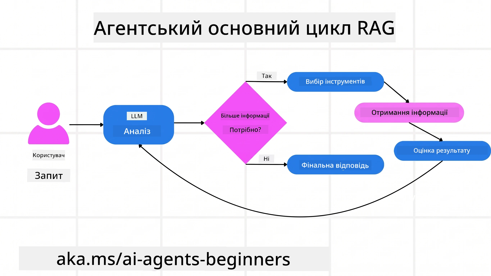
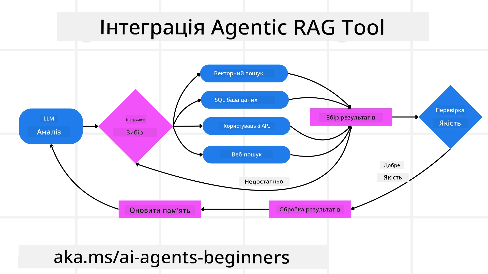
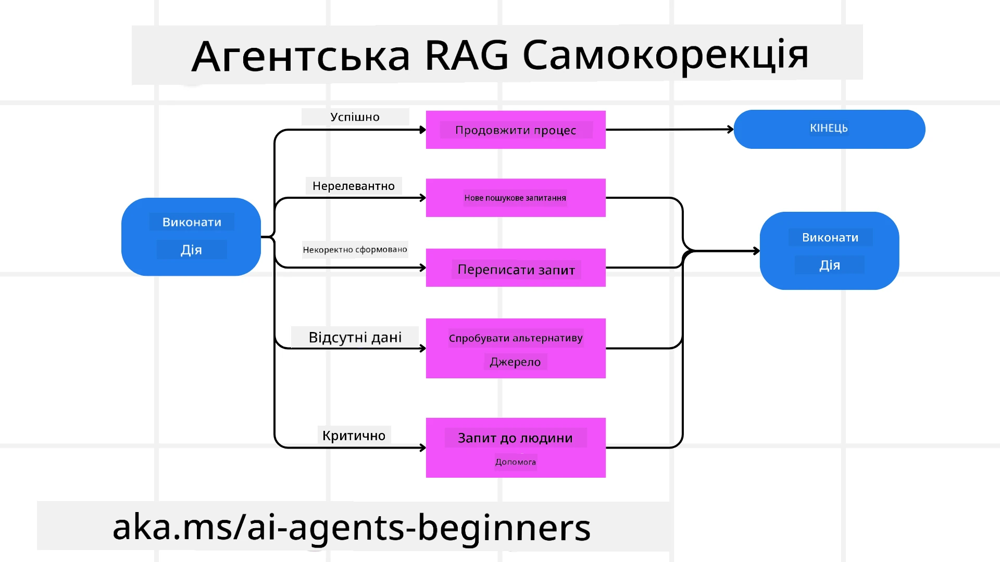
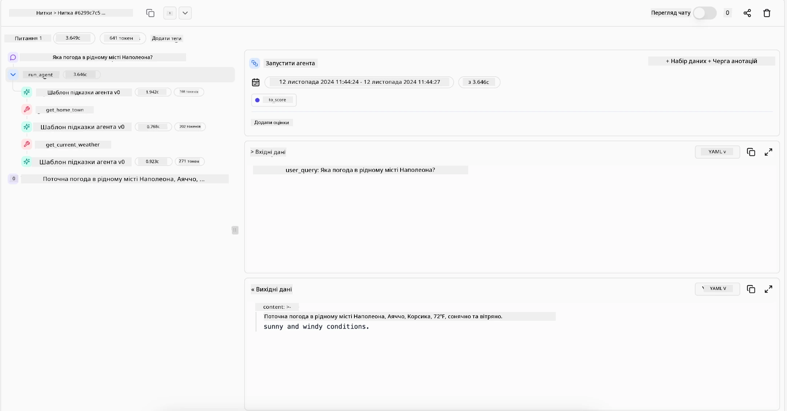

> _(Натисніть на зображення вище, щоб переглянути відео цього уроку)_

# Agentic RAG

Цей урок надає всебічний огляд Agentic Retrieval-Augmented Generation (Agentic RAG) — нової парадигми ШІ, в якій великі мовні моделі (LLM) самостійно планують свої наступні кроки, одночасно витягуючи інформацію з зовнішніх джерел. На відміну від статичних патернів «пошук-потім читання», Agentic RAG передбачає ітеративні виклики до LLM, які чергуються з викликами інструментів чи функцій і структурованими виходами. Система оцінює результати, уточнює запити, за потреби виконує додаткові виклики інструментів і продовжує цей цикл, доки не буде досягнуто задовільного рішення.

## Вступ

У цьому уроці ви дізнаєтесь

- **Розуміння Agentic RAG:** Дізнайтесь про нову парадигму в ШІ, де великі мовні моделі (LLM) автономно планують свої наступні кроки, використовуючи інформацію з зовнішніх джерел даних.
- **Освоєння ітеративного стилю Maker-Checker:** Зрозумійте цикл ітеративних викликів до LLM, що чергуються з викликами інструментів чи функцій та структурованими виходами, спрямованих на підвищення коректності та обробку некоректних запитів.
- **Вивчення практичних застосувань:** Визначте сценарії, де Agentic RAG найбільш ефективний, такі як середовища з пріоритетом на коректність, складна взаємодія з базами даних та довгі робочі процеси.

## Навчальні цілі

Після завершення цього уроку ви будете знати/розуміти:

- **Розуміння Agentic RAG:** Дізнатись про новітню парадигму в ШІ, де великі мовні моделі (LLM) автономно планують наступні кроки, використовуючи інформацію зі зовнішніх джерел даних.
- **Ітеративний стиль Maker-Checker:** Усвідомити концепцію циклу ітеративних викликів до LLM, що перемежовуються з викликами інструментів або функцій і структурованими відповідями, спрямовану на підвищення коректності та обробку некоректних запитів.
- **Володіння процесом міркувань:** Зрозуміти здатність системи володіти власним процесом міркувань, приймати рішення щодо підходу до задач без опори на заздалегідь визначені шляхи.
- **Робочий процес:** Зрозуміти, як агентна модель самостійно приймає рішення про отримання звітів про ринкові тенденції, визначення даних конкурентів, кореляцію внутрішніх показників продажів, синтез висновків та оцінку стратегії.
- **Ітеративні цикли, інтеграція інструментів і пам’ять:** Дізнатися про покладення системи на патерн взаємодії в циклі, збереження стану та пам’яті між кроками, щоб уникнути повторних циклів і приймати поінформовані рішення.
- **Обробка помилок і самокорекція:** Ознайомитись з надійними механізмами самокорекції системи, включаючи ітерацію та повторний запит, використання допоміжних інструментів і залучення людського контролю.
- **Межі агентності:** Зрозуміти обмеження Agentic RAG, зосереджені на доменно-специфічній автономії, залежності від інфраструктури та дотриманні правил.
- **Практичні випадки використання та цінність:** Визначити сценарії, де Agentic RAG найкраще працює, такі як середовища з пріоритетом на коректність, складні бази даних та тривалі робочі процеси.
- **Управління, прозорість та довіра:** Дізнатись про важливість управління та прозорості, включаючи пояснюване міркування, контроль упереджень і людський контроль.

## Що таке Agentic RAG?

Agentic Retrieval-Augmented Generation (Agentic RAG) — це нова парадигма ШІ, де великі мовні моделі (LLM) автономно планують свої наступні кроки, витягуючи інформацію з зовнішніх джерел. На відміну від статичних схем «спочатку пошук – потім читання», Agentic RAG передбачає ітеративні виклики до LLM, що чергуються з викликами інструментів чи функцій і структурованими відповідями. Система оцінює результати, уточнює запити, за потреби викликає додаткові інструменти і продовжує цикл, поки не знайде задовільне рішення. Цей ітеративний стиль роботи «maker-checker» покращує коректність, обробляє некоректні запити та забезпечує високоякісні результати.

Система активно володіє своїм процесом міркувань, переписуючи невдалі запити, обираючи різні методи пошуку і інтегруючи кілька інструментів — таких як векторний пошук у Azure AI Search, SQL-бази даних або кастомні API — перш ніж остаточно сформувати відповідь. Відмінною рисою агентної системи є здатність володіти власним процесом міркувань. Традиційні реалізації RAG покладаються на передвизначені шляхи, а агентна система автономно визначає послідовність кроків залежно від якості знайденої інформації.

## Визначення Agentic Retrieval-Augmented Generation (Agentic RAG)

Agentic Retrieval-Augmented Generation (Agentic RAG) — це нова парадигма в розвитку ШІ, де LLM не лише отримують інформацію з зовнішніх джерел даних, а й автономно планують свої наступні кроки. На відміну від статичних схем пошуку з подальшим читанням або ретельно прописаних послідовностей підказок, Agentic RAG передбачає цикл ітеративних викликів до LLM, що перемежовуються з викликами інструментів або функцій та структурованими виходами. На кожному етапі система оцінює отримані результати, вирішує, чи треба уточнити запити, за потреби викликає додаткові інструменти і продовжує цикл, доки не знайде задовільне рішення.

Цей ітеративний стиль операції «maker-checker» спроектовано для підвищення коректності, обробки некоректних запитів до структурованих баз даних (наприклад, NL2SQL) та забезпечення збалансованих, високоякісних результатів. Замість того, щоб повністю покладатись на ретельно спроектовані ланцюжки підказок, система активно володіє власним процесом міркувань. Вона може переписувати невдалі запити, обирати інші методи пошуку та інтегрувати кілька інструментів — таких як векторний пошук у Azure AI Search, SQL-бази даних або спеціальні API — перед остаточним формуванням відповіді. Це усуває необхідність у надмірно складних оркестраційних фреймворках. Замість цього досить відносно простого циклу «виклик LLM → використання інструменту → виклик LLM → …», щоб отримати складні та обґрунтовані результати.

## Володіння процесом міркувань

Відмінною рисою, що робить систему «агентною», є її здатність володіти власним процесом міркувань. Традиційні реалізації RAG часто залежать від того, що люди заздалегідь визначають для моделі шлях: ланцюжок думок, який окреслює, що і коли потрібно отримати.
Але коли система справді агентна, вона внутрішньо вирішує, як підходити до проблеми. Вона не просто виконує скрипт; вона автономно визначає послідовність кроків залежно від якості знайденої інформації.
Наприклад, якщо їй потрібно створити стратегію запуску продукту, вона не лише покладається на підказку, яка повністю описує дослідження та прийняття рішень. Натомість агентна модель самостійно вирішує:

1. Отримати звіти про актуальні ринкові тенденції за допомогою Bing Web Grounding
2. Визначити релевантні дані конкурентів за допомогою Azure AI Search.
3.	Корелювати історичні внутрішні показники продажів за допомогою Azure SQL Database.
4. Синтезувати результати у цілісну стратегію, оркестровану через Azure OpenAI Service.
5.	Оцінити стратегію на предмет прогалин чи невідповідностей, за потреби ініціювати ще один цикл пошуку.
Усі ці кроки — уточнення запитів, вибір джерел, ітерації до «задовільного» результату — ухвалюються моделлю, а не заздалегідь визначаються людиною.

## Ітеративні цикли, інтеграція інструментів і пам’ять

Агентна система покладається на патерн взаємодії в циклі:

- **Початковий виклик:** Мета користувача (тобто підказка користувача) подається моделі LLM.
- **Виклик інструменту:** Якщо модель виявляє відсутність інформації або двозначні інструкції, вона обирає інструмент або метод пошуку — наприклад, запит до векторної бази даних (як-от Azure AI Search, гібридний пошук по приватних даних) або структурований SQL-запит — для збору додаткового контексту.
- **Оцінка та уточнення:** Після перегляду повернених даних модель вирішує, чи достатньо інформації. Якщо ні, вона уточнює запит, пробує інший інструмент або коригує підхід.
- **Повторення циклу до задоволення:** Цикл триває, доки модель не визначить, що має достатньо ясності та доказів, щоб надати остаточну добре обґрунтовану відповідь.
- **Пам’ять та стан:** Оскільки система зберігає стан та пам’ять між кроками, вона може згадувати попередні спроби та їхні результати, уникаючи повторних циклів і приймаючи кращі рішення в процесі.

З часом це створює відчуття поступового розуміння, що дозволяє моделі виконувати складні багатокрокові завдання без постійного втручання людини чи зміни підказки.

## Обробка помилок і самокорекція

Автономність Agentic RAG також включає надійні механізми самокорекції. Коли система потрапляє у "глухий кут" — наприклад, отримує нерелевантні документи чи некоректні запити — вона може:

- **Ітерації і повторні запити:** Замість повернення низькоцінних відповідей, модель пробує нові стратегії пошуку, переписує запити до баз даних або дивиться на альтернативні набори даних.
- **Використання діагностичних інструментів:** Система може викликати додаткові функції, призначені допомагати у дебагу кроків міркувань чи підтвердженні коректності отриманих даних. Інструменти на кшталт Azure AI Tracing важливі для забезпечення надійної спостережності та моніторингу.
- **Залучення людського контролю:** Для критично важливих або повторно помилкових сценаріїв модель може позначати невизначеність і запитувати людську допомогу. Коли людина надає коригуючий фідбек, модель може врахувати його надалі.

Такий ітеративний і динамічний підхід дозволяє моделі постійно вдосконалюватися, гарантуючи, що вона не є системою одноразового запуску, а системою, яка вчиться на власних помилках під час сесії.

## Межі агентності

Незважаючи на автономність у межах завдання, Agentic RAG не є аналогом штучного загального інтелекту. Його “агентні” можливості обмежуються інструментами, джерелами даних та політиками, наданими розробниками. Система не може винайти власні інструменти чи вийти за доменні межі, які встановлено. Натомість вона відмінно справляється з динамічним оркеструванням наявних ресурсів.
Ключові відмінності від більш просунутих форм ШІ включають:

1. **Доменна автономія:** Системи Agentic RAG сфокусовані на досягненні користувацьких цілей у відомій домені, застосовуючи стратегії переписування запитів чи вибору інструментів для покращення результатів.
2. **Залежність від інфраструктури:** Здібності системи залежать від інструментів і даних, інтегрованих розробниками. Вийти за ці межі без людського втручання вона не може.
3. **Дотримання правил безпеки:** Етичні настанови, норми відповідності та бізнес-політики залишаються надзвичайно важливими. Свобода агента завжди обмежена заходами безпеки та механізмами контролю (сподіваємося).

## Практичні випадки використання та цінність

Agentic RAG особливо ефективний у сценаріях, які вимагають ітеративного уточнення та точності:

1. **Середовища з пріоритетом на коректність:** При перевірках відповідності, регуляторних аналізах або юридичних дослідженнях агентна модель може багаторазово перевіряти факти, консультуватись з кількома джерелами та переписувати запити, поки не отримає ретельно перевірену відповідь.
2. **Складна взаємодія з базами даних:** Коли працюють із структурованими даними, для яких запити часто не проходять або потребують корекції, система може автономно уточнювати запити за допомогою Azure SQL або Microsoft Fabric OneLake, забезпечуючи відповідність кінцевого пошуку намірам користувача.
3. **Довгі робочі процеси:** Тривалі сесії можуть розвиватися у міру появи нової інформації. Agentic RAG може постійно додавати нові дані, змінюючи стратегії, дізнаючись більше про предметну область.

## Управління, прозорість та довіра

Оскільки ці системи стають більш автономними у своїх міркуваннях, управління і прозорість є надзвичайно важливими:

- **Пояснюване міркування:** Модель може надавати аудиторський слід своїх запитів, джерел, з яких вона користувалась, та кроків міркувань, що привели до висновку. Інструменти на кшталт Azure AI Content Safety та Azure AI Tracing / GenAIOps допомагають підтримувати прозорість і зменшувати ризики.
- **Контроль упереджень та збалансований пошук:** Розробники можуть налаштовувати стратегії пошуку, щоб враховувати збалансовані, репрезентативні джерела даних і регулярно перевіряти результати на наявність упередженості або спотворених патернів за допомогою кастомних моделей для просунутих науково-аналітичних організацій, що використовують Azure Machine Learning.
- **Людський контроль і відповідність:** Для делікатних завдань людський нагляд лишається необхідним. Agentic RAG не замінює людське судження в критично важливих рішеннях — він доповнює його, надаючи ретельно перевірені варіанти.

Наявність інструментів, які забезпечують чіткий запис дій, є обов’язковою. Без них налагодження багатокрокових процесів може бути дуже складним. Нижче наведено приклад Agent run від Literal AI (компанія, що стоїть за Chainlit):

## Висновок

Agentic RAG уособлює природний розвиток того, як системи ШІ працюють зі складними завданнями, що вимагають великої кількості даних. Використовуючи цикл взаємодії, автономно вибираючи інструменти і уточнюючи запити до отримання високоякісного результату, система виходить за межі статичного виконання підказок і стає більш адаптивним, контекстно усвідомленим приймачем рішень. Хоча вона все ще обмежена людсько-визначеними інфраструктурами та етичними керівництвами, ці агентні можливості забезпечують глибші, динамічніші і зрештою корисніші взаємодії ШІ, як для підприємств, так і для кінцевих користувачів.

### Є ще питання про Agentic RAG?

Приєднуйтеся до [Microsoft Foundry Discord](https://discord.com/invite/ATgtXmAS5D), щоб зустрітися з іншими учнями, відвідати години консультацій та отримати відповіді на свої запитання щодо AI-агентів.

## Додаткові ресурси

- <a href="https://learn.microsoft.com/training/modules/use-own-data-azure-openai" target="_blank">Впровадження Retrieval Augmented Generation (RAG) з Azure OpenAI Service: дізнайтеся, як використовувати власні дані з Azure OpenAI Service. Цей модуль Microsoft Learn пропонує всебічний посібник з впровадження RAG</a>
- <a href="https://learn.microsoft.com/azure/ai-studio/concepts/evaluation-approach-gen-ai" target="_blank">Оцінка генеративних AI-додатків у Microsoft Foundry: у цій статті розглядається оцінка та порівняння моделей на публічних наборах даних, включаючи застосування Agentic AI та архітектури RAG</a>
- <a href="https://weaviate.io/blog/what-is-agentic-rag" target="_blank">Що таке Agentic RAG | Weaviate</a>
- <a href="https://ragaboutit.com/agentic-rag-a-complete-guide-to-agent-based-retrieval-augmented-generation/" target="_blank">Agentic RAG: Повний посібник з більш агентної Retrieval Augmented Generation – Новини з generation RAG</a>

- <a href="https://huggingface.co/learn/cookbook/agent_rag" target="_blank">Agentic RAG: посиліть свій RAG за допомогою переформулювання запитів і самозапиту! Відкритий ІІ Кулінарія Hugging Face</a>
- <a href="https://youtu.be/aQ4yQXeB1Ss?si=2HUqBzHoeB5tR04U" target="_blank">Додавання агентних шарів до RAG</a>
- <a href="https://www.youtube.com/watch?v=zeAyuLc_f3Q&t=244s" target="_blank">Майбутнє помічників для знань: Джеррі Лю</a>
- <a href="https://www.youtube.com/watch?v=AOSjiXP1jmQ" target="_blank">Як створити агентні RAG-системи</a>
- <a href="https://ignite.microsoft.com/sessions/BRK102?source=sessions" target="_blank">Використання Microsoft Foundry Agent Service для масштабування ваших ІІ агентів</a>

### Академічні статті

- <a href="https://arxiv.org/abs/2303.17651" target="_blank">2303.17651 Self-Refine: Ітеративне уточнення за допомогою самозворотного зв’язку</a>
- <a href="https://arxiv.org/abs/2303.11366" target="_blank">2303.11366 Reflexion: Мовні агенти з вербальним підкріпленням</a>
- <a href="https://arxiv.org/abs/2305.11738" target="_blank">2305.11738 CRITIC: Великі мовні моделі можуть самостійно виправлятись за допомогою інтерактивної критики інструментів</a>
- <a href="https://arxiv.org/abs/2501.09136" target="_blank">2501.09136 Agentic Retrieval-Augmented Generation: Огляд агентного RAG</a>

## Попередній урок

[Tool Use Design Pattern](../04-tool-use/README.md)

## Наступний урок

[Створення надійних ІІ агентів](../06-building-trustworthy-agents/README.md)

---

<!-- CO-OP TRANSLATOR DISCLAIMER START -->
**Відмова від відповідальності**:
Цей документ було перекладено за допомогою сервісу штучного інтелекту для перекладу [Co-op Translator](https://github.com/Azure/co-op-translator). Хоча ми прагнемо до точності, будь ласка, майте на увазі, що автоматичні переклади можуть містити помилки або неточності. Оригінальний документ рідною мовою слід вважати авторитетним джерелом. Для критично важливої інформації рекомендується професійний людський переклад. Ми не несемо відповідальності за будь-які непорозуміння або неправильні тлумачення, що виникли внаслідок використання цього перекладу.
<!-- CO-OP TRANSLATOR DISCLAIMER END -->