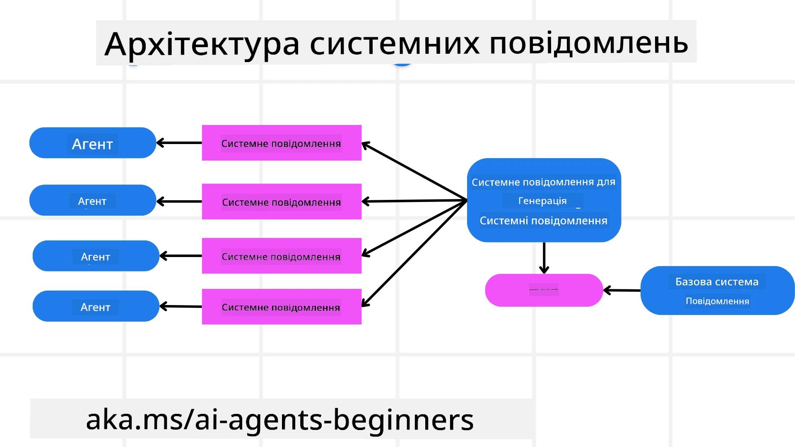
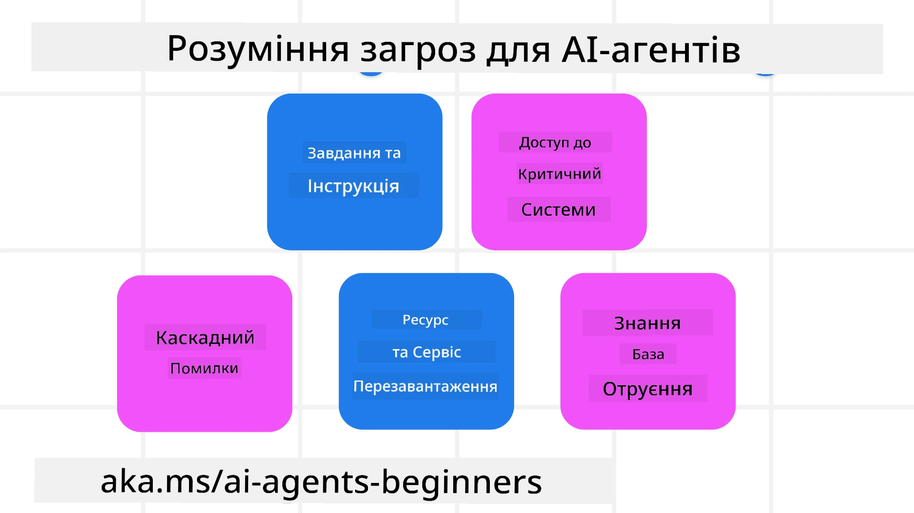
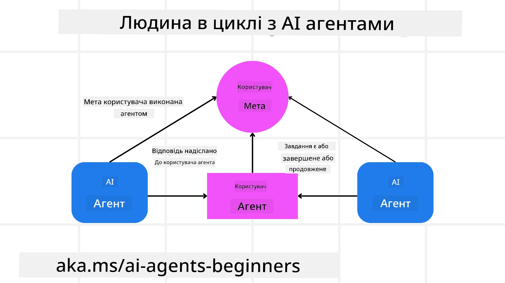

[](https://youtu.be/iZKkMEGBCUQ?si=Q-kEbcyHUMPoHp8L)

> _(Натисніть на зображення вище, щоб переглянути відео цього уроку)_

# Створення надійних агентів ШІ

## Вступ

Цей урок охоплює:

- Як створювати та розгортати безпечних і ефективних агентів ШІ
- Важливі аспекти безпеки при розробці агентів ШІ.
- Як забезпечити конфіденційність даних та користувачів під час розробки агентів ШІ.

## Цілі навчання

Після завершення цього уроку ви знатимете, як:

- Виявляти та пом'якшувати ризики при створенні агентів ШІ.
- Впроваджувати заходи безпеки для належного управління даними та доступом.
- Створювати агентів ШІ, які забезпечують конфіденційність даних і якісний досвід користувача.

## Безпека

Спочатку розглянемо створення безпечних агентних додатків. Безпека означає, що агент ШІ виконує свою роботу відповідно до призначення. Як розробники агентних додатків, ми маємо методи та інструменти для максимального забезпечення безпеки:

### Побудова рамки системних повідомлень

Якщо ви коли-небудь створювали додаток ШІ з використанням великих мовних моделей (LLM), ви знаєте важливість розробки надійного системного підказу або системного повідомлення. Ці підказки встановлюють метаправила, інструкції та настанови щодо того, як LLM взаємодіятиме з користувачем і даними.

Для агентів ШІ системний підказ ще важливіший, оскільки агентам ШІ потрібні максимально конкретні інструкції для виконання завдань, які ми для них спроєктували.

Щоб створювати масштабовані системні підказки, ми можемо використовувати рамку системних повідомлень для побудови одного або кількох агентів у нашому додатку:



#### Крок 1: Створіть мета-системне повідомлення 

Мета-підказка використовуватиметься LLM для генерації системних підказок для агентів, яких ми створюємо. Ми розробляємо її як шаблон, щоб мати змогу ефективно створювати кілька агентів за потреби.

Ось приклад мета-системного повідомлення, яке ми можемо передати LLM:

```plaintext
You are an expert at creating AI agent assistants. 
You will be provided a company name, role, responsibilities and other
information that you will use to provide a system prompt for.
To create the system prompt, be descriptive as possible and provide a structure that a system using an LLM can better understand the role and responsibilities of the AI assistant. 
```

#### Крок 2: Створіть базову підказку

Наступний крок — створити базову підказку для опису агента ШІ. Ви повинні включити роль агента, завдання, які він виконуватиме, та інші обов'язки агента.

Ось приклад:

```plaintext
You are a travel agent for Contoso Travel that is great at booking flights for customers. To help customers you can perform the following tasks: lookup available flights, book flights, ask for preferences in seating and times for flights, cancel any previously booked flights and alert customers on any delays or cancellations of flights.  
```

#### Крок 3: Надайте базове системне повідомлення LLM

Тепер ми можемо оптимізувати це системне повідомлення, використавши мета-системне повідомлення як системне повідомлення та нашу базову системну підказку.

Це створить системне повідомлення, яке краще спрямовуватиме наших агентів ШІ:

```markdown
**Company Name:** Contoso Travel  
**Role:** Travel Agent Assistant

**Objective:**  
You are an AI-powered travel agent assistant for Contoso Travel, specializing in booking flights and providing exceptional customer service. Your main goal is to assist customers in finding, booking, and managing their flights, all while ensuring that their preferences and needs are met efficiently.

**Key Responsibilities:**

1. **Flight Lookup:**
    
    - Assist customers in searching for available flights based on their specified destination, dates, and any other relevant preferences.
    - Provide a list of options, including flight times, airlines, layovers, and pricing.
2. **Flight Booking:**
    
    - Facilitate the booking of flights for customers, ensuring that all details are correctly entered into the system.
    - Confirm bookings and provide customers with their itinerary, including confirmation numbers and any other pertinent information.
3. **Customer Preference Inquiry:**
    
    - Actively ask customers for their preferences regarding seating (e.g., aisle, window, extra legroom) and preferred times for flights (e.g., morning, afternoon, evening).
    - Record these preferences for future reference and tailor suggestions accordingly.
4. **Flight Cancellation:**
    
    - Assist customers in canceling previously booked flights if needed, following company policies and procedures.
    - Notify customers of any necessary refunds or additional steps that may be required for cancellations.
5. **Flight Monitoring:**
    
    - Monitor the status of booked flights and alert customers in real-time about any delays, cancellations, or changes to their flight schedule.
    - Provide updates through preferred communication channels (e.g., email, SMS) as needed.

**Tone and Style:**

- Maintain a friendly, professional, and approachable demeanor in all interactions with customers.
- Ensure that all communication is clear, informative, and tailored to the customer's specific needs and inquiries.

**User Interaction Instructions:**

- Respond to customer queries promptly and accurately.
- Use a conversational style while ensuring professionalism.
- Prioritize customer satisfaction by being attentive, empathetic, and proactive in all assistance provided.

**Additional Notes:**

- Stay updated on any changes to airline policies, travel restrictions, and other relevant information that could impact flight bookings and customer experience.
- Use clear and concise language to explain options and processes, avoiding jargon where possible for better customer understanding.

This AI assistant is designed to streamline the flight booking process for customers of Contoso Travel, ensuring that all their travel needs are met efficiently and effectively.

```

#### Крок 4: Ітерація та вдосконалення

Цінність цієї рамки системних повідомлень полягає в тому, що вона дозволяє масштабувати створення системних повідомлень для кількох агентів і покращувати їх з часом. Рідко коли системне повідомлення працює з першої спроби для повного випадку використання. Можливість вносити невеликі зміни та покращення, змінюючи базове системне повідомлення і проганяючи його через систему, дозволить вам порівнювати і оцінювати результати.

## Розуміння загроз

Щоб створити надійних агентів ШІ, важливо розуміти та пом'якшувати ризики й загрози, що можуть вплинути на вашого агента ШІ. Розглянемо деякі з різних загроз агентам ШІ та як краще планувати й готуватися до них.



### Завдання та інструкції

**Опис:** Зловмисники намагаються змінити інструкції або цілі агента ШІ шляхом підказування або маніпуляції вхідними даними.

**Пом'якшення**: Виконуйте перевірки валідації та фільтри вхідних даних, щоб виявляти потенційно небезпечні підказки до їх обробки агентом ШІ. Оскільки такі атаки зазвичай потребують частої взаємодії з агентом, обмеження кількості ходів у розмові — ще один спосіб запобігти цьому типу атак.

### Доступ до критичних систем

**Опис**: Якщо агент ШІ має доступ до систем і сервісів, що зберігають чутливі дані, зловмисники можуть скомпрометувати зв'язок між агентом і цими сервісами. Це можуть бути прямі атаки або опосередковані спроби отримати інформацію про ці системи через агента.

**Пом'якшення**: Агенти ШІ повинні мати доступ до систем лише за потреби, щоб запобігти такого роду атакам. Комунікація між агентом і системою також має бути захищена. Впровадження автентифікації та контролю доступу — ще один спосіб захисту цієї інформації.

### Перевантаження ресурсів та сервісів

**Опис:** Агенти ШІ можуть звертатися до різних інструментів і сервісів для виконання завдань. Зловмисники можуть скористатися цією можливістю для атаки на ці сервіси, надсилаючи велику кількість запитів через агента ШІ, що може призвести до відмов у роботі систем або значних витрат.

**Пом'якшення:** Впровадьте політики обмеження кількості запитів, які агент ШІ може надсилати до сервісу. Обмеження кількості ходів розмови та запитів до вашого агента ШІ — ще один спосіб запобігти цьому типу атак.

### Отруєння бази знань

**Опис:** Цей тип атаки не спрямований безпосередньо на агента ШІ, а націлений на базу знань та інші сервіси, які агент ШІ використовує. Це може включати пошкодження даних або інформації, яку агент ШІ використовуватиме для виконання завдання, що призведе до упереджених або небажаних відповідей користувачу.

**Пом'якшення:** Регулярно перевіряйте дані, які агент ШІ використовуватиме у своїх робочих процесах. Забезпечте безпечний доступ до цих даних і дозволяйте їх змінювати лише довіреним особам, щоб уникнути такого типу атак.

### Каскадні помилки

**Опис:** Агенти ШІ звертаються до різних інструментів і сервісів для виконання завдань. Помилки, спричинені зловмисниками, можуть призвести до відмов інших систем, з якими пов’язаний агент ШІ, що робить атаку більш масштабною та складною для розв'язання.

**Пом'якшення**: Один зі способів уникнути цього — працювати агенту ШІ в обмеженому середовищі, наприклад виконувати завдання в Docker-контейнері, щоб запобігти прямим системним атакам. Створення механізмів відновлення та логіки повторних спроб, коли певні системи відповідають помилкою, — ще один спосіб запобігти масштабним відмовам систем.

## Людина в циклі

Ще одним ефективним способом створення надійних систем агентів ШІ є використання підходу «людина в циклі». Це створює процес, у якому користувачі можуть надавати відгуки агентам під час виконання. По суті, користувачі діють як агенти в багатоагентній системі, надаючи підтвердження або припиняючи виконуваний процес.



Нижче наведено фрагмент коду з використанням Microsoft Agent Framework, який показує, як реалізовано цю концепцію:

```python
import os
from agent_framework.azure import AzureAIProjectAgentProvider
from azure.identity import AzureCliCredential

# Створіть провайдера з участю людини для затвердження
provider = AzureAIProjectAgentProvider(
    credential=AzureCliCredential(),
)

# Створіть агента з кроком затвердження за участю людини
response = provider.create_response(
    input="Write a 4-line poem about the ocean.",
    instructions="You are a helpful assistant. Ask for user approval before finalizing.",
)

# Користувач може переглянути та затвердити відповідь
print(response.output_text)
user_input = input("Do you approve? (APPROVE/REJECT): ")
if user_input == "APPROVE":
    print("Response approved.")
else:
    print("Response rejected. Revising...")
```

## Висновок

Створення надійних агентів ШІ вимагає ретельного проєктування, надійних заходів безпеки та постійної ітерації. Впроваджуючи структуровані системи мета-підказок, розуміючи потенційні загрози та застосовуючи стратегії пом'якшення, розробники можуть створити агентів ШІ, які є одночасно безпечними й ефективними. Крім того, впровадження підходу з людиною в циклі забезпечує відповідність агентів ШІ потребам користувачів при мінімізації ризиків. Оскільки ШІ продовжує розвиватися, проактивна позиція щодо безпеки, конфіденційності та етичних аспектів буде ключем до формування довіри та надійності систем на основі ШІ.

### Маєте ще питання щодо створення надійних агентів ШІ?

Приєднуйтесь до [сервера Microsoft Foundry у Discord](https://aka.ms/ai-agents/discord), щоб зустрітися з іншими учнями, відвідати години консультацій та отримати відповіді на свої питання щодо агентів ШІ.

## Додаткові ресурси

- <a href="https://learn.microsoft.com/azure/ai-studio/responsible-use-of-ai-overview" target="_blank">Огляд відповідального використання ШІ</a>
- <a href="https://learn.microsoft.com/azure/ai-studio/concepts/evaluation-approach-gen-ai" target="_blank">Оцінювання генеративних моделей та застосунків ШІ</a>
- <a href="https://learn.microsoft.com/azure/ai-services/openai/concepts/system-message?context=%2Fazure%2Fai-studio%2Fcontext%2Fcontext&tabs=top-techniques" target="_blank">Системні повідомлення з питань безпеки</a>
- <a href="https://blogs.microsoft.com/wp-content/uploads/prod/sites/5/2022/06/Microsoft-RAI-Impact-Assessment-Template.pdf?culture=en-us&country=us" target="_blank">Шаблон оцінки ризиків</a>

## Попередній урок

[Agentic RAG](../05-agentic-rag/README.md)

## Наступний урок

[Planning Design Pattern](../07-planning-design/README.md)

---

<!-- CO-OP TRANSLATOR DISCLAIMER START -->
Відмова від відповідальності:
Цей документ був перекладений із використанням сервісу машинного перекладу зі штучним інтелектом Co-op Translator (https://github.com/Azure/co-op-translator). Хоча ми прагнемо до точності, просимо пам’ятати, що автоматичні переклади можуть містити помилки або неточності. Оригінальний документ його рідною мовою слід вважати авторитетним джерелом. Для критичної інформації рекомендується звертатися до професійного перекладача. Ми не несемо відповідальності за будь-які непорозуміння або хибні тлумачення, що виникли внаслідок використання цього перекладу.
<!-- CO-OP TRANSLATOR DISCLAIMER END -->