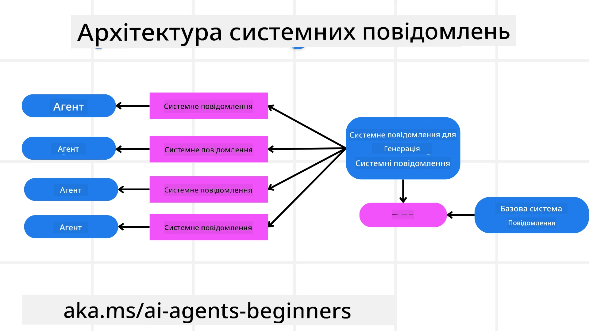
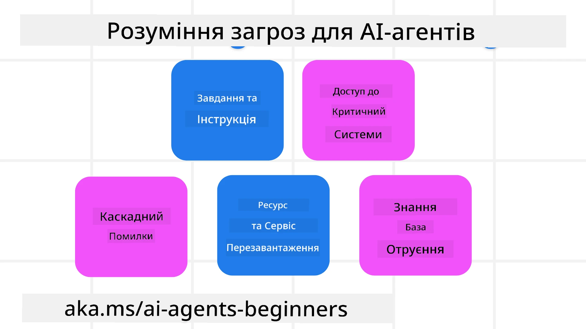
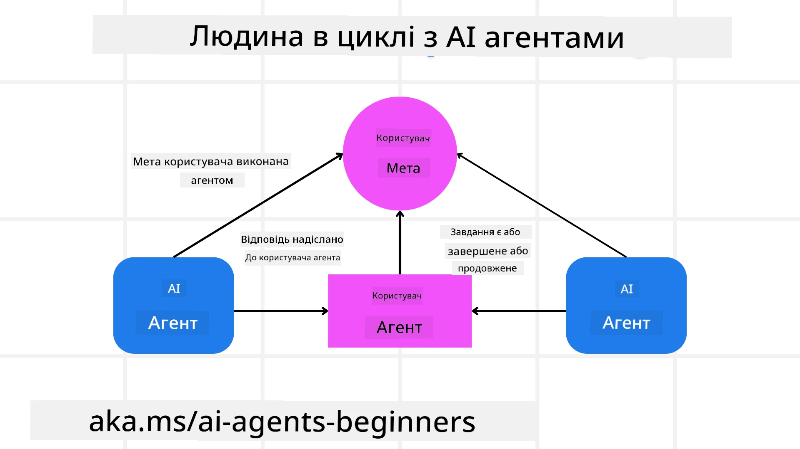

[](https://youtu.be/iZKkMEGBCUQ?si=Q-kEbcyHUMPoHp8L)

> _(Натисніть на зображення вище, щоб переглянути відео цього уроку)_

# Створення довірчих AI агентів

## Вступ

У цьому уроці ми розглянемо:

- Як створювати та розгортати безпечних і ефективних AI агентів
- Важливі аспекти безпеки під час розробки AI агентів.
- Як зберігати конфіденційність даних і користувачів при розробці AI агентів.

## Навчальні цілі

Після завершення цього уроку ви знатимете, як:

- Визначати та мінімізувати ризики при створенні AI агентів.
- Впроваджувати заходи безпеки для належного управління даними та доступом.
- Створювати AI агентів, які підтримують конфіденційність даних і забезпечують якісний користувацький досвід.

## Безпека

Спершу розглянемо створення безпечних агентоорієнтованих додатків. Безпека означає, що AI агент виконує завдання відповідно до задуму. Як творці агентоорієнтованих додатків ми маємо методи та інструменти для максимізації безпеки:

### Створення рамкової системи повідомлень

Якщо ви колись створювали AI-додаток із використанням великих мовних моделей (LLM), ви знаєте, як важливо розробити надійний системний запит або системне повідомлення. Ці запити встановлюють метаправила, інструкції та настанови щодо того, як LLM взаємодіятиме з користувачем і даними.

Для AI агентів системний запит ще важливіший, оскільки AI агенти потребують дуже специфічних інструкцій для виконання поставлених завдань.

Щоб створити масштабовані системні запити, ми можемо використовувати рамкову систему повідомлень для створення одного або кількох агентів у нашому додатку:



#### Крок 1: Створення мета-системного повідомлення

Мета-запит буде використаний LLM для генерації системних запитів для агентів, яких ми створюємо. Ми розробляємо його як шаблон, щоб ефективно створювати кількох агентів за потребою.

Ось приклад мета-системного повідомлення, яке ми б надали LLM:

```plaintext
You are an expert at creating AI agent assistants. 
You will be provided a company name, role, responsibilities and other
information that you will use to provide a system prompt for.
To create the system prompt, be descriptive as possible and provide a structure that a system using an LLM can better understand the role and responsibilities of the AI assistant. 
```

#### Крок 2: Створення базового запиту

Наступним кроком є створення базового запиту для опису AI агента. Ви повинні включити роль агента, завдання, які агент виконуватиме, та будь-які інші обов’язки агента.

Ось приклад:

```plaintext
You are a travel agent for Contoso Travel that is great at booking flights for customers. To help customers you can perform the following tasks: lookup available flights, book flights, ask for preferences in seating and times for flights, cancel any previously booked flights and alert customers on any delays or cancellations of flights.  
```

#### Крок 3: Надання базового системного повідомлення LLM

Тепер ми можемо оптимізувати це системне повідомлення, надаючи мета-системне повідомлення як системне повідомлення та наш базовий системний запит.

Це створить системне повідомлення, яке краще орієнтуватиме наших AI агентів:

```markdown
**Company Name:** Contoso Travel  
**Role:** Travel Agent Assistant

**Objective:**  
You are an AI-powered travel agent assistant for Contoso Travel, specializing in booking flights and providing exceptional customer service. Your main goal is to assist customers in finding, booking, and managing their flights, all while ensuring that their preferences and needs are met efficiently.

**Key Responsibilities:**

1. **Flight Lookup:**
    
    - Assist customers in searching for available flights based on their specified destination, dates, and any other relevant preferences.
    - Provide a list of options, including flight times, airlines, layovers, and pricing.
2. **Flight Booking:**
    
    - Facilitate the booking of flights for customers, ensuring that all details are correctly entered into the system.
    - Confirm bookings and provide customers with their itinerary, including confirmation numbers and any other pertinent information.
3. **Customer Preference Inquiry:**
    
    - Actively ask customers for their preferences regarding seating (e.g., aisle, window, extra legroom) and preferred times for flights (e.g., morning, afternoon, evening).
    - Record these preferences for future reference and tailor suggestions accordingly.
4. **Flight Cancellation:**
    
    - Assist customers in canceling previously booked flights if needed, following company policies and procedures.
    - Notify customers of any necessary refunds or additional steps that may be required for cancellations.
5. **Flight Monitoring:**
    
    - Monitor the status of booked flights and alert customers in real-time about any delays, cancellations, or changes to their flight schedule.
    - Provide updates through preferred communication channels (e.g., email, SMS) as needed.

**Tone and Style:**

- Maintain a friendly, professional, and approachable demeanor in all interactions with customers.
- Ensure that all communication is clear, informative, and tailored to the customer's specific needs and inquiries.

**User Interaction Instructions:**

- Respond to customer queries promptly and accurately.
- Use a conversational style while ensuring professionalism.
- Prioritize customer satisfaction by being attentive, empathetic, and proactive in all assistance provided.

**Additional Notes:**

- Stay updated on any changes to airline policies, travel restrictions, and other relevant information that could impact flight bookings and customer experience.
- Use clear and concise language to explain options and processes, avoiding jargon where possible for better customer understanding.

This AI assistant is designed to streamline the flight booking process for customers of Contoso Travel, ensuring that all their travel needs are met efficiently and effectively.

```

#### Крок 4: Ітерації та покращення

Цінність цієї рамкової системи повідомлень полягає у можливості простіше масштабувати створення системних повідомлень для кількох агентів, а також покращувати свої системні повідомлення з часом. Рідко буває, що системне повідомлення працює з першої спроби для вашого повного варіанту використання. Можливість вносити невеликі зміни та покращення, змінюючи базове системне повідомлення і пропускаючи його через систему, дозволить вам порівнювати та оцінювати результати.

## Розуміння загроз

Щоб створити довірчих AI агентів, важливо розуміти і зменшувати ризики і загрози для вашого AI агента. Розглянемо деякі різні загрози для AI агентів і як ви можете краще планувати та готуватися до них.



### Завдання та інструкції

**Опис:** Зловмисники намагаються змінити інструкції чи цілі AI агента шляхом введення певних запитів або маніпуляції вхідними даними.

**Пом’якшення**: Виконуйте перевірки валідації та фільтри вхідних даних, щоб своєчасно виявляти потенційно небезпечні запити перед тим, як AI агент почне їх обробляти. Оскільки такі атаки зазвичай вимагають частої взаємодії з агентом, обмеження кількості ходів у розмові є ще одним способом запобігання таким атакам.

### Доступ до критичних систем

**Опис:** Якщо AI агент має доступ до систем і служб, що зберігають чутливі дані, зловмисники можуть порушити зв’язок між агентом і цими службами. Це можуть бути прямі атаки або непрямі спроби отримати інформацію про ці системи через агента.

**Пом’якшення**: AI агенти повинні мати доступ до систем лише за потребою, щоб запобігти такого роду атакам. Комунікація між агентом та системою також має бути захищеною. Впровадження автентифікації та контролю доступу є додатковим способом захисту цієї інформації.

### Перевантаження ресурсів і служб

**Опис:** AI агенти можуть отримувати доступ до різних інструментів і служб для виконання завдань. Зловмисники можуть використати цю можливість для атак на ці служби, надсилаючи великий обсяг запитів через AI агента, що може призвести до збоїв систем або високих витрат.

**Пом’якшення:** Впровадьте політики, які обмежують кількість запитів, які AI агент може надіслати до служби. Обмеження кількості ходів у розмові та запитів до вашого AI агента є ще одним способом запобігання таким атакам.

### Отруєння бази знань

**Опис:** Цей тип атаки не спрямований безпосередньо на AI агента, а орієнтований на базу знань та інші служби, які AI агент використовуватиме. Це може бути підрив даних або інформації, які агент застосовує для виконання завдання, що призводить до упереджених або небажаних відповідей користувачу.

**Пом’якшення:** Регулярно перевіряйте дані, які AI агент використовує у своїх робочих процесах. Забезпечуйте безпечний доступ до цих даних і дозвіл змін лише для довірених осіб, щоб уникнути такого виду атак.

### Каскадні помилки

**Опис:** AI агенти використовують різні інструменти та служби для виконання завдань. Помилки, викликані зловмисниками, можуть спричинити відмову інших систем, до яких підключений AI агент, що робить атаку масштабнішою і складнішою для усунення.

**Пом’якшення**: Одним із способів уникнути цього є робота AI агента у обмеженому середовищі, наприклад у контейнері Docker, щоб запобігти прямим атакам на систему. Створення механізмів резервного відновлення і логіки повтору дій при виникненні помилок у певних системах — ще один спосіб уникнути масштабних відмов.

## Людина в циклі

Іншим ефективним способом створення довірчих AI агентів є використання підходу Людина в циклі. Це створює процес, у якому користувачі можуть надавати зворотний зв’язок агентам під час їх роботи. Користувачі фактично виступають як агенти в багатознаковій системі, надаючи схвалення або припинення виконання процесу.



Ось фрагмент коду з використанням Microsoft Agent Framework, який демонструє, як реалізовано цю концепцію:

```python
import os
from agent_framework.foundry import FoundryChatClient
from azure.identity import AzureCliCredential

# Створіть провайдера з затвердженням за участю людини
provider = FoundryChatClient(
    project_endpoint=os.environ["AZURE_AI_PROJECT_ENDPOINT"],
    model=os.environ["AZURE_AI_MODEL_DEPLOYMENT_NAME"],
    credential=AzureCliCredential(),
)

# Створіть агента з етапом затвердження людиною
response = provider.create_response(
    input="Write a 4-line poem about the ocean.",
    instructions="You are a helpful assistant. Ask for user approval before finalizing.",
)

# Користувач може переглянути і затвердити відповідь
print(response.output_text)
user_input = input("Do you approve? (APPROVE/REJECT): ")
if user_input == "APPROVE":
    print("Response approved.")
else:
    print("Response rejected. Revising...")
```

## Висновок

Створення довірчих AI агентів вимагає ретельного проєктування, надійних заходів безпеки та безперервного вдосконалення. Впроваджуючи структуровані мета-запити, розуміючи потенційні загрози та застосовуючи стратегії пом’якшення, розробники можуть створювати AI агентів, які є безпечними й ефективними. Крім того, включення підходу людини в циклі гарантує, що AI агенти залишаються узгодженими з потребами користувачів і водночас знижують ризики. У міру розвитку AI підтримка проактивного підходу до безпеки, конфіденційності та етичних аспектів буде ключовою для формування довіри та надійності в AI-системах.

## Приклади коду

- [`code_samples/06-system-message-framework.ipynb`](code_samples/06-system-message-framework.ipynb): Покрокова демонстрація системної рамкової системи мета-запитів.
- [`code_samples/06-human-in-the-loop.ipynb`](code_samples/06-human-in-the-loop.ipynb): Ворота схвалення перед виконанням, класифікація ризиків і журналювання аудиту для довірчих агентів.

### Є ще запитання щодо створення довірчих AI агентів?

Приєднуйтесь до [Microsoft Foundry Discord](https://discord.com/invite/ATgtXmAS5D), щоб зустріти інших учнів, відвідати години консультацій та отримати відповіді на питання про AI агентів.

## Додаткові ресурси

- <a href="https://learn.microsoft.com/azure/ai-studio/responsible-use-of-ai-overview" target="_blank">Огляд відповідального використання AI</a>
- <a href="https://learn.microsoft.com/azure/ai-studio/concepts/evaluation-approach-gen-ai" target="_blank">Оцінка генеративних моделей AI та додатків AI</a>
- <a href="https://learn.microsoft.com/azure/ai-services/openai/concepts/system-message?context=%2Fazure%2Fai-studio%2Fcontext%2Fcontext&tabs=top-techniques" target="_blank">Системні повідомлення безпеки</a>
- <a href="https://blogs.microsoft.com/wp-content/uploads/prod/sites/5/2022/06/Microsoft-RAI-Impact-Assessment-Template.pdf?culture=en-us&country=us" target="_blank">Шаблон оцінки ризиків</a>

## Попередній урок

[Agentic RAG](../05-agentic-rag/README.md)

## Наступний урок

[Патерн планування проєктування](../07-planning-design/README.md)

---

<!-- CO-OP TRANSLATOR DISCLAIMER START -->
**Відмова від відповідальності**:
Цей документ було перекладено за допомогою сервісу штучного інтелекту для перекладу [Co-op Translator](https://github.com/Azure/co-op-translator). Хоча ми прагнемо до точності, будь ласка, майте на увазі, що автоматичні переклади можуть містити помилки або неточності. Оригінальний документ рідною мовою слід вважати авторитетним джерелом. Для критично важливої інформації рекомендується професійний людський переклад. Ми не несемо відповідальності за будь-які непорозуміння або неправильні тлумачення, що виникли внаслідок використання цього перекладу.
<!-- CO-OP TRANSLATOR DISCLAIMER END -->