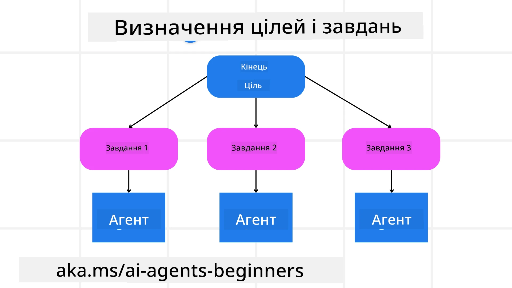

[](https://youtu.be/kPfJ2BrBCMY?si=9pYpPXp0sSbK91Dr)

> _(Натисніть на зображення вище, щоб переглянути відео цього уроку)_

# Патерн планування

## Вступ

У цьому уроці будуть розглянуті

* Визначення чіткого загального завдання та розбиття складного завдання на керовані підзадачі.
* Використання структурованого виводу для більш надійних і машинозчитуваних відповідей.
* Застосування подієво орієнтованого підходу для обробки динамічних завдань і непередбачуваних вхідних даних.

## Навчальні цілі

Після завершення цього уроку ви отримаєте уявлення про:

* Визначати та встановлювати загальну мету для AI-агента, забезпечуючи, щоб він чітко розумів, що потрібно досягти.
* Розкладати складне завдання на керовані підзадачі та організовувати їх у логічну послідовність.
* Оснастити агентів відповідними інструментами (наприклад, інструментами пошуку чи аналітики даних), визначати, коли і як ними користуватися, та обробляти неочікувані ситуації, що виникають.
* Оцінювати результати підзадач, вимірювати продуктивність та ітеративно вдосконалювати дії для поліпшення кінцевого результату.

## Визначення загальної мети та розбиття завдання



Більшість реальних завдань занадто складні, щоб вирішити їх за один крок. AI-агенту потрібна стисло сформульована мета, яка спрямовуватиме його планування та дії. Наприклад, розглянемо мету:

    "Скласти 3-денний маршрут подорожі."

Хоча це просто сформулювати, воно все одно потребує уточнення. Чим ясніша мета, тим краще агент (і будь-які людські колаборатори) зможуть зосередитися на досягненні правильного результату, наприклад створенні детального маршруту з варіантами перельотів, рекомендаціями готелів та пропозиціями щодо активностей.

### Декомпозиція завдання

Великі або складні завдання стають більш керованими, коли їх розбити на менші підзадачі, орієнтовані на мету.
Для прикладу маршруту подорожі ви можете розбити мету на:

* Бронювання рейсів
* Бронювання готелів
* Оренда автомобіля
* Персоналізація

Кожну підзадачу може виконувати присвячений агент або процес. Один агент може спеціалізуватися на пошуку найкращих пропозицій на рейси, інший зосередитися на бронюванні готелів тощо. Координуючий або «downstream» агент може потім зібрати ці результати в єдиний узгоджений маршрут для кінцевого користувача.

Такий модульний підхід також дозволяє робити поступові покращення. Наприклад, ви можете додати спеціалізованих агентів для рекомендацій їжі або пропозицій місцевих активностей і з часом вдосконалювати маршрут.

### Структурований вивід

Великі мовні моделі (LLMs) можуть генерувати структурований вивід (наприклад, JSON), який легше парсити та обробляти для downstream-агентів або сервісів. Це особливо корисно в контексті багатопроцесної системи, де ми можемо виконувати ці завдання після отримання плану.

The following Python snippet demonstrates a simple planning agent decomposing a goal into subtasks and generating a structured plan:

```python
from pydantic import BaseModel
from enum import Enum
from typing import List, Optional, Union
import json
import os
from typing import Optional
from pprint import pprint
from agent_framework.azure import AzureAIProjectAgentProvider
from azure.identity import AzureCliCredential

class AgentEnum(str, Enum):
    FlightBooking = "flight_booking"
    HotelBooking = "hotel_booking"
    CarRental = "car_rental"
    ActivitiesBooking = "activities_booking"
    DestinationInfo = "destination_info"
    DefaultAgent = "default_agent"
    GroupChatManager = "group_chat_manager"

# Модель підзавдання подорожі
class TravelSubTask(BaseModel):
    task_details: str
    assigned_agent: AgentEnum  # ми хочемо призначити завдання агенту

class TravelPlan(BaseModel):
    main_task: str
    subtasks: List[TravelSubTask]
    is_greeting: bool

provider = AzureAIProjectAgentProvider(credential=AzureCliCredential())

# Визначте повідомлення користувача
system_prompt = """You are a planner agent.
    Your job is to decide which agents to run based on the user's request.
    Provide your response in JSON format with the following structure:
{'main_task': 'Plan a family trip from Singapore to Melbourne.',
 'subtasks': [{'assigned_agent': 'flight_booking',
               'task_details': 'Book round-trip flights from Singapore to '
                               'Melbourne.'}
    Below are the available agents specialised in different tasks:
    - FlightBooking: For booking flights and providing flight information
    - HotelBooking: For booking hotels and providing hotel information
    - CarRental: For booking cars and providing car rental information
    - ActivitiesBooking: For booking activities and providing activity information
    - DestinationInfo: For providing information about destinations
    - DefaultAgent: For handling general requests"""

user_message = "Create a travel plan for a family of 2 kids from Singapore to Melbourne"

response = client.create_response(input=user_message, instructions=system_prompt)

response_content = response.output_text
pprint(json.loads(response_content))
```

### Планувальний агент з оркестрацією кількох агентів

У цьому прикладі Semantic Router Agent отримує запит користувача (наприклад, «Мені потрібен план готелів для моєї подорожі.»).

Далі планувальник:

* Отримує план готелю: планувальник бере повідомлення користувача і, на основі системного запиту (включаючи інформацію про доступних агентів), генерує структурований план подорожі.
* Перераховує агентів та їхні інструменти: реєстр агентів містить список агентів (наприклад для рейсів, готелів, оренди авто та активностей) разом із функціями або інструментами, які вони пропонують.
* Маршрутизує план до відповідних агентів: залежно від кількості підзадач планувальник або відправляє повідомлення безпосередньо присвяченому агенту (для сценаріїв з однією задачею), або координує через менеджер групового чату для співпраці кількох агентів.
* Підсумовує результат: нарешті планувальник підсумовує згенерований план для ясності.
The following Python code sample illustrates these steps:

```python

from pydantic import BaseModel

from enum import Enum
from typing import List, Optional, Union

class AgentEnum(str, Enum):
    FlightBooking = "flight_booking"
    HotelBooking = "hotel_booking"
    CarRental = "car_rental"
    ActivitiesBooking = "activities_booking"
    DestinationInfo = "destination_info"
    DefaultAgent = "default_agent"
    GroupChatManager = "group_chat_manager"

# Модель підзадачі подорожі

class TravelSubTask(BaseModel):
    task_details: str
    assigned_agent: AgentEnum # ми хочемо призначити завдання агенту

class TravelPlan(BaseModel):
    main_task: str
    subtasks: List[TravelSubTask]
    is_greeting: bool
import json
import os
from typing import Optional

from agent_framework.azure import AzureAIProjectAgentProvider
from azure.identity import AzureCliCredential

# Створити клієнта

provider = AzureAIProjectAgentProvider(credential=AzureCliCredential())

from pprint import pprint

# Визначити повідомлення користувача

system_prompt = """You are a planner agent.
    Your job is to decide which agents to run based on the user's request.
    Below are the available agents specialized in different tasks:
    - FlightBooking: For booking flights and providing flight information
    - HotelBooking: For booking hotels and providing hotel information
    - CarRental: For booking cars and providing car rental information
    - ActivitiesBooking: For booking activities and providing activity information
    - DestinationInfo: For providing information about destinations
    - DefaultAgent: For handling general requests"""

user_message = "Create a travel plan for a family of 2 kids from Singapore to Melbourne"

response = client.create_response(input=user_message, instructions=system_prompt)

response_content = response.output_text

# Вивести вміст відповіді після завантаження його у форматі JSON

pprint(json.loads(response_content))
```

What follows is the output from the previous code and you can then use this structured output to route to `assigned_agent` and summarize the travel plan to the end user.

```json
{
    "is_greeting": "False",
    "main_task": "Plan a family trip from Singapore to Melbourne.",
    "subtasks": [
        {
            "assigned_agent": "flight_booking",
            "task_details": "Book round-trip flights from Singapore to Melbourne."
        },
        {
            "assigned_agent": "hotel_booking",
            "task_details": "Find family-friendly hotels in Melbourne."
        },
        {
            "assigned_agent": "car_rental",
            "task_details": "Arrange a car rental suitable for a family of four in Melbourne."
        },
        {
            "assigned_agent": "activities_booking",
            "task_details": "List family-friendly activities in Melbourne."
        },
        {
            "assigned_agent": "destination_info",
            "task_details": "Provide information about Melbourne as a travel destination."
        }
    ]
}
```

An example notebook with the previous code sample is available [тут](07-python-agent-framework.ipynb).

### Ітеративне планування

Деякі завдання вимагають обміну повідомленнями або повторного планування, коли результат однієї підзадачі впливає на наступну. Наприклад, якщо агент виявляє непередбачений формат даних під час бронювання рейсів, йому може знадобитися адаптувати свою стратегію перед переходом до бронювання готелів.

Крім того, зворотний зв'язок від користувача (наприклад, людина вирішує, що віддає перевагу ранньому рейсу) може спричинити часткове перепланування. Такий динамічний, ітеративний підхід гарантує, що кінцеве рішення відповідає реальним обмеженням і змінним вподобанням користувача.

наприклад, код

```python
from agent_framework.azure import AzureAIProjectAgentProvider
from azure.identity import AzureCliCredential
#.. те саме, що й попередній код, і передайте історію користувача та поточний план

system_prompt = """You are a planner agent to optimize the
    Your job is to decide which agents to run based on the user's request.
    Below are the available agents specialized in different tasks:
    - FlightBooking: For booking flights and providing flight information
    - HotelBooking: For booking hotels and providing hotel information
    - CarRental: For booking cars and providing car rental information
    - ActivitiesBooking: For booking activities and providing activity information
    - DestinationInfo: For providing information about destinations
    - DefaultAgent: For handling general requests"""

user_message = "Create a travel plan for a family of 2 kids from Singapore to Melbourne"

response = client.create_response(
    input=user_message,
    instructions=system_prompt,
    context=f"Previous travel plan - {TravelPlan}",
)
# .. переплануйте і надішліть завдання відповідним агентам
```

Для більш комплексного планування перегляньте Magnetic One <a href="https://www.microsoft.com/research/articles/magentic-one-a-generalist-multi-agent-system-for-solving-complex-tasks" target="_blank">Блогпост</a> про розв'язання складних завдань.

## Підсумок

У цій статті ми розглянули приклад того, як можна створити планувальник, який може динамічно вибирати визначених доступних агентів. Вивід планувальника розбиває завдання і призначає агентів для їх виконання. Припускається, що агенти мають доступ до функцій/інструментів, необхідних для виконання завдання. На додаток до агентів ви можете включити інші патерни, такі як reflection, summarizer, and round robin chat для подальшого налаштування.

## Додаткові ресурси

Magentic One - A Generalist multi-agent system for solving complex tasks and has achieved impressive results on multiple challenging agentic benchmarks. Reference: <a href="https://www.microsoft.com/research/articles/magentic-one-a-generalist-multi-agent-system-for-solving-complex-tasks" target="_blank">Magentic One</a>. У цій реалізації оркестратор створює специфічні для завдань плани і делегує ці завдання доступним агентам. Окрім планування оркестратор також використовує механізм відстеження для моніторингу прогресу завдання та повторного планування у разі потреби.

### Маєте більше запитань про патерн планування?

Приєднуйтесь до [Microsoft Foundry Discord](https://aka.ms/ai-agents/discord), щоб зустрітися з іншими учнями, відвідати години консультацій та отримати відповіді на ваші питання щодо AI-агентів.

## Попередній урок

[Створення надійних AI-агентів](../06-building-trustworthy-agents/README.md)

## Наступний урок

[Патерн мультиагентної системи](../08-multi-agent/README.md)

---

<!-- CO-OP TRANSLATOR DISCLAIMER START -->
**Відмова від відповідальності**:
Цей документ було перекладено за допомогою сервісу машинного перекладу [Co-op Translator](https://github.com/Azure/co-op-translator). Хоча ми прагнемо до точності, просимо врахувати, що автоматичні переклади можуть містити помилки або неточності. Оригінальний документ його рідною мовою слід вважати авторитетним джерелом. Для критично важливої інформації рекомендується звернутися до професійного перекладу, виконаного людиною. Ми не несемо відповідальності за будь-які непорозуміння або неправильні тлумачення, що виникли внаслідок використання цього перекладу.
<!-- CO-OP TRANSLATOR DISCLAIMER END -->