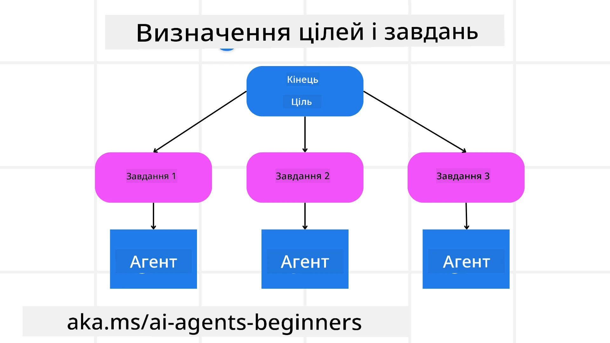

[](https://youtu.be/kPfJ2BrBCMY?si=9pYpPXp0sSbK91Dr)

> _(Натисніть на зображення вище, щоб переглянути відео цього уроку)_

# Планування дизайну

## Вступ

Цей урок розгляне

* Визначення чіткої загальної мети та розбиття складного завдання на керовані задачі.
* Використання структурованого виводу для більш надійних і машинозчитуваних відповідей.
* Застосування подієво-орієнтованого підходу для обробки динамічних завдань та несподіваних вводів.

## Цілі навчання

Після завершення цього уроку ви матимете розуміння про:

* Визначення та встановлення загальної мети для AI агента, забезпечуючи чітке розуміння того, що треба досягти.
* Декомпозицію складного завдання на керовані підзадачі та організацію їх у логічну послідовність.
* Забезпечення агентів необхідними інструментами (наприклад, інструментами пошуку або аналітики даних), прийняття рішень про те, коли і як їх використовувати, а також обробку несподіваних ситуацій.
* Оцінку результатів підзадач, вимірювання продуктивності й ітеративне вдосконалення дій для покращення кінцевого результату.

## Визначення загальної мети та розбиття завдання



Більшість реальних завдань надто складні, щоб виконати їх одразу. AI агент потребує чіткої мети, яка направлятиме його планування та дії. Наприклад, розглянемо мету:

    "Створити триденний маршрут подорожі."

Хоча це звучить просто, мету все одно треба уточнити. Чіткіша мета дозволяє агенту (та будь-яким людським учасникам) зосередитись на досягненні правильного результату, наприклад, створенні комплексного маршруту з опціями авіарейсів, рекомендаціями готелів і пропозиціями активностей.

### Декомпозиція завдання

Великі або складні завдання стають керованішими, якщо розділити їх на менші, орієнтовані на мету підзадачі.
Для прикладу з маршрутом подорожі можна розбити мету на:

* Бронювання авіаквитків
* Бронювання готелю
* Оренда автомобіля
* Персоналізація

Кожну підзадачу можна доручити окремим агентам або процесам. Один агент може спеціалізуватися на пошуку кращих авіарейсів, інший зосереджуватись на бронюванні готелів і т. ін. Координуючий або “нижчестоящий” агент об’єднує ці результати в єдиний маршрут для кінцевого користувача.

Такий модульний підхід також дозволяє покращувати систему поступово. Наприклад, можна додати спеціалізованих агентів для рекомендацій їжі або місцевих активностей і покращувати маршрут з часом.

### Структурований вихід

Великі мовні моделі (LLMs) можуть генерувати структурований вихід (наприклад, JSON), який простіше розбирати та обробляти наступним агентам чи сервісам. Це особливо корисно у контексті мультиагентної системи, де можна виконувати задачі після отримання результату планування.

Наступний приклад на Python демонструє простого агента планування, який розбиває мету на підзадачі та генерує структурований план:

```python
from pydantic import BaseModel
from enum import Enum
from typing import List, Optional, Union
import json
import os
from typing import Optional
from pprint import pprint
from agent_framework.foundry import FoundryChatClient
from azure.identity import AzureCliCredential

class AgentEnum(str, Enum):
    FlightBooking = "flight_booking"
    HotelBooking = "hotel_booking"
    CarRental = "car_rental"
    ActivitiesBooking = "activities_booking"
    DestinationInfo = "destination_info"
    DefaultAgent = "default_agent"
    GroupChatManager = "group_chat_manager"

# Модель підзадачі подорожі
class TravelSubTask(BaseModel):
    task_details: str
    assigned_agent: AgentEnum  # ми хочемо призначити завдання агенту

class TravelPlan(BaseModel):
    main_task: str
    subtasks: List[TravelSubTask]
    is_greeting: bool

provider = FoundryChatClient(
    project_endpoint=os.environ["AZURE_AI_PROJECT_ENDPOINT"],
    model=os.environ["AZURE_AI_MODEL_DEPLOYMENT_NAME"],
    credential=AzureCliCredential(),
)

# Визначити повідомлення користувача
system_prompt = """You are a planner agent.
    Your job is to decide which agents to run based on the user's request.
    Provide your response in JSON format with the following structure:
{'main_task': 'Plan a family trip from Singapore to Melbourne.',
 'subtasks': [{'assigned_agent': 'flight_booking',
               'task_details': 'Book round-trip flights from Singapore to '
                               'Melbourne.'}
    Below are the available agents specialised in different tasks:
    - FlightBooking: For booking flights and providing flight information
    - HotelBooking: For booking hotels and providing hotel information
    - CarRental: For booking cars and providing car rental information
    - ActivitiesBooking: For booking activities and providing activity information
    - DestinationInfo: For providing information about destinations
    - DefaultAgent: For handling general requests"""

user_message = "Create a travel plan for a family of 2 kids from Singapore to Melbourne"

response = client.create_response(input=user_message, instructions=system_prompt)

response_content = response.output_text
pprint(json.loads(response_content))
```

### Агент планування з мультиагентною оркестрацією

У цьому прикладі Semantic Router Agent отримує запит користувача (наприклад, "Мені потрібен план готелю для моєї поїздки.").

Планувальник тоді:

* Отримує План готелю: Планувальник приймає повідомлення користувача і, базуючись на системному запиті (включно з деталями доступних агентів), генерує структурований план подорожі.
* Перелічує Агентів та їхні Інструменти: Реєстр агентів містить список агентів (наприклад, для авіарейсів, готелів, оренди автомобілів і активностей) з функціями або інструментами, які вони пропонують.
* Маршрутизує План відповідним агентам: Залежно від кількості підзадач, планувальник або надсилає повідомлення безпосередньо до конкретного агента (у разі однотаскових сценаріїв), або координує через менеджера групового чату для мультиагентної співпраці.
* Підсумовує Результат: Врешті-решт планувальник узагальнює створений план для ясності.
Наступний код на Python ілюструє ці кроки:

```python

from pydantic import BaseModel

from enum import Enum
from typing import List, Optional, Union

class AgentEnum(str, Enum):
    FlightBooking = "flight_booking"
    HotelBooking = "hotel_booking"
    CarRental = "car_rental"
    ActivitiesBooking = "activities_booking"
    DestinationInfo = "destination_info"
    DefaultAgent = "default_agent"
    GroupChatManager = "group_chat_manager"

# Модель підзадачі подорожі

class TravelSubTask(BaseModel):
    task_details: str
    assigned_agent: AgentEnum # ми хочемо призначити завдання агенту

class TravelPlan(BaseModel):
    main_task: str
    subtasks: List[TravelSubTask]
    is_greeting: bool
import json
import os
from typing import Optional

from agent_framework.foundry import FoundryChatClient
from azure.identity import AzureCliCredential

# Створити клієнта

provider = FoundryChatClient(
    project_endpoint=os.environ["AZURE_AI_PROJECT_ENDPOINT"],
    model=os.environ["AZURE_AI_MODEL_DEPLOYMENT_NAME"],
    credential=AzureCliCredential(),
)

from pprint import pprint

# Визначити повідомлення користувача

system_prompt = """You are a planner agent.
    Your job is to decide which agents to run based on the user's request.
    Below are the available agents specialized in different tasks:
    - FlightBooking: For booking flights and providing flight information
    - HotelBooking: For booking hotels and providing hotel information
    - CarRental: For booking cars and providing car rental information
    - ActivitiesBooking: For booking activities and providing activity information
    - DestinationInfo: For providing information about destinations
    - DefaultAgent: For handling general requests"""

user_message = "Create a travel plan for a family of 2 kids from Singapore to Melbourne"

response = client.create_response(input=user_message, instructions=system_prompt)

response_content = response.output_text

# Вивести вміст відповіді після завантаження його як JSON

pprint(json.loads(response_content))
```

Нижче наведено вихідні дані з попереднього коду, які потім можна використовувати для маршрутизації до `assigned_agent` та підсумовування плану подорожі кінцевому користувачу.

```json
{
    "is_greeting": "False",
    "main_task": "Plan a family trip from Singapore to Melbourne.",
    "subtasks": [
        {
            "assigned_agent": "flight_booking",
            "task_details": "Book round-trip flights from Singapore to Melbourne."
        },
        {
            "assigned_agent": "hotel_booking",
            "task_details": "Find family-friendly hotels in Melbourne."
        },
        {
            "assigned_agent": "car_rental",
            "task_details": "Arrange a car rental suitable for a family of four in Melbourne."
        },
        {
            "assigned_agent": "activities_booking",
            "task_details": "List family-friendly activities in Melbourne."
        },
        {
            "assigned_agent": "destination_info",
            "task_details": "Provide information about Melbourne as a travel destination."
        }
    ]
}
```

Приклад ноутбука з попереднім кодом доступний [тут](./code_samples/07-python-agent-framework.ipynb).

### Ітеративне планування

Деякі завдання потребують обговорення та повторного планування, коли результат однієї підзадачі впливає на наступну. Наприклад, якщо агент виявляє несподіваний формат даних під час бронювання авіарейсів, йому може знадобитись адаптувати стратегію перед бронюванням готелів.

Крім того, відгуки користувача (наприклад, якщо людина вирішує, що віддає перевагу більш ранньому рейсу) можуть спричинити часткове перепланування. Цей динамічний ітеративний підхід гарантує, що кінцеве рішення відповідає реальним обмеженням і змінним уподобанням користувачів.

наприклад, код

```python
import os
from agent_framework.foundry import FoundryChatClient
from azure.identity import AzureCliCredential
#.. так само, як і в попередньому коді, і передати історію користувача, поточний план

system_prompt = """You are a planner agent to optimize the
    Your job is to decide which agents to run based on the user's request.
    Below are the available agents specialized in different tasks:
    - FlightBooking: For booking flights and providing flight information
    - HotelBooking: For booking hotels and providing hotel information
    - CarRental: For booking cars and providing car rental information
    - ActivitiesBooking: For booking activities and providing activity information
    - DestinationInfo: For providing information about destinations
    - DefaultAgent: For handling general requests"""

user_message = "Create a travel plan for a family of 2 kids from Singapore to Melbourne"

response = client.create_response(
    input=user_message,
    instructions=system_prompt,
    context=f"Previous travel plan - {TravelPlan}",
)
# .. перепланувати і надіслати завдання відповідним агентам
```

Для більш комплексного планування ознайомтеся з <a href="https://www.microsoft.com/research/articles/magentic-one-a-generalist-multi-agent-system-for-solving-complex-tasks" target="_blank">записом у блозі Magnetic One</a> для вирішення складних завдань.

## Підсумок

У цій статті ми розглянули приклад створення планувальника, що динамічно вибирає доступних агентів. Вихід планувальника декомпонує завдання і призначає агентів для виконання. Припускається, що агенти мають доступ до необхідних функцій/інструментів для виконання завдання. На додаток до агентів можна включити інші патерни, як-от рефлексію, підсумовувач і кругову чергу чатів, щоб ще більше налаштувати систему.

## Додаткові ресурси

Magentic One - універсальна мультиагентна система для вирішення складних завдань, яка досягла вражаючих результатів у кількох складних агентних тестах. Посилання: <a href="https://www.microsoft.com/research/articles/magentic-one-a-generalist-multi-agent-system-for-solving-complex-tasks" target="_blank">Magentic One</a>. У цій реалізації оркестратор створює задачо-специфічні плани та делегує завдання доступним агентам. Окрім планування оркестратор також використовує механізм відстеження для моніторингу прогресу і при необхідності перепланування.

### Маєте більше запитань про патерн планування?

Приєднуйтесь до [Microsoft Foundry Discord](https://discord.com/invite/ATgtXmAS5D), щоб зустрітися з іншими учнями, відвідати години консультацій та отримати відповіді на свої запитання про AI агенти.

## Попередній урок

[Створення надійних AI агентів](../06-building-trustworthy-agents/README.md)

## Наступний урок

[Патерн мультиагентної взаємодії](../08-multi-agent/README.md)

---

<!-- CO-OP TRANSLATOR DISCLAIMER START -->
**Відмова від відповідальності**:
Цей документ було перекладено за допомогою сервісу штучного інтелекту для перекладу [Co-op Translator](https://github.com/Azure/co-op-translator). Хоча ми прагнемо до точності, будь ласка, майте на увазі, що автоматичні переклади можуть містити помилки або неточності. Оригінальний документ рідною мовою слід вважати авторитетним джерелом. Для критично важливої інформації рекомендується професійний людський переклад. Ми не несемо відповідальності за будь-які непорозуміння або неправильні тлумачення, що виникли внаслідок використання цього перекладу.
<!-- CO-OP TRANSLATOR DISCLAIMER END -->