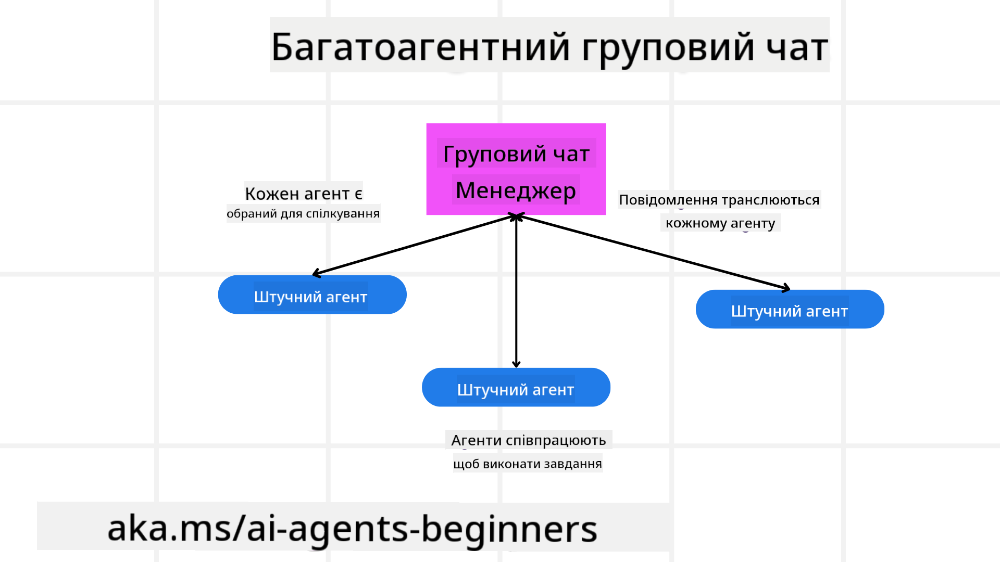
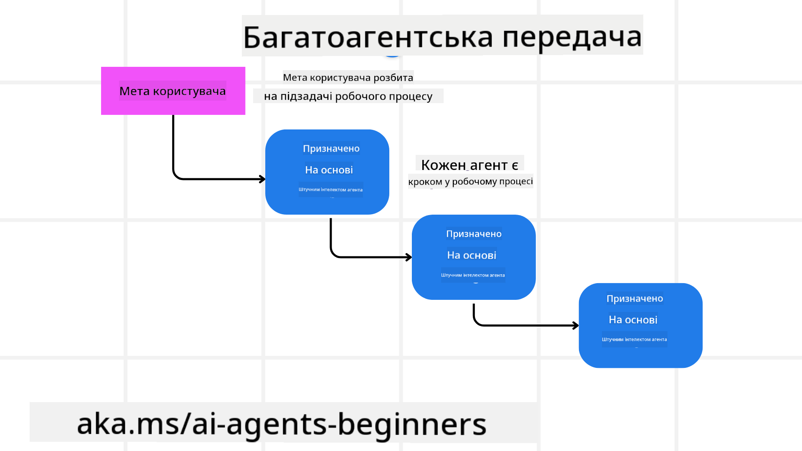
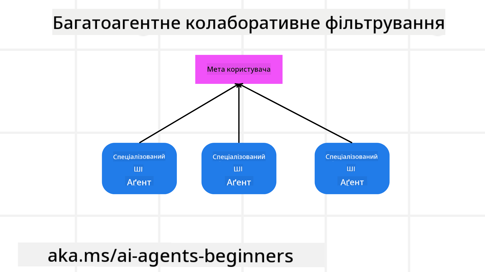

<!--
CO_OP_TRANSLATOR_METADATA:
{
  "original_hash": "1a008c204051cba8d0e253b75f261c41",
  "translation_date": "2025-08-30T09:48:37+00:00",
  "source_file": "08-multi-agent/README.md",
  "language_code": "uk"
}
-->

> _(Натисніть на зображення вище, щоб переглянути відео цього уроку)_

# Шаблони дизайну багатозадачних агентів

Як тільки ви починаєте працювати над проєктом, що включає кілька агентів, вам потрібно буде враховувати шаблон дизайну багатозадачних агентів. Однак може бути не одразу зрозуміло, коли варто переходити до багатозадачних агентів і які переваги це дає.

## Вступ

У цьому уроці ми намагаємося відповісти на такі запитання:

- У яких сценаріях застосовуються багатозадачні агенти?
- Які переваги використання багатозадачних агентів у порівнянні з одним агентом, що виконує кілька завдань?
- Які основні елементи реалізації шаблону дизайну багатозадачних агентів?
- Як забезпечити прозорість взаємодії між кількома агентами?

## Цілі навчання

Після цього уроку ви зможете:

- Визначати сценарії, де застосовуються багатозадачні агенти.
- Розпізнавати переваги використання багатозадачних агентів у порівнянні з одним агентом.
- Розуміти основні елементи реалізації шаблону дизайну багатозадачних агентів.

Яка загальна картина?

*Багатозадачні агенти — це шаблон дизайну, який дозволяє кільком агентам працювати разом для досягнення спільної мети*.

Цей шаблон широко використовується в різних галузях, включаючи робототехніку, автономні системи та розподілені обчислення.

## Сценарії, де застосовуються багатозадачні агенти

Отже, у яких сценаріях доцільно використовувати багатозадачних агентів? Відповідь полягає в тому, що існує багато сценаріїв, де використання кількох агентів є корисним, особливо в таких випадках:

- **Великі обсяги роботи**: Великі обсяги роботи можна розділити на менші завдання та призначити різним агентам, що дозволяє виконувати їх паралельно та швидше завершувати. Наприклад, це може бути обробка великих обсягів даних.
- **Складні завдання**: Складні завдання, як і великі обсяги роботи, можна розбити на менші підзавдання та призначити різним агентам, кожен з яких спеціалізується на певному аспекті завдання. Наприклад, у випадку автономних транспортних засобів різні агенти можуть відповідати за навігацію, виявлення перешкод і комунікацію з іншими транспортними засобами.
- **Різноманітна експертиза**: Різні агенти можуть мати різну експертизу, що дозволяє їм ефективніше виконувати різні аспекти завдання, ніж один агент. Наприклад, у сфері охорони здоров'я агенти можуть відповідати за діагностику, розробку планів лікування та моніторинг пацієнтів.

## Переваги використання багатозадачних агентів у порівнянні з одним агентом

Система з одним агентом може добре працювати для простих завдань, але для більш складних завдань використання кількох агентів може надати кілька переваг:

- **Спеціалізація**: Кожен агент може бути спеціалізованим для виконання конкретного завдання. Відсутність спеціалізації в одного агента означає, що він може виконувати все, але може заплутатися, коли стикається зі складним завданням. Наприклад, він може виконати завдання, для якого він не найкраще підходить.
- **Масштабованість**: Легше масштабувати системи, додаючи більше агентів, ніж перевантажуючи одного агента.
- **Стійкість до збоїв**: Якщо один агент виходить з ладу, інші можуть продовжувати працювати, забезпечуючи надійність системи.

Розглянемо приклад бронювання подорожі для користувача. Система з одним агентом повинна була б обробляти всі аспекти процесу бронювання подорожі: від пошуку рейсів до бронювання готелів і оренди автомобілів. Для цього агенту потрібно було б мати інструменти для виконання всіх цих завдань. Це могло б призвести до створення складної та монолітної системи, яку важко підтримувати та масштабувати. Система з кількома агентами, навпаки, могла б мати різних агентів, спеціалізованих на пошуку рейсів, бронюванні готелів і оренді автомобілів. Це зробило б систему більш модульною, легшою у підтримці та масштабованою.

Порівняйте це з туристичним бюро, яке працює як сімейний бізнес, і туристичним бюро, яке працює як франшиза. У сімейному бізнесі один агент обробляє всі аспекти процесу бронювання подорожі, тоді як у франшизі різні агенти відповідають за різні аспекти процесу бронювання.

## Основні елементи реалізації шаблону дизайну багатозадачних агентів

Перш ніж реалізувати шаблон дизайну багатозадачних агентів, вам потрібно зрозуміти основні елементи, які складають цей шаблон.

Давайте зробимо це більш конкретним, знову розглянувши приклад бронювання подорожі для користувача. У цьому випадку основними елементами будуть:

- **Комунікація між агентами**: Агенти, які відповідають за пошук рейсів, бронювання готелів і оренду автомобілів, повинні спілкуватися та обмінюватися інформацією про вподобання та обмеження користувача. Вам потрібно вирішити, які протоколи та методи використовувати для цієї комунікації. Наприклад, агент, який шукає рейси, повинен спілкуватися з агентом, який бронює готелі, щоб переконатися, що готель заброньовано на ті ж дати, що й рейс.
- **Механізми координації**: Агенти повинні координувати свої дії, щоб забезпечити відповідність вподобань і обмежень користувача. Наприклад, користувач може бажати готель поблизу аеропорту, тоді як обмеженням може бути те, що автомобілі для оренди доступні лише в аеропорту.
- **Архітектура агентів**: Агенти повинні мати внутрішню структуру для прийняття рішень і навчання на основі взаємодії з користувачем. Наприклад, агент, який шукає рейси, повинен мати структуру для прийняття рішень про те, які рейси рекомендувати користувачу.
- **Прозорість взаємодії між агентами**: Ви повинні мати інструменти та методи для відстеження дій і взаємодій агентів. Це може бути у вигляді інструментів для ведення журналів і моніторингу, візуалізації та метрик продуктивності.
- **Шаблони багатозадачних агентів**: Існують різні шаблони для реалізації систем багатозадачних агентів, такі як централізовані, децентралізовані та гібридні архітектури. Вам потрібно вибрати шаблон, який найкраще підходить для вашого випадку.
- **Людина в процесі**: У більшості випадків у процесі буде задіяна людина, і вам потрібно інструктувати агентів, коли запитувати втручання людини. Наприклад, це може бути запит користувача на конкретний готель або рейс, які агенти не рекомендували, або підтвердження перед бронюванням.

## Прозорість взаємодії між агентами

Важливо мати прозорість у тому, як кілька агентів взаємодіють один з одним. Ця прозорість є важливою для налагодження, оптимізації та забезпечення ефективності всієї системи. Для цього вам потрібні інструменти та методи для відстеження дій і взаємодій агентів. Це може бути у вигляді інструментів для ведення журналів і моніторингу, візуалізації та метрик продуктивності.

Наприклад, у випадку бронювання подорожі для користувача ви могли б мати інформаційну панель, яка показує статус кожного агента, вподобання та обмеження користувача, а також взаємодії між агентами. Ця панель могла б показувати дати подорожі користувача, рейси, рекомендовані агентом з пошуку рейсів, готелі, рекомендовані агентом з бронювання готелів, і автомобілі, рекомендовані агентом з оренди автомобілів. Це дало б вам чітке уявлення про те, як агенти взаємодіють один з одним і чи відповідають вподобання та обмеження користувача.

Давайте розглянемо кожен із цих аспектів детальніше.

- **Інструменти для ведення журналів і моніторингу**: Ви хочете вести журнал кожної дії, виконаної агентом. Запис у журналі може містити інформацію про агента, який виконав дію, саму дію, час виконання та результат дії. Ця інформація може бути використана для налагодження, оптимізації тощо.
- **Інструменти візуалізації**: Інструменти візуалізації можуть допомогти вам побачити взаємодії між агентами більш інтуїтивно. Наприклад, ви могли б мати графік, який показує потік інформації між агентами. Це може допомогти вам виявити вузькі місця, неефективність та інші проблеми в системі.
- **Метрики продуктивності**: Метрики продуктивності можуть допомогти вам відстежувати ефективність системи багатозадачних агентів. Наприклад, ви могли б відстежувати час, необхідний для виконання завдання, кількість завдань, виконаних за одиницю часу, і точність рекомендацій, зроблених агентами. Ця інформація може допомогти вам визначити області для покращення та оптимізувати систему.

## Шаблони багатозадачних агентів

Давайте розглянемо деякі конкретні шаблони, які можна використовувати для створення додатків із багатозадачними агентами. Ось кілька цікавих шаблонів, які варто розглянути:

### Груповий чат

Цей шаблон корисний, коли ви хочете створити додаток для групового чату, де кілька агентів можуть спілкуватися один з одним. Типові випадки використання цього шаблону включають командну співпрацю, підтримку клієнтів і соціальні мережі.

У цьому шаблоні кожен агент представляє користувача в груповому чаті, а повідомлення обмінюються між агентами за допомогою протоколу обміну повідомленнями. Агенти можуть надсилати повідомлення в груповий чат, отримувати повідомлення з групового чату та відповідати на повідомлення інших агентів.

Цей шаблон можна реалізувати за допомогою централізованої архітектури, де всі повідомлення передаються через центральний сервер, або децентралізованої архітектури, де повідомлення обмінюються безпосередньо.

### Передача завдань

Цей шаблон корисний, коли ви хочете створити додаток, у якому кілька агентів можуть передавати завдання один одному.

Типові випадки використання цього шаблону включають підтримку клієнтів, управління завданнями та автоматизацію робочих процесів.

У цьому шаблоні кожен агент представляє завдання або крок у робочому процесі, і агенти можуть передавати завдання іншим агентам на основі заздалегідь визначених правил.

### Спільна фільтрація

Цей шаблон корисний, коли ви хочете створити додаток, у якому кілька агентів можуть співпрацювати для надання рекомендацій користувачам.

Чому варто залучати кількох агентів до співпраці? Тому що кожен агент може мати різну експертизу та робити свій внесок у процес рекомендацій по-різному.

Розглянемо приклад, коли користувач хоче отримати рекомендацію щодо найкращої акції для купівлі на фондовому ринку.

- **Експерт з галузі**: Один агент може бути експертом у певній галузі.
- **Технічний аналіз**: Інший агент може бути експертом із технічного аналізу.
- **Фундаментальний аналіз**: Ще один агент може бути експертом із фундаментального аналізу. Співпрацюючи, ці агенти можуть надати користувачеві більш комплексну рекомендацію.

## Сценарій: Процес повернення коштів

Розглянемо сценарій, коли клієнт намагається отримати повернення коштів за продукт. У цьому процесі може бути задіяно чимало агентів, але давайте розділимо їх на агентів, специфічних для цього процесу, і загальних агентів, які можна використовувати в інших процесах.

**Агенти, специфічні для процесу повернення коштів**:

Ось деякі агенти, які можуть бути задіяні в процесі повернення коштів:

- **Агент клієнта**: Цей агент представляє клієнта та відповідає за ініціювання процесу повернення коштів.
- **Агент продавця**: Цей агент представляє продавця та відповідає за обробку повернення коштів.
- **Агент платежів**: Цей агент представляє платіжний процес і відповідає за повернення коштів клієнту.
- **Агент вирішення проблем**: Цей агент представляє процес вирішення проблем і відповідає за вирішення будь-яких питань, що виникають під час процесу повернення коштів.
- **Агент відповідності**: Цей агент представляє процес відповідності та відповідає за забезпечення відповідності процесу повернення коштів регламентам і політикам.

**Загальні агенти**:

Ці агенти можуть бути використані в інших частинах вашого бізнесу.

- **Агент доставки**: Цей агент представляє процес доставки та відповідає за повернення продукту продавцю. Цей агент може бути використаний як для процесу повернення коштів, так і для загальної доставки продукту, наприклад, під час покупки.
- **Агент зворотного зв’язку**: Цей агент представляє процес зворотного зв’язку та відповідає за збір відгуків від клієнта. Зворотний зв’язок може бути отриманий у будь-який час, а не лише під час процесу повернення коштів.
- **Агент ескалації**: Цей агент представляє процес ескалації та відповідає за передачу питань на вищий рівень підтримки. Ви можете використовувати цей тип агента для будь-якого процесу, де потрібно ескалувати проблему.
- **Агент сповіщень**: Цей агент представляє процес сповіщень і відповідає за надсилання сповіщень клієнту на різних етапах процесу повернення коштів.
- **Агент аналітики**: Цей агент представляє процес аналітики та відповідає за аналіз даних, пов’язаних із процесом повернення коштів.
- **Агент аудиту**: Цей агент представляє процес аудиту та відповідає за перевірку правильності виконання процесу повернення коштів.
- **Агент звітності**: Цей агент представляє процес звітності та відповідає за створення звітів про процес повернення коштів.
- **Агент знань**: Цей агент представляє процес управління знаннями та відповідає за підтримку бази знань, пов’язаної з процесом повернення коштів. Цей агент може бути обізнаним як у питаннях повернення коштів, так і в інших аспектах вашого бізнесу.
- **Агент безпеки**: Цей агент представляє процес безпеки та відповідає за забезпечення безпеки процесу повернення коштів.
- **Агент якості**
Розробіть багатокомпонентну систему для процесу підтримки клієнтів. Визначте агентів, залучених до процесу, їхні ролі та обов’язки, а також те, як вони взаємодіють один з одним. Розгляньте як агентів, специфічних для процесу підтримки клієнтів, так і загальних агентів, які можуть бути використані в інших частинах вашого бізнесу.

> Подумайте перед тим, як прочитати наступне рішення, можливо, вам знадобиться більше агентів, ніж ви думаєте.

> TIP: Подумайте про різні етапи процесу підтримки клієнтів, а також врахуйте агентів, необхідних для будь-якої системи.

## Рішення

[Рішення](./solution/solution.md)

## Перевірка знань

Питання: Коли слід розглядати використання багатокомпонентних агентів?

- [ ] A1: Коли у вас невелике навантаження і проста задача.
- [ ] A2: Коли у вас велике навантаження.
- [ ] A3: Коли у вас проста задача.

[Рішення тесту](./solution/solution-quiz.md)

## Резюме

У цьому уроці ми розглянули шаблон багатокомпонентного дизайну, включаючи сценарії, де багатокомпонентні агенти є доречними, переваги використання багатокомпонентних агентів над одним агентом, основні елементи впровадження шаблону багатокомпонентного дизайну, а також як отримати видимість того, як кілька агентів взаємодіють один з одним.

### Є додаткові запитання щодо шаблону багатокомпонентного дизайну?

Приєднуйтесь до [Azure AI Foundry Discord](https://aka.ms/ai-agents/discord), щоб зустрітися з іншими учнями, відвідати години консультацій і отримати відповіді на ваші запитання щодо AI агентів.

## Додаткові ресурси

- 

## Попередній урок

[Дизайн планування](../07-planning-design/README.md)

## Наступний урок

[Метакогніція в AI агентах](../09-metacognition/README.md)

---

**Відмова від відповідальності**:  
Цей документ був перекладений за допомогою сервісу автоматичного перекладу [Co-op Translator](https://github.com/Azure/co-op-translator). Хоча ми прагнемо до точності, будь ласка, майте на увазі, що автоматичні переклади можуть містити помилки або неточності. Оригінальний документ на його рідній мові слід вважати авторитетним джерелом. Для критичної інформації рекомендується професійний людський переклад. Ми не несемо відповідальності за будь-які непорозуміння або неправильні тлумачення, що виникають внаслідок використання цього перекладу.