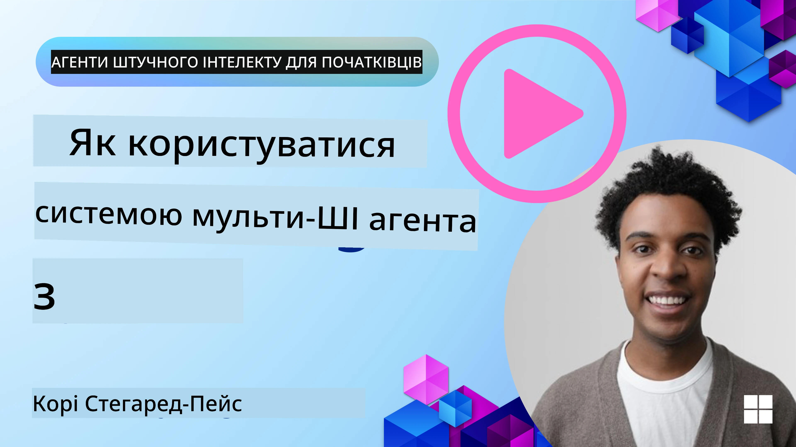
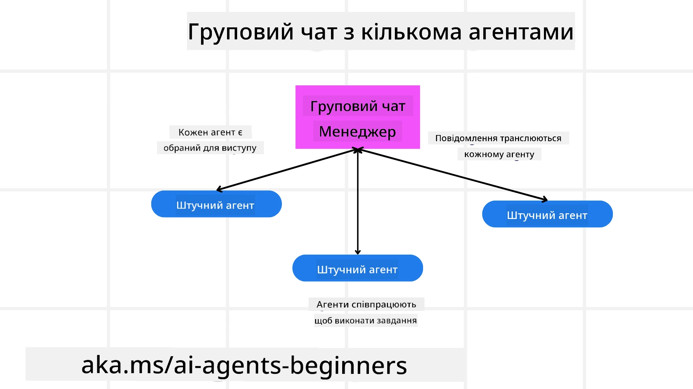
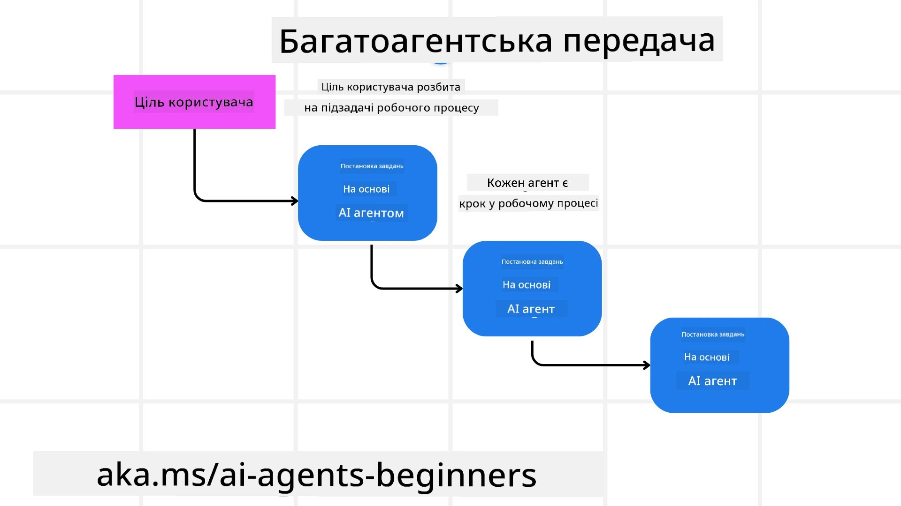
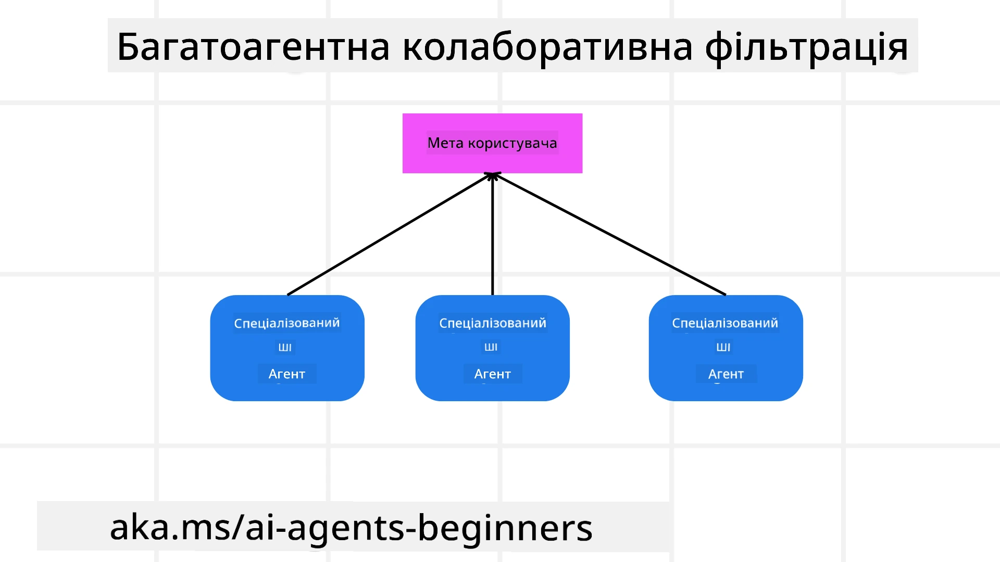

> _(Натисніть на зображення вище, щоб переглянути відео цього уроку)_

# Шаблони проектування багатоагентних систем

Як тільки ви починаєте працювати над проєктом, що включає кілька агентів, вам доведеться розглянути багатоагентний шаблон проектування. Проте може бути не зовсім зрозуміло, коли слід перейти до багатоагентної архітектури і які переваги вона дає.

## Вступ

У цьому уроці ми прагнемо відповісти на такі питання:

- У яких сценаріях доцільно застосовувати багатоагентні системи?
- Які переваги використання кількох агентів порівняно з одним агентом, який виконує кілька завдань?
- З яких блоків складається реалізація багатоагентного шаблону проектування?
- Як отримати видимість того, як кілька агентів взаємодіють один з одним?

## Цілі навчання

Після цього уроку ви зможете:

- Визначати сценарії, де доцільно застосовувати багатоагентні системи
- Впізнавати переваги використання кількох агентів порівняно з одним агентом
- Розуміти складові блоки реалізації багатоагентного шаблону проектування

Яка загальна картина?

*Багатоагентні системи — це шаблон проектування, який дозволяє кільком агентам працювати разом для досягнення спільної мети*.

Цей шаблон широко застосовується в різних галузях, включаючи робототехніку, автономні системи та розподілені обчислення.

## Сценарії, де доречно застосовувати багатоагентні системи

Отже, у яких сценаріях доцільно використовувати багатоагентні системи? Відповідь полягає в тому, що є багато випадків, коли використання кількох агентів є корисним, особливо в наступних випадках:

- **Великі навантаження**: Великі навантаження можна розділити на менші завдання і розподілити між різними агентами, що дозволяє виконувати їх паралельно і швидше завершувати роботу. Прикладом цього є обробка великих обсягів даних.
- **Складні завдання**: Складні завдання, як і великі навантаження, можна розбити на дрібніші підзадачі і призначити різним агентам, кожен з яких спеціалізується на певному аспекті завдання. Хорошим прикладом є автономні транспортні засоби, де різні агенти керують навігацією, виявленням перешкод і комунікацією з іншими транспортними засобами.
- **Різноманітна експертиза**: Різні агенти можуть мати різну експертизу, що дозволяє їм ефективніше обробляти різні аспекти завдання, ніж один агент. Для цього випадку добрим прикладом є охорона здоров’я, де агенти можуть відповідати за діагностику, планування лікування і моніторинг пацієнта.

## Переваги використання кількох агентів порівняно з одним агентом

Система з одним агентом може добре працювати для простих завдань, але для більш складних задач використання кількох агентів може дати кілька переваг:

- **Спеціалізація**: Кожен агент може спеціалізуватися на конкретному завданні. Відсутність спеціалізації в одному агенті означає, що у вас є агент, який може робити все, але може заплутатися в складному завданні. Наприклад, він може в кінцевому підсумку виконувати завдання, для якого не є найкраще підходящим.
- **Масштабованість**: Легше масштабувати системи, додаючи більше агентів, ніж перевантажувати один агент.
- **Відмовостійкість**: Якщо один агент виходить з ладу, інші можуть продовжувати працювати, забезпечуючи надійність системи.

Візьмемо приклад — забронюймо поїздку для користувача. Система з одним агентом повинна буде обробляти всі аспекти процесу бронювання поїздки — від пошуку рейсів до бронювання готелів і оренди автомобілів. Щоб досягти цього з одним агентом, агенту знадобляться інструменти для обробки всіх цих завдань. Це може призвести до складної та монолітної системи, яку важко підтримувати і масштабувати. Натомість багатоагентна система може мати різних агентів, які спеціалізуються на пошуку рейсів, бронюванні готелів і оренді автомобілів. Це зробить систему більш модульною, простішою в обслуговуванні й масштабованою.

Порівняйте це з туристичним бюро, яке працює як сімейне агентство, проти туристичного бюро у форматі франшизи. Сімейне агентство матиме одного агента, який обробляє всі аспекти процесу бронювання поїздки, тоді як франшиза матиме різних агентів, які займаються різними аспектами процесу бронювання.

## Складові блоки реалізації багатоагентного шаблону проектування

Перш ніж ви зможете реалізувати багатоагентний шаблон проектування, вам потрібно зрозуміти складові блоки, з яких він складається.

Давайте зробимо це більш конкретним, знову розглянувши приклад бронювання поїздки для користувача. У цьому випадку складові блоки включатимуть:

- **Комунікація агентів**: Агенти, що займаються пошуком рейсів, бронюванням готелів і орендою автомобілів, повинні спілкуватися та обмінюватися інформацією про переваги та обмеження користувача. Вам потрібно визначити протоколи й методи для цієї комунікації. Конкретно це означає, що агент з пошуку рейсів повинен спілкуватися з агентом бронювання готелів, щоб гарантувати, що готель заброньовано на ті ж дати, що й рейс. Це означає, що агенти повинні обмінюватися інформацією про дати подорожі користувача, отже вам потрібно вирішити *які агенти діляться інформацією і як саме вони діляться інформацією*.
- **Механізми координації**: Агенти повинні координувати свої дії, щоб задовольнити переваги та обмеження користувача. Перевагою користувача може бути бажання мати готель неподалік від аеропорту, тоді як обмеженням може бути те, що оренда автомобілів доступна лише в аеропорту. Це означає, що агент бронювання готелів повинен координуватися з агентом оренди автомобілів, щоб забезпечити дотримання переваг і обмежень користувача. Вам потрібно вирішити *як агенти координують свої дії*.
- **Архітектура агента**: Агенти повинні мати внутрішню структуру для прийняття рішень та навчання на основі взаємодій з користувачем. Це означає, що агент з пошуку рейсів повинен мати внутрішню структуру для прийняття рішень щодо того, які рейси рекомендувати користувачу. Вам потрібно вирішити *як агенти приймають рішення і вчаться на своїх взаємодіях з користувачем*. Прикладами навчання та покращення агента можуть бути випадки, коли агент з пошуку рейсів використовує модель машинного навчання для рекомендації рейсів користувачу на основі його попередніх уподобань.
- **Видимість взаємодій багатоагентної системи**: Вам потрібно мати видимість того, як кілька агентів взаємодіють між собою. Це означає, що вам потрібні інструменти та методи для відстеження дій і взаємодій агентів. Це може бути у вигляді інструментів логування та моніторингу, інструментів візуалізації та показників продуктивності.
- **Шаблони багатоагентних систем**: Існують різні шаблони для реалізації багатоагентних систем, такі як централізовані, децентралізовані та гібридні архітектури. Вам потрібно обрати шаблон, який найкраще підходить для вашого випадку використання.
- **Людина в циклі**: У більшості випадків у циклі буде присутня людина, і вам потрібно вказати агентам, коли запитувати втручання людини. Це може бути у формі запиту користувача на конкретний готель або рейс, який агенти не рекомендували, або запиту підтвердження перед бронюванням рейсу чи готелю.

## Видимість взаємодій багатоагентної системи

Важливо мати видимість того, як кілька агентів взаємодіють між собою. Така видимість необхідна для налагодження, оптимізації та забезпечення загальної ефективності системи. Щоб цього досягти, вам потрібні інструменти та методи для відстеження дій та взаємодій агентів. Це може бути у формі інструментів логування та моніторингу, інструментів візуалізації і показників продуктивності.

Наприклад, у випадку бронювання поїздки для користувача ви можете мати панель керування, яка показує статус кожного агента, переваги та обмеження користувача, а також взаємодії між агентами. Ця панель може показувати дати подорожі користувача, рейси, рекомендовані агентом з пошуку рейсів, готелі, рекомендовані агентом бронювання готелів, та автомобілі, рекомендовані агентом оренди автомобілів. Це дасть вам чітке уявлення про те, як агенти взаємодіють між собою і чи дотримуються переваги та обмеження користувача.

Розглянемо кожен із цих аспектів детальніше.

- **Інструменти логування та моніторингу**: Ви повинні вести логування кожної дії, виконаної агентом. Запис в журналі може зберігати інформацію про агента, який виконав дію, виконану дію, час виконання дії та результат дії. Цю інформацію потім можна використовувати для налагодження, оптимізації та іншого.
- **Інструменти візуалізації**: Інструменти візуалізації можуть допомогти вам побачити взаємодії між агентами у більш інтуїтивний спосіб. Наприклад, ви можете мати граф, який показує потік інформації між агентами. Це може допомогти виявити вузькі місця, неефективності та інші проблеми в системі.
- **Показники продуктивності**: Показники продуктивності можуть допомогти вам відстежувати ефективність багатоагентної системи. Наприклад, ви можете відстежувати час, необхідний для завершення завдання, кількість завдань, виконаних за одиницю часу, та точність рекомендацій, зроблених агенти. Ця інформація може допомогти виявити області для покращення та оптимізувати систему.

## Шаблони багатоагентних систем

Давайте розглянемо деякі конкретні шаблони, які можна використовувати для створення багатоагентних застосунків. Ось кілька цікавих шаблонів, які варто розглянути:

### Груповий чат

Цей шаблон корисний, коли ви хочете створити застосунок групового чату, де кілька агентів можуть спілкуватися один з одним. Типові випадки використання цього шаблону включають командну співпрацю, підтримку клієнтів і соціальні мережі.

У цьому шаблоні кожен агент представляє користувача в груповому чаті, і повідомлення обмінюються між агентами за допомогою протоколу обміну повідомленнями. Агенти можуть надсилати повідомлення в груповий чат, отримувати повідомлення з групового чату та відповідати на повідомлення інших агентів.

Цей шаблон можна реалізувати з використанням централізованої архітектури, де всі повідомлення маршрутизуються через центральний сервер, або децентралізованої архітектури, де повідомлення обмінюються безпосередньо.

### Передача завдання

Цей шаблон корисний, коли ви хочете створити застосунок, де кілька агентів можуть передавати завдання один одному.

Типові випадки використання включають підтримку клієнтів, управління завданнями та автоматизацію робочих процесів.

У цьому шаблоні кожен агент представляє завдання або крок у робочому процесі, і агенти можуть передавати завдання іншим агентам на основі заздалегідь визначених правил.

### Колаборативна фільтрація

Цей шаблон корисний, коли ви хочете створити застосунок, де кілька агентів можуть співпрацювати для того, щоб робити рекомендації користувачам.

Причина, через яку варто залучити кількох агентів до співпраці, полягає в тому, що кожен агент може мати різну експертизу і може вносити свій вклад у процес рекомендації по-різному.

Візьмемо приклад, коли користувач хоче отримати рекомендацію щодо найкращої акції для купівлі на фондовому ринку.

- **Експерт галузі**:. Один агент може бути експертом у певній галузі.
- **Технічний аналіз**: Інший агент може бути експертом з технічного аналізу.
- **Фундаментальний аналіз**: І ще один агент може бути експертом з фундаментального аналізу. Співпрацюючи, ці агенти можуть надати більш всебічну рекомендацію користувачу.

## Сценарій: процес повернення коштів

Розглянемо сценарій, де клієнт намагається отримати повернення коштів за товар. У цьому процесі може бути задіяно кілька агентів, але давайте розділимо їх на агентів, специфічних для цього процесу, і на загальні агенти, які можна використовувати в інших процесах.

**Агенти, специфічні для процесу повернення коштів**:

Нижче наведено деякі агенти, які можуть брати участь у процесі повернення коштів:

- **Агент клієнта**: Цей агент представляє клієнта і відповідає за ініціювання процесу повернення коштів.
- **Агент продавця**: Цей агент представляє продавця і відповідає за обробку повернення.
- **Платіжний агент**: Цей агент відповідає за платіжний процес і за повернення коштів клієнту.
- **Агент вирішення**: Цей агент відповідає за процес вирішення і відповідає за усунення будь-яких проблем, що виникають під час процесу повернення.
- **Агент комплаєнсу**: Цей агент відповідає за відповідність процесу повернення правилам і політикам.

**Загальні агенти**:

Цих агентів можна використовувати в інших частинах вашого бізнесу.

- **Агент доставки**: Цей агент відповідає за процес доставки і за відправлення товару назад продавцю. Цього агента можна використовувати як у процесі повернення коштів, так і для загальної доставки товару, наприклад, після покупки.
- **Агент зворотного зв'язку**: Цей агент відповідає за збір відгуків від клієнта. Зворотний зв'язок може бути зібраний у будь-який час, а не лише під час процесу повернення.
- **Агент ескалації**: Цей агент відповідає за процес ескалації і за передачу проблем на вищий рівень підтримки. Ви можете використовувати такого агента для будь-якого процесу, де потрібно ескалувати питання.
- **Агент сповіщень**: Цей агент відповідає за процес сповіщень і за надсилання повідомлень клієнту на різних етапах процесу повернення коштів.
- **Агент аналітики**: Цей агент відповідає за аналіз даних, пов’язаних з процесом повернення коштів.
- **Агент аудиту**: Цей агент відповідає за аудит процесу повернення коштів, щоб переконатися, що він виконується належним чином.
- **Агент звітності**: Цей агент відповідає за генерацію звітів щодо процесу повернення коштів.
- **Агент знань**: Цей агент відповідає за підтримку бази знань з інформацією, пов’язаною з процесом повернення коштів. Цей агент може мати знання як про повернення, так і про інші частини вашого бізнесу.
- **Агент з безпеки**: Цей агент відповідає за забезпечення безпеки процесу повернення коштів.
- **Агент якості**: Цей агент відповідає за забезпечення якості процесу повернення коштів.

Було перераховано досить багато агентів як для специфічного процесу повернення коштів, так і для загальних агентів, які можна використовувати в інших частинах вашого бізнесу. Сподіваюся, це дає вам уявлення про те, як можна вирішити, які агенти використовувати в вашій багатоагентній системі.

## Завдання

Розробіть багатоагентну систему для процесу підтримки клієнтів. Визначте агенти, задіяні в процесі, їхні ролі та обов’язки, а також те, як вони взаємодіють один з одним. Розгляньте як агентів, специфічних для процесу підтримки клієнтів, так і загальних агентів, яких можна використовувати в інших частинах вашого бізнесу.
> Подумайте перед тим, як читати наступне рішення, вам може знадобитися більше агентів, ніж ви думаєте.
> ПІДКАЗКА: Подумайте про різні етапи процесу підтримки клієнтів, а також про агентів, які потрібні для будь-якої системи.

## Рішення

[Рішення](./solution/solution.md)

## Перевірки знань

Question: When should you consider using multi-agents?

- [ ] A1: Коли у вас невелике навантаження та проста задача.
- [ ] A2: Коли у вас велике навантаження
- [ ] A3: Коли у вас проста задача.

[Тест рішення](./solution/solution-quiz.md)

## Підсумок

У цьому уроці ми розглянули шаблон проектування з кількома агентами, включаючи сценарії, де застосовні кілька агентів, переваги використання кількох агентів замість одного, складові для реалізації мультиагентного шаблону проектування та як отримати видимість того, як кілька агентів взаємодіють між собою.

### Є ще питання щодо мультиагентного шаблону проектування?

Приєднуйтесь до [Microsoft Foundry Discord](https://aka.ms/ai-agents/discord), щоб зустрітися з іншими учнями, відвідувати години консультацій та отримати відповіді на свої запитання щодо AI Agents.

## Додаткові ресурси

- <a href="https://learn.microsoft.com/azure/ai-services/agents/overview" target="_blank">Документація Microsoft Agent Framework</a>
- <a href="https://www.analyticsvidhya.com/blog/2024/10/agentic-design-patterns/" target="_blank">Шаблони агентного проєктування</a>

## Попередній урок

[Планування дизайну](../07-planning-design/README.md)

## Наступний урок

[Метакогніція в агентах ШІ](../09-metacognition/README.md)

---

<!-- CO-OP TRANSLATOR DISCLAIMER START -->
**Відмова від відповідальності**:
Цей документ було перекладено з використанням сервісу перекладу на основі штучного інтелекту [Co-op Translator](https://github.com/Azure/co-op-translator). Хоча ми докладаємо зусиль задля точності, просимо врахувати, що автоматичні переклади можуть містити помилки або неточності. Оригінальний документ у його оригінальній версії слід вважати авторитетним джерелом. Для критично важливої інформації рекомендується звернутися до професійного людського перекладу. Ми не несемо відповідальності за будь-які непорозуміння або неправильні тлумачення, що виникли внаслідок використання цього перекладу.
<!-- CO-OP TRANSLATOR DISCLAIMER END -->