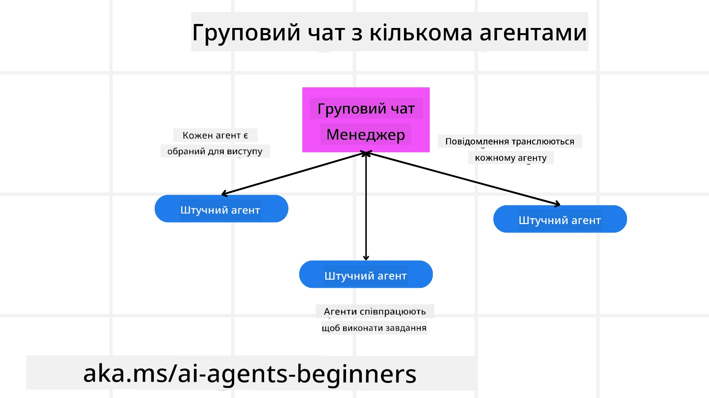
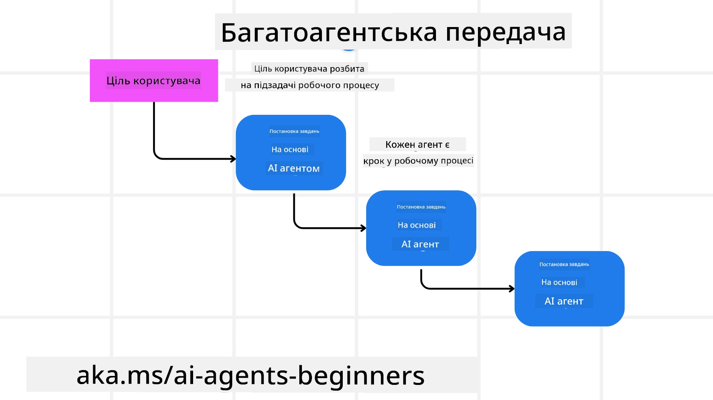
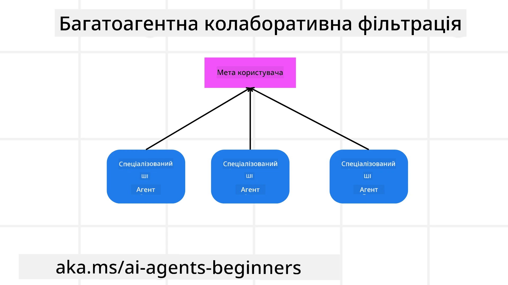

> _(Натисніть на зображення вище, щоб переглянути відео цього уроку)_

# Шаблони проектування мультиагентних систем

Як тільки ви починаєте працювати над проєктом, що включає кілька агентів, вам потрібно розглянути шаблон проектування мультиагентної системи. Однак може бути не одразу зрозуміло, коли перейти до мультиагентної системи і які переваги вона надає.

## Вступ

У цьому уроці ми прагнемо відповісти на такі питання:

- У яких сценаріях застосовуються мультиагенти?
- Які переваги використання мультиагентів порівняно з одним агентом, який виконує багато завдань?
- Які складові є для реалізації шаблону мультиагентного проектування?
- Як отримати видимість того, як кілька агентів взаємодіють між собою?

## Цілі навчання

Після цього уроку ви повинні вміти:

- Визначати сценарії, де застосовуються мультиагенти
- Визнавати переваги використання мультиагентів над одиничним агентом.
- Розуміти складові для реалізації шаблону мультиагентного проектування.

Яка тут ширша картина?

*Мультиагенти — це шаблон проектування, який дозволяє кільком агентам працювати разом для досягнення спільної мети*.

Цей шаблон широко використовується в різних галузях, зокрема в робототехніці, автономних системах та розподілених обчисленнях.

## Сценарії, коли застосовуються мультиагенти

Отже, які сценарії є хорошим випадком для використання мультиагентів? Відповідь полягає в тому, що існує багато сценаріїв, де задіяння кількох агентів є корисним, особливо у таких випадках:

- **Великі обсяги роботи**: Великі обсяги роботи можна розділити на менші завдання та призначити різним агентам, що дозволяє паралельну обробку і швидше виконання. Прикладом цього є велика задача обробки даних.
- **Складні завдання**: Складні завдання, як і великі обсяги роботи, можна розбити на менші підзавдання і призначити різним агентам, кожен з яких спеціалізується на певному аспекті завдання. Добрим прикладом є автономні транспортні засоби, де різні агенти керують навігацією, виявленням перешкод і комунікацією з іншими транспортними засобами.
- **Різноманітна експертиза**: Різні агенти можуть мати різну експертизу, що дозволяє їм ефективніше обробляти різні аспекти завдання, ніж один агент. Хорошим прикладом є сфера охорони здоров'я, де агенти можуть управляти діагностикою, планами лікування та моніторингом пацієнтів.

## Переваги використання мультиагентів порівняно з одиничним агентом

Система з одним агентом може добре працювати для простих завдань, але для складніших завдань використання кількох агентів має кілька переваг:

- **Спеціалізація**: Кожен агент може спеціалізуватися на конкретному завданні. Відсутність спеціалізації у одного агента означає, що у вас є агент, який може робити все, але може заплутатися, що робити при складному завданні. Наприклад, він може виконати завдання, до якого не найкраще підходить.
- **Масштабованість**: Легше масштабувати системи, додаючи більше агентів, ніж перевантажуючи одного.
- **Відмовостійкість**: Якщо один агент зазнає збою, інші можуть продовжувати працювати, забезпечуючи надійність системи.

Давайте розглянемо приклад, забронюємо подорож для користувача. Система з одним агентом має опрацьовувати всі аспекти процесу бронювання подорожі: пошук рейсів, бронювання готелів і оренду автомобілів. Щоб це здійснити одним агентом, він повинен мати інструменти для виконання всіх цих завдань. Це може призвести до складної і монолітної системи, яку важко підтримувати і масштабувати. Мультиагентна система, навпаки, може мати різних агентів, які спеціалізуються на пошуку рейсів, бронюванні готелів та оренді автомобілів. Це робить систему більш модульною, легкою для підтримки і масштабованою.

Порівняйте це з туристичним бюро, що працює як сімейний бізнес, і туристичним бюро, що працює як франшиза. Сімейний бізнес матиме одного агента, який обробляє всі аспекти бронювання подорожі, тоді як франшиза матиме різних агентів, які відповідають за різні аспекти процесу.

## Складові для реалізації шаблону мультиагентного проектування

Перш ніж впроваджувати шаблон мультиагентного проектування, потрібно зрозуміти складові, з яких складається цей шаблон.

Давайте зробимо це більш конкретно, знову розглядаючи приклад бронювання подорожі для користувача. У цьому випадку складові включають:

- **Комунікація агентів**: Агенти, що шукають рейси, бронюють готелі та орендують автомобілі, повинні спілкуватися та обмінюватися інформацією про уподобання й обмеження користувача. Потрібно визначити протоколи і методи такої комунікації. Конкретно це означає, що агент, який шукає рейси, повинен спілкуватися з агентом, що бронює готелі, щоб гарантувати, що готель заброньовано на ті ж дати, що й рейс. Отже, агенти повинні обмінюватися інформацією про дати поїздки користувача, тож потрібно вирішити *які агенти діляться інформацією і як вони це роблять*.
- **Механізми координації**: Агенти повинні координувати свої дії, щоб уподобання і обмеження користувача були дотримані. Наприклад, уподобання користувача може полягати в тому, що він хоче готель поруч з аеропортом, тоді як обмеження може бути в тому, що автомобілі орендуються лише в аеропорту. Це означає, що агент, що бронює готелі, мусить координувати свої дії з агентом, що бронює оренду авто, щоб відповідати уподобанням і обмеженням користувача. Це означає, що потрібно визначити *як агенти координують свої дії*.
- **Архітектура агентів**: Агенти повинні мати внутрішню структуру для прийняття рішень і навчання на взаємодії з користувачем. Це означає, що агент, що шукає рейси, має мати внутрішню структуру для прийняття рішень про те, які рейси рекомендувати користувачу. Потрібно визначити *як агенти приймають рішення і навчаються на взаємодії з користувачем*. Приклад навчання і покращення агента: агент пошуку рейсів може використовувати модель машинного навчання для рекомендацій рейсів на основі минулих уподобань користувача.
- **Видимість мультиагентної взаємодії**: Потрібно мати видимість того, як кілька агентів взаємодіють між собою. Це означає, що потрібні інструменти та техніки для відстеження активності та взаємодій агентів. Це може бути у вигляді засобів логування і моніторингу, інструментів візуалізації та показників продуктивності.
- **Мультиагентні шаблони**: Існують різні шаблони реалізації мультиагентних систем, як-от централізовані, децентралізовані і гібридні архітектури. Потрібно обрати шаблон, що найкраще підходить до вашого випадку.
- **Людина в циклі**: У більшості випадків у процесі буде людина, і потрібно керувати моментами, коли агенти мають звертатися за участю людини. Це може бути у вигляді запиту користувача на певний готель або рейс, який агенти не рекомендували, або запиту на підтвердження перед бронюванням.

## Видимість мультиагентної взаємодії

Важливо мати видимість того, як кілька агентів взаємодіють між собою. Ця видимість необхідна для налагодження, оптимізації та забезпечення загальної ефективності системи. Для цього потрібно мати інструменти і методики для відстеження активностей і взаємодій агентів. Це може бути у вигляді засобів логування і моніторингу, інструментів візуалізації та показників продуктивності.

Наприклад, у випадку бронювання подорожі для користувача можна мати інформаційну панель, яка показує статус кожного агента, уподобання й обмеження користувача та взаємодії між агентами. Ця панель може показувати дати подорожі користувача, рейси, які рекомендує агент з пошуку рейсів, готелі, які радить агент з бронювання готелів, і автомобілі, які пропонує агент оренди авто. Це дає чітке уявлення про те, як агенти взаємодіють і чи виконуються уподобання й обмеження користувача.

Розглянемо ці аспекти трохи детальніше.

- **Інструменти логування і моніторингу**: Потрібно здійснювати логування кожної дії агента. Запис у лог може містити інформацію про агента, який виконав дію, виконану дію, час, коли її було виконано, і результат дії. Цю інформацію потім можна використати для налагодження, оптимізації та інших цілей.

- **Інструменти візуалізації**: Інструменти візуалізації допомагають побачити взаємодії між агентами більш інтуїтивно. Наприклад, можна мати граф, що показує потік інформації між агентами. Це допоможе виявити вузькі місця, неефективність та інші проблеми.

- **Показники продуктивності**: Показники допомагають відстежувати ефективність мультиагентної системи. Наприклад, можна слідкувати за часом виконання завдань, кількістю виконаних завдань за одиницю часу і точністю рекомендацій агентів. Ця інформація допомагає виявляти напрями для покращення й оптимізувати систему.

## Мультиагентні шаблони

Розглянемо конкретні шаблони, які можна використати для створення мультиагентних додатків. Ось деякі цікаві шаблони, які варто розглянути:

### Груповий чат

Цей шаблон корисний, якщо ви хочете створити додаток групового чату, де кілька агентів можуть спілкуватися між собою. Типові випадки використання цього шаблону: командна співпраця, підтримка клієнтів і соціальні мережі.

У цьому шаблоні кожен агент представляє користувача в груповому чаті, а повідомлення обмінюються між агентами за допомогою протоколу обміну повідомленнями. Агенти можуть надсилати повідомлення групі, отримувати повідомлення від групи та відповідати іншим агентам.

Цей шаблон можна реалізувати за централізованою архітектурою, де всі повідомлення маршрутизуються через центральний сервер, або децентралізованою архітектурою, де повідомлення обмінюються безпосередньо.

### Передача завдань

Цей шаблон корисний, якщо ви хочете створити додаток, де кілька агентів можуть передавати завдання один одному.

Типові випадки використання: підтримка клієнтів, управління завданнями і автоматизація робочих процесів.

У цьому шаблоні кожен агент представляє завдання або крок у робочому процесі, і агенти можуть передавати завдання іншим агентам на основі заздалегідь визначених правил.

### Спільна фільтрація

Цей шаблон корисний, якщо ви хочете створити додаток, де кілька агентів можуть співпрацювати для формування рекомендацій для користувачів.

Чому варто мати кілька агентів, що співпрацюють? Тому що кожен агент має різний досвід і може по-різному впливати на процес рекомендацій.

Розглянемо приклад, де користувач хоче отримати рекомендацію щодо найкращої акції для купівлі на фондовому ринку.

- **Експерт індустрії**: Один агент може бути експертом у певній галузі.
- **Технічний аналіз**: Інший агент може бути експертом з технічного аналізу.
- **Фундаментальний аналіз**: І ще один агент може бути експертом фундаментального аналізу. Співпрацюючи, ці агенти можуть надати більш повну рекомендацію користувачу.

## Сценарій: процес повернення коштів

Розглянемо сценарій, коли клієнт намагається отримати повернення коштів за товар; у цьому процесі може бути задіяно багато агентів, але розділимо їх на спеціалізованих агентів для цього процесу і загальних агентів, які можна використовувати у інших процесах.

**Агенти, спеціалізовані на процесі повернення коштів**:

Нижче наведено деяких агентів, які можуть бути задіяні у процесі повернення коштів:

- **Агент клієнта**: Цей агент представляє клієнта і відповідає за ініціювання процесу повернення.
- **Агент продавця**: Цей агент представляє продавця і відповідає за обробку повернення.
- **Агент платежу**: Цей агент відповідає за процес платежів і повернення коштів клієнту.
- **Агент вирішення спорів**: Цей агент відповідає за врегулювання питань, що виникають під час процесу повернення.
- **Агент відповідності**: Цей агент забезпечує дотримання правил і політик під час процесу повернення коштів.

**Загальні агенти**:

Ці агенти можуть використовуватися іншими частинами вашого бізнесу.

- **Агент доставки**: Цей агент відповідає за повернення товару продавцеві. Його можна використовувати як у процесі повернення коштів, так і для загальної доставки товару, наприклад, при покупці.
- **Агент відгуків**: Цей агент відповідає за збір відгуків від клієнтів. Відгуки можна збирати у будь-який момент, не лише під час процесу повернення.
- **Агент ескалації**: Цей агент відповідає за передачу проблем на вищий рівень підтримки. Такий агент можна використовувати у будь-якому процесі, де потрібно ескалувати проблему.
- **Агент сповіщень**: Цей агент відповідає за надсилання повідомлень клієнту на різних етапах процесу повернення.
- **Агент аналітики**: Цей агент відповідає за аналіз даних, пов’язаних із процесом повернення коштів.
- **Агент аудиту**: Цей агент відповідає за аудит процесу повернення коштів, щоб переконатися у правильності його виконання.
- **Агент звітності**: Цей агент відповідає за формування звітів про процес повернення.
- **Агент знань**: Цей агент відповідає за підтримку бази знань, пов’язаної з процесом повернення коштів. Цей агент може мати знання як про повернення, так і про інші сфери вашого бізнесу.
- **Агент безпеки**: Цей агент відповідає за забезпечення безпеки процесу повернення коштів.
- **Агент контролю якості**: Цей агент відповідає за забезпечення якості процесу повернення коштів.

Перерахованих агентів досить багато, як для конкретного процесу повернення, так і для загальних агентів, що можуть використовуватися в інших частинах вашого бізнесу. Сподіваюся, це дає вам уявлення про те, як ви можете обрати агентів для вашої мультиагентної системи.

## Завдання

Розробіть мультиагентну систему для процесу підтримки клієнтів. Визначте агентів, що беруть участь у процесі, їхні ролі та обов’язки, а також як вони взаємодіятимуть між собою. Розгляньте як агентів, специфічних для процесу підтримки клієнтів, так і загальних агентів, які можуть використовуватися в інших частинах вашого бізнесу.

> Подумайте, перш ніж читати наступне рішення, вам може знадобитися більше агентів, ніж ви вважаєте.

> ПОРАДА: Подумайте про різні етапи процесу підтримки клієнтів, а також врахуйте агентів, які потрібні для будь-якої системи.

## Рішення

[Рішення](./solution/solution.md)

## Перевірка знань

### Питання 1

Який сценарій найкраще підходить для системи з кількома агентами?

- [ ] A1: Підтримуючий бот відповідає на поширені питання, використовуючи одну базу знань і невеликий набір інструментів.
- [ ] A2: Робочий процес повернення коштів вимагає окремих ролей для боротьби з шахрайством, платежами та відповідністю, кожна з яких має свої інструменти, і їхні результати повинні бути координовані.
- [ ] A3: Однакові прості запити на класифікацію надходять тисячами разів на годину.

### Питання 2

Коли зазвичай краще використати одного агента?

- [ ] A1: Завдання можна виконати за допомогою одного набору інструкцій і інструментів, без передачі до фахівців.
- [ ] A2: Агент має доступ до більш ніж одного інструменту.
- [ ] A3: Робочий процес вимагає окремих ролей із різними дозволами та незалежними аудиторськими записами.

[Рішення вікторини](./solution/solution-quiz.md)

## Підсумок

У цьому уроці ми розглянули шаблон проєктування з кількома агентами, включаючи сценарії, де застосовуються кілька агентів, переваги використання кількох агентів замість одного, основи впровадження цього шаблону і як отримувати уявлення про взаємодію між агентами.

### Маєте більше запитань про шаблон проєктування з кількома агентами?

Приєднуйтесь до [Microsoft Foundry Discord](https://discord.com/invite/ATgtXmAS5D), щоб зустрітися з іншими учнями, відвідати години консультацій і отримати відповіді на ваші запитання про AI агенти.

## Додаткові ресурси

- <a href="https://learn.microsoft.com/azure/ai-services/agents/overview" target="_blank">Документація Microsoft Agent Framework</a>
- <a href="https://www.analyticsvidhya.com/blog/2024/10/agentic-design-patterns/" target="_blank">Шаблони агентного проєктування</a>

## Попередній урок

[Планування проєктування](../07-planning-design/README.md)

## Наступний урок

[Метакогніція в AI агентах](../09-metacognition/README.md)

---

<!-- CO-OP TRANSLATOR DISCLAIMER START -->
**Відмова від відповідальності**:
Цей документ було перекладено за допомогою сервісу штучного інтелекту для перекладу [Co-op Translator](https://github.com/Azure/co-op-translator). Хоча ми прагнемо до точності, будь ласка, майте на увазі, що автоматичні переклади можуть містити помилки або неточності. Оригінальний документ рідною мовою слід вважати авторитетним джерелом. Для критично важливої інформації рекомендується професійний людський переклад. Ми не несемо відповідальності за будь-які непорозуміння або неправильні тлумачення, що виникли внаслідок використання цього перекладу.
<!-- CO-OP TRANSLATOR DISCLAIMER END -->