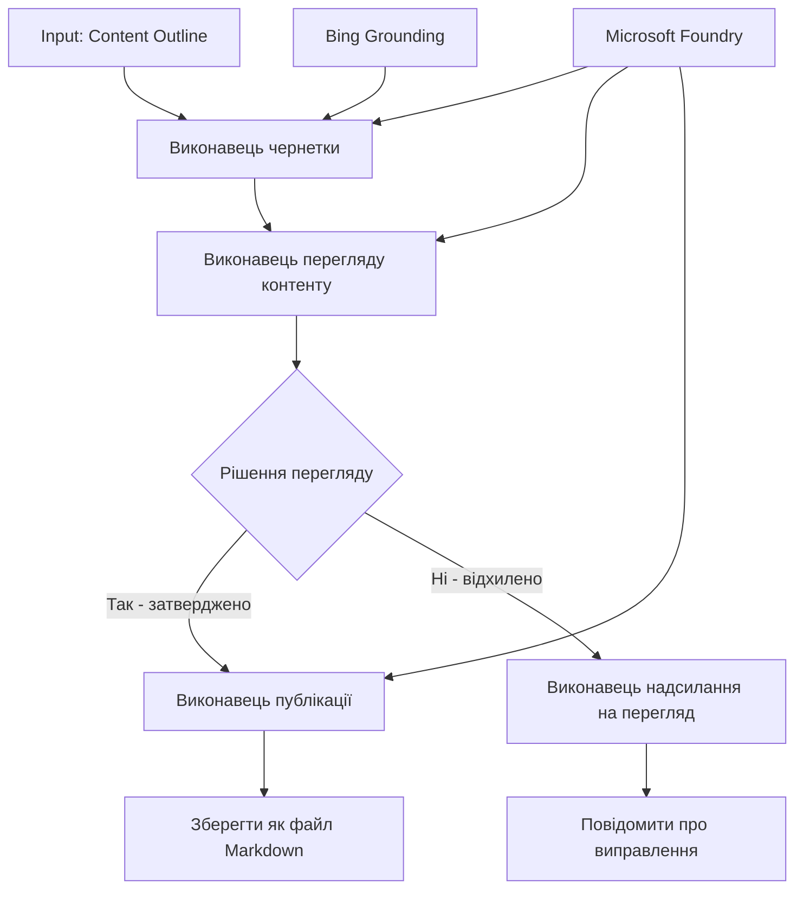

# 🔀 Умовні робочі процеси агентів за допомогою Microsoft Foundry (.NET)

## 📋 Навчальний посібник з інтелектуальних робочих процесів на основі рішень

Цей нотатник демонструє **умовні шаблони робочих процесів** з використанням Microsoft Foundry та Microsoft Agent Framework для .NET. Ви навчитеся створювати складні робочі процеси, керовані рішеннями, які інтелектуально направляють обробку на основі аналізу ШІ, бізнес-правил і динамічних умов для автоматизації корпоративного рівня.

## 🎯 Цілі навчання

### 🧠 **Інтелектуальна архітектура прийняття рішень**
- **Реалізація умовної логіки**: Створення складних дерева рішень з кількома гілками
- **Маршрутизація на основі ІІ**: Використання моделей Microsoft Foundry для інтелектуального прийняття рішень про маршрутизацію
- **Динамічна адаптація робочого процесу**: Зміна поведінки робочого процесу на основі аналізу та умов під час виконання
- **Інтеграція корпоративних правил**: Включення бізнес-логіки та вимог відповідності у робочі процеси

### 🔀 **Розширені умовні шаблони**
- **Прийняття рішень за кількома критеріями**: Оцінка декількох факторів для прийняття рішень про маршрутизацію
- **Обробка з врахуванням контексту**: Прийняття рішень на основі накопиченого контексту та історії робочого процесу
- **Адаптивна модифікація робочого процесу**: Динамічна зміна шляхів обробки на основі умов у режимі реального часу
- **Інтеграція движка правил**: Впровадження складних бізнес-правил у робочі процеси

### 🏢 **Корпоративні умовні застосунки**
- **Класифікація та маршрутизація документів**: Автоматична класифікація й маршрутизація документів до відповідних робочих процесів
- **Тріаж клієнтської служби**: Інтелектуальна маршрутизація звернень клієнтів до спеціалізованих команд
- **Відповідність і обробка ризиків**: Застосування різних процесів перевірки на основі оцінки ризиків
- **Робочі процеси забезпечення якості**: Направлення контенту до відповідних процесів перевірки на основі показників якості

## ⚙️ Передумови та налаштування

### 📦 **Потрібні пакети NuGet**

Розширені пакети для обробки умовних робочих процесів:

```xml
<!-- Core AI Framework -->
<PackageReference Include="Microsoft.Extensions.AI" Version="9.9.0" />

<!-- Azure AI Agents with Persistent State -->
<PackageReference Include="Azure.AI.Agents.Persistent" Version="1.2.0-beta.5" />

<!-- Azure Identity and Utilities -->
<PackageReference Include="Azure.Identity" Version="1.15.0" />
<PackageReference Include="System.Linq.Async" Version="6.0.3" />
<PackageReference Include="DotNetEnv" Version="3.1.1" />

<!-- Local Workflow Framework References -->
<!-- Microsoft.Agents.Workflows.dll - Advanced workflow orchestration -->
<!-- Microsoft.Agents.AI.AzureAI.dll - Microsoft Foundry integration -->
<!-- Microsoft.Agents.AI.dll - Core agent abstractions -->
```

### 🔑 **Конфігурація Microsoft Foundry**

**Потрібні ресурси Azure:**
- Робочий простір Microsoft Foundry з моделями умовної обробки
- Підписка Azure з відповідними квотами обчислень і дозволами
- Розгорнуті моделі ШІ для прийняття рішень та аналізу контенту
- (Опціонально) Підключення до Bing Search API для можливостей пошуку

**Конфігурація середовища (.env файл):**
```env
# Microsoft Foundry Configuration
AZURE_AI_PROJECT_ENDPOINT=https://your-project.cognitiveservices.azure.com/
BING_CONNECTION_ID=your-bing-connection-id
```

**Налаштування аутентифікації:**
```csharp
// Azure CLI or Managed Identity authentication
using Azure.Identity;
var credential = new AzureCliCredential();

// Load environment configuration
DotNetEnv.Env.Load("../../../.env");
```

### 🏗️ **Архітектура умовного робочого процесу**



**Ключові компоненти:**
- **Draft Executor**: агент ШІ, який створює початкові чернетки контенту з планів
- **Content Review Executor**: агент ШІ, що оцінює якість і відповідність чернеток
- **Умовна маршрутизація**: логіка прийняття рішень, що спрямовує обробку на основі результатів перевірки
- **Шляхи публікації/перевірки**: окремі шляхи обробки для схваленого та відхиленого контенту
- **Управління станом**: підтримує контекст контенту та перевірок протягом робочого процесу

## 🎨 **Шаблони проектування умовних робочих процесів**

### 📋 **Виробництво контенту з контрольними точками якості**
```
Outline → Draft Creation → Quality Review → {Approve: Publish | Reject: Revise}
```

### 🎯 **Обробка документів на основі ризиків**
```
Document → Risk Assessment → {Low: Standard | High: Enhanced Review}
```

### 🔍 **Інтелектуальна маршрутизація клієнтської служби**
```
Customer Query → Analysis → {Simple: FAQ Bot | Complex: Human Agent}
```

### 💼 **Робочі процеси, керовані відповідністю**
```
Content → Compliance Check → {Pass: Publish | Fail: Legal Review}
```

## 🏢 **Корпоративні вигоди умовних процесів**

### 🎯 **Інтелектуальна автоматизація**
- **Розумне прийняття рішень**: рішення про маршрутизацію на основі аналізу контенту та контексту з підтримкою ШІ
- **Адаптивна обробка**: робочі процеси, що автоматично підлаштовуються під змінні умови
- **Застосування бізнес-правил**: автоматичне впровадження складної бізнес-логіки і політик
- **Маршрутизація з врахуванням контексту**: рішення на основі повної історії робочого процесу та накопиченого контексту

### 📈 **Операційна досконалість**
- **Оптимізоване розподілення ресурсів**: направлення роботи до найбільш відповідних фахівців і процесів
- **Зменшення ручного втручання**: автоматизоване прийняття рішень мінімізує потребу в ручній маршрутизації
- **Прискорення часу вирішення**: пряме направлення до відповідної експертизи та можливостей обробки
- **Послідовне застосування**: однорідне впровадження бізнес-правил і критеріїв прийняття рішень

### 🛡️ **Управління ризиками та відповідність**
- **Автоматична оцінка ризиків**: оцінка рівнів ризику контенту та ситуації за допомогою ШІ
- **Забезпечення відповідності**: автоматична маршрутизація через необхідні регуляторні процеси
- **Застосування протоколів безпеки**: посилені заходи безпеки на основі оцінки ризиків
- **Ведення аудиту**: повна документація рішень маршрутизації та їх обґрунтування

### 📊 **Аналітика та постійне вдосконалення**
- **Аналітика рішень**: відстеження ефективності і точності рішень про маршрутизацію
- **Розпізнавання шаблонів**: виявлення тенденцій і патернів у рішеннях маршрутизації з часом
- **Оптимізація продуктивності**: постійне вдосконалення критеріїв прийняття рішень та ефективності маршрутизації
- **Бізнес-аналітика**: розуміння характеристик контенту та вимог до обробки

### 🔧 **Технічна досконалість**
- **Підтримка стійкого стану**: збереження складного стану під час виконання робочого процесу
- **Масштабована архітектура**: підтримка високопродуктивної умовної обробки
- **Можливості інтеграції**: безшовна інтеграція з існуючими бізнес-системами та процесами
- **Моніторинг і спостережуваність**: комплексне відстеження продуктивності робочого процесу і прийнятих рішень

Давайте створимо інтелектуальні, керовані рішеннями корпоративні робочі процеси з .NET! 🚀

## 💻 Запуск коду

Повна реалізація доступна у файлі `04.dotnet-agent-framework-workflow-aifoundry-condition.cs`. Вона демонструє **робочий процес виробництва контенту з контрольними точками якості**:

### 🏗️ **Архітектура робочого процесу**

```
Content Outline → Draft Creation → Quality Review → Conditional Routing:
                                                      ├─ Approved (>200 words) → Publish
                                                      └─ Rejected (<200 words) → Review Notification
```

**Агенти у робочому процесі:**
1. **Evangelist Agent**: створює чернетки керівництва з планів з підключенням Bing як джерела
2. **Content Reviewer Agent**: оцінює якість чернеток (кількість слів, повнота)
3. **Publisher Agent**: зберігає затверджений контент у вигляді файлів Markdown із часовими мітками

**Користувацькі виконавці:**
1. **DraftExecutor**: координує створення чернеток
2. **ContentReviewExecutor**: виконує оцінку якості
3. **PublishExecutor**: опрацьовує публікацію затвердженого контенту
4. **SendReviewExecutor**: керує повідомленнями про відмову вчернетках

### 🚀 Запуск прикладу

**Передумови:**
- Налаштований робочий простір Microsoft Foundry
- Аутентифікація через Azure CLI (`az login`)
- (Опціонально) з'єднання Bing Search для підключення

```bash
# Зробіть скрипт виконуваним (Unix/Linux/macOS)
chmod +x 04.dotnet-agent-framework-workflow-aifoundry-condition.cs

# Запустіть умовний робочий процес
./04.dotnet-agent-framework-workflow-aifoundry-condition.cs
```

Або на Windows:
```powershell
dotnet run 04.dotnet-agent-framework-workflow-aifoundry-condition.cs
```

### 📝 Очікуваний результат

Робочий процес:
1. **Створює агентів**: ініціалізує трьох спеціалізованих агентів Microsoft Foundry
2. **Генерує чернетку**: агент Evangelist створює чернетку керівництва з плану
3. **Перевіряє контент**: агент Content Reviewer оцінює якість чернетки
4. **Умовна маршрутизація**:
   - **Якщо схвалено (>200 слів)**: PublishExecutor зберігає файл Markdown
   - **Якщо відхилено (<200 слів)**: надсилається повідомлення про перевірку
5. **Відображає результати**: показує кінцевий результат робочого процесу

### 🔧 Варіанти налаштування

**Змінити критерії перевірки:**
```csharp
const string ContentReviewerInstructions = @"
You are a content reviewer...
1. Check if content is more than 500 words (instead of 200)
2. Verify technical accuracy
3. Ensure proper formatting
...";
```

**Додати більше умовних шляхів:**
```csharp
var workflow = new WorkflowBuilder(draftExecutor)
    .AddEdge(draftExecutor, contentReviewerExecutor)
    .AddEdge(contentReviewerExecutor, publishExecutor, condition: GetCondition("Excellent"))
    .AddEdge(contentReviewerExecutor, editExecutor, condition: GetCondition("Good"))
    .AddEdge(contentReviewerExecutor, sendReviewerExecutor, condition: GetCondition("Poor"))
    .Build();
```

**Змінити вимоги до контенту:**
```csharp
string OUTLINE_Content = @"
# Your Custom Topic
## Section 1
https://your-reference-url
## Section 2
...
";
```

### 🎯 Застосування в реальному світі

Цей умовний шаблон робочого процесу ідеальний для:
- **Систем управління контентом**: автоматизовані редакційні робочі процеси з контрольними точками якості
- **Обробки документів**: маршрутизація документів за класифікацією та відповідністю
- **Підтримки клієнтів**: інтелектуальна маршрутизація звернень за складністю та терміновістю
- **Юридичної перевірки**: маршрутизація контрактів за оцінкою ризику та вартості
- **HR-процесів**: направлення заяв на відповідні етапи перевірки

### 🔍 Розуміння умовної логіки

**Функція умови:**
```csharp
public Func<object?, bool> GetCondition(string expectedResult) =>
    reviewResult => reviewResult is ReviewResult review && review.Result == expectedResult;
```

Ця функція створює предикат, який:
1. Перевіряє, чи результат є типом `ReviewResult`
2. Порівнює властивість `Result` із очікуваним значенням
3. Повертає true/false для визначення маршруту

**Крайові умови робочого процесу:**
```csharp
.AddEdge(contentReviewerExecutor, publishExecutor, condition: GetCondition("Yes"))
.AddEdge(contentReviewerExecutor, sendReviewerExecutor, condition: GetCondition("No"))
```

### 📊 Розширені можливості

**Перевірка відповідності JSON-схемам:**
Робочий процес використовує JSON-схеми для забезпечення структурованих відповідей:

```csharp
// Define response structure
public class ReviewResult
{
    [JsonPropertyName("review_result")]
    public string Result { get; set; } = string.Empty;
    
    [JsonPropertyName("reason")]
    public string Reason { get; set; } = string.Empty;
    
    [JsonPropertyName("draft_content")]
    public string DraftContent { get; set; } = string.Empty;
}

// Apply to agent
ResponseFormat = ChatResponseFormat.ForJsonSchema(
    AIJsonUtilities.CreateJsonSchema(typeof(ReviewResult)), 
    "ReviewResult", 
    "Review Result From DraftContent"
)
```

**Інтеграція з Bing Grounding:**
Агент Evangelist використовує Bing grounding для доступу до актуальної інформації:

```csharp
var bingGroundingConfig = new BingGroundingSearchConfiguration(bing_conn_id);
BingGroundingToolDefinition bingGroundingTool = new(
    new BingGroundingSearchToolParameters([bingGroundingConfig])
);
```

Це дозволяє агенту переходити за URL у плані та отримувати актуальні відомості.

### 🛡️ Обробка помилок

Робочий процес включає надійну обробку помилок для відхиленого контенту:
- Неуспішні перевірки переходять на альтернативний шлях
- Повідомлення містять чіткі причини відмови
- Контент зберігається для доопрацювання

### 🔄 Розширення робочого процесу

**Додати цикл доопрацювання:**
Створіть цикл зворотного зв’язку для автоматичного перероблення контенту:

```csharp
.AddEdge(contentReviewerExecutor, publishExecutor, condition: GetCondition("Yes"))
.AddEdge(contentReviewerExecutor, draftExecutor, condition: GetCondition("No")) // Loop back
```

**Реалізувати багаторівневу перевірку:**
Додайте кілька етапів перевірки з різними критеріями:

```csharp
.AddEdge(draftExecutor, technicalReviewer)
.AddEdge(technicalReviewer, editorialReviewer, condition: GetCondition("TechPass"))
.AddEdge(editorialReviewer, publishExecutor, condition: GetCondition("EditPass"))
```

Цей умовний шаблон робочого процесу є основою для створення складних, інтелектуальних систем автоматизації підприємства! 🚀

---

<!-- CO-OP TRANSLATOR DISCLAIMER START -->
**Відмова від відповідальності**:
Цей документ було перекладено за допомогою сервісу штучного інтелекту для перекладу [Co-op Translator](https://github.com/Azure/co-op-translator). Хоча ми прагнемо до точності, будь ласка, майте на увазі, що автоматичні переклади можуть містити помилки або неточності. Оригінальний документ рідною мовою слід вважати авторитетним джерелом. Для критично важливої інформації рекомендується професійний людський переклад. Ми не несемо відповідальності за будь-які непорозуміння або неправильні тлумачення, що виникли внаслідок використання цього перекладу.
<!-- CO-OP TRANSLATOR DISCLAIMER END -->