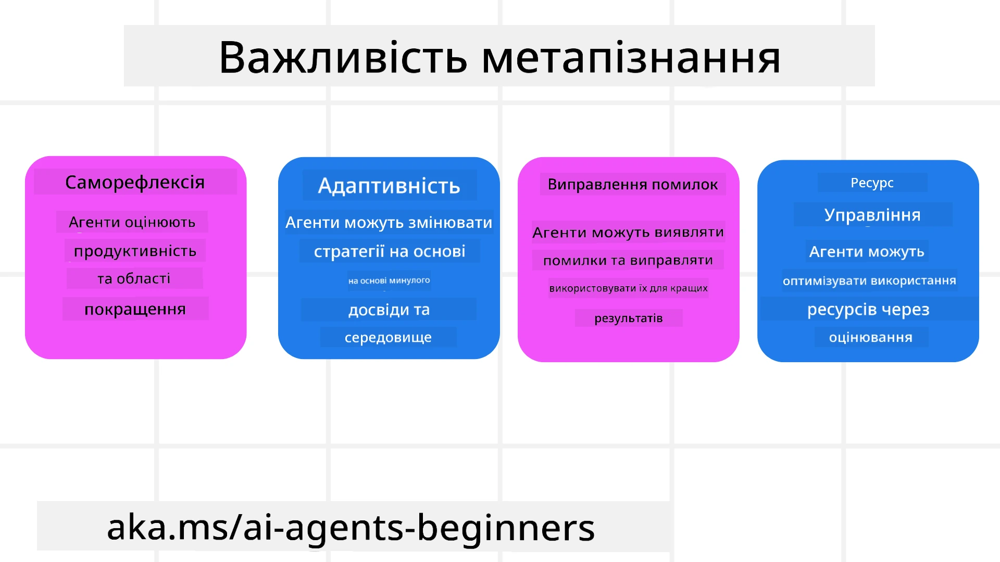
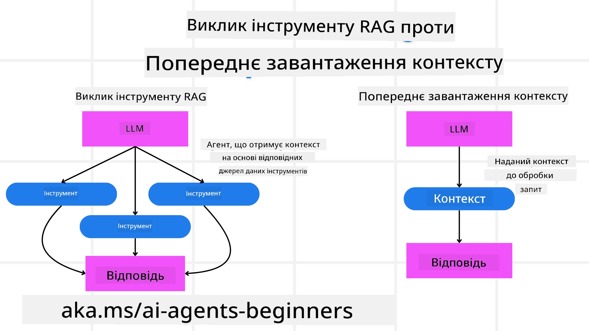

[](https://youtu.be/His9R6gw6Ec?si=3_RMb8VprNvdLRhX)

> _(Клікніть на зображення вище, щоб переглянути відеоурок)_
# Метакогніція в AI агентах

## Вступ

Ласкаво просимо на урок про метакогніцію в AI агентах! Цей розділ призначений для початківців, які цікавляться тим, як AI агенти можуть усвідомлювати власні процеси мислення. До кінця цього уроку ви зрозумієте ключові концепції та отримаєте практичні приклади застосування метакогніції в проєктуванні AI агентів.

## Мети навчання

Після завершення цього уроку ви зможете:

1. Розуміти наслідки циклів міркувань у визначеннях агентів.
2. Використовувати техніки планування та оцінювання для допомоги агентам, що самокоригуються.
3. Створювати власних агентів, здатних маніпулювати кодом для виконання завдань.

## Вступ до метакогніції

Метакогніція означає вищі когнітивні процеси, що включають роздуми про власне мислення. Для AI агентів це здатність оцінювати і коригувати свої дії на основі самосвідомості та минулого досвіду. Метакогніція, або "мислення про мислення", є важливим поняттям у розробці агентних AI систем. Це полягає у тому, що AI системи усвідомлюють власні внутрішні процеси і можуть контролювати, регулювати й адаптувати свою поведінку відповідно. Як ми робимо, коли читаємо атмосферу чи аналізуємо проблему. Ця самосвідомість допомагає AI системам приймати кращі рішення, виявляти помилки та покращувати результати з часом — знову повертаючись до тесту Тьюринга та дебатів про те, чи захопить AI світ.

У контексті агентних AI систем метакогніція допомагає розв’язувати кілька проблем, таких як:
- Прозорість: Забезпечення того, щоб AI системи могли пояснювати свої міркування та рішення.
- Міркування: Покращення здатності AI систем синтезувати інформацію та приймати раціональні рішення.
- Адаптація: Дозволяє AI системам пристосовуватися до нових середовищ і змінних умов.
- Сприйняття: Підвищення точності AI систем у розпізнаванні та тлумаченні даних із середовища.

### Що таке метакогніція?

Метакогніція, або "мислення про мислення", — це вищий когнітивний процес, що включає самосвідомість і саморегуляцію власних когнітивних процесів. У сфері AI метакогніція дає агентам змогу оцінювати та адаптувати свої стратегії і дії, що призводить до покращення здатності розв’язувати проблеми та приймати рішення. Розуміючи метакогніцію, ви можете створювати AI агентів, які будуть не лише розумнішими, а й більш адаптивними й ефективними. Справжня метакогніція означає, що AI явно розмірковує про власний процес мислення.

Приклад: “Я обрав дешевші рейси, тому що... Можливо, я пропускаю прямі рейси, тому перевірю знову.”.
Відстеження, як і чому було обрано певний маршрут.
- Визнання помилок через надмірну залежність від уподобань користувача з минулого разу, тому він коригує свою стратегію прийняття рішень, а не тільки кінцеву рекомендацію.
- Виявлення закономірностей, наприклад: “Якщо користувач згадує ‘занадто багатолюдно,’ я повинен не лише прибрати певні атракції, але й відображати, що мій метод вибору ‘топ атракцій’ помилковий, якщо я завжди ранжую за популярністю.”

### Важливість метакогніції для AI агентів

Метакогніція відіграє ключову роль у проєктуванні AI агентів з кількох причин:



- Саморефлексія: Агенти оцінюють власну продуктивність і визначають напрямки для покращення.
- Адаптивність: Агенти можуть коригувати стратегії на основі минулого досвіду та змін у середовищі.
- Корекція помилок: Агенти можуть виявляти та виправляти помилки автономно, що підвищує точність результатів.
- Управління ресурсами: Агенти оптимізують використання ресурсів, таких як час і обчислювальна потужність, завдяки плануванню та оцінці дій.

## Компоненти AI агента

Перед тим як занурюватись у метакогнітивні процеси, важливо розуміти базові компоненти AI агента. Типовий AI агент складається з:

- Персона: Особистість і характеристики агента, що визначають, як він взаємодіє з користувачами.
- Інструменти: Здатності та функції, які агент може виконувати.
- Навички: Знання та експертиза, які агент має.

Ці компоненти разом утворюють "одиницю експертизи", здатну виконувати конкретні завдання.

**Приклад**:
Розглянемо туристичного агента, сервіс агента, що не лише планує вашу відпустку, але й коригує свій маршрут на основі даних у режимі реального часу та минулого досвіду клієнта.

### Приклад: Метакогніція в туристичному агенті

Уявіть, що ви проектуєте сервіс туристичного агента на базі AI. Цей агент, "Туристичний агент," допомагає користувачам планувати відпустку. Щоб включити метакогніцію, Туристичному агенту потрібно оцінювати і коригувати свої дії на основі самосвідомості та минулого досвіду. Ось як метакогніція може грати роль:

#### Поточне завдання

Поточне завдання — допомогти користувачеві спланувати подорож до Парижа.

#### Кроки для виконання завдання

1. **Збір уподобань користувача**: Запитайте у користувача дати подорожі, бюджет, інтереси (наприклад, музеї, кухня, шопінг) та будь-які конкретні вимоги.
2. **Отримання інформації**: Знайдіть варіанти авіарейсів, проживання, атракцій і ресторанів, що відповідають уподобанням користувача.
3. **Генерація рекомендацій**: Надати персоналізований маршрут із деталями рейсів, бронюванням готелів і запропонованими заходами.
4. **Коригування на основі відгуків**: Запитайте у користувача зворотній зв’язок щодо рекомендацій і внесіть необхідні корективи.

#### Необхідні ресурси

- Доступ до баз даних бронювання авіарейсів і готелів.
- Інформація про парижські атракції та ресторани.
- Дані зворотного зв’язку користувача з попередніх взаємодій.

#### Досвід і саморефлексія

Туристичний агент використовує метакогніцію для оцінки своєї роботи та навчання на основі минулого досвіду. Наприклад:

1. **Аналіз зворотного зв’язку користувачів**: Туристичний агент переглядає відгуки користувача, щоб визначити, які рекомендації були прийняті добре, а які — ні, і відповідно коригує майбутні пропозиції.
2. **Адаптивність**: Якщо користувач раніше висловлював невподобання до багатолюдних місць, Туристичний агент у майбутньому уникатиме рекомендувати популярні туристичні локації у піковий час.
3. **Корекція помилок**: Якщо Туристичний агент допустив помилку в минулому бронюванні, наприклад рекомендував готель, де не було місць, він навчається ретельніше перевіряти доступність перед пропозицією.

#### Практичний приклад для розробника

Ось спрощений приклад коду Travel Agent з впровадженням метакогніції:

```python
class Travel_Agent:
    def __init__(self):
        self.user_preferences = {}
        self.experience_data = []

    def gather_preferences(self, preferences):
        self.user_preferences = preferences

    def retrieve_information(self):
        # Пошук авіарейсів, готелів та атракцій на основі уподобань
        flights = search_flights(self.user_preferences)
        hotels = search_hotels(self.user_preferences)
        attractions = search_attractions(self.user_preferences)
        return flights, hotels, attractions

    def generate_recommendations(self):
        flights, hotels, attractions = self.retrieve_information()
        itinerary = create_itinerary(flights, hotels, attractions)
        return itinerary

    def adjust_based_on_feedback(self, feedback):
        self.experience_data.append(feedback)
        # Аналіз відгуків та коригування майбутніх рекомендацій
        self.user_preferences = adjust_preferences(self.user_preferences, feedback)

# Приклад використання
travel_agent = Travel_Agent()
preferences = {
    "destination": "Paris",
    "dates": "2025-04-01 to 2025-04-10",
    "budget": "moderate",
    "interests": ["museums", "cuisine"]
}
travel_agent.gather_preferences(preferences)
itinerary = travel_agent.generate_recommendations()
print("Suggested Itinerary:", itinerary)
feedback = {"liked": ["Louvre Museum"], "disliked": ["Eiffel Tower (too crowded)"]}
travel_agent.adjust_based_on_feedback(feedback)
```

#### Чому метакогніція важлива

- **Саморефлексія**: Агенти можуть аналізувати свою продуктивність і визначати напрями для покращення.
- **Адаптивність**: Агенти можуть змінювати стратегії на основі зворотного зв’язку та змінних умов.
- **Корекція помилок**: Агенти можуть автономно виявляти та виправляти помилки.
- **Управління ресурсами**: Агенти оптимізують використання ресурсів, таких як час і обчислювальна потужність.

Впроваджуючи метакогніцію, Туристичний агент може надавати більш персоналізовані й точні рекомендації, підвищуючи загальний досвід користувача.

---

## 2. Планування агентів

Планування є критичною складовою поведінки AI агента. Воно включає визначення кроків, необхідних для досягнення мети, з урахуванням поточного стану, ресурсів і можливих перешкод.

### Елементи планування

- **Поточне завдання**: Чітко визначте завдання.
- **Кроки для виконання завдання**: Розбийте завдання на керовані кроки.
- **Необхідні ресурси**: Визначте необхідні ресурси.
- **Досвід**: Використовуйте минулий досвід для інформування планування.

**Приклад**:
Ось кроки, які Туристичний агент повинен виконати, щоб ефективно допомогти користувачеві спланувати подорож:

### Кроки для Туристичного агента

1. **Збір уподобань користувача**
   - Запитайте у користувача про дати подорожі, бюджет, інтереси й будь-які специфічні вимоги.
   - Приклади: "Коли ви плануєте подорож?" "Який у вас бюджет?" "Які види активностей ви любите під час відпочинку?"

2. **Отримання інформації**
   - Шукайте відповідні варіанти подорожі на основі уподобань користувача.
   - **Авіарейси**: Знайдіть доступні рейси у вказаний бюджет і дати.
   - **Проживання**: Підберіть готелі або орендне житло, що відповідає вподобанням користувача щодо місця, ціни та зручностей.
   - **Атракції та ресторани**: Визначте популярні місця, заходи і ресторани, які відповідають інтересам користувача.

3. **Генерація рекомендацій**
   - Скомпілюйте отриману інформацію у персоналізований маршрут.
   - Надання інформації, такої як варіанти рейсів, бронювання готелів і запропоновані заходи, відповідно до вподобань користувача.

4. **Представлення маршруту користувачу**
   - Надішліть запропонований маршрут користувачу для перегляду.
   - Приклад: "Ось запропонований маршрут для вашої поїздки до Парижа. Він включає деталі рейсів, бронювання готелів і список рекомендованих заходів і ресторанів. Поділіться своїми думками!"

5. **Збір відгуків**
   - Запитайте користувача про його думку щодо запропонованого маршруту.
   - Приклади: "Чи підходять вам варіанти рейсів?" "Чи відповідає готель вашим потребам?" "Чи хочете додати або видалити якісь заходи?"

6. **Коригування на основі відгуків**
   - Змініть маршрут у відповідності з відгуками користувача.
   - Внесіть необхідні зміни в рекомендації щодо рейсів, проживання та заходів, щоб краще відповідати вподобанням користувача.

7. **Остаточне підтвердження**
   - Представте оновлений маршрут користувачу для фінального підтвердження.
   - Приклад: "Я вніс зміни відповідно до ваших побажань. Ось оновлений маршрут. Чи все вас влаштовує?"

8. **Бронювання та підтвердження**
   - Після затвердження маршруту користувачем приступайте до бронювання рейсів, проживання та запланованих заходів.
   - Надішліть користувачу підтвердження.

9. **Надання постійної підтримки**
   - Будьте на зв’язку, щоб допомогти користувачу із змінами або додатковими запитами до і під час подорожі.
   - Приклад: "Якщо вам потрібна додаткова допомога під час подорожі, звертайтеся до мене в будь-який час!"

### Приклад взаємодії

```python
class Travel_Agent:
    def __init__(self):
        self.user_preferences = {}
        self.experience_data = []

    def gather_preferences(self, preferences):
        self.user_preferences = preferences

    def retrieve_information(self):
        flights = search_flights(self.user_preferences)
        hotels = search_hotels(self.user_preferences)
        attractions = search_attractions(self.user_preferences)
        return flights, hotels, attractions

    def generate_recommendations(self):
        flights, hotels, attractions = self.retrieve_information()
        itinerary = create_itinerary(flights, hotels, attractions)
        return itinerary

    def adjust_based_on_feedback(self, feedback):
        self.experience_data.append(feedback)
        self.user_preferences = adjust_preferences(self.user_preferences, feedback)

# Приклад використання в запиті на бронювання
travel_agent = Travel_Agent()
preferences = {
    "destination": "Paris",
    "dates": "2025-04-01 to 2025-04-10",
    "budget": "moderate",
    "interests": ["museums", "cuisine"]
}
travel_agent.gather_preferences(preferences)
itinerary = travel_agent.generate_recommendations()
print("Suggested Itinerary:", itinerary)
feedback = {"liked": ["Louvre Museum"], "disliked": ["Eiffel Tower (too crowded)"]}
travel_agent.adjust_based_on_feedback(feedback)
```

## 3. Система коригуючого RAG

Спершу розглянемо різницю між RAG інструментом і прогнозним завантаженням контексту.



### Retrieval-Augmented Generation (RAG)

RAG поєднує систему пошуку з генеративною моделлю. Коли надходить запит, система пошуку отримує релевантні документи або дані з зовнішнього джерела, а ця інформація використовується для доповнення вхідних даних у генеративну модель. Це допомагає моделі створювати більш точні та контекстно релевантні відповіді.

У системі RAG агент отримує релевантну інформацію з бази знань і використовує її для генерації відповідних відповідей або дій.

### Коригуючий підхід RAG

Підхід Коригуючого RAG спрямований на використання технік RAG для виправлення помилок і підвищення точності AI агентів. Це включає:

1. **Техніка запитів**: Використання конкретних запитів, що направляють агента у отриманні релевантної інформації.
2. **Інструмент**: Впровадження алгоритмів і механізмів, які дозволяють агенту оцінювати релевантність отриманої інформації і створювати точні відповіді.
3. **Оцінка**: Постійна оцінка продуктивності агента і внесення змін для підвищення його точності й ефективності.

#### Приклад: Коригуючий RAG у пошуковому агенті

Розглянемо пошуковий агент, який отримує інформацію з вебу для відповіді на запити користувачів. Підхід Коригуючого RAG може включати:

1. **Техніка запитів**: Формулювання пошукових запитів на основі введення користувача.
2. **Інструмент**: Використання алгоритмів обробки природної мови та машинного навчання для ранжирування і фільтрації пошукових результатів.
3. **Оцінка**: Аналіз відгуків користувачів для ідентифікації та корекції неточностей у отриманій інформації.

### Коригуючий RAG у Туристичному агенті

Коригуючий RAG (Retrieval-Augmented Generation) посилює здатність AI отримувати і створювати інформацію, одночасно виправляючи неточності. Розглянемо, як Туристичний агент може застосувати підхід Коригуючого RAG для надання більш точних і відповідних туристичних рекомендацій.

Це включає:

- **Техніка запитів:** Використання конкретних запитів, що направляють агента у отриманні релевантної інформації.
- **Інструмент:** Впровадження алгоритмів і механізмів, які дозволяють агенту оцінювати релевантність отриманої інформації і створювати точні відповіді.
- **Оцінка:** Постійна оцінка продуктивності агента і внесення змін для підвищення його точності й ефективності.

#### Кроки для впровадження Коригуючого RAG у Туристичному агенті

1. **Початкова взаємодія з користувачем**
   - Туристичний агент збирає початкові уподобання користувача, такі як пункт призначення, дати подорожі, бюджет і інтереси.
   - Приклад:

     ```python
     preferences = {
         "destination": "Paris",
         "dates": "2025-04-01 to 2025-04-10",
         "budget": "moderate",
         "interests": ["museums", "cuisine"]
     }
     ```

2. **Отримання інформації**
   - Туристичний агент отримує інформацію про рейси, проживання, атракції та ресторани відповідно до уподобань користувача.
   - Приклад:

     ```python
     flights = search_flights(preferences)
     hotels = search_hotels(preferences)
     attractions = search_attractions(preferences)
     ```

3. **Генерація початкових рекомендацій**
   - Туристичний агент використовує отриману інформацію для створення персоналізованого маршруту.
   - Приклад:

     ```python
     itinerary = create_itinerary(flights, hotels, attractions)
     print("Suggested Itinerary:", itinerary)
     ```

4. **Збір відгуків користувача**
   - Туристичний агент питає користувача про думку щодо початкових рекомендацій.
   - Приклад:

     ```python
     feedback = {
         "liked": ["Louvre Museum"],
         "disliked": ["Eiffel Tower (too crowded)"]
     }
     ```

5. **Процес коригуючого RAG**
   - **Техніка запитів:** Туристичний агент формує нові пошукові запити на основі відгуків користувача.
     - Приклад:

       ```python
       if "disliked" in feedback:
           preferences["avoid"] = feedback["disliked"]
       ```

   - **Інструмент:** Туристичний агент використовує алгоритми для ранжування і фільтрації нових пошукових результатів, акцентуючи увагу на релевантності на основі відгуків користувача.
     - Приклад:

       ```python
       new_attractions = search_attractions(preferences)
       new_itinerary = create_itinerary(flights, hotels, new_attractions)
       print("Updated Itinerary:", new_itinerary)
       ```

   - **Оцінка:** Туристичний агент безперервно оцінює релевантність і точність своїх рекомендацій шляхом аналізу відгуків користувача й вносить необхідні корективи.
     - Приклад:

       ```python
       def adjust_preferences(preferences, feedback):
           if "liked" in feedback:
               preferences["favorites"] = feedback["liked"]
           if "disliked" in feedback:
               preferences["avoid"] = feedback["disliked"]
           return preferences

       preferences = adjust_preferences(preferences, feedback)
       ```

#### Практичний приклад

Ось спрощений приклад коду Python, який впроваджує підхід Коригуючого RAG у Туристичному агенті:

```python
class Travel_Agent:
    def __init__(self):
        self.user_preferences = {}
        self.experience_data = []

    def gather_preferences(self, preferences):
        self.user_preferences = preferences

    def retrieve_information(self):
        flights = search_flights(self.user_preferences)
        hotels = search_hotels(self.user_preferences)
        attractions = search_attractions(self.user_preferences)
        return flights, hotels, attractions

    def generate_recommendations(self):
        flights, hotels, attractions = self.retrieve_information()
        itinerary = create_itinerary(flights, hotels, attractions)
        return itinerary

    def adjust_based_on_feedback(self, feedback):
        self.experience_data.append(feedback)
        self.user_preferences = adjust_preferences(self.user_preferences, feedback)
        new_itinerary = self.generate_recommendations()
        return new_itinerary

# Приклад використання
travel_agent = Travel_Agent()
preferences = {
    "destination": "Paris",
    "dates": "2025-04-01 to 2025-04-10",
    "budget": "moderate",
    "interests": ["museums", "cuisine"]
}
travel_agent.gather_preferences(preferences)
itinerary = travel_agent.generate_recommendations()
print("Suggested Itinerary:", itinerary)
feedback = {"liked": ["Louvre Museum"], "disliked": ["Eiffel Tower (too crowded)"]}
new_itinerary = travel_agent.adjust_based_on_feedback(feedback)
print("Updated Itinerary:", new_itinerary)
```

### Прогнозне завантаження контексту


Попереднє завантаження контексту включає завантаження відповідного контексту або фонового інформаційного матеріалу в модель перед обробкою запиту. Це означає, що модель має доступ до цієї інформації з самого початку, що допомагає їй генерувати більш поінформовані відповіді без необхідності додаткового отримання даних під час процесу.

Ось спрощений приклад того, як може виглядати попереднє завантаження контексту для застосунку туристичного агента на Python:

```python
class TravelAgent:
    def __init__(self):
        # Попередньо завантажити популярні напрямки та їх інформацію
        self.context = {
            "Paris": {"country": "France", "currency": "Euro", "language": "French", "attractions": ["Eiffel Tower", "Louvre Museum"]},
            "Tokyo": {"country": "Japan", "currency": "Yen", "language": "Japanese", "attractions": ["Tokyo Tower", "Shibuya Crossing"]},
            "New York": {"country": "USA", "currency": "Dollar", "language": "English", "attractions": ["Statue of Liberty", "Times Square"]},
            "Sydney": {"country": "Australia", "currency": "Dollar", "language": "English", "attractions": ["Sydney Opera House", "Bondi Beach"]}
        }

    def get_destination_info(self, destination):
        # Отримати інформацію про напрямок із попередньо завантаженого контексту
        info = self.context.get(destination)
        if info:
            return f"{destination}:\nCountry: {info['country']}\nCurrency: {info['currency']}\nLanguage: {info['language']}\nAttractions: {', '.join(info['attractions'])}"
        else:
            return f"Sorry, we don't have information on {destination}."

# Приклад використання
travel_agent = TravelAgent()
print(travel_agent.get_destination_info("Paris"))
print(travel_agent.get_destination_info("Tokyo"))
```

#### Пояснення

1. **Ініціалізація (метод `__init__`)**: Клас `TravelAgent` заздалегідь завантажує словник із інформацією про популярні напрямки, такі як Париж, Токіо, Нью-Йорк і Сідней. Цей словник включає деталі, такі як країна, валюта, мова та основні визначні пам'ятки для кожного напрямку.

2. **Отримання інформації (метод `get_destination_info`)**: Коли користувач запитує про певний напрямок, метод `get_destination_info` витягує відповідну інформацію із заздалегідь завантаженого словника контексту.

Завдяки попередньому завантаженню контексту застосунок туристичного агента може швидко відповідати на запити користувачів без необхідності отримувати цю інформацію з зовнішнього джерела в режимі реального часу. Це робить застосунок більш ефективним і чуйним.

### Початок плану з метою перед ітерацією

Початок плану з метою означає старт із чітко визначеною метою або кінцевим результатом. Визначивши цю мету на початку, модель може використовувати її як керівний принцип протягом ітеративного процесу. Це допомагає переконатися, що кожна ітерація наближає до досягнення бажаного результату, роблячи процес більш ефективним і сфокусованим.

Ось приклад, як можна почати план подорожі з метою перед ітерацією для туристичного агента на Python:

### Сценарій

Туристичний агент хоче спланувати індивідуальну відпустку для клієнта. Мета – створити маршрут подорожі, який максимізує задоволеність клієнта з урахуванням його вподобань і бюджету.

### Кроки

1. Визначити вподобання та бюджет клієнта.
2. Почати початковий план на основі цих вподобань.
3. Ітерувати, уточнюючи план і оптимізуючи задоволеність клієнта.

#### Код на Python

```python
class TravelAgent:
    def __init__(self, destinations):
        self.destinations = destinations

    def bootstrap_plan(self, preferences, budget):
        plan = []
        total_cost = 0

        for destination in self.destinations:
            if total_cost + destination['cost'] <= budget and self.match_preferences(destination, preferences):
                plan.append(destination)
                total_cost += destination['cost']

        return plan

    def match_preferences(self, destination, preferences):
        for key, value in preferences.items():
            if destination.get(key) != value:
                return False
        return True

    def iterate_plan(self, plan, preferences, budget):
        for i in range(len(plan)):
            for destination in self.destinations:
                if destination not in plan and self.match_preferences(destination, preferences) and self.calculate_cost(plan, destination) <= budget:
                    plan[i] = destination
                    break
        return plan

    def calculate_cost(self, plan, new_destination):
        return sum(destination['cost'] for destination in plan) + new_destination['cost']

# Приклад використання
destinations = [
    {"name": "Paris", "cost": 1000, "activity": "sightseeing"},
    {"name": "Tokyo", "cost": 1200, "activity": "shopping"},
    {"name": "New York", "cost": 900, "activity": "sightseeing"},
    {"name": "Sydney", "cost": 1100, "activity": "beach"},
]

preferences = {"activity": "sightseeing"}
budget = 2000

travel_agent = TravelAgent(destinations)
initial_plan = travel_agent.bootstrap_plan(preferences, budget)
print("Initial Plan:", initial_plan)

refined_plan = travel_agent.iterate_plan(initial_plan, preferences, budget)
print("Refined Plan:", refined_plan)
```

#### Пояснення коду

1. **Ініціалізація (метод `__init__`)**: Клас `TravelAgent` ініціалізується списком потенційних напрямків, кожен із яких має атрибути, як-от назва, вартість і тип активності.

2. **Початок плану (метод `bootstrap_plan`)**: Цей метод створює початковий план подорожі на основі вподобань і бюджету клієнта. Він проходить список напрямків і додає їх до плану, якщо вони відповідають уподобанням клієнта і вписуються в бюджет.

3. **Перевірка вподобань (метод `match_preferences`)**: Цей метод перевіряє, чи відповідає напрямок вподобанням клієнта.

4. **Ітерація плану (метод `iterate_plan`)**: Цей метод уточнює початковий план, намагаючись замінити кожен напрямок у плані на кращий варіант, враховуючи вподобання клієнта та обмеження бюджету.

5. **Розрахунок вартості (метод `calculate_cost`)**: Цей метод обчислює загальну вартість поточного плану, включно з потенційним новим напрямком.

#### Приклад використання

- **Початковий план**: туристичний агент створює початковий план, базуючись на вподобаннях клієнта щодо огляду визначних пам'яток і бюджеті 2000 доларів.
- **Уточнений план**: туристичний агент ітерує план, оптимізуючи його під вподобання та бюджет клієнта.

Завдяки початку плану з чіткою метою (наприклад, максимізація задоволеності клієнта) та ітеративному уточненню плану туристичний агент може створити індивідуальний і оптимізований маршрут подорожі для клієнта. Цей підхід гарантує, що план подорожі збігається з вподобаннями і бюджетом клієнта з самого початку і покращується з кожною ітерацією.

### Використання великих мовних моделей (LLM) для повторного ранжування та оцінки

Великі мовні моделі (LLM) можна використовувати для повторного ранжування й оцінки, оцінюючи релевантність і якість отриманих документів або згенерованих відповідей. Ось як це працює:

**Отримання:** початковий крок отримання вибирає набір кандидатів-документів або відповідей на основі запиту.

**Повторне ранжування:** LLM оцінює цих кандидатів і повторно ранжує їх на основі релевантності та якості. Цей крок забезпечує, що найрелевантніша і найякісніша інформація з'являється першою.

**Оцінювання:** LLM присвоює бали кожному кандидату, відображаючи їхню релевантність та якість. Це допомагає вибрати найкращу відповідь або документ для користувача.

Використовуючи LLM для повторного ранжування та оцінки, система може надавати більш точну та контекстно релевантну інформацію, покращуючи загальний досвід користувачів.

Ось приклад, як туристичний агент може використовувати велику мовну модель (LLM) для повторного ранжування та оцінки напрямків подорожі на основі вподобань користувача на Python:

#### Сценарій – подорожі на основі вподобань

Туристичний агент хоче рекомендувати найкращі напрямки для подорожей клієнту на основі його вподобань. LLM допоможе повторно ранжувати і оцінювати напрямки, щоб забезпечити показ найбільш релевантних варіантів.

#### Кроки:

1. Зібрати вподобання користувача.
2. Отримати список потенційних напрямків подорожі.
3. Використати LLM для повторного ранжування і оцінки напрямків на основі вподобань користувача.

Ось як можна оновити попередній приклад для використання Azure OpenAI Services:

#### Вимоги

1. Вам потрібна підписка Azure.
2. Створіть ресурс Azure OpenAI і отримайте ключ API.

#### Приклад коду на Python

```python
import requests
import json

class TravelAgent:
    def __init__(self, destinations):
        self.destinations = destinations

    def get_recommendations(self, preferences, api_key, endpoint):
        # Згенеруйте запит для Azure OpenAI
        prompt = self.generate_prompt(preferences)
        
        # Визначте заголовки та дані для запиту
        headers = {
            'Content-Type': 'application/json',
            'Authorization': f'Bearer {api_key}'
        }
        payload = {
            "prompt": prompt,
            "max_tokens": 150,
            "temperature": 0.7
        }
        
        # Викличте API Azure OpenAI, щоб отримати повторно ранжовані та оцінені напрямки
        response = requests.post(endpoint, headers=headers, json=payload)
        response_data = response.json()
        
        # Витягніть і поверніть рекомендації
        recommendations = response_data['choices'][0]['text'].strip().split('\n')
        return recommendations

    def generate_prompt(self, preferences):
        prompt = "Here are the travel destinations ranked and scored based on the following user preferences:\n"
        for key, value in preferences.items():
            prompt += f"{key}: {value}\n"
        prompt += "\nDestinations:\n"
        for destination in self.destinations:
            prompt += f"- {destination['name']}: {destination['description']}\n"
        return prompt

# Приклад використання
destinations = [
    {"name": "Paris", "description": "City of lights, known for its art, fashion, and culture."},
    {"name": "Tokyo", "description": "Vibrant city, famous for its modernity and traditional temples."},
    {"name": "New York", "description": "The city that never sleeps, with iconic landmarks and diverse culture."},
    {"name": "Sydney", "description": "Beautiful harbour city, known for its opera house and stunning beaches."},
]

preferences = {"activity": "sightseeing", "culture": "diverse"}
api_key = 'your_azure_openai_api_key'
endpoint = 'https://your-endpoint.com/openai/deployments/your-deployment-name/completions?api-version=2022-12-01'

travel_agent = TravelAgent(destinations)
recommendations = travel_agent.get_recommendations(preferences, api_key, endpoint)
print("Recommended Destinations:")
for rec in recommendations:
    print(rec)
```

#### Пояснення коду – Реєстратор вподобань

1. **Ініціалізація**: Клас `TravelAgent` ініціалізується списком потенційних напрямків подорожі, кожен із яких має атрибути, як-от назва та опис.

2. **Отримання рекомендацій (метод `get_recommendations`)**: Цей метод генерує запит до служби Azure OpenAI на основі вподобань користувача та робить HTTP POST-запит до API Azure OpenAI, щоб отримати повторно ранжовані та оцінені напрямки.

3. **Створення запиту (метод `generate_prompt`)**: Цей метод формує запит для Azure OpenAI, включаючи вподобання користувача та список напрямків. Запит направляє модель повторно ранжувати й оцінювати напрямки на основі наданих вподобань.

4. **API-запит**: Для виконання HTTP POST-запиту до кінцевої точки Azure OpenAI API використовується бібліотека `requests`. Відповідь містить повторно ранжовані й оцінені напрямки.

5. **Приклад використання**: туристичний агент збирає вподобання користувача (наприклад, інтерес до огляду визначних пам'яток і різноманітної культури) і використовує службу Azure OpenAI, щоб отримати повторно ранжовані й оцінені рекомендації напрямків подорожей.

Переконайтеся, що замінили `your_azure_openai_api_key` на ваш фактичний ключ API Azure OpenAI і `https://your-endpoint.com/...` на фактичну URL-адресу кінцевої точки вашого розгортання Azure OpenAI.

Використовуючи LLM для повторного ранжування й оцінки, туристичний агент може надавати більш персоналізовані та релевантні рекомендації подорожей клієнтам, покращуючи їх загальний досвід.

### RAG: Техніка запитів проти інструмента

Retrieval-Augmented Generation (RAG) може бути як технікою запитів, так і інструментом у розробці AI-агентів. Розуміння відмінностей між ними допоможе ефективніше використовувати RAG у ваших проєктах.

#### RAG як техніка запитів

**Що це таке?**

- Як техніка запитів, RAG передбачає формування конкретних запитів або промптів для керування отриманням релевантної інформації з великого корпусу або бази даних. Ця інформація потім використовується для генерації відповідей або дій.

**Як це працює:**

1. **Створення промптів**: Створення добре структурованих промптів або запитів на основі завдання або введення користувача.
2. **Отримання інформації**: Використання промптів для пошуку релевантних даних із наявної бази знань або набору даних.
3. **Генерація відповіді**: Поєднання отриманої інформації з моделями генеративного ШІ для створення повної і узгодженої відповіді.

**Приклад у туристичному агенті**:

- Ввід користувача: "Я хочу відвідати музеї у Парижі."
- Промпт: "Знайди найкращі музеї у Парижі."
- Отримана інформація: Деталі про Лувр, Музей Орсе тощо.
- Згенерована відповідь: "Ось кілька найкращих музеїв у Парижі: Лувр, Музей Орсе і Центр Помпіду."

#### RAG як інструмент

**Що це таке?**

- Як інструмент, RAG є інтегрованою системою, яка автоматизує процес отримання та генерації, що спрощує розробникам імплементацію складних функцій ШІ без необхідності вручну формувати промпти для кожного запиту.

**Як це працює:**

1. **Інтеграція**: Вбудовується RAG у архітектуру AI-агента, що дозволяє йому автоматично виконувати завдання отримання та генерації.
2. **Автоматизація**: Інструмент керує всім процесом – від отримання вводу користувача до генерації кінцевої відповіді, без потреби у явних промптах на кожному кроці.
3. **Ефективність**: Покращує продуктивність агента за рахунок оптимізації процесу отримання та генерації, що дозволяє швидше та точніше відповідати.

**Приклад у туристичному агенті**:

- Ввід користувача: "Я хочу відвідати музеї у Парижі."
- Інструмент RAG: Автоматично отримує інформацію про музеї і генерує відповідь.
- Згенерована відповідь: "Ось кілька найкращих музеїв у Парижі: Лувр, Музей Орсе і Центр Помпіду."

### Порівняння

| Аспект                 | Техніка запитів                                         | Інструмент                                           |
|------------------------|----------------------------------------------------------|------------------------------------------------------|
| **Ручне vs Автоматичне**| Ручне формування промптів для кожного запиту.            | Автоматизований процес отримання та генерації.       |
| **Контроль**            | Забезпечує більший контроль над процесом отримання.      | Оптимізує і автоматизує процес отримання і генерації.|
| **Гнучкість**           | Дозволяє налаштовувати промпти відповідно до потреб.     | Ефективніший для масштабних впроваджень.              |
| **Складність**          | Вимагає створення і налагодження промптів.               | Легше інтегрувати в архітектуру AI-агента.            |

### Практичні приклади

**Приклад техніки запитів:**

```python
def search_museums_in_paris():
    prompt = "Find top museums in Paris"
    search_results = search_web(prompt)
    return search_results

museums = search_museums_in_paris()
print("Top Museums in Paris:", museums)
```

**Приклад інструмента:**

```python
class Travel_Agent:
    def __init__(self):
        self.rag_tool = RAGTool()

    def get_museums_in_paris(self):
        user_input = "I want to visit museums in Paris."
        response = self.rag_tool.retrieve_and_generate(user_input)
        return response

travel_agent = Travel_Agent()
museums = travel_agent.get_museums_in_paris()
print("Top Museums in Paris:", museums)
```

### Оцінка релевантності

Оцінка релевантності – це ключовий аспект продуктивності AI-агента. Вона забезпечує, що інформація, отримана і згенерована агентом, є доречною, точною і корисною для користувача. Розгляньмо, як оцінити релевантність у AI-агентів, включно з практичними прикладами та методами.

#### Ключові концепції оцінки релевантності

1. **Осмислення контексту**:
   - Агент повинен розуміти контекст запиту користувача, щоб отримувати і генерувати релевантну інформацію.
   - Приклад: якщо користувач запитує "найкращі ресторани в Парижі", агент повинен враховувати вподобання користувача, такі як тип кухні та бюджет.

2. **Точність**:
   - Інформація, надана агентом, має бути фактично правильною та актуальною.
   - Приклад: рекомендувати ресторани, які наразі відкриті й мають хороші відгуки, а не застарілі або закриті варіанти.

3. **Намір користувача**:
   - Агент має розуміти намір користувача за запитом, щоб надати найбільш релевантну інформацію.
   - Приклад: якщо користувач запитує "бюджетні готелі", агент має віддавати перевагу доступним варіантам.

4. **Цикл зворотного зв'язку**:
   - Постійне збирання і аналіз зворотного зв’язку від користувачів допомагає агенту уточнювати процес оцінки релевантності.
   - Приклад: врахування рейтингів і відгуків користувачів про попередні рекомендації для покращення майбутніх відповідей.

#### Практичні методи оцінки релевантності

1. **Оцінювання релевантності**:
   - Присвоєння оцінки релевантності кожному отриманому елементу на основі того, наскільки добре він відповідає запиту і вподобанням користувача.
   - Приклад:

     ```python
     def relevance_score(item, query):
         score = 0
         if item['category'] in query['interests']:
             score += 1
         if item['price'] <= query['budget']:
             score += 1
         if item['location'] == query['destination']:
             score += 1
         return score
     ```

2. **Фільтрація та ранжування**:
   - Відфільтрувати нерелевантні елементи і ранжувати ті, що залишились, на основі балів релевантності.
   - Приклад:

     ```python
     def filter_and_rank(items, query):
         ranked_items = sorted(items, key=lambda item: relevance_score(item, query), reverse=True)
         return ranked_items[:10]  # Повернути топ 10 релевантних елементів
     ```

3. **Обробка природної мови (NLP)**:
   - Використання методів NLP для розуміння запиту користувача і отримання релевантної інформації.
   - Приклад:

     ```python
     def process_query(query):
         # Використовуйте NLP для вилучення ключової інформації з запиту користувача
         processed_query = nlp(query)
         return processed_query
     ```

4. **Інтеграція зворотного зв’язку користувача**:
   - Збирання відгуків користувачів щодо наданих рекомендацій і використання їх для коригування майбутньої оцінки релевантності.
   - Приклад:

     ```python
     def adjust_based_on_feedback(feedback, items):
         for item in items:
             if item['name'] in feedback['liked']:
                 item['relevance'] += 1
             if item['name'] in feedback['disliked']:
                 item['relevance'] -= 1
         return items
     ```

#### Приклад: Оцінка релевантності в туристичному агенті

Ось практичний приклад, як туристичний агент може оцінювати релевантність рекомендацій із подорожей:

```python
class Travel_Agent:
    def __init__(self):
        self.user_preferences = {}
        self.experience_data = []

    def gather_preferences(self, preferences):
        self.user_preferences = preferences

    def retrieve_information(self):
        flights = search_flights(self.user_preferences)
        hotels = search_hotels(self.user_preferences)
        attractions = search_attractions(self.user_preferences)
        return flights, hotels, attractions

    def generate_recommendations(self):
        flights, hotels, attractions = self.retrieve_information()
        ranked_hotels = self.filter_and_rank(hotels, self.user_preferences)
        itinerary = create_itinerary(flights, ranked_hotels, attractions)
        return itinerary

    def filter_and_rank(self, items, query):
        ranked_items = sorted(items, key=lambda item: self.relevance_score(item, query), reverse=True)
        return ranked_items[:10]  # Повернути топ 10 релевантних елементів

    def relevance_score(self, item, query):
        score = 0
        if item['category'] in query['interests']:
            score += 1
        if item['price'] <= query['budget']:
            score += 1
        if item['location'] == query['destination']:
            score += 1
        return score

    def adjust_based_on_feedback(self, feedback, items):
        for item in items:
            if item['name'] in feedback['liked']:
                item['relevance'] += 1
            if item['name'] in feedback['disliked']:
                item['relevance'] -= 1
        return items

# Приклад використання
travel_agent = Travel_Agent()
preferences = {
    "destination": "Paris",
    "dates": "2025-04-01 to 2025-04-10",
    "budget": "moderate",
    "interests": ["museums", "cuisine"]
}
travel_agent.gather_preferences(preferences)
itinerary = travel_agent.generate_recommendations()
print("Suggested Itinerary:", itinerary)
feedback = {"liked": ["Louvre Museum"], "disliked": ["Eiffel Tower (too crowded)"]}
updated_items = travel_agent.adjust_based_on_feedback(feedback, itinerary['hotels'])
print("Updated Itinerary with Feedback:", updated_items)
```

### Пошук із урахуванням наміру

Пошук із урахуванням наміру означає розуміння та інтерпретацію прихованої мети або цілі запиту користувача для отримання і генерації найбільш релевантної і корисної інформації. Такий підхід виходить за межі просто співпадіння ключових слів і фокусується на реальних потребах і контексті користувача.

#### Ключові концепції пошуку із урахуванням наміру

1. **Розуміння наміру користувача**:
   - Намір користувача можна класифікувати на три основні типи: інформаційний, навігаційний та транзакційний.
     - **Інформаційний намір**: користувач шукає інформацію по темі (наприклад, "Які найкращі музеї у Парижі?").
     - **Навігаційний намір**: користувач хоче перейти на конкретний вебсайт або сторінку (наприклад, "Офіційний сайт Лувру").
     - **Транзакційний намір**: користувач хоче здійснити певну дію, наприклад, забронювати квиток або зробити покупку (наприклад, "Забронювати квиток до Парижа").

2. **Осмислення контексту**:
   - Аналіз контексту запиту користувача допомагає точно визначити його намір. Це включає врахування попередніх взаємодій, вподобань користувача і конкретних деталей поточного запиту.

3. **Обробка природної мови (NLP)**:
   - Методи NLP використовуються для розуміння та інтерпретації природньої мови в запитах користувачів. Це включає ідентифікацію сутностей, аналіз настроїв і розбір запиту.

4. **Персоналізація**:
   - Персоналізація результатів пошуку на основі історії користувача, його вподобань і зворотного зв'язку покращує релевантність отриманої інформації.

#### Практичний приклад: Пошук із урахуванням наміру в туристичному агенті

Розглянемо туристичний агент як приклад реалізації пошуку із урахуванням наміру.

1. **Збір вподобань користувача**

   ```python
   class Travel_Agent:
       def __init__(self):
           self.user_preferences = {}

       def gather_preferences(self, preferences):
           self.user_preferences = preferences
   ```

2. **Розуміння наміру користувача**

   ```python
   def identify_intent(query):
       if "book" in query or "purchase" in query:
           return "transactional"
       elif "website" in query or "official" in query:
           return "navigational"
       else:
           return "informational"
   ```

3. **Осмислення контексту**


   ```python
   def analyze_context(query, user_history):
       # Об’єднайте поточний запит із історією користувача, щоб зрозуміти контекст
       context = {
           "current_query": query,
           "user_history": user_history
       }
       return context
   ```

4. **Пошук і Персоналізація Результатів**

   ```python
   def search_with_intent(query, preferences, user_history):
       intent = identify_intent(query)
       context = analyze_context(query, user_history)
       if intent == "informational":
           search_results = search_information(query, preferences)
       elif intent == "navigational":
           search_results = search_navigation(query)
       elif intent == "transactional":
           search_results = search_transaction(query, preferences)
       personalized_results = personalize_results(search_results, user_history)
       return personalized_results

   def search_information(query, preferences):
       # Приклад логіки пошуку для інформаційного наміру
       results = search_web(f"best {preferences['interests']} in {preferences['destination']}")
       return results

   def search_navigation(query):
       # Приклад логіки пошуку для навігаційного наміру
       results = search_web(query)
       return results

   def search_transaction(query, preferences):
       # Приклад логіки пошуку для транзакційного наміру
       results = search_web(f"book {query} to {preferences['destination']}")
       return results

   def personalize_results(results, user_history):
       # Приклад логіки персоналізації
       personalized = [result for result in results if result not in user_history]
       return personalized[:10]  # Повернути топ 10 персоналізованих результатів
   ```

5. **Приклад Використання**

   ```python
   travel_agent = Travel_Agent()
   preferences = {
       "destination": "Paris",
       "interests": ["museums", "cuisine"]
   }
   travel_agent.gather_preferences(preferences)
   user_history = ["Louvre Museum website", "Book flight to Paris"]
   query = "best museums in Paris"
   results = search_with_intent(query, preferences, user_history)
   print("Search Results:", results)
   ```

---

## 4. Генерація Коду як Інструмент

Агенти для генерації коду використовують AI-моделі для написання та виконання коду, розв’язуючи складні проблеми та автоматизуючи завдання.

### Агенти для Генерації Коду

Агенти для генерації коду застосовують генеративні AI-моделі для написання та виконання коду. Ці агенти можуть розв’язувати складні задачі, автоматизувати процеси та надавати цінні ідеї, генеруючи і виконуючи код різними мовами програмування.

#### Практичні Застосування

1. **Автоматична Генерація Коду**: Генерувати кодові фрагменти для конкретних завдань, таких як аналіз даних, веб-скрейпінг або машинне навчання.
2. **SQL як RAG**: Використовувати SQL-запити для отримання й обробки даних з баз даних.
3. **Розв’язання Проблем**: Створювати та виконувати код для вирішення конкретних задач, наприклад, оптимізації алгоритмів чи аналізу даних.

#### Приклад: Агент для Генерації Коду для Аналізу Даних

Уявіть, що ви проектуєте агента для генерації коду. Ось як це може працювати:

1. **Завдання**: Аналізувати набір даних, щоб визначити тенденції та патерни.
2. **Кроки**:
   - Завантажити набір даних у інструмент для аналізу даних.
   - Генерувати SQL-запити для фільтрації та агрегації даних.
   - Виконати запити та отримати результати.
   - Використати результати для створення візуалізацій та висновків.
3. **Необхідні Ресурси**: Доступ до набору даних, інструменти для аналізу даних, можливості SQL.
4. **Досвід**: Використовувати попередні результати аналізу для покращення точності та релевантності майбутніх аналізів.

### Приклад: Агент для Генерації Коду для Туристичного Агента

У цьому прикладі ми створимо агента для генерації коду, Туристичного Агента, який допомагатиме користувачам у плануванні подорожей шляхом генерації та виконання коду. Цей агент може виконувати такі завдання, як отримання варіантів подорожі, фільтрація результатів та складання маршруту за допомогою генеративного AI.

#### Огляд Агента для Генерації Коду

1. **Збір Уподобань Користувача**: Збирає введені користувачем дані, такі як пункт призначення, дати подорожі, бюджет та інтереси.
2. **Генерація Коду для Отримання Даних**: Генерує кодові фрагменти для отримання інформації про авіарейси, готелі та визначні місця.
3. **Виконання Згенерованого Коду**: Запускає згенерований код для отримання актуальної інформації.
4. **Генерація Маршруту**: Формує персоналізований план подорожі на основі отриманих даних.
5. **Корекція на Основі Зворотного Зв’язку**: Отримує відгуки користувача та, за потреби, перегенеровує код, щоб покращити результати.

#### Покрокова Реалізація

1. **Збір Уподобань Користувача**

   ```python
   class Travel_Agent:
       def __init__(self):
           self.user_preferences = {}

       def gather_preferences(self, preferences):
           self.user_preferences = preferences
   ```

2. **Генерація Коду для Отримання Даних**

   ```python
   def generate_code_to_fetch_data(preferences):
       # Приклад: Згенерувати код для пошуку рейсів на основі вподобань користувача
       code = f"""
       def search_flights():
           import requests
           response = requests.get('https://api.example.com/flights', params={preferences})
           return response.json()
       """
       return code

   def generate_code_to_fetch_hotels(preferences):
       # Приклад: Згенерувати код для пошуку готелів
       code = f"""
       def search_hotels():
           import requests
           response = requests.get('https://api.example.com/hotels', params={preferences})
           return response.json()
       """
       return code
   ```

3. **Виконання Згенерованого Коду**

   ```python
   def execute_code(code):
       # Виконайте згенерований код за допомогою exec
       exec(code)
       result = locals()
       return result

   travel_agent = Travel_Agent()
   preferences = {
       "destination": "Paris",
       "dates": "2025-04-01 to 2025-04-10",
       "budget": "moderate",
       "interests": ["museums", "cuisine"]
   }
   travel_agent.gather_preferences(preferences)
   
   flight_code = generate_code_to_fetch_data(preferences)
   hotel_code = generate_code_to_fetch_hotels(preferences)
   
   flights = execute_code(flight_code)
   hotels = execute_code(hotel_code)

   print("Flight Options:", flights)
   print("Hotel Options:", hotels)
   ```

4. **Генерація Маршруту**

   ```python
   def generate_itinerary(flights, hotels, attractions):
       itinerary = {
           "flights": flights,
           "hotels": hotels,
           "attractions": attractions
       }
       return itinerary

   attractions = search_attractions(preferences)
   itinerary = generate_itinerary(flights, hotels, attractions)
   print("Suggested Itinerary:", itinerary)
   ```

5. **Корекція на Основі Зворотного Зв’язку**

   ```python
   def adjust_based_on_feedback(feedback, preferences):
       # Налаштуйте вподобання на основі відгуків користувачів
       if "liked" in feedback:
           preferences["favorites"] = feedback["liked"]
       if "disliked" in feedback:
           preferences["avoid"] = feedback["disliked"]
       return preferences

   feedback = {"liked": ["Louvre Museum"], "disliked": ["Eiffel Tower (too crowded)"]}
   updated_preferences = adjust_based_on_feedback(feedback, preferences)
   
   # Сгенеруйте заново та виконайте код з оновленими вподобаннями
   updated_flight_code = generate_code_to_fetch_data(updated_preferences)
   updated_hotel_code = generate_code_to_fetch_hotels(updated_preferences)
   
   updated_flights = execute_code(updated_flight_code)
   updated_hotels = execute_code(updated_hotel_code)
   
   updated_itinerary = generate_itinerary(updated_flights, updated_hotels, attractions)
   print("Updated Itinerary:", updated_itinerary)
   ```

### Використання усвідомлення середовища та логіки

В основі схеми таблиці можна суттєво вдосконалити процес генерації запитів, використовуючи усвідомлення середовища та логіку.

Ось приклад того, як це можна зробити:

1. **Розуміння Структури**: Система розуміє структуру таблиці і використовує цю інформацію для базування генерації запитів.
2. **Корекція на Основі Зворотного Зв’язку**: Система коригує уподобання користувача на основі зворотного зв’язку та аналізує, які поля у схемі потрібно оновити.
3. **Генерація та Виконання Запитів**: Система генерує і виконує запити, щоб отримати оновлені дані про авіарейси та готелі на основі нових уподобань.

Ось оновлений приклад коду на Python, який враховує ці концепції:

```python
def adjust_based_on_feedback(feedback, preferences, schema):
    # Коригування вподобань на основі відгуків користувача
    if "liked" in feedback:
        preferences["favorites"] = feedback["liked"]
    if "disliked" in feedback:
        preferences["avoid"] = feedback["disliked"]
    # Логічне висновування на основі схеми для коригування інших пов'язаних уподобань
    for field in schema:
        if field in preferences:
            preferences[field] = adjust_based_on_environment(feedback, field, schema)
    return preferences

def adjust_based_on_environment(feedback, field, schema):
    # Спеціальна логіка для коригування вподобань на основі схеми та відгуків
    if field in feedback["liked"]:
        return schema[field]["positive_adjustment"]
    elif field in feedback["disliked"]:
        return schema[field]["negative_adjustment"]
    return schema[field]["default"]

def generate_code_to_fetch_data(preferences):
    # Генерація коду для отримання даних про рейси на основі оновлених вподобань
    return f"fetch_flights(preferences={preferences})"

def generate_code_to_fetch_hotels(preferences):
    # Генерація коду для отримання даних про готелі на основі оновлених вподобань
    return f"fetch_hotels(preferences={preferences})"

def execute_code(code):
    # Імітація виконання коду та повернення тестових даних
    return {"data": f"Executed: {code}"}

def generate_itinerary(flights, hotels, attractions):
    # Генерація маршруту на основі рейсів, готелів і визначних місць
    return {"flights": flights, "hotels": hotels, "attractions": attractions}

# Приклад схеми
schema = {
    "favorites": {"positive_adjustment": "increase", "negative_adjustment": "decrease", "default": "neutral"},
    "avoid": {"positive_adjustment": "decrease", "negative_adjustment": "increase", "default": "neutral"}
}

# Приклад використання
preferences = {"favorites": "sightseeing", "avoid": "crowded places"}
feedback = {"liked": ["Louvre Museum"], "disliked": ["Eiffel Tower (too crowded)"]}
updated_preferences = adjust_based_on_feedback(feedback, preferences, schema)

# Повторна генерація та виконання коду з оновленими вподобаннями
updated_flight_code = generate_code_to_fetch_data(updated_preferences)
updated_hotel_code = generate_code_to_fetch_hotels(updated_preferences)

updated_flights = execute_code(updated_flight_code)
updated_hotels = execute_code(updated_hotel_code)

updated_itinerary = generate_itinerary(updated_flights, updated_hotels, feedback["liked"])
print("Updated Itinerary:", updated_itinerary)
```

#### Пояснення - Бронювання на основі зворотного зв’язку

1. **Усвідомлення Схеми**: Словник `schema` визначає, як уподобання потрібно коригувати відповідно до зворотного зв’язку. Він містить поля, такі як `favorites` і `avoid`, з відповідними налаштуваннями.
2. **Корекція Уподобань (метод `adjust_based_on_feedback`)**: Цей метод коригує уподобання на основі зворотного зв’язку користувача і схеми.
3. **Корекція на Основі Середовища (метод `adjust_based_on_environment`)**: Цей метод адаптує корекції на основі схеми та зворотного зв’язку.
4. **Генерація та Виконання Запитів**: Система генерує код для отримання оновлених даних про авіарейси та готелі на основі скоригованих уподобань та моделює виконання цих запитів.
5. **Генерація Маршруту**: Система складає оновлений маршрут на основі нових даних про рейси, готелі та визначні місця.

Завдяки усвідомленню середовища та логічному аналізу схеми система може генерувати точніші та релевантніші запити, що призводить до кращих рекомендацій щодо подорожей і більш персоналізованого досвіду користувача.

### Використання SQL як техніки Retrieval-Augmented Generation (RAG)

SQL (структурована мова запитів) — потужний інструмент для взаємодії з базами даних. У поєднанні з підходом Retrieval-Augmented Generation (RAG) SQL може отримувати релевантні дані з бази для інформування й генерації відповідей або дій у AI-агентів. Розглянемо, як SQL використовується як техніка RAG у контексті Туристичного Агента.

#### Ключові Концепти

1. **Взаємодія з Базою Даних**:
   - SQL використовується для запитів до баз, отримання релевантної інформації та маніпулювання даними.
   - Приклад: Отримання інформації про рейси, готелі та визначні місця з туристичної бази даних.

2. **Інтеграція з RAG**:
   - SQL-запити генеруються на основі введених користувачем даних та уподобань.
   - Отримані дані використовуються для створення персоналізованих рекомендацій або дій.

3. **Динамічна Генерація Запитів**:
   - AI-агент генерує динамічні SQL-запити виходячи з контексту та потреб користувача.
   - Приклад: Налаштування SQL-запитів для фільтрації результатів за бюджетом, датами та інтересами.

#### Застосування

- **Автоматична Генерація Коду**: Генерація кодових фрагментів для конкретних завдань.
- **SQL як RAG**: Використання SQL-запитів для обробки даних.
- **Розв’язання Проблем**: Створення та виконання коду для розв’язання задач.

**Приклад**:
Агент для аналізу даних:

1. **Завдання**: Аналіз набору даних для виявлення тенденцій.
2. **Кроки**:
   - Завантаження набору даних.
   - Генерація SQL-запитів для фільтрації даних.
   - Виконання запитів та отримання результатів.
   - Створення візуалізацій та висновків.
3. **Ресурси**: Доступ до набору даних, можливості SQL.
4. **Досвід**: Використання минулих результатів для покращення майбутніх аналізів.

#### Практичний Приклад: Використання SQL у Туристичному Агенті

1. **Збір Уподобань Користувача**

   ```python
   class Travel_Agent:
       def __init__(self):
           self.user_preferences = {}

       def gather_preferences(self, preferences):
           self.user_preferences = preferences
   ```

2. **Генерація SQL-Запитів**

   ```python
   def generate_sql_query(table, preferences):
       query = f"SELECT * FROM {table} WHERE "
       conditions = []
       for key, value in preferences.items():
           conditions.append(f"{key}='{value}'")
       query += " AND ".join(conditions)
       return query
   ```

3. **Виконання SQL-Запитів**

   ```python
   import sqlite3

   def execute_sql_query(query, database="travel.db"):
       connection = sqlite3.connect(database)
       cursor = connection.cursor()
       cursor.execute(query)
       results = cursor.fetchall()
       connection.close()
       return results
   ```

4. **Генерація Рекомендацій**

   ```python
   def generate_recommendations(preferences):
       flight_query = generate_sql_query("flights", preferences)
       hotel_query = generate_sql_query("hotels", preferences)
       attraction_query = generate_sql_query("attractions", preferences)
       
       flights = execute_sql_query(flight_query)
       hotels = execute_sql_query(hotel_query)
       attractions = execute_sql_query(attraction_query)
       
       itinerary = {
           "flights": flights,
           "hotels": hotels,
           "attractions": attractions
       }
       return itinerary

   travel_agent = Travel_Agent()
   preferences = {
       "destination": "Paris",
       "dates": "2025-04-01 to 2025-04-10",
       "budget": "moderate",
       "interests": ["museums", "cuisine"]
   }
   travel_agent.gather_preferences(preferences)
   itinerary = generate_recommendations(preferences)
   print("Suggested Itinerary:", itinerary)
   ```

#### Приклади SQL-Запитів

1. **Запит на Рейси**

   ```sql
   SELECT * FROM flights WHERE destination='Paris' AND dates='2025-04-01 to 2025-04-10' AND budget='moderate';
   ```

2. **Запит на Готелі**

   ```sql
   SELECT * FROM hotels WHERE destination='Paris' AND budget='moderate';
   ```

3. **Запит на Визначні Місця**

   ```sql
   SELECT * FROM attractions WHERE destination='Paris' AND interests='museums, cuisine';
   ```

Використовуючи SQL як частину техніки Retrieval-Augmented Generation (RAG), AI-агенти на кшталт Туристичного Агента можуть динамічно отримувати та використовувати релевантні дані для надання точних і персоналізованих рекомендацій.

### Приклад Метакогніції

Щоб продемонструвати реалізацію метакогніції, створимо простого агента, який *рефлексує над своїм процесом прийняття рішень*, розв’язуючи проблему. Для цього прикладу ми побудуємо систему, де агент намагається оптимізувати вибір готелю, але потім оцінює власне мислення і коригує стратегію, якщо робить помилки або субоптимальні вибори.

Ми змоделюємо це на базовому прикладі, де агент обирає готелі на основі поєднання ціни та якості, але він буде "рефлексувати" над своїми рішеннями та відповідно коригуватися.

#### Як це ілюструє метакогніцію:

1. **Початкове Рішення**: Агент вибирає найдешевший готель, не усвідомлюючи вплив якості.
2. **Рефлексія та Оцінка**: Після початкового вибору агент перевіряє, чи було це "поганим" вибором за допомогою відгуків користувача. Якщо виявляє, що якість готелю була занизька, агент рефлексує над своїм мисленням.
3. **Корекція Стратегії**: Агент змінює стратегію на основі рефлексії, переходячи з "найдешевшого" на "найвищу якість", тим самим покращуючи процес прийняття рішень у майбутніх ітераціях.

Ось приклад:

```python
class HotelRecommendationAgent:
    def __init__(self):
        self.previous_choices = []  # Зберігає раніше вибрані готелі
        self.corrected_choices = []  # Зберігає виправлені вибори
        self.recommendation_strategies = ['cheapest', 'highest_quality']  # Доступні стратегії

    def recommend_hotel(self, hotels, strategy):
        """
        Recommend a hotel based on the chosen strategy.
        The strategy can either be 'cheapest' or 'highest_quality'.
        """
        if strategy == 'cheapest':
            recommended = min(hotels, key=lambda x: x['price'])
        elif strategy == 'highest_quality':
            recommended = max(hotels, key=lambda x: x['quality'])
        else:
            recommended = None
        self.previous_choices.append((strategy, recommended))
        return recommended

    def reflect_on_choice(self):
        """
        Reflect on the last choice made and decide if the agent should adjust its strategy.
        The agent considers if the previous choice led to a poor outcome.
        """
        if not self.previous_choices:
            return "No choices made yet."

        last_choice_strategy, last_choice = self.previous_choices[-1]
        # Припустимо, що у нас є відгук користувача, який показує, чи було останнє рішення хорошим чи ні
        user_feedback = self.get_user_feedback(last_choice)

        if user_feedback == "bad":
            # Корегувати стратегію, якщо попередній вибір був незадовільним
            new_strategy = 'highest_quality' if last_choice_strategy == 'cheapest' else 'cheapest'
            self.corrected_choices.append((new_strategy, last_choice))
            return f"Reflecting on choice. Adjusting strategy to {new_strategy}."
        else:
            return "The choice was good. No need to adjust."

    def get_user_feedback(self, hotel):
        """
        Simulate user feedback based on hotel attributes.
        For simplicity, assume if the hotel is too cheap, the feedback is "bad".
        If the hotel has quality less than 7, feedback is "bad".
        """
        if hotel['price'] < 100 or hotel['quality'] < 7:
            return "bad"
        return "good"

# Імітувати список готелів (ціна і якість)
hotels = [
    {'name': 'Budget Inn', 'price': 80, 'quality': 6},
    {'name': 'Comfort Suites', 'price': 120, 'quality': 8},
    {'name': 'Luxury Stay', 'price': 200, 'quality': 9}
]

# Створити агента
agent = HotelRecommendationAgent()

# Крок 1: Агент рекомендує готель, використовуючи стратегію "найдешевший"
recommended_hotel = agent.recommend_hotel(hotels, 'cheapest')
print(f"Recommended hotel (cheapest): {recommended_hotel['name']}")

# Крок 2: Агент аналізує вибір і за потреби коригує стратегію
reflection_result = agent.reflect_on_choice()
print(reflection_result)

# Крок 3: Агент знову рекомендує, цього разу використовуючи скориговану стратегію
adjusted_recommendation = agent.recommend_hotel(hotels, 'highest_quality')
print(f"Adjusted hotel recommendation (highest_quality): {adjusted_recommendation['name']}")
```

#### Метакогнітивні Здібності Агента

Ключове тут — здатність агента:
- Оцінювати свої попередні вибори та процес прийняття рішень.
- Коригувати стратегію на основі цієї рефлексії, тобто демонструвати метакогніцію в дії.

Це проста форма метакогніції, коли система здатна коригувати свій логічний процес на основі внутрішнього зворотного зв’язку.

### Висновок

Метакогніція — потужний інструмент, який може значно покращити можливості AI-агентів. Інтегруючи метакогнітивні процеси, ви можете створювати агентів, які є розумнішими, адаптивнішими та ефективнішими. Використовуйте додаткові ресурси, щоб глибше дослідити захопливий світ метакогніції у AI-агентах.

### Маєте Більше Питань про Патерн Метакогніції?

Приєднуйтесь до [Microsoft Foundry Discord](https://discord.com/invite/ATgtXmAS5D), щоб зустрітися з іншими учнями, відвідати години консультацій і отримати відповіді на свої питання про AI-агенти.

## Попередній Урок

[Multi-Agent Design Pattern](../08-multi-agent/README.md)

## Наступний Урок

[AI Agents in Production](../10-ai-agents-production/README.md)

---

<!-- CO-OP TRANSLATOR DISCLAIMER START -->
**Відмова від відповідальності**:
Цей документ було перекладено за допомогою сервісу штучного інтелекту для перекладу [Co-op Translator](https://github.com/Azure/co-op-translator). Хоча ми прагнемо до точності, будь ласка, майте на увазі, що автоматичні переклади можуть містити помилки або неточності. Оригінальний документ рідною мовою слід вважати авторитетним джерелом. Для критично важливої інформації рекомендується професійний людський переклад. Ми не несемо відповідальності за будь-які непорозуміння або неправильні тлумачення, що виникли внаслідок використання цього перекладу.
<!-- CO-OP TRANSLATOR DISCLAIMER END -->