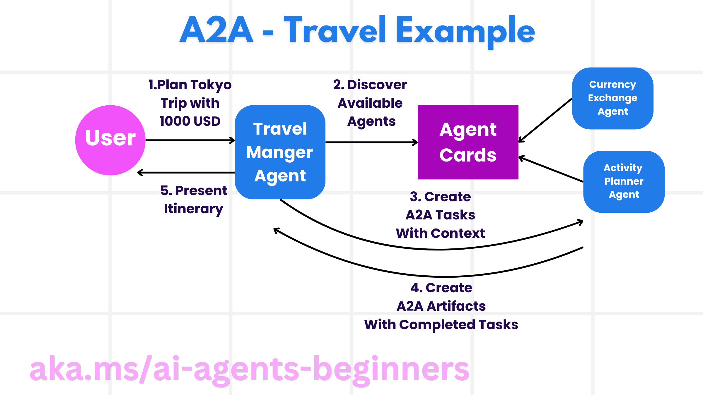

<!--
CO_OP_TRANSLATOR_METADATA:
{
  "original_hash": "f6600bebb86f72f3f62a9163fcce9566",
  "translation_date": "2025-08-30T10:11:46+00:00",
  "source_file": "11-agentic-protocols/README.md",
  "language_code": "uk"
}
-->
# Використання агентних протоколів (MCP, A2A та NLWeb)

Зі зростанням використання AI-агентів зростає і потреба у протоколах, які забезпечують стандартизацію, безпеку та підтримують відкриті інновації. У цьому уроці ми розглянемо три протоколи, які прагнуть задовольнити ці потреби: Model Context Protocol (MCP), Agent to Agent (A2A) та Natural Language Web (NLWeb).

## Вступ

У цьому уроці ми розглянемо:

• Як **MCP** дозволяє AI-агентам отримувати доступ до зовнішніх інструментів і даних для виконання завдань користувача.

• Як **A2A** забезпечує комунікацію та співпрацю між різними AI-агентами.

• Як **NLWeb** додає інтерфейси природної мови до будь-якого вебсайту, дозволяючи AI-агентам знаходити та взаємодіяти з контентом.

## Цілі навчання

• **Визначити** основну мету та переваги MCP, A2A та NLWeb у контексті AI-агентів.

• **Пояснити**, як кожен протокол сприяє комунікації та взаємодії між LLM, інструментами та іншими агентами.

• **Розпізнати** унікальні ролі кожного протоколу у створенні складних агентних систем.

## Протокол контексту моделі (MCP)

**Model Context Protocol (MCP)** — це відкритий стандарт, який забезпечує стандартизований спосіб для додатків надавати контекст і інструменти для LLM. Це дозволяє створити "універсальний адаптер" до різних джерел даних та інструментів, до яких AI-агенти можуть підключатися послідовно.

Розглянемо компоненти MCP, переваги порівняно з прямим використанням API та приклад того, як AI-агенти можуть використовувати MCP-сервер.

### Основні компоненти MCP

MCP працює на основі **архітектури клієнт-сервер**, і основними компонентами є:

• **Хости** — це LLM-додатки (наприклад, редактор коду, як-от VSCode), які ініціюють з'єднання з MCP-сервером.

• **Клієнти** — це компоненти в хост-додатку, які підтримують одноосібні з'єднання із серверами.

• **Сервери** — це легкі програми, які надають певні можливості.

Протокол включає три основні примітиви, які визначають можливості MCP-сервера:

• **Інструменти**: Це окремі дії або функції, які AI-агент може викликати для виконання завдання. Наприклад, сервіс погоди може надавати інструмент "отримати погоду", а сервер електронної комерції — інструмент "купити продукт". MCP-сервери рекламують назву кожного інструменту, його опис і схему вводу/виводу у своєму списку можливостей.

• **Ресурси**: Це дані або документи лише для читання, які MCP-сервер може надати, а клієнти можуть отримати їх за запитом. Прикладами є вміст файлів, записи баз даних або журнали. Ресурси можуть бути текстовими (наприклад, код або JSON) або бінарними (наприклад, зображення або PDF).

• **Підказки**: Це заздалегідь визначені шаблони, які пропонують рекомендовані підказки, дозволяючи створювати складніші робочі процеси.

### Переваги MCP

MCP пропонує значні переваги для AI-агентів:

• **Динамічне виявлення інструментів**: Агенти можуть динамічно отримувати список доступних інструментів із сервера разом із їх описами. Це відрізняється від традиційних API, які часто вимагають статичного кодування для інтеграцій, що означає, що будь-яка зміна API потребує оновлення коду. MCP пропонує підхід "інтегруй один раз", що забезпечує більшу адаптивність.

• **Сумісність між LLM**: MCP працює з різними LLM, забезпечуючи гнучкість у виборі основних моделей для оцінки кращої продуктивності.

• **Стандартизована безпека**: MCP включає стандартний метод автентифікації, що спрощує масштабування при додаванні доступу до додаткових MCP-серверів. Це простіше, ніж керування різними ключами та типами автентифікації для різних традиційних API.

### Приклад MCP

Уявімо, що користувач хоче забронювати рейс за допомогою AI-асистента, який працює на основі MCP.

1. **З'єднання**: AI-асистент (клієнт MCP) підключається до MCP-сервера, наданого авіакомпанією.

2. **Виявлення інструментів**: Клієнт запитує у MCP-сервера авіакомпанії: "Які інструменти у вас доступні?" Сервер відповідає інструментами, такими як "пошук рейсів" і "бронювання рейсів".

3. **Виклик інструменту**: Ви просите AI-асистента: "Будь ласка, знайди рейс із Портленда до Гонолулу". AI-асистент, використовуючи свій LLM, визначає, що потрібно викликати інструмент "пошук рейсів" і передає відповідні параметри (місце відправлення, місце призначення) MCP-серверу.

4. **Виконання та відповідь**: MCP-сервер, виступаючи як обгортка, здійснює фактичний виклик до внутрішнього API бронювання авіакомпанії. Потім він отримує інформацію про рейс (наприклад, дані у форматі JSON) і надсилає її назад AI-асистенту.

5. **Подальша взаємодія**: AI-асистент представляє варіанти рейсів. Після того, як ви обираєте рейс, асистент може викликати інструмент "бронювання рейсу" на тому ж MCP-сервері, завершуючи бронювання.

## Протокол "Агент до агента" (A2A)

Якщо MCP зосереджується на підключенні LLM до інструментів, то **Agent-to-Agent (A2A) протокол** йде далі, дозволяючи комунікацію та співпрацю між різними AI-агентами. A2A з'єднує AI-агентів із різних організацій, середовищ та технологічних стеків для виконання спільного завдання.

Ми розглянемо компоненти та переваги A2A, а також приклад його застосування у нашому додатку для подорожей.

### Основні компоненти A2A

A2A зосереджується на забезпеченні комунікації між агентами та їхній співпраці для виконання підзавдання користувача. Кожен компонент протоколу сприяє цьому:

#### Картка агента

Подібно до того, як MCP-сервер ділиться списком інструментів, картка агента містить:
    ◦ Назву агента.  
    ◦ **Опис загальних завдань**, які він виконує.  
    ◦ **Список конкретних навичок** із описами, щоб інші агенти (або навіть користувачі) розуміли, коли і чому варто звертатися до цього агента.  
    ◦ **Поточну URL-адресу кінцевої точки** агента.  
    ◦ **Версію** та **можливості** агента, такі як потокові відповіді та push-сповіщення.  

#### Виконавець агента

Виконавець агента відповідає за **передачу контексту чату користувача віддаленому агенту**, щоб той міг зрозуміти завдання, яке потрібно виконати. У сервері A2A агент використовує свою власну модель LLM для аналізу вхідних запитів і виконання завдань за допомогою своїх внутрішніх інструментів.

#### Артефакт

Після завершення віддаленим агентом запитуваного завдання його результат створюється у вигляді артефакту. Артефакт **містить результат роботи агента**, **опис виконаного завдання** та **текстовий контекст**, який передається через протокол. Після відправки артефакту з'єднання з віддаленим агентом закривається до наступної потреби.

#### Черга подій

Цей компонент використовується для **обробки оновлень і передачі повідомлень**. Він особливо важливий у виробничих агентних системах, щоб запобігти закриттю з'єднання між агентами до завершення завдання, особливо якщо виконання завдання займає тривалий час.

### Переваги A2A

• **Покращена співпраця**: A2A дозволяє агентам від різних постачальників і платформ взаємодіяти, ділитися контекстом і працювати разом, забезпечуючи безперервну автоматизацію між традиційно роз'єднаними системами.

• **Гнучкість у виборі моделі**: Кожен агент A2A може самостійно обирати, яку LLM використовувати для обслуговування своїх запитів, що дозволяє оптимізувати або налаштовувати моделі для кожного агента.

• **Вбудована автентифікація**: Автентифікація інтегрована безпосередньо в протокол A2A, забезпечуючи надійну систему безпеки для взаємодії агентів.

### Приклад A2A

Розширимо наш сценарій бронювання подорожі, але цього разу використаємо A2A.

1. **Запит користувача до мультиагента**: Користувач взаємодіє з "Туристичним агентом" (клієнтом/агентом A2A), наприклад, кажучи: "Будь ласка, забронюй повну подорож до Гонолулу на наступний тиждень, включаючи рейси, готель і оренду автомобіля".

2. **Оркестрація туристичним агентом**: Туристичний агент отримує цей складний запит. Він використовує свою LLM для аналізу завдання та визначення, що потрібно взаємодіяти з іншими спеціалізованими агентами.

3. **Міжагентна комунікація**: Туристичний агент використовує протокол A2A для підключення до підлеглих агентів, таких як "Авіаційний агент", "Готельний агент" і "Агент оренди автомобілів", створених різними компаніями.

4. **Делегування виконання завдань**: Туристичний агент надсилає конкретні завдання цим спеціалізованим агентам (наприклад, "Знайди рейси до Гонолулу", "Забронюй готель", "Орендуй автомобіль"). Кожен із цих спеціалізованих агентів, використовуючи свої власні LLM та інструменти (які можуть бути MCP-серверами), виконує свою частину бронювання.

5. **Консолідована відповідь**: Після завершення завдань усіма підлеглими агентами туристичний агент збирає результати (деталі рейсу, підтвердження готелю, бронювання автомобіля) і надсилає користувачеві комплексну відповідь у стилі чату.

## Natural Language Web (NLWeb)

Вебсайти давно стали основним способом доступу користувачів до інформації та даних в інтернеті.

Розглянемо різні компоненти NLWeb, його переваги та приклад роботи NLWeb на основі нашого додатку для подорожей.

### Компоненти NLWeb

- **NLWeb-додаток (основний сервісний код)**: Система, яка обробляє запитання природною мовою. Вона з'єднує різні частини платформи для створення відповідей. Це можна уявити як **двигун, що забезпечує функції природної мови** на вебсайті.

- **Протокол NLWeb**: Це **набір базових правил для взаємодії природною мовою** із вебсайтом. Він повертає відповіді у форматі JSON (часто використовуючи Schema.org). Його мета — створити просту основу для "AI Web", подібно до того, як HTML зробив можливим обмін документами онлайн.

- **MCP-сервер (кінцева точка Model Context Protocol)**: Кожна установка NLWeb також працює як **MCP-сервер**. Це означає, що вона може **надавати інструменти (наприклад, метод "запитати") та дані** іншим AI-системам. На практиці це робить контент і можливості вебсайту доступними для AI-агентів, дозволяючи вебсайту стати частиною ширшої "екосистеми агентів".

- **Моделі вбудовування**: Ці моделі використовуються для **перетворення контенту вебсайту у числові представлення, які називаються векторами** (вбудовування). Ці вектори захоплюють значення таким чином, щоб комп'ютери могли їх порівнювати та шукати. Вони зберігаються у спеціальній базі даних, і користувачі можуть обирати, яку модель вбудовування використовувати.

- **Векторна база даних (механізм пошуку)**: Ця база даних **зберігає вбудовування контенту вебсайту**. Коли хтось ставить запитання, NLWeb перевіряє векторну базу даних, щоб швидко знайти найбільш релевантну інформацію. Вона надає швидкий список можливих відповідей, ранжованих за схожістю. NLWeb працює з різними системами зберігання векторів, такими як Qdrant, Snowflake, Milvus, Azure AI Search та Elasticsearch.

### Приклад NLWeb

Розглянемо наш вебсайт для бронювання подорожей, але цього разу він працює на основі NLWeb.

1. **Імпорт даних**: Існуючі каталоги продуктів вебсайту (наприклад, списки рейсів, описи готелів, туристичні пакети) форматуються за допомогою Schema.org або завантажуються через RSS-канали. Інструменти NLWeb імпортують ці структуровані дані, створюють вбудовування та зберігають їх у локальній або віддаленій векторній базі даних.

2. **Запит природною мовою (людина)**: Користувач заходить на вебсайт і, замість навігації по меню, вводить у чат-інтерфейс: "Знайди мені сімейний готель у Гонолулу з басейном на наступний тиждень".

3. **Обробка NLWeb**: Додаток NLWeb отримує цей запит. Він надсилає запит до LLM для розуміння та одночасно шукає у своїй векторній базі даних відповідні списки готелів.

4. **Точні результати**: LLM допомагає інтерпретувати результати пошуку з бази даних, визначити найкращі відповідності за критеріями "сімейний", "басейн" і "Гонолулу", а потім форматує відповідь природною мовою. Важливо, що відповідь посилається на реальні готелі з каталогу вебсайту, уникаючи вигаданих даних.

5. **Взаємодія AI-агента**: Оскільки NLWeb працює як MCP-сервер, зовнішній AI-агент для подорожей також може підключитися до цього екземпляра NLWeb. AI-агент може використовувати метод `ask` MCP для прямого запиту до вебсайту: `ask("Чи є в районі Гонолулу веганські ресторани, рекомендовані готелем?")`. Екземпляр NLWeb обробить це, використовуючи свою базу даних інформації про ресторани (

---

**Відмова від відповідальності**:  
Цей документ було перекладено за допомогою сервісу автоматичного перекладу [Co-op Translator](https://github.com/Azure/co-op-translator). Хоча ми прагнемо до точності, звертаємо вашу увагу, що автоматичні переклади можуть містити помилки або неточності. Оригінальний документ на його рідній мові слід вважати авторитетним джерелом. Для критичної інформації рекомендується професійний переклад людиною. Ми не несемо відповідальності за будь-які непорозуміння або неправильне тлумачення, що виникли внаслідок використання цього перекладу.