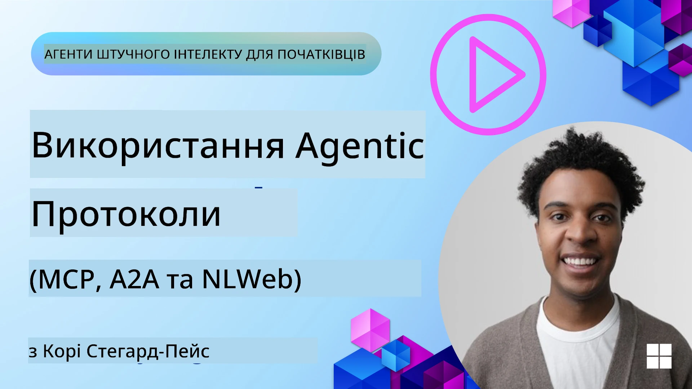
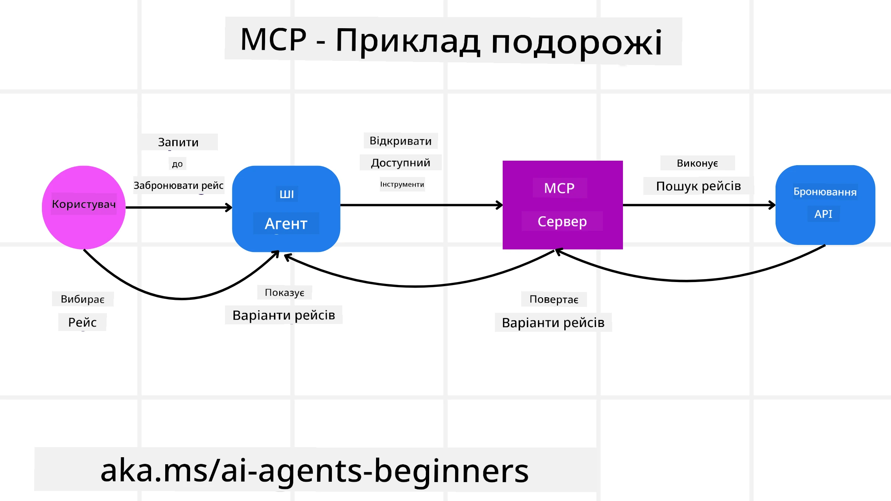
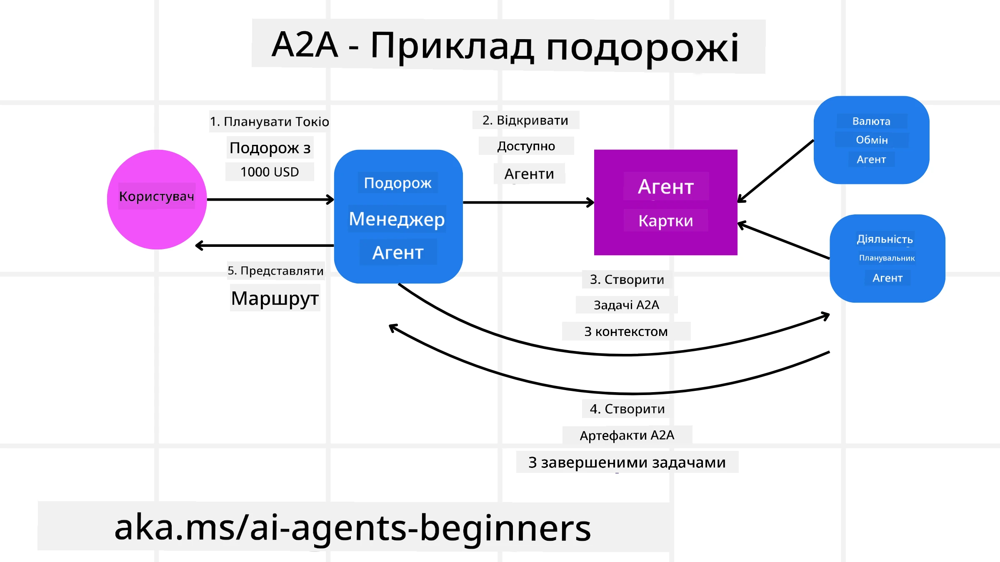
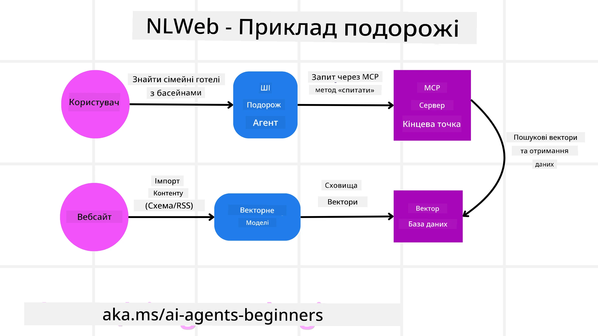

# Використання агентних протоколів (MCP, A2A та NLWeb)

> _(Натисніть на зображення вище, щоб переглянути відео цього уроку)_

Зі зростанням використання AI-агентів зростає й потреба у протоколах, які забезпечують стандартизацію, безпеку та підтримують відкриті інновації. У цьому уроці ми розглянемо 3 протоколи, які прагнуть задовольнити цю потребу — Model Context Protocol (MCP), Agent to Agent (A2A) та Natural Language Web (NLWeb).

## Вступ

У цьому уроці ми розглянемо:

• Як **MCP** дозволяє AI-агентам отримувати доступ до зовнішніх інструментів та даних для виконання завдань користувача.

• Як **A2A** забезпечує спілкування та співпрацю між різними AI-агентами.

• Як **NLWeb** впроваджує інтерфейси природної мови на будь-який вебсайт, даючи змогу AI-агентам знаходити та взаємодіяти з контентом.

## Навчальні цілі

• **Визначити** основну мету та переваги MCP, A2A та NLWeb у контексті AI-агентів.

• **Пояснити** як кожен протокол полегшує комунікацію та взаємодію між LLM, інструментами та іншими агентами.

• **Визнати** відмінні ролі кожного протоколу у побудові складних агентних систем.

## Протокол контексту моделі

**Model Context Protocol (MCP)** — це відкритий стандарт, що забезпечує стандартизований спосіб для застосунків надавати контекст та інструменти LLM. Це дозволяє створити "універсальний адаптер" до різних джерел даних та інструментів, до яких AI-агенти можуть підключатися послідовним способом.

Розглянемо компоненти MCP, переваги порівняно з прямим використанням API, а також приклад, як AI-агенти можуть використовувати MCP сервер.

### Основні компоненти MCP

MCP працює на основі **клієнт-серверної архітектури**, а основні компоненти:

• **Хости** — це застосунки з LLM (наприклад, редактор коду VSCode), які ініціюють з'єднання з MCP сервером.

• **Клієнти** — компоненти у хост-застосунку, що підтримують зв’язки один до одного з серверами.

• **Сервери** — легковагові програми, які надають конкретні можливості.

В протоколі передбачено три основні примітиви, які є можливостями MCP сервера:

• **Інструменти**: це окремі дії або функції, які AI-агент може викликати для виконання дії. Наприклад, сервіс погоди може надати інструмент "отримати погоду", або сервер електронної комерції — інструмент "купити продукт". MCP сервери рекламують ім’я, опис і схему введення/виведення кожного інструменту у переліку можливостей.

• **Ресурси**: це лише для читання елементи даних або документи, які MCP сервер може надати, і які клієнти можуть вибірково отримувати. Прикладами є вміст файлів, записи бази даних або файли журналів. Ресурси можуть бути текстовими (наприклад, код або JSON) або двійковими (зображення або PDF).

• **Промти**: це заздалегідь визначені шаблони, що надають запропоновані підказки, дозволяючи створювати більш складні робочі процеси.

### Переваги MCP

MCP пропонує суттєві переваги для AI-агентів:

• **Динамічне відкриття інструментів**: агенти можуть динамічно отримувати список доступних інструментів від сервера разом з описами їх функцій. На відміну від традиційних API, які часто вимагають статичного кодування для інтеграцій, будь-яка зміна API передбачає оновлення коду. MCP пропонує підхід "одноразової інтеграції", що забезпечує більшу адаптивність.

• **Сумісність між різними LLM**: MCP працює через різні LLM, забезпечуючи гнучкість у зміні основних моделей для кращої продуктивності.

• **Стандартизована безпека**: MCP включає стандартний метод автентифікації, що полегшує масштабування при додаванні доступу до додаткових MCP серверів. Це простіше, ніж управляти різними ключами та типами аутентифікації для різних традиційних API.

### Приклад MCP

Уявімо, що користувач хоче забронювати рейс за допомогою AI-помічника, який використовує MCP.

1. **З’єднання**: AI-помічник (MCP клієнт) підключається до MCP сервера, що надається авіакомпанією.

2. **Виявлення інструментів**: Клієнт запитує у MCP сервера авіакомпанії: "Які у вас доступні інструменти?" Сервер відповідає інструментами, такими як "пошук рейсів" та "бронювання рейсів".

3. **Виклик інструменту**: Ви звертаєтесь до AI-помічника з проханням: "Будь ласка, знайди рейс з Портленда до Гонолулу." AI-помічник, використовуючи свій LLM, визначає, що потрібно викликати інструмент "пошук рейсів" і передає відповідні параметри (пункт відправлення, пункт призначення) MCP серверу.

4. **Виконання та відповідь**: MCP сервер, виконуючи роль обгортки, робить фактичний виклик внутрішнього API бронювання авіакомпанії. Потім отримує інформацію про рейси (наприклад, у форматі JSON) і надсилає її назад AI-помічнику.

5. **Подальша взаємодія**: AI-помічник показує варіанти рейсів. Після вашого вибору рейсу помічник може викликати інструмент "бронювати рейс" на тому ж MCP сервері, завершуючи бронювання.

## Протокол "Агент до Агент" (A2A)

У той час як MCP зосереджується на підключенні LLM до інструментів, **протокол Agent-to-Agent (A2A)** робить крок далі, надаючи можливість спілкування і співпраці між різними AI-агентами. A2A з'єднує AI-агентів із різних організацій, середовищ та технологічних стеків для спільного виконання завдань.

Розглянемо компоненти та переваги A2A, а також приклад застосування у нашому туристичному додатку.

### Основні компоненти A2A

A2A забезпечує спілкування між агентами і дозволяє їм працювати разом для виконання підзавдання користувача. Кожен компонент протоколу цьому сприяє:

#### Картка агента

Подібно до того, як MCP сервер надає список інструментів, Картка агента містить:
- Ім'я агента.
- **Опис загальних завдань**, які він виконує.
- **Перелік конкретних навичок** з описами, щоб інші агенти (або навіть люди) розуміли, коли і чому звертатися до цього агента.
- **Поточний URL кінцевої точки** агента.
- **Версія** та **можливості** агента, такі як потокові відповіді та push-повідомлення.

#### Виконавець агента

Виконавець агента відповідає за **передачу контексту чату користувача до віддаленого агента**, який потребує цього, щоб зрозуміти завдання для виконання. В A2A сервері агент використовує власну Велику Мовну Модель (LLM) для розбору вхідних запитів і виконання завдань за допомогою власних внутрішніх інструментів.

#### Артефакт

Після того, як віддалений агент виконав запитане завдання, створюється артефакт. Артефакт **містить результат роботи агента**, **опис того, що виконано**, та **текстовий контекст**, який передається через протокол. Після відправки артефакту з'єднання з віддаленим агентом закривається до наступної потреби.

#### Черга подій

Цей компонент використовується для **обробки оновлень та передачі повідомлень**. Особливо важливий у продуктивних агентних системах, щоб запобігти закриттю з'єднання між агентами до завершення завдання, особливо коли виконання може тривати довго.

### Переваги A2A

• **Розширена співпраця**: дозволяє агентам від різних постачальників і платформ взаємодіяти, обмінюватися контекстом та працювати спільно, полегшуючи безшовну автоматизацію між раніше роз'єднаними системами.

• **Гнучкість вибору моделі**: кожен агент A2A може вибирати LLM для обслуговування своїх запитів, що дає змогу оптимізувати або тонко налаштувати моделі індивідуально, на відміну від єдиного LLM-з'єднання у деяких MCP сценаріях.

• **Вбудована аутентифікація**: аутентифікація інтегрована безпосередньо в протокол A2A, забезпечуючи надійну систему безпеки для взаємодії агентів.

### Приклад A2A

Розглянемо наш сценарій бронювання подорожі, але тепер із використанням A2A.

1. **Запит користувача до багатопроцесового агента**: Користувач звертається до агента A2A "Туристичний агент", наприклад, каже: "Забронюй повну поїздку до Гонолулу на наступний тиждень, включно з рейсами, готелем і орендою авто".

2. **Оркестрація Туристичним агентом**: Туристичний агент отримує це складне завдання. Він використовує свій LLM, щоб проаналізувати задачу і визначити необхідність взаємодії з іншими спеціалізованими агентами.

3. **Спілкування між агентами**: Туристичний агент використовує протокол A2A для зв’язку з іншими агентами, такими як "Авіа агент", "Готельний агент" і "Агент з оренди авто", створеними різними компаніями.

4. **Делегування виконання завдань**: Туристичний агент відправляє конкретні завдання цим спеціалізованим агентам (наприклад, "Знайди рейси до Гонолулу", "Забронюй готель", "Орендуй авто"). Кожен агент, який працює зі своїм LLM і використовує власні інструменти (які можуть бути також MCP серверами), виконує свою частину бронювання.

5. **Консолідовану відповідь**: Після того, як усі агенти завершать завдання, Туристичний агент збирає результати (деталі рейсів, підтвердження готелю, бронювання авто) і надсилає користувачу узагальнену відповідь у форматі чату.

## Natural Language Web (NLWeb)

Вебсайти вже давно є основним способом доступу користувачів до інформації та даних в Інтернеті.

Розглянемо різні компоненти NLWeb, переваги NLWeb і приклад роботи нашого NLWeb на прикладі туристичного додатку.

### Компоненти NLWeb

- **Застосунок NLWeb (основний сервісний код)**: система, що обробляє запитання природною мовою. Вона з'єднує різні частини платформи для формування відповідей. Можна уявити її як **двигун, що забезпечує функції природної мови** на вебсайті.

- **Протокол NLWeb**: це **базовий набір правил для взаємодії природною мовою** з вебсайтом. Він повертає відповіді у форматі JSON (часто використовуючи Schema.org). Його мета — створити просту основу для "AI Web", подібно тому, як HTML зробив можливим обмін документами онлайн.

- **MCP сервер (кінцева точка Model Context Protocol)**: кожна установка NLWeb також працює як **MCP сервер**. Це означає, що вона може **надавати інструменти (наприклад, метод „ask“) і дані** іншим AI-системам. Практично це робить контент та можливості сайту доступними AI-агентам, що дозволяє сайту стати частиною ширшої "екосистеми агентів".

- **Моделі вбудовування (embedding models)**: ці моделі використовуються для **перетворення контенту сайту у числові подання, звані векторами (embeddings)**. Ці вектори зберігають зміст у форматі, зручному для порівняння й пошуку комп’ютерами. Вектори зберігаються у спеціальній базі даних, і користувачі можуть обирати, яку модель вбудовування використовувати.

- **Векторна база даних (механізм пошуку)**: ця база **зберігає embeddings контенту сайту**. Коли хтось ставить запитання, NLWeb перевіряє векторну базу, щоб швидко знайти найбільш релевантну інформацію. Вона повертає швидкий список можливих відповідей, відсортованих за схожістю. NLWeb працює з різними системами зберігання векторів, такими як Qdrant, Snowflake, Milvus, Azure AI Search та Elasticsearch.

### Приклад NLWeb

Розглянемо знову наш сайт бронювання подорожей, але тепер під керуванням NLWeb.

1. **Завантаження даних**: існуючі каталоги продуктів сайту (наприклад, списки рейсів, описи готелів, туристичні пакети) форматуються із використанням Schema.org або завантажуються через RSS-стрічки. Інструменти NLWeb обробляють ці структуровані дані, створюють embeddings і зберігають їх у локальній або віддаленій векторній базі даних.

2. **Запит природною мовою (користувач)**: користувач заходить на сайт і замість навігації меню вводить у чаті: «Знайди мені сімейний готель у Гонолулу з басейном на наступний тиждень».

3. **Обробка NLWeb**: застосунок NLWeb приймає цей запит, надсилає його LLM для розуміння і одночасно шукає релевантні готелі у векторній базі даних.

4. **Точні результати**: LLM допомагає інтерпретувати результати пошуку, знаходить найкращі збіги за критеріями «сімейний», «басейн» та «Гонолулу», а потім форматує відповідь природною мовою. Важливо, що відповідь посилається на реальні готелі із каталогу сайту, уникаючи вигаданої інформації.

5. **Взаємодія AI-агента**: оскільки NLWeb виступає MCP сервером, зовнішній AI туристичний агент також може підключитися до цієї інстанції NLWeb сайту. Тоді AI-агент може використовувати метод `ask` MCP, щоб безпосередньо зробити запит сайту: `ask("Чи є у Гонолулу веганські ресторани, рекомендовані готелем?")`. Інстанція NLWeb обробить це, використовуючи базу даних ресторанів (якщо вона завантажена) і поверне структуровану JSON-відповідь.

### Більше запитань про MCP/A2A/NLWeb?

Приєднуйтесь до [Microsoft Foundry Discord](https://aka.ms/ai-agents/discord), щоб зустріти інших учнів, відвідувати години консультацій та отримати відповіді на свої запитання про AI-агенти.

## Ресурси

- [MCP для початківців](https://aka.ms/mcp-for-beginners)  
- [Документація MCP](https://learn.microsoft.com/python/api/overview/azure/ai-projects-readme)
- [Репозиторій NLWeb](https://github.com/nlweb-ai/NLWeb)
- [Фреймворк агентів Microsoft](https://aka.ms/ai-agents-beginners/agent-framewrok)

---

<!-- CO-OP TRANSLATOR DISCLAIMER START -->
**Відмова від відповідальності**:
Цей документ було перекладено за допомогою сервісу автоматичного перекладу [Co-op Translator](https://github.com/Azure/co-op-translator). Хоча ми прагнемо до точності, будьте уважні, що автоматичні переклади можуть містити помилки або неточності. Оригінальний документ його рідною мовою слід вважати авторитетним джерелом. Для критично важливої інформації рекомендується професійний людський переклад. Ми не несемо відповідальності за будь-які непорозуміння чи неправильні тлумачення, що виникли внаслідок використання цього перекладу.
<!-- CO-OP TRANSLATOR DISCLAIMER END -->