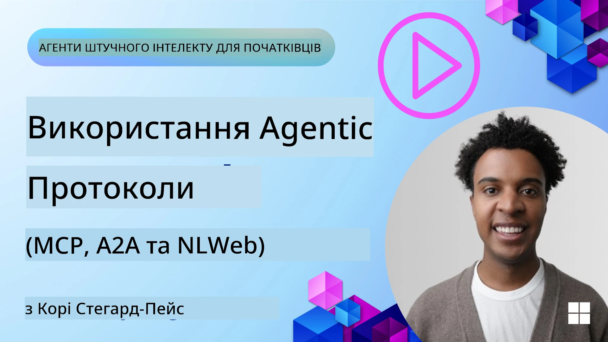
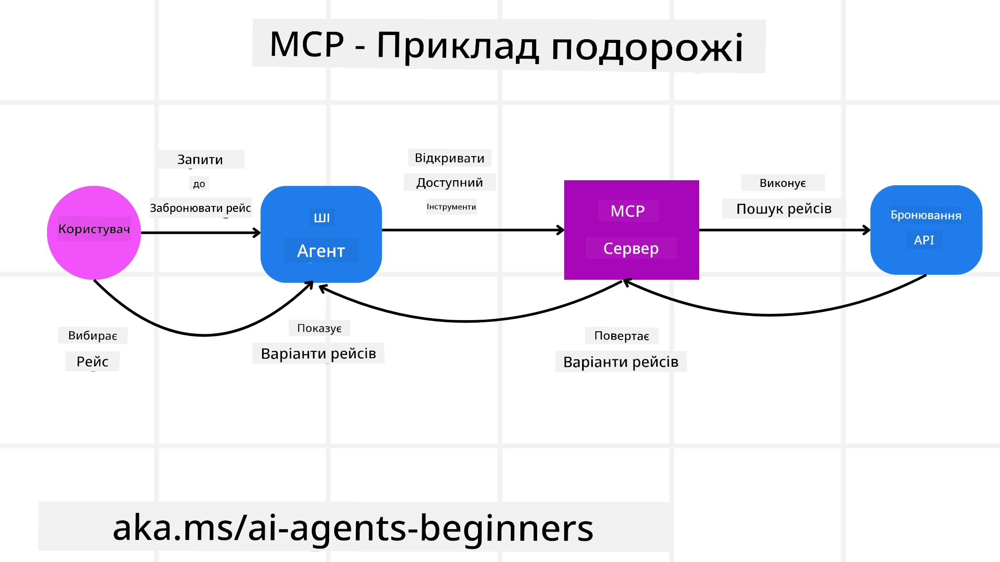
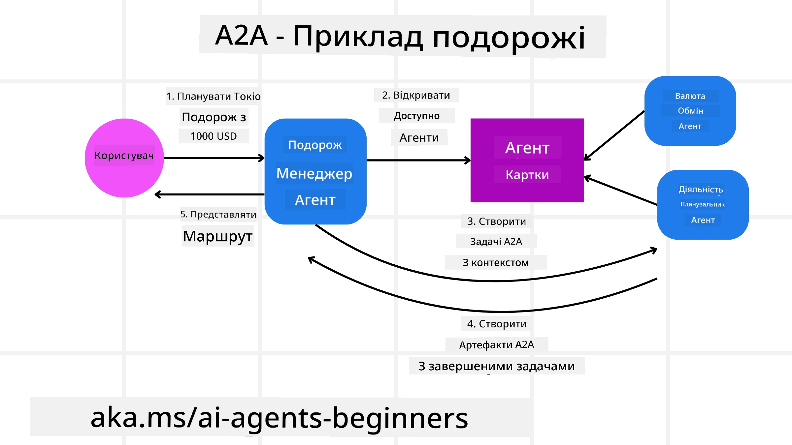
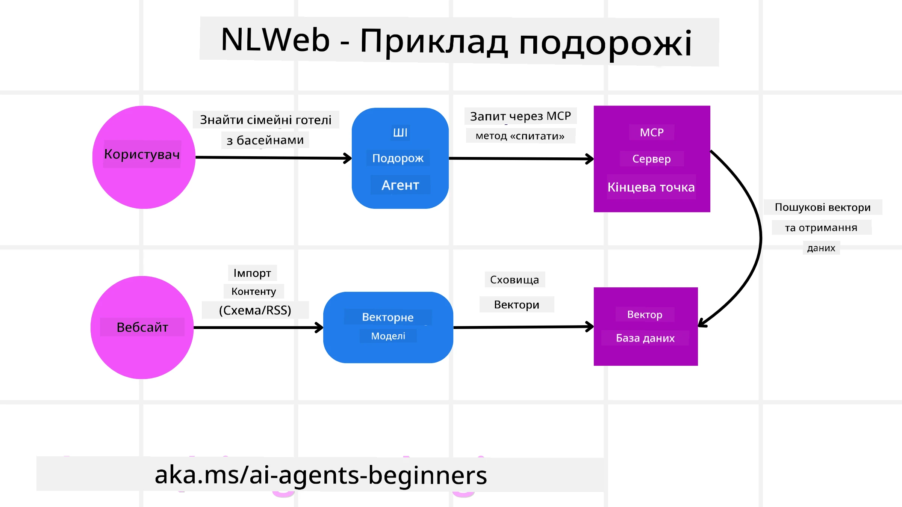

# Використання агентних протоколів (MCP, A2A та NLWeb)

> _(Натисніть на зображення вище, щоб переглянути відео цього уроку)_

Зі зростанням використання агентів ШІ зростає і потреба у протоколах, які забезпечують стандартизацію, безпеку та підтримують відкриті інновації. У цьому уроці ми розглянемо 3 протоколи, які прагнуть задовольнити цю потребу — Model Context Protocol (MCP), Agent to Agent (A2A) та Natural Language Web (NLWeb).

## Вступ

У цьому уроці ми розглянемо:

• Як **MCP** дозволяє агентам ШІ отримувати доступ до зовнішніх інструментів і даних для виконання завдань користувача.

• Як **A2A** дає змогу спілкуватися і співпрацювати між різними агентами ШІ.

• Як **NLWeb** забезпечує інтерфейси природної мови для будь-якого веб-сайту, дозволяючи агентам ШІ виявляти та взаємодіяти з його вмістом.

## Мети навчання

• **Визначити** основне призначення та переваги MCP, A2A та NLWeb у контексті агентів ШІ.

• **Пояснити**, як кожен протокол сприяє комунікації та взаємодії між LLM, інструментами та іншими агентами.

• **Розпізнати** різні ролі, які кожен протокол відіграє у побудові складних агентних систем.

## Model Context Protocol

**Model Context Protocol (MCP)** — це відкритий стандарт, що забезпечує стандартизований спосіб для додатків надавати контекст і інструменти LLM. Це дозволяє створити «універсальний адаптер» до різних джерел даних та інструментів, до яких агенти ШІ можуть підключатися послідовним способом.

Розглянемо компоненти MCP, переваги у порівнянні з прямим використанням API та приклад, як агенти ШІ можуть використовувати MCP сервер.

### Основні компоненти MCP

MCP працює на базі **клієнт-серверної архітектури**, а основні компоненти:

• **Хости** — це додатки LLM (наприклад, редактор коду VSCode), які ініціюють з'єднання з MCP сервером.

• **Клієнти** — це компоненти у хост-додатку, які підтримують однозначні з’єднання з серверами.

• **Сервери** — це легкі програми, які надають певні можливості.

У протоколі є три основні примітиви — це можливості MCP сервера:

• **Інструменти**: Це дискретні дії або функції, які агент ШІ може викликати для виконання операції. Наприклад, сервіс погоди може надати інструмент «отримати погоду», або сервер електронної комерції — інструмент «купити товар». MCP сервери повідомляють ім’я інструменту, опис та схему вхідних/вихідних даних у переліку можливостей.

• **Ресурси**: Це дані тільки для читання або документи, які MCP сервер може надавати, і клієнти можуть запитувати їх за потребою. Прикладами можуть бути вміст файлів, записи бази даних або журнали. Ресурси можуть бути текстовими (код чи JSON) або бінарними (зображення або PDF).

• **Підказки**: Це попередньо визначені шаблони, що пропонують варіанти підказок, дозволяючи реалізувати складніші робочі процеси.

### Переваги MCP

MCP має значні переваги для агентів ШІ:

• **Динамічне виявлення інструментів**: Агенти можуть динамічно отримувати список доступних інструментів від сервера з описом їх функцій. Це відрізняється від традиційних API, які часто вимагають статичного коду для інтеграцій, отже будь-яка зміна API вимагає оновлення коду. MCP пропонує підхід «інтегруй один раз», що підвищує адаптивність.

• **Інтероперабельність між різними LLM**: MCP працює з різними LLM, забезпечуючи гнучкість у переключенні базових моделей для кращої продуктивності.

• **Стандартизована безпека**: MCP включає стандартний метод аутентифікації, що покращує масштабованість при додаванні доступу до додаткових MCP серверів. Це простіше порівняно з управлінням різними ключами та методами аутентифікації для різних традиційних API.

### Приклад MCP

Уявімо, що користувач хоче забронювати рейс за допомогою помічника ШІ на базі MCP.

1. **З'єднання**: Помічник ШІ (MCP клієнт) підключається до MCP сервера авіакомпанії.

2. **Виявлення інструментів**: Клієнт запитує MCP сервер авіакомпанії: «Які інструменти у вас доступні?» Сервер відповідає інструментами «пошук рейсів» та «бронювання рейсів».

3. **Виклик інструменту**: Користувач просить помічника: «Знайди рейс з Портленда до Гонолулу.» Помічник, використовуючи свій LLM, визначає, що треба викликати інструмент «пошук рейсів» і передає відповідні параметри (пункт відправлення, пункт призначення) MCP серверу.

4. **Виконання й відповідь**: MCP сервер, виступаючи як обгортка, робить фактичний виклик внутрішнього API авіакомпанії. Потім отримує інформацію про рейс (наприклад, у форматі JSON) і надсилає її назад помічнику ШІ.

5. **Подальша взаємодія**: Помічник демонструє варіанти рейсів. Коли користувач вибирає рейс, помічник може викликати інструмент «бронювання рейсу» на тому ж MCP сервері, завершуючи бронювання.

## Протокол Agent-to-Agent (A2A)

У той час як MCP зосереджується на підключенні LLM до інструментів, **протокол Agent-to-Agent (A2A)** робить крок далі, дозволяючи комунікацію та співпрацю між різними агентами ШІ. A2A зв’язує агентів ШІ з різних організацій, оточень та технологічних стеків для спільного виконання завдання.

Розглянемо складові та переваги A2A, а також приклад застосування у нашому додатку для подорожей.

### Основні компоненти A2A

A2A орієнтований на забезпечення комунікації між агентами та координацію їх роботи для виконання часткового завдання користувача. Кожен компонент протоколу це підтримує:

#### Agent Card

Аналогічно тому, як MCP сервер ділиться списком інструментів, Agent Card містить:
- Ім’я агента.
- **Опис загальних завдань**, які він виконує.
- **Перелік конкретних навичок** з описами, щоб допомогти іншим агентам (або навіть користувачам) зрозуміти, коли і навіщо зв’язуватися з цим агентом.
- **Поточний URL кінцевої точки** агента.
- **Версію** та **можливості** агента, такі як потокова передача відповідей і push-повідомлення.

#### Agent Executor

Agent Executor відповідає за **передачу контексту чат-сесії користувача віддаленому агенту**, адже віддалений агент потребує цього, щоб зрозуміти завдання. В A2A сервері агент використовує власну Велику Модель Мови (LLM) для аналізу запитів і виконання завдань із застосуванням внутрішніх інструментів.

#### Artifact

Після виконання завдання віддаленим агентом створюється артефакт — це **результат роботи агента**, **опис виконаного завдання** та **текстовий контекст**, переданий через протокол. Після відправки артефакту з'єднання з віддаленим агентом закривають, доки знову не знадобиться.

#### Event Queue

Цей компонент використовується для **обробки оновлень і передачі повідомлень**. Особливо важливий у виробничих агентних системах, щоб запобігти закриттю з'єднання між агентами до завершення завдання, особливо якщо час виконання завдання може бути тривалим.

### Переваги A2A

• **Покращена співпраця**: Дозволяє агентам з різних постачальників і платформ взаємодіяти, ділитися контекстом і працювати разом, полегшуючи безшовну автоматизацію між традиційно ізольованими системами.

• **Гнучкість вибору моделей**: Кожен агент A2A може обирати, яку LLM використовувати для обробки запитів, що дозволяє оптимізувати або тонко налаштовувати моделі для кожного агента, на відміну від єдиного підключення LLM у деяких випадках MCP.

• **Вбудована аутентифікація**: Аутентифікація інтегрована безпосередньо в протокол A2A, забезпечуючи надійну безпеку при взаємодії агентів.

### Приклад A2A

Розглянемо знову сценарій бронювання подорожі, але тепер із використанням A2A.

1. **Запит користувача до мультиагенту**: Користувач взаємодіє з клієнтом/агентом A2A «Туристичний агент», можливо, каже: «Забронюй повну поїздку до Гонолулу на наступний тиждень, включно з рейсами, готелем і орендою авто».

2. **Оркестрація Туристичним агентом**: Туристичний агент отримує цей складний запит. Він використовує свій LLM, щоб проаналізувати завдання і визначити, що потрібно взаємодіяти з іншими спеціалізованими агентами.

3. **Спілкування між агентами**: Туристичний агент використовує протокол A2A, щоб підключитися до підлеглих агентів, таких як «Агент авіакомпанії», «Агент готелю» і «Агент оренди авто», створених різними компаніями.

4. **Делегування виконання завдань**: Туристичний агент надсилає конкретні завдання цим спеціалізованим агентам (наприклад, «Знайди рейси до Гонолулу», «Забронюй готель», «Орендуй авто»). Кожен із спеціалізованих агентів, працюючи зі своїми LLM і використовуючи власні інструменти (які можуть бути MCP серверами), виконує свою частину бронювання.

5. **Об’єднана відповідь**: Коли всі агенти завершають свої завдання, Туристичний агент збирає результати (деталі рейсів, підтвердження готелю, бронювання авто) і відправляє користувачу обширну відповідь у стилі чату.

## Natural Language Web (NLWeb)

Веб-сайти довго були основним способом доступу користувачів до інформації та даних в Інтернеті.

Розглянемо різні компоненти NLWeb, переваги NLWeb і приклад роботи NLWeb на прикладі нашого додатка для подорожей.

### Компоненти NLWeb

- **NLWeb Application (Основний сервісний код)**: Система, що обробляє запити природною мовою. Вона з’єднує різні частини платформи для створення відповідей. Можна уявити її як **двигун, що живить функції природної мови** веб-сайту.

- **NLWeb Protocol**: Це **базовий набір правил для взаємодії природною мовою** з веб-сайтом. Він повертає відповіді у форматі JSON (часто з використанням Schema.org). Мета — створити просту основу для «AI Web» так само, як HTML дав змогу поширювати документи онлайн.

- **MCP Server (кінцева точка Model Context Protocol)**: Кожна установка NLWeb також працює як **MCP сервер**. Це означає, що вона може **ділитися інструментами (наприклад, методом “ask”) та даними** з іншими системами ШІ. Насправді це робить вміст і можливості веб-сайту доступними для агентів ШІ, дозволяючи сайту бути частиною ширшої «екосистеми агентів».

- **Embedding Models**: Ці моделі використовуються для **перетворення вмісту веб-сайту у чисельні представлення, названі векторами (вбудовами)**. Вектори зберігають значення так, щоб комп’ютери могли порівнювати та шукати їх. Вони зберігаються в спеціальній базі даних, і користувачі можуть обирати, яку модель вбудов використовувати.

- **Vector Database (механізм пошуку)**: Ця база даних **зберігає вбудови вмісту веб-сайту**. Коли користувач ставить питання, NLWeb перевіряє векторну базу, щоб швидко знайти найрелевантнішу інформацію. Вона видає швидкий список можливих відповідей, відсортованих за схожістю. NLWeb працює з різними системами зберігання векторів, такими як Qdrant, Snowflake, Milvus, Azure AI Search та Elasticsearch.

### NLWeb на прикладі

Знову розглянемо наш сайт для бронювання подорожей, але тепер він працює на базі NLWeb.

1. **Завантаження даних**: Існуючі каталоги продуктів сайту для подорожей (наприклад, списки рейсів, описи готелів, турпакети) форматуються за допомогою Schema.org або завантажуються через RSS-канали. Інструменти NLWeb імпортують ці структуровані дані, створюють вбудови і зберігають їх у локальній або віддаленій векторній базі.

2. **Запит природною мовою (людина)**: Користувач заходить на сайт і замість навігації по меню вводить у чат: «Знайди сімейний готель у Гонолулу з басейном на наступний тиждень».

3. **Обробка NLWeb**: Додаток NLWeb отримує цей запит. Він передає його до LLM для розуміння і одночасно шукає у векторній базі релевантні варіанти готелів.

4. **Точні результати**: LLM допомагає інтерпретувати результати пошуку з бази, визначає найкращі збіги за критеріями «для сімей», «басейн» і «Гонолулу», а потім формує відповідь природною мовою. Важливо, що відповідь посилається на реальні готелі з каталогу сайту, уникаючи вигаданої інформації.

5. **Взаємодія агента ШІ**: Оскільки NLWeb виступає як MCP сервер, зовнішній AI туристичний агент також може підключитись до цієї інстанції NLWeb сайту. Агент ШІ може використовувати метод `ask` MCP, щоб робити запити до сайту напряму: `ask("Чи є в Гонолулу веганські ресторани, рекомендовані готелем?")`. NLWeb обробить це, використовуючи свою базу даних інформації про ресторани (якщо вона завантажена), і поверне структуровану відповідь у форматі JSON.

### Маєте питання про MCP/A2A/NLWeb?

Приєднуйтесь до [Microsoft Foundry Discord](https://discord.com/invite/ATgtXmAS5D), щоб зустріти інших учнів, відвідати офісні години та отримати відповіді на питання про агентів ШІ.

## Ресурси

- [MCP для початківців](https://aka.ms/mcp-for-beginners)  
- [Документація MCP](https://learn.microsoft.com/python/api/overview/azure/ai-projects-readme)
- [Репозиторій NLWeb](https://github.com/nlweb-ai/NLWeb)
- [Microsoft Agent Framework](https://learn.microsoft.com/en-us/agent-framework/overview/?wt.mc_id=youtube_26688_organicsocial_reactor&pivots=programming-language-python)

## Попередній урок

[AI Агенти у виробництві](../10-ai-agents-production/README.md)

## Наступний урок

[Інженерія контексту для агентів ШІ](../12-context-engineering/README.md)

---

<!-- CO-OP TRANSLATOR DISCLAIMER START -->
**Відмова від відповідальності**:
Цей документ було перекладено за допомогою сервісу штучного інтелекту для перекладу [Co-op Translator](https://github.com/Azure/co-op-translator). Хоча ми прагнемо до точності, будь ласка, майте на увазі, що автоматичні переклади можуть містити помилки або неточності. Оригінальний документ рідною мовою слід вважати авторитетним джерелом. Для критично важливої інформації рекомендується професійний людський переклад. Ми не несемо відповідальності за будь-які непорозуміння або неправильні тлумачення, що виникли внаслідок використання цього перекладу.
<!-- CO-OP TRANSLATOR DISCLAIMER END -->