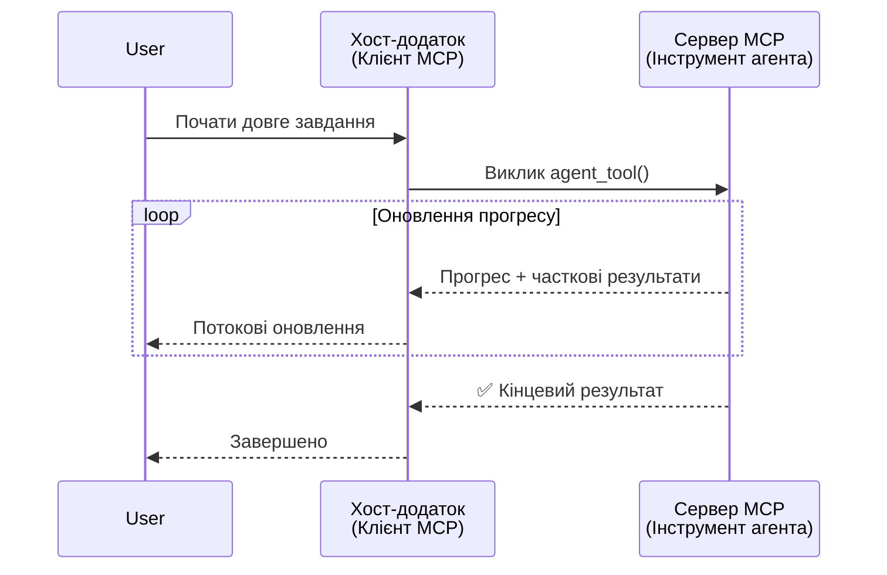
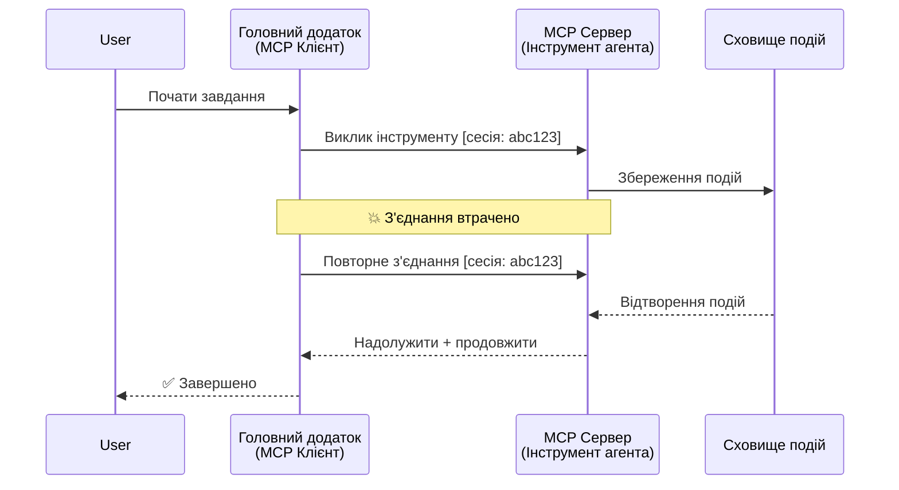
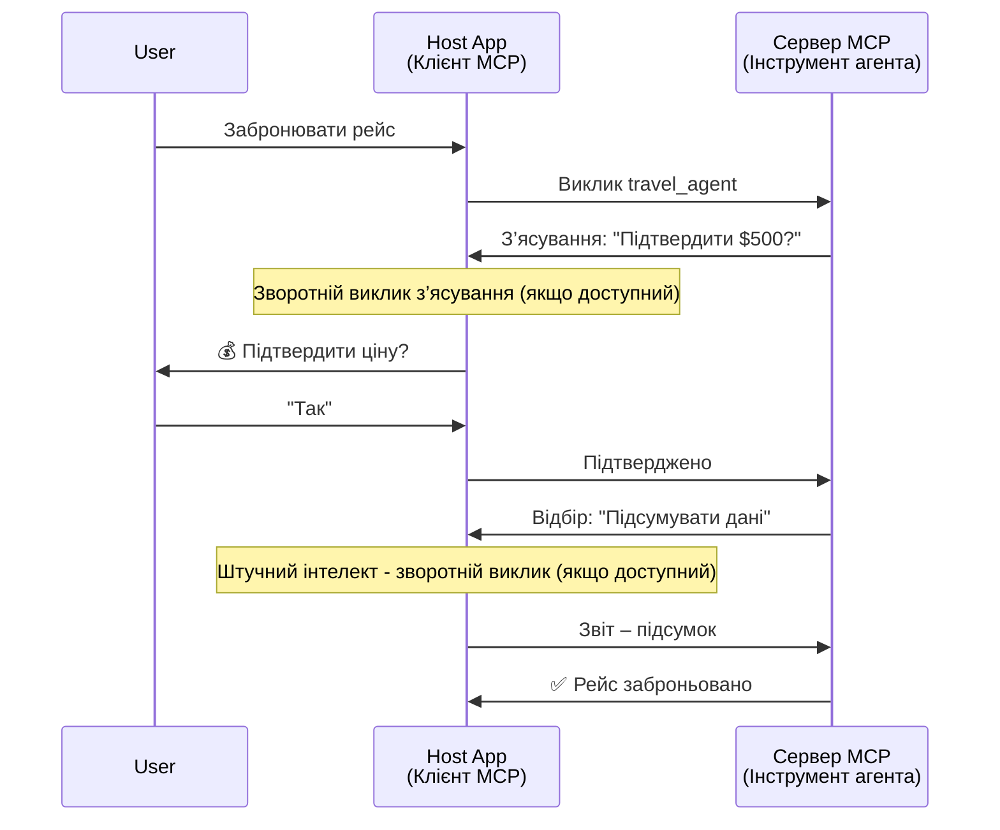
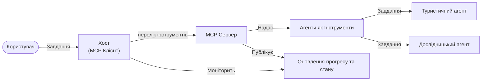

# Побудова систем комунікації агент-до-агента з MCP

> TL;DR - Чи можна побудувати комунікацію Agent2Agent на MCP? Так!

MCP значно розвинувся поза первісною метою "надання контексту для LLM". З останніми покращеннями, включно з [потоковою передачею з можливістю відновлення](https://modelcontextprotocol.io/docs/concepts/transports#resumability-and-redelivery), [еліцитацією](https://modelcontextprotocol.io/specification/2025-06-18/client/elicitation), [семплінгом](https://modelcontextprotocol.io/specification/2025-06-18/client/sampling) та сповіщеннями ([прогресу](https://modelcontextprotocol.io/specification/2025-06-18/basic/utilities/progress) та [ресурсів](https://modelcontextprotocol.io/specification/2025-06-18/schema#resourceupdatednotification)), MCP тепер забезпечує міцну основу для створення складних систем комунікації агент-до-агента.

## Помилкове уявлення про агента/інструмент

Оскільки дедалі більше розробників досліджують інструменти з агентною поведінкою (працюють тривалий час, можуть потребувати додаткових входів під час виконання тощо), поширеним помилковим уявленням є те, що MCP не підходить, головним чином тому, що ранні приклади його примітивних інструментів були сфокусовані на простих патернах запит-відповідь.

Це уявлення застаріле. Специфікація MCP значно покращена протягом останніх кількох місяців із можливостями, що долають розрив для створення тривалої агентної поведінки:

- **Потокова передача та часткові результати**: Оновлення прогресу в режимі реального часу під час виконання
- **Можливість відновлення**: Клієнти можуть перепідключатися та продовжувати після роз'єднання
- **Стійкість**: Результати зберігаються після перезапусків сервера (наприклад, через посилання на ресурси)
- **Багаторазове взаємодія**: Інтерактивний введення під час виконання через еліцітацію і семплінг

Ці функції можна комбінувати для підтримки складних агентних і багатоагентних застосунків, усі які працюють на протоколі MCP.

Для довідки ми будемо називати агента "інструментом", який доступний на сервері MCP. Це означає існування хост-застосунку, який реалізує клієнта MCP, встановлює сесію із сервером MCP і може викликати агента.

## Що робить інструмент MCP "агентним"?

Перед тим як перейти до реалізації, давайте визначимо інфраструктурні можливості, необхідні для підтримки тривалих агентів.

> Ми визначимо агента як сутність, що може автономно працювати протягом тривалого часу, здатну обробляти складні задачі, які можуть потребувати багаторазової взаємодії або коригувань на основі зворотного зв’язку в реальному часі.

### 1. Потокова передача та часткові результати

Традиційні патерни запит-відповідь не працюють для тривалих завдань. Агенти повинні надавати:

- Оновлення прогресу в режимі реального часу
- Проміжні результати

**Підтримка MCP**: Сповіщення про оновлення ресурсів дозволяють потокову передачу часткових результатів, хоча це вимагає ретельного дизайну, щоб уникнути конфліктів із моделлю 1:1 запит/відповідь JSON-RPC.

| Функція                   | Випадок використання                                                                                                                                                     | Підтримка MCP                                                                             |
| ------------------------- | ------------------------------------------------------------------------------------------------------------------------------------------------------------------------ | ----------------------------------------------------------------------------------------- |
| Оновлення прогресу в реальному часі | Користувач запитує завдання міграції коду. Агент транслює прогрес: "10% - Аналіз залежностей... 25% - Конвертація файлів TypeScript... 50% - Оновлення імпортів..."     | ✅ Сповіщення про прогрес                                                                 |
| Часткові результати       | Завдання "Створити книгу" транслює часткові результати, наприклад: 1) Контур сюжетної арки, 2) Список розділів, 3) Кожен розділ по мірі завершення. Хост може інспектувати, скасувати або перенаправити на будь-якому етапі. | ✅ Сповіщення можуть бути "розширені" для включення часткових результатів, див. пропозиції в PR 383, 776 |

<div align="center" style="font-style: italic; font-size: 0.95em; margin-bottom: 0.5em;">
<strong>Рисунок 1:</strong> Ця діаграма ілюструє, як агент MCP транслює оновлення прогресу в реальному часі та часткові результати до хост-застосунку під час тривалого завдання, дозволяючи користувачу спостерігати за виконанням у режимі реального часу.
</div>



### 2. Можливість відновлення

Агенти повинні грамотно обробляти збої мережі:

- Перепідключення після роз'єднання клієнта
- Продовження з того місця, де зупинились (повторна доставка повідомлень)

**Підтримка MCP**: Сьогодні MCP StreamableHTTP транспорт підтримує відновлення сесії та повторну доставку повідомлень за допомогою ID сесій та останніх ID подій. Важливо, щоб сервер реалізував EventStore, який дозволяє повторно відтворювати події при перепідключенні клієнта.  
Зверніть увагу, що є пропозиція спільноти (PR #975), яка досліджує транспорту-незалежні потоки з можливістю відновлення.

| Функція         | Випадок використання                                                                                                                                               | Підтримка MCP                                                          |
| --------------- | ---------------------------------------------------------------------------------------------------------------------------------------------------------------- | -------------------------------------------------------------------- |
| Можливість відновлення | Клієнт роз'єднується під час тривалого завдання. Після перепідключення сесія відновлюється з відтворенням пропущених подій, безперервно продовжуючи там, де завершились. | ✅ StreamableHTTP транспорт з ID сесій, відтворенням подій та EventStore |

<div align="center" style="font-style: italic; font-size: 0.95em; margin-bottom: 0.5em;">
<strong>Рисунок 2:</strong> Ця діаграма показує, як транспорт StreamableHTTP і сховище подій MCP забезпечують безперервне відновлення сесії: якщо клієнт роз'єднується, він може перепідключитися та відтворити пропущені події, продовжуючи завдання без втрати прогресу.
</div>



### 3. Стійкість

Для тривалих агентів потрібен персистентний стан:

- Результати зберігаються після перезапусків сервера
- Статус можна отримати поза основною взаємодією
- Відстеження прогресу між сесіями

**Підтримка MCP**: MCP тепер підтримує тип повернення Resource link для викликів інструментів. Сьогодні типовою практикою є створення інструменту, який створює ресурс і відразу повертає посилання на ресурс. Інструмент може продовжувати виконувати завдання у фоні та оновлювати ресурс. Клієнт може опитувати стан ресурсу, щоб отримати часткові або повні результати (залежно від оновлень ресурсу, які надає сервер) або підписуватися на ресурс для отримання сповіщень про оновлення.

Одним обмеженням є те, що опитування ресурсів або підписка на оновлення може споживати ресурси зі значущими наслідками у масштабі. Існує відкрита пропозиція спільноти (включно з #992), що досліджує можливість включення вебхуків або тригерів, які сервер може викликати для сповіщення клієнта/хоста про оновлення.

| Функція    | Випадок використання                                                                                                                                        | Підтримка MCP                                                    |
| ---------- | ---------------------------------------------------------------------------------------------------------------------------------------------------------- | ---------------------------------------------------------------- |
| Стійкість  | Сервер аварійно завершує роботу під час завдання міграції даних. Результати та прогрес зберігаються, клієнт може перевірити стан і продовжити роботу зі збереженим ресурсом. | ✅ Посилання на ресурси з персистентним сховищем і сповіщеннями про статус |

Сьогодні типовою практикою є створення інструменту, який створює ресурс і негайно повертає посилання на нього. Інструмент у фоні виконує завдання, надсилає сповіщення про ресурси, які слугують оновленнями прогресу або містять часткові результати, і оновлює вміст ресурсу за потребою.

<div align="center" style="font-style: italic; font-size: 0.95em; margin-bottom: 0.5em;">
<strong>Рисунок 3:</strong> Ця діаграма демонструє, як агенти MCP використовують персистентні ресурси та сповіщення статусу, щоб забезпечити виживання тривалих завдань після перезапусків сервера, дозволяючи клієнтам перевіряти прогрес і отримувати результати навіть після збоїв.
</div>


### 4. Багаторазові взаємодії

Агентам часто потрібен додатковий ввід під час виконання:

- Пояснення або підтвердження від людини
- Допомога ШІ у складних рішеннях
- Динамічне регулювання параметрів

**Підтримка MCP**: Повністю підтримується через семплінг (для вводу ШІ) і еліцітацію (для вводу людини).

| Функція                 | Випадок використання                                                                                                                             | Підтримка MCP                                          |
| ----------------------- | ------------------------------------------------------------------------------------------------------------------------------------------------ | ------------------------------------------------------ |
| Багаторазові взаємодії  | Агент бронювання подорожей запитує підтвердження ціни у користувача, потім просить ШІ узагальнити дані про подорож перед завершенням бронювання. | ✅ Еліцітація для вводу людини, семплінг для вводу ШІ  |

<div align="center" style="font-style: italic; font-size: 0.95em; margin-bottom: 0.5em;">
<strong>Рисунок 4:</strong> Ця діаграма ілюструє, як агенти MCP можуть інтерактивно викликати ввід людини або запитувати допомогу ШІ під час виконання, підтримуючи складні, багатокрокові робочі процеси, такі як підтвердження та динамічне прийняття рішень.
</div>



## Реалізація тривалих агентів на MCP - огляд коду

У рамках цієї статті ми надаємо [репозиторій коду](https://github.com/victordibia/ai-tutorials/tree/main/MCP%20Agents), який містить повну реалізацію тривалих агентів із використанням MCP Python SDK з транспортом StreamableHTTP для відновлення сесій та повторної доставки повідомлень. Реалізація демонструє, як можливості MCP можуть бути комбіновані для підтримки складної агентної поведінки.

Конкретно, ми реалізуємо сервер із двома основними агентними інструментами:

- **Агент подорожей** - Симулює сервіс бронювання з підтвердженням ціни через еліцітацію
- **Дослідницький агент** - Виконує дослідницькі завдання з підсумками за допомогою ШІ через семплінг

Обидва агенти демонструють оновлення прогресу в реальному часі, інтерактивні підтвердження та повне відновлення сесії.

### Ключові концепції реалізації

Нижченаведені розділи показують реалізацію агентів на стороні сервера та обробку на стороні клієнта для кожної можливості:

#### Потокова передача та оновлення прогресу - статус завдання в реальному часі

Потокова передача дозволяє агентам надавати оновлення прогресу в реальному часі під час тривалих завдань, інформуючи користувачів про стан завдання та проміжні результати.

**Реалізація на сервері (агент відправляє сповіщення про прогрес):**

```python
# З server/server.py - Туристичний агент надсилає оновлення про прогрес
for i, step in enumerate(steps):
    await ctx.session.send_progress_notification(
        progress_token=ctx.request_id,
        progress=i * 25,
        total=100,
        message=step,
        related_request_id=str(ctx.request_id)
    )
    await anyio.sleep(2)  # Імітація роботи

# Альтернатива: Записувати повідомлення для детальних покрокових оновлень
await ctx.session.send_log_message(
    level="info",
    data=f"Processing step {current_step}/{steps} ({progress_percent}%)",
    logger="long_running_agent",
    related_request_id=ctx.request_id,
)
```

**Реалізація на клієнті (хост отримує оновлення прогресу):**

```python
# З client/client.py - Клієнт, який обробляє сповіщення в режимі реального часу
async def message_handler(message) -> None:
    if isinstance(message, types.ServerNotification):
        if isinstance(message.root, types.LoggingMessageNotification):
            console.print(f"📡 [dim]{message.root.params.data}[/dim]")
        elif isinstance(message.root, types.ProgressNotification):
            progress = message.root.params
            console.print(f"🔄 [yellow]{progress.message} ({progress.progress}/{progress.total})[/yellow]")

# Зареєструвати обробник повідомлень при створенні сесії
async with ClientSession(
    read_stream, write_stream,
    message_handler=message_handler
) as session:
```

#### Еліцітація - запит вводу від користувача

Еліцітація дозволяє агентам запитувати ввід користувача під час виконання. Це необхідно для підтверджень, уточнень або схвалень під час тривалих завдань.

**Реалізація на сервері (агент запрошує підтвердження):**

```python
# З server/server.py - Туристичний агент запитує підтвердження ціни
elicit_result = await ctx.session.elicit(
    message=f"Please confirm the estimated price of $1200 for your trip to {destination}",
    requestedSchema=PriceConfirmationSchema.model_json_schema(),
    related_request_id=ctx.request_id,
)

if elicit_result and elicit_result.action == "accept":
    # Продовжити бронювання
    logger.info(f"User confirmed price: {elicit_result.content}")
elif elicit_result and elicit_result.action == "decline":
    # Скасувати бронювання
    booking_cancelled = True
```

**Реалізація на клієнті (хост надає колбек еліцітації):**

```python
# З файлу client/client.py - Обробка клієнтом запитів на отримання інформації
async def elicitation_callback(context, params):
    console.print(f"💬 Server is asking for confirmation:")
    console.print(f"   {params.message}")

    response = console.input("Do you accept? (y/n): ").strip().lower()

    if response in ['y', 'yes']:
        return types.ElicitResult(
            action="accept",
            content={"confirm": True, "notes": "Confirmed by user"}
        )
    else:
        return types.ElicitResult(
            action="decline",
            content={"confirm": False, "notes": "Declined by user"}
        )

# Зареєструвати зворотний виклик при створенні сесії
async with ClientSession(
    read_stream, write_stream,
    elicitation_callback=elicitation_callback
) as session:
```

#### Семплінг - запит допомоги ШІ

Семплінг дозволяє агентам запитувати допомогу LLM для складних рішень або генерації контенту під час виконання. Це дозволяє реалізувати гібридні робочі процеси людина-ШІ.

**Реалізація на сервері (агент запитує допомогу ШІ):**

```python
# З сервера/server.py - агент дослідження запитує підсумок ШІ
sampling_result = await ctx.session.create_message(
    messages=[
        SamplingMessage(
            role="user",
            content=TextContent(type="text", text=f"Please summarize the key findings for research on: {topic}")
        )
    ],
    max_tokens=100,
    related_request_id=ctx.request_id,
)

if sampling_result and sampling_result.content:
    if sampling_result.content.type == "text":
        sampling_summary = sampling_result.content.text
        logger.info(f"Received sampling summary: {sampling_summary}")
```

**Реалізація на клієнті (хост надає колбек семплінгу):**

```python
# З файлу client/client.py - Обробка клієнтом запитів на вибірку
async def sampling_callback(context, params):
    message_text = params.messages[0].content.text if params.messages else 'No message'
    console.print(f"🧠 Server requested sampling: {message_text}")

    # У реальному застосунку це могло б викликати API LLM
    # Для демонстраційних цілей ми надаємо імітовану відповідь
    mock_response = "Based on current research, MCP has evolved significantly..."

    return types.CreateMessageResult(
        role="assistant",
        content=types.TextContent(type="text", text=mock_response),
        model="interactive-client",
        stopReason="endTurn"
    )

# Зареєструвати зворотний виклик під час створення сесії
async with ClientSession(
    read_stream, write_stream,
    sampling_callback=sampling_callback,
    elicitation_callback=elicitation_callback
) as session:
```

#### Можливість відновлення - безперервність сесії після роз'єднання

Можливість відновлення гарантує, що тривалі завдання агентів можуть пережити роз'єднання клієнта і продовжуватися безперервно після перепідключення. Це реалізується через сховища подій і токени відновлення.

**Реалізація сховища подій (сервер зберігає стан сесії):**

```python
# З файлу server/event_store.py - Просте сховище подій в пам'яті
class SimpleEventStore(EventStore):
    def __init__(self):
        self._events: list[tuple[StreamId, EventId, JSONRPCMessage]] = []
        self._event_id_counter = 0

    async def store_event(self, stream_id: StreamId, message: JSONRPCMessage) -> EventId:
        """Store an event and return its ID."""
        self._event_id_counter += 1
        event_id = str(self._event_id_counter)
        self._events.append((stream_id, event_id, message))
        return event_id

    async def replay_events_after(self, last_event_id: EventId, send_callback: EventCallback) -> StreamId | None:
        """Replay events after the specified ID for resumption."""
        start_index = None
        stream_id = None
        for index, (event_stream_id, event_id, _) in enumerate(self._events):
            if event_id == last_event_id:
                start_index = index + 1
                stream_id = event_stream_id
                break

        if start_index is None:
            return None

        # Відтворювати лише пізніші події з оригінального потоку сесії.
        for event_stream_id, event_id, message in self._events[start_index:]:
            if event_stream_id != stream_id:
                continue
            await send_callback(EventMessage(message, event_id))

        return stream_id

# З файлу server/server.py - Передача сховища подій менеджеру сесій
def create_server_app(event_store: Optional[EventStore] = None) -> Starlette:
    server = ResumableServer()

    # Створити менеджер сесій зі сховищем подій для відновлення
    session_manager = StreamableHTTPSessionManager(
        app=server,
        event_store=event_store,  # Сховище подій дозволяє відновлення сесії
        json_response=False,
        security_settings=security_settings,
    )

    return Starlette(routes=[Mount("/mcp", app=session_manager.handle_request)])

# Використання: Ініціалізація зі сховищем подій
event_store = SimpleEventStore()
app = create_server_app(event_store)
```

**Метадані клієнта з токеном відновлення (клієнт перепідключається, використовуючи збережений стан):**

```python
# З файлу client/client.py - Відновлення клієнта з метаданими
if existing_tokens and existing_tokens.get("resumption_token"):
    # Використовуйте існуючий токен відновлення, щоб продовжити з того місця, де зупинилися
    metadata = ClientMessageMetadata(
        resumption_token=existing_tokens["resumption_token"],
    )
else:
    # Створіть зворотний виклик для збереження токена відновлення при отриманні
    def enhanced_callback(token: str):
        protocol_version = getattr(session, 'protocol_version', None)
        token_manager.save_tokens(session_id, token, protocol_version, command, args)

    metadata = ClientMessageMetadata(
        on_resumption_token_update=enhanced_callback,
    )

# Надіслати запит з метаданими відновлення
result = await session.send_request(
    types.ClientRequest(
        types.CallToolRequest(
            method="tools/call",
            params=types.CallToolRequestParams(name=command, arguments=args)
        )
    ),
    types.CallToolResult,
    metadata=metadata,
)
```

Хост-застосунок локально зберігає ID сесій і токени відновлення, що дозволяє перепідключатися до існуючих сесій без втрати прогресу чи стану.

### Організація коду

<div align="center" style="font-style: italic; font-size: 0.95em; margin-bottom: 0.5em;">
<strong>Рисунок 5:</strong> Архітектура агентної системи на основі MCP
</div>



**Ключові файли:**

- **`server/server.py`** - MCP сервер з можливістю відновлення сесій з агентами подорожей і досліджень, які демонструють еліцітацію, семплінг і оновлення прогресу
- **`client/client.py`** - Інтерактивний хост-застосунок з підтримкою відновлення, обробниками викликів і керуванням токенами
- **`server/event_store.py`** - Реалізація сховища подій, що забезпечує відновлення сесії та повторну доставку повідомлень

## Розширення до багатоагентної комунікації на MCP

Вищезазначену реалізацію можна розширити до багатоагентних систем, покращуючи інтелект і функціонал хост-застосунку:

- **Інтелектуальний розподіл завдань**: Хост аналізує складні запити користувача та розбиває їх на підзавдання для різних спеціалізованих агентів
- **Координація з кількома серверами**: Хост підтримує підключення до декількох MCP серверів, кожен з яких надає різні можливості агентів
- **Управління станом завдань**: Хост відстежує прогрес одночасних агентних завдань, обробляє залежності та їх послідовність
- **Стійкість та повторні спроби**: Хост керує збоями, реалізує логіку повторних спроб і перенаправляє завдання, коли агенти недоступні
- **Синтез результатів**: Хост об'єднує виходи кількох агентів у цілісний кінцевий результат

Хост перетворюється з простого клієнта на інтелектуального оркестратора, координуючи розподілені можливості агентів, зберігаючи при цьому основу протоколу MCP.

## Висновок

Розширені можливості MCP — сповіщення про ресурси, еліцітація/семплінг, відновлювані потоки та персистентні ресурси — забезпечують складну взаємодію агент-до-агента при збереженні простоти протоколу.

## Початок роботи

Готові створити власну систему agent2agent? Дотримуйтеся цих кроків:

### 1. Запустіть демо

```bash
# Запустіть сервер з сховищем подій для відновлення
python -m server.server --port 8006

# В іншому терміналі запустіть інтерактивного клієнта
python -m client.client --url http://127.0.0.1:8006/mcp
```

**Доступні команди в інтерактивному режимі:**

- `travel_agent` - Забронювати подорож із підтвердженням ціни через еліцітацію
- `research_agent` - Дослідження тем із підсумками за допомогою ШІ через семплінг
- `list` - Показати всі доступні інструменти
- `clean-tokens` - Очистити токени відновлення
- `help` - Показати детальну допомогу по командах
- `quit` - Вийти з клієнта

### 2. Перевірте можливості відновлення

- Запустіть тривалого агента (наприклад, `travel_agent`)
- Перервіть клієнта під час виконання (Ctrl+C)
- Перезапустіть клієнта — він автоматично відновиться з того місця, де зупинився

### 3. Досліджуйте та розширюйте

- **Досліджуйте приклади**: Перегляньте цей [mcp-agents](https://github.com/victordibia/ai-tutorials/tree/main/MCP%20Agents)
- **Долучайтесь до спільноти**: Беріть участь у дискусіях MCP на GitHub
- **Експериментуйте**: Починайте з простого тривалого завдання та поступово додавайте потокову передачу, можливість відновлення та багатоагентну координацію

Це демонструє, як MCP забезпечує інтелектуальну поведінку агентів при збереженні простоти інструментів.

Загалом специфікація протоколу MCP швидко розвивається; читачам рекомендується переглядати офіційний сайт документації для найсвіжіших оновлень - https://modelcontextprotocol.io/introduction

---

<!-- CO-OP TRANSLATOR DISCLAIMER START -->
**Відмова від відповідальності**:
Цей документ було перекладено за допомогою сервісу штучного інтелекту для перекладу [Co-op Translator](https://github.com/Azure/co-op-translator). Хоча ми прагнемо до точності, будь ласка, майте на увазі, що автоматичні переклади можуть містити помилки або неточності. Оригінальний документ рідною мовою слід вважати авторитетним джерелом. Для критично важливої інформації рекомендується професійний людський переклад. Ми не несемо відповідальності за будь-які непорозуміння або неправильні тлумачення, що виникли внаслідок використання цього перекладу.
<!-- CO-OP TRANSLATOR DISCLAIMER END -->