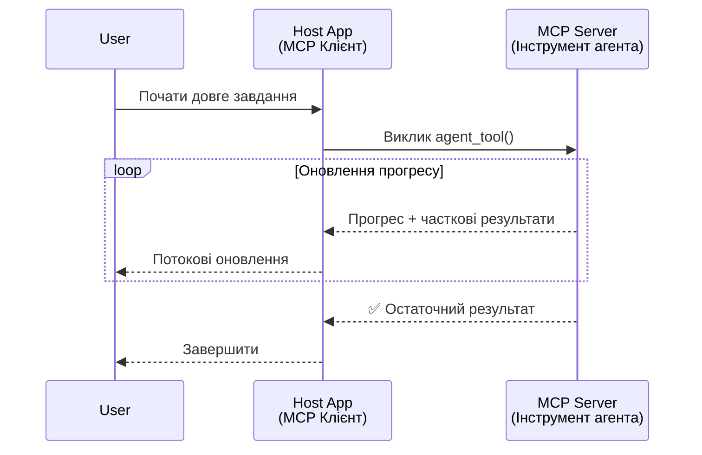
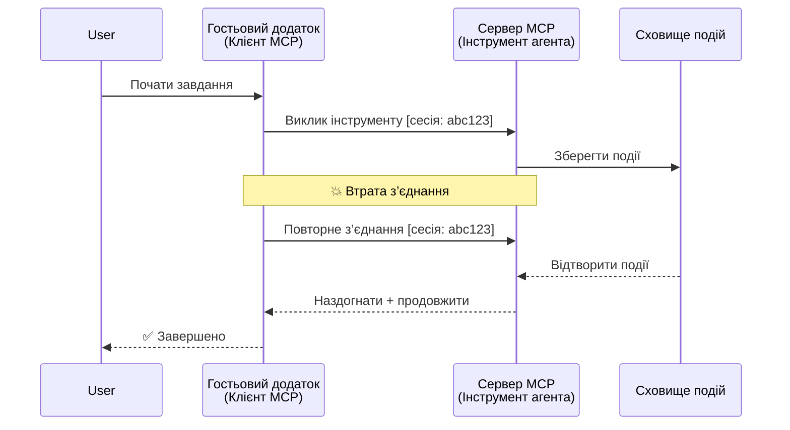
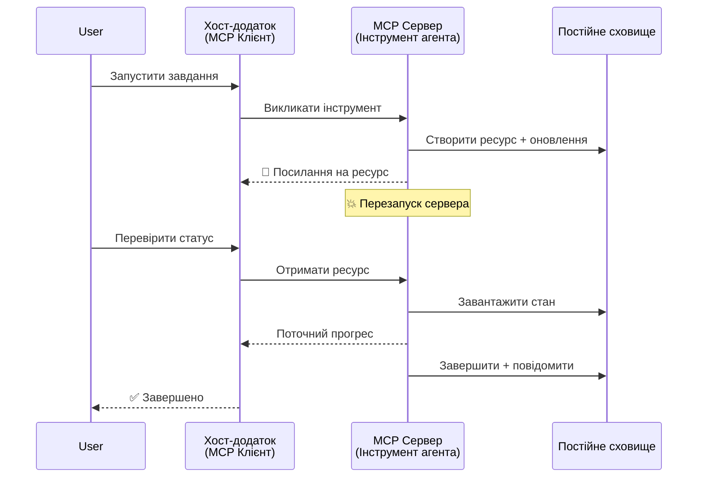
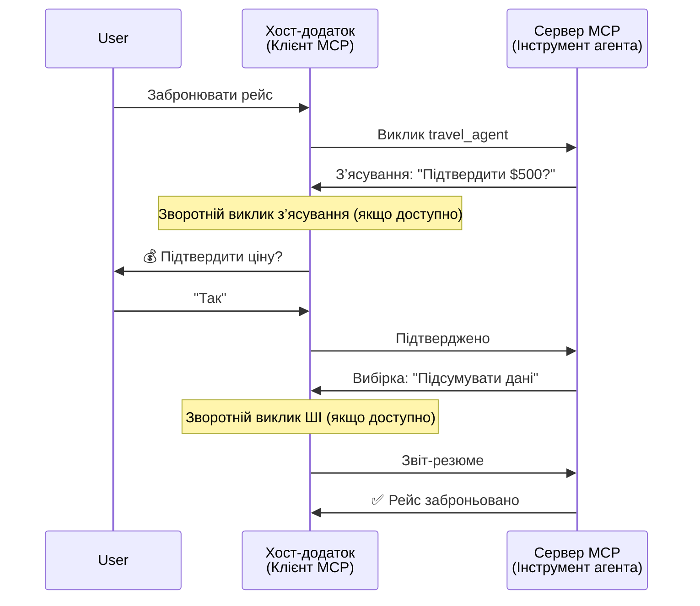
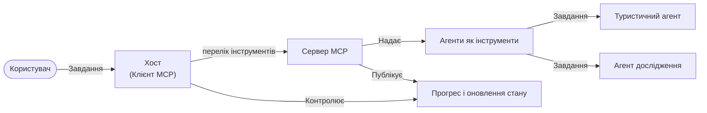

# Створення систем комунікації агент-до-агента за допомогою MCP

> Коротко - Чи можна побудувати комунікацію агент2агент на MCP? Так!

MCP значно еволюціонував за межі своєї початкової мети "надання контексту для LLM". Завдяки останнім покращенням, таким як [повторювані потоки](https://modelcontextprotocol.io/docs/concepts/transports#resumability-and-redelivery), [виклик інформації](https://modelcontextprotocol.io/specification/2025-06-18/client/elicitation), [відбір](https://modelcontextprotocol.io/specification/2025-06-18/client/sampling) та сповіщення ([прогрес](https://modelcontextprotocol.io/specification/2025-06-18/basic/utilities/progress) і [ресурси](https://modelcontextprotocol.io/specification/2025-06-18/schema#resourceupdatednotification)), MCP тепер забезпечує міцну основу для побудови складних систем комунікації агент-до-агента.

## Помилка в уявленні про агент/інструмент

Коли все більше розробників досліджують інструменти з агентними поведінками (працюють тривалий час, іноді потребують додаткового вводу під час виконання і т.д.), поширеною помилкою є думка, що MCP непридатний, насамперед тому, що ранні приклади інструментів MCP були примітивними і зосереджені на простих патернах запит-відповідь.

Це уявлення застаріле. Специфікація MCP була значно розширена за останні кілька місяців можливостями, які усувають прогалину для створення тривало працюючої агентної поведінки:

- **Потокова передача та часткові результати**: Оновлення прогресу в реальному часі під час виконання
- **Повторне підключення (Resumability)**: Клієнти можуть перепідключатись і продовжувати після відключення
- **Стійкість**: Результати зберігаються при перезапусках сервера (наприклад, через посилання на ресурси)
- **Багатократна взаємодія (Multi-turn)**: Інтерактивний ввід під час виконання через elicitation та sampling

Ці функції можна комбінувати для створення складних агентних і мультиагентних додатків, всі вони працюють на протоколі MCP.

Для посилання ми будемо називати агента "інструментом", який доступний на сервері MCP. Це означає існування хост-застосунку, який реалізує MCP клієнта, встановлює сесію з сервером MCP і може викликати агента.

## Що робить інструмент MCP «агентним»?

Перш ніж заглиблюватися в реалізацію, давайте визначимо, які інфраструктурні можливості потрібні для підтримки тривалих агентів.

> Ми визначимо агента як сутність, яка може автономно працювати протягом тривалого часу, здатну виконувати складні завдання, що можуть вимагати кількох взаємодій або коригувань на основі зворотнього зв’язку в реальному часі.

### 1. Потокова передача та часткові результати

Традиційні патерни запит-відповідь не підходять для тривалих завдань. Агенти повинні забезпечувати:

- Оновлення прогресу в режимі реального часу
- Проміжні результати

**Підтримка MCP**: Сповіщення про оновлення ресурсів дозволяють передавати часткові результати потоково, хоча це вимагає ретельного проєктування, щоб уникнути конфліктів із моделлю JSON-RPC, яка є 1:1 запит/відповідь.

| Функція                   | Випадок використання                                                                                                                                                           | Підтримка MCP                                                                             |
| ------------------------- | ------------------------------------------------------------------------------------------------------------------------------------------------------------------------------ | ----------------------------------------------------------------------------------------- |
| Оновлення прогресу в реальному часі | Користувач запитує завдання з міграції кодової бази. Агент потоково передає прогрес: "10% - Аналіз залежностей... 25% - Конвертація TypeScript файлів... 50% - Оновлення імпортів..." | ✅ Сповіщення про прогрес                                                                 |
| Часткові результати       | Завдання "Створити книгу" потоково передає часткові результати, наприклад: 1) контур сюжету, 2) список глав, 3) кожна глава по мірі завершення. Хост може переглядати, скасовувати або перенаправляти на будь-якому етапі. | ✅ Сповіщення можна "розширити", щоб включати часткові результати (див. пропозиції у PR 383, 776) |

<div align="center" style="font-style: italic; font-size: 0.95em; margin-bottom: 0.5em;">
<strong>Рисунок 1:</strong> Ця діаграма ілюструє, як агент MCP потоково передає оновлення прогресу та часткові результати у хост-застосунок під час тривалого завдання, що дає змогу користувачу моніторити виконання в реальному часі.
</div>



### 2. Повторюваність (Resumability)

Агенти повинні грамотно обробляти мережеві перебої:

- Підключення після відключення (клієнта)
- Продовження з того ж місця (повторна доставка повідомлень)

**Підтримка MCP**: Транспорт StreamableHTTP MCP сьогодні підтримує відновлення сесії та повторну доставку повідомлень за допомогою ідентифікаторів сесій і останніх ідентифікаторів подій. Важливо, що сервер має реалізувати EventStore, який дозволяє відтворювати події при підключенні клієнта.
Зверніть увагу, є пропозиція від спільноти (PR #975), яка досліджує транспорту-незалежні повторювані потоки.

| Функція      | Випадок використання                                                                                                                                           | Підтримка MCP                                                            |
| ------------ | -------------------------------------------------------------------------------------------------------------------------------------------------------------- | ------------------------------------------------------------------------ |
| Повторюваність | Клієнт відключається під час тривалого завдання. Після перепідключення сесія відновлюється з реплеєм пропущених подій, плавно продовжуючи з того місця, де перервалось. | ✅ Транспорт StreamableHTTP з ідентифікаторами сесій, реплеєм подій і EventStore |

<div align="center" style="font-style: italic; font-size: 0.95em; margin-bottom: 0.5em;">
<strong>Рисунок 2:</strong> Ця діаграма показує, як транспорт StreamableHTTP MCP і сховище подій забезпечують плавне відновлення сесії: якщо клієнт відключається, він може перепідключитися і відтворити пропущені події, продовжуючи завдання без втрати прогресу.
</div>



### 3. Стійкість (Durability)

Тривалі агенти потребують збереженого стану:

- Результати зберігаються при перезапуску сервера
- Статус можна отримати поза основним потоком
- Відстеження прогресу між сесіями

**Підтримка MCP**: MCP тепер підтримує тип повернення ресурсного посилання для викликів інструментів. Сьогодні можливий патерн — створити інструмент, який створює ресурс та негайно повертає посилання на ресурс. Інструмент може далі виконувати завдання у фоновому режимі і оновлювати ресурс. Клієнт, у свою чергу, може періодично опитувати стан цього ресурсу, щоб отримувати часткові або повні результати (залежно від оновлень ресурсу, які надає сервер), або підписатися на ресурс для отримання сповіщень про оновлення.

Одне з обмежень полягає в тому, що опитування ресурсів або підписка на оновлення може споживати ресурси з наслідками при масштабуванні. Є відкрита пропозиція спільноти (включно з #992), що досліджує можливість включення вебхуків або тригерів, які сервер може викликати для повідомлення клієнта/хост-застосунку про оновлення.

| Функція    | Випадок використання                                                                                                                                    | Підтримка MCP                                                      |
| ---------- | ------------------------------------------------------------------------------------------------------------------------------------------------------- | ------------------------------------------------------------------ |
| Стійкість  | Сервер падає під час завдання міграції даних. Результати та прогрес зберігаються після перезавантаження, клієнт може перевірити статус та продовжити з постійного ресурсу. | ✅ Посилання на ресурси з постійним збереженням та сповіщеннями про статус |

Сьогодні популярним патерном є дизайн інструменту, який створює ресурс і негайно повертає посилання на нього. Інструмент у фоновому режимі продовжує виконання завдання, надсилає сповіщення про ресурси як оновлення прогресу або часткові результати, оновлює вміст ресурсу за потребою.

<div align="center" style="font-style: italic; font-size: 0.95em; margin-bottom: 0.5em;">
<strong>Рисунок 3:</strong> Ця діаграма демонструє, як агенти MCP використовують постійні ресурси і сповіщення про статус, щоб забезпечити збереження тривалих завдань при перезапусках сервера, дозволяючи клієнтам перевіряти прогрес і отримувати результати навіть після збоїв.
</div>



### 4. Багатократні взаємодії (Multi-Turn Interactions)

Агенти часто потребують додаткового вводу під час виконання:

- Пояснення або затвердження людиною
- Допомога ШІ для складних рішень
- Динамічне налаштування параметрів

**Підтримка MCP**: Повністю підтримується через sampling (для вводу ШІ) та elicitation (для вводу людиною).

| Функція                 | Випадок використання                                                                                                                                     | Підтримка MCP                                           |
| ----------------------- | -------------------------------------------------------------------------------------------------------------------------------------------------------- | ----------------------------------------------------- |
| Багатократні взаємодії  | Агент бронювання запитує підтвердження ціни у користувача, потім просить ШІ підсумувати дані про подорож перед завершенням бронювання.                    | ✅ Elicitation для вводу людиною, sampling для ШІ вводу |

<div align="center" style="font-style: italic; font-size: 0.95em; margin-bottom: 0.5em;">
<strong>Рисунок 4:</strong> Ця діаграма показує, як агенти MCP можуть інтерактивно викликати ввід людини або запитувати допомогу ШІ під час виконання, підтримуючи складні багатокрокові робочі процеси, такі як підтвердження та динамічне прийняття рішень.
</div>



## Реалізація тривалих агентів на MCP - Огляд коду

У цій статті ми надаємо [репозиторій коду](https://github.com/victordibia/ai-tutorials/tree/main/MCP%20Agents), що містить повну реалізацію тривалих агентів із використанням MCP Python SDK і транспортом StreamableHTTP для відновлення сесій та повторної доставки повідомлень. Реалізація демонструє, як можливості MCP можна комбінувати для створення складної агентної поведінки.

Зокрема, ми реалізуємо сервер із двома основними агентними інструментами:

- **Агент подорожей** - Імітує сервіс бронювання з підтвердженням ціни через elicitation
- **Агент досліджень** - Виконує дослідження із підсумками за допомогою ШІ через sampling

Обидва агенти демонструють оновлення прогресу в реальному часі, інтерактивні підтвердження та повне відновлення сесій.

### Ключові концепції реалізації

Наступні розділи показують реалізацію агентів на серверній стороні та обробку на боці клієнта для кожної можливості:

#### Потокова передача та оновлення прогресу - статус завдання в реальному часі

Потокова передача дозволяє агентам надавати оновлення прогресу в режимі реального часу під час тривалих завдань, тримаючи користувачів поінформованими про статус завдання і проміжні результати.

**Реалізація сервера (агент надсилає сповіщення про прогрес):**

```python
# З сервера/server.py - Туристичний агент, який надсилає оновлення прогресу
for i, step in enumerate(steps):
    await ctx.session.send_progress_notification(
        progress_token=ctx.request_id,
        progress=i * 25,
        total=100,
        message=step,
        related_request_id=str(ctx.request_id)
    )
    await anyio.sleep(2)  # Імітація роботи

# Альтернатива: Журнали повідомлень для детальних покрокових оновлень
await ctx.session.send_log_message(
    level="info",
    data=f"Processing step {current_step}/{steps} ({progress_percent}%)",
    logger="long_running_agent",
    related_request_id=ctx.request_id,
)
```

**Реалізація клієнта (хост отримує оновлення прогресу):**

```python
# З файлу client/client.py - Клієнт, що обробляє сповіщення в реальному часі
async def message_handler(message) -> None:
    if isinstance(message, types.ServerNotification):
        if isinstance(message.root, types.LoggingMessageNotification):
            console.print(f"📡 [dim]{message.root.params.data}[/dim]")
        elif isinstance(message.root, types.ProgressNotification):
            progress = message.root.params
            console.print(f"🔄 [yellow]{progress.message} ({progress.progress}/{progress.total})[/yellow]")

# Зареєструвати обробник повідомлень при створенні сесії
async with ClientSession(
    read_stream, write_stream,
    message_handler=message_handler
) as session:
```

#### Виклик інформації (Elicitation) - Запит введення користувача

Виклик інформації дозволяє агентам запитувати ввід від користувача під час виконання. Це необхідно для підтверджень, уточнень або затверджень у тривалих завданнях.

**Реалізація сервера (агент запитує підтвердження):**

```python
# З server/server.py - Туристичний агент запитує підтвердження ціни
elicit_result = await ctx.session.elicit(
    message=f"Please confirm the estimated price of $1200 for your trip to {destination}",
    requestedSchema=PriceConfirmationSchema.model_json_schema(),
    related_request_id=ctx.request_id,
)

if elicit_result and elicit_result.action == "accept":
    # Продовжити бронювання
    logger.info(f"User confirmed price: {elicit_result.content}")
elif elicit_result and elicit_result.action == "decline":
    # Скасувати бронювання
    booking_cancelled = True
```

**Реалізація клієнта (хост надає callback для elicitation):**

```python
# З клієнта/client.py - Обробка клієнтом запитів на отримання інформації
async def elicitation_callback(context, params):
    console.print(f"💬 Server is asking for confirmation:")
    console.print(f"   {params.message}")

    response = console.input("Do you accept? (y/n): ").strip().lower()

    if response in ['y', 'yes']:
        return types.ElicitResult(
            action="accept",
            content={"confirm": True, "notes": "Confirmed by user"}
        )
    else:
        return types.ElicitResult(
            action="decline",
            content={"confirm": False, "notes": "Declined by user"}
        )

# Зареєструвати виклик зворотного зв'язку при створенні сесії
async with ClientSession(
    read_stream, write_stream,
    elicitation_callback=elicitation_callback
) as session:
```

#### Відбір (Sampling) - Запит допомоги ШІ

Відбір дозволяє агентам запитувати допомогу LLM для складних рішень або генерації контенту під час виконання. Це дає змогу реалізувати гібридні робочі процеси за участю людини та ШІ.

**Реалізація сервера (агент запитує допомогу ШІ):**

```python
# З server/server.py - Агент дослідження, що запитує підсумок ШІ
sampling_result = await ctx.session.create_message(
    messages=[
        SamplingMessage(
            role="user",
            content=TextContent(type="text", text=f"Please summarize the key findings for research on: {topic}")
        )
    ],
    max_tokens=100,
    related_request_id=ctx.request_id,
)

if sampling_result and sampling_result.content:
    if sampling_result.content.type == "text":
        sampling_summary = sampling_result.content.text
        logger.info(f"Received sampling summary: {sampling_summary}")
```

**Реалізація клієнта (хост надає callback для sampling):**

```python
# З client/client.py - Обробка клієнтських запитів на вибірку
async def sampling_callback(context, params):
    message_text = params.messages[0].content.text if params.messages else 'No message'
    console.print(f"🧠 Server requested sampling: {message_text}")

    # У реальному застосунку це може викликати API LLM
    # Для демонстраційних цілей ми надаємо фіктивну відповідь
    mock_response = "Based on current research, MCP has evolved significantly..."

    return types.CreateMessageResult(
        role="assistant",
        content=types.TextContent(type="text", text=mock_response),
        model="interactive-client",
        stopReason="endTurn"
    )

# Зареєструйте зворотний виклик під час створення сесії
async with ClientSession(
    read_stream, write_stream,
    sampling_callback=sampling_callback,
    elicitation_callback=elicitation_callback
) as session:
```

#### Повторюваність - Безперервність сесії після відключень

Повторюваність гарантує, що тривалі завдання агентів можуть витримувати відключення клієнта і продовжуватися плавно після повторного підключення. Це реалізується через сховища подій і токени відновлення.

**Реалізація сховища подій (сервер утримує стан сесії):**

```python
# З файлу server/event_store.py - Просте сховище подій в пам'яті
class SimpleEventStore(EventStore):
    def __init__(self):
        self._events: list[tuple[StreamId, EventId, JSONRPCMessage]] = []
        self._event_id_counter = 0

    async def store_event(self, stream_id: StreamId, message: JSONRPCMessage) -> EventId:
        """Store an event and return its ID."""
        self._event_id_counter += 1
        event_id = str(self._event_id_counter)
        self._events.append((stream_id, event_id, message))
        return event_id

    async def replay_events_after(self, last_event_id: EventId, send_callback: EventCallback) -> StreamId | None:
        """Replay events after the specified ID for resumption."""
        # Знайти події після останньої відомої події та відтворити їх
        for _, event_id, message in self._events[start_index:]:
            await send_callback(EventMessage(message, event_id))

# З файлу server/server.py - Передача сховища подій менеджеру сесій
def create_server_app(event_store: Optional[EventStore] = None) -> Starlette:
    server = ResumableServer()

    # Створити менеджера сесій зі сховищем подій для відновлення
    session_manager = StreamableHTTPSessionManager(
        app=server,
        event_store=event_store,  # Сховище подій дозволяє відновлення сесії
        json_response=False,
        security_settings=security_settings,
    )

    return Starlette(routes=[Mount("/mcp", app=session_manager.handle_request)])

# Використання: Ініціалізація зі сховищем подій
event_store = SimpleEventStore()
app = create_server_app(event_store)
```

**Метадані клієнта з токеном відновлення (клієнт перепідключається, використовуючи збережений стан):**

```python
# З файлу client/client.py - Відновлення клієнта з метаданими
if existing_tokens and existing_tokens.get("resumption_token"):
    # Використовуйте існуючий токен відновлення, щоб продовжити з того місця, де зупинилися
    metadata = ClientMessageMetadata(
        resumption_token=existing_tokens["resumption_token"],
    )
else:
    # Створіть зворотний виклик для збереження токена відновлення при його отриманні
    def enhanced_callback(token: str):
        protocol_version = getattr(session, 'protocol_version', None)
        token_manager.save_tokens(session_id, token, protocol_version, command, args)

    metadata = ClientMessageMetadata(
        on_resumption_token_update=enhanced_callback,
    )

# Надішліть запит з метаданими відновлення
result = await session.send_request(
    types.ClientRequest(
        types.CallToolRequest(
            method="tools/call",
            params=types.CallToolRequestParams(name=command, arguments=args)
        )
    ),
    types.CallToolResult,
    metadata=metadata,
)
```

Хост-застосунок зберігає локально ідентифікатори сесій і токени відновлення, що дозволяє перепідключатися до існуючих сесій без втрати прогресу чи стану.

### Організація коду

<div align="center" style="font-style: italic; font-size: 0.95em; margin-bottom: 0.5em;">
<strong>Рисунок 5:</strong> Архітектура системи агентів на базі MCP
</div>



**Ключові файли:**

- **`server/server.py`** - Відновлюваний MCP сервер із агентами подорожей і досліджень, що демонструють виклик інформації, відбір та оновлення прогресу
- **`client/client.py`** - Інтерактивний хост-застосунок із підтримкою відновлення, обробниками callback та керуванням токенами
- **`server/event_store.py`** - Реалізація сховища подій для відновлення сесії та повторної доставки повідомлень

## Розширення до мультиагентної комунікації на MCP

Вищезгадану реалізацію можна розширити до мультиагентних систем, покращуючи інтелект і обсяг хост-застосунку:

- **Інтелектуальний розподіл завдань**: Хост аналізує складні запити користувачів і розбиває їх на підзавдання для різних спеціалізованих агентів
- **Координація кількох серверів**: Хост підтримує зв’язок із кількома серверами MCP, кожен з яких має різні можливості агентів
- **Управління станом завдань**: Хост відстежує прогрес між кількома паралельними завданнями агентів, управляє залежностями та послідовністю
- **Стійкість і повторні спроби**: Хост керує збоями, реалізує логіку повторних спроб та перенаправляє завдання, коли агенти недоступні
- **Синтез результатів**: Хост об’єднує вихідні дані від кількох агентів у узгоджені кінцеві результати

Хост розвивається від простого клієнта до інтелектуального оркестратора, координуючи розподілені можливості агентів, зберігаючи при цьому ту ж основу протоколу MCP.

## Висновок

Розширені можливості MCP - сповіщення про ресурси, виклик інформації/відбір, повторювані потоки та постійні ресурси - дозволяють складні взаємодії агент-до-агента, зберігаючи простоту протоколу.

## Початок роботи

Готові створити власну систему agent2agent? Дотримуйтесь цих кроків:

### 1. Запустіть демо

```bash
# Запустіть сервер з сховищем подій для відновлення
python -m server.server --port 8006

# В іншому терміналі запустіть інтерактивний клієнт
python -m client.client --url http://127.0.0.1:8006/mcp
```

**Доступні команди в інтерактивному режимі:**

- `travel_agent` - Забронювати подорож з підтвердженням ціни через elicitation
- `research_agent` - Дослідити теми з підсумками за допомогою ШІ через sampling
- `list` - Показати всі доступні інструменти
- `clean-tokens` - Очистити токени відновлення
- `help` - Показати детальну допомогу по командах
- `quit` - Вийти з клієнта

### 2. Перевірте можливості відновлення

- Розпочати тривалого агента (наприклад, `travel_agent`)
- Перервати клієнта під час виконання (Ctrl+C)
- Перезапустити клієнта - він автоматично відновить роботу з того місця, де зупинився

### 3. Досліджуйте та розширюйте

- **Досліджуйте приклади**: Перегляньте цей [mcp-agents](https://github.com/victordibia/ai-tutorials/tree/main/MCP%20Agents)
- **Приєднуйтесь до спільноти**: Беріть участь у дискусіях MCP на GitHub
- **Експериментуйте**: Почніть із простого тривалого завдання і поступово додавайте потокову передачу, повторюваність та координацію мультиагентів

Це демонструє, як MCP дозволяє реалізувати інтелектуальну агентну поведінку, зберігаючи простоту інструментальної моделі.

Загалом, спецификация протоколу MCP швидко розвивається; рекомендуємо читачу ознайомитися з офіційним сайтом документації для останніх оновлень - https://modelcontextprotocol.io/introduction

---

<!-- CO-OP TRANSLATOR DISCLAIMER START -->
**Відмова від відповідальності**:
Цей документ було перекладено за допомогою сервісу штучного інтелекту для перекладу [Co-op Translator](https://github.com/Azure/co-op-translator). Хоча ми прагнемо до точності, будь ласка, майте на увазі, що автоматичні переклади можуть містити помилки або неточності. Оригінальний документ рідною мовою слід вважати авторитетним джерелом. Для критично важливої інформації рекомендується професійний людський переклад. Ми не несемо відповідальності за будь-які непорозуміння або неправильні тлумачення, що виникли внаслідок використання цього перекладу.
<!-- CO-OP TRANSLATOR DISCLAIMER END -->