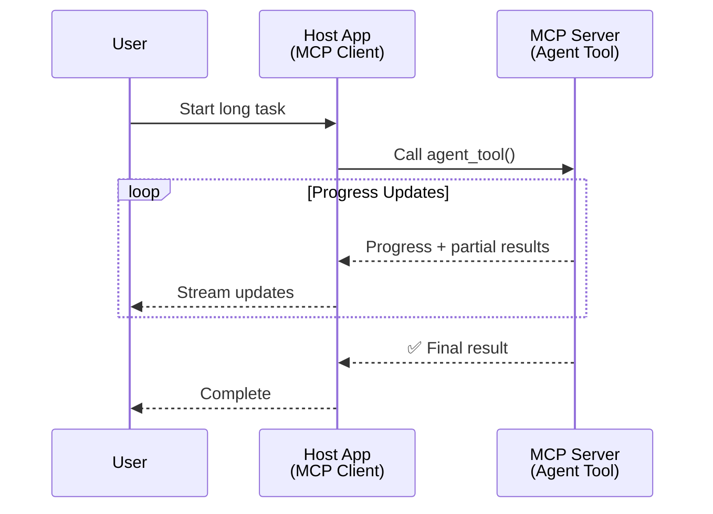
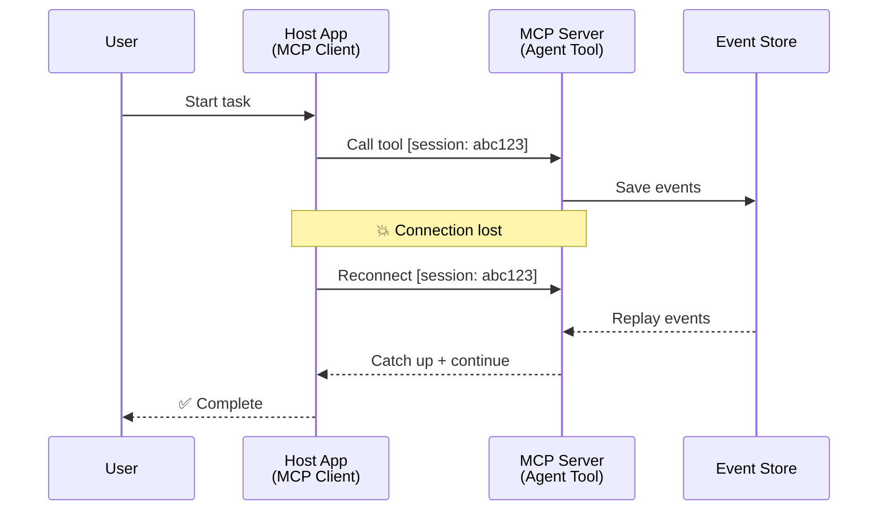
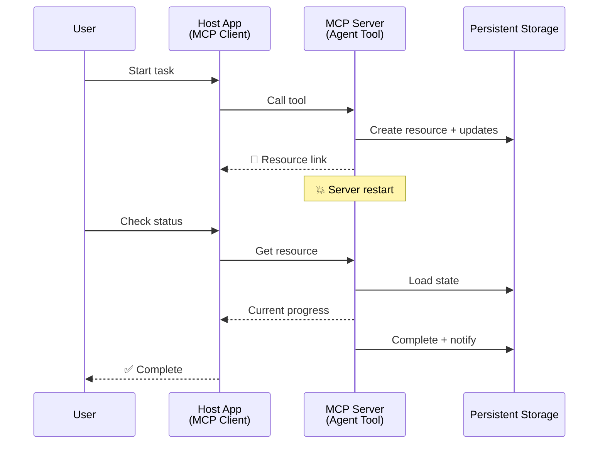
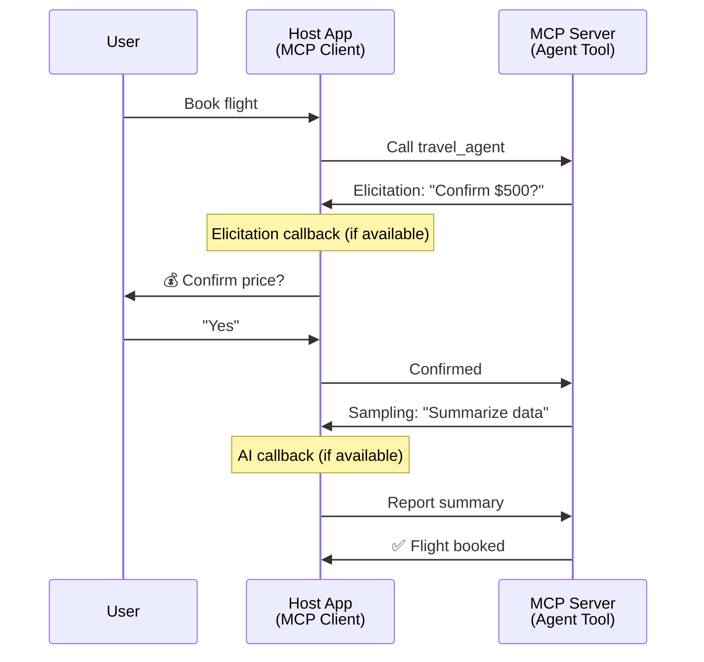
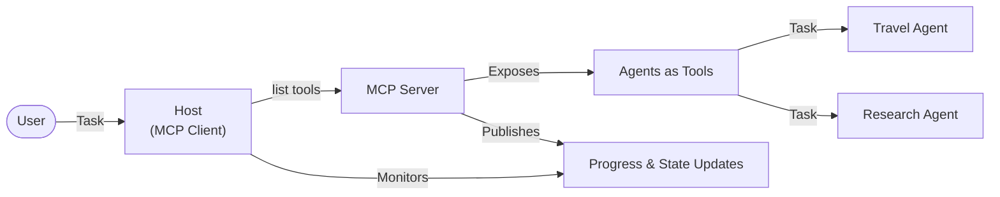

<!--
CO_OP_TRANSLATOR_METADATA:
{
  "original_hash": "5cc6836626047aa055e8960c8484a7d0",
  "translation_date": "2025-08-21T13:44:32+00:00",
  "source_file": "11-mcp/code_samples/mcp-agents/README.md",
  "language_code": "uk"
}
-->
# Побудова систем комунікації агент-агент за допомогою MCP

> Коротко - Чи можна створити комунікацію агент-агент на MCP? Так!

MCP значно розвинувся від своєї початкової мети "надання контексту для LLM". Завдяки останнім вдосконаленням, таким як [відновлювані потоки](https://modelcontextprotocol.io/docs/concepts/transports#resumability-and-redelivery), [елісітація](https://modelcontextprotocol.io/specification/2025-06-18/client/elicitation), [семплінг](https://modelcontextprotocol.io/specification/2025-06-18/client/sampling) і сповіщення ([прогрес](https://modelcontextprotocol.io/specification/2025-06-18/basic/utilities/progress) та [ресурси](https://modelcontextprotocol.io/specification/2025-06-18/schema#resourceupdatednotification)), MCP тепер забезпечує надійну основу для створення складних систем комунікації агент-агент.

## Неправильне уявлення про агента/інструмент

Зі зростанням інтересу розробників до інструментів із агентною поведінкою (тривала робота, необхідність додаткового вводу під час виконання тощо) поширюється хибне уявлення, що MCP не підходить для цього, оскільки ранні приклади його інструментів зосереджувалися на простих шаблонах запит-відповідь.

Це уявлення застаріло. Специфікація MCP значно вдосконалена за останні місяці, що дозволяє створювати тривалі агентні поведінки:

- **Стрімінг і часткові результати**: Оновлення прогресу в реальному часі під час виконання
- **Відновлюваність**: Клієнти можуть перепідключатися і продовжувати після розриву з'єднання
- **Стійкість**: Результати зберігаються після перезапуску сервера (наприклад, через посилання на ресурси)
- **Багатокроковість**: Інтерактивний ввід під час виконання через елісітацію та семплінг

Ці функції можна комбінувати для створення складних агентних і мультиагентних застосунків, розгорнутих на протоколі MCP.

Для довідки, ми будемо називати агента "інструментом", доступним на сервері MCP. Це передбачає існування хост-застосунку, який реалізує клієнт MCP, встановлює сесію із сервером MCP і може викликати агента.

## Що робить інструмент MCP "агентним"?

Перш ніж перейти до реалізації, визначимо, які інфраструктурні можливості потрібні для підтримки тривалих агентів.

> Ми визначимо агента як сутність, здатну працювати автономно протягом тривалого часу, виконуючи складні завдання, які можуть вимагати багаторазових взаємодій або коригувань на основі зворотного зв'язку в реальному часі.

### 1. Стрімінг і часткові результати

Традиційні шаблони запит-відповідь не підходять для тривалих завдань. Агенти повинні надавати:

- Оновлення прогресу в реальному часі
- Проміжні результати

**Підтримка MCP**: Сповіщення про оновлення ресурсів дозволяють стрімити часткові результати, хоча це вимагає ретельного дизайну, щоб уникнути конфліктів із моделлю 1:1 запит/відповідь JSON-RPC.

| Функція                   | Використання                                                                                                                                                                       | Підтримка MCP                                                                              |
| ------------------------- | --------------------------------------------------------------------------------------------------------------------------------------------------------------------------------- | ------------------------------------------------------------------------------------------ |
| Оновлення прогресу в реальному часі | Користувач запитує завдання міграції кодової бази. Агент стрімить прогрес: "10% - Аналіз залежностей... 25% - Конвертація файлів TypeScript... 50% - Оновлення імпортів..." | ✅ Сповіщення про прогрес                                                                  |
| Часткові результати       | Завдання "Згенерувати книгу" стрімить часткові результати, наприклад: 1) План сюжету, 2) Список розділів, 3) Кожен завершений розділ. Хост може перевірити, скасувати або перенаправити на будь-якому етапі. | ✅ Сповіщення можуть бути "розширені" для включення часткових результатів, див. пропозиції PR 383, 776 |

<div align="center" style="font-style: italic; font-size: 0.95em; margin-bottom: 0.5em;">
<strong>Рисунок 1:</strong> Ця діаграма ілюструє, як агент MCP стрімить оновлення прогресу в реальному часі та часткові результати до хост-застосунку під час тривалого завдання, дозволяючи користувачеві відстежувати виконання в реальному часі.
</div>



### 2. Відновлюваність

Агенти повинні обробляти розриви мережі без втрати даних:

- Перепідключення після розриву з'єднання (з боку клієнта)
- Продовження з того місця, де зупинилися (повторна доставка повідомлень)

**Підтримка MCP**: Транспорт StreamableHTTP у MCP підтримує відновлення сесій і повторну доставку повідомлень за допомогою ідентифікаторів сесій і останніх ідентифікаторів подій. Важливо, щоб сервер реалізував EventStore, який дозволяє відтворювати події під час перепідключення клієнта.  
Зверніть увагу, що існує пропозиція спільноти (PR #975), яка досліджує транспортно-незалежні відновлювані потоки.

| Функція       | Використання                                                                                                                                                   | Підтримка MCP                                                                |
| ------------- | -------------------------------------------------------------------------------------------------------------------------------------------------------------- | -------------------------------------------------------------------------- |
| Відновлюваність | Клієнт розриває з'єднання під час тривалого завдання. Після перепідключення сесія відновлюється з відтворенням пропущених подій, продовжуючи безперервно. | ✅ Транспорт StreamableHTTP з ідентифікаторами сесій, відтворенням подій і EventStore |

<div align="center" style="font-style: italic; font-size: 0.95em; margin-bottom: 0.5em;">
<strong>Рисунок 2:</strong> Ця діаграма показує, як транспорт StreamableHTTP і EventStore у MCP забезпечують безперервне відновлення сесій: якщо клієнт розриває з'єднання, він може перепідключитися і відтворити пропущені події, продовжуючи завдання без втрати прогресу.
</div>



### 3. Стійкість

Тривалі агенти потребують збереження стану:

- Результати зберігаються після перезапуску сервера
- Статус можна отримати поза сесією
- Відстеження прогресу між сесіями

**Підтримка MCP**: MCP тепер підтримує тип повернення Resource link для викликів інструментів. Сьогодні можливий шаблон - розробити інструмент, який створює ресурс і негайно повертає посилання на ресурс. Інструмент може продовжувати виконувати завдання у фоновому режимі та оновлювати ресурс. У свою чергу, клієнт може вибрати опитування стану цього ресурсу, щоб отримати часткові або повні результати (залежно від того, які оновлення ресурсу надає сервер), або підписатися на ресурс для отримання сповіщень про оновлення.

Одним із обмежень є те, що опитування ресурсів або підписка на оновлення можуть споживати ресурси, що має наслідки для масштабування. Існує відкрита пропозиція спільноти (включаючи #992), яка досліджує можливість включення вебхуків або тригерів, які сервер може викликати для сповіщення клієнта/хост-застосунку про оновлення.

| Функція    | Використання                                                                                                                                        | Підтримка MCP                                                        |
| ---------- | ----------------------------------------------------------------------------------------------------------------------------------------------- | ------------------------------------------------------------------ |
| Стійкість | Сервер аварійно завершує роботу під час завдання міграції даних. Результати та прогрес зберігаються після перезапуску, клієнт може перевірити статус і продовжити збережений ресурс. | ✅ Посилання на ресурси з постійним зберіганням і сповіщеннями про статус |

<div align="center" style="font-style: italic; font-size: 0.95em; margin-bottom: 0.5em;">
<strong>Рисунок 3:</strong> Ця діаграма демонструє, як агенти MCP використовують постійні ресурси та сповіщення про статус, щоб забезпечити збереження тривалих завдань після перезапуску сервера, дозволяючи клієнтам перевіряти прогрес і отримувати результати навіть після збоїв.
</div>



### 4. Багатокрокові взаємодії

Агенти часто потребують додаткового вводу під час виконання:

- Уточнення або підтвердження від людини
- Допомога ШІ для складних рішень
- Динамічне налаштування параметрів

**Підтримка MCP**: Повністю підтримується через семплінг (для вводу ШІ) та елісітацію (для вводу людини).

| Функція                 | Використання                                                                                                                                     | Підтримка MCP                                           |
| ----------------------- | -------------------------------------------------------------------------------------------------------------------------------------------- | ----------------------------------------------------- |
| Багатокрокові взаємодії | Агент бронювання подорожей запитує підтвердження ціни у користувача, потім просить ШІ підсумувати дані про подорож перед завершенням транзакції. | ✅ Елісітація для вводу людини, семплінг для вводу ШІ |

<div align="center" style="font-style: italic; font-size: 0.95em; margin-bottom: 0.5em;">
<strong>Рисунок 4:</strong> Ця діаграма показує, як агенти MCP можуть інтерактивно запитувати ввід людини або допомогу ШІ під час виконання, підтримуючи складні багатокрокові робочі процеси, такі як підтвердження та динамічне прийняття рішень.
</div>



## Реалізація тривалих агентів на MCP - Огляд коду

У рамках цієї статті ми надаємо [репозиторій коду](https://github.com/victordibia/ai-tutorials/tree/main/MCP%20Agents), який містить повну реалізацію тривалих агентів за допомогою MCP Python SDK із транспортом StreamableHTTP для відновлення сесій і повторної доставки повідомлень. Реалізація демонструє, як можливості MCP можуть бути скомпоновані для забезпечення складної агентної поведінки.

Зокрема, ми реалізуємо сервер із двома основними інструментами-агентами:

- **Агент подорожей** - Імітує сервіс бронювання подорожей із підтвердженням ціни через елісітацію
- **Агент досліджень** - Виконує дослідницькі завдання з підсумками, створеними ШІ, через семплінг

Обидва агенти демонструють оновлення прогресу в реальному часі, інтерактивні підтвердження та повну підтримку відновлення сесій.

### Основні концепції реалізації

Наступні розділи показують реалізацію агента на стороні сервера та обробку хостом на стороні клієнта для кожної функції:

#### Стрімінг і оновлення прогресу - Статус завдання в реальному часі

Стрімінг дозволяє агентам надавати оновлення прогресу в реальному часі під час тривалих завдань, інформуючи користувачів про статус завдання та проміжні результати.

**Реалізація на сервері (агент надсилає сповіщення про прогрес):**

```python
# From server/server.py - Travel agent sending progress updates
for i, step in enumerate(steps):
    await ctx.session.send_progress_notification(
        progress_token=ctx.request_id,
        progress=i * 25,
        total=100,
        message=step,
        related_request_id=str(ctx.request_id)
    )
    await anyio.sleep(2)  # Simulate work

# Alternative: Log messages for detailed step-by-step updates
await ctx.session.send_log_message(
    level="info",
    data=f"Processing step {current_step}/{steps} ({progress_percent}%)",
    logger="long_running_agent",
    related_request_id=ctx.request_id,
)
```

**Реалізація на клієнті (хост отримує оновлення прогресу):**

```python
# From client/client.py - Client handling real-time notifications
async def message_handler(message) -> None:
    if isinstance(message, types.ServerNotification):
        if isinstance(message.root, types.LoggingMessageNotification):
            console.print(f"📡 [dim]{message.root.params.data}[/dim]")
        elif isinstance(message.root, types.ProgressNotification):
            progress = message.root.params
            console.print(f"🔄 [yellow]{progress.message} ({progress.progress}/{progress.total})[/yellow]")

# Register message handler when creating session
async with ClientSession(
    read_stream, write_stream,
    message_handler=message_handler
) as session:
```

#### Елісітація - Запит вводу користувача

Елісітація дозволяє агентам запитувати ввід користувача під час виконання. Це важливо для підтверджень, уточнень або схвалень під час тривалих завдань.

**Реалізація на сервері (агент запитує підтвердження):**

```python
# From server/server.py - Travel agent requesting price confirmation
elicit_result = await ctx.session.elicit(
    message=f"Please confirm the estimated price of $1200 for your trip to {destination}",
    requestedSchema=PriceConfirmationSchema.model_json_schema(),
    related_request_id=ctx.request_id,
)

if elicit_result and elicit_result.action == "accept":
    # Continue with booking
    logger.info(f"User confirmed price: {elicit_result.content}")
elif elicit_result and elicit_result.action == "decline":
    # Cancel the booking
    booking_cancelled = True
```

**Реалізація на клієнті (хост надає зворотний виклик для елісітації):**

```python
# From client/client.py - Client handling elicitation requests
async def elicitation_callback(context, params):
    console.print(f"💬 Server is asking for confirmation:")
    console.print(f"   {params.message}")

    response = console.input("Do you accept? (y/n): ").strip().lower()

    if response in ['y', 'yes']:
        return types.ElicitResult(
            action="accept",
            content={"confirm": True, "notes": "Confirmed by user"}
        )
    else:
        return types.ElicitResult(
            action="decline",
            content={"confirm": False, "notes": "Declined by user"}
        )

# Register the callback when creating the session
async with ClientSession(
    read_stream, write_stream,
    elicitation_callback=elicitation_callback
) as session:
```

#### Семплінг - Запит допомоги ШІ

Семплінг дозволяє агентам запитувати допомогу LLM для складних рішень або генерації контенту під час виконання. Це дозволяє створювати гібридні робочі процеси людина-ШІ.

**Реалізація на сервері (агент запитує допомогу ШІ):**

```python
# From server/server.py - Research agent requesting AI summary
sampling_result = await ctx.session.create_message(
    messages=[
        SamplingMessage(
            role="user",
            content=TextContent(type="text", text=f"Please summarize the key findings for research on: {topic}")
        )
    ],
    max_tokens=100,
    related_request_id=ctx.request_id,
)

if sampling_result and sampling_result.content:
    if sampling_result.content.type == "text":
        sampling_summary = sampling_result.content.text
        logger.info(f"Received sampling summary: {sampling_summary}")
```

**Реалізація на клієнті (хост надає зворотний виклик для семплінгу):**

```python
# From client/client.py - Client handling sampling requests
async def sampling_callback(context, params):
    message_text = params.messages[0].content.text if params.messages else 'No message'
    console.print(f"🧠 Server requested sampling: {message_text}")

    # In a real application, this could call an LLM API
    # For demo purposes, we provide a mock response
    mock_response = "Based on current research, MCP has evolved significantly..."

    return types.CreateMessageResult(
        role="assistant",
        content=types.TextContent(type="text", text=mock_response),
        model="interactive-client",
        stopReason="endTurn"
    )

# Register the callback when creating the session
async with ClientSession(
    read_stream, write_stream,
    sampling_callback=sampling_callback,
    elicitation_callback=elicitation_callback
) as session:
```

#### Відновлюваність - Безперервність сесії при розривах

Відновлюваність забезпечує, що тривалі завдання агентів можуть пережити розриви клієнта та продовжуватися безперервно після перепідключення. Це реалізується через сховища подій і токени відновлення.

**Реалізація сховища подій (сервер зберігає стан сесії):**

```python
# From server/event_store.py - Simple in-memory event store
class SimpleEventStore(EventStore):
    def __init__(self):
        self._events: list[tuple[StreamId, EventId, JSONRPCMessage]] = []
        self._event_id_counter = 0

    async def store_event(self, stream_id: StreamId, message: JSONRPCMessage) -> EventId:
        """Store an event and return its ID."""
        self._event_id_counter += 1
        event_id = str(self._event_id_counter)
        self._events.append((stream_id, event_id, message))
        return event_id

    async def replay_events_after(self, last_event_id: EventId, send_callback: EventCallback) -> StreamId | None:
        """Replay events after the specified ID for resumption."""
        # Find events after the last known event and replay them
        for _, event_id, message in self._events[start_index:]:
            await send_callback(EventMessage(message, event_id))

# From server/server.py - Passing event store to session manager
def create_server_app(event_store: Optional[EventStore] = None) -> Starlette:
    server = ResumableServer()

    # Create session manager with event store for resumption
    session_manager = StreamableHTTPSessionManager(
        app=server,
        event_store=event_store,  # Event store enables session resumption
        json_response=False,
        security_settings=security_settings,
    )

    return Starlette(routes=[Mount("/mcp", app=session_manager.handle_request)])

# Usage: Initialize with event store
event_store = SimpleEventStore()
app = create_server_app(event_store)
```

**Метадані клієнта з токеном відновлення (клієнт перепідключається, використовуючи збережений стан):**

```python
# From client/client.py - Client resumption with metadata
if existing_tokens and existing_tokens.get("resumption_token"):
    # Use existing resumption token to continue where we left off
    metadata = ClientMessageMetadata(
        resumption_token=existing_tokens["resumption_token"],
    )
else:
    # Create callback to save resumption token when received
    def enhanced_callback(token: str):
        protocol_version = getattr(session, 'protocol_version', None)
        token_manager.save_tokens(session_id, token, protocol_version, command, args)

    metadata = ClientMessageMetadata(
        on_resumption_token_update=enhanced_callback,
    )

# Send request with resumption metadata
result = await session.send_request(
    types.ClientRequest(
        types.CallToolRequest(
            method="tools/call",
            params=types.CallToolRequestParams(name=command, arguments=args)
        )
    ),
    types.CallToolResult,
    metadata=metadata,
)
```

Хост-застосунок зберігає локально ідентифікатори сесій і токени відновлення, що дозволяє йому перепідключатися до існуючих сесій без втрати прогресу чи стану.

### Організація коду

<div align="center" style="font-style: italic; font-size: 0.95em; margin-bottom: 0.5em;">
<strong>Рисунок 5:</strong> Архітектура системи агентів на основі MCP
</div>



**Основні файли:**

- **`server/server.py`** - Сервер MCP із підтримкою відновлення, агентами подорожей і досліджень, які демонструють елісітацію, семплінг і оновлення прогресу
- **`client/client.py`** - Інтерактивний хост-застосунок із підтримкою відновлення, обробниками зворотних викликів і керуванням токенами
- **`server/event_store.py`** - Реалізація сховища подій, що забезпечує відновлення сесій і повторну доставку повідомлень

## Розширення до мультиагентної комунікації на MCP

Реалізацію вище можна розширити до мультиагентних систем, розширивши інтелект і масштаб хост-застосунку:

- **Інтелектуальна декомпозиція завдань**: Хост аналізує складні запити користувачів і розбиває їх на підзавдання для різних спеціалізованих агентів
- **Координація між серверами**: Хост підтримує з'єднання з кількома серверами MCP, кожен із яких надає різні можливості агентів
- **Керування станом завдань**: Хост відстежує прогрес кількох одночасних завдань агентів, обробляючи залежності та послідовність
- **Стійкість і повтори**: Хост керує збоями, реалізує логіку повторів і перенаправляє завдання, коли агенти стають недоступними
- **Синтез результатів**: Хост об'єднує результати кількох агентів у цілісні підсумкові результати

Хост еволюціонує від простого клієнта до інтелектуального оркестратора, координуючи розподілені можливості агентів, зберігаючи при цьому основу протоколу MCP.

## Висновок

Розширені можливості MCP - сповіщення про ресурси, елісітація

**Відмова від відповідальності**:  
Цей документ було перекладено за допомогою сервісу автоматичного перекладу [Co-op Translator](https://github.com/Azure/co-op-translator). Хоча ми прагнемо до точності, звертаємо вашу увагу, що автоматичні переклади можуть містити помилки або неточності. Оригінальний документ на його рідній мові слід вважати авторитетним джерелом. Для критично важливої інформації рекомендується професійний людський переклад. Ми не несемо відповідальності за будь-які непорозуміння або неправильні тлумачення, що виникли внаслідок використання цього перекладу.