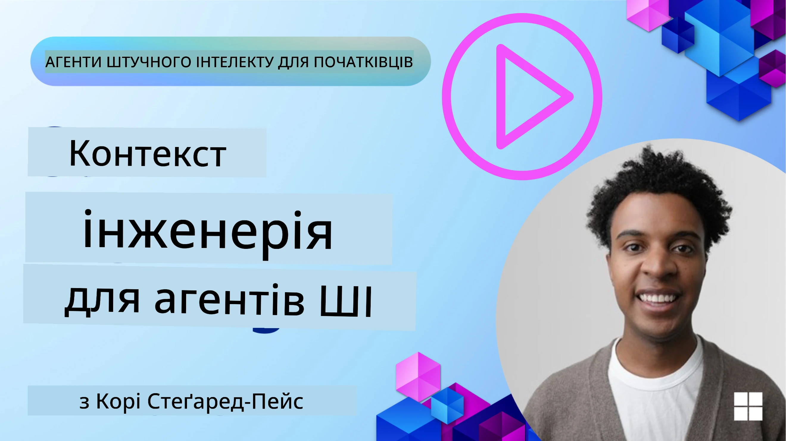
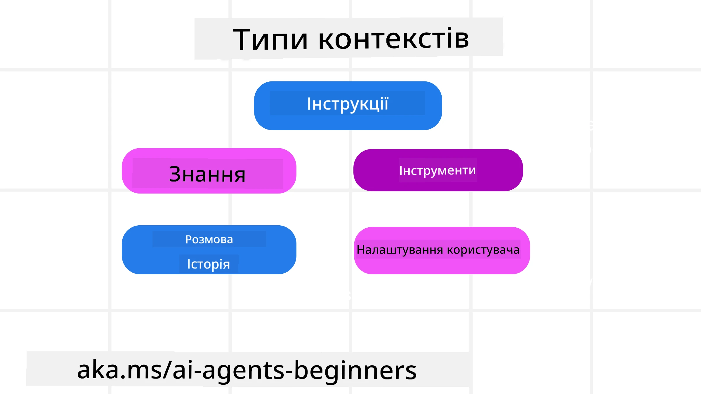
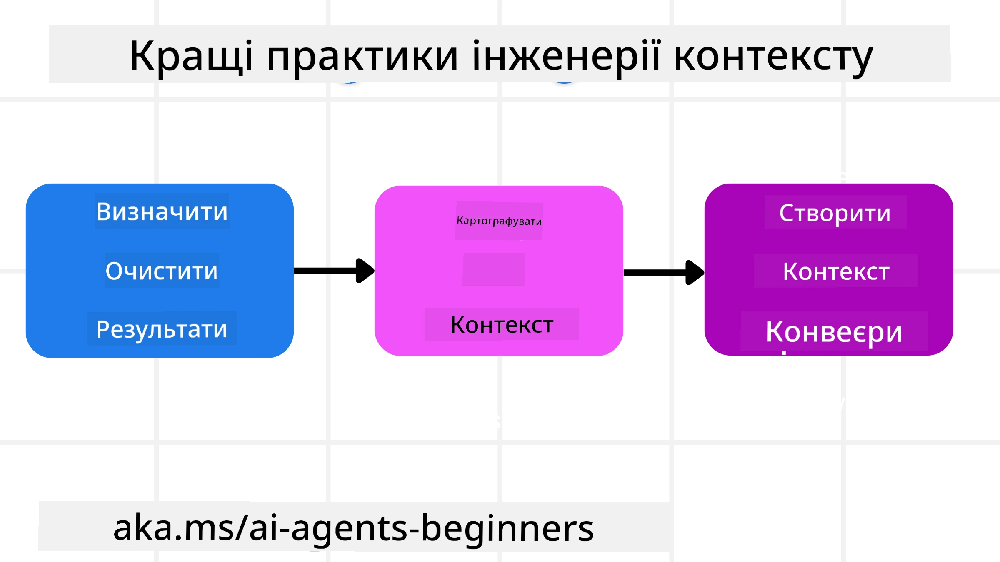

# Context Engineering для AI Агентів

> _(Натисніть на зображення вище, щоб переглянути відео цього уроку)_

Розуміння складності застосунку, для якого ви створюєте AI агента, важливе для створення надійного агента. Нам потрібно розробляти AI агентів, які ефективно керують інформацією, щоб задовольнити складні потреби, що виходять за межі інженерії підказок.

У цьому уроці ми розглянемо, що таке контекстна інженерія та яку роль вона відіграє у створенні AI агентів.

## Вступ

У цьому уроці буде розглянуто:

• **Що таке контекстна інженерія** та чому вона відрізняється від інженерії підказок.

• **Стратегії ефективної контекстної інженерії**, включаючи те, як писати, вибирати, стиснути й ізолювати інформацію.

• **Поширені помилки з контекстом**, які можуть зірвати роботу AI агента, і як їх виправити.

## Цілі навчання

Після завершення цього уроку ви знатимете, як:

• **Визначити контекстну інженерію** та відрізняти її від інженерії підказок.

• **Виявляти ключові компоненти контексту** у застосунках із великими мовними моделями (LLM).

• **Застосовувати стратегії написання, відбору, стиснення та ізоляції контексту** для покращення продуктивності агента.

• **Розпізнавати поширені помилки контексту**, такі як отруєння, відволікання, плутанина та конфлікт, а також впроваджувати методики їх усунення.

## Що таке контекстна інженерія?

Для AI агентів контекст визначає планування агента щодо виконання певних дій. Контекстна інженерія — це практика забезпечення того, щоб AI агент мав правильну інформацію для виконання наступного кроку завдання. Вікно контексту обмежене за розміром, тому як розробники агентів ми повинні створювати системи та процеси для додавання, видалення та стискання інформації у вікні контексту.

### Інженерія підказок проти контекстної інженерії

Інженерія підказок зосереджена на одному наборі статичних інструкцій для ефективного керування AI агентами за допомогою набору правил. Контекстна інженерія керує динамічним набором інформації, включаючи початкову підказку, щоб гарантувати, що AI агент має необхідне з часом. Основна ідея контекстної інженерії — зробити цей процес повторюваним і надійним.

### Типи контексту

Важливо пам’ятати, що контекст — це не щось одне. Інформація, яка потрібна AI агенту, може надходити з різних джерел, і наше завдання — забезпечити агенту доступ до цих джерел:

Типи контексту, якими AI агент може керувати, включають:

• **Інструкції:** Це як "правила" агента – підказки, системні повідомлення, few-shot приклади (показують AI, як щось зробити), та описи інструментів, які він може використовувати. Тут поєднуються фокус інженерії підказок із контекстною інженерією.

• **Знання:** Охоплює факти, інформацію, отриману з баз даних, або довготривалі спогади агента. Це включає інтеграцію системи Retrieval Augmented Generation (RAG), якщо агенту потрібен доступ до різних сховищ знань і баз даних.

• **Інструменти:** Визначення зовнішніх функцій, API та MCP серверів, які агент може викликати, разом із зворотним зв’язком (результатами) від їх використання.

• **Історія розмов:** Поточний діалог із користувачем. З часом ці розмови стають довшими і складнішими, що займає місце у вікні контексту.

• **Переваги користувача:** Інформація про вподобання чи неприязнь користувача, зібрана з часом. Її можна зберігати та використовувати при прийнятті важливих рішень, щоб допомогти користувачеві.

## Стратегії ефективної контекстної інженерії

### Стратегії планування

Хороша контекстна інженерія починається з добре продуманого плану. Ось підхід, який допоможе вам почати мислити, як застосовувати концепцію контекстної інженерії:

1. **Визначте чіткі результати** – результати завдань, які будуть поставлені AI агентам, мають бути чітко визначені. Відповідайте на питання – «Як виглядатиме світ, коли AI агент завершить своє завдання?» Іншими словами, яку зміну, інформацію або відповідь повинен отримати користувач після взаємодії з AI агентом.
2. **Сплануйте контекст** – після визначення результатів AI агента потрібно відповісти на питання «Яку інформацію повинен мати AI агент, щоб завершити це завдання?». Таким чином ви можете почати планувати, де може знаходитися ця інформація.
3. **Створіть канали подачі контексту** – тепер, коли ви знаєте, де ця інформація знаходиться, потрібно відповісти на питання «Як агент отримає цю інформацію?». Це можна зробити різними способами, включаючи RAG, використання MCP серверів та інших інструментів.

### Практичні стратегії

Планування – це важливо, але коли інформація починає надходити у вікно контексту агента, нам потрібні практичні стратегії для її керування:

#### Керування контекстом

Хоча деяка інформація буде додаватися у вікно контексту автоматично, контекстна інженерія полягає у більш активному керуванні цією інформацією за допомогою кількох стратегій:

 1. **Блокнот агента (Agent Scratchpad)**
 Дозволяє AI агенту записувати релевантну інформацію про поточні завдання та взаємодію з користувачем під час однієї сесії. Має існувати поза вікном контексту у файлі або об’єкті виконання, який агент може пізніше запросити під час цієї сесії.

 2. **Спогади (Memories)**
 Блокноти добре підходять для керування інформацією поза вікном контексту під час однієї сесії. Спогади дають змогу агентам зберігати та витягувати релевантну інформацію між кількома сесіями. Це може включати резюме, переваги користувачів і відгуки для подальшого удосконалення.

 3. **Стиснення контексту**
  Коли вікно контексту зростає і наближається до ліміту, можна застосовувати такі техніки як узагальнення та обрізання. Це може означати збереження лише найрелевантнішої інформації або видалення старих повідомлень.
  
 4. **Мультиагентні системи**
  Розробка мультиагентних систем є формою контекстної інженерії, оскільки кожен агент має своє власне вікно контексту. Як цей контекст передається та ділиться між агентами — ще один аспект, який потрібно планувати.
  
 5. **Пісочниці (Sandbox Environments)**
  Якщо агенту потрібно виконати код або опрацювати великі об’єми інформації у документі, це може зайняти багато токенів для обробки результатів. Замість того, щоб зберігати це у вікні контексту, агент може використати пісочницю, яка виконає цей код і прочитає лише результати та іншу релевантну інформацію.
  
 6. **Об’єкти стану виконання (Runtime State Objects)**
   Це означає створення контейнерів інформації для керування ситуаціями, коли агенту потрібен доступ до певної інформації. Для складних завдань це дозволяє зберігати результат кожного підзавдання крок за кроком, утримуючи контекст пов’язаним лише з цим конкретним підзавданням.

#### Перевірка контексту

Після застосування однієї зі стратегій варто перевірити, що фактично отримав наступний виклик моделі. Корисне запитання для відладки:

> Чи агент завантажив надто багато контексту, неправильний контекст, або пропустив потрібний контекст?

Відповідаючи на це, не потрібно логувати сирі підказки, виходи інструментів або вміст спогадів. У виробництві віддавайте перевагу невеликим записам інспекції контексту, які містять кількість, ідентифікатори, хеші і позначки політики:

- **Відбір:** Відстежуйте, скільки кандидатів (фрагментів, інструментів або спогадів) розглядалося, скільки обрано і яке правило чи оцінка спричинили фільтрацію інших.
- **Стиснення:** Записуйте діапазон джерела або ідентифікатор, ідентифікатор резюме, приблизну кількість токенів до і після стиснення, і чи виключено сирий вміст з наступного виклику.
- **Ізоляція:** Позначайте, яке підзавдання виконувалося в окремому агенті, сесії або пісочниці, яке обмежене резюме було повернено, і чи великий результат інструменту залишився поза контекстом головного агента.
- **Спогади та RAG:** Зберігайте ідентифікатори документів для отримання, ідентифікатори спогадів, оцінки, обрані ідентифікатори та статус редагування замість повного тексту, що отримується.
- **Безпека та конфіденційність:** Віддавайте перевагу хешам, id, токен-бакетам і позначкам політики замість чутливого тексту підказок, аргументів інструментів, результатів інструментів чи тіл спогадів користувача.

Мета не в тому, щоб зберігати більше контексту. Вона полягає в тому, щоб залишити достатньо доказів, щоб розробник міг визначити, яка стратегія контексту застосовувалась і чи вона змінила наступний виклик моделі у потрібний спосіб.

### Приклад контекстної інженерії

Припустімо, ми хочемо, щоб AI агент **«Забронював поїздку до Парижа.»**

• Простий агент, що використовує лише інженерію підказок, може відповісти: **«Добре, коли ви хочете поїхати до Парижа?»** Він обробив лише ваше пряме запитання в момент, коли користувач його поставив.

• Агент, що застосовує стратегії контекстної інженерії, зробить набагато більше. Перед тим, як відповідати, його система може:

  ◦ **Перевірити ваш календар** на доступні дати (отримуючи дані в реальному часі).

 ◦ **Згадати минулі уподобання щодо подорожей** (з довготривалої пам’яті), як-от переважна авіакомпанія, бюджет або бажання прямого рейсу.

 ◦ **Визначити доступні інструменти** для бронювання квитків і готелів.

- Потім приклад відповіді може бути: "Привіт, [Ваше ім’я]! Я бачу, що ви вільні першого тижня жовтня. Шукати прямі рейси до Парижа на [уподобана авіакомпанія] у межах вашого звичайного бюджету [бюджет]?" Ця насичена, враховуюча контекст відповідь демонструє силу контекстної інженерії.

## Поширені помилки контексту

### Отруєння контексту

**Що це:** Коли галюцинація (хибна інформація, створена LLM) або помилка потрапляє в контекст і багаторазово використовується, що призводить до того, що агент прагне неможливих цілей або створює безглузді стратегії.

**Що робити:** Впровадити **підтвердження контексту** та **ізоляцію**. Перевіряти інформацію перед додаванням у довгострокову пам’ять. Якщо потенційне отруєння виявлено, починати нові потоки контексту, щоб запобігти поширенню шкідливої інформації.

**Приклад бронювання подорожі:** Ваш агент уявляє собі **прямий рейс з маленького місцевого аеропорту до віддаленого міжнародного міста**, що фактично не має міжнародних рейсів. Ця неіснуюча деталь рейсу зберігається у контексті. Коли ви потім просите агента забронювати, він продовжує шукати квитки на цей неможливий маршрут, що веде до повторних помилок.

**Рішення:** Впровадити крок, що **підтверджує існування рейсу і маршрути за допомогою API в реальному часі** _перед тим_, як додавати деталі рейсу у робочий контекст агента. Якщо перевірка не проходить, хибна інформація "ізолюється" і далі не використовується.

### Відволікання контекстом

**Що це:** Коли контекст стає настільки великим, що модель надмірно зосереджується на накопиченій історії замість використання того, чому навчилась під час тренування, що призводить до повторюваних або неефективних дій. Моделі можуть почати помилятись ще до заповнення вікна контексту.

**Що робити:** Використовуйте **узагальнення контексту**. Періодично стискайте накопичену інформацію у коротші резюме, зберігаючи важливі деталі та видаляючи зайву історію. Це допомагає "скинути" фокус.

**Приклад бронювання подорожі:** Ви довго обговорювали різні мрійні туристичні напрямки, включно з детальним описом вашої подорожі з рюкзаком два роки тому. Коли ви нарешті запитуєте **«знайди дешевий рейс на наступний місяць»**, агент застрягає в старих, нерелевантних деталях і постійно питає про ваше спорядження для походу або минулі маршрути, ігноруючи поточний запит.

**Рішення:** Після певної кількості ходів або при надмірному зростанні контексту агент повинен **узагальнити найсвіжіші та релевантні частини розмови** — зосереджених на ваших поточних датах та напрямку — і використовувати це стиснене резюме для наступного виклику LLM, відкидаючи менш релевантний історичний чат.

### Плутанина контексту

**Що це:** Коли зайвий контекст, часто у вигляді занадто багатьох доступних інструментів, призводить до того, що модель генерує погані відповіді або викликає нерелевантні інструменти. Особливо це характерно для менших моделей.

**Що робити:** Впровадити **керування набором інструментів** за допомогою технік RAG. Зберігайте описи інструментів у векторній базі даних і вибирайте _лише_ найрелевантніші інструменти для кожного конкретного завдання. Дослідження показують, що обмеження кількості інструментів менш ніж 30 — ефективне.

**Приклад бронювання подорожі:** Ваш агент має доступ до десятків інструментів: `book_flight`, `book_hotel`, `rent_car`, `find_tours`, `currency_converter`, `weather_forecast`, `restaurant_reservations` тощо. Ви питаєте: **«Який найкращий спосіб пересування Парижем?»** Через велику кількість інструментів агент плутається і намагається викликати `book_flight` _всередині_ Парижа або `rent_car`, хоча ви віддаєте перевагу громадському транспорту, бо описи інструментів можуть перекриватися або агент просто не може розпізнати найкращий варіант.

**Рішення:** Використовуйте **RAG для описів інструментів**. Коли ви питаєте про пересування Парижем, система динамічно витягує _лише_ найрелевантніші інструменти, як-от `rent_car` чи `public_transport_info` за вашим запитом, подаючи зосереджений "набір" інструментів LLM.

### Конфлікт контексту

**Що це:** Коли у контексті існує суперечлива інформація, це призводить до непослідовних висновків або поганих остаточних відповідей. Часто таке відбувається, коли інформація надходить поетапно, а ранні неправильні припущення залишаються у контексті.

**Що робити:** Використовуйте **очищення контексту (pruning)** та **винесення (offloading)**. Очищення означає видалення застарілої або конфліктної інформації при надходженні нових даних. Винесення дає моделі окремий "блокнот", де вона може обробляти інформацію, не засмічуючи основний контекст.
**Приклад бронювання подорожі:** Спочатку ви кажете своєму агенту: **"Я хочу летіти економ-класом."** Пізніше у розмові ви змінюєте думку і говорите: **"Власне, для цієї подорожі давайте виберемо бізнес-клас."** Якщо обидві інструкції залишаються в контексті, агент може отримати конфліктні результати пошуку або заплутатися, яку перевагу враховувати першочергово.

**Рішення:** Впровадьте **очищення контексту**. Коли нова інструкція суперечить старій, стара інструкція видаляється або явно скасовується в контексті. Альтернативно, агент може використовувати **чернетку** (scratchpad) для узгодження конфліктних уподобань перед ухваленням рішення, гарантуючи, що лише остаточна, узгоджена інструкція керує його діями.

## Маєте більше запитань про інженерію контексту?

Приєднуйтесь до [Microsoft Foundry Discord](https://aka.ms/ai-agents/discord), щоб зустрітися з іншими учнями, відвідати години консультацій і отримати відповіді на свої запитання про AI-агентів.

---

<!-- CO-OP TRANSLATOR DISCLAIMER START -->
**Відмова від відповідальності**:
Цей документ було перекладено за допомогою сервісу штучного інтелекту для перекладу [Co-op Translator](https://github.com/Azure/co-op-translator). Хоча ми прагнемо до точності, будь ласка, майте на увазі, що автоматичні переклади можуть містити помилки або неточності. Оригінальний документ рідною мовою слід вважати авторитетним джерелом. Для критично важливої інформації рекомендується професійний людський переклад. Ми не несемо відповідальності за будь-які непорозуміння або неправильні тлумачення, що виникли внаслідок використання цього перекладу.
<!-- CO-OP TRANSLATOR DISCLAIMER END -->