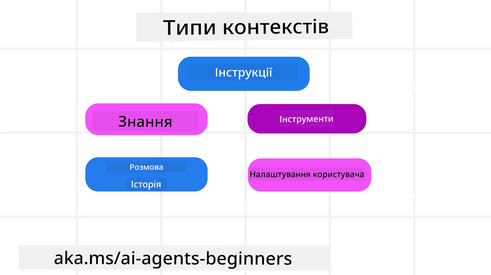
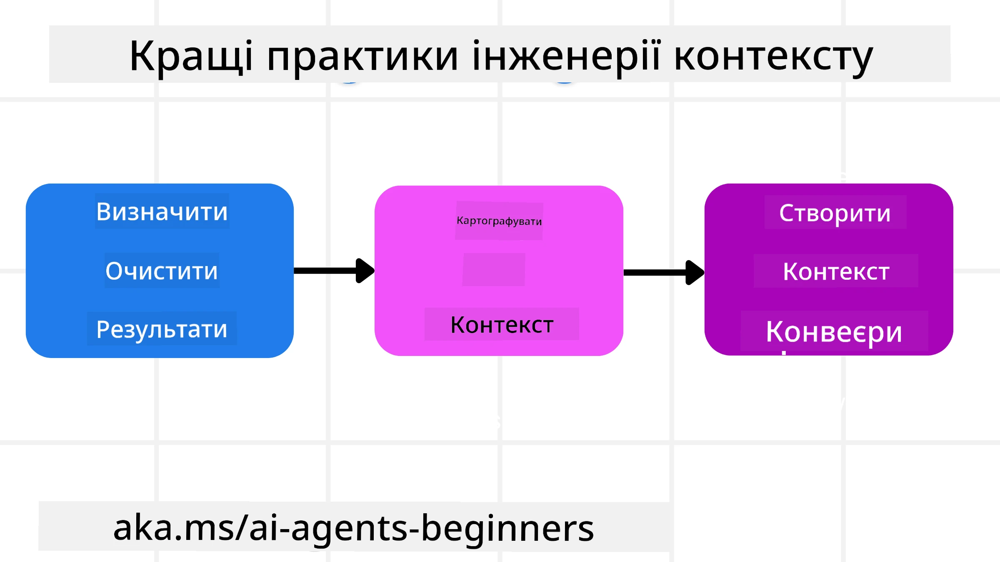

# Інженерія контексту для AI агентів

> _(Натисніть на зображення вище, щоб переглянути відео цього уроку)_

Розуміння складності застосунку, для якого ви створюєте AI агента, важливе для створення надійного агента. Нам потрібно створювати AI агентів, які ефективно керують інформацією, щоб відповідати на складні потреби, виходячи за межі інженерії підказок (prompt engineering).

У цьому уроці ми розглянемо, що таке інженерія контексту та її роль у створенні AI агентів.

## Вступ

Цей урок охопить:

• **Що таке інженерія контексту** та чому вона відрізняється від інженерії підказок.

• **Стратегії ефективної інженерії контексту**, включаючи те, як писати, вибирати, стискати та ізолювати інформацію.

• **Поширені помилки контексту**, які можуть зірвати роботу вашого AI агента, і як їх виправляти.

## Цілі навчання

Після закінчення цього уроку ви дізнаєтеся, як:

• **Визначити інженерію контексту** та відрізняти її від інженерії підказок.

• **Виявити ключові компоненти контексту** у застосунках з великими мовними моделями (LLM).

• **Застосовувати стратегії з написання, вибору, стискання та ізоляції контексту** для покращення роботи агента.

• **Розпізнавати поширені помилки контексту**, такі як отруєння, відволікання, плутанина та конфлікт, і впроваджувати методи їх пом’якшення.

## Що таке інженерія контексту?

Для AI агентів контекст – це те, що керує плануванням агента для здійснення певних дій. Інженерія контексту – це практика забезпечення AI агента потрібною інформацією для виконання наступного кроку завдання. Вікно контексту обмежене за розміром, тому як розробники агентів ми повинні створювати системи та процеси для керування додаванням, видаленням та стисканням інформації у вікні контексту.

### Інженерія підказок проти інженерії контексту

Інженерія підказок зосереджена на одному наборі статичних інструкцій для ефективного керування AI агентами за допомогою правил. Інженерія контексту – це керування динамічним набором інформації, включно з початковою підказкою, щоб забезпечити AI агента необхідним з часом. Головна ідея інженерії контексту – зробити цей процес повторюваним і надійним.

### Типи контексту

Важно пам’ятати, що контекст – це не просто щось одне. Інформація, що потрібна AI агенту, може надходити з різних джерел, і це наша задача забезпечити доступ агента до цих джерел:

Типи контексту, які може потребувати AI агент для керування, включають:

• **Інструкції:** Це як "правила" агента – підказки, системні повідомлення, кілька прикладів (які показують моделі, як щось робити) та описи інструментів, якими він може користуватися. Тут фокус інженерії підказок переплітається з інженерією контексту.

• **Знання:** Це факти, інформація, отримана з баз даних, або довготривалі спогади, які агент накопичив. Це включає інтеграцію системи Retrieval Augmented Generation (RAG), якщо агент потребує доступу до різних сховищ знань та баз даних.

• **Інструменти:** Це визначення зовнішніх функцій, API та MCP серверів, які агент може викликати, разом з відгуками (результатами) від їх використання.

• **Історія розмови:** Поточний діалог з користувачем. З часом ці розмови стають довшими і складнішими, що займає місце у вікні контексту.

• **Уподобання користувача:** Інформація про вподобання або не вподобання користувача, яку агент накопичує з часом. Її можна зберігати і використовувати при прийнятті важливих рішень для допомоги користувачу.

## Стратегії ефективної інженерії контексту

### Стратегії планування

Добра інженерія контексту починається з гарного планування. Ось підхід, який допоможе вам почати думати про застосування концепції інженерії контексту:

1. **Визначте чіткі результати** – результати завдань, які будуть призначені AI агентам, мають бути чітко визначені. Відповідайте на питання – "Як виглядатиме світ, коли AI агент виконає своє завдання?" Інакше кажучи, яку зміну, інформацію чи відповідь повинен отримати користувач після взаємодії з AI агентом.
2. **Зобразіть контекст** – коли ви визначили результати агента, потрібно відповісти на питання "Яка інформація потрібна AI агенту для виконання цього завдання?". Це дозволяє почати планувати контекст і де ця інформація може бути розташована.
3. **Створіть конвеєри контексту** – знаючи, де інформація знаходиться, потрібно відповісти "Як агент отримає цю інформацію?". Це можна робити різними способами, включно з RAG, можливостями MCP серверів та іншими інструментами.

### Практичні стратегії

Планування важливе, але коли інформація починає надходити у вікно контексту нашого агента, нам потрібні практичні стратегії для її керування:

#### Керування контекстом

Хоча частина інформації буде додаватися у вікно контексту автоматично, інженерія контексту полягає в тому, щоб брати більш активну роль у керуванні цією інформацією, що можна робити за допомогою кількох стратегій:

 1. **Блокнот агента (Agent Scratchpad)**
 Дозволяє AI агенту робити нотатки про релевантну інформацію про поточні завдання та взаємодії з користувачем під час однієї сесії. Це має існувати поза вікном контексту, у файлі або об'єкті, який агент може пізніше отримати під час цієї сесії, якщо потрібно.

 2. **Спогади (Memories)**
 Блокноти добре підходять для керування інформацією поза вікном контексту однієї сесії. Спогади дозволяють агентам зберігати і отримувати релевантну інформацію через кілька сесій. Це може включати підсумки, уподобання користувача та відгуки для майбутніх покращень.

 3. **Стискання контексту**
  Коли вікно контексту розростається і наближається до ліміту, можна застосовувати техніки такі як резюмування і обрізання. Це може бути або збереження лише найрелевантнішої інформації, або видалення старших повідомлень.
  
 4. **Багатоагентні системи (Multi-Agent Systems)**
  Розробка багатоагентних систем є формою інженерії контексту, тому що кожен агент має своє власне контекстне вікно. Як цей контекст ділиться і передається різним агентам — це ще один аспект для планування під час побудови таких систем.
  
 5. **Пісочниці (Sandbox Environments)**
  Якщо агенту потрібно запустити якийсь код або обробити великий обсяг інформації у документі, це може зайняти багато токенів для обробки результатів. Замість того, щоб зберігати це у вікні контексту, агент може використовувати пісочницю, яка виконує код і передає лише результати та іншу релевантну інформацію.
  
 6. **Об’єкти стану під час виконання (Runtime State Objects)**
   Це робиться шляхом створення контейнерів інформації для керування ситуаціями, коли агенту потрібен доступ до певних даних. Для складного завдання це дозволить агенту зберігати результати кожного підзавдання поетапно, дозволяючи контексту залишатися пов’язаним лише з конкретним підзавданням.

#### Перевірка контексту

Після застосування однієї з цих стратегій варто перевірити, що саме отримав наступний виклик моделі. Корисне запитання для налагодження:

> Чи агент завантажив занадто багато контексту, неправильний контекст або пропустив потрібний контекст?

Вам не потрібно логувати сирі підказки, виводи інструментів або вміст спогадів для відповіді на це питання. У продакшені краще використовувати невеликі записи перевірки контексту, які охоплюють підрахунки, ідентифікатори, хеші та мітки політик:

- **Вибір:** Відстежуйте, скільки кандидатів, інструментів або спогадів було розглянуто, скільки було вибрано і яке правило чи оцінка призвели до відфільтрування інших.
- **Стискання:** Записуйте діапазон джерела або ідентифікатор сліду, ідентифікатор підсумку, приблизну кількість токенів до і після стискання, а також чи було виключено сирий контент із наступного виклику.
- **Ізоляція:** Позначайте, яке підзавдання виконувалося в окремому агенті, сесії або пісочниці, який обмежений підсумок повернуто, і чи великий вивід інструменту залишився поза контекстом батьківського агента.
- **Спогади та RAG:** Зберігайте ідентифікатори документів для пошуку, ідентифікатори спогадів, оцінки, обрані ідентифікатори та статус редагування замість повного отриманого тексту.
- **Безпека та конфіденційність:** Віддавайте перевагу хешам, ідентифікаторам, токен-бакетам і міткам політики замість чутливого тексту підказок, аргументів інструментів, результатів інструментів або тіл спогадів користувача.

Мета не в тому, щоб зберігати більше контексту. Мета – залишити достатню кількість доказів, щоб розробник міг визначити, яка стратегія контексту була застосована і чи змінила вона наступний виклик моделі у бажаний спосіб.

### Приклад інженерії контексту

Припустимо, ми хочемо, щоб AI агент **"Забронював мені поїздку до Парижа."**

• Простий агент, який використовує лише інженерію підказок, може відповісти: **"Добре, на коли ви хочете поїхати до Парижа?"** Він обробив лише ваше пряме запитання у момент звернення користувача.

• Агент, який застосовує стратегії інженерії контексту, зробить значно більше. Перед відповіддю його система може:

  ◦ **Перевірити ваш календар** на наявність доступних дат (отримуючи дані в реальному часі).

 ◦ **Згадати минулі вподобання у подорожах** (з довготривалої пам’яті), наприклад, улюблену авіакомпанію, бюджет або перевагу прямих рейсів.

 ◦ **Визначити доступні інструменти** для бронювання авіаквитків і готелів.

- Далі приклад відповіді може бути таким: "Привіт [Ваше ім'я]! Бачу, у вас є вільний час на першому тижні жовтня. Шукати прямі рейси до Парижа на [Улюблена авіакомпанія] у рамки вашого звичайного бюджету [Бюджет]?" Ця багатша, контекстно усвідомлена відповідь демонструє силу інженерії контексту.

## Поширені помилки контексту

### Отруєння контексту

**Що це:** Коли в контекст потрапляє галюцинація (помилкова інформація, згенерована LLM) або помилка, яка повторно посилається, заставляючи агента прагнути неможливих цілей або розробляти безглуздні стратегії.

**Що робити:** Впроваджуйте **валідaцію контексту** та **карантин**. Перевіряйте інформацію перед додаванням до довготривалої пам’яті. Якщо виявлено потенційне отруєння, починайте нові контекстні потоки, щоб запобігти поширенню поганої інформації.

**Приклад бронювання подорожі:** Ваш агент вигадує **прямий рейс з маленького локального аеропорту до далекого міжнародного міста**, який насправді не здійснює міжнародних рейсів. Ця неіснуюча деталь рейсу зберігається в контексті. Пізніше, коли ви просите агента забронювати, він постійно намагається знайти квитки на цей неможливий маршрут, що призводить до повторних помилок.

**Рішення:** Впровадьте крок, який **перевіряє існування рейсу і маршрути через API в реальному часі** _перед_ додаванням деталей рейсу до контексту агента. Якщо перевірка не пройшла, помилкова інформація "ізолюється" і не використовується далі.

### Відволікання контекстом

**Що це:** Коли контекст стає настільки великим, що модель надто фокусується на накопиченій історії замість використання навченої інформації, що призводить до повторюваних або непотрібних дій. Моделі можуть почати помилятися навіть до заповнення вікна контексту.

**Що робити:** Використовуйте **резюмування контексту**. Періодично стискайте накопичену інформацію у коротші підсумки, зберігаючи важливі деталі і видаляючи надлишкову історію. Це допомагає "перезапустити" фокус уваги.

**Приклад бронювання подорожі:** Ви тривалий час обговорювали різні улюблені напрямки подорожей, включаючи детальний опис вашого туристичного походу два роки тому. Коли ви нарешті просите **"знайди мені дешевий рейс на наступний місяць"**, агент плутається у старих, неактуальних деталях і постійно питає про ваше туристичне спорядження чи минулі маршрути, ігноруючи ваш поточний запит.

**Рішення:** Після певної кількості кроків або коли контекст стає занадто великим, агент повинен **підсумувати найбільш недавні та релевантні частини розмови** – зосередившись на ваших поточних датах подорожі і напрямку – і використовувати цей конденсований підсумок для наступного виклику LLM, відкидаючи менш релевантний історичний чат.

### Плутанина контексту

**Що це:** Коли зайвий контекст, часто у вигляді надмірної кількості доступних інструментів, змушує модель генерувати погані відповіді або викликати нерелевантні інструменти. Особливо це стосується менших моделей.

**Що робити:** Впровадьте **керування набором інструментів** за допомогою технік RAG. Зберігайте описи інструментів у векторній базі даних і вибирайте _тільки_ найбільш релевантні інструменти для конкретного завдання. Дослідження показують, що краще обмежити вибір інструментів менш ніж 30.

**Приклад бронювання подорожі:** Ваш агент має доступ до десятків інструментів: `book_flight`, `book_hotel`, `rent_car`, `find_tours`, `currency_converter`, `weather_forecast`, `restaurant_reservations` і т.д. Ви запитуєте: **"Який найкращий спосіб пересування по Парижу?"** Через велику кількість інструментів агент плутається і намагається викликати `book_flight` _в межах_ Парижа або `rent_car`, хоча ви віддаєте перевагу громадському транспорту, бо описи інструментів можуть перекриватися або модель не здатна визначити найкращий.

**Рішення:** Використовуйте **RAG за описами інструментів**. Коли ви питаєте про пересування по Парижу, система динамічно витягує _тільки_ найбільш релевантні інструменти, такі як `rent_car` або `public_transport_info`, на основі вашого запиту, представляючи сфокусований "набір" інструментів для LLM.

### Конфлікт контексту

**Що це:** Коли у контексті існує суперечлива інформація, що призводить до непослідовного мислення чи поганих кінцевих відповідей. Це часто трапляється, коли інформація надходить поетапно, а ранні, неправильні припущення залишаються у контексті.

**Що робити:** Використовуйте **обрізання контексту** та **вивантаження**. Обрізання означає видалення застарілої чи суперечливої інформації з мережею нових деталей. Вивантаження дає моделі окреме "робоче місце" (scratchpad) для обробки інформації без засмічення основного контексту.

**Приклад бронювання подорожі:** Спочатку ви говорите своєму агенту: **"Я хочу летіти економ класом."** Пізніше у розмові ви передумуєте і кажете: **"Насправді, для цієї поїздки давайте виберемо бізнес-клас."** Якщо обидві інструкції залишаться в контексті, агент може отримати суперечливі результати пошуку або заплутатися, яку перевагу слід віддати.

**Рішення:** Реалізуйте **обрізання контексту**. Коли нова інструкція суперечить старій, стара інструкція видаляється або явно замінюється у контексті. Альтернативно, агент може використовувати **чернетку** для узгодження конфліктних переваг перед прийняттям рішення, забезпечуючи, що лише остаточна, узгоджена інструкція керує його діями.

## Маєте ще питання про інженерію контексту?

Приєднуйтесь до [Microsoft Foundry Discord](https://discord.com/invite/ATgtXmAS5D), щоб зустрітися з іншими учнями, відвідати години консультацій і отримати відповіді на ваші запитання про AI агенти.

---

<!-- CO-OP TRANSLATOR DISCLAIMER START -->
**Відмова від відповідальності**:
Цей документ було перекладено за допомогою сервісу штучного інтелекту для перекладу [Co-op Translator](https://github.com/Azure/co-op-translator). Хоча ми прагнемо до точності, будь ласка, майте на увазі, що автоматичні переклади можуть містити помилки або неточності. Оригінальний документ рідною мовою слід вважати авторитетним джерелом. Для критично важливої інформації рекомендується професійний людський переклад. Ми не несемо відповідальності за будь-які непорозуміння або неправильні тлумачення, що виникли внаслідок використання цього перекладу.
<!-- CO-OP TRANSLATOR DISCLAIMER END -->