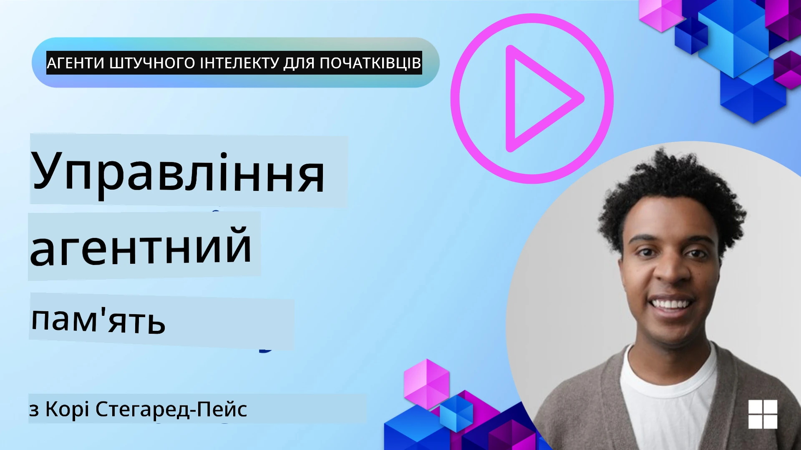

# Пам’ять для AI-агентів  

При обговоренні унікальних переваг створення AI-агентів найчастіше говорять про дві речі: здатність викликати інструменти для виконання завдань і здатність покращуватися з часом. Пам’ять лежить в основі створення агентів, що самовдосконалюються, і можуть створювати кращі враження для наших користувачів.

У цьому уроці ми розглянемо, що таке пам’ять для AI-агентів і як ми можемо керувати нею та використовувати її на користь наших додатків.

## Вступ

Цей урок охоплює:

• **Розуміння пам’яті AI-агентів**: що таке пам’ять і чому вона важлива для агентів.

• **Реалізація та зберігання пам’яті**: практичні методи додавання пам’яті до ваших AI-агентів із фокусом на короткострокову та довгострокову пам’ять.

• **Створення агентів, що самовдосконалюються**: як пам’ять дає змогу агентам вчитися на минулих взаємодіях і покращуватися з часом.

## Доступні реалізації

Цей урок містить два вичерпні навчальні блокноти:

• **[13-agent-memory.ipynb](./13-agent-memory.ipynb)**: реалізує пам’ять за допомогою Mem0 та Azure AI Search з Microsoft Agent Framework

• **[13-agent-memory-cognee.ipynb](./13-agent-memory-cognee.ipynb)**: реалізує структуровану пам’ять за допомогою Cognee, автоматично створюючи граф знань на основі вбудувань, візуалізуючи граф і забезпечуючи інтелектуальний пошук

## Цілі навчання

Після проходження уроку ви знатимете, як:

• **Розрізняти різні типи пам’яті AI-агентів**, включно з робочою, короткостроковою та довгостроковою пам’яттю, а також спеціалізованими формами, такими як персональна та епізодична пам’ять.

• **Реалізовувати та керувати короткостроковою і довгостроковою пам’яттю для AI-агентів** за допомогою Microsoft Agent Framework, використовуючи інструменти як Mem0, Cognee, пам’ять Whiteboard та інтеграцію з Azure AI Search.

• **Розуміти принципи самовдосконалення AI-агентів** і як надійні системи управління пам’яттю сприяють безперервному навчанню та адаптації.

## Розуміння пам’яті AI-агентів

В основі, **пам’ять AI-агентів означає механізми, що дозволяють їм зберігати і згадувати інформацію**. Ця інформація може містити конкретні деталі розмови, переваги користувача, минулі дії або навіть вивчені закономірності.

Без пам’яті AI-застосунки зазвичай є безстатусними, що означає, що кожна взаємодія починається з нуля. Це призводить до повторюваного і розчаровуючого досвіду користувача, коли агент "забуває" попередній контекст або переваги.

### Чому пам’ять важлива?

Інтелект агента тісно пов’язаний із його здатністю згадувати і використовувати минулу інформацію. Пам’ять дозволяє агентам бути:

• **Рефлексивними**: вчитися на минулих діях та результатах.

• **Інтерактивними**: підтримувати контекст протягом поточної розмови.

• **Активними та реактивними**: передбачати потреби або відповідати належним чином на основі історичних даних.

• **Автономними**: працювати більш незалежно, спираючись на збережені знання.

Мета впровадження пам’яті — зробити агентів більш **надійними та здібними**.

### Типи пам’яті

#### Робоча пам’ять

Уявіть це як листок паперу, яким агент користується під час виконання одного завдання чи процесу мислення. Вона зберігає негайну інформацію, необхідну для виконання наступного кроку.

Для AI-агентів робоча пам’ять часто відображає найрелевантнішу інформацію з розмови, навіть якщо повна історія чату довга або скорочена. Вона зосереджується на виділенні ключових елементів, таких як вимоги, пропозиції, рішення і дії.

**Приклад робочої пам’яті**

У агенті для бронювання подорожей робоча пам’ять може зберігати поточний запит користувача, наприклад «Я хочу забронювати поїздку до Парижа». Ця конкретна вимога утримується в безпосередньому контексті агента для керівництва поточною взаємодією.

#### Короткострокова пам’ять

Цей тип пам’яті зберігає інформацію протягом однієї розмови або сесії. Це контекст поточного чату, що дозволяє агенту посилатися на попередні ходи в діалозі.

**Приклад короткострокової пам’яті**

Якщо користувач питає «Скільки коштує авіаквиток до Парижа?» і потім уточнює «А як щодо проживання там?», короткострокова пам’ять дозволяє агенту знати, що «там» у цій же розмові означає «Париж».

#### Довгострокова пам’ять

Це інформація, що зберігається через кілька розмов або сесій. Вона дозволяє агентам запам’ятовувати переваги користувача, історичні взаємодії або загальні знання на тривалий час. Це важливо для персоналізації.

**Приклад довгострокової пам’яті**

Довгострокова пам’ять може зберігати, що «Бен любить кататися на лижах і займатися активним відпочинком, любить каву з видом на гори і хоче уникати складних гірськолижних трас через минулу травму». Ця інформація, здобута з попередніх взаємодій, впливає на рекомендації у майбутніх сесіях планування подорожей, роблячи їх дуже персоналізованими.

#### Пам’ять персони

Цей спеціалізований тип пам’яті допомагає агенту розвивати послідовну "персону" або "характер". Вона дозволяє агенту запам’ятовувати деталі про себе або свою роль, роблячи взаємодії більш плавними й цілеспрямованими.

**Приклад пам’яті персони**

Якщо туристичний агент розроблений як "експерт з планування лижних поїздок", пам’ять персони може підсилювати цю роль, впливаючи на відповіді відповідно до тону і знань експерта.

#### Пам’ять робочого процесу / епізодична пам’ять

Ця пам’ять зберігає послідовність кроків, які агент виконує під час складного завдання, включаючи успіхи та невдачі. Це схоже на запам’ятовування конкретних "епізодів" або минулого досвіду для навчання.

**Приклад епізодичної пам’яті**

Якщо агент намагався забронювати конкретний рейс, але це не вдалося через відсутність місць, епізодична пам’ять може зафіксувати цю невдачу, даючи змогу агенту спробувати альтернативні варіанти або інформувати користувача про проблему більш обґрунтовано під час наступної спроби.

#### Пам’ять сутностей

Ця пам’ять включає виділення і збереження конкретних сутностей (наприклад, людей, місць чи предметів) та подій із розмов. Вона дозволяє агенту будувати структуроване розуміння ключових обговорюваних елементів.

**Приклад пам’яті сутностей**

З розмови про минулу поїздку агент може виділити "Париж", "Ейфелеву вежу" і "вечерю у ресторані Le Chat Noir" як сутності. В майбутній взаємодії агент може згадати "Le Chat Noir" і запропонувати зробити нове резервування там.

#### Структурований RAG (Retrieval Augmented Generation)

Хоча RAG є ширшою технікою, “Структурований RAG” виділяється як потужна технологія пам’яті. Він витягує густу, структуровану інформацію з різних джерел (розмов, електронної пошти, зображень) і використовує її для підвищення точності, повноти та швидкості відповідей. На відміну від класичного RAG, що базується виключно на семантичній подібності, Структурований RAG працює із внутрішньою структурою інформації.

**Приклад структурованого RAG**

Замість простого збігу ключових слів, Структурований RAG може розпарсити деталі рейсу (пункт призначення, дата, час, авіакомпанія) з електронного листа і зберегти їх у структурованому вигляді. Це дозволяє виконувати точні запити, як-от "Який рейс я забронював до Парижа у вівторок?"

## Реалізація та зберігання пам’яті

Реалізація пам’яті для AI-агентів передбачає системний процес **управління пам’яттю**, який включає генерування, зберігання, пошук, інтеграцію, оновлення та навіть "забування" (або видалення) інформації. Пошук має особливе значення.

### Спеціалізовані інструменти пам’яті

#### Mem0

Один зі способів зберігання і керування пам’яттю агента — це використання спеціалізованих інструментів, таких як Mem0. Mem0 працює як шар постійної пам’яті, що дозволяє агентам згадувати релевантні взаємодії, зберігати переваги користувачів і фактологічний контекст, а також вчитися на успіхах і невдачах з часом. Ідея полягає в тому, що безстатусні агенти стають станованими.

Він працює через **двофазний конвеєр пам’яті: вилучення та оновлення**. Спершу повідомлення, додані до нитки агента, надсилаються на сервіс Mem0, який використовує Велику Мовну Модель (LLM) для резюмування історії розмови та вилучення нових спогадів. Далі фаза оновлення на базі LLM визначає, чи додавати, змінювати чи видаляти ці спогади, зберігаючи їх у гібридному сховищі даних, яке може включати векторні, графові та ключ-значення бази. Ця система також підтримує різні типи пам’яті і може включати графову пам’ять для управління зв’язками між сутностями.

#### Cognee

Інший потужний підхід — використання **Cognee**, відкритої семантичної пам’яті для AI-агентів, що трансформує структуровані і неструктуровані дані у запитувані графи знань, підтримувані вбудуваннями. Cognee пропонує **архітектуру з подвійним сховищем**, що поєднує векторний пошук за подібністю із графовими зв’язками, даючи змогу агентам розуміти не лише те, що інформація подібна, а і як концепції пов’язані між собою.

Він відзначається **гібридним пошуком**, що поєднує векторну подібність, структуру графа і логічне мислення LLM — від пошуку по фрагментах до відповідей з урахуванням структури графа. Система підтримує **живу пам’ять**, яка розвивається і зростає, залишаючись запитуваною як єдиний пов’язаний граф, підтримуючи і контекст сесії короткострокової, і довгострокову персистентну пам’ять.

Навчальний блокнот Cognee ([13-agent-memory-cognee.ipynb](./13-agent-memory-cognee.ipynb)) демонструє створення цього уніфікованого шару пам’яті з практичними прикладами приймання різних джерел даних, візуалізації графа знань та запитів із різними стратегіями пошуку, адаптованими до конкретних потреб агентів.

### Зберігання пам’яті за допомогою RAG

Окрім спеціалізованих інструментів пам’яті, таких як Mem0, ви можете використовувати потужні служби пошуку, як-от **Azure AI Search, як бекенд для зберігання і пошуку спогадів**, особливо для структурованого RAG.

Це дозволяє базувати відповіді агента на ваших власних даних, забезпечуючи більш релевантні й точні відповіді. Azure AI Search можна використовувати для зберігання персональних спогадів про подорожі, каталогів товарів чи будь-яких інших специфічних доменних знань.

Azure AI Search підтримує функції як **Структурований RAG**, що відзначається вмінням витягувати і знаходити густу, структуровану інформацію з великих наборів даних, як історії розмов, електронні листи чи навіть зображення. Це забезпечує "надлюдську" точність і повноту порівняно з традиційними підходами до розбиття тексту на фрагменти і вбудовувань.

## Створення AI-агентів, що самовдосконалюються

Поширений шаблон для агентів, що самовдосконалюються, включає введення **“агента знань”**. Цей окремий агент спостерігає головну розмову між користувачем і основним агентом. Його роль полягає у:

1. **Визначенні цінної інформації**: визначити, чи вартує якась частина розмови збереження як загальних знань або конкретних користувацьких уподобань.

2. **Вилученні та узагальненні**: вилучати суттєве знання або перевагу з розмови.

3. **Збереженні у базі знань**: постійно зберігати цю інформацію, часто у векторній базі даних, щоб її можна було пізніше знайти.

4. **Підсиленні майбутніх запитів**: коли користувач починає новий запит, агент знань знаходить релевантну збережену інформацію і додає її до запиту користувача, надаючи первинному агенту критично важливий контекст (подібно до RAG).

### Оптимізації для пам’яті

• **Управління затримками**: щоб уникнути уповільнення взаємодії з користувачем, спочатку можна використовувати дешевшу та швидшу модель для швидкої оцінки, чи варто зберігати чи шукати інформацію, залучаючи більш складний процес вилучення/пошуку лише за потреби.

• **Підтримка бази знань**: для зростаючої бази знань менш часто використовувану інформацію можна переміщувати у «холодне» сховище для оптимізації витрат.

## Є ще питання про пам’ять агентів?

Приєднуйтесь до [Microsoft Foundry Discord](https://aka.ms/ai-agents/discord), щоб зустрітися з іншими учнями, відвідати години консультацій і отримати відповіді на свої запитання щодо AI-агентів.

---

<!-- CO-OP TRANSLATOR DISCLAIMER START -->
**Відмова від відповідальності**:
Цей документ був перекладений за допомогою сервісу автоматичного перекладу [Co-op Translator](https://github.com/Azure/co-op-translator). Хоч ми і прагнемо до точності, зверніть увагу, що автоматичні переклади можуть містити помилки або неточності. Оригінальний документ рідною мовою слід вважати авторитетним джерелом. Для критично важливої інформації рекомендується звертатися до професійного людського перекладу. Ми не несемо відповідальності за будь-які непорозуміння чи неправильне тлумачення, що виникли внаслідок використання цього перекладу.
<!-- CO-OP TRANSLATOR DISCLAIMER END -->