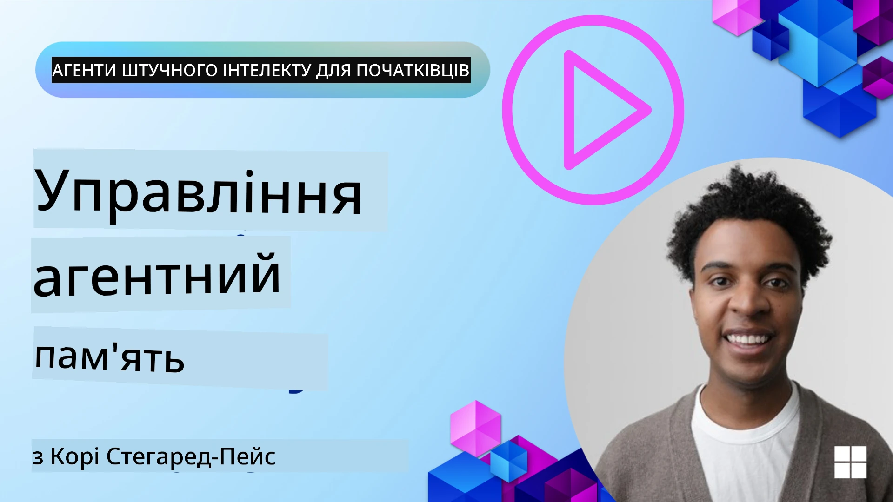

# Пам’ять для AI агентів 

Коли говорять про унікальні переваги створення AI агентів, здебільшого обговорюють дві речі: здатність викликати інструменти для виконання завдань і здатність покращуватися з часом. Пам’ять лежить в основі створення агента, що самовдосконалюється і може створювати кращі враження для наших користувачів.

У цьому уроці ми розглянемо, що таке пам’ять для AI агентів і як ми можемо її керувати та використовувати на користь наших додатків.

## Вступ

Цей урок охоплює:

• **Розуміння пам’яті AI агентів**: що таке пам’ять і чому вона важлива для агентів.

• **Реалізація та зберігання пам’яті**: практичні методи додання пам’яті AI агентам із фокусом на короткострокову та довгострокову пам’ять.

• **Зробити AI агентів самовдосконалюваними**: як пам’ять дозволяє агентам вчитися на минулих взаємодіях і покращуватися з часом.

## Доступні реалізації

У цьому уроці представлені два комплексні ноутбуки з підручниками:

• **[13-agent-memory.ipynb](./13-agent-memory.ipynb)**: реалізує пам’ять за допомогою Mem0 та Azure AI Search у Microsoft Agent Framework

• **[13-agent-memory-cognee.ipynb](./13-agent-memory-cognee.ipynb)**: реалізує структуровану пам’ять через Cognee, автоматично створюючи граф знань на базі ембеддінгів, візуалізуючи граф і забезпечуючи інтелектуальні пошуки

## Цілі навчання

Після завершення уроку ви знатимете, як:

• **Розрізняти різні типи пам’яті AI агента**, зокрема робочу, короткострокову та довгострокову пам’ять, а також спеціалізовані типи, як-от персона і епізодична пам’ять.

• **Реалізувати та керувати короткостроковою та довгостроковою пам’яттю для AI агентів**, використовуючи Microsoft Agent Framework, з інструментами як Mem0, Cognee, Whiteboard memory, і інтеграцією з Azure AI Search.

• **Розуміти принципи роботи самовдосконалюваних AI агентів** і як надійні системи керування пам’яттю сприяють безперервному навчанню та адаптації.

## Розуміння пам’яті AI агента

В основі пам’ять для AI агентів — це механізми, які дозволяють їм зберігати і згадувати інформацію. Ця інформація може містити конкретні деталі розмови, переваги користувача, минулі дії чи навіть вивчені шаблони.

Без пам’яті AI-додатки часто є безстанними, тобто кожна взаємодія починається з нуля. Це призводить до повторюваного і розчаровуючого користувацького досвіду, коли агент "забуває" попередній контекст або вподобання.

### Чому пам’ять важлива?

Інтелект агента глибоко пов’язаний зі здатністю згадувати і використовувати минулу інформацію. Пам’ять дозволяє агентам бути:

• **Рефлексивними**: вчитись на минулих діях і результатах.

• **Інтерактивними**: підтримувати контекст під час поточної розмови.

• **Активними та реактивними**: передбачати потреби або відповідати відповідно до історичних даних.

• **Автономними**: діяти більш незалежно, опираючись на збережені знання.

Мета впровадження пам’яті — зробити агентів більш **надійними та спроможними**.

### Типи пам’яті

#### Робоча пам’ять

Уявіть це як аркуш паперу для нотаток, який агент використовує під час однієї поточної задачі чи процесу мислення. Він зберігає негайну інформацію, необхідну для обчислення наступного кроку.

Для AI агентів робоча пам’ять часто захоплює найбільш релевантну інформацію з розмови, навіть якщо історія чату велика або обрізана. Вона зосереджена на витягненні ключових елементів, як-от вимоги, пропозиції, рішення та дії.

**Приклад робочої пам’яті**

У агенті бронювання подорожей робоча пам’ять може містити поточний запит користувача, наприклад «Я хочу забронювати поїздку до Парижа». Ця конкретна вимога зберігається в негайному контексті агента для спрямування поточної взаємодії.

#### Короткострокова пам’ять

Цей тип пам’яті зберігає інформацію протягом однієї розмови чи сесії. Це контекст поточного чату, що дозволяє агенту посилатися на попередні обміни в діалозі.

У прикладах Python SDK [Microsoft Agent Framework](https://github.com/microsoft/agent-framework) це відповідає `AgentSession`, створеному через `agent.create_session()`. Сесія — це вбудована короткострокова пам’ять фреймворку: вона зберігає контекст розмови, поки сесія використовується, але цей контекст не зберігається після завершення сесії або перезапуску додатку. Для фактів і переваг, які повинні зберігатися між сесіями, використовується довгострокова пам’ять, зазвичай через базу даних, векторний індекс чи інший персистентний сховок.

**Приклад короткострокової пам’яті**

Якщо користувач питає: "Скільки коштує політ до Парижа?" і потім додає: "А як щодо проживання там?", короткострокова пам’ять дозволяє агенту розуміти, що "там" означає "Париж" у межах цієї ж розмови.

#### Довгострокова пам’ять

Це інформація, що зберігається протягом кількох розмов або сесій. Вона дозволяє агентам пам’ятати вподобання користувача, історію взаємодій або загальні знання протягом тривалого часу. Це важливо для персоналізації.

**Приклад довгострокової пам’яті**

Довгострокова пам’ять може зберігати те, що "Бен любить лижі та активний відпочинок, любить каву з видом на гори і хоче уникати складних трас через минулу травму". Ця інформація, отримана з попередніх взаємодій, впливає на рекомендації у майбутніх сесіях планування подорожей, роблячи їх високоперсоналізованими.

#### Пам’ять персонажа

Цей спеціалізований тип пам’яті допомагає агенту розвивати послідовну "персональність" або "персонаж". Вона дозволяє агенту пам’ятати деталі про себе або свою призначену роль, роблячи взаємодію більш плавною і сфокусованою.

**Приклад пам’яті персонажа**
Якщо агент подорожей створений як "експерт з планування лижного відпочинку", пам’ять персонажа може посилити цю роль, впливаючи на відповіді в стилі експерта з відповідними знаннями.

#### Робочий/епізодичний пам’ять

Ця пам’ять зберігає послідовність кроків, які агент робить під час складного завдання, включаючи успіхи й невдачі. Це як пам’ять про специфічні "епізоди" або минулі досвіди, з яких можна навчатися.

**Приклад епізодичної пам’яті**

Якщо агент намагався забронювати конкретний рейс, але це не вдалося через відсутність доступності, епізодична пам’ять могла би зафіксувати цей невдалий випадок, дозволяючи агенту спробувати альтернативні рейси або інформувати користувача про проблему краще під час наступної спроби.

#### Пам’ять сутностей

Вона включає виділення та запам’ятовування конкретних сутностей (як-от люди, місця чи предмети) та подій із розмов. Це дозволяє агенту будувати структуроване розуміння ключових елементів обговорення.

**Приклад пам’яті сутностей**

Під час розмови про минулу подорож агент може виділити сутності «Париж», «Ейфелева вежа» і «вечеря у ресторані Le Chat Noir». У майбутній взаємодії агент міг би згадати "Le Chat Noir" і запропонувати забронювати там новий столик.

#### Структурований RAG (Retrieval Augmented Generation)

Хоча RAG — це широка методика, "Структурований RAG" виділяється як потужна технологія пам’яті. Вона витягує насичену структуровану інформацію з різних джерел (розмов, електронної пошти, зображень) і використовує її для підвищення точності, повноти та швидкості відповідей. На відміну від класичного RAG, що покладається лише на семантичну схожість, Структурований RAG працює з вродженою структурою інформації.

**Приклад структурованого RAG**

Замість простого пошуку ключових слів, Структурований RAG міг би розпарсити деталі рейсу (пункт призначення, дата, час, авіакомпанія) з електронного листа і зберегти їх у структурованому вигляді. Це дозволяє робити точні запити, наприклад, "Який рейс я забронював до Парижа у вівторок?"

## Реалізація та зберігання пам’яті

Реалізація пам’яті для AI агентів включає системний процес **керування пам’яттю**, який охоплює генерацію, зберігання, пошук, інтеграцію, оновлення і навіть "забуття" (або видалення) інформації. Пошук є особливо важливим аспектом.

### Спеціалізовані інструменти пам’яті

#### Mem0

Один із способів зберігання і керування пам’яттю агента — це використання спеціалізованих інструментів, таких як Mem0. Mem0 працює як шар персистентної пам’яті, дозволяючи агентам згадувати релевантні взаємодії, зберігати вподобання користувача та фактичний контекст, а також навчатися на успіхах та невдачах з часом. Ідея в тому, що безстанні агенти стають станними.

Вона працює через **двофазний конвеєр пам’яті: вилучення та оновлення**. Спочатку повідомлення, додані до нитки агента, надсилаються до сервісу Mem0, який за допомогою великої мовної моделі (LLM) узагальнює історію розмови і вилучає нові спогади. Потім фаза оновлення, керована LLM, визначає, чи додавати, змінювати або видаляти ці спогади, зберігаючи їх у гібридному сховищі даних, яке може включати векторні, графові та ключ-значення бази даних. Ця система також підтримує різні типи пам’яті і може включати графову пам’ять для керування зв’язками між сутностями.

#### Cognee

Інший потужний підхід — це використання **Cognee**, відкритої семантичної пам’яті для AI агентів, яка перетворює структуровані та неструктуровані дані в поширювані графи знань, підтримані ембеддінгами. Cognee пропонує **подвійну архітектуру зберігання**, яка поєднує пошук за векторною схожістю та графові зв’язки, дозволяючи агентам розуміти не лише які дані схожі, а й як концепції пов’язані між собою.

Воно відзначається **гібридним пошуком**, який поєднує векторну схожість, структуру графу та логіку LLM — від пошуку по сирих фрагментах до питань з урахуванням графу. Система підтримує **живу пам’ять**, яка розвивається й зростає, залишаючись при цьому доступною як єдиний зв’язний граф, підтримуючи як короткостроковий контекст сесії, так і довгострокову персистентну пам’ять.

Навчальний ноутбук Cognee ([13-agent-memory-cognee.ipynb](./13-agent-memory-cognee.ipynb)) демонструє створення цього уніфікованого шару пам’яті, з практичними прикладами введення різних джерел даних, візуалізації графа знань та запитів з різними стратегіями пошуку, пристосованими до потреб агента.

### Зберігання пам’яті з RAG

Окрім спеціалізованих інструментів пам’яті як Mem0, ви можете використати надійні пошукові сервіси, як-от **Azure AI Search як бекенд для зберігання та пошуку спогадів**, особливо для структурованого RAG.

Це дозволяє "підкріпити" відповіді агента вашими власними даними, забезпечуючи більш релевантні та точні відповіді. Azure AI Search можна використовувати для зберігання користувацьких спогадів про подорожі, каталогів продуктів або будь-яких інших галузевих знань.

Azure AI Search підтримує можливості як **Структурований RAG**, який відмінно справляється з вилученням і пошуком насиченої структурованої інформації з великих наборів даних, як-от історії розмов, електронні листи чи навіть зображення. Це забезпечує "надлюдську точність і повноту" у порівнянні з традиційними підходами сегментації тексту та ембеддінгів.

## Зроблення AI агентів самовдосконалюваними

Поширений підхід для самовдосконалюваних агентів полягає у введенні **«агента знань»**. Цей окремий агент спостерігає за основною розмовою між користувачем і головним агентом. Його роль:

1. **Визначати цінну інформацію**: вирішувати, чи варто зберігати частину розмови як загальні знання або конкретні вподобання користувача.

2. **Вилучати та узагальнювати**: виділяти суттєве навчання або вподобання з розмови.

3. **Зберігати у базі знань**: персистентно зберігати вилучену інформацію, часто у векторній базі даних, щоб її можна було пізніше витягти.

4. **Розширювати майбутні запити**: коли користувач ініціює новий запит, агент знань шукає відповідну збережену інформацію і додає її до підказки користувача, забезпечуючи важливий контекст головному агенту (подібно до RAG).

### Оптимізації для пам’яті

• **Керування затримками**: щоб уникнути уповільнення взаємодії користувача, спершу може використовуватися більш дешевша й швидка модель для швидкої перевірки, чи варто зберігати або шукати інформацію, з викликом складнішого процесу вилучення/пошуку лише за потреби.

• **Обслуговування бази знань**: для зростаючої бази знань менш використовувану інформацію можна переміщувати у "холодне сховище", щоб оптимізувати витрати.

## Є більше запитань про пам’ять агента?

Приєднуйтесь до [Microsoft Foundry Discord](https://discord.com/invite/ATgtXmAS5D), щоб зустрітися з іншими учнями, відвідати годину запитань та отримати відповіді на ваші питання про AI агентів.

---

<!-- CO-OP TRANSLATOR DISCLAIMER START -->
**Відмова від відповідальності**:
Цей документ було перекладено за допомогою сервісу штучного інтелекту для перекладу [Co-op Translator](https://github.com/Azure/co-op-translator). Хоча ми прагнемо до точності, будь ласка, майте на увазі, що автоматичні переклади можуть містити помилки або неточності. Оригінальний документ рідною мовою слід вважати авторитетним джерелом. Для критично важливої інформації рекомендується професійний людський переклад. Ми не несемо відповідальності за будь-які непорозуміння або неправильні тлумачення, що виникли внаслідок використання цього перекладу.
<!-- CO-OP TRANSLATOR DISCLAIMER END -->