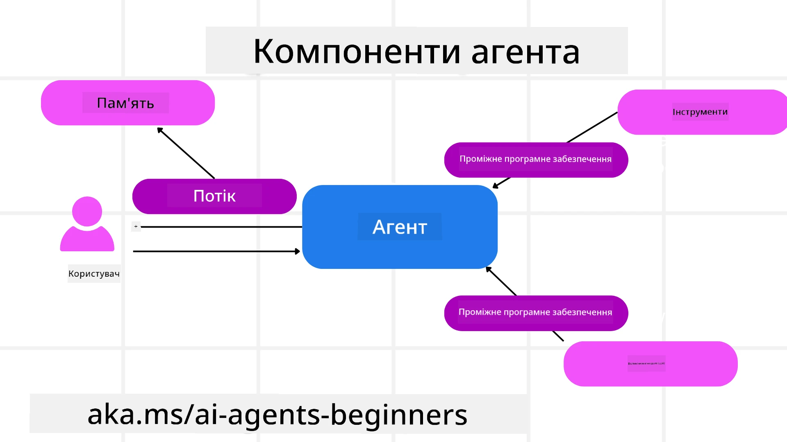

# Ознайомлення з Microsoft Agent Framework


### Вступ

У цьому уроці розглянемо:

- Розуміння Microsoft Agent Framework: ключові можливості та цінність  
- Ознайомлення з ключовими поняттями Microsoft Agent Framework
- Просунуті шаблони MAF: робочі потоки, проміжне ПЗ та пам'ять

## Цілі навчання

Після завершення цього уроку ви знатимете, як:

- Створювати готових до продакшну AI-агентів за допомогою Microsoft Agent Framework
- Застосовувати основні функції Microsoft Agent Framework до сценаріїв використання агентів
- Використовувати просунуті шаблони, включно з робочими потоками, проміжним ПЗ та засобами спостережуваності

## Приклади коду 

Приклади коду для [Microsoft Agent Framework (MAF)](https://aka.ms/ai-agents-beginners/agent-framewrok) доступні в цьому репозиторії у файлах `xx-python-agent-framework` та `xx-dotnet-agent-framework`.

## Розуміння Microsoft Agent Framework


[Microsoft Agent Framework (MAF)](https://aka.ms/ai-agents-beginners/agent-framewrok) є уніфікованим фреймворком Microsoft для створення AI-агентів. Він пропонує гнучкість для вирішення різноманітних агентних сценаріїв, що зустрічаються як у продакшн, так і в дослідницькому середовищі, зокрема:

- **Послідовна оркестрація агентів** у сценаріях, де потрібні покрокові робочі потоки.
- **Паралельна оркестрація** у сценаріях, де агенти повинні виконувати завдання одночасно.
- **Оркестрація групового чату** у сценаріях, де агенти можуть спільно працювати над одним завданням.
- **Оркестрація передачі** у сценаріях, де агенти передають завдання один одному у міру виконання підзавдань.
- **Magnetic Orchestration** у сценаріях, де агент-менеджер створює і змінює список завдань і координує підагенти для виконання завдання.

Для впровадження AI-агентів у продакшн MAF також включає можливості для:

- **Спостережуваність** через OpenTelemetry, де відстежуються кожна дія AI-агента, включаючи виклики інструментів, кроки оркестрації, потоки міркувань та моніторинг продуктивності через панелі Microsoft Foundry.
- **Безпека** через розгортання агентів нативно на Microsoft Foundry, що включає контролі доступу на основі ролей, обробку приватних даних та вбудовані засоби безпеки контенту.
- **Стійкість** — потоки та робочі процеси агентів можуть призупинятися, відновлюватися та відновлювати виконання після помилок, що дозволяє виконувати довші процеси.
- **Контроль** — підтримка робочих процесів із людиною в циклі, де завдання позначаються як ті, що потребують затвердження людиною.

Microsoft Agent Framework також орієнтований на інтероперабельність, зокрема:

- **Нейтральність до хмари** - агенти можуть працювати в контейнерах, локально (on-prem) та в різних хмарних середовищах.
- **Незалежність від постачальника** - агенти можна створювати через ваш улюблений SDK, включаючи Azure OpenAI та OpenAI
- **Інтеграція відкритих стандартів** - агенти можуть використовувати протоколи, такі як Agent-to-Agent(A2A) та Model Context Protocol (MCP), щоб знаходити та використовувати інших агентів і інструменти.
- **Плагіни та конектори** - підключення до сервісів даних і пам'яті, таких як Microsoft Fabric, SharePoint, Pinecone і Qdrant.

Далі розглянемо, як ці можливості застосовуються до деяких ключових концепцій Microsoft Agent Framework.

## Ключові концепції Microsoft Agent Framework

### Агенти



**Створення агентів**

Створення агента відбувається шляхом визначення сервісу інференсу (провайдера LLM), набору інструкцій для AI-агента та призначеного `name`:

```python
agent = AzureOpenAIChatClient(credential=AzureCliCredential()).create_agent( instructions="You are good at recommending trips to customers based on their preferences.", name="TripRecommender" )
```

Наведене вище використовує `Azure OpenAI`, але агенти можна створювати за допомогою різних сервісів, включаючи `Microsoft Foundry Agent Service`:

```python
AzureAIAgentClient(async_credential=credential).create_agent( name="HelperAgent", instructions="You are a helpful assistant." ) as agent
```

OpenAI `Responses`, `ChatCompletion` APIs

```python
agent = OpenAIResponsesClient().create_agent( name="WeatherBot", instructions="You are a helpful weather assistant.", )
```

```python
agent = OpenAIChatClient().create_agent( name="HelpfulAssistant", instructions="You are a helpful assistant.", )
```

або віддалених агентів, що використовують протокол A2A:

```python
agent = A2AAgent( name=agent_card.name, description=agent_card.description, agent_card=agent_card, url="https://your-a2a-agent-host" )
```

**Запуск агентів**

Агентів запускають за допомогою методів `.run` або `.run_stream` для відповідей без стрімінгу або зі стрімінгом.

```python
result = await agent.run("What are good places to visit in Amsterdam?")
print(result.text)
```

```python
async for update in agent.run_stream("What are the good places to visit in Amsterdam?"):
    if update.text:
        print(update.text, end="", flush=True)

```

Кожен запуск агента також може мати опції для налаштування параметрів, таких як `max_tokens`, що використовуються агентом, `tools`, які агент може викликати, та навіть сам `model`, що використовується агентом.

Це корисно у випадках, коли для виконання завдання користувача потрібні конкретні моделі або інструменти.

**Інструменти**

Інструменти можна визначати як під час визначення агента:

```python
def get_attractions( location: Annotated[str, Field(description="The location to get the top tourist attractions for")], ) -> str: """Get the top tourist attractions for a given location.""" return f"The top attractions for {location} are." 


# Коли створюєте ChatAgent безпосередньо

agent = ChatAgent( chat_client=OpenAIChatClient(), instructions="You are a helpful assistant", tools=[get_attractions]

```

а також під час запуску агента:

```python

result1 = await agent.run( "What's the best place to visit in Seattle?", tools=[get_attractions] # Інструмент надано лише для цього запуску )
```

**Потоки агента**

Потоки агента використовуються для обробки багатоступеневих розмов. Потоки можна створити одним із способів:

- Використання `get_new_thread()`, що дозволяє зберігати потік з часом
- Автоматичне створення потоку під час запуску агента, коли потік існує лише протягом поточного запуску.

Щоб створити потік, код виглядає так:

```python
# Створити новий потік.
thread = agent.get_new_thread() # Запустити агента у цьому потоці.
response = await agent.run("Hello, I am here to help you book travel. Where would you like to go?", thread=thread)

```

Потім ви можете серіалізувати потік для збереження та подальшого використання:

```python
# Створити новий потік.
thread = agent.get_new_thread() 

# Запустити агента з потоком.

response = await agent.run("Hello, how are you?", thread=thread) 

# Серіалізувати потік для збереження.

serialized_thread = await thread.serialize() 

# Десеріалізувати стан потоку після завантаження зі сховища.

resumed_thread = await agent.deserialize_thread(serialized_thread)
```

**Проміжне ПЗ агента**

Агенти взаємодіють з інструментами та LLM для виконання завдань користувачів. У певних сценаріях ми хочемо виконувати або відстежувати дії між цими взаємодіями. Проміжне ПЗ агента дозволяє робити це за допомогою:

*Function Middleware*

Це проміжне ПЗ дозволяє виконати дію між агентом та функцією/інструментом, який він викликає. Приклад використання — ведення логів виклику функції.

У наведеному нижче коді `next` визначає, чи викликати наступне проміжне ПЗ або фактичну функцію.

```python
async def logging_function_middleware(
    context: FunctionInvocationContext,
    next: Callable[[FunctionInvocationContext], Awaitable[None]],
) -> None:
    """Function middleware that logs function execution."""
    # Попередня обробка: логування перед виконанням функції
    print(f"[Function] Calling {context.function.name}")

    # Продовжити до наступного проміжного обробника або виконання функції
    await next(context)

    # Постобробка: логування після виконання функції
    print(f"[Function] {context.function.name} completed")
```

*Chat Middleware*

Чат-проміжне ПЗ дозволяє виконувати або логувати дії між агентом і запитами до LLM.

Воно містить важливу інформацію, таку як `messages`, що відправляються до AI-сервісу.

```python
async def logging_chat_middleware(
    context: ChatContext,
    next: Callable[[ChatContext], Awaitable[None]],
) -> None:
    """Chat middleware that logs AI interactions."""
    # Попередня обробка: запис у журнал перед викликом ШІ
    print(f"[Chat] Sending {len(context.messages)} messages to AI")

    # Продовжити до наступного проміжного ПЗ або сервісу ШІ
    await next(context)

    # Післяобробка: запис у журнал після відповіді ШІ
    print("[Chat] AI response received")

```

**Пам'ять агента**

Як розглянуто в уроці `Agentic Memory`, пам'ять є важливим елементом, що дозволяє агенту працювати в різних контекстах. MAF пропонує кілька різних типів пам'яті:

*Зберігання в оперативній пам'яті*

Це пам'ять, що зберігається в потоках під час виконання програми.

```python
# Створити новий потік.
thread = agent.get_new_thread() # Запустити агента в цьому потоці.
response = await agent.run("Hello, I am here to help you book travel. Where would you like to go?", thread=thread)
```

*Постійні повідомлення*

Ця пам'ять використовується для зберігання історії розмов між сесіями. Вона визначається за допомогою `chat_message_store_factory` :

```python
from agent_framework import ChatMessageStore

# Створіть власне сховище повідомлень
def create_message_store():
    return ChatMessageStore()

agent = ChatAgent(
    chat_client=OpenAIChatClient(),
    instructions="You are a Travel assistant.",
    chat_message_store_factory=create_message_store
)

```

*Динамічна пам'ять*

Ця пам'ять додається до контексту перед запуском агентів. Такі пам'яті можна зберігати у зовнішніх сервісах, таких як mem0:

```python
from agent_framework.mem0 import Mem0Provider

# Використання Mem0 для розширених можливостей пам'яті
memory_provider = Mem0Provider(
    api_key="your-mem0-api-key",
    user_id="user_123",
    application_id="my_app"
)

agent = ChatAgent(
    chat_client=OpenAIChatClient(),
    instructions="You are a helpful assistant with memory.",
    context_providers=memory_provider
)

```

**Спостережуваність агента**

Спостережуваність важлива для створення надійних та зручних у підтримці агентних систем. MAF інтегрується з OpenTelemetry для надання трасування та метрик задля кращої спостережуваності.

```python
from agent_framework.observability import get_tracer, get_meter

tracer = get_tracer()
meter = get_meter()
with tracer.start_as_current_span("my_custom_span"):
    # зробити щось
    pass
counter = meter.create_counter("my_custom_counter")
counter.add(1, {"key": "value"})
```

### Робочі потоки

MAF пропонує робочі потоки — попередньо визначені кроки для виконання завдання, які включають AI-агентів як компоненти цих кроків.

Робочі потоки складаються з різних компонентів, що забезпечують кращий контроль потоку. Робочі потоки також дозволяють **оркестрацію з кількома агентами** та **контрольні точки (checkpointing)** для збереження станів робочого потоку.

Основні компоненти робочого потоку:

**Виконавці**

Виконавці отримують вхідні повідомлення, виконують призначені їм завдання та генерують вихідне повідомлення. Це просуває робочий потік до завершення більшого завдання. Виконавцями можуть бути AI-агенти або кастомна логіка.

**Ребра**

Ребра використовуються для визначення потоку повідомлень у робочому потоці. Вони можуть бути такими:

*Прямі ребра* - прості зв'язки один-до-одного між виконавцями:

```python
from agent_framework import WorkflowBuilder

builder = WorkflowBuilder()
builder.add_edge(source_executor, target_executor)
builder.set_start_executor(source_executor)
workflow = builder.build()
```

*Умовні ребра* - активуються після виконання певної умови. Наприклад, коли кімнати в готелі недоступні, виконавець може запропонувати інші варіанти.

*Switch-case ребра* - маршрутизують повідомлення до різних виконавців залежно від визначених умов. Наприклад, якщо у мандрівника є пріоритетний доступ, його завдання будуть оброблятися іншим робочим потоком.

*Fan-out ребра* - надсилають одне повідомлення кільком цілям.

*Fan-in ребра* - збирають кілька повідомлень від різних виконавців і надсилають їх до однієї цілі.

**Події**

Для покращення спостережуваності робочих потоків MAF пропонує вбудовані події виконання, зокрема:

- `WorkflowStartedEvent`  — виконання робочого потоку починається
- `WorkflowOutputEvent` — робочий потік генерує вихід
- `WorkflowErrorEvent` — під час робочого потоку сталася помилка
- `ExecutorInvokeEvent`  — виконавець починає обробку
- `ExecutorCompleteEvent`  —  виконавець завершує обробку
- `RequestInfoEvent` — запит ініційовано

## Просунуті шаблони MAF

Попередні розділи охоплюють ключові концепції Microsoft Agent Framework. Коли ви створюєте більш складних агентів, зверніть увагу на такі просунуті шаблони:

- **Композиція проміжного ПЗ**: ланцюжок кількох обробників проміжного ПЗ (логування, автентифікація, обмеження швидкості) за допомогою функціонального та чат-проміжного ПЗ для тонкого контролю поведінки агента.
- **Контрольні точки робочого потоку**: використовуйте події робочого потоку та серіалізацію для збереження та відновлення довготривалих процесів агента.
- **Динамічний вибір інструментів**: комбінуйте RAG над описами інструментів із реєстрацією інструментів у MAF, щоб показувати лише релевантні інструменти для кожного запиту.
- **Передача між багатьма агентами**: використовуйте ребра робочого потоку та умовну маршрутизацію для оркестрації передач між спеціалізованими агентами.

## Приклади коду 

Приклади коду для Microsoft Agent Framework можна знайти в цьому репозиторії у файлах `xx-python-agent-framework` та `xx-dotnet-agent-framework`.

## Є ще питання щодо Microsoft Agent Framework?

Приєднуйтесь до [Microsoft Foundry Discord](https://aka.ms/ai-agents/discord), щоб зустріти інших учасників, відвідати години консультацій та отримати відповіді на ваші запитання про AI-агентів.

---

<!-- CO-OP TRANSLATOR DISCLAIMER START -->
Відмова від відповідальності:
Цей документ було перекладено за допомогою сервісу машинного перекладу на базі ШІ [Co-op Translator](https://github.com/Azure/co-op-translator). Хоча ми прагнемо до точності, просимо врахувати, що автоматизовані переклади можуть містити помилки або неточності. Оригінальний документ його рідною мовою слід вважати авторитетним джерелом. У випадку критично важливої інформації рекомендується звернутися до професійного перекладача. Ми не несемо відповідальності за будь-які непорозуміння чи неправильні тлумачення, що виникли внаслідок використання цього перекладу.
<!-- CO-OP TRANSLATOR DISCLAIMER END -->