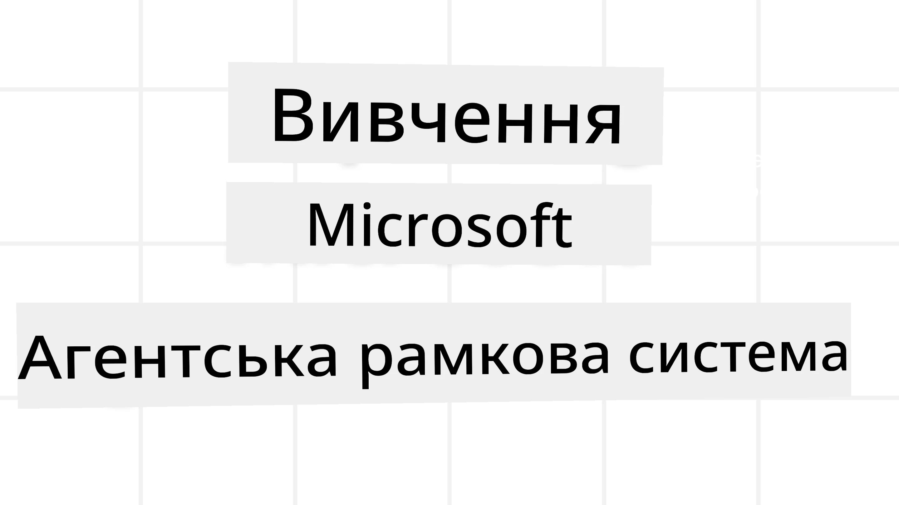
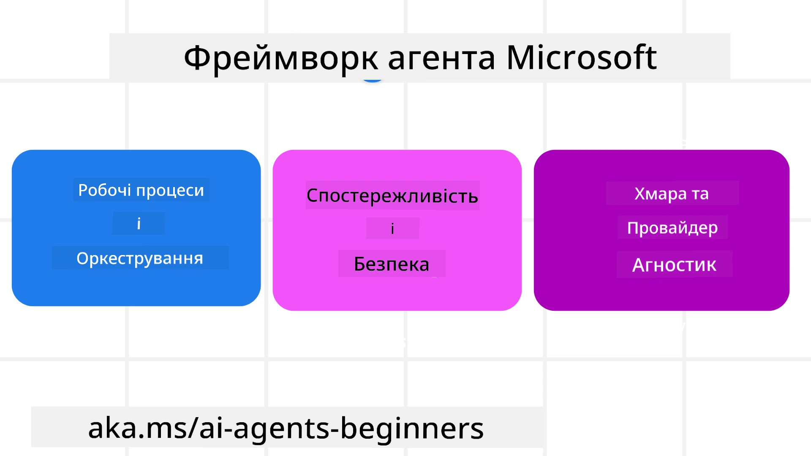
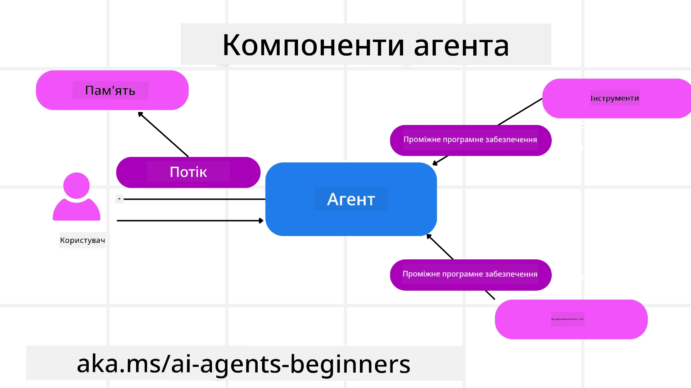

# Дослідження Microsoft Agent Framework



### Вступ

Цей урок охопить:

- Розуміння Microsoft Agent Framework: ключові особливості та цінність  
- Огляд ключових концепцій Microsoft Agent Framework
- Розвинені патерни MAF: робочі процеси, проміжне програмне забезпечення та пам'ять

## Цілі навчання

Після завершення цього уроку ви знатимете, як:

- Створювати готові до виробництва AI агенти за допомогою Microsoft Agent Framework
- Застосовувати основні функції Microsoft Agent Framework для ваших агентських сценаріїв
- Використовувати розвинені патерни, включаючи робочі процеси, проміжне ПЗ і спостережливість

## Приклади коду

Приклади коду для [Microsoft Agent Framework (MAF)](https://learn.microsoft.com/en-us/agent-framework/overview/?wt.mc_id=youtube_26688_organicsocial_reactor&pivots=programming-language-python) можна знайти в цьому репозиторії у файлах `xx-python-agent-framework` і `xx-dotnet-agent-framework`.

## Розуміння Microsoft Agent Framework



[Microsoft Agent Framework (MAF)](https://learn.microsoft.com/en-us/agent-framework/overview/?wt.mc_id=youtube_26688_organicsocial_reactor&pivots=programming-language-python) — це уніфікована платформа Microsoft для створення AI агентів. Вона пропонує гнучкість для вирішення широкого спектру агентських сценаріїв у виробництві та наукових дослідженнях, зокрема:

- **Послідовна оркестрація агентів** у сценаріях, де потрібні покрокові робочі процеси.
- **Паралельна оркестрація** у випадках, коли агенти мають виконувати завдання одночасно.
- **Оркестрація групового чату** у ситуаціях, коли агенти можуть співпрацювати над одним завданням.
- **Оркестрація передач** у випадках, коли агенти передають завдання один одному після завершення підзадач.
- **Магнітна оркестрація** у випадках, коли агент-менеджер створює і змінює список завдань і координує роботу підагентів для їх виконання.

Для розгортання AI Агентів у виробництві MAF також включає функції:

- **Спостережливість** через використання OpenTelemetry, де відстежується кожна дія AI Агента, включно з викликами інструментів, кроками оркестрації, логікою міркувань і моніторингом продуктивності через Microsoft Foundry дашборди.
- **Безпека** завдяки розміщенню агентів безпосередньо в Microsoft Foundry із контролем доступу на основі ролей, обробкою приватних даних і вбудованим захистом контенту.
- **Стійкість** завдяки можливості паузи, відновлення та обробки помилок у потоках агентів і робочих процесах, що дозволяє виконувати тривалі процеси.
- **Контроль** через підтримку робочих процесів із участю людини, де завдання позначаються як ті, що потребують людського погодження.

Microsoft Agent Framework також орієнтований на інтероперабельність через:

- **Незалежність від хмари** — агенти можуть працювати в контейнерах, на локальних серверах та у різних хмарних середовищах.
- **Незалежність від провайдера** — агенти можуть створюватися за допомогою будь-якого улюбленого SDK, зокрема Azure OpenAI і OpenAI.
- **Інтеграцію відкритих стандартів** — агенти можуть використовувати протоколи, такі як Agent-to-Agent (A2A) і Model Context Protocol (MCP) для виявлення та спільного використання інших агентів і інструментів.
- **Плагіни та коннектори** — з'єднання з сервісами даних і пам'яті, такими як Microsoft Fabric, SharePoint, Pinecone і Qdrant.

Розглянемо, як ці функції застосовуються до ключових концепцій Microsoft Agent Framework.

## Ключові концепції Microsoft Agent Framework

### Агенти



**Створення агентів**

Створення агента здійснюється визначенням сервісу інференції (постачальника LLM),
набору інструкцій для AI агента та присвоєнням імені:

```python
agent = AzureOpenAIChatClient(credential=AzureCliCredential()).create_agent( instructions="You are good at recommending trips to customers based on their preferences.", name="TripRecommender" )
```

Вищенаведений приклад використовує `Azure OpenAI`, але агенти можуть створюватися з використанням різних сервісів, включно з `Microsoft Foundry Agent Service`:

```python
AzureAIAgentClient(async_credential=credential).create_agent( name="HelperAgent", instructions="You are a helpful assistant." ) as agent
```

OpenAI `Responses`, `ChatCompletion` API

```python
agent = OpenAIResponsesClient().create_agent( name="WeatherBot", instructions="You are a helpful weather assistant.", )
```

```python
agent = OpenAIChatClient().create_agent( name="HelpfulAssistant", instructions="You are a helpful assistant.", )
```

або [MiniMax](https://platform.minimaxi.com/), що надає OpenAI-сумісний API з великими контекстними вікнами (до 204К токенів):

```python
agent = OpenAIChatClient(base_url="https://api.minimax.io/v1", api_key=os.environ["MINIMAX_API_KEY"], model_id="MiniMax-M3").create_agent( name="HelpfulAssistant", instructions="You are a helpful assistant.", )
```

або віддалені агенти з використанням протоколу A2A:

```python
agent = A2AAgent( name=agent_card.name, description=agent_card.description, agent_card=agent_card, url="https://your-a2a-agent-host" )
```

**Запуск агентів**

Агенти запускаються методами `.run` або `.run_stream` для нестрімінгових або стрімінгових відповідей відповідно.

```python
result = await agent.run("What are good places to visit in Amsterdam?")
print(result.text)
```

```python
async for update in agent.run_stream("What are the good places to visit in Amsterdam?"):
    if update.text:
        print(update.text, end="", flush=True)

```

Для кожного запуску агента можна налаштувати параметри, наприклад `max_tokens`, інструменти `tools`, які агент може викликати, або навіть використовувану модель `model`.

Це корисно, коли для виконання завдання користувача потрібні конкретні моделі або інструменти.

**Інструменти**

Інструменти можна визначати як під час створення агента:

```python
def get_attractions( location: Annotated[str, Field(description="The location to get the top tourist attractions for")], ) -> str: """Get the top tourist attractions for a given location.""" return f"The top attractions for {location} are." 


# При безпосередньому створенні ChatAgent

agent = ChatAgent( chat_client=OpenAIChatClient(), instructions="You are a helpful assistant", tools=[get_attractions]

```

так і під час запуску агента:

```python

result1 = await agent.run( "What's the best place to visit in Seattle?", tools=[get_attractions] # Інструмент надано лише для цього запуску )
```

**Потоки агента**

Потоки агента використовуються для обробки багатокрокових розмов. Потоки можна створювати шляхом:

- Використання `get_new_thread()` для збереження потоку з часом
- Автоматичного створення потоку під час запуску агента, який існує лише під час цього запуску.

Для створення потоку використовується такий код:

```python
# Створити новий потік.
thread = agent.get_new_thread() # Запустити агента з потоком.
response = await agent.run("Hello, I am here to help you book travel. Where would you like to go?", thread=thread)

```

Потім потік можна серіалізувати для подальшого збереження:

```python
# Створити новий потік.
thread = agent.get_new_thread() 

# Запустити агента з потоком.

response = await agent.run("Hello, how are you?", thread=thread) 

# Серіалізувати потік для збереження.

serialized_thread = await thread.serialize() 

# Десеріалізувати стан потоку після завантаження зі сховища.

resumed_thread = await agent.deserialize_thread(serialized_thread)
```

**Проміжне програмне забезпечення агента**

Агенти взаємодіють з інструментами і LLM для виконання завдань користувача. В певних сценаріях ми хочемо виконати або відстежити дії між цими взаємодіями. Проміжне ПЗ агента дозволяє це через:

*Function Middleware*

Це проміжне ПЗ дозволяє виконати дію між агентом і функцією/інструментом, який він викликає. Приклад використання — логування виклику функції.

В коді нижче `next` визначає, слід викликати наступне проміжне ПЗ чи реальну функцію.

```python
async def logging_function_middleware(
    context: FunctionInvocationContext,
    next: Callable[[FunctionInvocationContext], Awaitable[None]],
) -> None:
    """Function middleware that logs function execution."""
    # Попередня обробка: Логування перед виконанням функції
    print(f"[Function] Calling {context.function.name}")

    # Продовжити до наступного middleware або виконання функції
    await next(context)

    # Післяобробка: Логування після виконання функції
    print(f"[Function] {context.function.name} completed")
```

*Chat Middleware*

Це проміжне ПЗ дозволяє виконати або занотувати дію між агентом і запитами до LLM.

Це містить важливу інформацію, таку як `messages`, які надсилаються до AI сервісу.

```python
async def logging_chat_middleware(
    context: ChatContext,
    next: Callable[[ChatContext], Awaitable[None]],
) -> None:
    """Chat middleware that logs AI interactions."""
    # Попередня обробка: Логування перед викликом ШІ
    print(f"[Chat] Sending {len(context.messages)} messages to AI")

    # Продовжити до наступного проміжного програмного забезпечення або сервісу ШІ
    await next(context)

    # Післяобробка: Логування після відповіді ШІ
    print("[Chat] AI response received")

```

**Пам’ять агента**

Як розглянуто в уроці `Agentic Memory`, пам’ять є важливим елементом для роботи агента в різноманітних контекстах. MAF пропонує різні типи пам’яті:

*Пам’ять у процесі*

Це пам’ять, що зберігається у потоках під час роботи додатка.

```python
# Створити новий потік.
thread = agent.get_new_thread() # Запустити агента з потоком.
response = await agent.run("Hello, I am here to help you book travel. Where would you like to go?", thread=thread)
```

*Персистентні повідомлення*

Ця пам’ять використовується для збереження історії розмов між сесіями. Визначається за допомогою `chat_message_store_factory`:

```python
from agent_framework import ChatMessageStore

# Створити власне сховище повідомлень
def create_message_store():
    return ChatMessageStore()

agent = ChatAgent(
    chat_client=OpenAIChatClient(),
    instructions="You are a Travel assistant.",
    chat_message_store_factory=create_message_store
)

```

*Динамічна пам’ять*

Ця пам’ять додається до контексту перед запуском агентів. Її можна зберігати у зовнішніх сервісах, таких як mem0:

```python
from agent_framework.mem0 import Mem0Provider

# Використання Mem0 для розширених можливостей пам'яті
memory_provider = Mem0Provider(
    api_key="your-mem0-api-key",
    user_id="user_123",
    application_id="my_app"
)

agent = ChatAgent(
    chat_client=OpenAIChatClient(),
    instructions="You are a helpful assistant with memory.",
    context_providers=memory_provider
)

```

**Спостережливість агента**

Спостережливість важлива для побудови надійних і підтримуваних агентських систем. MAF інтегрується з OpenTelemetry для трейсингу і метрик для кращої спостережливості.

```python
from agent_framework.observability import get_tracer, get_meter

tracer = get_tracer()
meter = get_meter()
with tracer.start_as_current_span("my_custom_span"):
    # зробити щось
    pass
counter = meter.create_counter("my_custom_counter")
counter.add(1, {"key": "value"})
```

### Робочі процеси

MAF пропонує робочі процеси — це заздалегідь визначені кроки для виконання завдання, які включають AI агентів як компоненти цих кроків.

Робочі процеси складаються з різних компонентів для кращого контролю потоку. Вони також підтримують **оркестрацію кількох агентів** і **чекпойнтинґ** для збереження стану робочого процесу.

Основні компоненти робочого процесу:

**Виконавці**

Виконавці отримують вхідні повідомлення, виконують свої завдання і генерують вихідне повідомлення. Це рухає робочий процес до виконання великого завдання. Виконавцями можуть бути AI агенти або користувацька логіка.

**Зв’язки**

Зв’язки визначають потік повідомлень у робочому процесі. Вони можуть бути:

*Прямі зв’язки* — прості з’єднання «один до одного» між виконавцями:

```python
from agent_framework import WorkflowBuilder

builder = WorkflowBuilder()
builder.add_edge(source_executor, target_executor)
builder.set_start_executor(source_executor)
workflow = builder.build()
```

*Умовні зв’язки* — активуються, коли виконана певна умова. Наприклад, якщо немає вільних готельних номерів, виконавець може запропонувати інші варіанти.

*Перемикачі (switch-case)* — маршрутизують повідомлення до різних виконавців залежно від визначених умов. Наприклад, якщо клієнт подорожі має пріоритетний доступ, його завдання оброблятимуться іншим робочим процесом.

*Відправка на багато адресатів (fan-out)* — надсилає одне повідомлення кільком отримувачам.

*Об’єднання з багатьох джерел (fan-in)* — збирає кілька повідомлень від різних виконавців і надсилає одному отримувачу.

**Події**

Для кращої спостережливості робочих процесів MAF пропонує вбудовані події виконання, зокрема:

- `WorkflowStartedEvent`  - початок виконання робочого процесу
- `WorkflowOutputEvent` - робочий процес створює вихідні дані
- `WorkflowErrorEvent` - робочий процес зіштовхується з помилкою
- `ExecutorInvokeEvent`  - виконавець починає обробку
- `ExecutorCompleteEvent`  - виконавець завершує обробку
- `RequestInfoEvent` - надісланий запит

## Розвинені патерни MAF

Вище описані ключові концепції Microsoft Agent Framework. Під час створення більш складних агентів варто враховувати такі розвинені патерни:

- **Композиція проміжного ПЗ**: Об’єднання декількох обробників (логування, аутентифікація, обмеження частоти) за допомогою функціонального та чат-проміжного ПЗ для тонкого контролю поведінки агента.
- **Чекпойнтинґ робочих процесів**: Використання подій робочого процесу і серіалізації для збереження і відновлення довготривалих процесів агентів.
- **Динамічний вибір інструментів**: Поєднання RAG на основі описів інструментів із реєстрацією інструментів у MAF для представлення лише релевантних інструментів за запитом.
- **Передача між кількома агентами**: Використання зв’язків робочого процесу і умовного маршрутизування для оркестрації передач між спеціалізованими агентами.

## Розміщення агентів LangChain / LangGraph у Microsoft Foundry

Microsoft Agent Framework є **фреймворк-інтероперабельним** — ви не обмежені агентами, написаними з MAF. Якщо у вас вже є агент, створений за допомогою **LangChain** або **LangGraph**, ви можете запускати його як **агент, що розміщується у Microsoft Foundry**, щоб Foundry керувала часом роботи, сесіями, масштабуванням, ідентичністю та кінцевими точками протоколу, а логіка вашого агента залишалася в LangGraph.

Це реалізується за допомогою пакету `langchain_azure_ai.agents.hosting`, який експонує скомпільований граф LangGraph через ті самі протоколи, що використовують агенти, розміщені у Foundry.

**1. Встановіть додаткові модулі для хостингу:**

```bash
pip install -U "langchain-azure-ai[hosting]>=1.2.4" azure-identity
```

Додаток `hosting` встановлює бібліотеки протоколів Foundry: `azure-ai-agentserver-responses` (OpenAI-сумісна кінцева точка `/responses`) і `azure-ai-agentserver-invocations` (загальна кінцева точка `/invocations`).

**2. Оберіть протокол для хостингу:**

| Протокол | Клас хоста | Кінцева точка | Використання |
|----------|-----------|----------|----------|
| **Responses** | `ResponsesHostServer` | `/responses` | Хочете OpenAI-сумісний чат, стрімінг, історію відповідей та потокову підтримку розмов – рекомендований варіант для конверсійних агентів. |
| **Invocations** | `InvocationsHostServer` | `/invocations` | Потрібна кастомна JSON-структура, вебхук-подібна кінцева точка або неконверсійна обробка. |

Оскільки **Responses API є основним API для агентської розробки у Foundry**, починайте з `ResponsesHostServer` для більшості агентів.

**3. Налаштуйте змінні середовища** (спершу `az login`, щоб `DefaultAzureCredential` міг автентифікуватися):

```bash
export FOUNDRY_PROJECT_ENDPOINT="https://<resource>.services.ai.azure.com/api/projects/<project>"
export FOUNDRY_MODEL_NAME="gpt-5-mini"
```

Коли агент пізніше запуститься як розміщений агент у Foundry, платформа автоматично додасть `FOUNDRY_PROJECT_ENDPOINT`.

**4. Використовуйте агента LangGraph через протокол Responses:**

```python
import os

from azure.ai.projects import AIProjectClient
from azure.identity import DefaultAzureCredential, get_bearer_token_provider
from langchain.agents import create_agent
from langchain_openai import ChatOpenAI
from langchain_azure_ai.agents.hosting import ResponsesHostServer

_AZURE_AI_SCOPE = "https://ai.azure.com/.default"


def build_chat_model() -> ChatOpenAI:
    project_endpoint = os.environ["FOUNDRY_PROJECT_ENDPOINT"].rstrip("/")
    deployment = os.environ.get("FOUNDRY_MODEL_NAME", "gpt-5-mini")
    credential = DefaultAzureCredential()
    project = AIProjectClient(endpoint=project_endpoint, credential=credential)
    openai_client = project.get_openai_client()
    token_provider = get_bearer_token_provider(credential, _AZURE_AI_SCOPE)

    # ChatOpenAI тут орієнтований на OpenAI-сумісну кінцеву точку (Responses) проєкту Foundry.
    return ChatOpenAI(
        model=deployment,
        base_url=str(openai_client.base_url),
        api_key=token_provider,
    )


def main() -> None:
    graph = create_agent(build_chat_model(), tools=[])
    port = int(os.environ.get("PORT", "8088"))
    ResponsesHostServer(graph).run(port=port)


if __name__ == "__main__":
    main()
```

Запустіть локально через `python main.py`, а потім надішліть запит Responses на `http://localhost:8088/responses`.

**Основні поведінки:**

- **Розмови**: Клієнти продовжують розмову, передаючи `previous_response_id` або ідентифікатор `conversation`. Якщо ваш граф скомпільовано з чекпойнтером LangGraph, Foundry зберігає стан розмови згідно з чекпойнтом (використовуйте надійний чекпойнтер у виробництві; `MemorySaver` підходить для локального тестування).
- **Людина в циклі**: Якщо ваш граф використовує LangGraph `interrupt()`, `ResponsesHostServer` відображає очікуюче переривання як елемент `function_call` / `mcp_approval_request` у Responses, а клієнти відновлюють роботу з відповіддю `function_call_output` / `mcp_approval_response`.
- **Розгортання у Foundry**: Використання Azure Developer CLI — `azd ext install azure.ai.agents`, `azd ai agent init -m <manifest>`, `azd ai agent run` (локально, вимагає Docker), потім `azd provision` і `azd deploy`. Розгортання розміщеного агента вимагає ролі **Foundry Project Manager**.

Виконуваний приклад цього коду знаходиться в [code-samples/14-langchain-hosted-agent.py](../../../14-microsoft-agent-framework/code-samples/14-langchain-hosted-agent.py). Для повного керівництва (протокол Invocations, кастомні схеми запитів та усунення неполадок) дивіться [Host LangGraph agents as Foundry hosted agents](https://learn.microsoft.com/azure/foundry/how-to/develop/langchain-hosted-agents).

## Приклади коду

Приклади коду для Microsoft Agent Framework можна знайти в цьому репозиторії у файлах `xx-python-agent-framework` і `xx-dotnet-agent-framework`.

## Є ще питання щодо Microsoft Agent Framework?

Приєднуйтеся до [Microsoft Foundry Discord](https://discord.com/invite/ATgtXmAS5D), щоб зустріти інших учнів, відвідувати години консультацій і отримувати відповіді на питання про AI агентів.
## Попередній урок

[Пам’ять для AI агентів](../13-agent-memory/README.md)

## Наступний урок

[Створення агентів для використання комп’ютера (CUA)](../15-browser-use/README.md)

---

<!-- CO-OP TRANSLATOR DISCLAIMER START -->
**Відмова від відповідальності**:
Цей документ було перекладено за допомогою сервісу штучного інтелекту для перекладу [Co-op Translator](https://github.com/Azure/co-op-translator). Хоча ми прагнемо до точності, будь ласка, майте на увазі, що автоматичні переклади можуть містити помилки або неточності. Оригінальний документ рідною мовою слід вважати авторитетним джерелом. Для критично важливої інформації рекомендується професійний людський переклад. Ми не несемо відповідальності за будь-які непорозуміння або неправильні тлумачення, що виникли внаслідок використання цього перекладу.
<!-- CO-OP TRANSLATOR DISCLAIMER END -->