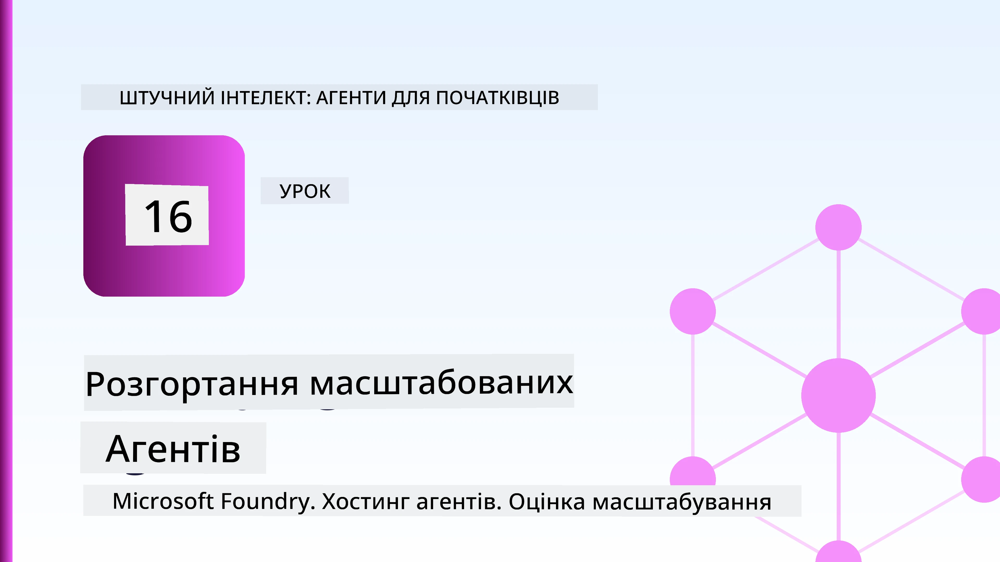
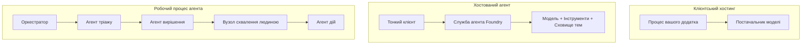
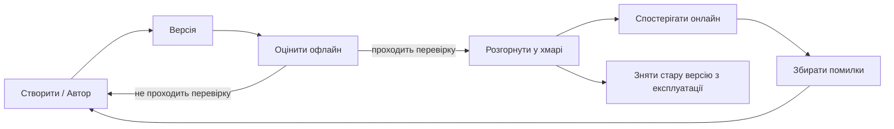
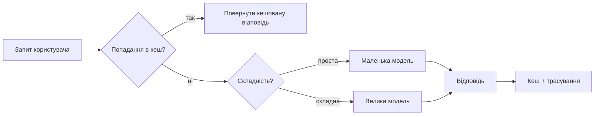
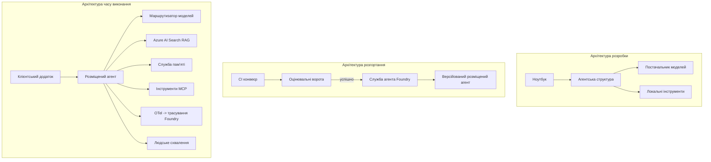

# Розгортання масштабованих агентів з Microsoft Foundry



До цього моменту курсу ви створювали агентів, які працюють на вашому ноутбуці, всередині ноутбука, керовані `az login` та кількома змінними середовища. Це саме той правильний спосіб навчатися. Але це не правильний спосіб запускати агента, на якого покладаються тисячі клієнтів о 3-й годині ночі.

Цей урок про розрив між "в мене на машині працює" і "працює надійно та доступно в продакшені." Ми закриваємо цей розрив за допомогою **Microsoft Foundry** і **Microsoft Foundry Agent Service**, створюючи реального агента підтримки клієнтів з інструментами, отриманням інформації, пам’яттю, оцінкою та моніторингом.

## Вступ

Цей урок охопить:

- Різницю між **агентом-прототипом** та **розгорнутим агентом**, і чому перехід здебільшого стосується всього *навколо* моделі.
- **Шаблони розгортання** агентів: клієнтське розміщення, хостингова служба (Hosted Agents) та оркестровані робочі процеси.
- **Життєвий цикл агента** в Microsoft Foundry — створення, версіювання, розгортання, оцінка, спостереження, виведення з експлуатації.
- **Стратегії масштабування**: маршрутизація моделей, кешування, паралелізм, безстанний дизайн.
- **Спостережливість** за допомогою OpenTelemetry та трасування у Foundry.
- **Оптимізація витрат** через вибір моделі, маршрутизацію та контрольні точки оцінки.
- **Корпоративні аспекти**: управління, людське схвалення та безпечний запуск MCP серверів у продакшені.

## Цілі навчання

Після завершення уроку ви зможете:

- Обрати правильний шаблон розгортання для конкретного навантаження агента.
- Розгорнути агента в Microsoft Foundry Agent Service, щоб він був версійований, керований і спостережуваний.
- Інструментувати агента для трасування і налаштувати пайплайн оцінки, що запускається перед кожним релізом.
- Застосовувати маршрутизацію моделі та кешування для контролю затримок і вартості при масштабуванні.
- Додати людський контроль схвалення для ризикових дій та інтегрувати MCP сервер безпечно у продакшені.

## Вимоги

Цей урок передбачає, що ви пройшли попередні уроки і комфортно працюєте з:

- Побудовою агентів за допомогою [Microsoft Agent Framework](../14-microsoft-agent-framework/README.md) (Урок 14).
- [Використання Інструментів](../04-tool-use/README.md) (Урок 4) та [Agentic RAG](../05-agentic-rag/README.md) (Урок 5).
- [Пам’яттю агента](../13-agent-memory/README.md) (Урок 13) та [Agentic Protocols / MCP](../11-agentic-protocols/README.md) (Урок 11).
- [Спостережливістю та Оцінкою](../10-ai-agents-production/README.md) (Урок 10) — цей урок базується безпосередньо на ньому.

Вам також знадобиться:

- **Підписка Azure** і **проект Microsoft Foundry** з принаймні однією розгорнутою чат-моделлю.
- **Аутентифікований Azure CLI** (`az login`).
- Python 3.12+ та пакунки у репозиторії [`requirements.txt`](../../../requirements.txt).

## Від прототипу до продакшену: що насправді змінюється

Агент-прототип і продакшен-агент мають однаковий базовий цикл — аналіз, виклик інструментів, відповідь. Змінюється все, що обгортає цей цикл. Модель становить близько 20% продакшен-агента; решта 80% — це операційний каркас.

| Питання | Прототип | Продакшен |
| --- | --- | --- |
| **Хостинг** | Працює у вашому ноутбуку | Працює як хостингова служба, версійована та розгорнута |
| **Особистість** | Ваш токен `az login` | Керована ідентичність з обмеженим RBAC |
| **Стан** | В пам’яті, втрачається при перезапуску | Зовнішній (зберігання потоків, сервіс пам’яті) |
| **Помилки** | Ви бачите трасування | Повторні спроби, резервні варіанти, черга "мертвих" повідомлень, сповіщення |
| **Вартість** | «Це кілька центів» | Відслідковується за запитом, маршрутизована, кешована, з бюджетом |
| **Якість** | Ви візуально оцінюєте результат | Автоматично оцінюється перед кожним релізом |
| **Довіра** | Ви схвалюєте кожну дію | Політика + людина у циклі для ризикових дій |

Запам’ятайте цю таблицю. Кожен розділ нижче відповідає одному з рядків.

## Шаблони розгортання агентів

Існує три шаблони, які ви будете використовувати, часто у комбінації.

### 1. Клієнтські агенти

Об’єкт агента живе всередині *вашого* процесу застосунку. Ваш код прямо викликає провайдера моделі; цикл роздумів працює у вашій службі. Це те, що було у кожному попередньому уроці.

- **Використовуйте, коли** вам потрібен повний контроль над циклом, власне проміжне програмне забезпечення або ви вбудовуєте агента у наявний бекенд.
- **Компроміс**: ви самі відповідаєте за масштабування, стан і стійкість.

### 2. Хостингові агенти (Foundry Agent Service)

Агент *зареєстрований як ресурс* у Microsoft Foundry. Foundry керує циклом роздумів, зберігає потоки, забезпечує безпеку контенту і RBAC, робить агента видимим у порталі Foundry. Ваш застосунок стає тонким клієнтом, що створює потоки і читає відповіді.

- **Використовуйте, коли** хочете надійність, вбудовану спостережливість, управління й менше операційної площі.
- **Компроміс**: менше низькорівневого контролю в обмін на керований рантайм.

### 3. Робочі процеси агента

Кілька агентів (та інструментів) складаються в граф з явним керуванням потоком — послідовні кроки, розгалуження, вузли схвалення людиною, довготривалі контрольні точки, що можуть призупинятися і відновлюватися. Це можливість Microsoft Agent Framework **Workflows**, застосована у масштабі розгортання.

- **Використовуйте, коли** одна задача охоплює кілька спеціалізованих агентів або потребує кроку схвалення посередині.
- **Компроміс**: більше рухомих частин; потрібна спостережливість на рівні оркестрації.



## Життєвий цикл агента в Microsoft Foundry

Розгортання агента — це не одноразовий `push`. Це цикл, який дуже схожий на цикл випуску програмного забезпечення, адже саме так і є насправді.



Ключова ідея, взята з [Уроку 10](../10-ai-agents-production/README.md): **оффлайн оцінка — це контрольно-пропускний пункт, а не післямова.** Нова версія агента не розповсюджується, доки не пройде ваші пороги оцінки. Онлайн спостережність потім повертає справжні помилки у ваш оффлайн тестовий набір. Ось і весь цикл.

## Стратегії масштабування

Масштабування агента відрізняється від масштабування безстанного веб-API, бо кожен запит може ініціювати кілька дорогих викликів моделей і інструментів. Чотири техніки несуть більшість навантаження.

**Обробка безстанних запитів.** Не зберігайте стан для користувача у пам’яті процесу. Зберігайте потоки бесід у сховищі потоків Foundry або сервісі пам’яті, щоб будь-який екземпляр міг обробити будь-який запит. Це дозволяє масштабуватися горизонтально — додавати екземпляри, без прив’язки сесій.

**Маршрутизація моделі.** Не кожен запит вимагає вашої найпотужнішої (і найдорогої) моделі. Направляйте прості запити — класифікацію наміру, короткі фактичні відповіді — до маленької, швидкої моделі, а велику модель залишайте для справжніх роздумів. Foundry's **Model Router** може зробити це за вас, або ви можете реалізувати легкий класифікатор самостійно. Ви побудуєте DIY-версію у лабораторії.

**Кешування відповідей.** Багато запитів підтримки майже дублікати («як скинути пароль?»). Кешуйте відповіді на типові питання і подавайте їх без звернення до моделі. Навіть скромний відсоток попадання в кеш значно зменшує вартість і затримку.

**Паралелізм і зворотний тиск.** Провайдери моделей мають обмеження пропускної здатності. Обмежуйте паралелізм, використовуйте повторні спроби з експоненційним збільшенням інтервалу і коректно обробляйте збої (черга з повідомленням «ми працюємо над цим» краща за помилку 500).



## Спостережливість у продакшені

Ви не можете керувати тим, що не бачите. Як описано в Уроці 10, Microsoft Agent Framework нативно видає **OpenTelemetry** трейси — кожен виклик моделі, запуск інструменту, крок оркестрації стає спеном. У продакшені ви експортуєте ці спени до Microsoft Foundry (або будь-якого бекенду, сумісного з OTel), щоб ви могли:

- Відслідковувати один запит клієнта наскрізь через кожен виклик моделі та інструменту.
- Спостерігати латентність p50/p95 і вартість за запит у часі.
- Отримувати сповіщення про сплески помилок і аномалії вартості раніше за користувачів (або ваш фінансовий департамент).

```python
from agent_framework.observability import get_tracer

tracer = get_tracer()

with tracer.start_as_current_span("support_request") as span:
    span.set_attribute("customer.tier", "enterprise")
    span.set_attribute("routed.model", "gpt-5-nano")
    # виконання агента відслідковується автоматично всередині цього проміжку
```

Атрибути, такі як `customer.tier` та `routed.model`, перетворюють гору трейсерів на відповіді на конкретні питання («чи отримують корпоративні клієнти надто часто маршрутизацію на маленьку модель?»).

## Оптимізація витрат

Вартість у продакшен-агентах домінує за токенами. Три важелі, за ступенем впливу:

1. **Правильно підбирайте модель.** Невелика модель, що проходить ваше оцінювання, майже завжди дешевша за велику, яка теж проходить. Використовуйте оцінку, щоб *довести*, що маленька модель досить добра, а не замовчувати найбільшу з обережності.
2. **Маршрутизація за складністю.** Як вище — сплачуйте ціну великої моделі тільки за запити, що потребують великої моделі для роздумів.
3. **Агресивне кешування.** Найдешевший виклик моделі — той, що ви ніколи не робите.

Контрольні точки оцінювання і контроль вартості — це одна й та ж дисципліна, розглянута з двох боків: оцінка показує вам *нижню межу якості*, маршрутизація та кешування тримають вас якомога ближче до *вартості* цієї межі.

## Корпоративні аспекти розгортання

**Управління.** Hosted Agents успадковують RBAC, безпеку контенту та логування аудиту Foundry. Дайте кожному агенту керовану ідентичність з мінімальними привілеями — доступ лише для читання бази знань, обмежений доступ до API роботи з тікетами, нічого більше.

**Людина у циклі.** Деякі дії надто важливі, щоб повністю їх автоматизувати — видача повернення грошей, видалення аккаунта, ескалація до юридичного відділу. Microsoft Agent Framework підтримує інструменти з **обов’язковим схваленням**: агент пропонує дію, її виконання призупиняється, людина схвалює або відхиляє, і робочий процес відновлюється. Ви бачили цю примітиву у [Уроці 6](../06-building-trustworthy-agents/README.md); тут ви розгортаєте її.

**MCP у продакшені.** [MCP](../11-agentic-protocols/README.md) дозволяє вашому агенту використовувати зовнішні інструменти через стандартний інтерфейс. У продакшені розглядайте кожен MCP сервер як недовірену межу: зафіксуйте версію сервера, запускайте з обмеженою ідентичністю, валідируйте вихідні дані та ніколи не передавайте секрети. MCP сервер — це залежність, які регулярно оновлюються, аудитується і мають обмеження пропускної здатності.



Ці три діаграми — розробка, розгортання, виконання — це один агент на трьох етапах його життя. Лабораторна робота, що слідує, проведе вас через його побудову.

## Практична лабораторна робота: Агент підтримки клієнтів, готовий до продакшена

Відкрийте [`code_samples/16-python-agent-framework.ipynb`](./code_samples/16-python-agent-framework.ipynb) та пройдіть його повністю. Ви зберете **агента підтримки клієнтів Contoso** з усіма виробничими аспектами:

1. **Виклик інструментів** — перевірка статусу замовлення та відкриття квитків підтримки.
2. **RAG** — відповіді на політичні питання з бази знань (Azure AI Search з кешем у пам’яті, щоб ноутбук працював без Search ресурсу).
3. **Пам’ять** — запам’ятовувати клієнта через ходи бесіди.
4. **Маршрутизація моделі** — класифікатор складності направляє кожен запит до маленької або великої моделі.
5. **Кешування відповідей** — повторні питання подаються з кешу.
6. **Людське схвалення** — повернення понад поріг чекають на підпис людини.
7. **Пайплайн оцінки** — невеликий офлайн тестовий набір оцінює агента і слугує контрольною точкою для релізу.
8. **Спостережливість** — OpenTelemetry трасування навколо кожного запиту.

### Покроковий огляд

Ноутбук організований так, що кожен виробничий аспект — це автономна, виконувана секція. Серцем є обробник запитів із маршрутизацією і кешуванням:

```python
async def handle_support_request(query: str, customer_id: str) -> str:
    # 1. Обслуговувати з кешу, коли це можливо.
    cached = response_cache.get(normalize(query))
    if cached:
        return cached

    # 2. Маршрутизувати за складністю для контролю вартості.
    model = "gpt-5-nano" if is_simple(query) else "gpt-5-mini"

    # 3. Запускати агент всередині сліду для спостережності.
    with tracer.start_as_current_span("support_request") as span:
        span.set_attribute("routed.model", model)
        span.set_attribute("customer.id", customer_id)
        response = await support_agent.run(query, model=model)

    # 4. Кешувати та повертати.
    response_cache.set(normalize(query), response.text)
    return response.text
```

Контрольно-пропускний пункт оцінки, що захищає реліз, виглядає так:

```python
async def evaluation_gate(agent, test_cases, threshold: float = 0.8) -> bool:
    passed = 0
    for case in test_cases:
        result = await agent.run(case["input"])
        if score_response(result.text, case["expected"]) >= 0.8:
            passed += 1
    pass_rate = passed / len(test_cases)
    print(f"Evaluation pass rate: {pass_rate:.0%} (gate: {threshold:.0%})")
    return pass_rate >= threshold  # розгортати тільки якщо ворота пройшли перевірку
```

Читайте кожен рядок — ноутбук тримає примітиви навмисно маленькими, щоб нічого не було приховано за викликом фреймворку.

## Валідація розгорнутого агента за допомогою Smoke тестів

Контрольно-пропускний пункт оцінки вище запускається *офлайн* для вашого об’єкта агента. Після розгортання як Hosted Agent вам потрібна ще одна, простіша перевірка: **чи дійсно відповідає розгорнутий кінцевий точок?**

«Успішне» розгортання доводить лише те, що керуюча площина прийняла визначення — це не доводить, що агент відповідає. Відсутність залежності, помилкова маршрутизація моделі чи прострочене з’єднання можуть залишити зелений деплой, що нічого не повертає. **Smoke тест** виявляє це за секунди, при кожному розгортанні, без повної вартості оцінки.

Цей репозиторій поставляє готовий до використання пайплайн smoke-тестів, побудований на основі GitHub Action [AI Smoke Test](https://github.com/marketplace/actions/ai-smoke-test):

- **Каталог** — [`tests/lesson-16-smoke-tests.json`](../../../tests/lesson-16-smoke-tests.json) містить запити і твердження для агента підтримки Contoso (відповіді на базі політики, перевірка замовлення, дотримання теми, та послідовність багатокрокового потоку). Каталоги інших агентів уроків розташовані поруч — дивіться [`tests/README.md`](../tests/README.md).
- **Робочий процес** — [`.github/workflows/smoke-test.yml`](../../../.github/workflows/smoke-test.yml) автентифікується через Azure OIDC і надсилає POST кожного запиту на endpoint Відповідей агента, провалюючи роботу за будь-яке невідповідність.

```yaml
- name: Smoke-test hosted agent
  uses: JFolberth/ai-smoketest@v1
  with:
    project_endpoint: ${{ inputs.project_endpoint }}
    agent_name: ContosoSupportAgent
    tests_file: tests/lesson-16-smoke-tests.json
```


Запустіть його з вкладки **Actions**, коли ваш агент розгорнутий, вказавши кінцеву точку проекту Foundry і ім’я агента. Федеративна ідентичність повинна мати роль **Azure AI User** у межах проекту Foundry. Уявіть собі шари як піраміду: smoke-тести (чи доступний і чи відповідає?) запускаються при кожному розгортанні, офлайн-оцінка (чи достатньо хороша для релізу?) виконується перед підвищенням версії, а онлайн-оцінка (як він працює в реальному середовищі?) запускається безперервно.

## Перевірка знань

Перевірте свої знання перед тим, як перейти до завдання.

**1. Приблизно скільки відсотків виробничого агента становить "модель", і що решта?**

<details>
<summary>Відповідь</summary>

Модель — це меншість системи — часто вважають близько 20%. Решта — це операційний каркас: хостинг і версіонування, ідентичність і RBAC, зовнішній стан, обробка збоїв, відстеження витрат, оцінка і ручне управління за участю людини. Перехід у виробництво в основному полягає у створенні всього *навколо* циклу розмірковування.
</details>

**2. Коли варто обрати Hosted Agent замість агента, що працює на клієнті?**

<details>
<summary>Відповідь</summary>

Коли ви хочете керований runtime із вбудованою надійністю (потоки, що зберігаються і можуть відновлюватися), спостережуваністю, безпекою контенту та RBAC, і ви готові пожертвувати деяким низькорівневим контролем циклу розмірковування заради меншої операційної поверхні. Агент на клієнті краще, якщо потрібен повний контроль над циклом або агент впроваджується в існуючий бекенд.
</details>

**3. Чому масштабований агент має бути безстанним у власній пам’яті процесу?**

<details>
<summary>Відповідь</summary>

Щоб будь-який екземпляр міг обробляти будь-який запит, що дозволяє горизонтальне масштабування без липких сесій. Стан розмови кожного користувача винесено у сховище потоків або сервіс пам’яті. Якщо стан зберігався б у пам’яті процесу, його втрачали б при перезапуску і не було б можливості вільно розподіляти навантаження.
</details>

**4. Яку проблему розв’язує маршрутизація моделі, і як вона пов’язана з оцінкою?**

<details>
<summary>Відповідь</summary>

Маршрутизація направляє прості запити до малої, дешевої, швидкої моделі і резервує велику модель для справжнього розмірковування, контролюючи і затримку, і вартість. Вона пов’язана з оцінкою, оскільки саме оцінка *показує*, що мала модель достатньо хороша для певного типу запитів — маршрутизація без оцінки — це вгадування.
</details>

**5. Що таке "ворота оцінки" і на якому етапі життєвого циклу вони знаходяться?**

<details>
<summary>Відповідь</summary>

Ворота оцінки запускають офлайн тестовий набір для нової версії агента і блокують розгортання, якщо показник проходження не перевищує поріг. Вони знаходяться між «версією» і «розгортанням» у життєвому циклі, роблячи якість передумовою для релізу, а не тим, що перевіряється після запуску.
</details>

**6. Чому сервер MCP слід вважати недовіреним кордоном у виробництві?**

<details>
<summary>Відповідь</summary>

Тому що це зовнішня залежність, до якої звертається ваш агент. Ви маєте фіксувати її версію, запускати з обмеженою ідентичністю, перевіряти її вихідні дані, обмежувати частоту запитів і ніколи не передавати їй секрети — цю ж дисципліну застосовують до будь-якої залежності третьої сторони. Її вихідні дані впливають на розмірковування агента, тому неперевірена довіра — це ризик для безпеки.
</details>

**7. Яка зміна зазвичай найсильніше впливає на вартість виробничого агента і чому?**

<details>
<summary>Відповідь</summary>

Вибір правильного розміру моделі — використання найменшої моделі, яка все ще проходить ваші ворота оцінки. Вартість домінує за кількістю токенів, і менша модель, що відповідає вимогам якості, майже завжди дешевша за більшу. Кешування і маршрутизація додатково знижують вартість, але вибір базової моделі має найбільший ефект першого порядку.
</details>

**8. Яку роль відіграють атрибути спану, такі як `customer.tier` та `routed.model`, у спостережуваності?**

<details>
<summary>Відповідь</summary>

Вони перетворюють сирі трейсити на відповіді на бізнес-питання. Без атрибутів у вас є стіна спанів; з ними ви можете запитати "чи часто корпоративних клієнтів направляють до маленької моделі?" або "яка модель обробляє наші найповільніші запити?" Атрибути — це спосіб поділити телеметрію за вимірами, важливими для вашої роботи.
</details>

## Завдання

Візьміть агента підтримки клієнтів із лабораторії та захистіть його для конкретного сценарію: **агент підтримки з оплатою за підпискою для SaaS-компанії.**

Ваше завдання має:

1. **Замінити інструменти** на відповідні до оплати: `get_subscription_status`, `get_invoice` та `issue_credit` (кредити понад $50 потребують затвердження людиною).
2. **Додати три документи RAG**, що охоплюють політику повернень компанії, цикл оплати та політику скасування.
3. **Розширити набір оцінювання** до принаймні восьми випадків, у т.ч. двох, що *повинні* активувати шлях ручного затвердження, і підтвердити, що ворота оцінки правильно пропускають або блокують.
4. **Додати один звіт про витрати**: після запуску десяти змішаних запитів через агента, надрукувати, скільки пішло до маленької моделі, скільки до великої, і скільки обслуговано з кешу.

Напишіть короткий абзац (у markdown-клітинці), пояснюючи, яке правило маршрутизації моделі ви обрали і як би ви його валідовували на реальному трафіку. Однозначної правильної відповіді немає — вас оцінюють за тим, наскільки виробничі міркування цілісно зв’язані.

## Підсумок

У цьому уроці ви перенесли агента від прототипу до виробництва за допомогою Microsoft Foundry:

- Перехід у виробництво в основному про **операційний скелет** навколо моделі — хостинг, ідентичність, стан, обробку збоїв, вартість, якість і довіру.
- Ви дізналися про три **шаблони розгортання** — клієнтський хостинг, Hosted Agents та Agent Workflows — і коли кожен підходить.
- Ви пройшли через **життєвий цикл агента**, де офлайн **оцінка виступає воротами релізу**, а онлайн-спостереження повертає збої назад у тестовий набір.
- Ви застосували **стратегії масштабування** — безстанність, маршрутизацію моделей, кешування та обмежену паралельність — і пов’язали їх з **оптимізацією вартості**.
- Ви інтегрували **корпоративний контроль**: RBAC, ручне затвердження і безпечну в продукції інтеграцію MCP.
- Ви створили **агента підтримки клієнтів, готового до виробництва**, який поєднує всі ці аспекти у працездатному коді.

Наступний урок пройде у зворотному напрямку: замість масштабування агентів у хмару, ви опустите їх *на* один комп’ютер розробника і запустите повністю локально.

## Додаткові ресурси

- <a href="https://learn.microsoft.com/azure/ai-foundry/what-is-azure-ai-foundry" target="_blank">Документація Microsoft Foundry</a>
- <a href="https://learn.microsoft.com/azure/ai-foundry/agents/overview" target="_blank">Огляд служби Microsoft Foundry Agent</a>
- <a href="https://learn.microsoft.com/en-us/agent-framework/overview/?wt.mc_id=youtube_26688_organicsocial_reactor&pivots=programming-language-python" target="_blank">Microsoft Agent Framework</a>
- <a href="https://learn.microsoft.com/azure/ai-foundry/concepts/model-router" target="_blank">Model Router у Microsoft Foundry</a>
- <a href="https://learn.microsoft.com/azure/search/search-what-is-azure-search" target="_blank">Azure AI Search</a>
- <a href="https://opentelemetry.io/" target="_blank">OpenTelemetry</a>
- <a href="https://github.com/marketplace/actions/ai-smoke-test" target="_blank">AI Smoke Test GitHub Action</a>
- <a href="https://modelcontextprotocol.io/" target="_blank">Model Context Protocol (MCP)</a>

## Попередній урок

[Створення агентів для використання комп’ютера (CUA)](../15-browser-use/README.md)

## Наступний урок

[Створення локальних AI агентів](../17-creating-local-ai-agents/README.md)

---

<!-- CO-OP TRANSLATOR DISCLAIMER START -->
**Відмова від відповідальності**:
Цей документ було перекладено за допомогою сервісу штучного інтелекту для перекладу [Co-op Translator](https://github.com/Azure/co-op-translator). Хоча ми прагнемо до точності, будь ласка, майте на увазі, що автоматичні переклади можуть містити помилки або неточності. Оригінальний документ рідною мовою слід вважати авторитетним джерелом. Для критично важливої інформації рекомендується професійний людський переклад. Ми не несемо відповідальності за будь-які непорозуміння або неправильні тлумачення, що виникли внаслідок використання цього перекладу.
<!-- CO-OP TRANSLATOR DISCLAIMER END -->