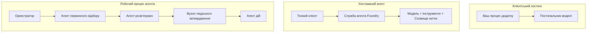
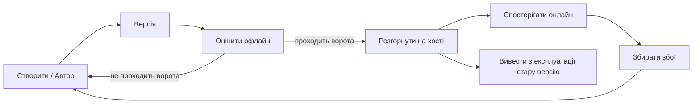
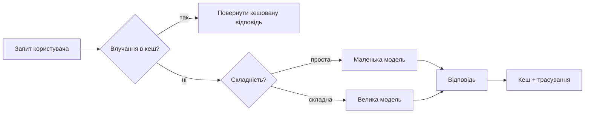
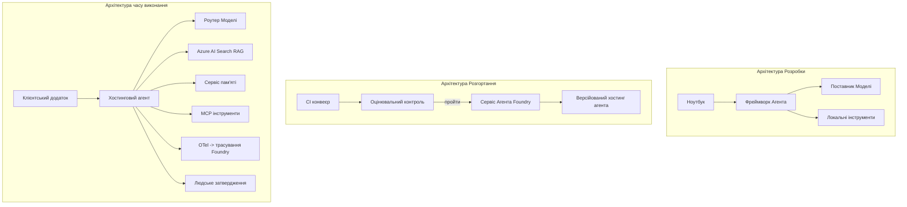

# Розгортання масштабованих агентів за допомогою Microsoft Foundry


До цього моменту курсу ви створювали агентів, які запускаються на вашому ноутбуці, всередині блокнота, керовані за допомогою `az login` та кількох змінних середовища. Це саме той правильний спосіб навчання. Але це не правильний спосіб запускати агента, від якого залежать тисячі клієнтів о 3-й годині ночі.

Цей урок стосується розриву між «вийшло на моїй машині» і «працює надійно та доступно в продакшені». Ми долаємо цей розрив, використовуючи **Microsoft Foundry** і **Microsoft Foundry Agent Service**, і робимо це, створюючи реального агента підтримки клієнтів із інструментами, пошуком, пам’яттю, оцінкою та моніторингом.

## Вступ

У цьому уроці буде розглянуто:

- Різницю між **прототипом агента** та **розгорнутим агентом**, і чому перехід стосується переважно всього, що *навколо* моделі.
- **Патерни розгортання** агентів: розміщення на клієнті, розміщення у сервісі (Hosted Agents) та оркестровані робочі процеси.
- **Життєвий цикл агента** у Microsoft Foundry — створення, версіонування, розгортання, оцінка, спостереження, зняття з експлуатації.
- **Стратегії масштабування**: маршрутизація моделей, кешування, паралелізм і безстанова архітектура.
- **Спостережливість** із OpenTelemetry та трасування Foundry.
- **Оптимізація витрат** через вибір моделі, маршрутизацію та контроль оцінки.
- **Корпоративні аспекти**: управління, людське підтвердження, безпечна робота серверів MCP у продакшені.

## Цілі навчання

Після цього уроку ви знатимете, як:

- Вибрати правильний патерн розгортання для навантаження агента.
- Розгорнути агента у Microsoft Foundry Agent Service, щоб він був версіонований, під керуванням і видимим.
- Інструментувати агента для трасування і налаштувати конвеєр оцінки, який запускається перед кожним випуском.
- Застосовувати маршрутизацію моделей і кешування, щоб контролювати затримки і витрати у масштабі.
- Додати людське підтвердження для дій із високим ризиком і інтегрувати MCP сервер у безпечний для продакшену спосіб.

## Попередні знання

Для цього уроку передбачається, що ви пройшли попередні уроки й впевнено:

- Створюєте агентів за допомогою [Microsoft Agent Framework](../14-microsoft-agent-framework/README.md) (Урок 14).
- Використовуєте [Tool Use](../04-tool-use/README.md) (Урок 4) і [Agentic RAG](../05-agentic-rag/README.md) (Урок 5).
- Розумієте [Agent Memory](../13-agent-memory/README.md) (Урок 13) та [Agentic Protocols / MCP](../11-agentic-protocols/README.md) (Урок 11).
- Знайомі з [Observability and Evaluation](../10-ai-agents-production/README.md) (Урок 10) — цей урок безпосередньо на ньому базується.

Вам також знадобиться:

- **Підписка Azure** і **проект Microsoft Foundry** з принаймні однією розгорнутою моделлю для чату.
- Авторизація через **Azure CLI** (`az login`).
- Python 3.12+ та пакети з репозиторію [`requirements.txt`](../../../requirements.txt).

## Від прототипу до продакшену: що фактично змінюється

Прототип агента і продакшен-агент мають однаковий базовий цикл — мислити, викликати інструменти, відповідати. Змінюється все, що обгортає цей цикл. Модель — це десь 20% продакшен-агента; решта 80% — це операційний скелет.

| Аспект | Прототип | Продакшен |
| --- | --- | --- |
| **Хостинг** | Запускається у вашому блокноті | Запускається як хостинова служба, версіонується і розгортається поступово |
| **Особистість** | Ваш токен `az login` | Керована особистість з обмеженим RBAC |
| **Стан** | В пам’яті, втрачається при перезапуску | Зовнішнє сховище (потокове сховище, сервіс пам’яті) |
| **Збої** | Ви бачите трасування помилки | Повторні спроби, запасні варіанти, "мертві листи", сповіщення |
| **Витрати** | «Це кілька центів» | Відстежуються за запитом, маршрутизуються, кешуються, бюджетуються |
| **Якість** | Ви візуально оцінюєте вивід | Оцінка автоматична перед кожним релізом |
| **Довіра** | Ви схвалюєте кожну дію | Політика + людське підтвердження для ризикових дій |

Запам’ятайте цю таблицю. Кожний розділ нижче відповідає одному з рядків.

## Патерни розгортання агентів

Існує три патерни, які ви будете часто комбінувати.

### 1. Агенти, розміщені на клієнті

Об’єкт агента живе всередині *вашого* процесу додатку. Ваш код викликає провайдера моделі напряму; цикл мислення працює у вашому сервісі. Саме так працювали всі попередні уроки.

- **Використовуйте, коли** потрібен повний контроль циклу, власний проміжний шар або впровадження агента у існуючий бекенд.
- **Компроміс**: ви самі керуєте масштабуванням, станом і стійкістю.

### 2. Хостингові агенти (Foundry Agent Service)

Агент *зареєстрований як ресурс* у Microsoft Foundry. Foundry запускає цикл мислення, зберігає потоки, забезпечує безпеку контенту та RBAC, робить агента видимим у порталі Foundry. Ваш додаток стає тонким клієнтом, який створює потоки і читає відповіді.

- **Використовуйте, коли** потрібна стійкість, вбудована спостережливість, управління і менша операційна площа.
- **Компроміс**: менший контроль на низькому рівні в обмін на кероване середовище виконання.

### 3. Робочі процеси агента

Кілька агентів (і інструментів) об’єднуються у граф із явним керуванням потоком — послідовні кроки, розгалуження, вузли з підтвердженням людиною, довговічні контрольні точки, які можна призупинити і відновити. Це можливість **Робочих процесів** Microsoft Agent Framework, застосована до масштабу розгортання.

- **Використовуйте, коли** одне завдання охоплює кілька спеціалізованих агентів або вимагає проміжного кроку підтвердження.
- **Компроміс**: більше рухомих частин; потрібна спостережливість на рівні оркестрації.



## Життєвий цикл агента у Microsoft Foundry

Розгортання агента — це не одноразовий `push`. Це цикл, і він дуже схожий на цикл випуску програмного забезпечення, бо воно саме так і є.



Ключова ідея, запозичена з [Урок 10](../10-ai-agents-production/README.md): **оцінка офлайн — це ворота, а не думка наостанок.** Нова версія агента не виходить у реліз, якщо не проходить пороги оцінки. Спостереження онлайн потім подає реальні збої назад у офлайн-набір тестів. Оце і є весь цикл.

## Стратегії масштабування

Масштабування агента відрізняється від масштабування безстатевого веб-API, бо кожен запит може ініціювати кілька дорогих викликів моделей і інструментів. Чотири техніки несуть основне навантаження.

**Обробка без стану.** Не зберігайте стан користувача у пам’яті процесу. Зберігайте нитки розмов у сховищі ниток Foundry або сервісі пам’яті, щоб будь-який екземпляр міг обробити будь-який запит. Це дозволяє масштабуватися горизонтально — додайте екземпляри, без прив’язки сесій.

**Маршрутизація моделей.** Не кожен запит потребує найпотужнішу (і найдорожчу) модель. Направляйте прості запити — класифікацію намірів, короткі фактологічні відповіді — до малої, швидкої моделі, а велику модель залишайте для справжнього мислення. Foundry має **Model Router** для цього, або ви можете реалізувати легкий класифікатор самі. Ви створите власну версію у лабораторній роботі.

**Кешування відповідей.** Багато запитів у підтримці — майже дублікати («як скинути пароль?»). Кешуйте відповіді на типові питання і подавайте їх без звернення до моделі взагалі. Навіть помітний відсоток попадань у кеш суттєво знижує витрати і затримку.

**Паралелізм і зворотний тиск.** Постачальники моделей мають ліміти частоти запитів. Обмежуйте паралелізм, використовуйте повторні спроби з експоненціальним відступом і спрацьовуйте м’яко (черга «ми працюємо над цим» краща за 500 помилку).



## Спостережливість у продакшені

Ви не можете керувати тим, чого не бачите. Як описано в Уроці 10, Microsoft Agent Framework нативно генерує **OpenTelemetry** трейси — кожен виклик моделі, виклик інструменту і крок оркестрації стають спаном. У продакшені ці спани експортують у Microsoft Foundry (або будь-який бекенд, сумісний з OTel), щоб ви могли:

- Відстежувати окрему скаргу клієнта наскрізь через усі виклики моделей і інструментів.
- Спостерігати затримки p50/p95 і вартість на запит з часом.
- Сигналізувати про спалахи помилок і аномалії вартості раніше за користувачів (або вашу фінансову команду).

```python
from agent_framework.observability import get_tracer

tracer = get_tracer()

with tracer.start_as_current_span("support_request") as span:
    span.set_attribute("customer.tier", "enterprise")
    span.set_attribute("routed.model", "gpt-5-nano")
    # виконання агента автоматично відстежується всередині цього проміжку
```

Атрибути, як `customer.tier` і `routed.model`, перетворюють стіну трас у відповіді на запитання («чи занадто часто корпоративних клієнтів направляють до малої моделі?»).

## Оптимізація витрат

Витрати у продакшен-агентів здебільшого залежать від токенів. Є три важелі за ступенем впливу:

1. **Правильний розмір моделі.** Мала модель, яка проходить вашу оцінку, майже завжди дешевша за велику модель, яка теж проходить. Використовуйте оцінку, щоб *довести*, що мала модель достатньо хороша, а не за замовчуванням брати найбільшу з обережності.
2. **Маршрутизація за складністю.** Як вище — платіть за велику модель лише за запити, які потребують мислення великою моделью.
3. **Агресивне кешування.** Найдешевший виклик моделі — це той, який ви не робите.

Ворота оцінки та контроль витрат — це одна дисципліна з двох сторін: оцінка визначає *якісний рівень*, маршрутизація і кешування тримають вас максимально близько до *витрат* цього рівня.

## Корпоративні аспекти розгортання

**Управління.** Hosted Agents успадковують RBAC, безпеку контенту і аудит Foundry. Давайте кожному агенту керовану особистість із мінімальними правами — лише читання бази знань, обмежений доступ до API тикетів, нічого більше.

**Людина у циклі.** Деякі дії надто важливі для повної автоматизації — повернення коштів, видалення акаунту, ескалація до юридичного відділу. Microsoft Agent Framework підтримує інструменти з **підтвердженням**: агент пропонує дію, її виконання призупиняється, людина схвалює або відхиляє, і робочий процес продовжується. Ви бачили цей примітив у [Уроці 6](../06-building-trustworthy-agents/README.md); тут ви його розгортаєте.

**MCP у продакшені.** [MCP](../11-agentic-protocols/README.md) дозволяє агенту використовувати зовнішні інструменти через стандартний інтерфейс. У продакшені кожен MCP сервер — це недовірений кордон: зафіксуйте версію сервера, запускайте з обмеженою особистістю, перевіряйте його результати та ніколи не виставляйте секрети. MCP сервер — це залежність, а залежності патчать, аудитується і обмежують за частотою.



Ці три діаграми — розробка, розгортання, запуск — це один агент на трьох етапах його життя. Наступна лабораторна робота проведе вас через процес створення.

## Практична лабораторна робота: Готовий до продакшену агент підтримки клієнтів

Відкрийте [`code_samples/16-python-agent-framework.ipynb`](./code_samples/16-python-agent-framework.ipynb) і пройдіть його повністю. Ви зберете **агента підтримки клієнтів Contoso** з усіма виробничими аспектами:

1. **Виклик інструментів** — перевірка статусу замовлення і відкриття заявок у підтримку.
2. **RAG** — відповіді на політичні питання з бази знань (Azure AI Search, з резервним варіантом у пам’яті, щоб блокнот працював без ресурсу Search).
3. **Пам’ять** — запам’ятовування клієнта між ходами бесіди.
4. **Маршрутизація моделі** — класифікатор складності направляє кожен запит до малої чи великої моделі.
5. **Кешування відповідей** — повторні питання повертаються з кешу.
6. **Людське підтвердження** — повернення понад поріг чекає на підтвердження людиною.
7. **Конвеєр оцінки** — невеликий офлайн тестовий набір оцінює агента й слугує воротами релізу.
8. **Спостережливість** — OpenTelemetry траси навколо кожного запиту.

### Покрокова інструкція

Блокнот організований так, щоб кожен виробничий аспект був самостійним, виконуваним розділом. Серцем є обробник запитів із маршрутизацією та кешуванням:

```python
async def handle_support_request(query: str, customer_id: str) -> str:
    # 1. Обслуговувати з кешу, коли це можливо.
    cached = response_cache.get(normalize(query))
    if cached:
        return cached

    # 2. Маршрутизувати за складністю для контролю вартості.
    model = "gpt-5-nano" if is_simple(query) else "gpt-5-mini"

    # 3. Запускати агент всередині відрізка трасування для спостережуваності.
    with tracer.start_as_current_span("support_request") as span:
        span.set_attribute("routed.model", model)
        span.set_attribute("customer.id", customer_id)
        response = await support_agent.run(query, model=model)

    # 4. Кешувати та повертати.
    response_cache.set(normalize(query), response.text)
    return response.text
```

Ворота оцінки, які охороняють реліз, виглядають так:

```python
async def evaluation_gate(agent, test_cases, threshold: float = 0.8) -> bool:
    passed = 0
    for case in test_cases:
        result = await agent.run(case["input"])
        if score_response(result.text, case["expected"]) >= 0.8:
            passed += 1
    pass_rate = passed / len(test_cases)
    print(f"Evaluation pass rate: {pass_rate:.0%} (gate: {threshold:.0%})")
    return pass_rate >= threshold  # розгортати лише якщо контроль пройдено
```

Читайте кожен рядок — блокнот робить примітиви свідомо маленькими, щоб нічого не було приховано за викликами фреймворку.

## Перевірка розгорнутого агента за допомогою смок-тестів

Ворота оцінки вище запускаються *офлайн* на вашому об’єкті агента. Після розгортання агента як Hosted Agent потрібна ще одна, ще дешевша перевірка: **чи відповідає розгорнутий кінцевий пункт?**

«Успішне» розгортання лише підтверджує, що керуюча площина прийняла визначення — це не доводить, що агент відповідає. Відсутня залежність, неправильна маршрутизація моделі або прострочене з’єднання можуть залишити зелений реліз, що нічого не повертає. **Смок-тест** виявить це за секунди, кожного разу при розгортанні, без витрат повної оцінки.

У цьому репозиторії є готовий до використання конвеєр смок-тестів, побудований на базі GitHub Action [AI Smoke Test](https://github.com/marketplace/actions/ai-smoke-test):

- **Каталог** — [`tests/lesson-16-smoke-tests.json`](../../../tests/lesson-16-smoke-tests.json) містить промпти і твердження для агента підтримки Contoso (запитання з політики, перевірка замовлення, дотримання теми та континуїтет багатокрокової бесіди). Каталоги агентів інших уроків розташовані поруч — див. [`tests/README.md`](../tests/README.md).
- **Робочий процес** — [`.github/workflows/smoke-test.yml`](../../../.github/workflows/smoke-test.yml) виконує вхід через Azure OIDC і POST-ить кожен промпт до кінцевої точки Responses агента, провалюючи прогон при будь-якому невідповідності твердження.

```yaml
- name: Smoke-test hosted agent
  uses: JFolberth/ai-smoketest@v1
  with:
    project_endpoint: ${{ inputs.project_endpoint }}
    agent_name: ContosoSupportAgent
    tests_file: tests/lesson-16-smoke-tests.json
```


Запустіть це з вкладки **Actions** після розгортання вашого агента, вказавши кінцеву точку проекту Foundry та ім'я агента. Федеративна ідентичність повинна мати роль **Azure AI User** у межах проекту Foundry. Уявіть шари як піраміду: smoke-тести (доступний і відповідає?) виконуються при кожному розгортанні, офлайн оцінка (достатньо добра для відправки?) — перед підвищенням, а онлайн оцінка (як він працює у реальному середовищі?) — безперервно.

## Перевірка знань

Перевірте свої знання перед переходом до завдання.

**1. Приблизно яка частина продуктивного агента — це «модель», і що таке решта?**

<details>
<summary>Відповідь</summary>

Модель — це меншість системи — часто називають близько 20%. Решта — це операційний скелет: хостинг і версіонування, ідентичність і RBAC, зовнішній стан, обробка відмов, відстеження витрат, оцінка та керування участю людини в циклі. Перехід у продакшн здебільшого полягає у побудові всього *навколо* циклу розмірковування.
</details>

**2. Коли ви оберете Hosted Agent замість агента, розміщеного на клієнтській стороні?**

<details>
<summary>Відповідь</summary>

Коли ви хочете кероване середовище виконання з вбудованою надійністю (потоки, що зберігаються і можуть поновлюватися), спостережуваністю, безпекою контенту та RBAC, і готові пожертвувати частиною низькорівневого контролю циклу розмірковування заради меншої операційної площі. Клієнтське хостинг є кращим вибором, коли потрібен повний контроль над циклом або агент вбудовується в існуючий бекенд.
</details>

**3. Чому масштабований агент має бути безстанним у власній оперативній пам'яті процесу?**

<details>
<summary>Відповідь</summary>

Щоб будь-який екземпляр міг обробити будь-який запит, що дозволяє горизонтальне масштабування без липких сесій. Стан розмови для користувача винесено у зовнішнє сховище потоків або сервіс пам'яті. Якщо стан був би в процесній пам’яті, ви б втрачали його при перезапуску і не змогли б вільно розподіляти навантаження.
</details>

**4. Яку проблему розв’язує маршрутизація моделей і як вона пов’язана з оцінкою?**

<details>
<summary>Відповідь</summary>

Маршрутизація надсилає прості запити до невеликої, дешевого, швидкої моделі і залишає велику модель для справжнього розмірковування, контролюючи затримку та вартість. Вона пов’язана з оцінкою, тому що оцінка — це те, що *доказує*, що маленька модель достатньо хороша для певного класу запитів — маршрутизація без оцінки — це здогадка.
</details>

**5. Що таке «вузол оцінки» і де він розташований у життєвому циклі?**

<details>
<summary>Відповідь</summary>

Вузол оцінки запускає офлайн набір тестів на новій версії агента і блокує розгортання, якщо коефіцієнт проходження не досягає порогу. Він розташований між «версією» і «розгортанням» у життєвому циклі, роблячи якість передумовою випуску, а не тим, що перевіряється після запуску.
</details>

**6. Чому сервер MCP слід вважати недовіреною межею у продакшні?**

<details>
<summary>Відповідь</summary>

Тому що це зовнішня залежність, до якої звертається ваш агент. Ви повинні зафіксувати його версію, запускати з обмеженою ідентичністю, перевіряти його вихідні дані, обмежувати пропускну здатність і ніколи не відкривати йому секрети — ту ж дисципліну, що застосовуєте до будь-якої сторонньої залежності. Його вихідні дані впливають на розмірковування агента, тож незатверджена довіра є ризиком безпеки.
</details>

**7. Яка одна зміна зазвичай має найбільший вплив на вартість продуктивного агента і чому?**

<details>
<summary>Відповідь</summary>

Правильний вибір розміру моделі — використання найменшої моделі, яка все ще проходить ваш вузол оцінки. Вартість домінує токенам, і менша модель, що відповідає вимогам якості, майже завжди дешевша за більшу. Кешування і маршрутизація тоді ще знижують вартість, але вибір правильної базової моделі має найбільший первинний ефект.
</details>

**8. Яку роль відіграють атрибути span, такі як `customer.tier` і `routed.model`, для спостережуваності?**

<details>
<summary>Відповідь</summary>

Вони перетворюють сирі трасування на запитувані бізнес-питання. Без атрибутів у вас стіна span; з ними ви можете запитати: «чи часто клієнти з корпоративного рівня направляються до маленької моделі?» або «яка модель обслуговує наші найповільніші запити?» Атрибути — це спосіб розрізняти телеметрію за вимірами, які мають значення для вашої операції.
</details>

## Завдання

Візьміть агента підтримки клієнтів із лабораторної роботи і захистіть його для конкретного сценарію: **агент підтримки з питань підписки для SaaS-компанії.**

Ваше завдання має:

1. **Замінити інструменти** на релевантні білінгу: `get_subscription_status`, `get_invoice` і `issue_credit` (кредити понад $50 потребують затвердження людиною).
2. **Додати три RAG документи**, які охоплюють політику повернення коштів компанії, білінговий цикл і політику скасування.
3. **Розширити набір оцінки** до щонайменше восьми випадків, у тому числі щонайменше два, які *повинні* активувати шлях затвердження людиною, і підтвердити, що ваш вузол оцінки правильно проходить або не проходить.
4. **Додати один звіт про вартість**: після запуску десяти змішаних запитів через агента виведіть, скільки з них було направлено до маленької моделі, скільки до великої моделі та скільки обслуговувалося з кешу.

Напишіть короткий абзац (у markdown-клітинці), що пояснює, яке правило маршрутизації моделі ви вибрали і як ви його валідували б на реальному трафіку. Однозначної правильної відповіді немає — вас оцінюють за логічність поєднання продуктивних аспектів.

## Підсумок

У цьому уроці ви перевели агента з прототипу у продакшн з Microsoft Foundry:

- Перехід у продакшн здебільшого стосується **операційного скелету** навколо моделі — хостинг, ідентичність, стан, обробка відмов, вартість, якість і довіра.
- Ви дізналися три **шаблони розгортання** — клієнтське хостинг, Hosted Agents і Agent Workflows — і коли кожен із них підходить.
- Ви пройшли **життєвий цикл агента**, де офлайн **оцінка служить вузлом релізу**, а онлайн спостережуваність повертає помилки у набір тестів.
- Ви застосували **стратегії масштабування** — безстанний дизайн, маршрутизація моделей, кешування та обмежену конкуруність — і пов’язали їх із **оптимізацією вартості**.
- Ви впровадили **корпоративний контроль**: RBAC, затвердження людиною в циклі, та безпечну інтеграцію MCP у продакшн.
- Ви створили **агента підтримки клієнтів, готового до продакшн**, який пов’язує всі ці аспекти в робочому коді.

Наступний урок пройде протилежним шляхом: замість масштабування агентів у хмара, ви занесете їх *назад* на одну машину розробника і запустите повністю локально.

## Додаткові ресурси

- <a href="https://learn.microsoft.com/azure/ai-foundry/what-is-azure-ai-foundry" target="_blank">Документація Microsoft Foundry</a>
- <a href="https://learn.microsoft.com/azure/ai-foundry/agents/overview" target="_blank">Огляд служби агентів Microsoft Foundry</a>
- <a href="https://learn.microsoft.com/en-us/agent-framework/overview/?wt.mc_id=youtube_26688_organicsocial_reactor&pivots=programming-language-python" target="_blank">Microsoft Agent Framework</a>
- <a href="https://learn.microsoft.com/azure/ai-foundry/concepts/model-router" target="_blank">Маршрутизатор моделей у Microsoft Foundry</a>
- <a href="https://learn.microsoft.com/azure/search/search-what-is-azure-search" target="_blank">Azure AI Search</a>
- <a href="https://opentelemetry.io/" target="_blank">OpenTelemetry</a>
- <a href="https://github.com/marketplace/actions/ai-smoke-test" target="_blank">GitHub Action AI Smoke Test</a>
- <a href="https://modelcontextprotocol.io/" target="_blank">Model Context Protocol (MCP)</a>

## Попередній урок

[Створення агентов користувача комп'ютера (CUA)](../15-browser-use/README.md)

## Наступний урок

[Створення локальних AI-агентів](../17-creating-local-ai-agents/README.md)

---

<!-- CO-OP TRANSLATOR DISCLAIMER START -->
**Відмова від відповідальності**:
Цей документ було перекладено за допомогою сервісу штучного інтелекту для перекладу [Co-op Translator](https://github.com/Azure/co-op-translator). Хоча ми прагнемо до точності, будь ласка, майте на увазі, що автоматичні переклади можуть містити помилки або неточності. Оригінальний документ рідною мовою слід вважати авторитетним джерелом. Для критично важливої інформації рекомендується професійний людський переклад. Ми не несемо відповідальності за будь-які непорозуміння або неправильні тлумачення, що виникли внаслідок використання цього перекладу.
<!-- CO-OP TRANSLATOR DISCLAIMER END -->